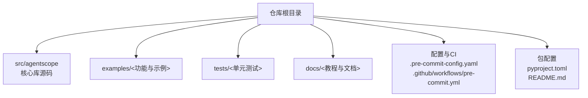
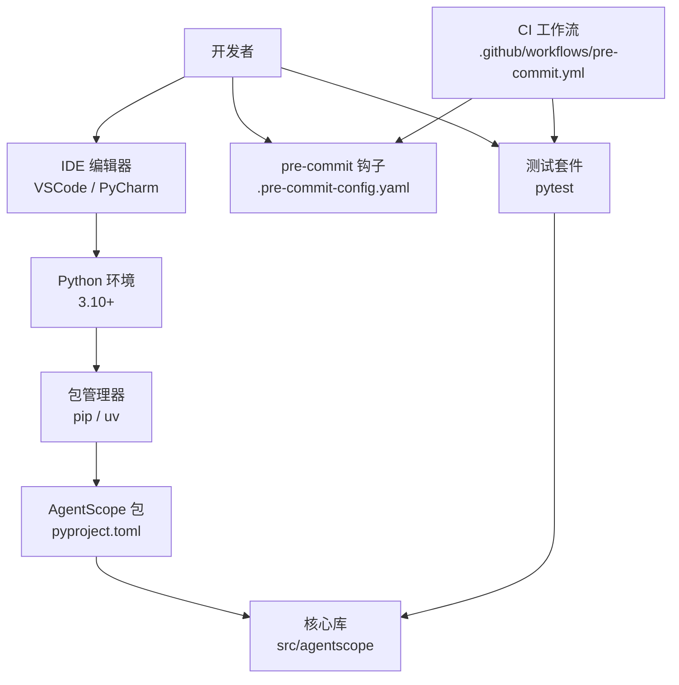
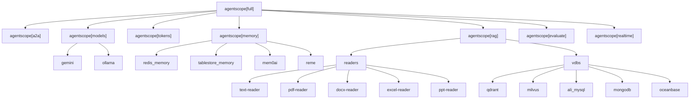

# 开发环境搭建

<cite>
**本文引用的文件**   
- [README.md](file://README.md)
- [CONTRIBUTING.md](file://CONTRIBUTING.md)
- [pyproject.toml](file://pyproject.toml)
- [.pre-commit-config.yaml](file://.pre-commit-config.yaml)
- [pre-commit 工作流](file://.github/workflows/pre-commit.yml)
- [ReAct 示例入口](file://examples/agent/react_agent/main.py)
- [A2A 示例入口](file://examples/agent/a2a_agent/main.py)
- [ReAct 单元测试](file://tests/react_agent_test.py)
- [工具模块单元测试](file://tests/tool_test.py)
- [配置模块单元测试](file://tests/config_test.py)
- [运行配置](file://src/agentscope/_run_config.py)
</cite>

## 目录
1. [简介](#简介)
2. [项目结构](#项目结构)
3. [核心组件](#核心组件)
4. [架构总览](#架构总览)
5. [详细组件分析](#详细组件分析)
6. [依赖分析](#依赖分析)
7. [性能考虑](#性能考虑)
8. [故障排查指南](#故障排查指南)
9. [结论](#结论)
10. [附录](#附录)

## 简介
本指南面向希望在本地搭建 AgentScope 开发环境的开发者，覆盖系统与 Python 版本要求、依赖管理（主依赖、可选依赖、开发依赖）、pre-commit 钩子安装与配置、IDE 推荐配置（VSCode、PyCharm）、调试环境设置（断点调试、日志与追踪）、示例与测试运行方法，以及常见问题排查。

## 项目结构
仓库采用“源码在 src 下、示例在 examples 下、测试在 tests 下”的清晰分层组织，便于开发者快速定位核心库、示例与测试代码。

图示来源
- [pyproject.toml:1-214](file://pyproject.toml#L1-L214)
- [README.md:1-409](file://README.md#L1-L409)

章节来源
- [pyproject.toml:1-214](file://pyproject.toml#L1-L214)
- [README.md:1-409](file://README.md#L1-L409)

## 核心组件
- 包与版本：项目要求 Python 3.10+，核心库通过 setuptools 构建，动态版本由源码模块提供。
- 主要依赖：包含异步迭代、多模型 SDK、向量检索、OpenTelemetry、实时语音、数据库访问等。
- 可选依赖：按功能域拆分，如 A2A 协议、实时语音、模型扩展、RAG、评估、调优等。
- 开发依赖：包含 pre-commit、pytest、Sphinx 文档工具链、mock 与 GPU 调优相关工具等。

章节来源
- [README.md:139-165](file://README.md#L139-L165)
- [pyproject.toml:22-45](file://pyproject.toml#L22-L45)
- [pyproject.toml:47-194](file://pyproject.toml#L47-L194)

## 架构总览
下图展示开发环境的关键组成与交互关系：包管理器负责安装主/可选/开发依赖；IDE 提供编辑与调试；pre-commit 在提交前执行静态检查与格式化；GitHub Actions 在 CI 中复现相同流程。

图示来源
- [pyproject.toml:1-214](file://pyproject.toml#L1-L214)
- [.pre-commit-config.yaml:1-108](file://.pre-commit-config.yaml#L1-L108)
- [.github 工作流:1-38](file://.github/workflows/pre-commit.yml#L1-L38)

## 详细组件分析

### 系统与 Python 版本要求
- Python 版本：项目要求 Python 3.10 或更高版本。
- 建议使用虚拟环境隔离依赖，避免与系统或其他项目冲突。

章节来源
- [README.md:139-140](file://README.md#L139-L140)
- [pyproject.toml:21](file://pyproject.toml#L21)

### 依赖管理（主依赖、可选依赖、开发依赖）
- 主依赖（运行时必需）：涵盖异步处理、多模型 SDK、向量化与嵌入、OpenTelemetry 观测、实时语音、数据库 ORM 等。
- 可选依赖（按功能域拆分）：
  - A2A 协议：a2a
  - 实时语音：realtime
  - 模型扩展：gemini、ollama、models
  - 分词与模板：tokens
  - 内存后端：redis_memory、tablestore_memory、mem0ai、reme、memory
  - RAG：readers、vdbs、rag
  - 评估：evaluate
  - 调优：tuner、tuner-gpu
  - 全量：full（组合上述可选依赖）
- 开发依赖（dev）：在 full 的基础上增加 pre-commit、pytest、Sphinx 文档工具链、mock 与 GPU 调优相关工具等。

安装方式建议
- 从源码安装（可编辑模式）以支持本地修改即时生效。
- 如需完整功能，可安装全量可选依赖组。
- 使用 uv 作为替代包管理器时，遵循项目中给出的命令风格。

章节来源
- [README.md:153-165](file://README.md#L153-L165)
- [pyproject.toml:22-45](file://pyproject.toml#L22-L45)
- [pyproject.toml:47-194](file://pyproject.toml#L47-L194)

### pre-commit 钩子安装与配置
- 安装与初始化：先安装 pre-commit，再在仓库中执行安装命令以启用钩子。
- 钩子清单与规则：
  - AST/格式/校验：check-ast、check-json、check-yaml、check-toml、check-xml、check-docstring-first、sort-simple-yaml
  - 格式化：black（行宽限制）
  - 类型检查：mypy（忽略部分路径与错误类型）
  - 静态检查：flake8（忽略特定规则）、pylint（忽略大量路径与规则）
  - 包质量：pyroma
- 运行方式：可在提交前自动触发，或手动对全部文件运行以批量修复。

章节来源
- [CONTRIBUTING.md:98-110](file://CONTRIBUTING.md#L98-L110)
- [.pre-commit-config.yaml:1-108](file://.pre-commit-config.yaml#L1-L108)
- [.github 工作流:24-37](file://.github/workflows/pre-commit.yml#L24-L37)

### IDE 配置建议（VSCode、PyCharm）
- VSCode
  - Python 解释器：选择已创建的 Python 3.10+ 虚拟环境。
  - 扩展：推荐安装 Python、Pylance、Black、Flake8、pre-commit 插件以获得更好的格式化与静态检查体验。
  - 调试：使用 launch.json 配置，针对示例脚本设置参数与工作目录。
- PyCharm
  - Interpreter：指向同一 Python 3.10+ 环境。
  - 代码风格：启用 Black 与 PEP8 风格检查；可配置 pylint/flake8 作为外部工具。
  - 测试运行：使用内置 pytest 配置，或在运行配置中指定 tests 目录。
- 通用建议
  - 启用“在保存时格式化”（配合 Black）。
  - 将 .pre-commit-config.yaml 中的忽略规则与 IDE 规则保持一致，减少重复报错。

（本节为通用实践建议，不直接分析具体文件）

### 调试环境设置（断点调试、日志与追踪）
- 断点调试
  - 使用 asyncio 事件循环的示例脚本（如 ReAct 示例）可直接在 IDE 中设置断点并运行。
  - 对于并发/异步测试，可参考单元测试中的异步测试基类与任务封装方式。
- 日志与追踪
  - 运行配置对象提供 run_id、project、name、trace_enabled 等字段，可用于统一追踪与日志标识。
  - OpenTelemetry 作为可选依赖，可结合项目中的追踪模块进行可观测性增强。

章节来源
- [ReAct 示例入口:18-50](file://examples/agent/react_agent/main.py#L18-L50)
- [运行配置:46-73](file://src/agentscope/_run_config.py#L46-L73)

### 运行示例与测试用例
- 示例运行
  - ReAct Agent 示例：进入示例目录，确保已安装依赖并在环境中配置必要的 API 密钥后运行主入口脚本。
  - A2A Agent 示例：同样在示例目录运行主入口脚本。
- 测试运行
  - 使用 pytest 运行 tests 目录下的所有测试；也可针对特定模块运行。
  - 单元测试示例：ReAct 单元测试、工具模块测试、配置模块测试等均采用异步测试基类与模拟对象。

章节来源
- [ReAct 示例入口:1-51](file://examples/agent/react_agent/main.py#L1-L51)
- [A2A 示例入口:1-28](file://examples/agent/a2a_agent/main.py#L1-L28)
- [ReAct 单元测试:96-192](file://tests/react_agent_test.py#L96-L192)
- [工具模块单元测试:21-366](file://tests/tool_test.py#L21-L366)
- [配置模块单元测试:50-52](file://tests/config_test.py#L50-L52)

## 依赖分析
下图展示可选依赖的分组与组合关系，帮助理解“全量功能”安装路径。

图示来源
- [pyproject.toml:47-170](file://pyproject.toml#L47-L170)

章节来源
- [pyproject.toml:47-170](file://pyproject.toml#L47-L170)

## 性能考虑
- 依赖体量：可选功能较多，建议仅安装所需子集以缩短安装时间与降低资源占用。
- 异步与并发：核心库广泛使用异步编程，测试与示例也采用 asyncio，建议在本地与 CI 中统一 Python 版本与依赖版本，避免异步行为差异。
- 静态检查：mypy/flake8/pylint 的严格规则有助于早期发现潜在性能与可维护性问题，但可能带来额外的本地检查时间成本。

（本节为通用指导，不直接分析具体文件）

## 故障排查指南
- Python 版本不匹配
  - 症状：安装失败或导入异常。
  - 处理：确认使用 Python 3.10+，并重新创建虚拟环境。
- 依赖冲突
  - 症状：安装过程中出现版本冲突或回退。
  - 处理：优先使用项目提供的可选依赖组合；必要时固定版本（如 pyproject.toml 中已对部分包做了版本约束）。
- pre-commit 失败
  - 症状：提交被阻止或 CI 报错。
  - 处理：先在本地运行 pre-commit 全量检查并修复；关注 black、flake8、pylint、mypy 的输出。
- 测试无法运行
  - 症状：pytest 找不到测试或异步测试报错。
  - 处理：确保安装了开发依赖；使用异步测试基类与正确的事件循环；检查示例脚本中的 API 密钥是否正确配置。
- 追踪与日志
  - 症状：缺少运行标识或追踪信息。
  - 处理：通过运行配置对象设置 run_id、project、name，并根据需要开启 trace_enabled。

章节来源
- [.pre-commit-config.yaml:1-108](file://.pre-commit-config.yaml#L1-L108)
- [.github 工作流:24-37](file://.github/workflows/pre-commit.yml#L24-L37)
- [ReAct 单元测试:96-192](file://tests/react_agent_test.py#L96-L192)
- [工具模块单元测试:21-366](file://tests/tool_test.py#L21-L366)
- [运行配置:46-73](file://src/agentscope/_run_config.py#L46-L73)

## 结论
通过遵循本指南，您可以快速完成 AgentScope 的开发环境搭建：满足 Python 版本要求、按需安装主/可选/开发依赖、启用并配置 pre-commit、在 VSCode/PyCharm 中完成断点调试与日志追踪、运行示例与测试，并具备排查常见问题的能力。建议在团队协作中统一依赖版本与代码规范，以提升开发效率与一致性。

## 附录

### 快速安装步骤（示例）
- 创建并激活 Python 3.10+ 虚拟环境。
- 从源码安装（可编辑模式）。
- 安装开发依赖（含 pre-commit、pytest 等）。
- 初始化并运行 pre-commit 钩子。
- 运行示例与测试验证环境。

章节来源
- [README.md:153-165](file://README.md#L153-L165)
- [CONTRIBUTING.md:98-110](file://CONTRIBUTING.md#L98-L110)
- [pyproject.toml:172-194](file://pyproject.toml#L172-L194)