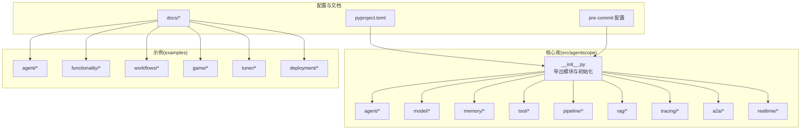
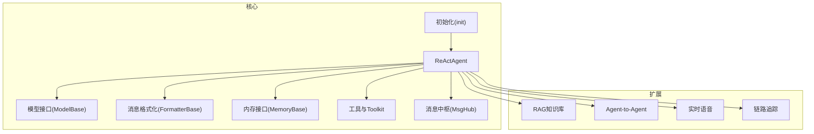
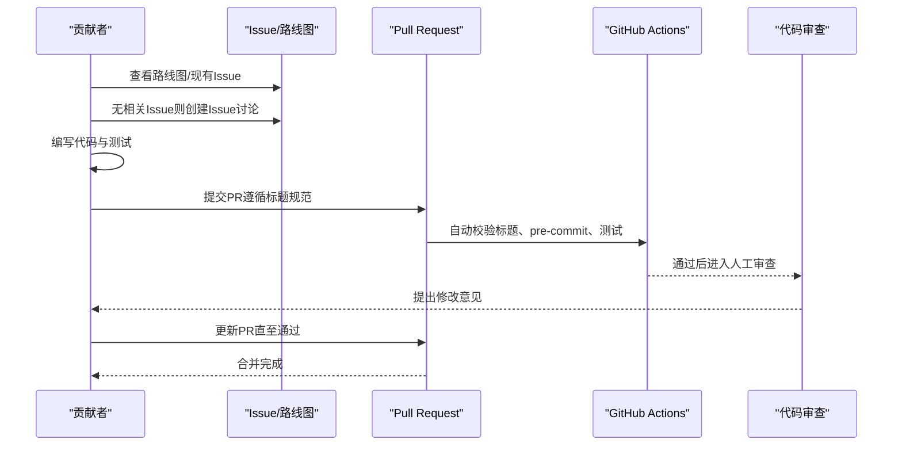
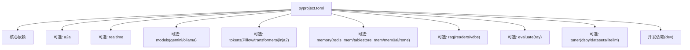

# 开发者指南

<cite>
**本文引用的文件**
- [CONTRIBUTING.md](file://CONTRIBUTING.md)
- [CONTRIBUTING_zh.md](file://CONTRIBUTING_zh.md)
- [README.md](file://README.md)
- [README_zh.md](file://README_zh.md)
- [.pre-commit-config.yaml](file://.pre-commit-config.yaml)
- [.github/PULL_REQUEST_TEMPLATE.md](file://.github/PULL_REQUEST_TEMPLATE.md)
- [.github/copilot-instructions.md](file://.github/copilot-instructions.md)
- [pyproject.toml](file://pyproject.toml)
- [src/agentscope/__init__.py](file://src/agentscope/__init__.py)
- [src/agentscope/_version.py](file://src/agentscope/_version.py)
- [docs/roadmap.md](file://docs/roadmap.md)
- [docs/NEWS.md](file://docs/NEWS.md)
- [examples/agent/react_agent/main.py](file://examples/agent/react_agent/main.py)
- [examples/functionality/rag/basic_usage.py](file://examples/functionality/rag/basic_usage.py)
- [AGENTS.md](file://AGENTS.md)
</cite>

## 目录
1. [简介](#简介)
2. [项目结构](#项目结构)
3. [核心组件](#核心组件)
4. [架构总览](#架构总览)
5. [详细组件分析](#详细组件分析)
6. [依赖分析](#依赖分析)
7. [性能考量](#性能考量)
8. [故障排查指南](#故障排查指南)
9. [结论](#结论)
10. [附录](#附录)

## 简介
本指南面向AgentScope的贡献者与维护者，系统阐述贡献流程、开发环境搭建、测试策略、发布流程、架构设计原则、代码风格与命名规范、常见问题与最佳实践，以及社区参与方式。内容基于仓库内的贡献指南、README、配置文件与示例代码整理而成，力求帮助不同背景的开发者快速上手并高质量贡献。

## 项目结构
AgentScope采用模块化分层设计，核心代码位于src/agentscope下，按功能域划分子模块（如agent、model、memory、tool、pipeline、tracing、rag等）。测试覆盖各模块，示例集中在examples目录，文档与路线图位于docs目录。项目通过pyproject.toml集中管理依赖与可选特性，通过.pre-commit配置保证代码质量。

图表来源
- [src/agentscope/__init__.py:43-66](file://src/agentscope/__init__.py#L43-L66)
- [pyproject.toml:22-45](file://pyproject.toml#L22-L45)
- [docs/roadmap.md:1-121](file://docs/roadmap.md#L1-L121)

章节来源
- [README.md:108-133](file://README.md#L108-L133)
- [pyproject.toml:22-45](file://pyproject.toml#L22-L45)
- [src/agentscope/__init__.py:43-66](file://src/agentscope/__init__.py#L43-L66)

## 核心组件
- 初始化与全局配置：通过全局上下文变量管理运行期配置，支持日志、Studio连接与链路追踪初始化。
- 版本管理：版本号由动态属性从版本文件读取，便于CI/CD注入。
- 模块导出：集中导出各子模块，控制公开接口，遵循“内部以下划线命名”的封装原则。

章节来源
- [src/agentscope/__init__.py:72-157](file://src/agentscope/__init__.py#L72-L157)
- [src/agentscope/_version.py:4-5](file://src/agentscope/_version.py#L4-L5)

## 架构总览
AgentScope强调“模块化、可组合、向后兼容”的设计原则。核心模块围绕ReActAgent展开，通过formatter、model、memory、tool、pipeline等插件化组件协同工作；同时提供A2A、实时语音、RAG、评估与微调等扩展能力。依赖通过可选特性分层，避免核心库臃肿。

图表来源
- [src/agentscope/__init__.py:43-66](file://src/agentscope/__init__.py#L43-L66)
- [pyproject.toml:47-170](file://pyproject.toml#L47-L170)

章节来源
- [README.md:66-77](file://README.md#L66-L77)
- [pyproject.toml:47-170](file://pyproject.toml#L47-L170)

## 详细组件分析

### 贡献流程与PR规范
- 问题与规划：优先查看路线图与现有Issue，避免重复劳动；无相关Issue时先开Issue讨论。
- 提交信息：遵循Conventional Commits，明确type/scope/subject。
- PR标题：与Conventional Commits一致，自动校验在main分支上生效。
- 代码质量：安装并运行pre-commit钩子，确保格式化、静态检查与安全扫描通过。
- 测试：新增功能配套单元测试，确保现有测试通过。
- 文档：更新相关文档与示例，必要时更新README。

图表来源
- [CONTRIBUTING.md:13-26](file://CONTRIBUTING.md#L13-L26)
- [CONTRIBUTING.md:28-91](file://CONTRIBUTING.md#L28-L91)
- [.github/PULL_REQUEST_TEMPLATE.md:1-25](file://.github/PULL_REQUEST_TEMPLATE.md#L1-L25)
- [.github/copilot-instructions.md:90-96](file://.github/copilot-instructions.md#L90-L96)

章节来源
- [CONTRIBUTING.md:9-132](file://CONTRIBUTING.md#L9-L132)
- [.github/PULL_REQUEST_TEMPLATE.md:1-25](file://.github/PULL_REQUEST_TEMPLATE.md#L1-L25)
- [.github/copilot-instructions.md:1-96](file://.github/copilot-instructions.md#L1-L96)

### 开发环境搭建
- 环境要求：Python 3.10+。
- 安装方式：从PyPI或源码安装，推荐可编辑安装以便本地开发。
- 依赖管理：核心依赖与可选特性在pyproject.toml中定义；可选择安装全量依赖或按需安装。
- 开发依赖：dev分组包含pytest、sphinx、fakeredis等工具，便于本地测试与文档构建。
- 代码质量：安装pre-commit并启用钩子，提交前自动执行格式化与静态检查。

章节来源
- [README.md:137-165](file://README.md#L137-L165)
- [pyproject.toml:172-194](file://pyproject.toml#L172-L194)
- [.pre-commit-config.yaml:1-108](file://.pre-commit-config.yaml#L1-L108)

### 测试策略
- 单元测试：pytest驱动，覆盖各模块功能；示例中包含异步测试与工具函数注册。
- 集成测试：通过examples中的端到端示例验证模块组合效果（如RAG检索、ReActAgent对话）。
- 覆盖率：仓库未显式声明覆盖率门槛，建议在PR中关注关键路径与边界条件的测试。
- 异步与并发：示例普遍使用asyncio，测试时注意事件循环与并发执行。

章节来源
- [examples/agent/react_agent/main.py:1-51](file://examples/agent/react_agent/main.py#L1-L51)
- [examples/functionality/rag/basic_usage.py:1-80](file://examples/functionality/rag/basic_usage.py#L1-L80)

### 发布流程与版本管理
- 版本号：通过动态属性从版本文件读取，便于CI注入。
- 变更日志：news条目集中维护，README与README_zh的新闻列表由GitHub Actions自动同步。
- 路线图：当前聚焦语音代理、Agent技能、A2A/A2UI生态扩展与强化学习等方向。
- 发布检查清单（建议）：核对版本号、变更日志、README更新、示例可用性、依赖锁定与可选特性说明。

章节来源
- [src/agentscope/_version.py:4-5](file://src/agentscope/_version.py#L4-L5)
- [docs/NEWS.md:1-25](file://docs/NEWS.md#L1-L25)
- [docs/roadmap.md:1-121](file://docs/roadmap.md#L1-L121)

### 架构设计原则
- 模块化与可组合：核心ReActAgent通过formatter、model、memory、tool等插件化组件实现高内聚低耦合。
- 懒加载与轻导入：遵循懒加载原则，避免不必要的第三方依赖在导入时加载。
- 向后兼容：尽量保持API稳定，对破坏性变更进行清晰说明与过渡方案。
- 可观测性：内置OpenTelemetry支持与Studio集成，便于调试与追踪。
- 扩展性：通过可选依赖与插件接口扩展模型、存储、RAG与实时能力。

章节来源
- [CONTRIBUTING.md:112-123](file://CONTRIBUTING.md#L112-L123)
- [src/agentscope/__init__.py:43-66](file://src/agentscope/__init__.py#L43-L66)
- [pyproject.toml:47-170](file://pyproject.toml#L47-L170)

### 代码风格与命名规范
- 提交信息与PR标题：遵循Conventional Commits，类型与范围清晰。
- 注释与文档：使用英文，类与方法需包含完整docstring，遵循Google风格。
- 代码质量：pre-commit强制执行black、flake8、pylint、mypy等检查。
- 内部封装：内部实现以下划线命名，通过__init__.py暴露公共接口。
- 安全：禁止硬编码密钥，使用环境变量或配置文件管理敏感信息。

章节来源
- [.github/copilot-instructions.md:42-87](file://.github/copilot-instructions.md#L42-L87)
- [.pre-commit-config.yaml:51-102](file://.pre-commit-config.yaml#L51-L102)

### 常见开发问题与最佳实践
- 大型PR风险：建议先开Issue讨论，避免一次性提交难以评审的大型变更。
- CI失败：优先修复pre-commit与测试失败项，确保流水线稳定。
- 混合关注点：保持PR聚焦单一功能，避免同时处理多个不相关改动。
- 依赖膨胀：核心库保持精简，非核心能力通过可选依赖提供。
- 懒加载原则：仅在使用时导入第三方库，减少导入时间与资源占用。

章节来源
- [CONTRIBUTING.md:289-310](file://CONTRIBUTING.md#L289-L310)
- [.github/copilot-instructions.md:10-29](file://.github/copilot-instructions.md#L10-L29)

### 社区参与与沟通
- 讨论与反馈：通过GitHub Discussions进行想法与路线图讨论。
- 问题报告：通过Issues反馈Bug与功能请求。
- 社区渠道：Discord与钉钉群提供实时沟通入口。

章节来源
- [README.md:96-103](file://README.md#L96-L103)
- [README_zh.md:94-101](file://README_zh.md#L94-L101)

## 依赖分析
AgentScope通过pyproject.toml集中管理依赖与可选特性，核心依赖包括异步工具、模型SDK、OpenTelemetry可观测性、MCP协议、SQLAlchemy等；可选特性覆盖A2A协议、实时语音、模型API、分词器、内存存储、RAG读取器与向量库、评估与微调等。

图表来源
- [pyproject.toml:22-45](file://pyproject.toml#L22-L45)
- [pyproject.toml:47-170](file://pyproject.toml#L47-L170)
- [pyproject.toml:172-194](file://pyproject.toml#L172-L194)

章节来源
- [pyproject.toml:22-194](file://pyproject.toml#L22-L194)

## 性能考量
- 导入性能：遵循懒加载原则，避免在导入时加载重型依赖。
- 异步执行：广泛使用async/await与异步工具库，提升I/O密集型场景吞吐。
- 可观测性：内置OpenTelemetry与Studio集成，便于定位性能瓶颈。
- 存储与检索：RAG模块支持多种向量库与读取器，结合缓存与分片策略优化检索性能。

章节来源
- [CONTRIBUTING.md:112-123](file://CONTRIBUTING.md#L112-L123)
- [src/agentscope/__init__.py:43-66](file://src/agentscope/__init__.py#L43-L66)
- [pyproject.toml:123-142](file://pyproject.toml#L123-L142)

## 故障排查指南
- 提交前检查失败：根据pre-commit输出修复格式、类型与安全问题。
- 测试失败：对照示例与模块单元测试逐项验证，关注异步执行与并发场景。
- API密钥问题：确认环境变量配置正确，避免硬编码密钥。
- 依赖冲突：优先使用可选依赖分组安装，避免核心库过度膨胀。
- 日志与追踪：通过init设置日志级别与路径，必要时启用Studio与Tracing。

章节来源
- [.pre-commit-config.yaml:1-108](file://.pre-commit-config.yaml#L1-L108)
- [examples/agent/react_agent/main.py:1-51](file://examples/agent/react_agent/main.py#L1-L51)
- [src/agentscope/__init__.py:72-157](file://src/agentscope/__init__.py#L72-L157)

## 结论
本指南基于仓库现有文档与代码，梳理了AgentScope的贡献流程、开发环境、测试策略、发布与版本管理、架构设计原则、代码风格与命名规范、常见问题与最佳实践，以及社区参与方式。建议贡献者在提交前通读贡献指南与代码审查要点，确保高质量交付与良好协作体验。

## 附录
- 示例入口参考：ReActAgent示例与RAG基础用法展示了典型模块组合与异步执行模式。
- Writerside文档规范：面向中文文档与注释的组织方式与标题一致性要求。

章节来源
- [examples/agent/react_agent/main.py:1-51](file://examples/agent/react_agent/main.py#L1-L51)
- [examples/functionality/rag/basic_usage.py:1-80](file://examples/functionality/rag/basic_usage.py#L1-L80)
- [AGENTS.md:1-21](file://AGENTS.md#L1-L21)