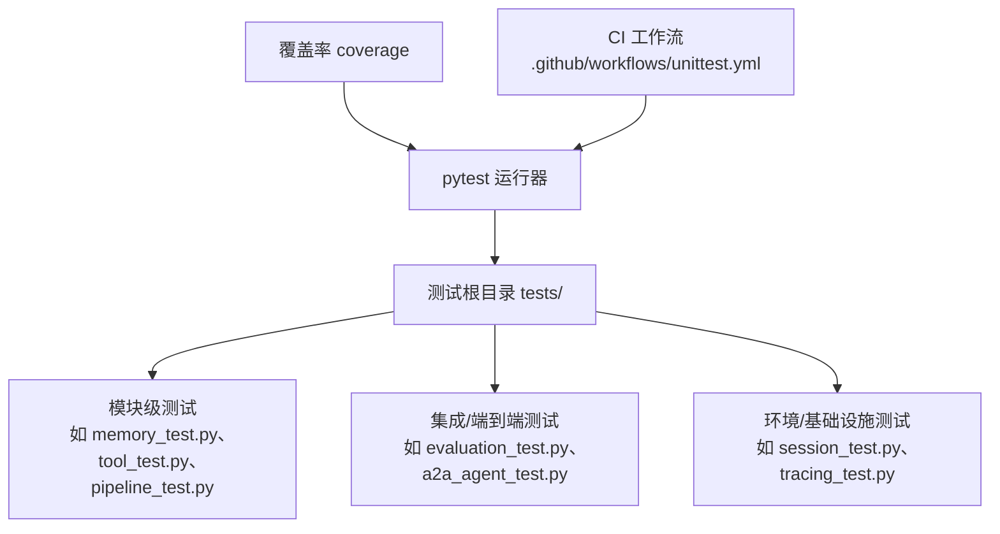
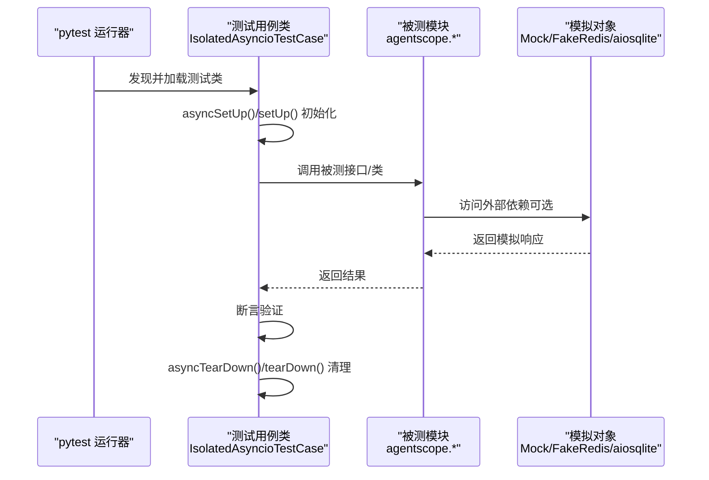
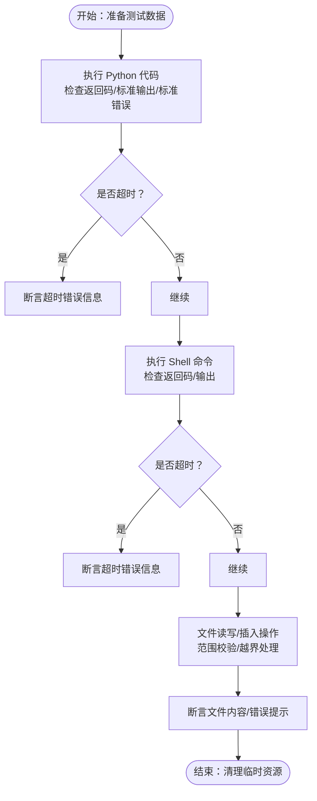
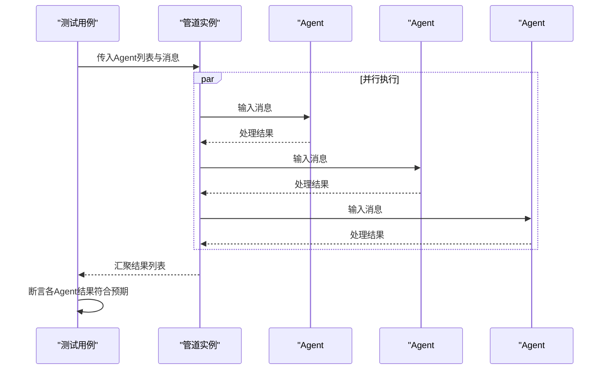
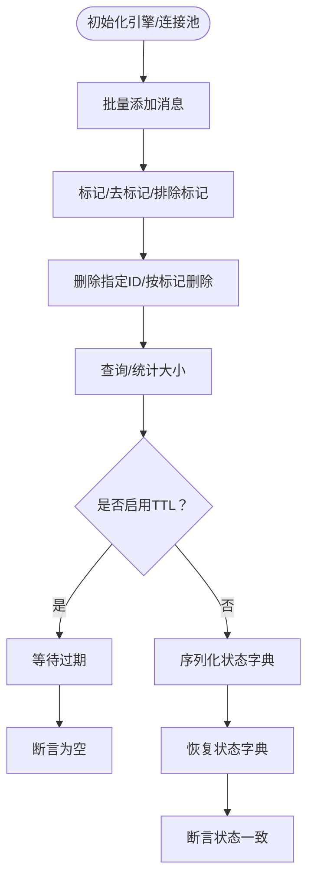
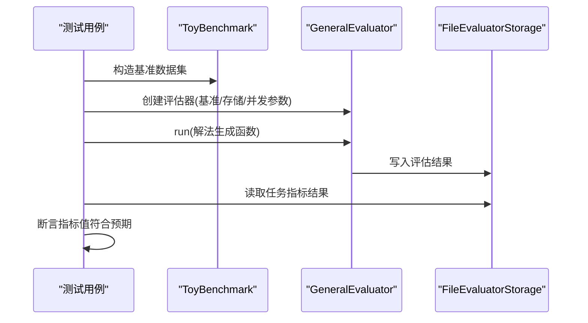
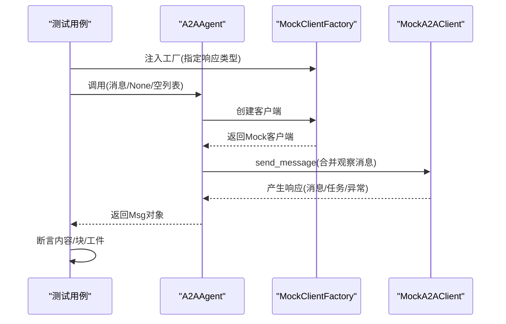
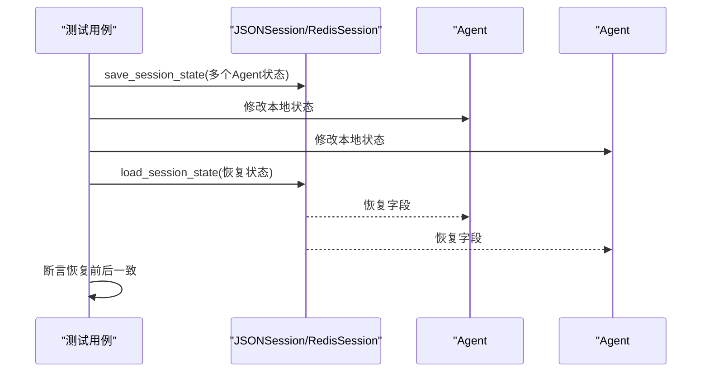
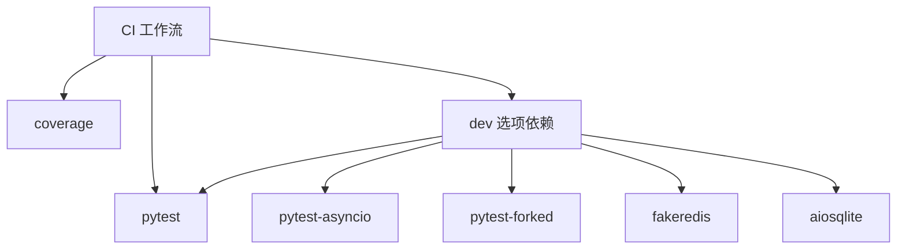

# 测试策略

<cite>
**本文引用的文件**   
- [pyproject.toml](file://pyproject.toml)
- [.github/workflows/unittest.yml](file://.github/workflows/unittest.yml)
- [tests/a2a_agent_test.py](file://tests/a2a_agent_test.py)
- [tests/memory_test.py](file://tests/memory_test.py)
- [tests/tool_test.py](file://tests/tool_test.py)
- [tests/pipeline_test.py](file://tests/pipeline_test.py)
- [tests/evaluation_test.py](file://tests/evaluation_test.py)
- [tests/tracing_test.py](file://tests/tracing_test.py)
- [tests/session_test.py](file://tests/session_test.py)
- [CONTRIBUTING.md](file://CONTRIBUTING.md)
- [README.md](file://README.md)
</cite>

## 目录
1. [引言](#引言)
2. [项目结构](#项目结构)
3. [核心组件](#核心组件)
4. [架构总览](#架构总览)
5. [详细组件分析](#详细组件分析)
6. [依赖分析](#依赖分析)
7. [性能考虑](#性能考虑)
8. [故障排查指南](#故障排查指南)
9. [结论](#结论)
10. [附录](#附录)

## 引言
本文件系统化梳理 AgentScope 的测试策略与实现，覆盖测试架构、分类（单元测试、集成测试）、pytest 使用规范、覆盖率与报告、测试用例编写最佳实践、运行方式（本地与CI）、测试环境配置与数据库测试特殊处理、调试技巧与常见问题。内容基于仓库中实际测试文件与配置进行归纳总结，帮助开发者高效开展测试工作。

## 项目结构
- 测试目录 tests 下按模块与功能划分测试文件，采用“按功能/模块分层”的组织方式，便于定位与维护。
- 关键测试类型：
  - 单元测试：针对具体类或函数行为验证，如消息、工具、管道、内存、会话、追踪等。
  - 集成测试：跨模块协作验证，如评估器、Ray 分布式评估、A2A 代理通信、数据库存储等。
- 测试框架与工具：
  - pytest 及其异步支持 pytest-asyncio；fork 支持 pytest-forked；覆盖率工具 coverage。
  - CI 使用 GitHub Actions 进行多平台、多版本 Python 覆盖率跑测。

**图表来源**
- [pyproject.toml:177-194](file://pyproject.toml#L177-L194)
- [.github/workflows/unittest.yml:1-35](file://.github/workflows/unittest.yml#L1-L35)

**章节来源**
- [pyproject.toml:177-194](file://pyproject.toml#L177-L194)
- [.github/workflows/unittest.yml:1-35](file://.github/workflows/unittest.yml#L1-L35)

## 核心组件
- 测试框架与运行
  - 使用 pytest 作为主测试框架，并通过 pytest-asyncio 支持异步测试；pytest-forked 用于需要进程隔离的场景。
  - 本地运行命令参考贡献指南，推荐在开发环境中安装 dev 依赖后直接运行 pytest tests。
- 覆盖率与报告
  - CI 中通过 coverage run -m pytest tests 执行测试并生成覆盖率报告；coverage report -m 输出详细报告。
- 测试文件命名与组织
  - 按模块命名，如 memory_test.py、tool_test.py、evaluation_test.py 等；每个文件聚焦一个子系统或功能域。
- 断言与数据准备
  - 大量使用断言方法（如 assertListEqual、assertDictEqual、assertIsInstance、assertEqual 等）；通过 setUp/tearDown 或 asyncSetUp/asyncTearDown 准备与清理测试状态。
- 模拟与外部依赖
  - 使用 unittest.mock、fakeredis、aiosqlite 等库模拟外部服务或数据库，避免真实依赖带来的不确定性。

**章节来源**
- [CONTRIBUTING.md:125-133](file://CONTRIBUTING.md#L125-L133)
- [.github/workflows/unittest.yml:24-35](file://.github/workflows/unittest.yml#L24-L35)
- [pyproject.toml:177-194](file://pyproject.toml#L177-L194)

## 架构总览
下图展示测试体系与被测模块的关系，以及典型测试流程（以异步测试为例）：

**图表来源**
- [tests/memory_test.py:29-501](file://tests/memory_test.py#L29-L501)
- [tests/tool_test.py:21-366](file://tests/tool_test.py#L21-L366)
- [tests/pipeline_test.py:147-439](file://tests/pipeline_test.py#L147-L439)
- [tests/evaluation_test.py:176-288](file://tests/evaluation_test.py#L176-L288)

## 详细组件分析

### 单元测试：消息与工具
- 目标：验证消息构造、内容块、工具执行（Python 代码、Shell 命令、文本文件读写/插入）等基础能力。
- 关键点：
  - 使用 IsolatedAsyncioTestCase 编写异步测试，确保事件循环隔离。
  - 通过临时文件、超时控制、异常路径等边界条件覆盖。
  - 断言输出格式与期望一致（如返回的文本块、错误信息等）。

**图表来源**
- [tests/tool_test.py:30-366](file://tests/tool_test.py#L30-L366)

**章节来源**
- [tests/tool_test.py:21-366](file://tests/tool_test.py#L21-L366)

### 单元测试：消息管道与并发
- 目标：验证顺序/并行管道、空输入、异常传播、流式打印等行为。
- 关键点：
  - 自定义 Agent 实现最小化逻辑，仅保留必要接口，便于可控测试。
  - 并发场景使用 gather 等机制验证独立输入与结果收集。
  - 错误在流式场景中仍能正确抛出并中断后续消费。

**图表来源**
- [tests/pipeline_test.py:147-378](file://tests/pipeline_test.py#L147-L378)

**章节来源**
- [tests/pipeline_test.py:147-378](file://tests/pipeline_test.py#L147-L378)

### 单元测试：短时记忆与数据库
- 目标：验证内存增删改查、标记管理、多租户/多会话隔离、序列化恢复、并发写入等。
- 关键点：
  - 使用 in-memory SQLite（aiosqlite）与 fakeredis（异步）模拟数据库与缓存。
  - 并发写入场景通过 gather 并发调用，验证索引唯一性与连续性，规避竞态。
  - TTL 场景验证过期行为；序列化/反序列化验证状态一致性。

**图表来源**
- [tests/memory_test.py:604-684](file://tests/memory_test.py#L604-L684)

**章节来源**
- [tests/memory_test.py:17-501](file://tests/memory_test.py#L17-L501)
- [tests/memory_test.py:604-684](file://tests/memory_test.py#L604-L684)
- [tests/memory_test.py:691-800](file://tests/memory_test.py#L691-L800)

### 集成测试：评估器与分布式
- 目标：验证通用评估器与 Ray 评估器在 toy benchmark 上的行为，包括指标计算、结果存储与读取。
- 关键点：
  - 使用 FileEvaluatorStorage 写入/读取评估结果。
  - Ray 评估器在测试前初始化 Ray，注意工作目录与模块导入设置。
  - 通过断言指标结果验证评估流程正确性。

**图表来源**
- [tests/evaluation_test.py:176-288](file://tests/evaluation_test.py#L176-L288)

**章节来源**
- [tests/evaluation_test.py:176-288](file://tests/evaluation_test.py#L176-L288)

### 集成测试：A2A 代理通信
- 目标：验证 A2A 代理在不同响应类型（消息/任务/错误）下的行为，以及观察与回复合并逻辑。
- 关键点：
  - 自定义 MockA2AClient/MockClientFactory 替代真实客户端，模拟不同响应路径。
  - 断言回复内容、消息块、工件提取等。

**图表来源**
- [tests/a2a_agent_test.py:103-254](file://tests/a2a_agent_test.py#L103-L254)

**章节来源**
- [tests/a2a_agent_test.py:103-254](file://tests/a2a_agent_test.py#L103-L254)

### 集成测试：会话与追踪
- 目标：验证会话保存/加载、Redis 会话（fakeredis）行为；追踪装饰器对同步/异步函数与生成器的支持。
- 关键点：
  - 会话测试通过 JSON/Redis 存储验证状态恢复。
  - 追踪测试覆盖 trace、trace_llm、trace_reply、trace_format、trace_embedding 等装饰器在多种函数形态上的行为与异常处理。

**图表来源**
- [tests/session_test.py:46-104](file://tests/session_test.py#L46-L104)

**章节来源**
- [tests/session_test.py:46-104](file://tests/session_test.py#L46-L104)
- [tests/tracing_test.py:30-200](file://tests/tracing_test.py#L30-L200)

## 依赖分析
- 开发依赖与测试工具
  - pytest、pytest-asyncio、pytest-forked、coverage、fakeredis、aiosqlite 等在 dev 选项中声明。
- CI 依赖安装与运行
  - CI 中先安装可编辑包及 dev 依赖，再安装 coverage 与 pytest，最后执行覆盖率测试并生成报告。
- 模块间耦合
  - 测试用例与被测模块松耦合，通过模拟对象与轻量依赖（如 fakeredis、aiosqlite）替代真实外部系统，降低测试脆弱性。

**图表来源**
- [pyproject.toml:177-194](file://pyproject.toml#L177-L194)
- [.github/workflows/unittest.yml:24-35](file://.github/workflows/unittest.yml#L24-L35)

**章节来源**
- [pyproject.toml:177-194](file://pyproject.toml#L177-L194)
- [.github/workflows/unittest.yml:24-35](file://.github/workflows/unittest.yml#L24-L35)

## 性能考虑
- 异步测试与事件循环隔离
  - 使用 IsolatedAsyncioTestCase 避免事件循环共享导致的副作用，提升测试稳定性。
- 并发写入与锁竞争
  - 内存模块并发写入测试通过 gather 并发触发，验证索引唯一性与连续性，避免重复主键冲突。
- 模拟外部依赖
  - 使用 fakeredis、aiosqlite 等内存/轻量实现替代真实数据库，减少 IO 与连接开销，提高测试吞吐。
- 覆盖率与性能平衡
  - CI 默认开启覆盖率，建议在本地开发阶段按需开启，避免过度影响迭代速度。

[本节为通用指导，无需特定文件引用]

## 故障排查指南
- 常见问题与解决
  - fakeredis 缺失：Redis 相关测试需安装 fakeredis，否则跳过或报错。可在 setUp 中捕获 ImportError 并跳过测试。
  - aiosqlite/SQLite 内存数据库：确保使用 sqlite+aiosqlite 方案，避免同步驱动导致的阻塞。
  - Ray 初始化：分布式评估器需在测试前初始化 Ray，并设置工作目录与模块导入。
  - 超时与异常：工具执行（Python/Shell）需覆盖超时与异常分支，断言返回的错误信息包含预期关键字。
- 调试技巧
  - 在 setUp/asyncSetUp 中打印关键状态，缩小问题范围。
  - 对并发场景使用较小并发度或单步调试，逐步定位竞态。
  - 使用最小化 Agent/工具实现，隔离被测逻辑，便于快速定位问题。

**章节来源**
- [tests/memory_test.py:703-713](file://tests/memory_test.py#L703-L713)
- [tests/evaluation_test.py:194-208](file://tests/evaluation_test.py#L194-L208)
- [tests/tool_test.py:137-153](file://tests/tool_test.py#L137-L153)

## 结论
AgentScope 的测试策略以 pytest 为核心，结合异步测试、模拟对象与轻量依赖，构建了覆盖单元与集成层面的完整测试体系。通过 CI 自动化覆盖率跑测与报告，保障代码质量与演进稳定性。建议在新增功能时遵循现有命名与组织规范，优先补充单元测试，再视需要扩展集成测试，并持续关注覆盖率与性能平衡。

[本节为总结性内容，无需特定文件引用]

## 附录

### pytest 使用与最佳实践
- 文件命名与组织
  - 按模块命名，如 *_test.py；聚焦单一职责，拆分复杂测试为多个小用例。
- 测试函数编写
  - 使用 asyncSetUp/asyncTearDown 或 setUp/tearDown 准备/清理；断言尽量精确且可读。
- 模拟对象使用
  - 优先使用 unittest.mock；对于 Redis/数据库场景使用 fakeredis/aiosqlite。
- 断言编写
  - 使用 assertListEqual/assertDictEqual/assertIsInstance 等明确断言类型与内容。
- 运行方式
  - 本地：pytest tests；CI：coverage run -m pytest tests 后 coverage report -m。

**章节来源**
- [CONTRIBUTING.md:125-133](file://CONTRIBUTING.md#L125-L133)
- [.github/workflows/unittest.yml:24-35](file://.github/workflows/unittest.yml#L24-L35)

### 覆盖率要求与报告
- 覆盖率工具
  - 使用 coverage run -m pytest tests 执行测试；coverage report -m 生成报告。
- 覆盖率目标
  - 建议在新增/修改功能时保持高覆盖率；对关键路径（如并发写入、异常处理）重点覆盖。
- 报告解读
  - 关注未覆盖的分支与语句，补充缺失用例；对热点模块（模型、工具、内存）优先保证覆盖率。

**章节来源**
- [.github/workflows/unittest.yml:32-35](file://.github/workflows/unittest.yml#L32-L35)

### 数据库测试特殊处理
- 内存数据库
  - 使用 sqlite+aiosqlite 的 in-memory 引擎，避免磁盘 IO；测试结束后 dispose 引擎。
- 缓存模拟
  - 使用 fakeredis.aioredis.FakeRedis 提供异步 Redis 模拟，测试 TTL、序列化/反序列化等行为。
- 并发写入
  - 通过 gather 并发触发写入，断言索引唯一性与连续性，规避竞态与重复主键。

**章节来源**
- [tests/memory_test.py:607-618](file://tests/memory_test.py#L607-L618)
- [tests/memory_test.py:642-684](file://tests/memory_test.py#L642-L684)
- [tests/memory_test.py:703-732](file://tests/memory_test.py#L703-L732)
- [tests/session_test.py:110-123](file://tests/session_test.py#L110-L123)