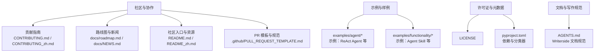
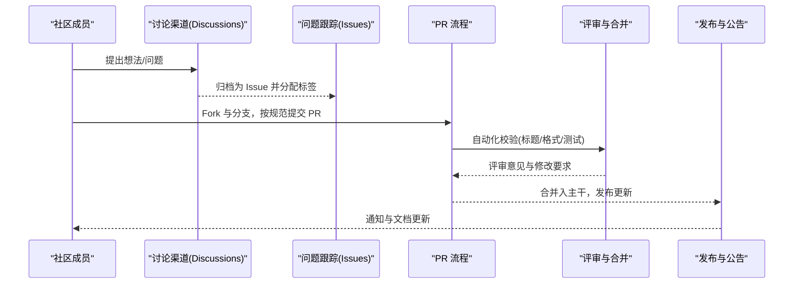
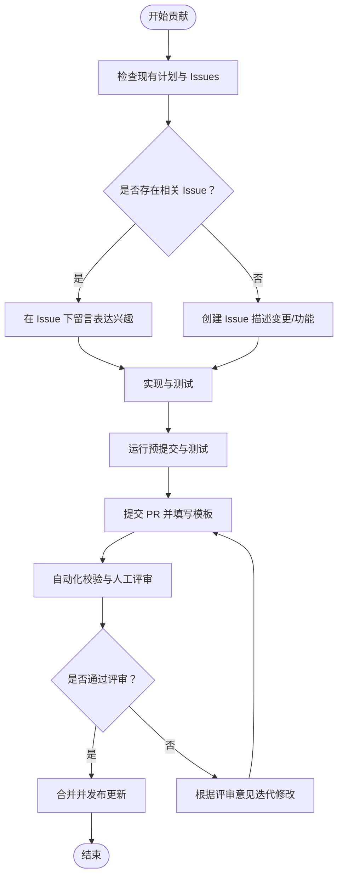
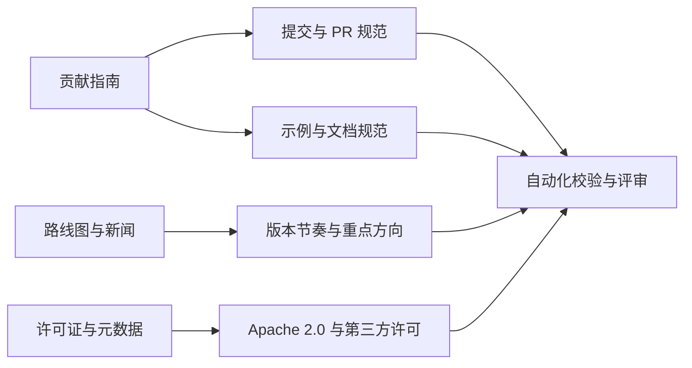

# 社区规范

<cite>
**本文引用的文件**
- [CONTRIBUTING.md](file://CONTRIBUTING.md)
- [CONTRIBUTING_zh.md](file://CONTRIBUTING_zh.md)
- [README.md](file://README.md)
- [README_zh.md](file://README_zh.md)
- [.github/PULL_REQUEST_TEMPLATE.md](file://.github/PULL_REQUEST_TEMPLATE.md)
- [docs/roadmap.md](file://docs/roadmap.md)
- [docs/NEWS.md](file://docs/NEWS.md)
- [LICENSE](file://LICENSE)
- [pyproject.toml](file://pyproject.toml)
- [AGENTS.md](file://AGENTS.md)
- [examples/agent/react_agent/README.md](file://examples/agent/react_agent/README.md)
- [examples/functionality/agent_skill/README.md](file://examples/functionality/agent_skill/README.md)
</cite>

## 目录
1. [引言](#引言)
2. [项目结构](#项目结构)
3. [核心组件](#核心组件)
4. [架构总览](#架构总览)
5. [详细组件分析](#详细组件分析)
6. [依赖分析](#依赖分析)
7. [性能考量](#性能考量)
8. [故障排查指南](#故障排查指南)
9. [结论](#结论)
10. [附录](#附录)

## 引言
本文件旨在为 AgentScope 社区提供一套清晰、可执行的社区规范与行为准则，覆盖沟通礼仪、参与方式、问题报告流程、社区资源、贡献发展路径、知识产权与许可证、社区活动与会议、以及参与开源项目的经验分享。内容以仓库中的贡献指南、路线图、新闻动态、许可证与项目配置等权威文件为依据，帮助新老成员高效、友好地协作。

## 项目结构
AgentScope 采用“示例优先”的开发与社区协作模式：核心库保持模块化、可拆卸与可组合，示例与样例集中于 examples/ 目录，便于学习与复用；贡献指南与路线图明确开发方向与协作流程；许可证与项目元数据保障开源合规与生态透明。

**图表来源**
- [CONTRIBUTING.md](file://CONTRIBUTING.md)
- [CONTRIBUTING_zh.md](file://CONTRIBUTING_zh.md)
- [docs/roadmap.md](file://docs/roadmap.md)
- [docs/NEWS.md](file://docs/NEWS.md)
- [README.md](file://README.md)
- [README_zh.md](file://README_zh.md)
- [.github/PULL_REQUEST_TEMPLATE.md](file://.github/PULL_REQUEST_TEMPLATE.md)
- [LICENSE](file://LICENSE)
- [pyproject.toml](file://pyproject.toml)
- [AGENTS.md](file://AGENTS.md)
- [examples/agent/react_agent/README.md](file://examples/agent/react_agent/README.md)
- [examples/functionality/agent_skill/README.md](file://examples/functionality/agent_skill/README.md)

**章节来源**
- [README.md](file://README.md)
- [README_zh.md](file://README_zh.md)
- [CONTRIBUTING.md](file://CONTRIBUTING.md)
- [CONTRIBUTING_zh.md](file://CONTRIBUTING_zh.md)
- [docs/roadmap.md](file://docs/roadmap.md)
- [docs/NEWS.md](file://docs/NEWS.md)
- [pyproject.toml](file://pyproject.toml)
- [AGENTS.md](file://AGENTS.md)

## 核心组件
- 行为准则与沟通礼仪
  - 尊重与包容：遵守社区行为准则，尊重不同背景、观点与贡献方式。
  - 建设性反馈：提出问题与建议时，聚焦事实、提供上下文与可行方案。
  - 透明与协作：优先在公开渠道讨论，避免私下负面评价。
- 参与方式
  - 提问与讨论：使用 Discussions 或 Issues，遵循模板与标签规范。
  - 代码贡献：遵循提交信息与 PR 标题规范，运行预提交与测试。
  - 文档与示例：补充示例、教程与最佳实践，保持简洁与可复现。
- 问题报告与功能请求
  - Bug 报告：提供环境、复现步骤、期望与实际结果、日志与截图。
  - 功能请求：说明动机、使用场景、预期行为与验收标准。
  - 问题分类：使用合适的标签（如 bug、enhancement、help wanted）。
- 社区资源
  - 官方文档与教程：英文与中文双语教程与 API 文档。
  - 论坛与聊天：Discord 与钉钉群，定期双周会议分享进展。
  - 示例与样例：examples/ 与 agentscope-samples 仓库。
- 成长路径
  - 贡献者 → 维护者：从修复小问题、完善文档、贡献示例起步，逐步承担评审与决策职责。
- 知识产权与许可证
  - 项目采用 Apache License 2.0，遵循许可证条款与第三方组件许可。
- 社区活动与会议
  - 双周会议：分享生态更新与开发计划，欢迎参与与提问。
  - 发布与路线图：关注 ROADMAP 与 NEWS，把握发展方向。

**章节来源**
- [CONTRIBUTING.md](file://CONTRIBUTING.md)
- [CONTRIBUTING_zh.md](file://CONTRIBUTING_zh.md)
- [README.md](file://README.md)
- [README_zh.md](file://README_zh.md)
- [docs/roadmap.md](file://docs/roadmap.md)
- [docs/NEWS.md](file://docs/NEWS.md)
- [LICENSE](file://LICENSE)

## 架构总览
社区协作的总体流程围绕“问题发现—讨论—解决—验证—发布”闭环展开，结合示例与文档形成知识沉淀与传播。

**图表来源**
- [CONTRIBUTING.md](file://CONTRIBUTING.md)
- [CONTRIBUTING_zh.md](file://CONTRIBUTING_zh.md)
- [.github/PULL_REQUEST_TEMPLATE.md](file://.github/PULL_REQUEST_TEMPLATE.md)

## 详细组件分析

### 行为准则与沟通礼仪
- 基本原则
  - 尊重：避免人身攻击，关注问题本身。
  - 包容：接纳不同技术栈与经验背景，鼓励新手提问。
  - 建设性：提出具体问题与可行建议，附带上下文与证据。
- 沟通渠道
  - 讨论：优先使用 Discussions，便于归档与检索。
  - 报告：Bug 与功能请求使用 Issues，遵循模板与标签。
- 代码与文档规范
  - 提交信息与 PR 标题遵循 Conventional Commits。
  - 预提交钩子与测试通过后再提交 PR。
  - 文档与示例保持简洁、可复现、双语对照。

**章节来源**
- [CONTRIBUTING.md](file://CONTRIBUTING.md)
- [CONTRIBUTING_zh.md](file://CONTRIBUTING_zh.md)

### 参与方式与贡献流程
- 从现有计划入手
  - 查看 Projects 与带 roadmap 标签的 Issues，避免重复劳动。
  - 无对应 Issue 时先开 Issue 讨论，再行实现。
- 提交与评审
  - PR 标题与内容符合模板要求，自动化校验通过。
  - 保持 PR 聚焦单一功能，避免混杂关注点。
- 示例与文档
  - examples/ 下的示例应聚焦展示能力、易于理解与复现。
  - 文档与示例 README 保持最新，提供运行指引与注意事项。

**图表来源**
- [CONTRIBUTING.md](file://CONTRIBUTING.md)
- [CONTRIBUTING_zh.md](file://CONTRIBUTING_zh.md)
- [.github/PULL_REQUEST_TEMPLATE.md](file://.github/PULL_REQUEST_TEMPLATE.md)

**章节来源**
- [CONTRIBUTING.md](file://CONTRIBUTING.md)
- [CONTRIBUTING_zh.md](file://CONTRIBUTING_zh.md)
- [.github/PULL_REQUEST_TEMPLATE.md](file://.github/PULL_REQUEST_TEMPLATE.md)

### 问题报告与功能请求
- Bug 报告模板要点
  - 环境信息：操作系统、Python 版本、AgentScope 版本、依赖版本。
  - 复现步骤：最小可复现实例与命令。
  - 期望与实际结果：清晰对比。
  - 日志与截图：便于定位问题。
- 功能请求格式
  - 动机与使用场景：为什么需要此功能？
  - 预期行为：接口、参数、返回值与副作用。
  - 验收标准：如何判断功能完成？
- 问题分类与标签
  - 使用合适的标签（如 bug、enhancement、help wanted、question）。
  - 与路线图对齐，避免偏离社区重点方向。

**章节来源**
- [CONTRIBUTING.md](file://CONTRIBUTING.md)
- [CONTRIBUTING_zh.md](file://CONTRIBUTING_zh.md)
- [docs/roadmap.md](file://docs/roadmap.md)

### 社区资源与联系方式
- 官方文档与教程
  - 英文与中文教程、API 文档与常见问题。
- 论坛与聊天
  - Discord 与钉钉群，双周会议分享生态更新与开发计划。
- 示例与样例
  - examples/ 下的示例与 agentscope-samples 仓库中的完整应用。
- 发布与路线图
  - 关注 ROADMAP 与 NEWS，把握版本节奏与重点方向。

**章节来源**
- [README.md](file://README.md)
- [README_zh.md](file://README_zh.md)
- [docs/roadmap.md](file://docs/roadmap.md)
- [docs/NEWS.md](file://docs/NEWS.md)

### 成为维护者与贡献者的发展路径
- 贡献者
  - 从小处着手：修复小问题、完善文档、贡献示例。
  - 保持沟通：在 Discussion 或 Issue 中提前沟通。
- 维护者
  - 承担评审职责：关注代码质量、设计一致性与用户体验。
  - 参与路线图制定与决策：基于社区反馈与技术趋势。
  - 培养新人：指导贡献流程与最佳实践。

**章节来源**
- [CONTRIBUTING.md](file://CONTRIBUTING.md)
- [CONTRIBUTING_zh.md](file://CONTRIBUTING_zh.md)

### 知识产权与许可证
- 许可证
  - 项目采用 Apache License 2.0，允许商用与二次分发，需保留版权与许可声明。
- 第三方组件
  - 注意 socket.io、jQuery、Bootstrap、Monaspace、Oswald 等第三方组件的独立许可。
- 贡献声明
  - 提交贡献默认受 Apache 2.0 条款约束，避免引入不兼容许可。

**章节来源**
- [LICENSE](file://LICENSE)
- [pyproject.toml](file://pyproject.toml)

### 社区活动与会议
- 双周会议
  - 分享生态更新与开发计划，欢迎提问与参与。
- 发布节奏
  - 关注 NEWS 与 ROADMAP，了解版本特性与里程碑。
- 示例驱动
  - 通过 examples/ 与样例仓库学习与复用，降低上手成本。

**章节来源**
- [README.md](file://README.md)
- [README_zh.md](file://README_zh.md)
- [docs/NEWS.md](file://docs/NEWS.md)
- [docs/roadmap.md](file://docs/roadmap.md)

### 参与开源项目的经验分享
- 从示例入手
  - 先运行 examples/agent/react_agent 与 examples/functionality/agent_skill，理解基本用法与工具链。
- 注重文档与测试
  - 保持 README 与示例 README 的一致性，确保测试通过。
- 保持轻量与模块化
  - 遵循懒加载导入原则，避免不必要的依赖膨胀。

**章节来源**
- [examples/agent/react_agent/README.md](file://examples/agent/react_agent/README.md)
- [examples/functionality/agent_skill/README.md](file://examples/functionality/agent_skill/README.md)
- [CONTRIBUTING.md](file://CONTRIBUTING.md)
- [CONTRIBUTING_zh.md](file://CONTRIBUTING_zh.md)

## 依赖分析
社区协作与项目健康度依赖于清晰的贡献流程、文档规范与许可证合规。

**图表来源**
- [CONTRIBUTING.md](file://CONTRIBUTING.md)
- [CONTRIBUTING_zh.md](file://CONTRIBUTING_zh.md)
- [docs/roadmap.md](file://docs/roadmap.md)
- [docs/NEWS.md](file://docs/NEWS.md)
- [LICENSE](file://LICENSE)
- [pyproject.toml](file://pyproject.toml)

**章节来源**
- [CONTRIBUTING.md](file://CONTRIBUTING.md)
- [CONTRIBUTING_zh.md](file://CONTRIBUTING_zh.md)
- [docs/roadmap.md](file://docs/roadmap.md)
- [docs/NEWS.md](file://docs/NEWS.md)
- [LICENSE](file://LICENSE)
- [pyproject.toml](file://pyproject.toml)

## 性能考量
- 贡献效率
  - 遵循“小步快跑、频繁提交”，减少评审成本与回归风险。
- 代码体积与加载速度
  - 保持懒加载导入原则，避免核心库臃肿。
- 文档与示例
  - 示例尽量最小化依赖，提供一键运行的 README 指南。

[本节为通用建议，无需特定文件来源]

## 故障排查指南
- PR 被阻塞
  - 检查标题是否符合 Conventional Commits 规范，自动化校验会拦截不符合的标题。
- 测试失败
  - 在本地运行预提交与测试，确保通过后再提交 PR。
- 文档不一致
  - 更新示例 README 与教程，确保与代码变更一致。
- 许可证问题
  - 引入第三方组件时，核对许可兼容性，必要时在 LICENSE 中补充说明。

**章节来源**
- [.github/PULL_REQUEST_TEMPLATE.md](file://.github/PULL_REQUEST_TEMPLATE.md)
- [CONTRIBUTING.md](file://CONTRIBUTING.md)
- [CONTRIBUTING_zh.md](file://CONTRIBUTING_zh.md)
- [LICENSE](file://LICENSE)

## 结论
本规范以贡献指南、路线图、新闻与许可证为依据，构建了 AgentScope 社区的行为准则、参与方式与协作流程。建议所有成员在提问、讨论、贡献与发布各环节遵循本规范，共同营造尊重、包容、高效与可持续发展的开源社区生态。

[本节为总结，无需特定文件来源]

## 附录
- 社区入口与资源
  - 英文首页与教程：[README.md](file://README.md)
  - 中文首页与教程：[README_zh.md](file://README_zh.md)
  - 许可证：[LICENSE](file://LICENSE)
  - 项目配置与依赖：[pyproject.toml](file://pyproject.toml)
- 贡献与规范
  - 贡献指南（英文）：[CONTRIBUTING.md](file://CONTRIBUTING.md)
  - 贡献指南（中文）：[CONTRIBUTING_zh.md](file://CONTRIBUTING_zh.md)
  - PR 模板：[.github/PULL_REQUEST_TEMPLATE.md](file://.github/PULL_REQUEST_TEMPLATE.md)
- 路线图与新闻
  - 路线图：[docs/roadmap.md](file://docs/roadmap.md)
  - 新闻：[docs/NEWS.md](file://docs/NEWS.md)
- 文档与写作规范
  - AGENTS 写作规范：[AGENTS.md](file://AGENTS.md)
- 示例与样例
  - ReAct Agent 示例：[examples/agent/react_agent/README.md](file://examples/agent/react_agent/README.md)
  - Agent Skill 示例：[examples/functionality/agent_skill/README.md](file://examples/functionality/agent_skill/README.md)