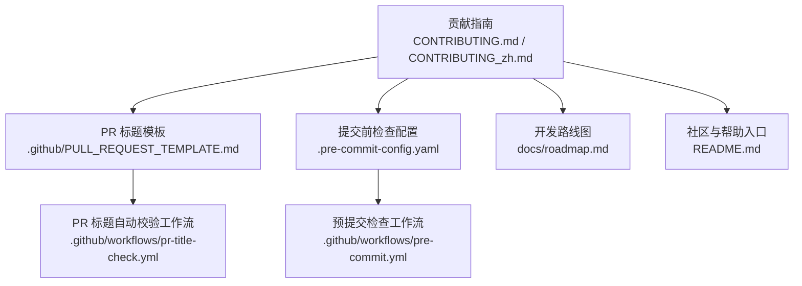
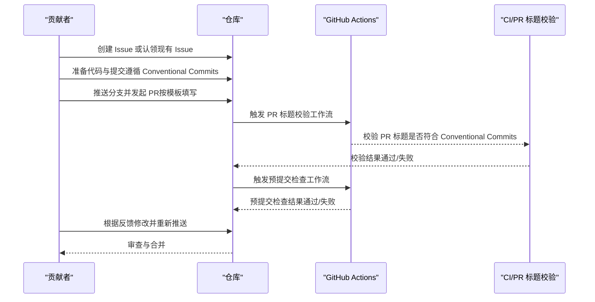
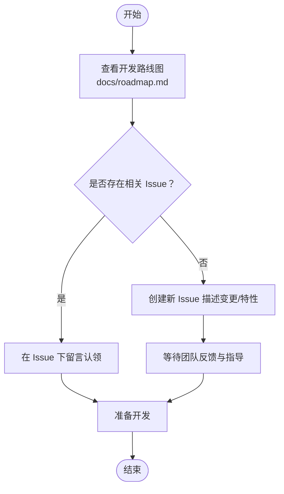
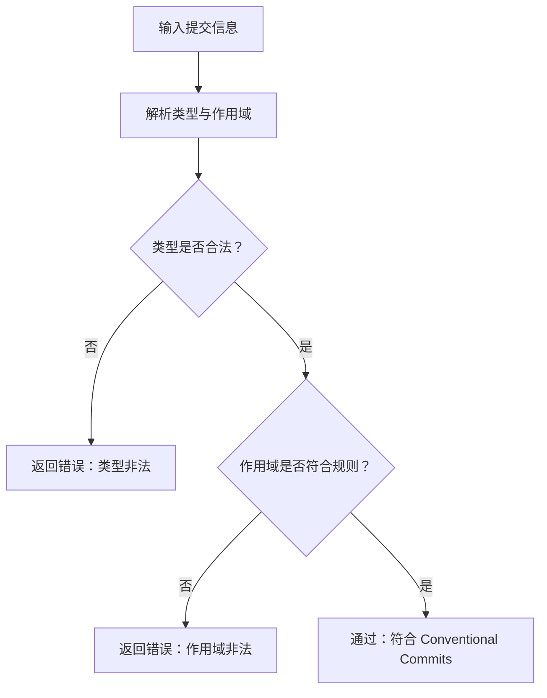
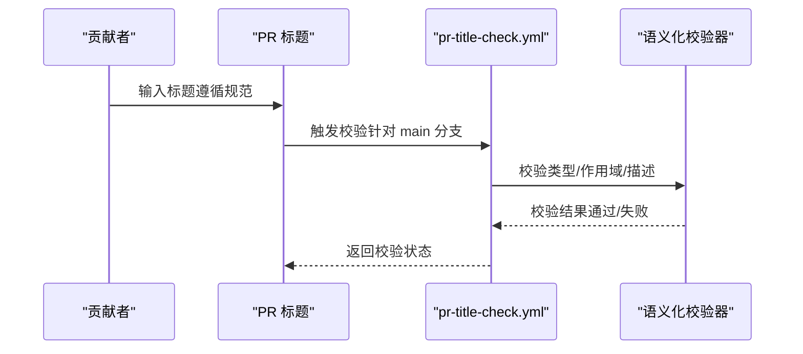
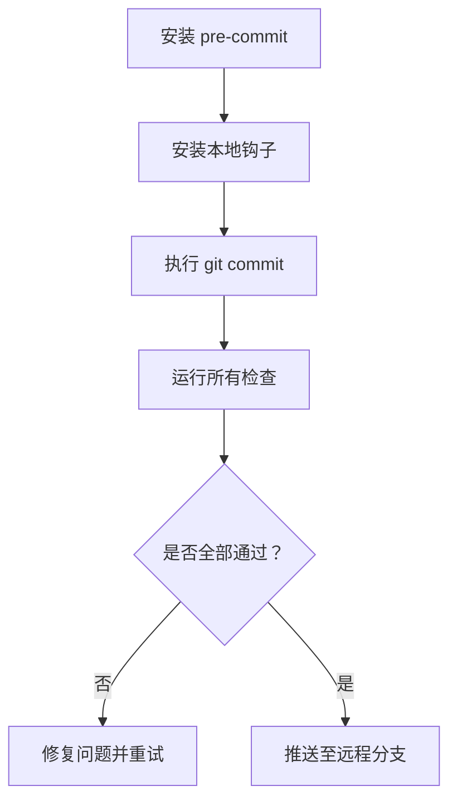
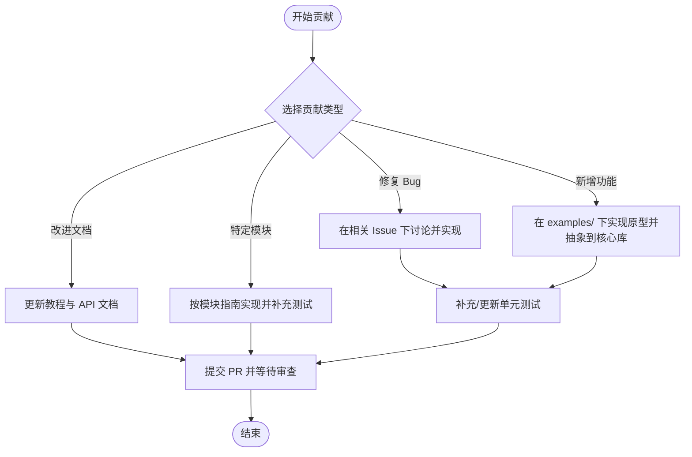
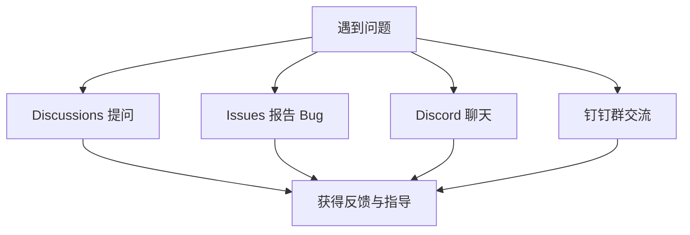
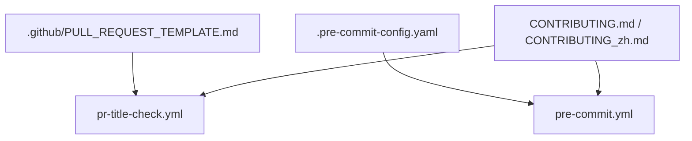

# 贡献流程

<cite>
**本文引用的文件**
- [CONTRIBUTING.md](file://CONTRIBUTING.md)
- [CONTRIBUTING_zh.md](file://CONTRIBUTING_zh.md)
- [.pre-commit-config.yaml](file://.pre-commit-config.yaml)
- [.github/PULL_REQUEST_TEMPLATE.md](file://.github/PULL_REQUEST_TEMPLATE.md)
- [.github/workflows/pr-title-check.yml](file://.github/workflows/pr-title-check.yml)
- [.github/workflows/pre-commit.yml](file://.github/workflows/pre-commit.yml)
- [docs/roadmap.md](file://docs/roadmap.md)
- [README.md](file://README.md)
</cite>

## 目录
1. [简介](#简介)
2. [项目结构](#项目结构)
3. [核心组件](#核心组件)
4. [架构总览](#架构总览)
5. [详细组件分析](#详细组件分析)
6. [依赖分析](#依赖分析)
7. [性能考虑](#性能考虑)
8. [故障排查指南](#故障排查指南)
9. [结论](#结论)
10. [附录](#附录)

## 简介
本文件面向贡献者，系统化说明在 AgentScope 项目中的贡献流程与规范，包括：
- 如何查找现有任务与问题，以及开发路线图的查看方式与 Issues 的分类
- 提交消息格式规范（Conventional Commits 标准、类型定义、作用域规则与示例）
- Pull Request 标题格式要求、自动验证机制与审查流程
- 贡献不同类型内容的指导（修复 Bug、新增功能、改进文档等）
- 社区交流渠道与获取帮助的方式

## 项目结构
围绕贡献流程的关键文件与位置如下：
- 贡献指南与规范：CONTRIBUTING.md、CONTRIBUTING_zh.md
- 贡献模板：.github/PULL_REQUEST_TEMPLATE.md
- 自动化校验工作流：.github/workflows/pr-title-check.yml、.github/workflows/pre-commit.yml
- 提交前检查配置：.pre-commit-config.yaml
- 开发路线图：docs/roadmap.md
- 社区与帮助入口：README.md

**图表来源**
- [CONTRIBUTING.md:1-323](file://CONTRIBUTING.md#L1-L323)
- [.github/PULL_REQUEST_TEMPLATE.md:1-25](file://.github/PULL_REQUEST_TEMPLATE.md#L1-L25)
- [.pre-commit-config.yaml:1-108](file://.pre-commit-config.yaml#L1-L108)
- [.github/workflows/pr-title-check.yml:1-49](file://.github/workflows/pr-title-check.yml#L1-L49)
- [.github/workflows/pre-commit.yml:1-38](file://.github/workflows/pre-commit.yml#L1-L38)
- [docs/roadmap.md:1-121](file://docs/roadmap.md#L1-L121)
- [README.md:1-409](file://README.md#L1-L409)

**章节来源**
- [CONTRIBUTING.md:9-26](file://CONTRIBUTING.md#L9-L26)
- [CONTRIBUTING_zh.md:8-25](file://CONTRIBUTING_zh.md#L8-L25)
- [docs/roadmap.md:1-121](file://docs/roadmap.md#L1-L121)
- [README.md:96-103](file://README.md#L96-L103)

## 核心组件
- 查找现有任务与问题
  - 通过开发路线图与 Issues 的“roadmap”标签定位当前规划任务
  - 若已有相关 Issue，可在 Issue 下留言认领；若无，则新建 Issue 描述变更或特性
- 提交消息格式（Conventional Commits）
  - 格式：<type>(<scope>): <subject>
  - 类型：feat、fix、docs、style、refactor、perf、ci、chore 等
  - 示例与要求详见贡献指南
- PR 标题格式与自动验证
  - PR 标题需遵循 Conventional Commits
  - 针对 main 分支的 PR，由 GitHub Actions 自动校验，不符合将被阻断
- 提交前检查（Pre-commit）
  - 安装并运行 pre-commit，确保代码风格、静态检查与格式化符合规范
- 贡献类型指导
  - 新增 ChatModel、Agent、Examples、Memory 数据库等的注意事项与最佳实践
- 社区与帮助
  - 通过 Discussions、Issues、Discord、钉钉群等方式获取帮助

**章节来源**
- [CONTRIBUTING.md:13-129](file://CONTRIBUTING.md#L13-L129)
- [CONTRIBUTING_zh.md:12-137](file://CONTRIBUTING_zh.md#L12-L137)
- [.github/workflows/pr-title-check.yml:19-45](file://.github/workflows/pr-title-check.yml#L19-L45)
- [.github/workflows/pre-commit.yml:24-37](file://.github/workflows/pre-commit.yml#L24-L37)
- [.pre-commit-config.yaml:1-108](file://.pre-commit-config.yaml#L1-L108)

## 架构总览
从贡献者的视角，贡献流程由“准备—开发—提交—审查—合并”构成，关键自动化节点如下：

**图表来源**
- [CONTRIBUTING.md:57-91](file://CONTRIBUTING.md#L57-L91)
- [.github/workflows/pr-title-check.yml:13-49](file://.github/workflows/pr-title-check.yml#L13-L49)
- [.github/workflows/pre-commit.yml:16-37](file://.github/workflows/pre-commit.yml#L16-L37)

## 详细组件分析

### 组件一：查找现有任务与问题（含路线图与 Issues 分类）
- 开发路线图
  - 通过 docs/roadmap.md 查看长期目标与当前聚焦方向（如语音 Agent、Agent Skill、生态扩展等）
  - 项目页面与带“roadmap”标签的 Issues 用于跟踪计划内任务
- Issues 分类与认领
  - 若存在相关 Issue 且未分配，可在 Issue 下留言认领
  - 若无相关 Issue，创建新 Issue 描述变更或特性，等待团队反馈与指导

**图表来源**
- [docs/roadmap.md:1-121](file://docs/roadmap.md#L1-L121)
- [CONTRIBUTING.md:13-26](file://CONTRIBUTING.md#L13-L26)
- [CONTRIBUTING_zh.md:12-25](file://CONTRIBUTING_zh.md#L12-L25)

**章节来源**
- [docs/roadmap.md:1-121](file://docs/roadmap.md#L1-L121)
- [CONTRIBUTING.md:13-26](file://CONTRIBUTING.md#L13-L26)
- [CONTRIBUTING_zh.md:12-25](file://CONTRIBUTING_zh.md#L12-L25)

### 组件二：提交消息格式规范（Conventional Commits）
- 格式与类型
  - 格式：<type>(<scope>): <subject>
  - 类型：feat、fix、docs、style、refactor、perf、ci、chore 等
- 作用域规则
  - 作用域可选，建议添加
  - 作用域必须为小写，允许字母、数字、短横线与下划线
- 示例与要求
  - 提供有效与无效示例，强调描述需以小写字母开头
- 与 PR 标题的关系
  - PR 标题同样遵循 Conventional Commits 规范

**图表来源**
- [CONTRIBUTING.md:28-56](file://CONTRIBUTING.md#L28-L56)
- [CONTRIBUTING_zh.md:27-54](file://CONTRIBUTING_zh.md#L27-L54)

**章节来源**
- [CONTRIBUTING.md:28-56](file://CONTRIBUTING.md#L28-L56)
- [CONTRIBUTING_zh.md:27-54](file://CONTRIBUTING_zh.md#L27-L54)

### 组件三：Pull Request 标题格式与自动验证
- 格式要求
  - 必须遵循 Conventional Commits：<type>(<scope>): <description>
  - 允许类型列表：feat、fix、docs、ci、refactor、test、chore、perf、style、build、revert
  - 作用域必须为小写，描述需以小写字母开头
- 自动验证机制
  - 针对 main 分支的 PR，由 pr-title-check.yml 工作流自动校验
  - 校验失败将阻断合并，直至标题修正
- PR 模板
  - .github/PULL_REQUEST_TEMPLATE.md 提供标题格式示例与检查清单

**图表来源**
- [.github/workflows/pr-title-check.yml:13-49](file://.github/workflows/pr-title-check.yml#L13-L49)
- [.github/PULL_REQUEST_TEMPLATE.md:1-8](file://.github/PULL_REQUEST_TEMPLATE.md#L1-L8)

**章节来源**
- [CONTRIBUTING.md:57-91](file://CONTRIBUTING.md#L57-L91)
- [.github/workflows/pr-title-check.yml:19-45](file://.github/workflows/pr-title-check.yml#L19-L45)
- [.github/PULL_REQUEST_TEMPLATE.md:1-8](file://.github/PULL_REQUEST_TEMPLATE.md#L1-L8)

### 组件四：提交前检查（Pre-commit）
- 安装与运行
  - 安装 pre-commit 并在本地安装钩子
  - 运行 pre-commit run --all-files 或在提交时自动触发
- 检查范围
  - 包括 AST、YAML/JSON/XML/TOML 校验、文档字符串顺序、私钥检测、尾随空白、mypy、black、flake8、pylint、pyroma 等
- CI 集成
  - 预提交检查工作流会在 CI 中执行，失败将阻断合并

**图表来源**
- [.pre-commit-config.yaml:1-108](file://.pre-commit-config.yaml#L1-L108)
- [.github/workflows/pre-commit.yml:24-37](file://.github/workflows/pre-commit.yml#L24-L37)

**章节来源**
- [CONTRIBUTING.md:92-129](file://CONTRIBUTING.md#L92-L129)
- [.pre-commit-config.yaml:1-108](file://.pre-commit-config.yaml#L1-L108)
- [.github/workflows/pre-commit.yml:24-37](file://.github/workflows/pre-commit.yml#L24-L37)

### 组件五：贡献不同类型内容的指导
- 修复 Bug
  - 在相关 Issue 下讨论与确认后再实现
  - 补充或更新单元测试，确保现有测试通过
- 添加新功能
  - 遵循“示例优先”的开发流程：先在 examples/ 下实现原型，再抽象到核心库
  - 更新相关文档与 README
- 改进文档
  - 更新教程、API 文档与示例说明
- 特定模块贡献
  - 新增 ChatModel：需配套 formatter、token counter、工具 API 集成
  - 新增 Agent：优先在 examples/agent/ 下贡献，保持核心模块的模块化与可组合性
  - 新增 Examples：按类型组织到 examples/ 下的子目录
  - 新增 Memory 数据库：关系型数据库优先使用 SQLAlchemy 集成；NoSQL 需补充实现与测试

**图表来源**
- [CONTRIBUTING.md:141-287](file://CONTRIBUTING.md#L141-L287)
- [CONTRIBUTING_zh.md:139-281](file://CONTRIBUTING_zh.md#L139-L281)

**章节来源**
- [CONTRIBUTING.md:141-287](file://CONTRIBUTING.md#L141-L287)
- [CONTRIBUTING_zh.md:139-281](file://CONTRIBUTING_zh.md#L139-L281)

### 组件六：社区交流与帮助
- 社区渠道
  - Discussions：用于提问与讨论
  - Issues：报告 Bug 与需求
  - Discord：加入社区聊天
  - 钉钉群：国内用户交流
- 帮助入口
  - README.md 提供社区与帮助链接

**图表来源**
- [README.md:96-103](file://README.md#L96-L103)
- [CONTRIBUTING.md:311-318](file://CONTRIBUTING.md#L311-L318)
- [CONTRIBUTING_zh.md:305-312](file://CONTRIBUTING_zh.md#L305-L312)

**章节来源**
- [README.md:96-103](file://README.md#L96-L103)
- [CONTRIBUTING.md:311-318](file://CONTRIBUTING.md#L311-L318)
- [CONTRIBUTING_zh.md:305-312](file://CONTRIBUTING_zh.md#L305-L312)

## 依赖分析
贡献流程中的关键依赖关系如下：
- PR 标题校验依赖 pr-title-check.yml 与语义化校验器
- 预提交检查依赖 .pre-commit-config.yaml 与 CI 工作流
- 贡献指南为上述自动化提供规范依据

**图表来源**
- [.github/PULL_REQUEST_TEMPLATE.md:1-8](file://.github/PULL_REQUEST_TEMPLATE.md#L1-L8)
- [.github/workflows/pr-title-check.yml:13-49](file://.github/workflows/pr-title-check.yml#L13-L49)
- [.pre-commit-config.yaml:1-108](file://.pre-commit-config.yaml#L1-L108)
- [.github/workflows/pre-commit.yml:24-37](file://.github/workflows/pre-commit.yml#L24-L37)
- [CONTRIBUTING.md:28-91](file://CONTRIBUTING.md#L28-L91)

**章节来源**
- [.github/workflows/pr-title-check.yml:13-49](file://.github/workflows/pr-title-check.yml#L13-L49)
- [.github/workflows/pre-commit.yml:24-37](file://.github/workflows/pre-commit.yml#L24-L37)
- [.pre-commit-config.yaml:1-108](file://.pre-commit-config.yaml#L1-L108)
- [CONTRIBUTING.md:28-91](file://CONTRIBUTING.md#L28-L91)

## 性能考虑
- 采用懒加载导入原则，避免在 import agentscope 时加载不必要的依赖，提升导入性能
- 预提交检查涵盖静态分析与格式化，有助于在早期发现潜在性能与可维护性问题
- 保持 PR 聚焦单一功能，减少审查成本与回归风险

**章节来源**
- [CONTRIBUTING.md:112-122](file://CONTRIBUTING.md#L112-L122)
- [.pre-commit-config.yaml:23-46](file://.pre-commit-config.yaml#L23-L46)

## 故障排查指南
- PR 标题被拒绝
  - 检查是否符合 Conventional Commits 格式与允许类型
  - 确保作用域为小写，描述以小写字母开头
  - 参考 pr-title-check.yml 的校验规则与错误提示
- 预提交检查失败
  - 按 .pre-commit-config.yaml 的配置逐项修复（AST、YAML/JSON/XML/TOML、mypy、black、flake8、pylint、pyroma 等）
  - 在本地运行 pre-commit run --all-files 排查问题
- CI 失败
  - 查看 CI 日志中的 pre-commit 失败原因
  - 修复后重新推送，直至通过

**章节来源**
- [.github/workflows/pr-title-check.yml:33-45](file://.github/workflows/pr-title-check.yml#L33-L45)
- [.github/workflows/pre-commit.yml:32-37](file://.github/workflows/pre-commit.yml#L32-L37)
- [.pre-commit-config.yaml:1-108](file://.pre-commit-config.yaml#L1-L108)

## 结论
通过遵循 Conventional Commits、使用 PR 标题模板与预提交检查、结合路线图与 Issues 的协同，贡献者可以高效、规范地为 AgentScope 做出高质量贡献。同时，借助社区渠道与自动化工具，审查与合并流程得以顺畅推进。

## 附录
- 相关链接
  - 开发路线图：docs/roadmap.md
  - 贡献指南：CONTRIBUTING.md / CONTRIBUTING_zh.md
  - PR 标题模板：.github/PULL_REQUEST_TEMPLATE.md
  - PR 标题自动校验：.github/workflows/pr-title-check.yml
  - 预提交检查配置：.pre-commit-config.yaml
  - 预提交检查工作流：.github/workflows/pre-commit.yml
  - 社区与帮助：README.md