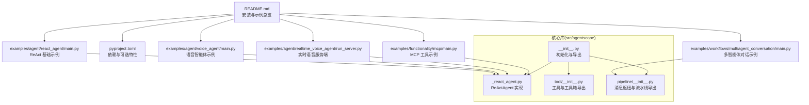
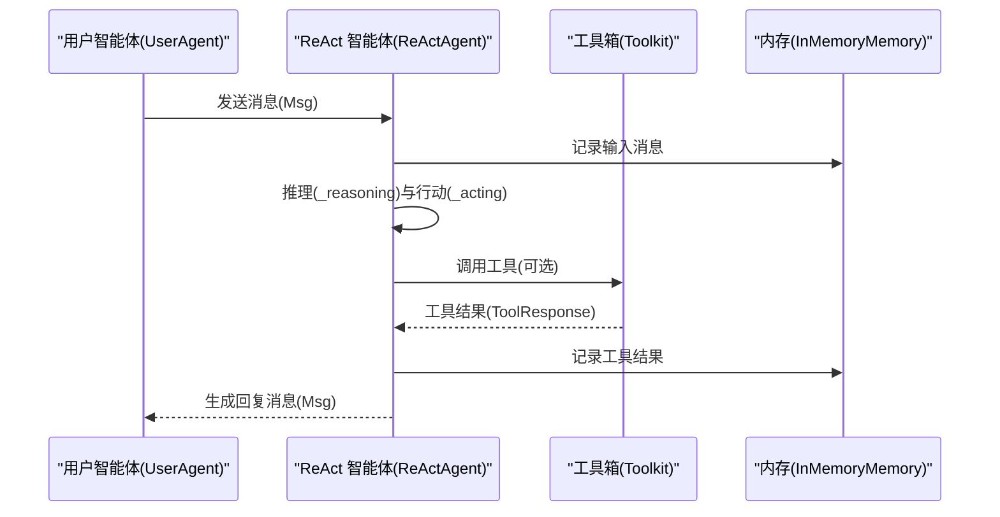
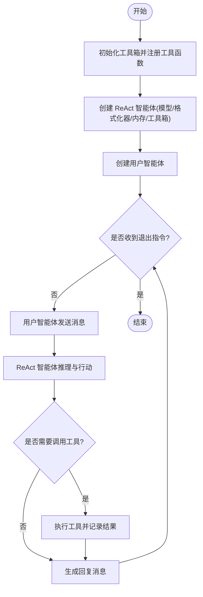
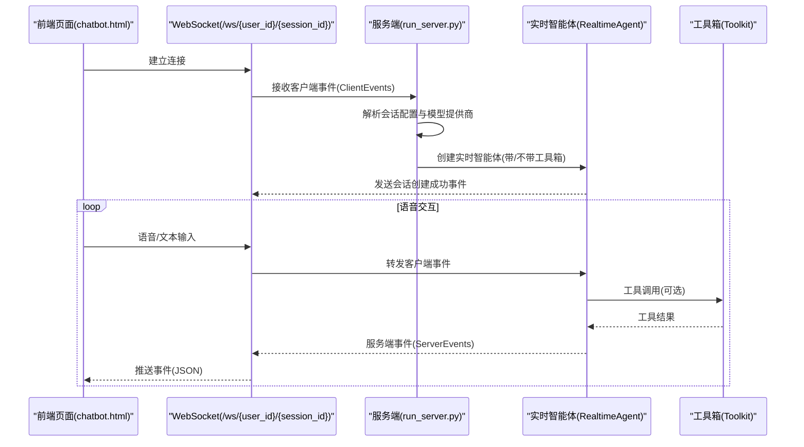
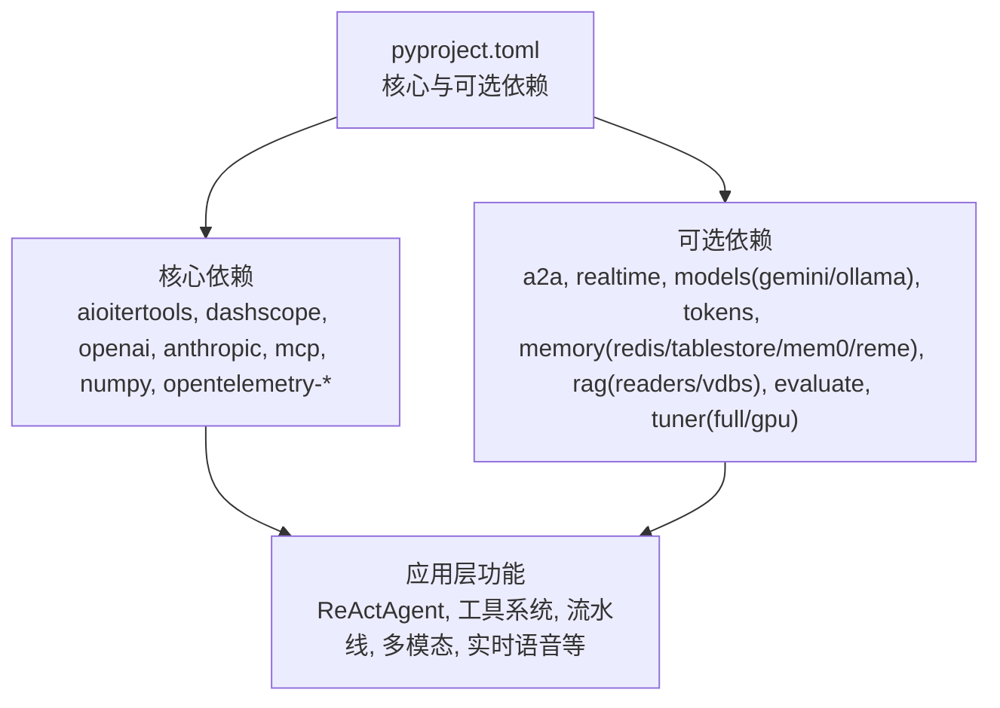

# 快速开始

<cite>
**本文引用的文件**
- [README.md](file://README.md)
- [pyproject.toml](file://pyproject.toml)
- [src/agentscope/__init__.py](file://src/agentscope/__init__.py)
- [src/agentscope/agent/_react_agent.py](file://src/agentscope/agent/_react_agent.py)
- [src/agentscope/tool/__init__.py](file://src/agentscope/tool/__init__.py)
- [src/agentscope/pipeline/__init__.py](file://src/agentscope/pipeline/__init__.py)
- [examples/agent/react_agent/main.py](file://examples/agent/react_agent/main.py)
- [examples/agent/voice_agent/main.py](file://examples/agent/voice_agent/main.py)
- [examples/agent/realtime_voice_agent/run_server.py](file://examples/agent/realtime_voice_agent/run_server.py)
- [examples/functionality/mcp/main.py](file://examples/functionality/mcp/main.py)
- [examples/workflows/multiagent_conversation/main.py](file://examples/workflows/multiagent_conversation/main.py)
- [docs/tutorial/zh_CN/src/quickstart_installation.py](file://docs/tutorial/zh_CN/src/quickstart_installation.py)
- [docs/tutorial/zh_CN/src/quickstart_agent.py](file://docs/tutorial/zh_CN/src/quickstart_agent.py)
- [docs/tutorial/zh_CN/src/quickstart_message.py](file://docs/tutorial/zh_CN/src/quickstart_message.py)
</cite>

## 目录
1. [简介](#简介)
2. [项目结构](#项目结构)
3. [核心组件](#核心组件)
4. [架构总览](#架构总览)
5. [详细组件分析](#详细组件分析)
6. [依赖分析](#依赖分析)
7. [性能考虑](#性能考虑)
8. [故障排查指南](#故障排查指南)
9. [结论](#结论)
10. [附录](#附录)

## 简介
本指南面向希望快速上手 AgentScope 的开发者，提供从安装到运行 Hello AgentScope! 的完整路径，覆盖：
- 两种安装方式：从 PyPI 与从源码安装
- Python 3.10+ 的要求与环境准备
- 基础示例：ReAct 智能体、用户智能体与工具系统
- 多模态交互：语音智能体与实时语音智能体
- 实战场景：人机协作、灵活 MCP 使用、多智能体工作流
- 常见问题排查与学习路径建议

## 项目结构
AgentScope 采用模块化设计，核心能力集中在 agentscope 包内，示例与教程位于 examples 与 docs 目录。下图给出与“快速开始”相关的关键文件与模块关系。

**图表来源**
- [README.md:135-166](file://README.md#L135-L166)
- [pyproject.toml:1-214](file://pyproject.toml#L1-L214)
- [examples/agent/react_agent/main.py:1-51](file://examples/agent/react_agent/main.py#L1-L51)
- [examples/agent/voice_agent/main.py:1-51](file://examples/agent/voice_agent/main.py#L1-L51)
- [examples/agent/realtime_voice_agent/run_server.py:1-188](file://examples/agent/realtime_voice_agent/run_server.py#L1-L188)
- [examples/functionality/mcp/main.py:1-111](file://examples/functionality/mcp/main.py#L1-L111)
- [examples/workflows/multiagent_conversation/main.py:1-81](file://examples/workflows/multiagent_conversation/main.py#L1-L81)
- [src/agentscope/__init__.py:1-183](file://src/agentscope/__init__.py#L1-L183)
- [src/agentscope/agent/_react_agent.py:1-200](file://src/agentscope/agent/_react_agent.py#L1-L200)
- [src/agentscope/tool/__init__.py:1-45](file://src/agentscope/tool/__init__.py#L1-L45)
- [src/agentscope/pipeline/__init__.py:1-23](file://src/agentscope/pipeline/__init__.py#L1-L23)

**章节来源**
- [README.md:135-166](file://README.md#L135-L166)
- [pyproject.toml:1-214](file://pyproject.toml#L1-L214)

## 核心组件
- 初始化与全局配置：通过包级初始化函数设置运行标识、日志与可选连接 Studio/Tracing。
- ReAct 智能体：支持推理-行动循环、工具调用、结构化输出、实时介入等。
- 工具系统：提供常用工具（如执行代码、Shell、文件读写）与工具箱 Toolkit。
- 流水线与消息枢纽：提供多智能体对话与广播、顺序/并行流水线等能力。

**章节来源**
- [src/agentscope/__init__.py:72-157](file://src/agentscope/__init__.py#L72-L157)
- [src/agentscope/agent/_react_agent.py:98-200](file://src/agentscope/agent/_react_agent.py#L98-L200)
- [src/agentscope/tool/__init__.py:1-45](file://src/agentscope/tool/__init__.py#L1-L45)
- [src/agentscope/pipeline/__init__.py:1-23](file://src/agentscope/pipeline/__init__.py#L1-L23)

## 架构总览
下图展示“Hello AgentScope!”示例的端到端流程：用户智能体与 ReAct 智能体通过消息驱动交互，ReAct 智能体可选择性地使用工具箱与内存模块。

**图表来源**
- [examples/agent/react_agent/main.py:18-50](file://examples/agent/react_agent/main.py#L18-L50)
- [src/agentscope/agent/_react_agent.py:98-200](file://src/agentscope/agent/_react_agent.py#L98-L200)
- [src/agentscope/tool/__init__.py:1-45](file://src/agentscope/tool/__init__.py#L1-L45)

## 详细组件分析

### 安装与环境准备
- Python 版本要求：3.10 或更高。
- 两种安装方式：
  - 从 PyPI 安装：pip 或 uv。
  - 从源码安装：克隆仓库并在可编辑模式安装。
- 可选依赖：full/dev 等，按需安装以启用模型 API、RAG、评估、实时语音等功能。

**章节来源**
- [README.md:139-165](file://README.md#L139-L165)
- [pyproject.toml:21-45](file://pyproject.toml#L21-L45)
- [docs/tutorial/zh_CN/src/quickstart_installation.py:8-55](file://docs/tutorial/zh_CN/src/quickstart_installation.py#L8-L55)

### Hello AgentScope!
- 目标：启动一个 ReAct 智能体与用户智能体的对话，支持工具调用与内存记录。
- 关键步骤：
  - 准备工具箱并注册工具函数（如执行代码、Shell、文件读取）。
  - 创建 ReAct 智能体，配置模型、格式化器、内存与工具箱。
  - 创建用户智能体，循环接收与发送消息，直到收到退出指令。
- 运行方式：在示例脚本所在目录执行，确保已设置相应 API Key 环境变量。

**图表来源**
- [examples/agent/react_agent/main.py:18-50](file://examples/agent/react_agent/main.py#L18-L50)
- [src/agentscope/tool/__init__.py:1-45](file://src/agentscope/tool/__init__.py#L1-L45)

**章节来源**
- [README.md:170-211](file://README.md#L170-L211)
- [examples/agent/react_agent/main.py:18-50](file://examples/agent/react_agent/main.py#L18-L50)
- [docs/tutorial/zh_CN/src/quickstart_agent.py:101-130](file://docs/tutorial/zh_CN/src/quickstart_agent.py#L101-L130)

### 语音智能体
- 功能：支持文本与音频模态的多模态交互，适合语音助手场景。
- 关键点：模型需开启 audio 模态；示例中通过特定模型与参数实现文本与音频输出。
- 注意：启用音频输出后，工具调用可能受限，需结合实际场景权衡。

**章节来源**
- [README.md:213-228](file://README.md#L213-L228)
- [examples/agent/voice_agent/main.py:15-50](file://examples/agent/voice_agent/main.py#L15-L50)

### 实时语音智能体
- 功能：提供 Web 服务端与前端页面，支持 WebSocket 实时语音交互。
- 关键点：服务端根据模型提供商创建对应实时模型，支持工具调用（部分模型）；通过队列将服务端事件转发给前端。
- 运行方式：启动服务端后访问根路径查看前端页面，按提示进行语音交互。

**图表来源**
- [examples/agent/realtime_voice_agent/run_server.py:66-177](file://examples/agent/realtime_voice_agent/run_server.py#L66-L177)
- [src/agentscope/tool/__init__.py:1-45](file://src/agentscope/tool/__init__.py#L1-L45)

**章节来源**
- [README.md:221-228](file://README.md#L221-L228)
- [examples/agent/realtime_voice_agent/run_server.py:1-188](file://examples/agent/realtime_voice_agent/run_server.py#L1-L188)

### 人机协作与实时介入
- ReAct 智能体支持实时介入（Realtime Steering），可在推理过程中被中断并恢复。
- 场景：用户在智能体生成回复时进行干预，智能体保存上下文并继续对话。

**章节来源**
- [README.md:231-237](file://README.md#L231-L237)
- [src/agentscope/agent/_react_agent.py:98-200](file://src/agentscope/agent/_react_agent.py#L98-L200)

### 灵活 MCP 使用
- 功能：将 MCP 工具作为本地可调用函数注入工具箱，或直接调用，实现细粒度控制。
- 示例要点：创建状态化/无状态 MCP 客户端，连接后注册到工具箱；也可直接获取可调用函数手动执行。

**章节来源**
- [README.md:238-268](file://README.md#L238-L268)
- [examples/functionality/mcp/main.py:34-110](file://examples/functionality/mcp/main.py#L34-L110)

### 多智能体工作流
- 功能：通过消息枢纽与流水线组织多智能体对话，支持动态增删参与者与广播消息。
- 示例要点：创建多个 ReAct 智能体，使用消息枢纽进行自我介绍与轮流发言；中途删除/新增参与者并广播消息。

**章节来源**
- [README.md:283-312](file://README.md#L283-L312)
- [examples/workflows/multiagent_conversation/main.py:38-80](file://examples/workflows/multiagent_conversation/main.py#L38-L80)
- [src/agentscope/pipeline/__init__.py:5-22](file://src/agentscope/pipeline/__init__.py#L5-L22)

### 消息与多模态
- 消息结构：包含发送者名称、角色、内容与元数据；内容可为纯文本或多种内容块（文本、图像、音频、视频、工具调用/结果、思考块等）。
- 使用建议：将结构化输出放入元数据，避免参与提示构建；通过属性函数便捷提取文本内容。

**章节来源**
- [docs/tutorial/zh_CN/src/quickstart_message.py:67-268](file://docs/tutorial/zh_CN/src/quickstart_message.py#L67-L268)

## 依赖分析
- 核心依赖：异步迭代、模型 SDK（DashScope/OpenAI/Anthropic）、MCP、OpenTelemetry、语音与数据库相关库等。
- 可选依赖：A2A 协议、实时语音、模型 API（Gemini/Ollama）、Token 计数、内存后端（Redis/TableStore/Mem0/Reme）、RAG 读取器与向量库、评估与调优等。
- 安装建议：首次使用建议安装 full 以获得完整功能；后续按需裁剪。

**图表来源**
- [pyproject.toml:21-170](file://pyproject.toml#L21-L170)

**章节来源**
- [pyproject.toml:21-170](file://pyproject.toml#L21-L170)

## 性能考虑
- 工具调用：合理使用并行工具调用与流式响应，减少等待时间。
- 记忆压缩：在长对话场景中启用记忆压缩配置，降低上下文长度。
- 模型参数：根据任务选择合适的模型与流式/非流式输出，平衡延迟与稳定性。
- 实时语音：注意网络与音频编解码对延迟的影响，必要时优化服务端部署与前端渲染。

## 故障排查指南
- Python 版本不匹配：确保使用 Python 3.10+，否则安装或运行会报错。
- API Key 未设置：示例中涉及模型 API 的示例需要设置相应环境变量（如 DashScope/OpenAI/Gemini），否则会抛出认证错误。
- 依赖缺失：若缺少实时语音、RAG、评估或调优功能，按需安装对应可选依赖组。
- 权限与网络：实时语音示例需要网络访问与麦克风/扬声器权限；MCP 示例需确保 MCP 服务可达。
- 日志与追踪：可通过初始化函数开启日志与追踪，便于定位问题。

**章节来源**
- [README.md:139-165](file://README.md#L139-L165)
- [examples/agent/realtime_voice_agent/run_server.py:39-46](file://examples/agent/realtime_voice_agent/run_server.py#L39-L46)
- [src/agentscope/__init__.py:72-157](file://src/agentscope/__init__.py#L72-L157)

## 结论
通过本指南，您已掌握 AgentScope 的安装、基础示例与多模态交互能力，并了解人机协作、MCP 使用与多智能体工作流的实践路径。建议从 Hello AgentScope! 示例入手，逐步探索语音与实时语音、MCP 工具与多智能体对话，最后结合 full 依赖体验更丰富的生态集成。

## 附录
- 学习路径建议：
  - 初学者：先完成 Hello AgentScope! 与语音智能体示例，理解消息与工具系统。
  - 进阶者：尝试实时语音智能体与 MCP 工具，掌握多模态与外部工具集成。
  - 高级者：基于消息枢纽与流水线构建复杂多智能体工作流，结合评估与调优模块提升效果。