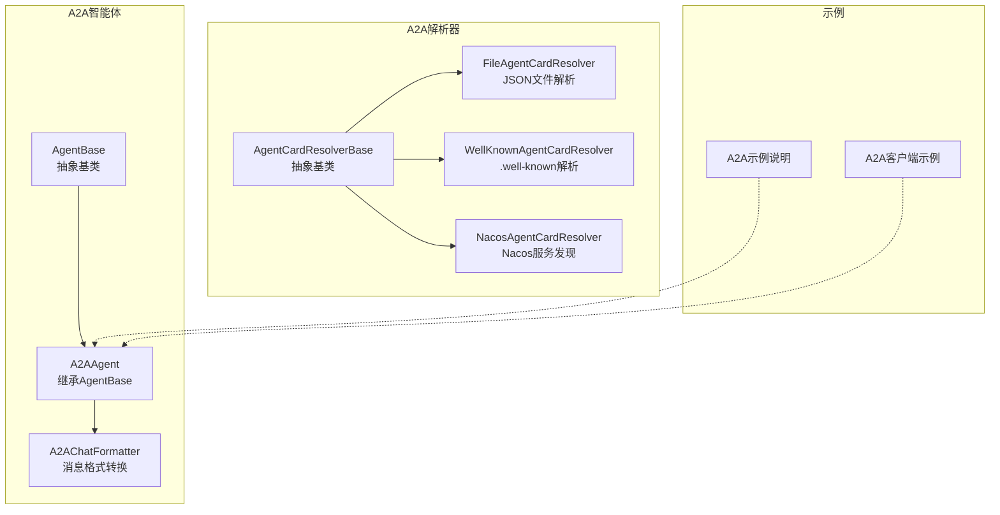
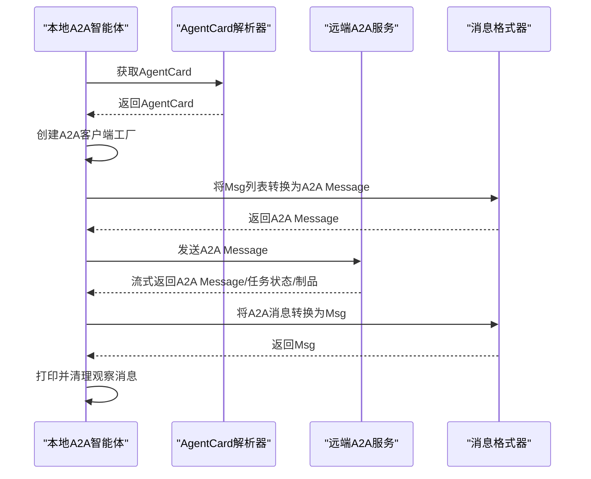
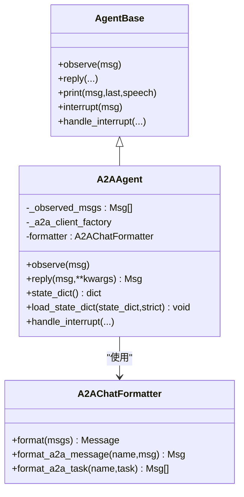
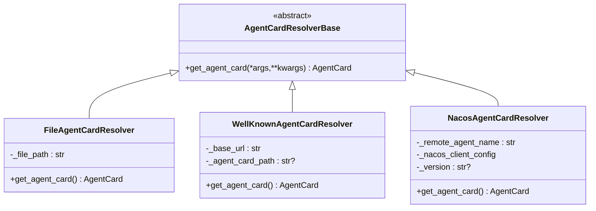
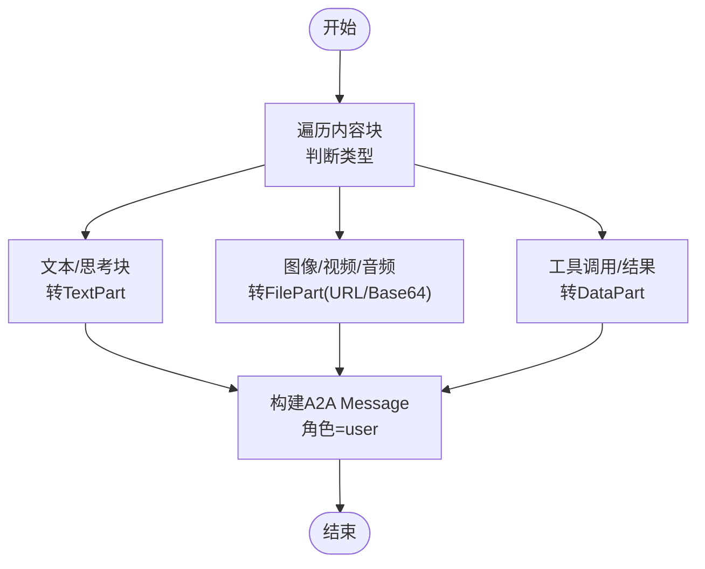
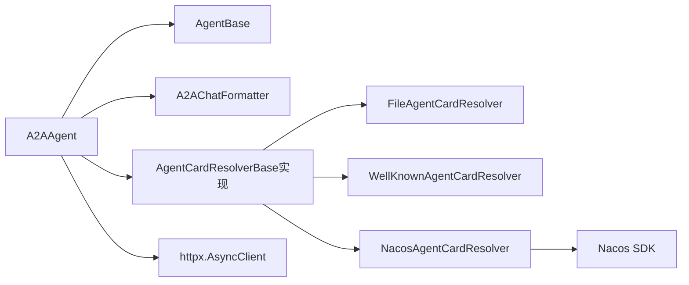

# A2A智能体

<cite>
**本文引用的文件**
- [src/agentscope/a2a/__init__.py](file://src/agentscope/a2a/__init__.py)
- [src/agentscope/a2a/_base.py](file://src/agentscope/a2a/_base.py)
- [src/agentscope/a2a/_file_resolver.py](file://src/agentscope/a2a/_file_resolver.py)
- [src/agentscope/a2a/_nacos_resolver.py](file://src/agentscope/a2a/_nacos_resolver.py)
- [src/agentscope/a2a/_well_known_resolver.py](file://src/agentscope/a2a/_well_known_resolver.py)
- [src/agentscope/agent/_a2a_agent.py](file://src/agentscope/agent/_a2a_agent.py)
- [src/agentscope/agent/_agent_base.py](file://src/agentscope/agent/_agent_base.py)
- [src/agentscope/formatter/_a2a_formatter.py](file://src/agentscope/formatter/_a2a_formatter.py)
- [examples/agent/a2a_agent/README.md](file://examples/agent/a2a_agent/README.md)
- [examples/agent/a2ui_agent/samples/client/a2a_client.py](file://examples/agent/a2ui_agent/samples/client/a2a_client.py)
</cite>

## 目录
1. [简介](#简介)
2. [项目结构](#项目结构)
3. [核心组件](#核心组件)
4. [架构总览](#架构总览)
5. [组件详解](#组件详解)
6. [依赖关系分析](#依赖关系分析)
7. [性能考量](#性能考量)
8. [故障排除指南](#故障排除指南)
9. [结论](#结论)
10. [附录](#附录)

## 简介
本文件面向AgentScope中的A2A（Agent-to-Agent）智能体，系统性阐述其通信协议、消息格式、连接与发现机制、与AgentBase的继承关系、远程智能体的发现与连接流程、解析器体系（file_resolver、nacos_resolver、well_known_resolver）、服务注册与注销流程、智能体间通信模式（同步/异步/消息转发/错误处理）、配置项（服务地址、认证方式、超时与重试策略）、与传统智能体的差异（网络通信、分布式处理、可扩展性），并提供部署指南、配置示例、故障排除与最佳实践。

## 项目结构
围绕A2A智能体的关键代码位于以下模块：
- a2a解析器：抽象基类与三种具体解析器（文件、Nacos、Well-Known）
- A2A智能体：继承AgentBase，负责消息转换与远程调用
- 消息格式器：负责AgentScope消息与A2A消息之间的双向转换
- 示例：A2A智能体示例与A2A客户端示例

**图示来源**
- [src/agentscope/a2a/_base.py:12-26](file://src/agentscope/a2a/_base.py#L12-L26)
- [src/agentscope/a2a/_file_resolver.py:15-79](file://src/agentscope/a2a/_file_resolver.py#L15-L79)
- [src/agentscope/a2a/_well_known_resolver.py:15-91](file://src/agentscope/a2a/_well_known_resolver.py#L15-L91)
- [src/agentscope/a2a/_nacos_resolver.py:17-99](file://src/agentscope/a2a/_nacos_resolver.py#L17-L99)
- [src/agentscope/agent/_agent_base.py:30-775](file://src/agentscope/agent/_agent_base.py#L30-L775)
- [src/agentscope/agent/_a2a_agent.py:29-289](file://src/agentscope/agent/_a2a_agent.py#L29-L289)
- [src/agentscope/formatter/_a2a_formatter.py:31-365](file://src/agentscope/formatter/_a2a_formatter.py#L31-L365)
- [examples/agent/a2a_agent/README.md:1-49](file://examples/agent/a2a_agent/README.md#L1-L49)
- [examples/agent/a2ui_agent/samples/client/a2a_client.py:1-156](file://examples/agent/a2ui_agent/samples/client/a2a_client.py#L1-L156)

**章节来源**
- [src/agentscope/a2a/__init__.py:1-15](file://src/agentscope/a2a/__init__.py#L1-L15)
- [src/agentscope/a2a/_base.py:12-26](file://src/agentscope/a2a/_base.py#L12-L26)
- [src/agentscope/a2a/_file_resolver.py:15-79](file://src/agentscope/a2a/_file_resolver.py#L15-L79)
- [src/agentscope/a2a/_well_known_resolver.py:15-91](file://src/agentscope/a2a/_well_known_resolver.py#L15-L91)
- [src/agentscope/a2a/_nacos_resolver.py:17-99](file://src/agentscope/a2a/_nacos_resolver.py#L17-L99)
- [src/agentscope/agent/_agent_base.py:30-775](file://src/agentscope/agent/_agent_base.py#L30-L775)
- [src/agentscope/agent/_a2a_agent.py:29-289](file://src/agentscope/agent/_a2a_agent.py#L29-L289)
- [src/agentscope/formatter/_a2a_formatter.py:31-365](file://src/agentscope/formatter/_a2a_formatter.py#L31-L365)
- [examples/agent/a2a_agent/README.md:1-49](file://examples/agent/a2a_agent/README.md#L1-L49)
- [examples/agent/a2ui_agent/samples/client/a2a_client.py:1-156](file://examples/agent/a2ui_agent/samples/client/a2a_client.py#L1-L156)

## 核心组件
- 解析器体系
  - 抽象基类：统一接口，定义异步获取AgentCard的能力
  - 文件解析器：从本地JSON文件加载AgentCard
  - Well-Known解析器：从标准well-known路径解析AgentCard
  - Nacos解析器：从Nacos服务拉取AgentCard并支持订阅更新
- A2A智能体
  - 继承AgentBase，封装A2A客户端工厂、消息观察与合并、消息格式化、任务状态与制品处理
  - 支持流式响应与任务状态轮询/推送
- 消息格式器
  - 将AgentScope消息转换为A2A消息（文本、多模态、工具调用）
  - 将A2A消息转换回AgentScope消息（含任务状态与制品）

**章节来源**
- [src/agentscope/a2a/_base.py:12-26](file://src/agentscope/a2a/_base.py#L12-L26)
- [src/agentscope/a2a/_file_resolver.py:15-79](file://src/agentscope/a2a/_file_resolver.py#L15-L79)
- [src/agentscope/a2a/_well_known_resolver.py:15-91](file://src/agentscope/a2a/_well_known_resolver.py#L15-L91)
- [src/agentscope/a2a/_nacos_resolver.py:17-99](file://src/agentscope/a2a/_nacos_resolver.py#L17-L99)
- [src/agentscope/agent/_a2a_agent.py:29-289](file://src/agentscope/agent/_a2a_agent.py#L29-L289)
- [src/agentscope/formatter/_a2a_formatter.py:31-365](file://src/agentscope/formatter/_a2a_formatter.py#L31-L365)

## 架构总览
A2A智能体通过解析器获取远端AgentCard，构造A2A客户端，将AgentScope消息转换为A2A消息后发送，接收A2A消息或任务状态/制品，再转换回AgentScope消息进行打印与后续处理。

**图示来源**
- [src/agentscope/agent/_a2a_agent.py:177-261](file://src/agentscope/agent/_a2a_agent.py#L177-L261)
- [src/agentscope/formatter/_a2a_formatter.py:35-145](file://src/agentscope/formatter/_a2a_formatter.py#L35-L145)
- [src/agentscope/a2a/_well_known_resolver.py:35-91](file://src/agentscope/a2a/_well_known_resolver.py#L35-L91)
- [src/agentscope/a2a/_file_resolver.py:58-79](file://src/agentscope/a2a/_file_resolver.py#L58-L79)
- [src/agentscope/a2a/_nacos_resolver.py:59-99](file://src/agentscope/a2a/_nacos_resolver.py#L59-L99)

## 组件详解

### A2A智能体类（A2AAgent）
- 继承关系
  - 继承自AgentBase，复用观察/回复/打印/钩子等通用能力
- 初始化
  - 接收AgentCard、可选客户端配置、消费者、附加传输生产者
  - 构造A2A客户端工厂（默认使用httpx异步客户端，带超时）
  - 注册附加传输生产者
  - 初始化消息观察缓冲区与A2A消息格式器
- 观察与回复
  - observe：将传入消息追加到本地观察队列
  - reply：合并观察消息与输入消息，转换为A2A消息，通过客户端流式消费响应；支持任务状态与制品的格式化输出
  - 不支持结构化输出参数（协议限制）
- 状态管理
  - 提供state_dict/load_state_dict以持久化观察消息
- 中断处理
  - handle_interrupt：生成提示消息并加入观察队列，便于下一次回复上下文延续

**图示来源**
- [src/agentscope/agent/_agent_base.py:30-775](file://src/agentscope/agent/_agent_base.py#L30-L775)
- [src/agentscope/agent/_a2a_agent.py:29-289](file://src/agentscope/agent/_a2a_agent.py#L29-L289)
- [src/agentscope/formatter/_a2a_formatter.py:31-365](file://src/agentscope/formatter/_a2a_formatter.py#L31-L365)

**章节来源**
- [src/agentscope/agent/_a2a_agent.py:29-289](file://src/agentscope/agent/_a2a_agent.py#L29-L289)
- [src/agentscope/agent/_agent_base.py:30-775](file://src/agentscope/agent/_agent_base.py#L30-L775)
- [src/agentscope/formatter/_a2a_formatter.py:31-365](file://src/agentscope/formatter/_a2a_formatter.py#L31-L365)

### 解析器系统
- 抽象基类
  - 定义异步获取AgentCard的抽象方法
- 文件解析器（FileAgentCardResolver）
  - 从本地JSON文件读取AgentCard，校验文件存在性与类型
- Well-Known解析器（WellKnownAgentCardResolver）
  - 从well-known路径解析AgentCard，支持URL合法性检查与默认路径
- Nacos解析器（NacosAgentCardResolver）
  - 通过Nacos AI服务获取AgentCard，支持版本选择与客户端生命周期管理

**图示来源**
- [src/agentscope/a2a/_base.py:12-26](file://src/agentscope/a2a/_base.py#L12-L26)
- [src/agentscope/a2a/_file_resolver.py:15-79](file://src/agentscope/a2a/_file_resolver.py#L15-L79)
- [src/agentscope/a2a/_well_known_resolver.py:15-91](file://src/agentscope/a2a/_well_known_resolver.py#L15-L91)
- [src/agentscope/a2a/_nacos_resolver.py:17-99](file://src/agentscope/a2a/_nacos_resolver.py#L17-L99)

**章节来源**
- [src/agentscope/a2a/_base.py:12-26](file://src/agentscope/a2a/_base.py#L12-L26)
- [src/agentscope/a2a/_file_resolver.py:15-79](file://src/agentscope/a2a/_file_resolver.py#L15-L79)
- [src/agentscope/a2a/_well_known_resolver.py:15-91](file://src/agentscope/a2a/_well_known_resolver.py#L15-L91)
- [src/agentscope/a2a/_nacos_resolver.py:17-99](file://src/agentscope/a2a/_nacos_resolver.py#L17-L99)

### 消息格式化（A2AChatFormatter）
- 正向转换（AgentScope Msg → A2A Message）
  - 文本、思考块、图像/视频/音频（URL或Base64）、工具调用/结果
  - 多条消息合并为单条A2A消息，角色设为user
- 反向转换（A2A Message → AgentScope Msg）
  - 将A2A消息的角色映射为user/assistant
  - 将任务状态消息与制品转换为Msg并合并
- 类型推断
  - 基于URI或MIME类型推断媒体类型

**图示来源**
- [src/agentscope/formatter/_a2a_formatter.py:35-145](file://src/agentscope/formatter/_a2a_formatter.py#L35-L145)

**章节来源**
- [src/agentscope/formatter/_a2a_formatter.py:31-365](file://src/agentscope/formatter/_a2a_formatter.py#L31-L365)

### 通信模式与错误处理
- 同步/异步
  - A2A客户端采用异步迭代器返回响应，A2AAgent逐项消费并即时打印
- 消息转发
  - A2AAgent内部维护观察消息队列，在reply中合并后发送
- 错误处理
  - 解析器异常记录日志并抛出运行时错误
  - Nacos客户端关闭失败仅警告，避免影响主流程
  - A2AAgent未收到响应时抛出错误

**章节来源**
- [src/agentscope/agent/_a2a_agent.py:177-261](file://src/agentscope/agent/_a2a_agent.py#L177-L261)
- [src/agentscope/a2a/_well_known_resolver.py:35-91](file://src/agentscope/a2a/_well_known_resolver.py#L35-L91)
- [src/agentscope/a2a/_nacos_resolver.py:59-99](file://src/agentscope/a2a/_nacos_resolver.py#L59-L99)

### 配置选项与使用要点
- 服务地址
  - 由AgentCard提供（文件/Nacos/Well-Known解析器均返回AgentCard）
- 认证方式
  - 示例客户端展示了通过请求头注入扩展能力标识的做法，具体认证取决于远端服务实现
- 超时与重试
  - 默认httpx异步客户端超时可配置；解析器与客户端在异常时记录日志
- 重试策略
  - 未内置自动重试逻辑，建议在上层业务中结合异常捕获与指数退避策略

**章节来源**
- [src/agentscope/agent/_a2a_agent.py:48-98](file://src/agentscope/agent/_a2a_agent.py#L48-L98)
- [examples/agent/a2ui_agent/samples/client/a2a_client.py:22-156](file://examples/agent/a2ui_agent/samples/client/a2a_client.py#L22-L156)

### 与传统智能体的区别
- 网络通信
  - A2A智能体通过HTTP/异步客户端与远端服务通信，传统智能体通常在本地内存中执行
- 分布式处理
  - A2A智能体可对接任意符合A2A协议的服务端，具备横向扩展能力
- 可扩展性
  - 通过解析器体系与客户端工厂，支持多种服务发现与传输协议

**章节来源**
- [src/agentscope/agent/_a2a_agent.py:29-73](file://src/agentscope/agent/_a2a_agent.py#L29-L73)
- [src/agentscope/a2a/_nacos_resolver.py:17-44](file://src/agentscope/a2a/_nacos_resolver.py#L17-L44)

### 部署指南与示例
- 环境准备
  - 安装A2A SDK与AgentScope A2A功能包
- 启动示例服务端
  - 使用示例脚本启动A2A服务端
- 运行A2A智能体
  - 通过示例主程序与AgentCard进行交互
- A2A客户端示例
  - 展示从well-known路径解析AgentCard并发送消息的完整流程

**章节来源**
- [examples/agent/a2a_agent/README.md:25-49](file://examples/agent/a2a_agent/README.md#L25-L49)
- [examples/agent/a2ui_agent/samples/client/a2a_client.py:22-156](file://examples/agent/a2ui_agent/samples/client/a2a_client.py#L22-L156)

## 依赖关系分析
- 组件耦合
  - A2AAgent依赖AgentBase提供的观察/回复/打印/钩子框架
  - A2AAgent依赖A2AChatFormatter完成消息双向转换
  - 解析器独立于A2AAgent，通过AgentCard解耦服务发现与通信层
- 外部依赖
  - httpx用于异步HTTP通信
  - Nacos SDK用于服务发现（可选）
  - 日志记录用于异常与调试信息

**图示来源**
- [src/agentscope/agent/_a2a_agent.py:29-98](file://src/agentscope/agent/_a2a_agent.py#L29-L98)
- [src/agentscope/agent/_agent_base.py:30-775](file://src/agentscope/agent/_agent_base.py#L30-L775)
- [src/agentscope/formatter/_a2a_formatter.py:31-365](file://src/agentscope/formatter/_a2a_formatter.py#L31-L365)
- [src/agentscope/a2a/_file_resolver.py:15-79](file://src/agentscope/a2a/_file_resolver.py#L15-L79)
- [src/agentscope/a2a/_well_known_resolver.py:15-91](file://src/agentscope/a2a/_well_known_resolver.py#L15-L91)
- [src/agentscope/a2a/_nacos_resolver.py:17-99](file://src/agentscope/a2a/_nacos_resolver.py#L17-L99)

**章节来源**
- [src/agentscope/agent/_a2a_agent.py:29-98](file://src/agentscope/agent/_a2a_agent.py#L29-L98)
- [src/agentscope/a2a/_file_resolver.py:15-79](file://src/agentscope/a2a/_file_resolver.py#L15-L79)
- [src/agentscope/a2a/_well_known_resolver.py:15-91](file://src/agentscope/a2a/_well_known_resolver.py#L15-L91)
- [src/agentscope/a2a/_nacos_resolver.py:17-99](file://src/agentscope/a2a/_nacos_resolver.py#L17-L99)

## 性能考量
- 异步I/O
  - 使用httpx异步客户端，减少阻塞，提升并发吞吐
- 流式消费
  - A2A客户端以异步迭代器返回响应，A2AAgent边接收边打印，降低端到端延迟
- 资源管理
  - Nacos客户端在使用后显式关闭，避免资源泄露
- 建议
  - 对高并发场景，结合连接池与超时策略优化
  - 在上层对异常进行指数退避重试，避免瞬时故障放大

[本节为通用指导，无需列出章节来源]

## 故障排除指南
- AgentCard解析失败
  - 文件解析器：确认文件存在且为文件类型
  - Well-Known解析器：检查URL格式与网络可达性
  - Nacos解析器：确认Nacos客户端配置正确与服务可用
- 无响应或超时
  - 检查远端服务是否正常，适当增大超时时间
- Nacos客户端关闭异常
  - 仅记录警告，不影响主流程，可在运维侧关注资源占用
- 结构化输出报错
  - A2AAgent不支持该参数，需移除或改用其他智能体

**章节来源**
- [src/agentscope/a2a/_file_resolver.py:67-78](file://src/agentscope/a2a/_file_resolver.py#L67-L78)
- [src/agentscope/a2a/_well_known_resolver.py:46-90](file://src/agentscope/a2a/_well_known_resolver.py#L46-L90)
- [src/agentscope/a2a/_nacos_resolver.py:89-99](file://src/agentscope/a2a/_nacos_resolver.py#L89-L99)
- [src/agentscope/agent/_a2a_agent.py:206-211](file://src/agentscope/agent/_a2a_agent.py#L206-L211)

## 结论
A2A智能体通过标准化的解析器体系与消息格式化器，实现了AgentScope与远端A2A服务的无缝对接。其异步流式通信、可插拔的传输与服务发现机制，使其在分布式与可扩展场景中具备显著优势。结合示例与最佳实践，开发者可快速构建跨服务的Agent协作方案。

[本节为总结性内容，无需列出章节来源]

## 附录
- 最佳实践
  - 明确AgentCard来源与版本控制，优先使用Well-Known或Nacos解析器
  - 在上层实现指数退避与熔断策略，增强鲁棒性
  - 使用观察消息队列保持上下文一致性
  - 对任务状态与制品进行分阶段打印与合并，提升可观测性
- 相关示例
  - A2A智能体示例与A2A客户端示例提供了从解析AgentCard到发送消息的完整链路

**章节来源**
- [examples/agent/a2a_agent/README.md:1-49](file://examples/agent/a2a_agent/README.md#L1-L49)
- [examples/agent/a2ui_agent/samples/client/a2a_client.py:22-156](file://examples/agent/a2ui_agent/samples/client/a2a_client.py#L22-L156)