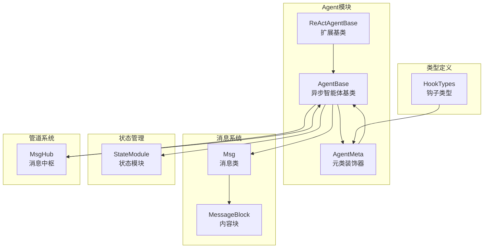
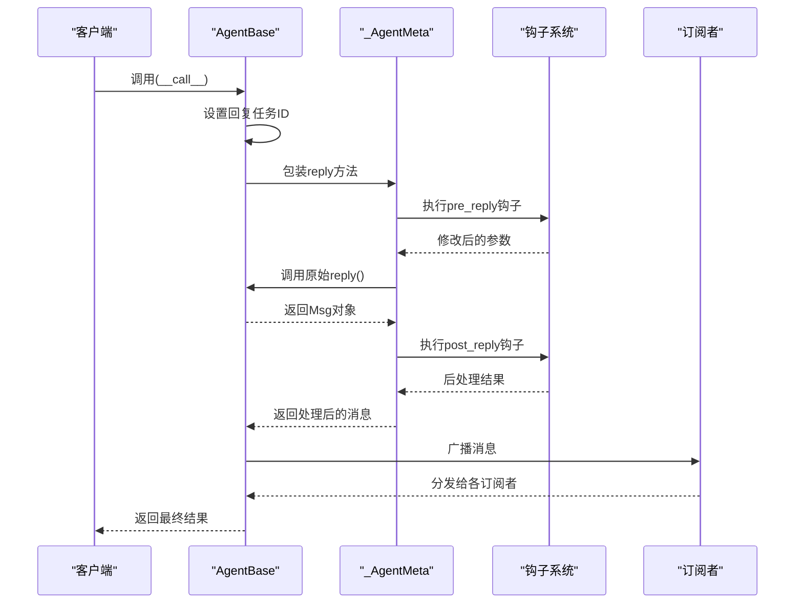
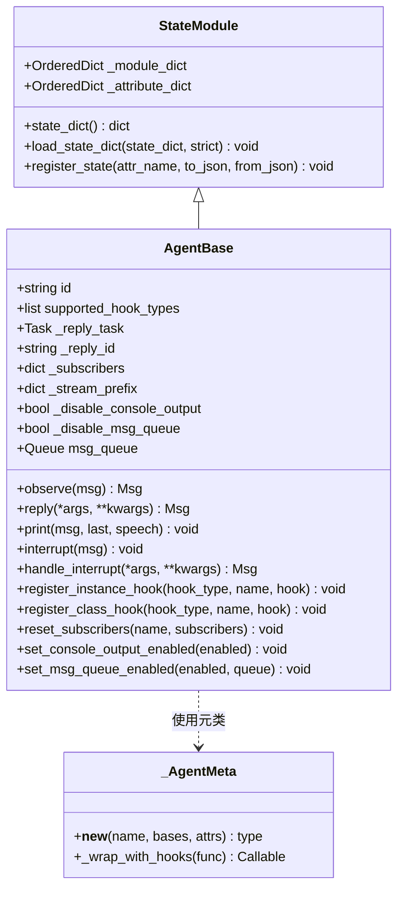
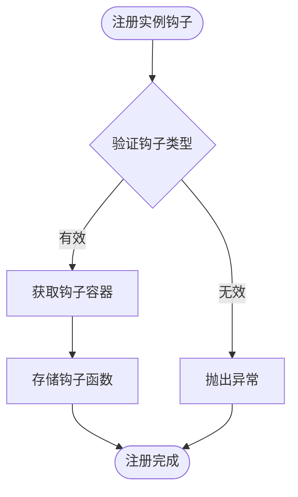
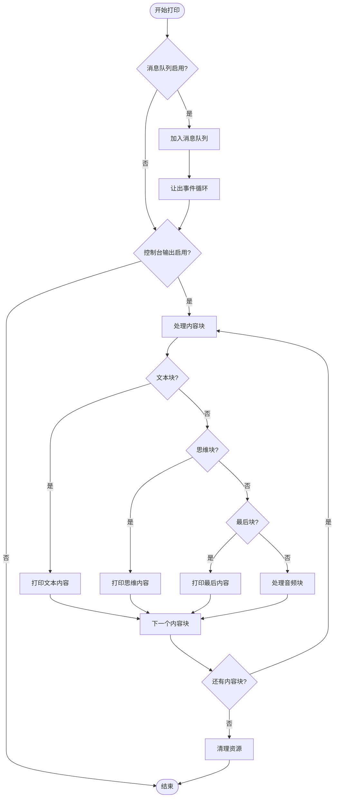
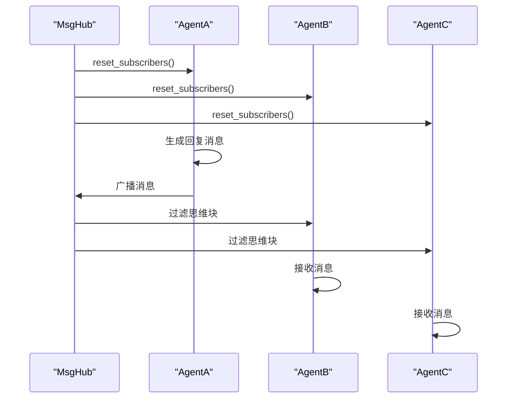
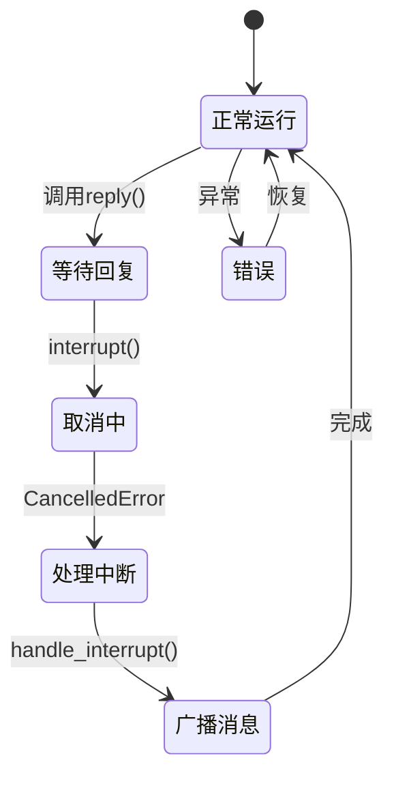
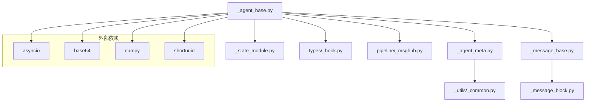

# AgentBase基类

<cite>
**本文档引用的文件**
- [src/agentscope/agent/_agent_base.py](file://src/agentscope/agent/_agent_base.py)
- [src/agentscope/agent/_agent_meta.py](file://src/agentscope/agent/_agent_meta.py)
- [src/agentscope/module/_state_module.py](file://src/agentscope/module/_state_module.py)
- [src/agentscope/message/_message_base.py](file://src/agentscope/message/_message_base.py)
- [src/agentscope/types/_hook.py](file://src/agentscope/types/_hook.py)
- [src/agentscope/pipeline/_msghub.py](file://src/agentscope/pipeline/_msghub.py)
- [examples/functionality/stream_printing_messages/single_agent.py](file://examples/functionality/stream_printing_messages/single_agent.py)
- [examples/functionality/stream_printing_messages/multi_agent.py](file://examples/functionality/stream_printing_messages/multi_agent.py)
- [tests/hook_test.py](file://tests/hook_test.py)
</cite>

## 目录
1. [简介](#简介)
2. [项目结构](#项目结构)
3. [核心组件](#核心组件)
4. [架构概览](#架构概览)
5. [详细组件分析](#详细组件分析)
6. [依赖分析](#依赖分析)
7. [性能考虑](#性能考虑)
8. [故障排除指南](#故障排除指南)
9. [结论](#结论)
10. [附录](#附录)

## 简介
AgentBase是AgentScope框架中所有智能体的基础类，采用异步架构设计，提供了统一的生命周期管理、钩子系统、订阅者模式、中断处理和消息队列等核心能力。该类继承自StateModule，支持状态序列化与反序列化，并通过元类机制为关键方法（reply、print、observe）提供预处理和后处理钩子功能。

## 项目结构
AgentBase位于agentscope的agent模块中，与消息系统、状态模块、钩子类型定义以及消息中枢（MsgHub）紧密协作：

**图表来源**
- [src/agentscope/agent/_agent_base.py:30-775](file://src/agentscope/agent/_agent_base.py#L30-L775)
- [src/agentscope/agent/_agent_meta.py:159-174](file://src/agentscope/agent/_agent_meta.py#L159-L174)
- [src/agentscope/module/_state_module.py:20-152](file://src/agentscope/module/_state_module.py#L20-L152)
- [src/agentscope/message/_message_base.py:21-200](file://src/agentscope/message/_message_base.py#L21-L200)
- [src/agentscope/pipeline/_msghub.py:47-156](file://src/agentscope/pipeline/_msghub.py#L47-L156)
- [src/agentscope/types/_hook.py:5-25](file://src/agentscope/types/_hook.py#L5-L25)

**章节来源**
- [src/agentscope/agent/_agent_base.py:30-775](file://src/agentscope/agent/_agent_base.py#L30-L775)
- [src/agentscope/agent/_agent_meta.py:159-174](file://src/agentscope/agent/_agent_meta.py#L159-L174)

## 核心组件
AgentBase提供了以下核心功能：

### 异步架构设计
- 基于asyncio的Task管理，支持协程调度和并发执行
- 内置事件循环支持，确保异步操作的正确性
- 非阻塞的消息处理和流式输出机制

### 生命周期管理
- 智能体唯一标识符生成（shortuuid）
- 回复任务跟踪和取消机制
- 状态模块集成，支持嵌套状态序列化

### 钩子系统
- 支持6种钩子类型：pre_reply、post_reply、pre_print、post_print、pre_observe、post_observe
- 实例级钩子和类级钩子双重注册机制
- 钩子执行顺序保证和重入保护

### 订阅者模式
- 自动广播机制，向所有订阅者分发消息
- 思维块过滤，隐藏内部推理过程
- 多Agent协作支持

**章节来源**
- [src/agentscope/agent/_agent_base.py:30-184](file://src/agentscope/agent/_agent_base.py#L30-L184)
- [src/agentscope/agent/_agent_meta.py:55-156](file://src/agentscope/agent/_agent_meta.py#L55-L156)

## 架构概览
AgentBase采用元类装饰器模式，为关键方法提供横切关注点：

**图表来源**
- [src/agentscope/agent/_agent_base.py:448-467](file://src/agentscope/agent/_agent_base.py#L448-L467)
- [src/agentscope/agent/_agent_meta.py:55-156](file://src/agentscope/agent/_agent_meta.py#L55-L156)

## 详细组件分析

### AgentBase类结构
AgentBase继承自StateModule，实现了异步智能体的核心功能：

**图表来源**
- [src/agentscope/agent/_agent_base.py:30-775](file://src/agentscope/agent/_agent_base.py#L30-L775)
- [src/agentscope/module/_state_module.py:20-152](file://src/agentscope/module/_state_module.py#L20-L152)
- [src/agentscope/agent/_agent_meta.py:159-174](file://src/agentscope/agent/_agent_meta.py#L159-L174)

### 钩子系统详解
AgentBase支持两种钩子注册方式：

#### 实例级钩子

**图表来源**
- [src/agentscope/agent/_agent_base.py:533-559](file://src/agentscope/agent/_agent_base.py#L533-L559)

#### 类级钩子
类级钩子对所有实例生效，优先级低于实例级钩子：
- 预处理钩子（pre_*）：修改输入参数
- 后处理钩子（post_*）：修改输出结果

**章节来源**
- [src/agentscope/agent/_agent_base.py:46-138](file://src/agentscope/agent/_agent_base.py#L46-L138)
- [src/agentscope/agent/_agent_meta.py:55-156](file://src/agentscope/agent/_agent_meta.py#L55-L156)

### 输出系统分析
AgentBase的print方法支持多种输出格式和流式处理：

**图表来源**
- [src/agentscope/agent/_agent_base.py:205-275](file://src/agentscope/agent/_agent_base.py#L205-L275)

### 订阅者模式实现
AgentBase通过MsgHub实现多智能体协作：

**图表来源**
- [src/agentscope/agent/_agent_base.py:469-486](file://src/agentscope/agent/_agent_base.py#L469-L486)
- [src/agentscope/pipeline/_msghub.py:89-94](file://src/agentscope/pipeline/_msghub.py#L89-L94)

**章节来源**
- [src/agentscope/agent/_agent_base.py:469-514](file://src/agentscope/agent/_agent_base.py#L469-L514)
- [src/agentscope/pipeline/_msghub.py:47-156](file://src/agentscope/pipeline/_msghub.py#L47-L156)

### 中断处理机制
AgentBase提供完善的中断处理能力：

**图表来源**
- [src/agentscope/agent/_agent_base.py:457-467](file://src/agentscope/agent/_agent_base.py#L457-L467)
- [src/agentscope/agent/_agent_base.py:528-532](file://src/agentscope/agent/_agent_base.py#L528-L532)

**章节来源**
- [src/agentscope/agent/_agent_base.py:516-532](file://src/agentscope/agent/_agent_base.py#L516-L532)

## 依赖分析
AgentBase的依赖关系如下：

**图表来源**
- [src/agentscope/agent/_agent_base.py:1-28](file://src/agentscope/agent/_agent_base.py#L1-L28)
- [src/agentscope/agent/_agent_meta.py:1-18](file://src/agentscope/agent/_agent_meta.py#L1-L18)
- [src/agentscope/message/_message_base.py:1-18](file://src/agentscope/message/_message_base.py#L1-L18)

**章节来源**
- [src/agentscope/agent/_agent_base.py:1-28](file://src/agentscope/agent/_agent_base.py#L1-L28)

## 性能考虑
AgentBase在设计时充分考虑了性能优化：

### 异步I/O优化
- 使用asyncio.Queue进行非阻塞消息传递
- 事件循环让出机制避免独占CPU
- 流式音频播放使用低延迟配置

### 内存管理
- 智能体ID使用shortuuid减少内存占用
- 流式前缀缓存避免重复输出
- 音频播放器资源及时释放

### 并发控制
- Task级别的取消和恢复机制
- 钩子执行的重入保护
- 订阅者广播的异步处理

## 故障排除指南

### 常见问题及解决方案

#### 钩子注册错误
**问题**：注册实例钩子时报TypeError
**原因**：未调用父类构造函数初始化钩子容器
**解决**：确保在子类构造函数中调用super().__init__()

#### 消息队列问题
**问题**：流式输出阻塞
**解决**：检查消息队列是否启用，适当调整队列大小

#### 音频播放失败
**问题**：音频块播放异常
**解决**：检查音频源类型和网络连接，确保sounddevice库正常安装

**章节来源**
- [src/agentscope/agent/_agent_base.py:671-700](file://src/agentscope/agent/_agent_base.py#L671-L700)
- [src/agentscope/agent/_agent_base.py:289-367](file://src/agentscope/agent/_agent_base.py#L289-L367)

## 结论
AgentBase作为AgentScope的核心基础类，通过异步架构、钩子系统、订阅者模式等设计，为智能体开发提供了强大的基础设施。其模块化的架构设计使得开发者可以轻松扩展和定制智能体行为，同时保持良好的性能和可维护性。

## 附录

### API参考

#### 核心方法
- `observe(msg)`: 接收消息但不生成回复
- `reply(*args, **kwargs)`: 生成智能体回复
- `print(msg, last=True, speech=None)`: 控制台输出和流式消息处理

#### 钩子管理
- `register_instance_hook(hook_type, name, hook)`: 注册实例级钩子
- `register_class_hook(hook_type, name, hook)`: 注册类级钩子
- `clear_instance_hooks(hook_type=None)`: 清空实例级钩子

#### 系统控制
- `interrupt(msg=None)`: 中断当前回复进程
- `set_console_output_enabled(enabled)`: 控制台输出开关
- `set_msg_queue_enabled(enabled, queue=None)`: 消息队列开关

### 使用示例
完整的使用示例可在以下文件中找到：
- 单智能体流式输出示例：examples/functionality/stream_printing_messages/single_agent.py
- 多智能体协作示例：examples/functionality/stream_printing_messages/multi_agent.py

**章节来源**
- [examples/functionality/stream_printing_messages/single_agent.py:21-62](file://examples/functionality/stream_printing_messages/single_agent.py#L21-L62)
- [examples/functionality/stream_printing_messages/multi_agent.py:27-62](file://examples/functionality/stream_printing_messages/multi_agent.py#L27-L62)