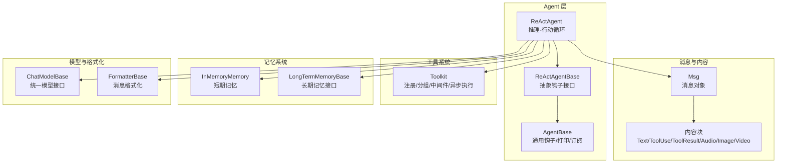
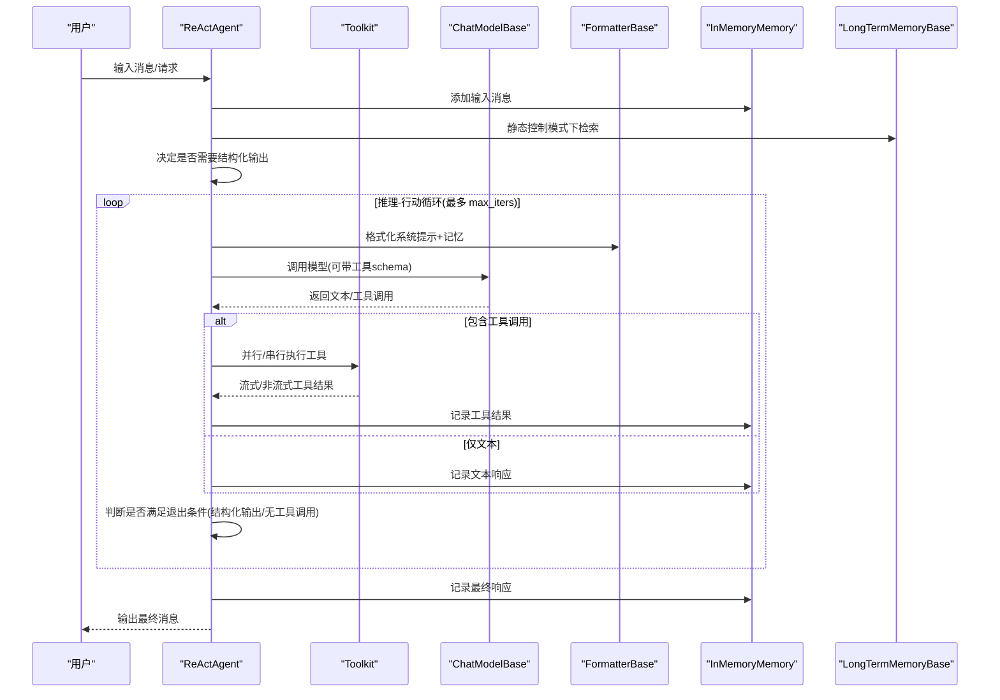
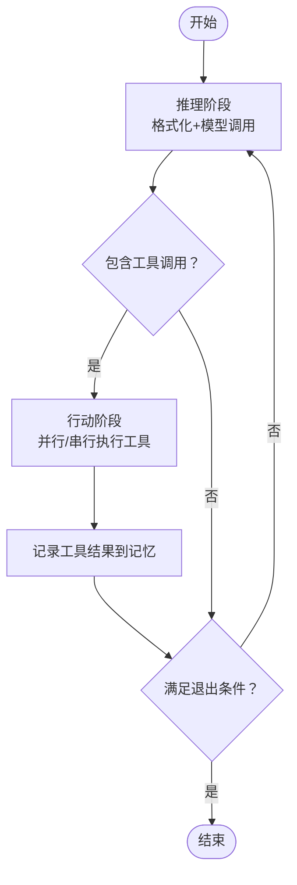
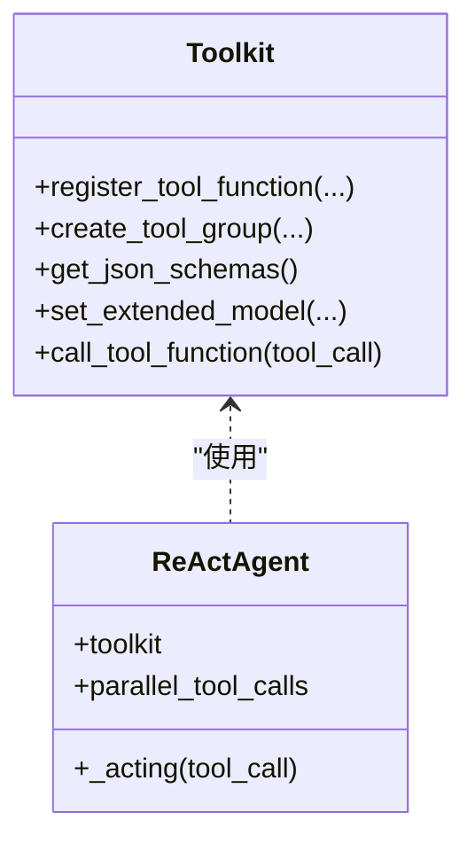
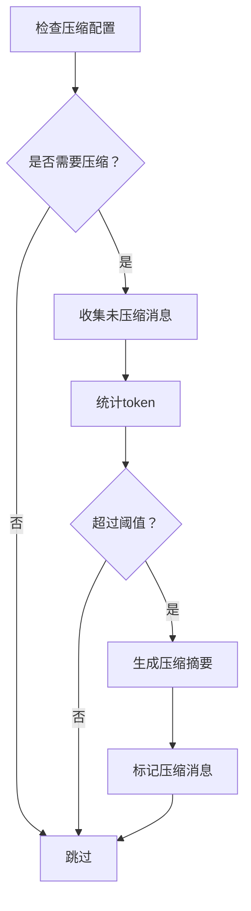
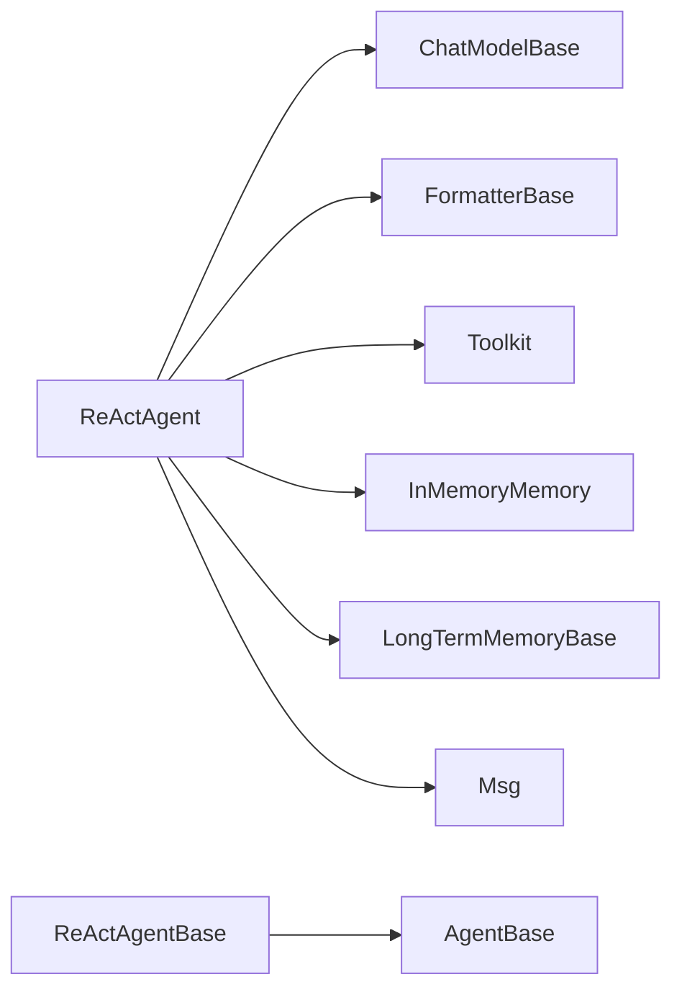

# ReAct智能体

<cite>
**本文引用的文件列表**
- [ReActAgent 类定义](file://src/agentscope/agent/_react_agent.py)
- [ReActAgent 基类](file://src/agentscope/agent/_react_agent_base.py)
- [AgentBase 基类](file://src/agentscope/agent/_agent_base.py)
- [示例：ReActAgent 主程序](file://examples/agent/react_agent/main.py)
- [单元测试：ReActAgent](file://tests/react_agent_test.py)
- [工具箱 Toolkit](file://src/agentscope/tool/_toolkit.py)
- [消息 Msg](file://src/agentscope/message/_message_base.py)
- [内存 InMemoryMemory](file://src/agentscope/memory/_working_memory/_in_memory_memory.py)
- [模型 ChatModelBase](file://src/agentscope/model/_model_base.py)
- [格式化器 FormatterBase](file://src/agentscope/formatter/_formatter_base.py)
</cite>

## 目录
1. [简介](#简介)
2. [项目结构](#项目结构)
3. [核心组件](#核心组件)
4. [架构总览](#架构总览)
5. [详细组件分析](#详细组件分析)
6. [依赖关系分析](#依赖关系分析)
7. [性能考量](#性能考量)
8. [故障排查指南](#故障排查指南)
9. [结论](#结论)
10. [附录](#附录)

## 简介
本文件面向使用者与开发者，系统性阐述 AgentScope 中 ReAct 智能体（ReActAgent）的设计与实现。ReAct 是一种“推理-行动”循环范式，通过在每一步中交替进行“思考（推理）”与“行动（工具调用）”，实现可控、可解释且可扩展的智能体行为。ReActAgent 在 AgentScope 的统一框架下，支持：
- 实时流式输出与中断处理
- 工具并行/串行调用
- 结构化输出生成与校验
- 长期记忆与检索增强（RAG）
- 计划工具组集成与动态开关
- 内存压缩与上下文窗口管理
- 可插拔的模型与格式化器

## 项目结构
ReActAgent 位于 agentscope/agent 子模块，围绕以下关键子系统协作：
- 消息与内容块：消息对象与文本/工具调用/工具结果/音视频等多模态内容块
- 工具系统：工具注册、分组、中间件、异步执行与流式响应
- 内存系统：短期记忆（可压缩）、长期记忆（检索/记录）
- 模型与格式化器：统一的模型接口与消息格式化
- 计划与提示：计划笔记本工具组与系统提示拼接

图示来源
- [ReActAgent 类定义:98-374](file://src/agentscope/agent/_react_agent.py#L98-L374)
- [ReActAgent 基类:12-117](file://src/agentscope/agent/_react_agent_base.py#L12-L117)
- [AgentBase 基类:30-117](file://src/agentscope/agent/_agent_base.py#L30-L117)
- [消息 Msg:21-100](file://src/agentscope/message/_message_base.py#L21-L100)
- [工具箱 Toolkit:117-186](file://src/agentscope/tool/_toolkit.py#L117-L186)
- [内存 InMemoryMemory:10-30](file://src/agentscope/memory/_working_memory/_in_memory_memory.py#L10-L30)
- [模型 ChatModelBase:13-44](file://src/agentscope/model/_model_base.py#L13-L44)
- [格式化器 FormatterBase:11-18](file://src/agentscope/formatter/_formatter_base.py#L11-L18)

章节来源
- [ReActAgent 类定义:98-374](file://src/agentscope/agent/_react_agent.py#L98-L374)
- [ReActAgent 基类:12-117](file://src/agentscope/agent/_react_agent_base.py#L12-L117)
- [AgentBase 基类:30-117](file://src/agentscope/agent/_agent_base.py#L30-L117)

## 核心组件
- ReActAgent：ReAct 智能体主体，负责推理-行动循环、工具调用、结构化输出、记忆压缩与检索增强
- ReActAgentBase：定义抽象的推理与行动钩子接口，并声明支持的钩子类型
- AgentBase：提供通用的回复生命周期钩子、打印、观察、订阅广播、中断处理等能力
- Toolkit：工具注册、分组、中间件、异步执行与流式响应
- Msg 与内容块：统一的消息结构与多模态内容表达
- InMemoryMemory：短期记忆存储与标记管理
- ChatModelBase：模型统一接口，支持工具调用与流式输出
- FormatterBase：将消息转换为模型 API 所需格式

章节来源
- [ReActAgent 类定义:98-374](file://src/agentscope/agent/_react_agent.py#L98-L374)
- [ReActAgent 基类:12-117](file://src/agentscope/agent/_react_agent_base.py#L12-L117)
- [AgentBase 基类:30-117](file://src/agentscope/agent/_agent_base.py#L30-L117)
- [工具箱 Toolkit:117-186](file://src/agentscope/tool/_toolkit.py#L117-L186)
- [消息 Msg:21-100](file://src/agentscope/message/_message_base.py#L21-L100)
- [内存 InMemoryMemory:10-30](file://src/agentscope/memory/_working_memory/_in_memory_memory.py#L10-L30)
- [模型 ChatModelBase:13-44](file://src/agentscope/model/_model_base.py#L13-L44)
- [格式化器 FormatterBase:11-18](file://src/agentscope/formatter/_formatter_base.py#L11-L18)

## 架构总览
ReActAgent 的核心流程是“推理-行动”循环，结合检索增强、长期记忆、计划工具与结构化输出控制。其关键路径如下：

图示来源
- [ReActAgent 类定义:376-537](file://src/agentscope/agent/_react_agent.py#L376-L537)
- [ReActAgent 类定义:540-655](file://src/agentscope/agent/_react_agent.py#L540-L655)
- [ReActAgent 类定义:657-714](file://src/agentscope/agent/_react_agent.py#L657-L714)
- [ReActAgent 类定义:882-1014](file://src/agentscope/agent/_react_agent.py#L882-L1014)
- [ReActAgent 类定义:1015-1138](file://src/agentscope/agent/_react_agent.py#L1015-L1138)
- [工具箱 Toolkit:558-620](file://src/agentscope/tool/_toolkit.py#L558-L620)
- [模型 ChatModelBase:38-44](file://src/agentscope/model/_model_base.py#L38-L44)
- [格式化器 FormatterBase:14-18](file://src/agentscope/formatter/_formatter_base.py#L14-L18)
- [内存 InMemoryMemory:93-136](file://src/agentscope/memory/_working_memory/_in_memory_memory.py#L93-L136)

## 详细组件分析

### ReActAgent 类架构与继承关系
- 继承链：ReActAgent → ReActAgentBase → AgentBase
- 支持的钩子类型：预/后推理、预/后行动、预/后打印、预/后观察、预/后回复
- 关键属性
  - name/sys_prompt：智能体名称与系统提示
  - model/formatter：模型与格式化器
  - toolkit：工具集合与分组
  - memory/long_term_memory：短期与长期记忆
  - max_iters：推理-行动最大迭代次数
  - parallel_tool_calls：是否并行执行工具调用
  - knowledge：知识库检索
  - plan_notebook：计划工具组
  - compression_config：自动压缩配置
  - tts_model：语音合成模型（可选）

章节来源
- [ReActAgent 类定义:98-374](file://src/agentscope/agent/_react_agent.py#L98-L374)
- [ReActAgent 基类:12-117](file://src/agentscope/agent/_react_agent_base.py#L12-L117)
- [AgentBase 基类:30-117](file://src/agentscope/agent/_agent_base.py#L30-L117)

### 推理-行动循环（Rational-Action Loop）
- 循环控制：由 max_iters 限制，每次迭代执行一次推理与一次或多次行动
- 推理阶段
  - 插入计划提示（可选）
  - 格式化消息（系统提示+记忆，排除已压缩标记）
  - 清除提示标记
  - 调用模型，传入工具schema与tool_choice
  - 处理流式/非流式输出，支持TTS合成与实时播放
- 行动阶段
  - 解析工具调用块，按并行/串行策略执行
  - 异步生成工具结果，流式打印中间结果
  - 记录工具结果到记忆
- 退出条件
  - 结构化输出需求：当检测到结构化输出生成成功或明确要求生成时，提前结束循环
  - 文本优先：若无工具调用且不需要结构化输出，则直接结束

图示来源
- [ReActAgent 类定义:428-537](file://src/agentscope/agent/_react_agent.py#L428-L537)
- [ReActAgent 类定义:540-655](file://src/agentscope/agent/_react_agent.py#L540-L655)
- [ReActAgent 类定义:657-714](file://src/agentscope/agent/_react_agent.py#L657-L714)

章节来源
- [ReActAgent 类定义:428-537](file://src/agentscope/agent/_react_agent.py#L428-L537)
- [ReActAgent 类定义:540-655](file://src/agentscope/agent/_react_agent.py#L540-L655)
- [ReActAgent 类定义:657-714](file://src/agentscope/agent/_react_agent.py#L657-L714)

### 思维链（Chain-of-Thought）构建
- 系统提示拼接：动态合并工具技能提示，增强智能体对可用工具的认知
- 计划提示注入：从计划笔记本获取当前提示，插入短期记忆作为“思维提示”
- 记忆过滤：推理前移除提示标记；推理后清理提示标记
- 结构化输出：通过扩展工具 schema 与模型约束，引导模型逐步产出结构化数据

章节来源
- [ReActAgent 类定义:366-374](file://src/agentscope/agent/_react_agent.py#L366-L374)
- [ReActAgent 类定义:546-566](file://src/agentscope/agent/_react_agent.py#L546-L566)
- [ReActAgent 类定义:407-427](file://src/agentscope/agent/_react_agent.py#L407-L427)

### 工具调用决策机制
- 工具选择策略
  - 自动：模型根据上下文决定是否调用工具
  - 必需：强制要求模型调用工具（用于结构化输出）
  - 无：禁止工具调用（仅文本）
- 参数验证与扩展
  - 工具 schema 由 Toolkit 动态生成，支持“预设参数”剔除与“扩展模型”注入
  - 对于元工具（如重置工具组），动态生成扩展模型以反映当前可用分组状态
- 异步执行与流式响应
  - 支持同步/异步/生成器/异步生成器四种返回形式
  - 统一包装为流式 ToolResponse，便于打印与中断处理
  - 支持后台任务与结果缓存，实验性特性

图示来源
- [工具箱 Toolkit:274-365](file://src/agentscope/tool/_toolkit.py#L274-L365)
- [工具箱 Toolkit:558-620](file://src/agentscope/tool/_toolkit.py#L558-L620)
- [工具箱 Toolkit:800-880](file://src/agentscope/tool/_toolkit.py#L800-L880)
- [ReActAgent 类定义:657-714](file://src/agentscope/agent/_react_agent.py#L657-L714)

章节来源
- [工具箱 Toolkit:274-365](file://src/agentscope/tool/_toolkit.py#L274-L365)
- [工具箱 Toolkit:558-620](file://src/agentscope/tool/_toolkit.py#L558-L620)
- [工具箱 Toolkit:800-880](file://src/agentscope/tool/_toolkit.py#L800-L880)
- [ReActAgent 类定义:657-714](file://src/agentscope/agent/_react_agent.py#L657-L714)

### 结构化输出生成流程
- 触发条件：调用 reply 时提供 structured_model
- 注册完成函数：动态注册 generate_response 工具，扩展其 schema
- 生成与校验：工具内部使用 Pydantic 校验参数，失败则返回错误信息
- 缓存与传递：将结构化输出写入消息 metadata，供后续步骤复用

章节来源
- [ReActAgent 类定义:407-427](file://src/agentscope/agent/_react_agent.py#L407-L427)
- [ReActAgent 类定义:829-880](file://src/agentscope/agent/_react_agent.py#L829-L880)
- [工具箱 Toolkit:621-647](file://src/agentscope/tool/_toolkit.py#L621-L647)

### 检索增强与查询改写
- 长期记忆检索：静态控制模式下，在每次回复开始时检索并注入提示
- 知识库检索：支持单个或多个知识库，按相关度排序
- 查询改写：可选启用，使用结构化模型改写用户查询以提升检索效果

章节来源
- [ReActAgent 类定义:882-907](file://src/agentscope/agent/_react_agent.py#L882-L907)
- [ReActAgent 类定义:908-1014](file://src/agentscope/agent/_react_agent.py#L908-L1014)

### 内存管理与上下文窗口
- 工作记忆：短期记忆支持标记（提示/压缩），推理前过滤压缩标记，推理后清理提示标记
- 上下文窗口限制：通过自动压缩机制控制 token 使用量
- 压缩策略：保留最近若干条消息与未压缩的工具调用对，超过阈值触发压缩，生成结构化摘要并标记压缩

图示来源
- [ReActAgent 类定义:1015-1138](file://src/agentscope/agent/_react_agent.py#L1015-L1138)
- [内存 InMemoryMemory:22-91](file://src/agentscope/memory/_working_memory/_in_memory_memory.py#L22-L91)

章节来源
- [ReActAgent 类定义:1015-1138](file://src/agentscope/agent/_react_agent.py#L1015-L1138)
- [内存 InMemoryMemory:22-91](file://src/agentscope/memory/_working_memory/_in_memory_memory.py#L22-L91)

### 回复生成与中断处理
- 流式输出：支持模型与 TTS 的流式合成，边生成边打印
- 中断处理：捕获取消异常，生成“被中断”的工具结果占位消息
- 最终总结：达到最大迭代仍未满足条件时，生成总结性回复

章节来源
- [ReActAgent 类定义:578-655](file://src/agentscope/agent/_react_agent.py#L578-L655)
- [ReActAgent 类定义:799-827](file://src/agentscope/agent/_react_agent.py#L799-L827)
- [ReActAgent 类定义:725-796](file://src/agentscope/agent/_react_agent.py#L725-L796)

## 依赖关系分析
- ReActAgent 依赖
  - 模型：ChatModelBase 提供统一调用接口与工具调用能力
  - 格式化器：FormatterBase 将消息转换为模型 API 所需格式
  - 工具系统：Toolkit 提供工具注册、分组、中间件与异步执行
  - 记忆系统：InMemoryMemory 提供短期记忆与标记管理；LongTermMemoryBase 提供长期记忆接口
  - 消息系统：Msg 与内容块统一消息结构
- 钩子与扩展点
  - ReActAgentBase 定义推理/行动钩子，AgentBase 提供通用回复/打印/观察钩子
  - 支持类级与实例级钩子注册，便于扩展与测试

图示来源
- [ReActAgent 类定义:98-374](file://src/agentscope/agent/_react_agent.py#L98-L374)
- [ReActAgent 基类:12-117](file://src/agentscope/agent/_react_agent_base.py#L12-L117)
- [AgentBase 基类:30-117](file://src/agentscope/agent/_agent_base.py#L30-L117)
- [模型 ChatModelBase:13-44](file://src/agentscope/model/_model_base.py#L13-L44)
- [格式化器 FormatterBase:11-18](file://src/agentscope/formatter/_formatter_base.py#L11-L18)
- [工具箱 Toolkit:117-186](file://src/agentscope/tool/_toolkit.py#L117-L186)
- [消息 Msg:21-100](file://src/agentscope/message/_message_base.py#L21-L100)
- [内存 InMemoryMemory:10-30](file://src/agentscope/memory/_working_memory/_in_memory_memory.py#L10-L30)

章节来源
- [ReActAgent 类定义:98-374](file://src/agentscope/agent/_react_agent.py#L98-L374)
- [ReActAgent 基类:12-117](file://src/agentscope/agent/_react_agent_base.py#L12-L117)
- [AgentBase 基类:30-117](file://src/agentscope/agent/_agent_base.py#L30-L117)

## 性能考量
- 工具并行执行：开启 parallel_tool_calls 可显著降低端到端延迟，但需注意资源竞争与并发上限
- 流式输出：模型与 TTS 的流式输出减少等待时间，改善用户体验
- 内存压缩：在高 token 场景下有效控制上下文长度，避免超出模型上下文窗口
- 工具中间件链：中间件顺序与数量会影响工具调用的总体耗时，应谨慎选择与优化
- 模型选择：不同模型的工具调用能力与流式支持存在差异，需在配置中匹配

## 故障排查指南
- 工具调用失败
  - 检查工具 schema 是否正确生成（预设参数剔除、扩展模型设置）
  - 查看中间件链是否正确包裹工具函数
  - 确认工具返回类型符合 ToolResponse 规范
- 结构化输出校验失败
  - 检查 Pydantic 模型字段与实际参数是否一致
  - 查看 generate_response 工具是否已注册并启用
- 中断与恢复
  - 确认中断信号是否正确传播至模型与工具
  - 检查工具函数是否支持异步取消
- 记忆与压缩
  - 确认压缩阈值与保留条数配置合理
  - 检查压缩摘要模板与结构化 schema 是否匹配

章节来源
- [工具箱 Toolkit:558-620](file://src/agentscope/tool/_toolkit.py#L558-L620)
- [工具箱 Toolkit:800-880](file://src/agentscope/tool/_toolkit.py#L800-L880)
- [ReActAgent 类定义:799-827](file://src/agentscope/agent/_react_agent.py#L799-L827)
- [ReActAgent 类定义:1015-1138](file://src/agentscope/agent/_react_agent.py#L1015-L1138)

## 结论
ReActAgent 通过清晰的“推理-行动”循环、完善的工具系统与记忆管理，实现了可控、可扩展且可解释的智能体行为。其钩子体系、流式输出与结构化输出能力，使其适用于复杂任务与生产环境。建议在实际部署中关注工具并行、内存压缩与模型适配，以获得最佳性能与稳定性。

## 附录

### 配置选项说明
- name：智能体名称
- sys_prompt：系统提示
- model：聊天模型实例
- formatter：消息格式化器
- toolkit：工具箱实例（默认空）
- memory：短期记忆（默认 InMemoryMemory）
- long_term_memory：长期记忆实例（可选）
- long_term_memory_mode：长期记忆控制模式（agent_control/static_control/both）
- enable_meta_tool：是否启用动态工具组管理
- parallel_tool_calls：是否并行执行工具调用
- knowledge：知识库实例或列表（可选）
- enable_rewrite_query：是否启用查询改写
- plan_notebook：计划笔记本（可选）
- print_hint_msg：是否打印提示消息
- max_iters：最大迭代次数
- tts_model：语音合成模型（可选）
- compression_config：内存压缩配置（可选）

章节来源
- [ReActAgent 类定义:177-262](file://src/agentscope/agent/_react_agent.py#L177-L262)

### 使用场景与最佳实践
- 复杂任务分解：结合计划笔记本与工具组，按步骤推进
- 检索增强问答：利用知识库与查询改写提升准确性
- 多模态交互：配合 TTS 与多媒体内容块，提供丰富交互体验
- 生产部署：开启并行工具调用与内存压缩，合理设置 max_iters 与阈值

### 代码示例（路径）
- 创建与使用 ReAct 智能体的示例入口：[示例：ReActAgent 主程序:18-51](file://examples/agent/react_agent/main.py#L18-L51)
- 单元测试中对钩子与结构化输出的验证：[单元测试：ReActAgent:96-192](file://tests/react_agent_test.py#L96-L192)