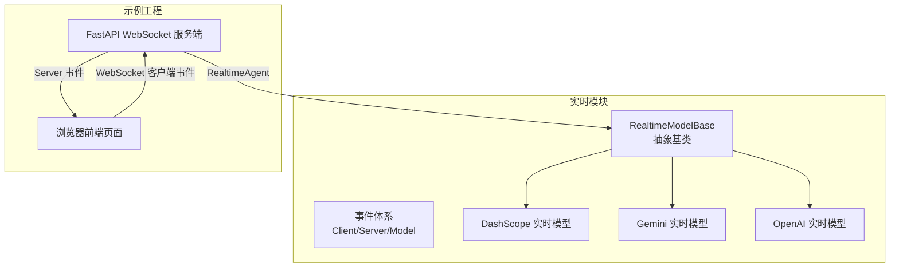
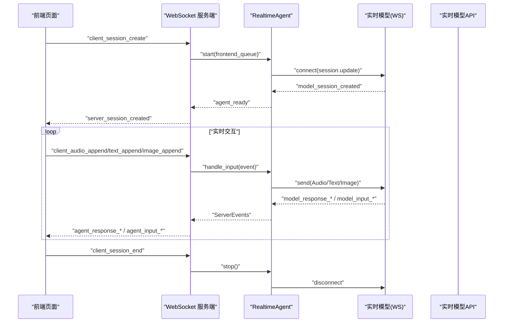
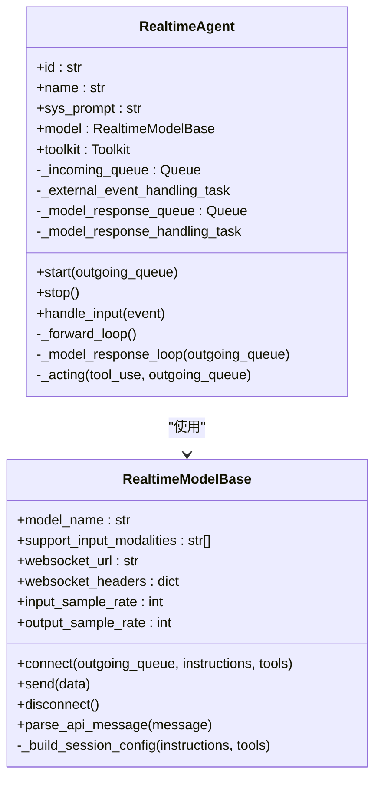
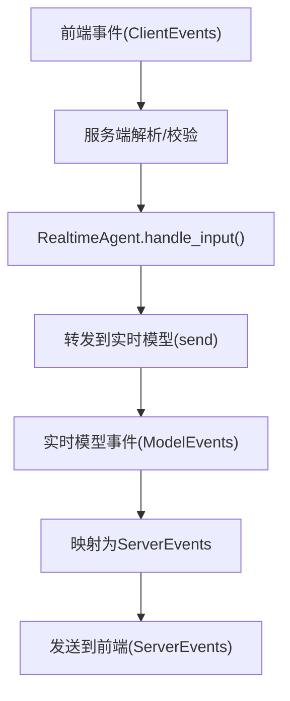
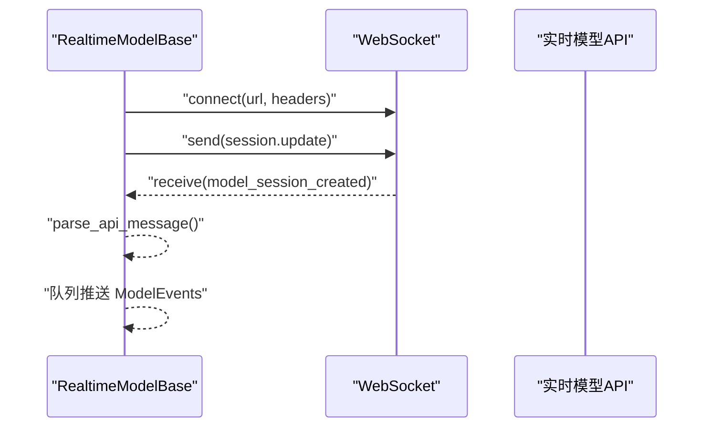
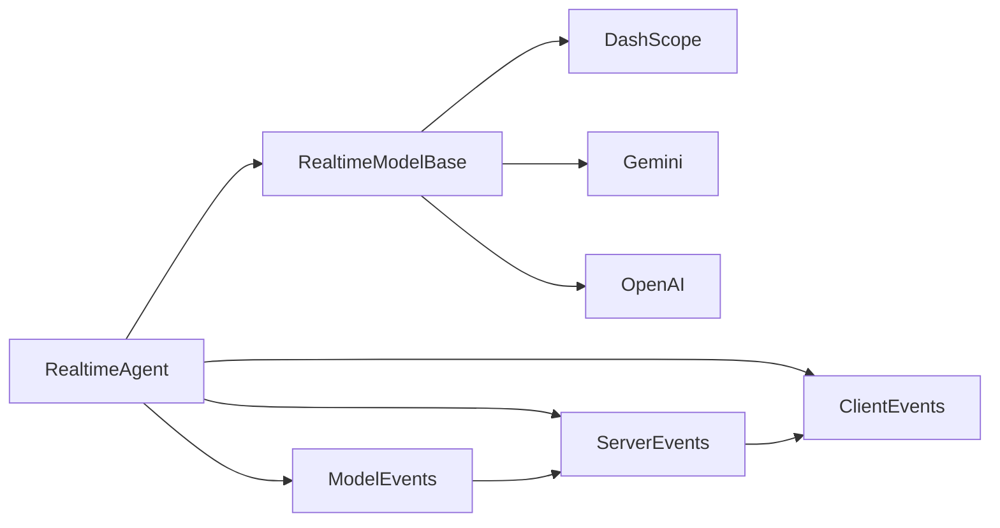

# 实时语音智能体

<cite>
**本文引用的文件**
- [src/agentscope/agent/_realtime_agent.py](file://src/agentscope/agent/_realtime_agent.py)
- [src/agentscope/realtime/__init__.py](file://src/agentscope/realtime/__init__.py)
- [src/agentscope/realtime/_base.py](file://src/agentscope/realtime/_base.py)
- [src/agentscope/realtime/_events/__init__.py](file://src/agentscope/realtime/_events/__init__.py)
- [src/agentscope/realtime/_events/_client_event.py](file://src/agentscope/realtime/_events/_client_event.py)
- [src/agentscope/realtime/_events/_server_event.py](file://src/agentscope/realtime/_events/_server_event.py)
- [src/agentscope/realtime/_events/_model_event.py](file://src/agentscope/realtime/_events/_model_event.py)
- [src/agentscope/realtime/_events/_utils.py](file://src/agentscope/realtime/_events/_utils.py)
- [src/agentscope/realtime/_dashscope_realtime_model.py](file://src/agentscope/realtime/_dashscope_realtime_model.py)
- [src/agentscope/realtime/_openai_realtime_model.py](file://src/agentscope/realtime/_openai_realtime_model.py)
- [src/agentscope/realtime/_gemini_realtime_model.py](file://src/agentscope/realtime/_gemini_realtime_model.py)
- [examples/agent/realtime_voice_agent/run_server.py](file://examples/agent/realtime_voice_agent/run_server.py)
- [examples/agent/realtime_voice_agent/chatbot.html](file://examples/agent/realtime_voice_agent/chatbot.html)
- [examples/workflows/multiagent_realtime/run_server.py](file://examples/workflows/multiagent_realtime/run_server.py)
- [examples/workflows/multiagent_realtime/multi_agent.html](file://examples/workflows/multiagent_realtime/multi_agent.html)
</cite>

## 目录
1. [简介](#简介)
2. [项目结构](#项目结构)
3. [核心组件](#核心组件)
4. [架构总览](#架构总览)
5. [详细组件分析](#详细组件分析)
6. [依赖关系分析](#依赖关系分析)
7. [性能考虑](#性能考虑)
8. [故障排除指南](#故障排除指南)
9. [结论](#结论)
10. [附录](#附录)

## 简介
本技术文档围绕 AgentScope 的实时语音智能体（RealtimeAgent）展开，系统性阐述其实时语音交互的架构设计、音频处理机制、语音识别与语音合成的集成方式、实时事件处理与音频流管理、实时语音协议（WebSocket/SSE）实现、与多智能体系统的集成、配置项与部署指南、性能优化与故障排除，并给出典型应用场景示例。

## 项目结构
实时语音能力由“实时模块”与“实时语音示例服务端/前端”两部分组成：
- 实时模块：统一事件模型、实时模型抽象与各厂商实现（DashScope/Gemini/OpenAI）、客户端/服务端事件定义、音频格式工具。
- 示例工程：单智能体与多智能体的 WebSocket 服务端与前端页面，演示实时语音交互、音频流传输、转写与播放、工具调用等。

图示来源
- [src/agentscope/realtime/__init__.py:1-29](file://src/agentscope/realtime/__init__.py#L1-L29)
- [src/agentscope/realtime/_base.py:1-174](file://src/agentscope/realtime/_base.py#L1-L174)
- [examples/agent/realtime_voice_agent/run_server.py:1-188](file://examples/agent/realtime_voice_agent/run_server.py#L1-L188)
- [examples/agent/realtime_voice_agent/chatbot.html:1-800](file://examples/agent/realtime_voice_agent/chatbot.html#L1-L800)

章节来源
- [src/agentscope/realtime/__init__.py:1-29](file://src/agentscope/realtime/__init__.py#L1-L29)
- [examples/agent/realtime_voice_agent/run_server.py:1-188](file://examples/agent/realtime_voice_agent/run_server.py#L1-L188)

## 核心组件
- RealtimeAgent：面向实时语音交互的智能体，负责接收前端/其他代理输入、转发至实时模型、处理模型响应并分发给前端/其他代理；内置工具调用执行与结果回传。
- RealtimeModelBase：实时模型抽象，统一 WebSocket 连接、会话配置、消息解析与事件派发。
- 事件体系：ClientEvents（前端到后端）、ServerEvents（后端到前端）、ModelEvents（实时模型 API 事件），三者通过统一的事件类型与数据结构实现解耦。
- 实时模型实现：DashScopeRealtimeModel、GeminiRealtimeModel、OpenAIRealtimeModel，分别适配不同厂商的实时 API 协议、采样率、模态支持与工具调用格式。
- 示例服务端与前端：提供 WebSocket 通道、会话生命周期管理、音频/文本/图像输入、转写与音频播放、工具调用闭环。

章节来源
- [src/agentscope/agent/_realtime_agent.py:28-361](file://src/agentscope/agent/_realtime_agent.py#L28-L361)
- [src/agentscope/realtime/_base.py:13-174](file://src/agentscope/realtime/_base.py#L13-L174)
- [src/agentscope/realtime/_events/__init__.py:1-16](file://src/agentscope/realtime/_events/__init__.py#L1-L16)
- [src/agentscope/realtime/_dashscope_realtime_model.py:15-405](file://src/agentscope/realtime/_dashscope_realtime_model.py#L15-L405)
- [src/agentscope/realtime/_gemini_realtime_model.py:21-663](file://src/agentscope/realtime/_gemini_realtime_model.py#L21-L663)
- [src/agentscope/realtime/_openai_realtime_model.py:19-485](file://src/agentscope/realtime/_openai_realtime_model.py#L19-L485)

## 架构总览
实时语音智能体采用“前端-服务端-实时模型”的三层架构：
- 前端：采集音频/文本/图像，通过 WebSocket 发送 ClientEvents；接收 ServerEvents 并播放音频、显示转写。
- 服务端：FastAPI WebSocket 终结点，负责会话创建/结束、实例化 RealtimeAgent、转发事件、聚合/分发 ServerEvents。
- 实时模型：DashScope/Gemini/OpenAI 的实时 API，通过 WebSocket 与服务端通信，返回 ModelEvents，服务端转换为 ServerEvents。

图示来源
- [examples/agent/realtime_voice_agent/run_server.py:66-178](file://examples/agent/realtime_voice_agent/run_server.py#L66-L178)
- [src/agentscope/agent/_realtime_agent.py:102-133](file://src/agentscope/agent/_realtime_agent.py#L102-L133)
- [src/agentscope/realtime/_base.py:68-100](file://src/agentscope/realtime/_base.py#L68-L100)
- [src/agentscope/realtime/_events/_server_event.py:91-525](file://src/agentscope/realtime/_events/_server_event.py#L91-L525)

## 详细组件分析

### RealtimeAgent 类实现
- 继承关系：继承自 StateModule，具备状态模块能力；内部持有 RealtimeModelBase 实例、工具箱 Toolkit、输入/输出队列。
- 生命周期：start(outgoing_queue) 建立与实时模型的连接，启动“外部事件转发循环”和“模型响应处理循环”；stop() 取消任务并断开模型连接。
- 外部事件转发循环：根据事件类型将前端输入（音频/文本/图像）转换为模型可接受的数据块并发送；对音频输入进行采样率重采样（如需要）。
- 模型响应处理循环：将 ModelEvents 映射为 ServerEvents，处理会话开始/结束、工具调用完成等特殊事件；对工具调用完成事件异步执行工具并回传结果。
- 工具调用：当收到工具调用完成事件时，从 Toolkit 中查找并异步执行工具函数，累积流式结果，最终发送 ToolResult 回传模型，并向前端广播工具结果事件。

图示来源
- [src/agentscope/agent/_realtime_agent.py:28-361](file://src/agentscope/agent/_realtime_agent.py#L28-L361)
- [src/agentscope/realtime/_base.py:13-174](file://src/agentscope/realtime/_base.py#L13-L174)

章节来源
- [src/agentscope/agent/_realtime_agent.py:102-361](file://src/agentscope/agent/_realtime_agent.py#L102-L361)

### 实时事件处理机制
- 客户端事件（ClientEvents）：前端发送的会话控制、响应控制、文本/音频/图像输入、工具结果等事件，服务端解析为具体事件对象。
- 服务端事件（ServerEvents）：后端生成的会话生命周期、代理生命周期、响应内容（音频/转写/工具）、输入转写、错误等事件，统一序列化为 JSON 发送。
- 模型事件（ModelEvents）：实时模型 API 返回的会话、响应、音频/转写、工具调用、输入检测、错误等事件，服务端将其映射为 ServerEvents。

图示来源
- [src/agentscope/realtime/_events/_client_event.py:45-199](file://src/agentscope/realtime/_events/_client_event.py#L45-L199)
- [src/agentscope/realtime/_events/_server_event.py:91-525](file://src/agentscope/realtime/_events/_server_event.py#L91-L525)
- [src/agentscope/realtime/_events/_model_event.py:84-344](file://src/agentscope/realtime/_events/_model_event.py#L84-L344)

章节来源
- [src/agentscope/realtime/_events/_client_event.py:45-199](file://src/agentscope/realtime/_events/_client_event.py#L45-L199)
- [src/agentscope/realtime/_events/_server_event.py:91-525](file://src/agentscope/realtime/_events/_server_event.py#L91-L525)
- [src/agentscope/realtime/_events/_model_event.py:84-344](file://src/agentscope/realtime/_events/_model_event.py#L84-L344)

### 音频流管理与采样率处理
- 输入采样率：不同模型要求不同采样率（如 DashScope 16kHz、Gemini 16kHz、OpenAI 24kHz）。RealtimeAgent 在转发音频前根据模型要求进行重采样（必要时）。
- 输出采样率：模型输出音频的采样率由模型决定（如 DashScope 某些模型 24kHz），前端播放时需匹配相应采样率。
- 静默音频保活：在长时间无音频时，前端周期性发送静默音频片段，维持模型端的连续性与 VAD 检测。

章节来源
- [src/agentscope/realtime/_dashscope_realtime_model.py:72-82](file://src/agentscope/realtime/_dashscope_realtime_model.py#L72-L82)
- [src/agentscope/realtime/_gemini_realtime_model.py:79-82](file://src/agentscope/realtime/_gemini_realtime_model.py#L79-L82)
- [src/agentscope/realtime/_openai_realtime_model.py:66-69](file://src/agentscope/realtime/_openai_realtime_model.py#L66-L69)
- [examples/workflows/multiagent_realtime/multi_agent.html:633-704](file://examples/workflows/multiagent_realtime/multi_agent.html#L633-L704)

### 实时语音协议实现
- WebSocket 连接：RealtimeModelBase.connect() 建立与实时模型 API 的 WebSocket 连接，发送会话配置；disconnect() 关闭连接。
- 会话配置：各模型实现 _build_session_config() 构建会话参数（指令、模态、音频格式、转写、VAD、语音等）。
- 消息解析：parse_api_message() 将实时模型返回的原始消息解析为统一的 ModelEvents，再由服务端映射为 ServerEvents。

图示来源
- [src/agentscope/realtime/_base.py:68-100](file://src/agentscope/realtime/_base.py#L68-L100)
- [src/agentscope/realtime/_base.py:134-158](file://src/agentscope/realtime/_base.py#L134-L158)
- [src/agentscope/realtime/_dashscope_realtime_model.py:96-131](file://src/agentscope/realtime/_dashscope_realtime_model.py#L96-L131)
- [src/agentscope/realtime/_gemini_realtime_model.py:93-150](file://src/agentscope/realtime/_gemini_realtime_model.py#L93-L150)
- [src/agentscope/realtime/_openai_realtime_model.py:86-125](file://src/agentscope/realtime/_openai_realtime_model.py#L86-L125)

章节来源
- [src/agentscope/realtime/_base.py:68-174](file://src/agentscope/realtime/_base.py#L68-L174)
- [src/agentscope/realtime/_dashscope_realtime_model.py:96-131](file://src/agentscope/realtime/_dashscope_realtime_model.py#L96-L131)
- [src/agentscope/realtime/_gemini_realtime_model.py:93-150](file://src/agentscope/realtime/_gemini_realtime_model.py#L93-L150)
- [src/agentscope/realtime/_openai_realtime_model.py:86-125](file://src/agentscope/realtime/_openai_realtime_model.py#L86-L125)

### 语音识别与语音合成集成
- 语音识别（ASR）：通过实时模型的输入转写功能（如开启 input_audio_transcription）将用户输入音频转为文本，服务端通过 AgentInputTranscriptionDelta/Done 事件下发到前端。
- 语音合成（TTS）：实时模型输出音频（PCM），服务端通过 AgentResponseAudioDelta/Done 事件下发到前端；前端按采样率播放。
- 转写与音频同步：服务端同时下发音频增量与转写增量，前端可实现“边听边看”的体验。

章节来源
- [src/agentscope/realtime/_dashscope_realtime_model.py:114-126](file://src/agentscope/realtime/_dashscope_realtime_model.py#L114-L126)
- [src/agentscope/realtime/_openai_realtime_model.py:112-117](file://src/agentscope/realtime/_openai_realtime_model.py#L112-L117)
- [src/agentscope/realtime/_gemini_realtime_model.py:125-127](file://src/agentscope/realtime/_gemini_realtime_model.py#L125-L127)
- [src/agentscope/realtime/_events/_server_event.py:354-398](file://src/agentscope/realtime/_events/_server_event.py#L354-L398)

### 工具调用与多智能体集成
- 工具调用：OpenAI/Gemini 实时模型支持工具调用，服务端在收到工具调用完成事件后，异步执行工具并将结果回传模型，同时向前端广播工具结果事件。
- 多智能体：通过 ChatRoom 将多个 RealtimeAgent 组织为对话房间，共享会话与事件流，实现多智能体实时语音协作。

章节来源
- [src/agentscope/realtime/_openai_realtime_model.py:310-352](file://src/agentscope/realtime/_openai_realtime_model.py#L310-L352)
- [src/agentscope/realtime/_gemini_realtime_model.py:478-516](file://src/agentscope/realtime/_gemini_realtime_model.py#L478-L516)
- [examples/workflows/multiagent_realtime/run_server.py:163-205](file://examples/workflows/multiagent_realtime/run_server.py#L163-L205)

### 用户体验设计要点
- 说话检测（VAD）：实时模型提供输入开始/结束事件，前端据此控制录音按钮状态与 UI 提示。
- 回音消除与音频缓冲：前端维护全局音频队列与播放状态，避免交叉播放；在长时间无音频时发送静默片段维持流式体验。
- 流式输出：音频与转写均以增量事件下发，前端可实现“所听即所得”的低延迟体验。

章节来源
- [src/agentscope/realtime/_events/_server_event.py:400-438](file://src/agentscope/realtime/_events/_server_event.py#L400-L438)
- [examples/workflows/multiagent_realtime/multi_agent.html:633-704](file://examples/workflows/multiagent_realtime/multi_agent.html#L633-L704)

## 依赖关系分析
- RealtimeAgent 依赖 RealtimeModelBase 与事件体系；不同实时模型实现继承自 RealtimeModelBase。
- 事件体系内部通过统一的事件类型与 Pydantic 模型实现跨层传递。
- 示例服务端依赖 FastAPI 与 WebSocket，负责会话生命周期与事件编排。

图示来源
- [src/agentscope/agent/_realtime_agent.py:28-361](file://src/agentscope/agent/_realtime_agent.py#L28-L361)
- [src/agentscope/realtime/_base.py:13-174](file://src/agentscope/realtime/_base.py#L13-L174)
- [src/agentscope/realtime/_events/__init__.py:1-16](file://src/agentscope/realtime/_events/__init__.py#L1-L16)

章节来源
- [src/agentscope/realtime/_events/__init__.py:1-16](file://src/agentscope/realtime/_events/__init__.py#L1-L16)
- [src/agentscope/realtime/_events/_client_event.py:45-199](file://src/agentscope/realtime/_events/_client_event.py#L45-L199)
- [src/agentscope/realtime/_events/_server_event.py:91-525](file://src/agentscope/realtime/_events/_server_event.py#L91-L525)
- [src/agentscope/realtime/_events/_model_event.py:84-344](file://src/agentscope/realtime/_events/_model_event.py#L84-L344)

## 性能考虑
- 采样率与编码：确保前端采集与后端模型采样率一致；音频以 PCM 编码传输，减少解码开销。
- 队列与并发：使用 asyncio.Queue 与异步任务处理事件转发与响应处理，避免阻塞；工具调用采用异步执行与结果回传。
- 事件粒度：尽量以增量事件下发（音频/转写），降低前端渲染压力。
- 网络参数：WebSocket 连接复用、合理的心跳与保活策略；在长时间静默时发送短时静默音频，维持模型端连续性。
- 资源释放：会话结束时及时停止任务与关闭连接，避免资源泄漏。

## 故障排除指南
- WebSocket 连接失败：检查实时模型 API Key、URL 与 Headers 是否正确；确认网络可达性。
- 事件类型未知：检查前端/后端事件映射是否完整；查看日志中“Unknown event type”提示。
- 工具调用异常：确认工具注册与 JSON Schema 正确；检查工具执行返回的流式结果是否完整。
- 音频无声或卡顿：核对采样率与编码格式；检查静默音频保活逻辑是否生效；确认前端播放上下文与缓冲队列正常。

章节来源
- [src/agentscope/realtime/_base.py:124-133](file://src/agentscope/realtime/_base.py#L124-L133)
- [src/agentscope/realtime/_events/_server_event.py:463-524](file://src/agentscope/realtime/_events/_server_event.py#L463-L524)
- [examples/agent/realtime_voice_agent/run_server.py:174-177](file://examples/agent/realtime_voice_agent/run_server.py#L174-L177)

## 结论
RealtimeAgent 通过统一的事件模型与实时模型抽象，实现了跨厂商的实时语音交互能力；结合 WebSocket 协议与增量事件流，提供了低延迟、高可用的语音对话体验。配合工具调用与多智能体集成，可扩展到复杂场景，如多轮辩论、协作问答等。

## 附录

### 配置选项说明
- 采样率
  - DashScope：输入 16kHz，输出取决于模型（如 24kHz）。
  - Gemini：输入 16kHz，输出 24kHz。
  - OpenAI：输入/输出均为 24kHz。
- 编码格式：音频以 PCM 编码传输，前端与模型采样率需匹配。
- 网络参数：WebSocket URL 与 Headers 由各模型实现配置；会话配置包含模态、转写、VAD、语音等参数。
- 工具调用：仅 OpenAI/Gemini 支持，需提供工具 JSON Schema；DashScope 当前不支持工具。

章节来源
- [src/agentscope/realtime/_dashscope_realtime_model.py:72-82](file://src/agentscope/realtime/_dashscope_realtime_model.py#L72-L82)
- [src/agentscope/realtime/_gemini_realtime_model.py:79-82](file://src/agentscope/realtime/_gemini_realtime_model.py#L79-L82)
- [src/agentscope/realtime/_openai_realtime_model.py:66-69](file://src/agentscope/realtime/_openai_realtime_model.py#L66-L69)
- [src/agentscope/realtime/_dashscope_realtime_model.py:114-126](file://src/agentscope/realtime/_dashscope_realtime_model.py#L114-L126)
- [src/agentscope/realtime/_openai_realtime_model.py:112-117](file://src/agentscope/realtime/_openai_realtime_model.py#L112-L117)
- [src/agentscope/realtime/_gemini_realtime_model.py:125-127](file://src/agentscope/realtime/_gemini_realtime_model.py#L125-L127)

### 部署指南
- 环境准备：安装 Python 与依赖库，准备实时模型 API Key。
- 单智能体部署：运行示例服务端脚本，访问前端页面进行语音交互。
- 多智能体部署：运行多智能体示例服务端，创建对话房间，实现多智能体实时语音协作。
- 前端页面：支持模型选择、会话配置、录音控制、转写显示与音频播放。

章节来源
- [examples/agent/realtime_voice_agent/run_server.py:180-188](file://examples/agent/realtime_voice_agent/run_server.py#L180-L188)
- [examples/workflows/multiagent_realtime/run_server.py:213-221](file://examples/workflows/multiagent_realtime/run_server.py#L213-L221)
- [examples/agent/realtime_voice_agent/chatbot.html:1-800](file://examples/agent/realtime_voice_agent/chatbot.html#L1-L800)
- [examples/workflows/multiagent_realtime/multi_agent.html:1-800](file://examples/workflows/multiagent_realtime/multi_agent.html#L1-L800)

### 应用示例
- 单智能体实时语音助手：前端发起会话，后端 RealtimeAgent 与实时模型交互，返回音频与转写。
- 多智能体实时辩论：两个 RealtimeAgent 在同一会话中进行语音辩论，前端显示双方音频与转写。
- 工具增强：OpenAI/Gemini 实时模型支持工具调用，后端执行工具并将结果回传模型，实现“语音+工具”的复合智能体。

章节来源
- [examples/agent/realtime_voice_agent/run_server.py:66-178](file://examples/agent/realtime_voice_agent/run_server.py#L66-L178)
- [examples/workflows/multiagent_realtime/run_server.py:62-210](file://examples/workflows/multiagent_realtime/run_server.py#L62-L210)
- [src/agentscope/realtime/_openai_realtime_model.py:310-352](file://src/agentscope/realtime/_openai_realtime_model.py#L310-L352)
- [src/agentscope/realtime/_gemini_realtime_model.py:478-516](file://src/agentscope/realtime/_gemini_realtime_model.py#L478-L516)