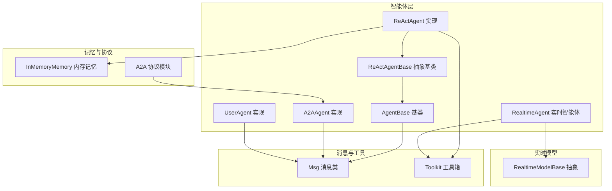
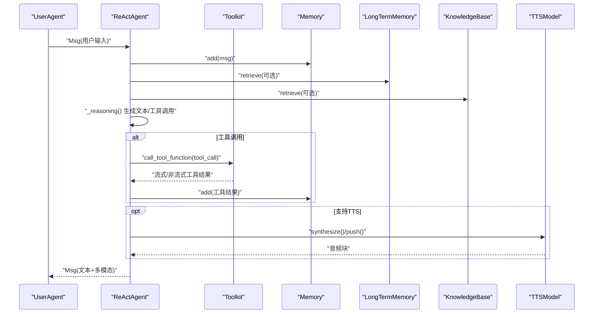
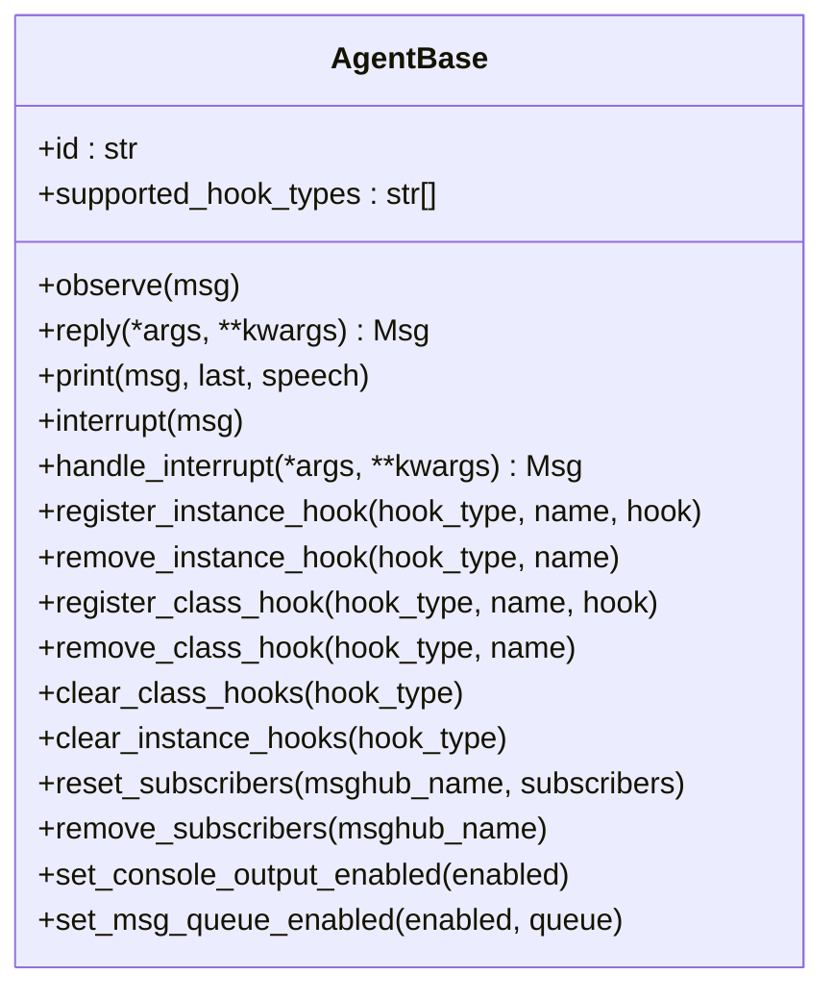
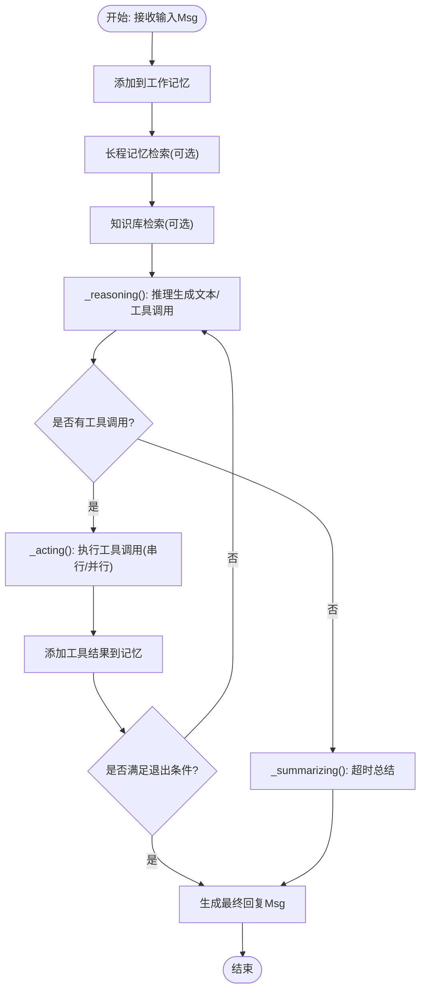
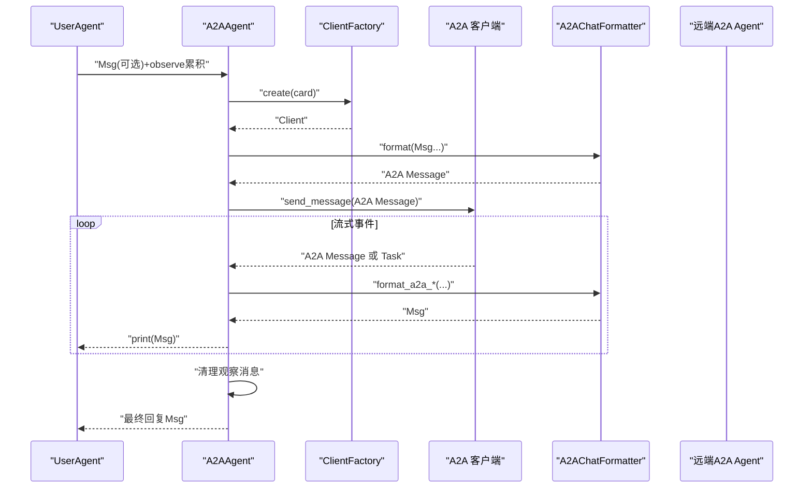
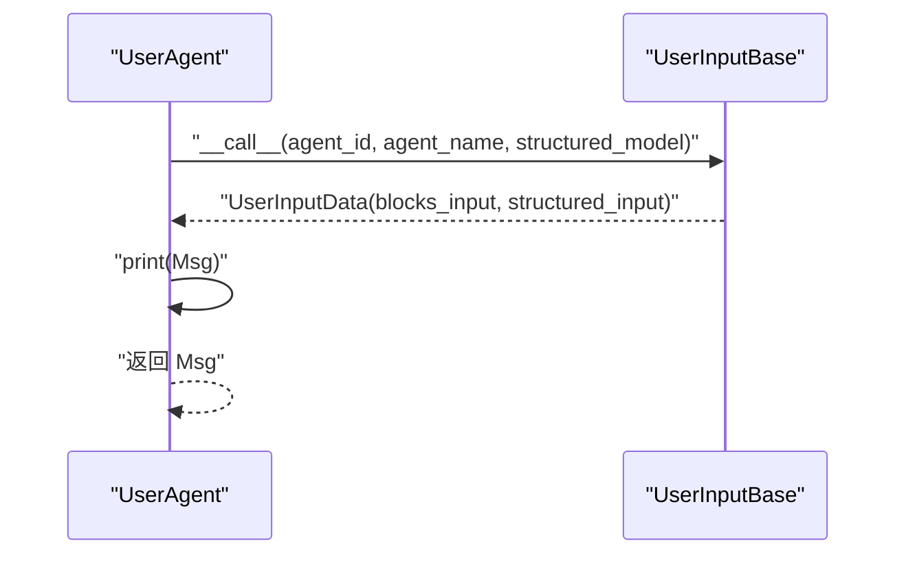
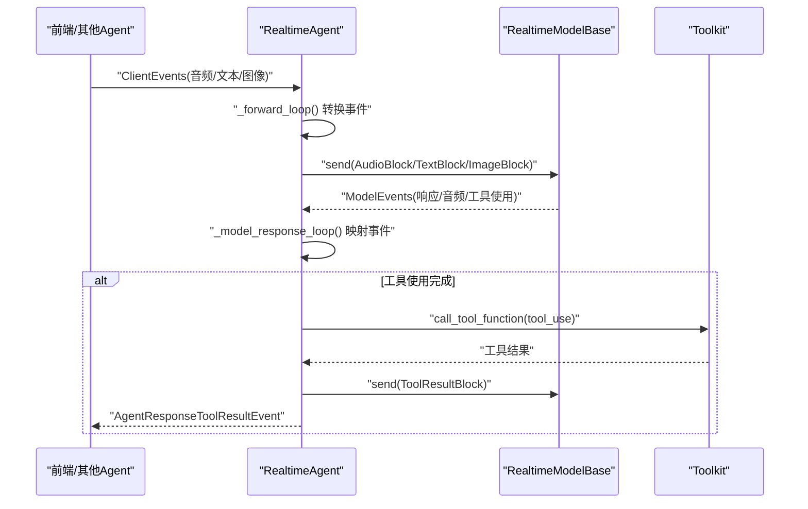
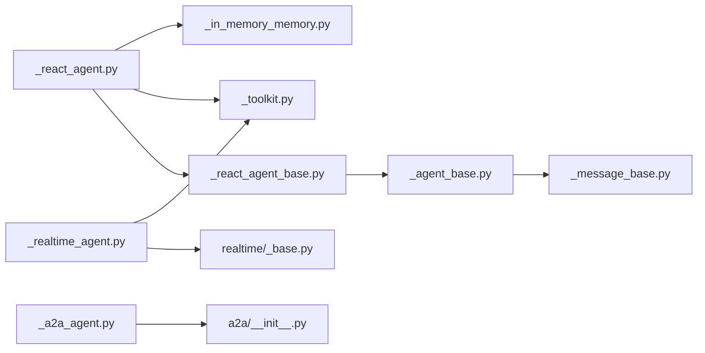

# 智能体系统

<cite>
**本文引用的文件**
- [src/agentscope/agent/_agent_base.py](file://src/agentscope/agent/_agent_base.py)
- [src/agentscope/agent/_react_agent_base.py](file://src/agentscope/agent/_react_agent_base.py)
- [src/agentscope/agent/_react_agent.py](file://src/agentscope/agent/_react_agent.py)
- [src/agentscope/agent/_a2a_agent.py](file://src/agentscope/agent/_a2a_agent.py)
- [src/agentscope/agent/_user_agent.py](file://src/agentscope/agent/_user_agent.py)
- [src/agentscope/agent/_realtime_agent.py](file://src/agentscope/agent/_realtime_agent.py)
- [src/agentscope/message/_message_base.py](file://src/agentscope/message/_message_base.py)
- [src/agentscope/tool/_toolkit.py](file://src/agentscope/tool/_toolkit.py)
- [src/agentscope/memory/_working_memory/_in_memory_memory.py](file://src/agentscope/memory/_working_memory/_in_memory_memory.py)
- [src/agentscope/a2a/__init__.py](file://src/agentscope/a2a/__init__.py)
- [src/agentscope/realtime/_base.py](file://src/agentscope/realtime/_base.py)
- [examples/agent/react_agent/main.py](file://examples/agent/react_agent/main.py)
- [examples/agent/a2a_agent/main.py](file://examples/agent/a2a_agent/main.py)
- [examples/agent/realtime_voice_agent/run_server.py](file://examples/agent/realtime_voice_agent/run_server.py)
</cite>

## 目录
1. [简介](#简介)
2. [项目结构](#项目结构)
3. [核心组件](#核心组件)
4. [架构总览](#架构总览)
5. [详细组件分析](#详细组件分析)
6. [依赖分析](#依赖分析)
7. [性能考虑](#性能考虑)
8. [故障排查指南](#故障排查指南)
9. [结论](#结论)
10. [附录](#附录)

## 简介
本技术文档面向AgentScope智能体系统，围绕以下目标展开：  
- 深入解析AgentBase基类的设计架构，涵盖智能体生命周期管理、状态维护、消息处理机制与钩子扩展点。  
- 详解ReAct智能体的实现原理，包括推理-行动循环、思维链构建、工具调用决策机制与结构化输出流程。  
- 阐述A2A智能体的Agent-to-Agent通信协议，包括协议规范、消息格式、连接管理与任务生命周期。  
- 介绍用户智能体的集成方式，包括人类输入处理与交互模式设计。  
- 解释实时语音智能体的特殊实现，包括音频处理、语音识别与语音合成的集成。  
- 提供每种智能体类型的配置选项、使用场景与最佳实践，并给出API参考与示例路径。

## 项目结构
AgentScope采用模块化分层组织，核心目录如下：  
- agent：智能体基类与具体智能体实现（ReAct、A2A、用户、实时）。  
- message：消息与内容块抽象（文本、工具调用、工具结果、图像、音频、视频等）。  
- tool：工具注册、分组、中间件与执行框架。  
- memory：工作记忆（内存/持久化）实现。  
- realtime：实时模型抽象与多厂商适配（DashScope/Gemini/OpenAI）。  
- a2a：A2A协议解析器与客户端工厂。  
- examples：典型使用示例（ReAct、A2A、实时语音）。

**图表来源**
- [src/agentscope/agent/_agent_base.py:30-775](file://src/agentscope/agent/_agent_base.py#L30-L775)
- [src/agentscope/agent/_react_agent_base.py:12-117](file://src/agentscope/agent/_react_agent_base.py#L12-L117)
- [src/agentscope/agent/_react_agent.py:98-800](file://src/agentscope/agent/_react_agent.py#L98-L800)
- [src/agentscope/agent/_a2a_agent.py:29-289](file://src/agentscope/agent/_a2a_agent.py#L29-L289)
- [src/agentscope/agent/_user_agent.py:12-129](file://src/agentscope/agent/_user_agent.py#L12-L129)
- [src/agentscope/agent/_realtime_agent.py:28-361](file://src/agentscope/agent/_realtime_agent.py#L28-L361)
- [src/agentscope/message/_message_base.py:21-242](file://src/agentscope/message/_message_base.py#L21-L242)
- [src/agentscope/tool/_toolkit.py:117-200](file://src/agentscope/tool/_toolkit.py#L117-L200)
- [src/agentscope/memory/_working_memory/_in_memory_memory.py:10-200](file://src/agentscope/memory/_working_memory/_in_memory_memory.py#L10-L200)
- [src/agentscope/a2a/__init__.py:1-15](file://src/agentscope/a2a/__init__.py#L1-L15)
- [src/agentscope/realtime/_base.py:13-174](file://src/agentscope/realtime/_base.py#L13-L174)

**章节来源**
- [src/agentscope/agent/_agent_base.py:30-775](file://src/agentscope/agent/_agent_base.py#L30-L775)
- [src/agentscope/message/_message_base.py:21-242](file://src/agentscope/message/_message_base.py#L21-L242)
- [src/agentscope/tool/_toolkit.py:117-200](file://src/agentscope/tool/_toolkit.py#L117-L200)
- [src/agentscope/memory/_working_memory/_in_memory_memory.py:10-200](file://src/agentscope/memory/_working_memory/_in_memory_memory.py#L10-L200)
- [src/agentscope/a2a/__init__.py:1-15](file://src/agentscope/a2a/__init__.py#L1-L15)
- [src/agentscope/realtime/_base.py:13-174](file://src/agentscope/realtime/_base.py#L13-L174)

## 核心组件
- AgentBase：异步智能体基类，统一生命周期、消息打印、钩子扩展、订阅广播与中断处理。  
- ReActAgentBase：在AgentBase之上定义“推理-行动”抽象接口，提供推理/行动前后钩子。  
- ReActAgent：实现ReAct算法，支持工具并行调用、结构化输出、压缩记忆、计划提示与TTS集成。  
- A2AAgent：基于A2A协议与远程Agent通信，负责双向消息转换、任务生命周期与状态跟踪。  
- UserAgent：人类输入代理，支持多种输入源（终端/网页），可选结构化输出提示。  
- RealtimeAgent：实时语音/多模态交互代理，管理WebSocket连接、事件转发与工具调用执行。  
- Msg：统一消息载体，支持文本、工具调用/结果、图像/音频/视频等多模态内容块。  
- Toolkit：工具注册、分组、中间件链、MCP客户端桥接与统一流式执行接口。  
- InMemoryMemory：基于列表的内存记忆存储，支持标记过滤与摘要前置。  
- RealtimeModelBase：实时模型抽象，定义连接、会话配置、事件解析与断开流程。  
- A2A模块：AgentCard解析器与客户端工厂，支撑A2A协议的发现与连接。

**章节来源**
- [src/agentscope/agent/_agent_base.py:30-775](file://src/agentscope/agent/_agent_base.py#L30-L775)
- [src/agentscope/agent/_react_agent_base.py:12-117](file://src/agentscope/agent/_react_agent_base.py#L12-L117)
- [src/agentscope/agent/_react_agent.py:98-800](file://src/agentscope/agent/_react_agent.py#L98-L800)
- [src/agentscope/agent/_a2a_agent.py:29-289](file://src/agentscope/agent/_a2a_agent.py#L29-L289)
- [src/agentscope/agent/_user_agent.py:12-129](file://src/agentscope/agent/_user_agent.py#L12-L129)
- [src/agentscope/agent/_realtime_agent.py:28-361](file://src/agentscope/agent/_realtime_agent.py#L28-L361)
- [src/agentscope/message/_message_base.py:21-242](file://src/agentscope/message/_message_base.py#L21-L242)
- [src/agentscope/tool/_toolkit.py:117-200](file://src/agentscope/tool/_toolkit.py#L117-L200)
- [src/agentscope/memory/_working_memory/_in_memory_memory.py:10-200](file://src/agentscope/memory/_working_memory/_in_memory_memory.py#L10-L200)
- [src/agentscope/realtime/_base.py:13-174](file://src/agentscope/realtime/_base.py#L13-L174)
- [src/agentscope/a2a/__init__.py:1-15](file://src/agentscope/a2a/__init__.py#L1-L15)

## 架构总览
AgentScope通过“消息驱动 + 组件解耦”的架构实现多智能体协作与外部系统集成。  
- 消息抽象：Msg统一承载文本、工具调用/结果、多模态内容块，便于跨组件传递。  
- 工具体系：Toolkit集中管理工具注册、分组、中间件与执行，支持同步/异步/生成器式工具。  
- 记忆体系：InMemoryMemory提供短期记忆，支持标记过滤与摘要前置；可扩展至长程记忆。  
- 协议与实时：A2A模块实现远端Agent通信；RealtimeModelBase抽象实时模型，统一事件解析与会话配置。  
- 智能体实现：AgentBase提供统一生命周期与钩子；ReActAgent实现推理-行动循环；UserAgent与RealtimeAgent分别面向人类交互与实时语音。

**图表来源**
- [src/agentscope/agent/_react_agent.py:376-537](file://src/agentscope/agent/_react_agent.py#L376-L537)
- [src/agentscope/tool/_toolkit.py:117-200](file://src/agentscope/tool/_toolkit.py#L117-L200)
- [src/agentscope/memory/_working_memory/_in_memory_memory.py:93-136](file://src/agentscope/memory/_working_memory/_in_memory_memory.py#L93-L136)

**章节来源**
- [src/agentscope/agent/_react_agent.py:376-537](file://src/agentscope/agent/_react_agent.py#L376-L537)
- [src/agentscope/tool/_toolkit.py:117-200](file://src/agentscope/tool/_toolkit.py#L117-L200)
- [src/agentscope/memory/_working_memory/_in_memory_memory.py:93-136](file://src/agentscope/memory/_working_memory/_in_memory_memory.py#L93-L136)

## 详细组件分析

### AgentBase 基类
- 生命周期与控制流：支持异步回复、中断取消、任务标识、订阅广播与思考块剥离。  
- 消息处理：统一打印逻辑，支持文本/思考/多模态块，音频播放与流式输出缓存。  
- 钩子系统：类级与实例级钩子，覆盖reply/print/observe前后，支持动态注册/移除/清空。  
- 状态与序列化：继承StateModule，支持状态字典读写与消息队列开关。  
- 订阅与广播：观察者模式，向订阅者广播消息（剥离思考块以保护内部推理）。  

**图表来源**
- [src/agentscope/agent/_agent_base.py:30-775](file://src/agentscope/agent/_agent_base.py#L30-L775)

**章节来源**
- [src/agentscope/agent/_agent_base.py:185-775](file://src/agentscope/agent/_agent_base.py#L185-L775)

### ReActAgentBase 与 ReActAgent
- ReActAgentBase：在AgentBase基础上定义“推理/行动”抽象方法，并提供推理/行动前后钩子。  
- ReActAgent：  
  - 推理阶段：格式化系统提示+记忆+计划提示+检索结果，调用模型生成文本/工具调用。  
  - 行动阶段：串行/并行执行工具调用，流式打印工具结果，支持结构化输出与“完成函数”。  
  - 记忆与压缩：支持自动压缩旧记忆，保留近期上下文；可选静态/代理控制的长程记忆。  
  - 计划与提示：可接入PlanNotebook提供推理提示；可选打印提示消息。  
  - TTS集成：支持流式/非流式TTS，将文本转音频并随消息打印。  

**图表来源**
- [src/agentscope/agent/_react_agent.py:376-537](file://src/agentscope/agent/_react_agent.py#L376-L537)
- [src/agentscope/agent/_react_agent.py:540-655](file://src/agentscope/agent/_react_agent.py#L540-L655)
- [src/agentscope/agent/_react_agent.py:657-714](file://src/agentscope/agent/_react_agent.py#L657-L714)
- [src/agentscope/agent/_react_agent.py:725-796](file://src/agentscope/agent/_react_agent.py#L725-L796)

**章节来源**
- [src/agentscope/agent/_react_agent_base.py:12-117](file://src/agentscope/agent/_react_agent_base.py#L12-L117)
- [src/agentscope/agent/_react_agent.py:98-800](file://src/agentscope/agent/_react_agent.py#L98-L800)

### A2AAgent 与 A2A 协议
- 协议特性：仅支持聊天场景（一问一答），不支持结构化输出；本地存储观察消息并在回复时合并。  
- 连接与消息：通过ClientFactory创建A2A客户端，使用A2AChatFormatter进行双向消息转换；支持任务状态与制品事件。  
- 生命周期：支持任务轮询与流式事件，打印任务状态与制品；中断后记录上下文以便后续回复。  

**图表来源**
- [src/agentscope/agent/_a2a_agent.py:177-260](file://src/agentscope/agent/_a2a_agent.py#L177-L260)
- [src/agentscope/a2a/__init__.py:1-15](file://src/agentscope/a2a/__init__.py#L1-L15)

**章节来源**
- [src/agentscope/agent/_a2a_agent.py:29-289](file://src/agentscope/agent/_a2a_agent.py#L29-L289)
- [src/agentscope/a2a/__init__.py:1-15](file://src/agentscope/a2a/__init__.py#L1-L15)

### UserAgent 人类输入
- 输入方法：默认TerminalUserInput，支持覆盖为Web/CLI等其他输入源。  
- 结构化输出：可选提供Pydantic模型，引导用户按字段填写。  
- 输出：封装为Msg（role=user），支持多内容块与结构化元数据。  

**图表来源**
- [src/agentscope/agent/_user_agent.py:30-76](file://src/agentscope/agent/_user_agent.py#L30-L76)

**章节来源**
- [src/agentscope/agent/_user_agent.py:12-129](file://src/agentscope/agent/_user_agent.py#L12-L129)

### RealtimeAgent 与实时语音
- 连接管理：通过RealtimeModelBase建立WebSocket连接，发送会话配置，启动接收与转发循环。  
- 事件处理：将前端/其他Agent事件转换为模型可识别的音频/文本/图像输入；解析模型事件并映射为统一ServerEvents。  
- 工具调用：当模型产生工具使用完成事件时，异步执行工具并回传结果，同时向外部广播工具结果事件。  
- 音频处理：支持采样率重采样、Base64音频块拼接与流式播放。  

**图表来源**
- [src/agentscope/agent/_realtime_agent.py:134-361](file://src/agentscope/agent/_realtime_agent.py#L134-L361)
- [src/agentscope/realtime/_base.py:68-174](file://src/agentscope/realtime/_base.py#L68-L174)

**章节来源**
- [src/agentscope/agent/_realtime_agent.py:28-361](file://src/agentscope/agent/_realtime_agent.py#L28-L361)
- [src/agentscope/realtime/_base.py:13-174](file://src/agentscope/realtime/_base.py#L13-L174)

## 依赖分析
- 组件内聚与耦合：  
  - AgentBase高度内聚于消息与钩子；ReActAgent依赖Toolkit/Memory/Knowledge/LTM/TTS等模块。  
  - A2AAgent依赖a2a模块与Formatter；RealtimeAgent依赖RealtimeModelBase与Toolkit。  
- 外部依赖：  
  - A2A协议栈（a2a包）、HTTP/WebSocket客户端（httpx/websockets）、音频播放（sounddevice）、TTS模型（可插拔）。  
- 循环依赖：未见直接循环；各模块通过抽象接口耦合，降低耦合度。

**图表来源**
- [src/agentscope/agent/_agent_base.py:19-27](file://src/agentscope/agent/_agent_base.py#L19-L27)
- [src/agentscope/agent/_react_agent.py:12-30](file://src/agentscope/agent/_react_agent.py#L12-L30)
- [src/agentscope/agent/_a2a_agent.py:14-16](file://src/agentscope/agent/_a2a_agent.py#L14-L16)
- [src/agentscope/agent/_realtime_agent.py:18-25](file://src/agentscope/agent/_realtime_agent.py#L18-L25)
- [src/agentscope/a2a/__init__.py:1-15](file://src/agentscope/a2a/__init__.py#L1-L15)
- [src/agentscope/realtime/_base.py:9-11](file://src/agentscope/realtime/_base.py#L9-L11)

**章节来源**
- [src/agentscope/agent/_agent_base.py:19-27](file://src/agentscope/agent/_agent_base.py#L19-L27)
- [src/agentscope/agent/_react_agent.py:12-30](file://src/agentscope/agent/_react_agent.py#L12-L30)
- [src/agentscope/agent/_a2a_agent.py:14-16](file://src/agentscope/agent/_a2a_agent.py#L14-L16)
- [src/agentscope/agent/_realtime_agent.py:18-25](file://src/agentscope/agent/_realtime_agent.py#L18-L25)
- [src/agentscope/a2a/__init__.py:1-15](file://src/agentscope/a2a/__init__.py#L1-L15)
- [src/agentscope/realtime/_base.py:9-11](file://src/agentscope/realtime/_base.py#L9-L11)

## 性能考虑
- 并行工具调用：ReActAgent支持并行执行多个工具调用，显著缩短行动阶段耗时。  
- 流式输出：消息与TTS均支持流式输出，减少等待时间并提升交互体验。  
- 音频处理：实时Agent对音频进行采样率重采样与增量拼接，避免全量加载，降低延迟。  
- 记忆压缩：在高Token占用时自动压缩历史，平衡上下文窗口与性能。  
- 事件循环：使用asyncio队列与任务调度，避免阻塞主线程，保证高并发下的稳定性。

[本节为通用指导，无需特定文件引用]

## 故障排查指南
- 中断处理：AgentBase支持中断标志位与handle_interrupt回调，ReActAgent在中断时生成“工具被中断”的假结果并打印。  
- 控制台输出：可通过环境变量或API禁用控制台输出，避免生产环境日志混乱。  
- 消息队列：启用消息队列可将流式消息导出为生成器，便于上层消费；注意队列大小与背压。  
- A2A协议限制：不支持结构化输出；若需要结构化输出，请使用ReActAgent而非A2AAgent。  
- 实时模型：确保WebSocket连接成功、会话配置正确、事件解析无误；工具调用需在支持工具的模型上启用。

**章节来源**
- [src/agentscope/agent/_agent_base.py:528-527](file://src/agentscope/agent/_agent_base.py#L528-L527)
- [src/agentscope/agent/_react_agent.py:625-654](file://src/agentscope/agent/_react_agent.py#L625-L654)
- [src/agentscope/agent/_a2a_agent.py:206-211](file://src/agentscope/agent/_a2a_agent.py#L206-L211)

## 结论
AgentScope通过统一的消息抽象、灵活的工具体系与模块化的智能体实现，提供了从基础对话到复杂推理、从本地交互到实时语音的完整能力谱系。ReActAgent以“推理-行动”为核心，结合记忆、知识与工具，形成稳健的智能体闭环；A2AAgent与RealtimeAgent分别拓展了跨Agent通信与实时多模态交互能力；UserAgent则打通了人类输入与结构化输出。建议在生产环境中合理配置消息队列、禁用控制台输出、启用记忆压缩与并行工具调用，以获得更佳的性能与稳定性。

[本节为总结性内容，无需特定文件引用]

## 附录

### API参考与使用示例

- ReActAgent
  - 初始化参数要点：名称、系统提示、模型、格式化器、工具箱、记忆、长程记忆、计划笔记本、TTS模型、压缩配置等。  
  - 关键方法：reply(msg, structured_model)、observe(msg)、handle_interrupt(...)。  
  - 示例路径：[examples/agent/react_agent/main.py:18-50](file://examples/agent/react_agent/main.py#L18-L50)

- A2AAgent  
  - 初始化参数：AgentCard、ClientConfig、Consumers、TransportProducers。  
  - 关键方法：reply(msg)（不支持structured_model）、observe(msg)、handle_interrupt(...)。  
  - 示例路径：[examples/agent/a2a_agent/main.py:10-27](file://examples/agent/a2a_agent/main.py#L10-L27)

- UserAgent  
  - 初始化参数：名称。  
  - 关键方法：reply(msg, structured_model)、override_instance_input_method(...)、override_class_input_method(...)。  
  - 示例路径：[examples/agent/react_agent/main.py:40-47](file://examples/agent/react_agent/main.py#L40-L47)

- RealtimeAgent  
  - 初始化参数：名称、系统提示、实时模型、工具箱。  
  - 关键方法：start(outgoing_queue)、stop()、handle_input(event)、_acting(tool_use, outgoing_queue)。  
  - 示例路径：[examples/agent/realtime_voice_agent/run_server.py:146-172](file://examples/agent/realtime_voice_agent/run_server.py#L146-L172)

- 消息与内容块  
  - Msg：name、content（字符串或内容块列表）、role、metadata、timestamp、id、invocation_id。  
  - 内容块类型：文本、工具调用、工具结果、图像、音频、视频。  
  - 示例路径：[src/agentscope/message/_message_base.py:21-242](file://src/agentscope/message/_message_base.py#L21-L242)

- 工具箱（Toolkit）  
  - 注册工具、创建分组、设置扩展模型、应用中间件链、执行工具（支持流式/异步）。  
  - 示例路径：[src/agentscope/tool/_toolkit.py:117-200](file://src/agentscope/tool/_toolkit.py#L117-L200)

- 记忆（InMemoryMemory）  
  - 添加、查询、删除、按标记过滤、前置摘要。  
  - 示例路径：[src/agentscope/memory/_working_memory/_in_memory_memory.py:22-136](file://src/agentscope/memory/_working_memory/_in_memory_memory.py#L22-L136)

- 实时模型（RealtimeModelBase）  
  - 连接、断开、发送数据、解析模型事件、构建会话配置。  
  - 示例路径：[src/agentscope/realtime/_base.py:68-174](file://src/agentscope/realtime/_base.py#L68-L174)

- A2A模块  
  - 解析器与客户端工厂：AgentCardResolverBase、FileAgentCardResolver、WellKnownAgentCardResolver、NacosAgentCardResolver。  
  - 示例路径：[src/agentscope/a2a/__init__.py:1-15](file://src/agentscope/a2a/__init__.py#L1-L15)