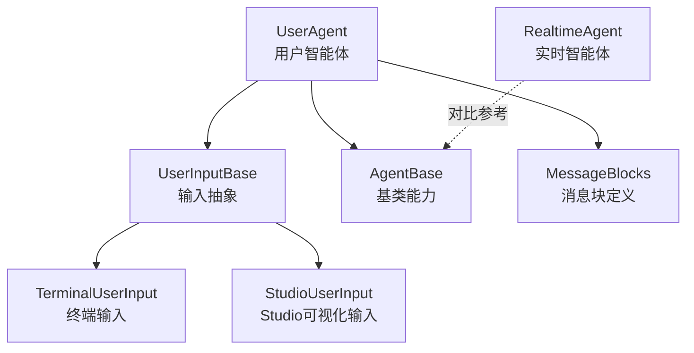
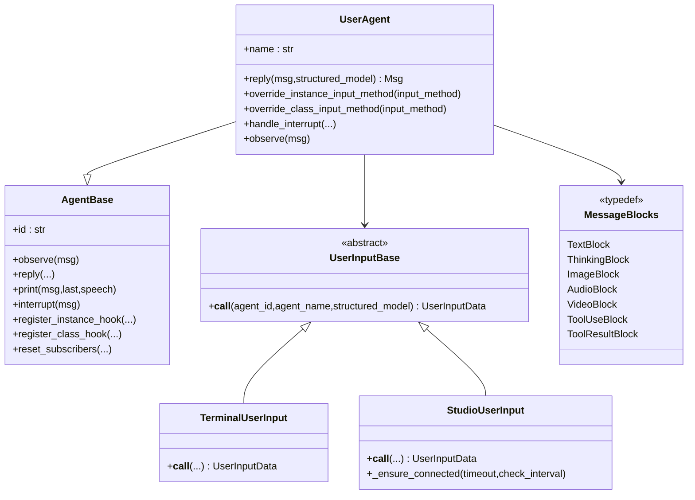
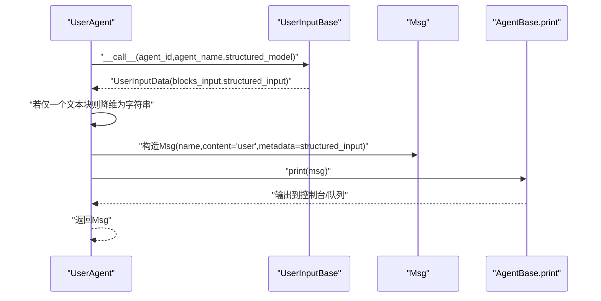
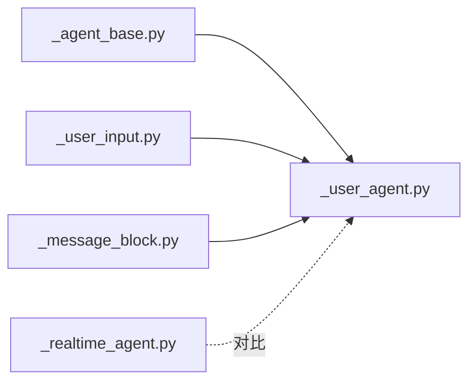

# 用户智能体

<cite>
**本文引用的文件列表**
- [src/agentscope/agent/_user_agent.py](file://src/agentscope/agent/_user_agent.py)
- [src/agentscope/agent/_user_input.py](file://src/agentscope/agent/_user_input.py)
- [src/agentscope/agent/_agent_base.py](file://src/agentscope/agent/_agent_base.py)
- [src/agentscope/agent/_realtime_agent.py](file://src/agentscope/agent/_realtime_agent.py)
- [src/agentscope/message/_message_block.py](file://src/agentscope/message/_message_block.py)
- [tests/user_input_test.py](file://tests/user_input_test.py)
- [examples/workflows/multiagent_conversation/main.py](file://examples/workflows/multiagent_conversation/main.py)
- [examples/workflows/multiagent_realtime/run_server.py](file://examples/workflows/multiagent_realtime/run_server.py)
</cite>

## 目录
1. [简介](#简介)
2. [项目结构](#项目结构)
3. [核心组件](#核心组件)
4. [架构总览](#架构总览)
5. [详细组件分析](#详细组件分析)
6. [依赖关系分析](#依赖关系分析)
7. [性能考量](#性能考量)
8. [故障排查指南](#故障排查指南)
9. [结论](#结论)
10. [附录：使用示例与配置](#附录使用示例与配置)

## 简介
本文件面向AgentScope的用户智能体（UserAgent），系统性阐述其设计目标、实现原理与工程实践。重点包括：
- 人类输入的处理机制：终端输入、Studio可视化输入、多模态输入（文本/图像/音频/视频）。
- 交互模式设计理念：对话轮次管理、上下文保持、状态同步。
- 与AI智能体的无缝集成：消息转换、订阅广播、钩子扩展。
- 与RealtimeAgent的区别与联系：实时语音/多模态 vs 交互式人类输入。
- 配置选项与错误处理策略：输入校验、重试、中断处理。
- 完整使用示例：在多智能体对话、实时语音等场景中的集成方法。

## 项目结构
围绕用户智能体的关键代码位于以下模块：
- 用户智能体主体：src/agentscope/agent/_user_agent.py
- 输入抽象与具体实现：src/agentscope/agent/_user_input.py
- 基类能力：src/agentscope/agent/_agent_base.py
- 多模态消息块定义：src/agentscope/message/_message_block.py
- 实时智能体对比参考：src/agentscope/agent/_realtime_agent.py
- 测试与示例：tests/user_input_test.py、examples/workflows/multiagent_conversation/main.py、examples/workflows/multiagent_realtime/run_server.py

图表来源
- [src/agentscope/agent/_user_agent.py:12-129](file://src/agentscope/agent/_user_agent.py#L12-L129)
- [src/agentscope/agent/_user_input.py:39-416](file://src/agentscope/agent/_user_input.py#L39-L416)
- [src/agentscope/agent/_agent_base.py:30-775](file://src/agentscope/agent/_agent_base.py#L30-L775)
- [src/agentscope/message/_message_block.py:9-129](file://src/agentscope/message/_message_block.py#L9-L129)
- [src/agentscope/agent/_realtime_agent.py:28-361](file://src/agentscope/agent/_realtime_agent.py#L28-L361)

章节来源
- [src/agentscope/agent/_user_agent.py:12-129](file://src/agentscope/agent/_user_agent.py#L12-L129)
- [src/agentscope/agent/_user_input.py:39-416](file://src/agentscope/agent/_user_input.py#L39-L416)
- [src/agentscope/agent/_agent_base.py:30-775](file://src/agentscope/agent/_agent_base.py#L30-L775)
- [src/agentscope/message/_message_block.py:9-129](file://src/agentscope/message/_message_block.py#L9-L129)
- [src/agentscope/agent/_realtime_agent.py:28-361](file://src/agentscope/agent/_realtime_agent.py#L28-L361)

## 核心组件
- UserAgent：代表“人类用户”的特殊智能体，负责从不同来源收集人类输入并生成标准消息对象，供其他AI智能体消费。
- UserInputBase及其子类：抽象人类输入接口，提供统一的异步调用协议；当前实现包括终端输入与Studio可视化输入。
- AgentBase：所有智能体的基类，提供观察/回复生命周期、打印输出、钩子系统、订阅广播、中断处理等通用能力。
- 消息块（MessageBlocks）：统一的多模态内容块定义，支持文本、思考、工具调用、工具结果、图像、音频、视频等。
- RealtimeAgent：实时交互智能体，侧重语音/音频实时流处理，与UserAgent在职责上互补。

章节来源
- [src/agentscope/agent/_user_agent.py:12-129](file://src/agentscope/agent/_user_agent.py#L12-L129)
- [src/agentscope/agent/_user_input.py:39-416](file://src/agentscope/agent/_user_input.py#L39-L416)
- [src/agentscope/agent/_agent_base.py:30-775](file://src/agentscope/agent/_agent_base.py#L30-L775)
- [src/agentscope/message/_message_block.py:9-129](file://src/agentscope/message/_message_block.py#L9-L129)
- [src/agentscope/agent/_realtime_agent.py:28-361](file://src/agentscope/agent/_realtime_agent.py#L28-L361)

## 架构总览
UserAgent通过可插拔的UserInputBase实现，将来自终端或Studio的人类输入标准化为Msg对象，并利用AgentBase的打印与订阅机制与其他智能体共享。

图表来源
- [src/agentscope/agent/_agent_base.py:30-775](file://src/agentscope/agent/_agent_base.py#L30-L775)
- [src/agentscope/agent/_user_agent.py:12-129](file://src/agentscope/agent/_user_agent.py#L12-L129)
- [src/agentscope/agent/_user_input.py:39-416](file://src/agentscope/agent/_user_input.py#L39-L416)
- [src/agentscope/message/_message_block.py:9-129](file://src/agentscope/message/_message_block.py#L9-L129)

## 详细组件分析

### UserAgent 类与继承关系
- 继承自AgentBase，复用其生命周期、钩子、订阅广播、中断处理等能力。
- 提供异步reply入口，接收可选的历史消息与结构化模型，返回标准Msg对象。
- 内部持有默认的TerminalUserInput实例，可通过实例级或类级方法替换为其他输入源（如StudioUserInput）。

章节来源
- [src/agentscope/agent/_user_agent.py:12-129](file://src/agentscope/agent/_user_agent.py#L12-L129)
- [src/agentscope/agent/_agent_base.py:30-775](file://src/agentscope/agent/_agent_base.py#L30-L775)

### 输入处理流程与消息转换
- 调用当前输入方法，获取UserInputData（包含多模态块列表与结构化输入）。
- 若仅有一个文本块，则简化为字符串形式，便于后续消息构造。
- 构造Msg对象，角色设为"user"，元数据承载结构化输入，随后通过AgentBase.print进行输出。
- 返回Msg供其他智能体observe消费。

图表来源
- [src/agentscope/agent/_user_agent.py:30-76](file://src/agentscope/agent/_user_agent.py#L30-L76)
- [src/agentscope/agent/_agent_base.py:205-275](file://src/agentscope/agent/_agent_base.py#L205-L275)

章节来源
- [src/agentscope/agent/_user_agent.py:30-76](file://src/agentscope/agent/_user_agent.py#L30-L76)
- [src/agentscope/agent/_agent_base.py:205-275](file://src/agentscope/agent/_agent_base.py#L205-L275)

### 多模态输入支持
- 支持文本、图像、音频、视频等消息块，统一由UserInputData携带。
- 当输入方法返回多个块时，UserAgent将其保留为块列表；当仅含单一文本块时自动降维为字符串，提升易用性。
- 消息块类型定义见消息块模块，涵盖基础字段与媒体类型。

章节来源
- [src/agentscope/agent/_user_agent.py:58-72](file://src/agentscope/agent/_user_agent.py#L58-L72)
- [src/agentscope/message/_message_block.py:9-129](file://src/agentscope/message/_message_block.py#L9-L129)

### 交互模式与上下文保持
- UserAgent遵循AgentBase的订阅广播机制：在回复完成后，剥离内部思考块后向订阅者广播消息，确保上下文一致性与可见性。
- 可通过reset_subscribers设置订阅者集合，实现灵活的广播范围。
- 支持钩子系统：pre_reply/post_reply/pre_print/post_print/pre_observe/post_observe等，便于在交互关键节点插入逻辑。

章节来源
- [src/agentscope/agent/_agent_base.py:469-526](file://src/agentscope/agent/_agent_base.py#L469-L526)
- [src/agentscope/agent/_agent_base.py:701-731](file://src/agentscope/agent/_agent_base.py#L701-L731)

### 与AI智能体的无缝集成
- UserAgent作为“人类代理”，在多智能体对话中扮演发起者或参与者角色，其输出即其他智能体的输入。
- 在MsgHub/ChatRoom等编排环境中，UserAgent可与ReActAgent、A2aAgent等并行协作，形成完整的对话闭环。
- 通过observe接口接收其他智能体的消息，实现双向交互。

章节来源
- [examples/workflows/multiagent_conversation/main.py:38-81](file://examples/workflows/multiagent_conversation/main.py#L38-L81)

### 与RealtimeAgent的区别与联系
- UserAgent：面向人类输入，强调交互体验与多模态输入收集，适合CLI/Studio等非实时场景。
- RealtimeAgent：面向实时语音/音频流，强调低延迟事件转发、采样率适配、工具调用执行与前端事件映射。
- 共同点：均基于AgentBase的能力体系，支持订阅广播、钩子扩展与消息打印。

章节来源
- [src/agentscope/agent/_realtime_agent.py:28-361](file://src/agentscope/agent/_realtime_agent.py#L28-L361)
- [src/agentscope/agent/_agent_base.py:30-775](file://src/agentscope/agent/_agent_base.py#L30-L775)

## 依赖关系分析
- UserAgent依赖AgentBase提供的生命周期与输出能力。
- UserAgent通过UserInputBase解耦输入来源，支持终端与Studio两种输入方式。
- 消息块类型独立于Agent层，保证跨智能体的一致性与扩展性。
- RealtimeAgent与UserAgent在职责上互补，分别覆盖“人类输入”和“实时语音”。

图表来源
- [src/agentscope/agent/_agent_base.py:30-775](file://src/agentscope/agent/_agent_base.py#L30-L775)
- [src/agentscope/agent/_user_agent.py:12-129](file://src/agentscope/agent/_user_agent.py#L12-L129)
- [src/agentscope/agent/_user_input.py:39-416](file://src/agentscope/agent/_user_input.py#L39-L416)
- [src/agentscope/message/_message_block.py:9-129](file://src/agentscope/message/_message_block.py#L9-L129)
- [src/agentscope/agent/_realtime_agent.py:28-361](file://src/agentscope/agent/_realtime_agent.py#L28-L361)

章节来源
- [src/agentscope/agent/_agent_base.py:30-775](file://src/agentscope/agent/_agent_base.py#L30-L775)
- [src/agentscope/agent/_user_agent.py:12-129](file://src/agentscope/agent/_user_agent.py#L12-L129)
- [src/agentscope/agent/_user_input.py:39-416](file://src/agentscope/agent/_user_input.py#L39-L416)
- [src/agentscope/message/_message_block.py:9-129](file://src/agentscope/message/_message_block.py#L9-L129)
- [src/agentscope/agent/_realtime_agent.py:28-361](file://src/agentscope/agent/_realtime_agent.py#L28-L361)

## 性能考量
- 异步I/O：输入方法与消息打印均为异步，避免阻塞事件循环。
- 输出队列：可启用消息队列用于流式输出，降低主线程压力。
- 中断处理：支持取消当前回复任务并触发handle_interrupt，避免长时间阻塞。
- Studio连接：具备重连与超时检测，保障在不稳定网络环境下的可用性。

章节来源
- [src/agentscope/agent/_agent_base.py:205-275](file://src/agentscope/agent/_agent_base.py#L205-L275)
- [src/agentscope/agent/_agent_base.py:528-529](file://src/agentscope/agent/_agent_base.py#L528-L529)
- [src/agentscope/agent/_user_input.py:286-334](file://src/agentscope/agent/_user_input.py#L286-L334)

## 故障排查指南
- 输入方法类型错误：实例化或类级替换输入方法时需确保是UserInputBase的子类，否则抛出异常。
- Studio未连接：调用前需确保已建立连接或在超时内完成重连；否则会抛出运行时错误。
- 结构化输入校验失败：当输入不符合Pydantic模型Schema时，会提示校验错误并要求重新输入。
- 中断处理：UserAgent的handle_interrupt未实现，需要在子类中按需覆盖以实现特定的中断后处理逻辑。

章节来源
- [src/agentscope/agent/_user_agent.py:89-113](file://src/agentscope/agent/_user_agent.py#L89-L113)
- [src/agentscope/agent/_user_input.py:331-334](file://src/agentscope/agent/_user_input.py#L331-L334)
- [src/agentscope/agent/_user_input.py:138-146](file://src/agentscope/agent/_user_input.py#L138-L146)
- [src/agentscope/agent/_user_agent.py:115-125](file://src/agentscope/agent/_user_agent.py#L115-L125)

## 结论
UserAgent通过抽象化的输入接口与标准化的消息块，实现了对人类输入的统一接入与多模态支持；结合AgentBase的钩子、订阅与中断机制，能够在多智能体系统中扮演“人类代理、消息中继、决策参与者”的关键角色。与RealtimeAgent相比，UserAgent更关注交互体验与输入多样性，二者在不同场景下可互补协作。

## 附录：使用示例与配置

### 使用示例一：终端交互（结构化输入）
- 场景：命令行中收集用户文本与结构化字段（如枚举、整数等），并进行Schema校验。
- 关键点：通过UserAgent的结构化模型参数，自动引导用户输入并校验。
- 参考测试：tests/user_input_test.py展示了终端输入与结构化字段的组合用法。

章节来源
- [tests/user_input_test.py:15-44](file://tests/user_input_test.py#L15-L44)

### 使用示例二：Studio可视化输入
- 场景：在AgentScope Studio中通过Web界面收集人类输入，支持多模态块与结构化Schema。
- 关键点：初始化StudioUserInput并传入Studio地址与运行标识；内部通过SocketIO与HTTP请求完成输入收集与回传。
- 参考实现：StudioUserInput的连接、重连、超时检测与请求分发逻辑。

章节来源
- [src/agentscope/agent/_user_input.py:154-416](file://src/agentscope/agent/_user_input.py#L154-L416)

### 使用示例三：多智能体对话中的用户智能体
- 场景：在MsgHub/ChatRoom中，UserAgent作为人类参与者与其他AI智能体共同完成对话。
- 关键点：通过reset_subscribers设置订阅者，observe接收其他智能体消息，实现上下文同步。
- 参考示例：multiagent_conversation/main.py展示了多智能体对话的基本编排。

章节来源
- [examples/workflows/multiagent_conversation/main.py:38-81](file://examples/workflows/multiagent_conversation/main.py#L38-L81)
- [src/agentscope/agent/_agent_base.py:701-731](file://src/agentscope/agent/_agent_base.py#L701-L731)

### 使用示例四：实时语音交互（对比参考）
- 场景：RealtimeAgent负责实时音频/文本/图像的收发与工具调用，适合语音助手等实时应用。
- 关键点：通过WebSocket与实时模型对接，事件转发与响应处理分离。
- 参考示例：multiagent_realtime/run_server.py展示了服务端与前端的事件映射与会话管理。

章节来源
- [examples/workflows/multiagent_realtime/run_server.py:62-210](file://examples/workflows/multiagent_realtime/run_server.py#L62-L210)
- [src/agentscope/agent/_realtime_agent.py:102-361](file://src/agentscope/agent/_realtime_agent.py#L102-L361)

### 配置选项与最佳实践
- 输入方法替换
  - 实例级：override_instance_input_method，仅影响当前实例。
  - 类级：override_class_input_method，影响该类的所有实例。
- Studio连接参数
  - 重连尝试次数、初始/最大重连间隔、最大重试次数等，可在初始化时配置。
- 结构化输入
  - 使用Pydantic模型定义Schema，自动引导用户输入并进行类型与约束校验。
- 错误处理
  - 连接超时、重连失败、输入校验失败等均有明确的异常与日志提示。
- 中断处理
  - 在子类中实现handle_interrupt，以应对用户中断或外部干预。

章节来源
- [src/agentscope/agent/_user_agent.py:78-113](file://src/agentscope/agent/_user_agent.py#L78-L113)
- [src/agentscope/agent/_user_input.py:159-191](file://src/agentscope/agent/_user_input.py#L159-L191)
- [src/agentscope/agent/_user_input.py:331-334](file://src/agentscope/agent/_user_input.py#L331-L334)
- [src/agentscope/agent/_user_input.py:138-146](file://src/agentscope/agent/_user_input.py#L138-L146)
- [src/agentscope/agent/_user_agent.py:115-125](file://src/agentscope/agent/_user_agent.py#L115-L125)