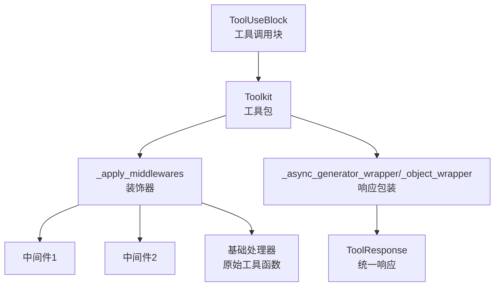
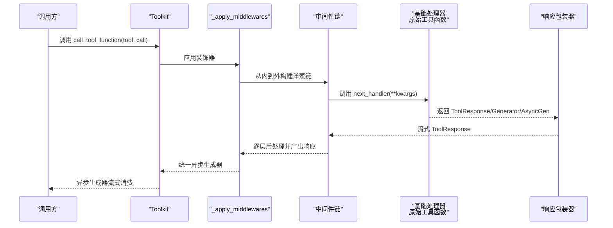
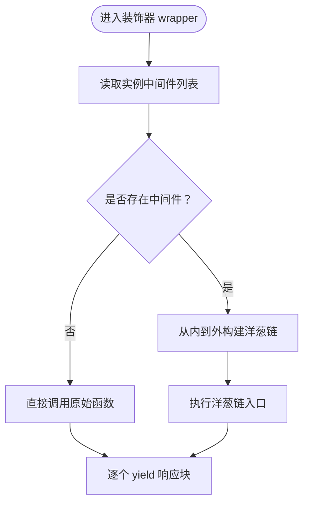
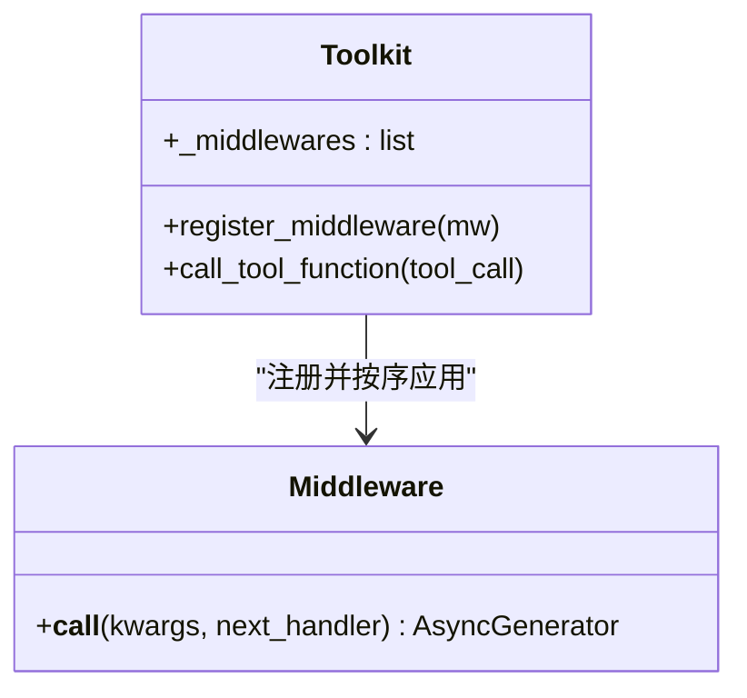
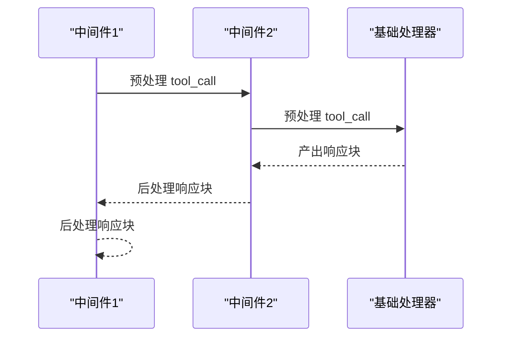
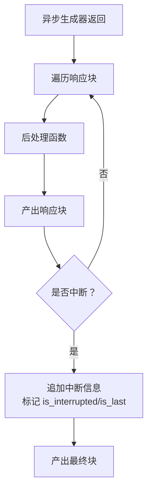
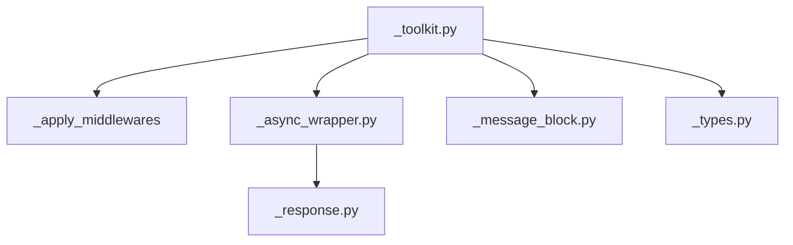

# 中间件链系统

<cite>
**本文引用的文件**
- [src/agentscope/tool/_toolkit.py](file://src/agentscope/tool/_toolkit.py)
- [src/agentscope/tool/_async_wrapper.py](file://src/agentscope/tool/_async_wrapper.py)
- [src/agentscope/tool/_response.py](file://src/agentscope/tool/_response.py)
- [src/agentscope/message/_message_block.py](file://src/agentscope/message/_message_block.py)
- [src/agentscope/tool/_types.py](file://src/agentscope/tool/_types.py)
- [tests/toolkit_middleware_test.py](file://tests/toolkit_middleware_test.py)
- [docs/tutorial/zh_CN/src/task_middleware.py](file://docs/tutorial/zh_CN/src/task_middleware.py)
</cite>

## 目录
1. [简介](#简介)
2. [项目结构](#项目结构)
3. [核心组件](#核心组件)
4. [架构总览](#架构总览)
5. [详细组件分析](#详细组件分析)
6. [依赖分析](#依赖分析)
7. [性能考虑](#性能考虑)
8. [故障排查指南](#故障排查指南)
9. [结论](#结论)
10. [附录](#附录)

## 简介
本文件系统性阐述 AgentScope 中间件链系统，重点围绕工具执行阶段的中间件机制，包括：
- _apply_middlewares 装饰器的工作原理与洋葱模型执行顺序
- 中间件的注册、移除与管理策略
- 中间件链的构建与执行流程（从内到外的包装与参数传递）
- 异步中间件与异步生成器的处理逻辑
- 错误处理与异常传播机制
- 自定义中间件（同步与异步）的实现范式与典型用法（日志、鉴权、参数校验等）

## 项目结构
中间件链系统主要位于工具模块，核心文件如下：
- 工具包与中间件装饰器：src/agentscope/tool/_toolkit.py
- 异步/同步生成器包装与后处理：src/agentscope/tool/_async_wrapper.py
- 工具响应数据结构：src/agentscope/tool/_response.py
- 消息块与工具调用块：src/agentscope/message/_message_block.py
- 工具类型定义：src/agentscope/tool/_types.py
- 单元测试与示例教程：tests/toolkit_middleware_test.py、docs/tutorial/zh_CN/src/task_middleware.py

图表来源
- [src/agentscope/tool/_toolkit.py:57-114](file://src/agentscope/tool/_toolkit.py#L57-L114)
- [src/agentscope/tool/_async_wrapper.py:63-110](file://src/agentscope/tool/_async_wrapper.py#L63-L110)
- [src/agentscope/tool/_response.py:11-33](file://src/agentscope/tool/_response.py#L11-L33)
- [src/agentscope/message/_message_block.py:79-92](file://src/agentscope/message/_message_block.py#L79-L92)

章节来源
- [src/agentscope/tool/_toolkit.py:57-114](file://src/agentscope/tool/_toolkit.py#L57-L114)
- [src/agentscope/tool/_async_wrapper.py:16-110](file://src/agentscope/tool/_async_wrapper.py#L16-L110)
- [src/agentscope/tool/_response.py:11-33](file://src/agentscope/tool/_response.py#L11-L33)
- [src/agentscope/message/_message_block.py:79-92](file://src/agentscope/message/_message_block.py#L79-L92)

## 核心组件
- 中间件装饰器 _apply_middlewares：在每次工具调用时动态构建中间件链，采用“从内到外”的洋葱模型，将中间件逐层包裹在基础处理器上。
- 工具包 Toolkit：负责工具注册、组激活、中间件注册与管理，并提供统一的工具调用入口。
- 异步/同步包装器：将不同返回类型的工具函数统一为异步生成器流式输出，并在流中断时插入中断提示。
- 工具响应 ToolResponse：统一的工具输出载体，支持多模态内容块与流式标记。
- 工具调用块 ToolUseBlock：描述一次工具调用的请求结构。

章节来源
- [src/agentscope/tool/_toolkit.py:57-114](file://src/agentscope/tool/_toolkit.py#L57-L114)
- [src/agentscope/tool/_toolkit.py:1441-1539](file://src/agentscope/tool/_toolkit.py#L1441-L1539)
- [src/agentscope/tool/_async_wrapper.py:16-110](file://src/agentscope/tool/_async_wrapper.py#L16-L110)
- [src/agentscope/tool/_response.py:11-33](file://src/agentscope/tool/_response.py#L11-L33)
- [src/agentscope/message/_message_block.py:79-92](file://src/agentscope/message/_message_block.py#L79-L92)

## 架构总览
中间件链在 Toolkit.call_tool_function 调用路径中被应用，装饰器在运行时读取实例中的中间件列表，从最内层（原始工具函数）向外逐层包裹，形成洋葱结构。中间件通过 next_handler 传递 ToolUseBlock，并在响应流上进行预处理、拦截与后处理。

图表来源
- [src/agentscope/tool/_toolkit.py:851-870](file://src/agentscope/tool/_toolkit.py#L851-L870)
- [src/agentscope/tool/_toolkit.py:57-114](file://src/agentscope/tool/_toolkit.py#L57-L114)
- [src/agentscope/tool/_async_wrapper.py:63-110](file://src/agentscope/tool/_async_wrapper.py#L63-L110)

章节来源
- [src/agentscope/tool/_toolkit.py:851-870](file://src/agentscope/tool/_toolkit.py#L851-L870)
- [src/agentscope/tool/_toolkit.py:57-114](file://src/agentscope/tool/_toolkit.py#L57-L114)

## 详细组件分析

### 装饰器 _apply_middlewares 的工作原理
- 动态构建：每次调用时从实例属性读取中间件列表，若为空则直接调用原始函数。
- 包装策略：从最外层向最内层（原始函数）方向依次包裹，形成洋葱模型；执行顺序为“注册顺序”预处理、“逆序”后处理。
- 参数传递：中间件接收 kwargs 字典（当前包含 tool_call），可通过 next_handler(**kwargs) 传递给下一层。
- 返回类型：始终返回异步生成器，保证上层一致的流式消费接口。

图表来源
- [src/agentscope/tool/_toolkit.py:78-112](file://src/agentscope/tool/_toolkit.py#L78-L112)

章节来源
- [src/agentscope/tool/_toolkit.py:57-114](file://src/agentscope/tool/_toolkit.py#L57-L114)

### 中间件注册机制与管理
- 注册：通过 Toolkit.register_middleware 将中间件追加到内部列表，装饰器在下一次调用时生效。
- 执行：装饰器在运行时按注册顺序构建洋葱链，确保“先注册先执行”的预处理与“先注册后执行”的后处理。
- 移除：当前实现未提供内置的中间件移除方法，建议通过重新初始化 Toolkit 或在业务侧控制注册时机来实现动态管理。

图表来源
- [src/agentscope/tool/_toolkit.py:1441-1539](file://src/agentscope/tool/_toolkit.py#L1441-L1539)

章节来源
- [src/agentscope/tool/_toolkit.py:1441-1539](file://src/agentscope/tool/_toolkit.py#L1441-L1539)

### 中间件链执行流程与参数传递
- 入口参数：kwargs["tool_call"] 为 ToolUseBlock，包含工具名与输入字典。
- 预处理：中间件可在调用 next_handler 前修改 tool_call 内容。
- 响应拦截：中间件可逐块读取并修改 ToolResponse，实现日志、限流、缓存、鉴权等。
- 后处理：在 next_handler 返回后，中间件可对响应进行二次加工。
- 跳过执行：中间件可选择不调用 next_handler，直接返回自定义 ToolResponse，从而跳过工具执行。

图表来源
- [src/agentscope/tool/_toolkit.py:57-114](file://src/agentscope/tool/_toolkit.py#L57-L114)
- [tests/toolkit_middleware_test.py:10-42](file://tests/toolkit_middleware_test.py#L10-L42)

章节来源
- [src/agentscope/tool/_toolkit.py:57-114](file://src/agentscope/tool/_toolkit.py#L57-L114)
- [tests/toolkit_middleware_test.py:10-42](file://tests/toolkit_middleware_test.py#L10-L42)

### 异步中间件与异步生成器处理
- 异常中断：当上游异步生成器在生成过程中被取消，包装器会在最后一个响应块中追加中断提示，并标记 is_interrupted/is_last。
- 流式后处理：包装器对每个响应块执行后处理函数，保证中间件链的后处理能力贯穿整个流。
- 统一输出：无论原始工具函数返回 ToolResponse、同步生成器还是异步生成器，最终均被包装为异步生成器供上层消费。

图表来源
- [src/agentscope/tool/_async_wrapper.py:63-110](file://src/agentscope/tool/_async_wrapper.py#L63-L110)

章节来源
- [src/agentscope/tool/_async_wrapper.py:16-110](file://src/agentscope/tool/_async_wrapper.py#L16-L110)

### 错误处理与异常传播
- 工具函数异常：捕获通用异常并封装为 ToolResponse，避免中断调用链。
- MCP 工具异常：捕获 MCP 特定异常并返回结构化错误信息。
- 异步任务异常：在后台执行工具时捕获异常并生成错误响应。
- 中断处理：对 asyncio.CancelledError 进行特殊处理，确保用户中断时能正确产出中断提示。

章节来源
- [src/agentscope/tool/_toolkit.py:808-844](file://src/agentscope/tool/_toolkit.py#L808-L844)
- [src/agentscope/tool/_toolkit.py:996-1014](file://src/agentscope/tool/_toolkit.py#L996-L1014)
- [src/agentscope/tool/_async_wrapper.py:85-109](file://src/agentscope/tool/_async_wrapper.py#L85-L109)

### 自定义中间件实现范式
- 同步中间件：实现异步函数签名，接收 kwargs 与 next_handler，预处理后调用 next_handler，再对响应进行后处理。
- 异步中间件：与同步中间件相同，但可配合异步工具函数与异步生成器。
- 典型用途：
  - 日志记录：在预处理与后处理阶段打印工具名与输入/输出。
  - 授权检查：在预处理阶段判断工具名是否在白名单，不在则直接返回错误并跳过执行。
  - 参数验证：在预处理阶段校验 tool_call 的输入字段，必要时修正或拒绝。
  - 输出转换：在后处理阶段对响应内容进行格式化或过滤。

章节来源
- [docs/tutorial/zh_CN/src/task_middleware.py:81-101](file://docs/tutorial/zh_CN/src/task_middleware.py#L81-L101)
- [docs/tutorial/zh_CN/src/task_middleware.py:216-244](file://docs/tutorial/zh_CN/src/task_middleware.py#L216-L244)
- [docs/tutorial/zh_CN/src/task_middleware.py:316-352](file://docs/tutorial/zh_CN/src/task_middleware.py#L316-L352)

### 示例与验证
- 单元测试：验证多个中间件的洋葱模型执行顺序，确认预处理按注册顺序、后处理按逆序执行。
- 教程示例：提供日志、转换、授权与多中间件的完整示例，便于快速上手。

章节来源
- [tests/toolkit_middleware_test.py:60-87](file://tests/toolkit_middleware_test.py#L60-L87)
- [docs/tutorial/zh_CN/src/task_middleware.py:129-150](file://docs/tutorial/zh_CN/src/task_middleware.py#L129-L150)
- [docs/tutorial/zh_CN/src/task_middleware.py:184-206](file://docs/tutorial/zh_CN/src/task_middleware.py#L184-L206)
- [docs/tutorial/zh_CN/src/task_middleware.py:262-294](file://docs/tutorial/zh_CN/src/task_middleware.py#L262-L294)
- [docs/tutorial/zh_CN/src/task_middleware.py:354-382](file://docs/tutorial/zh_CN/src/task_middleware.py#L354-L382)

## 依赖分析
- Toolkit 依赖中间件装饰器与异步包装器，以保证工具调用的统一流式接口。
- 中间件依赖 ToolUseBlock 作为上下文输入，依赖 ToolResponse 作为输出载体。
- 异步包装器依赖后处理函数与 ToolResponse，以实现流中断与后处理的一致性。

图表来源
- [src/agentscope/tool/_toolkit.py:57-114](file://src/agentscope/tool/_toolkit.py#L57-L114)
- [src/agentscope/tool/_async_wrapper.py:16-110](file://src/agentscope/tool/_async_wrapper.py#L16-L110)
- [src/agentscope/tool/_response.py:11-33](file://src/agentscope/tool/_response.py#L11-L33)
- [src/agentscope/message/_message_block.py:79-92](file://src/agentscope/message/_message_block.py#L79-L92)
- [src/agentscope/tool/_types.py:15-61](file://src/agentscope/tool/_types.py#L15-L61)

章节来源
- [src/agentscope/tool/_toolkit.py:57-114](file://src/agentscope/tool/_toolkit.py#L57-L114)
- [src/agentscope/tool/_async_wrapper.py:16-110](file://src/agentscope/tool/_async_wrapper.py#L16-L110)
- [src/agentscope/tool/_response.py:11-33](file://src/agentscope/tool/_response.py#L11-L33)
- [src/agentscope/message/_message_block.py:79-92](file://src/agentscope/message/_message_block.py#L79-L92)
- [src/agentscope/tool/_types.py:15-61](file://src/agentscope/tool/_types.py#L15-L61)

## 性能考虑
- 中间件数量：中间件越多，洋葱链越深，预处理与后处理的开销越大。建议仅注册必要的中间件。
- 响应流式处理：通过异步生成器减少内存占用，适合长耗时工具。
- 异步任务：对于高并发场景，合理设置超时与取消策略，避免资源泄露。
- 后处理函数：尽量保持轻量，避免在后处理中进行阻塞操作。

## 故障排查指南
- 中间件未生效：确认中间件已通过 register_middleware 注册，且装饰器在 call_tool_function 调用路径上。
- 执行顺序异常：检查中间件注册顺序，确保符合“预处理按注册顺序、后处理逆序”的预期。
- 响应未流式：确认工具函数返回类型为 ToolResponse、Generator 或 AsyncGenerator，否则会被包装为异步生成器。
- 中断未识别：若工具函数为异步生成器，请确保在上层正确处理 asyncio.CancelledError，以便包装器注入中断提示。
- 授权跳过失败：检查中间件是否在预处理阶段直接返回错误响应并提前结束，避免调用 next_handler。

章节来源
- [src/agentscope/tool/_toolkit.py:851-870](file://src/agentscope/tool/_toolkit.py#L851-L870)
- [src/agentscope/tool/_async_wrapper.py:85-109](file://src/agentscope/tool/_async_wrapper.py#L85-L109)
- [tests/toolkit_middleware_test.py:68-87](file://tests/toolkit_middleware_test.py#L68-L87)

## 结论
AgentScope 的中间件链系统以 _apply_middlewares 装饰器为核心，结合 Toolkit 的动态注册机制，实现了工具执行阶段的洋葱模型。该设计支持预处理、拦截与后处理，兼容同步与异步工具函数，并通过异步包装器保证流式输出与中断处理的一致性。通过合理的中间件组合，可轻松实现日志、鉴权、参数校验、缓存与限流等横切关注点。

## 附录
- 关键实现位置参考：
  - 装饰器与调用入口：[src/agentscope/tool/_toolkit.py:57-114](file://src/agentscope/tool/_toolkit.py#L57-L114), [src/agentscope/tool/_toolkit.py:851-870](file://src/agentscope/tool/_toolkit.py#L851-L870)
  - 中间件注册与管理：[src/agentscope/tool/_toolkit.py:1441-1539](file://src/agentscope/tool/_toolkit.py#L1441-L1539)
  - 异步包装与中断处理：[src/agentscope/tool/_async_wrapper.py:63-110](file://src/agentscope/tool/_async_wrapper.py#L63-L110)
  - 数据结构与类型：[src/agentscope/tool/_response.py:11-33](file://src/agentscope/tool/_response.py#L11-L33), [src/agentscope/message/_message_block.py:79-92](file://src/agentscope/message/_message_block.py#L79-L92), [src/agentscope/tool/_types.py:15-61](file://src/agentscope/tool/_types.py#L15-L61)
  - 示例与测试：[tests/toolkit_middleware_test.py:60-87](file://tests/toolkit_middleware_test.py#L60-L87), [docs/tutorial/zh_CN/src/task_middleware.py:129-150](file://docs/tutorial/zh_CN/src/task_middleware.py#L129-L150)