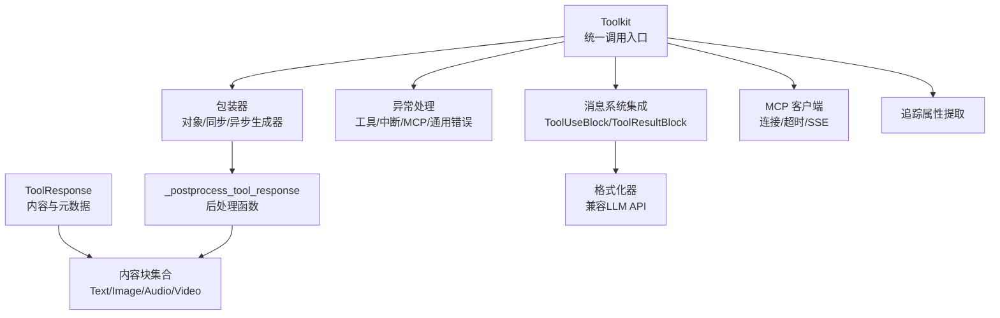
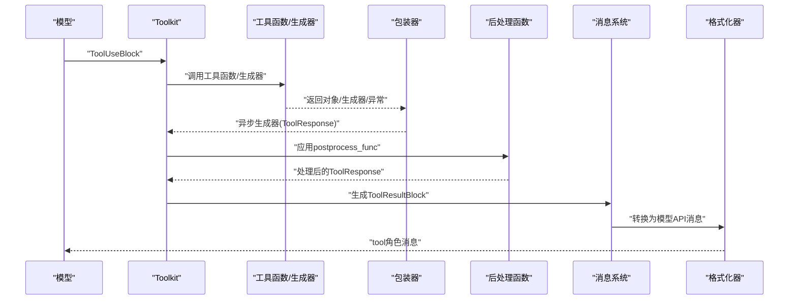
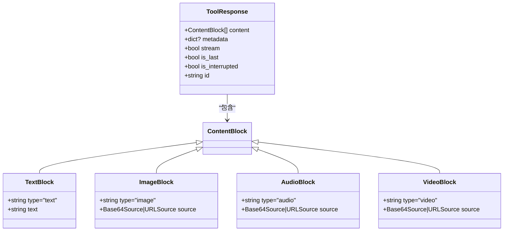
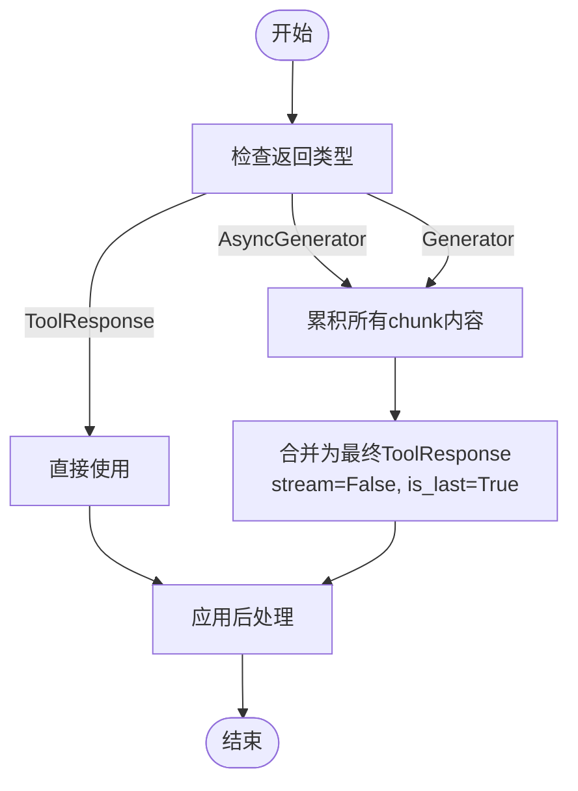
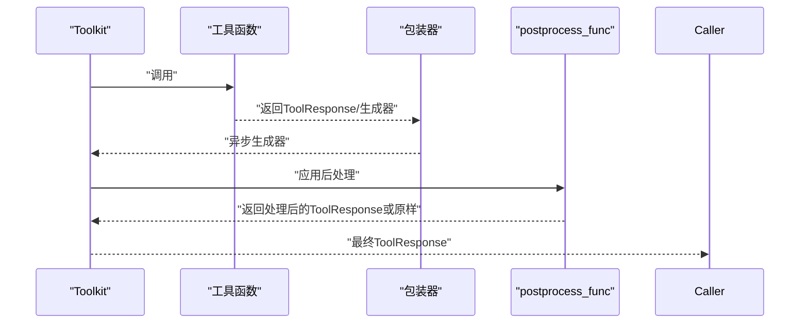
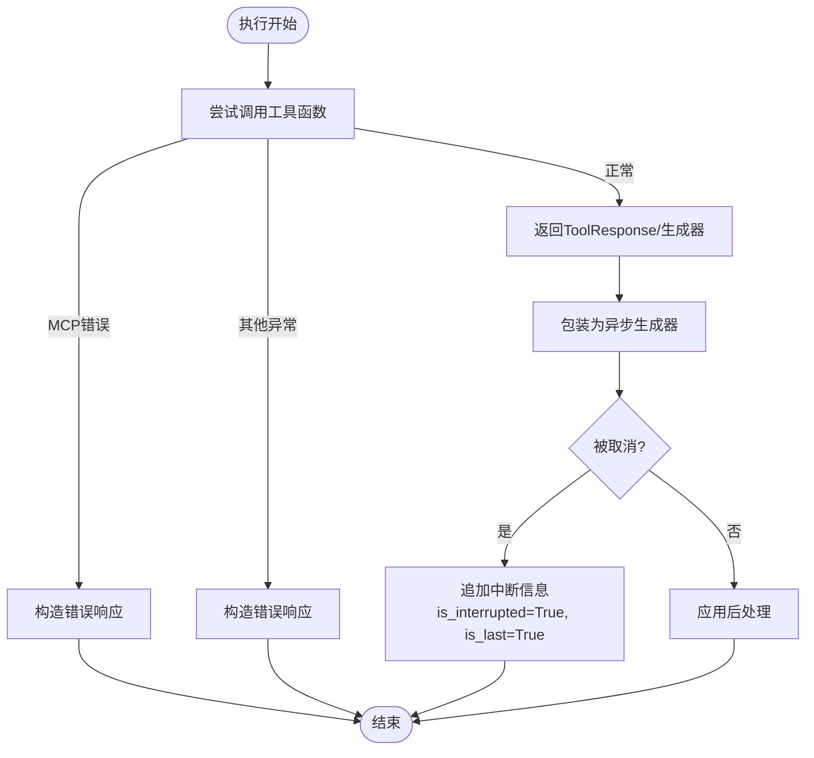
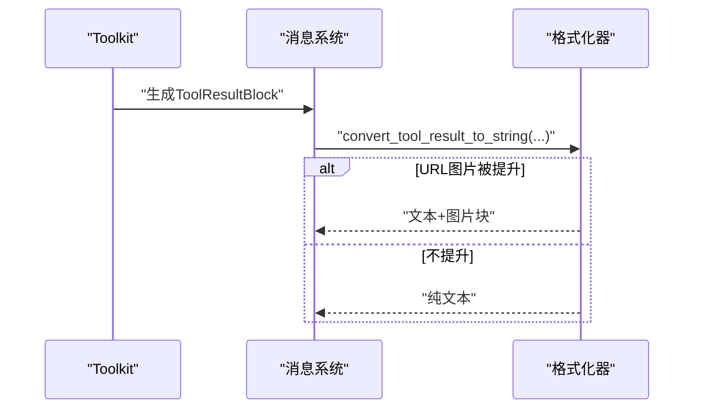
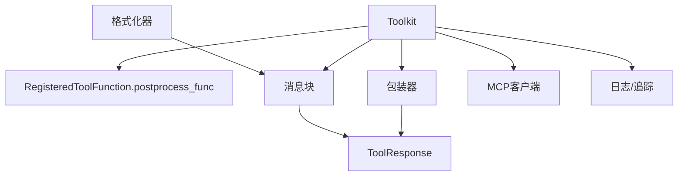

# 工具响应处理

<cite>
**本文引用的文件**
- [tool/_response.py](file://src/agentscope/tool/_response.py)
- [message/_message_block.py](file://src/agentscope/message/_message_block.py)
- [tool/_types.py](file://src/agentscope/tool/_types.py)
- [tool/_toolkit.py](file://src/agentscope/tool/_toolkit.py)
- [tool/_async_wrapper.py](file://src/agentscope/tool/_async_wrapper.py)
- [exception/_tool.py](file://src/agentscope/exception/_tool.py)
- [formatter/_formatter_base.py](file://src/agentscope/formatter/_formatter_base.py)
- [formatter/_openai_formatter.py](file://src/agentscope/formatter/_openai_formatter.py)
- [formatter/_ollama_formatter.py](file://src/agentscope/formatter/_ollama_formatter.py)
- [mcp/_http_stateful_client.py](file://src/agentscope/mcp/_http_stateful_client.py)
- [mcp/_stateful_client_base.py](file://src/agentscope/mcp/_stateful_client_base.py)
- [tracing/_extractor.py](file://src/agentscope/tracing/_extractor.py)
- [tests/toolkit_basic_test.py](file://tests/toolkit_basic_test.py)
</cite>

## 目录
1. [简介](#简介)
2. [项目结构](#项目结构)
3. [核心组件](#核心组件)
4. [架构总览](#架构总览)
5. [详细组件分析](#详细组件分析)
6. [依赖分析](#依赖分析)
7. [性能考虑](#性能考虑)
8. [故障排查指南](#故障排查指南)
9. [结论](#结论)
10. [附录：示例与最佳实践](#附录示例与最佳实践)

## 简介
本文件面向AgentScope工具响应处理系统，围绕ToolResponse类展开，系统性说明其数据结构设计（多模态content支持）、流式处理机制（stream/is_last）、后处理（postprocess_func）流程、错误与异常处理策略、以及与消息系统（ToolUseBlock/ToolResultBlock）的集成方式。同时给出典型用法与注意事项，帮助开发者在智能体决策链路中正确使用工具响应。

## 项目结构
与工具响应处理直接相关的关键模块如下：
- 数据结构与消息块：ToolResponse、TextBlock/ImageBlock/AudioBlock/VideoBlock、ToolUseBlock/ToolResultBlock
- 执行与封装：Toolkit、异步/同步生成器包装器
- 后处理与中间件：RegisteredToolFunction.postprocess_func、中间件链
- 错误与异常：工具相关异常类型
- 格式化与消息集成：各格式化器对tool_result的兼容处理
- MCP客户端：HTTP SSE/流式HTTP传输与连接校验
- 追踪：工具响应属性提取

图表来源
- [tool/_response.py:11-32](file://src/agentscope/tool/_response.py#L11-L32)
- [message/_message_block.py:94-118](file://src/agentscope/message/_message_block.py#L94-L118)
- [tool/_toolkit.py:853-870](file://src/agentscope/tool/_toolkit.py#L853-L870)
- [tool/_async_wrapper.py:16-48](file://src/agentscope/tool/_async_wrapper.py#L16-L48)
- [formatter/_formatter_base.py:40-76](file://src/agentscope/formatter/_formatter_base.py#L40-L76)
- [mcp/_http_stateful_client.py:35-66](file://src/agentscope/mcp/_http_stateful_client.py#L35-L66)
- [tracing/_extractor.py:628-652](file://src/agentscope/tracing/_extractor.py#L628-L652)

章节来源
- [tool/_response.py:11-32](file://src/agentscope/tool/_response.py#L11-L32)
- [message/_message_block.py:94-118](file://src/agentscope/message/_message_block.py#L94-L118)
- [tool/_toolkit.py:853-870](file://src/agentscope/tool/_toolkit.py#L853-L870)

## 核心组件
- ToolResponse：工具调用结果的统一载体，包含多模态内容、元数据、流式标记、中断标记与唯一标识。
- 内容块：TextBlock、ImageBlock、AudioBlock、VideoBlock，用于承载文本、图片、音频、视频等多模态输出。
- 消息块：ToolUseBlock（模型请求工具调用）、ToolResultBlock（工具返回结果），用于消息系统与格式化器之间的转换。
- Toolkit：统一的工具调用入口，负责执行、累积流式结果、应用后处理与中间件，并进行错误处理。
- 异步/同步包装器：将任意返回值（对象、同步/异步生成器）统一封装为异步生成器，保证上层一致消费。
- 后处理与中间件：RegisteredToolFunction.postprocess_func支持同步/异步；中间件链动态构建并按内外层顺序执行。
- 异常体系：工具未找到、参数无效、用户中断等专用异常类型。
- 格式化器：将ToolResultBlock转换为不同模型API所需的tool角色消息，必要时将多模态数据提升为独立消息块。
- MCP客户端：支持连接、会话初始化、超时配置与SSE读取超时，保障流式工具调用的稳定性。

章节来源
- [tool/_response.py:11-32](file://src/agentscope/tool/_response.py#L11-L32)
- [message/_message_block.py:94-118](file://src/agentscope/message/_message_block.py#L94-L118)
- [tool/_types.py:41-56](file://src/agentscope/tool/_types.py#L41-L56)
- [tool/_toolkit.py:853-870](file://src/agentscope/tool/_toolkit.py#L853-L870)
- [tool/_async_wrapper.py:16-48](file://src/agentscope/tool/_async_wrapper.py#L16-L48)
- [formatter/_formatter_base.py:40-76](file://src/agentscope/formatter/_formatter_base.py#L40-L76)
- [mcp/_http_stateful_client.py:35-66](file://src/agentscope/mcp/_http_stateful_client.py#L35-L66)

## 架构总览
下图展示了从模型产生ToolUseBlock到最终生成ToolResultBlock并被格式化器使用的完整链路，以及流式与后处理的关键节点。

图表来源
- [tool/_toolkit.py:853-870](file://src/agentscope/tool/_toolkit.py#L853-L870)
- [tool/_async_wrapper.py:63-110](file://src/agentscope/tool/_async_wrapper.py#L63-L110)
- [tool/_types.py:41-56](file://src/agentscope/tool/_types.py#L41-L56)
- [formatter/_openai_formatter.py:235-299](file://src/agentscope/formatter/_openai_formatter.py#L235-L299)
- [formatter/_ollama_formatter.py:161-193](file://src/agentscope/formatter/_ollama_formatter.py#L161-L193)

## 详细组件分析

### ToolResponse数据结构与多模态支持
- content：列表，元素为TextBlock、ImageBlock、AudioBlock或VideoBlock，支持混合内容组合。
- metadata：可选字典，便于代理内部访问，避免重复解析结果块。
- stream：是否为流式输出。
- is_last：是否为一次流式执行的最后一个响应。
- is_interrupted：是否被用户中断。
- id：唯一标识，自动生成。

图表来源
- [tool/_response.py:11-32](file://src/agentscope/tool/_response.py#L11-L32)
- [message/_message_block.py:9-118](file://src/agentscope/message/_message_block.py#L9-L118)

章节来源
- [tool/_response.py:11-32](file://src/agentscope/tool/_response.py#L11-L32)
- [message/_message_block.py:94-118](file://src/agentscope/message/_message_block.py#L94-L118)

### 流式处理机制：stream与is_last
- Toolkit在调用工具函数时，若返回异步/同步生成器，会累积所有chunk的内容，最终合并为单个ToolResponse（stream=False，is_last=True）。
- 若工具函数本身返回ToolResponse对象，则直接作为最终结果。
- 包装器在异步生成器被取消时，会在最后一个chunk追加“被中断”信息，并设置is_interrupted与is_last，确保上层能感知中断状态。

图表来源
- [tool/_toolkit.py:757-807](file://src/agentscope/tool/_toolkit.py#L757-L807)
- [tool/_async_wrapper.py:63-110](file://src/agentscope/tool/_async_wrapper.py#L63-L110)

章节来源
- [tool/_toolkit.py:757-807](file://src/agentscope/tool/_toolkit.py#L757-L807)
- [tool/_async_wrapper.py:63-110](file://src/agentscope/tool/_async_wrapper.py#L63-L110)

### 后处理（postprocess_func）机制
- 注册工具函数支持postprocess_func，类型签名接受ToolUseBlock与ToolResponse，返回ToolResponse或None（None表示不修改）。
- 支持同步与异步函数，内部通过统一执行器适配。
- Toolkit在累积完成后应用postprocess_func，允许对响应进行修改或过滤。
- 测试覆盖了同步与异步后处理函数的行为。

图表来源
- [tool/_types.py:41-56](file://src/agentscope/tool/_types.py#L41-L56)
- [tool/_async_wrapper.py:16-36](file://src/agentscope/tool/_async_wrapper.py#L16-L36)
- [tool/_toolkit.py:808-818](file://src/agentscope/tool/_toolkit.py#L808-L818)
- [tests/toolkit_basic_test.py:859-900](file://tests/toolkit_basic_test.py#L859-L900)

章节来源
- [tool/_types.py:41-56](file://src/agentscope/tool/_types.py#L41-L56)
- [tool/_async_wrapper.py:16-36](file://src/agentscope/tool/_async_wrapper.py#L16-L36)
- [tool/_toolkit.py:808-818](file://src/agentscope/tool/_toolkit.py#L808-L818)
- [tests/toolkit_basic_test.py:859-900](file://tests/toolkit_basic_test.py#L859-L900)

### 错误处理与异常情况
- 工具相关异常：工具未找到、参数无效、用户中断等。
- 工具执行异常：捕获MCP错误与通用异常，统一包装为ToolResponse的文本内容返回。
- 用户中断：当异步生成器被取消时，包装器追加系统提示信息并标记is_interrupted与is_last。
- MCP客户端：连接前校验、会话初始化、超时控制（含SSE读取超时），异常时清理资源并抛出。

图表来源
- [tool/_toolkit.py:737-755](file://src/agentscope/tool/_toolkit.py#L737-L755)
- [tool/_toolkit.py:819-843](file://src/agentscope/tool/_toolkit.py#L819-L843)
- [tool/_async_wrapper.py:85-109](file://src/agentscope/tool/_async_wrapper.py#L85-L109)
- [mcp/_stateful_client_base.py:164-176](file://src/agentscope/mcp/_stateful_client_base.py#L164-L176)
- [mcp/_http_stateful_client.py:35-66](file://src/agentscope/mcp/_http_stateful_client.py#L35-L66)

章节来源
- [exception/_tool.py:7-17](file://src/agentscope/exception/_tool.py#L7-L17)
- [tool/_toolkit.py:737-755](file://src/agentscope/tool/_toolkit.py#L737-L755)
- [tool/_toolkit.py:819-843](file://src/agentscope/tool/_toolkit.py#L819-L843)
- [tool/_async_wrapper.py:85-109](file://src/agentscope/tool/_async_wrapper.py#L85-L109)
- [mcp/_stateful_client_base.py:164-176](file://src/agentscope/mcp/_stateful_client_base.py#L164-L176)
- [mcp/_http_stateful_client.py:35-66](file://src/agentscope/mcp/_http_stateful_client.py#L35-L66)

### 与消息系统的集成：ToolUseBlock与ToolResultBlock
- ToolUseBlock：描述模型请求调用的工具名称、输入与唯一ID。
- ToolResultBlock：描述工具执行结果，output可为字符串或多模态内容列表。
- 格式化器：将ToolResultBlock转换为不同模型API所需的“tool”角色消息；对于URL型图片，可选择将其提升为独立消息块以增强兼容性。

图表来源
- [message/_message_block.py:94-118](file://src/agentscope/message/_message_block.py#L94-L118)
- [formatter/_formatter_base.py:40-76](file://src/agentscope/formatter/_formatter_base.py#L40-L76)
- [formatter/_openai_formatter.py:263-278](file://src/agentscope/formatter/_openai_formatter.py#L263-L278)
- [formatter/_ollama_formatter.py:166-179](file://src/agentscope/formatter/_ollama_formatter.py#L166-L179)

章节来源
- [message/_message_block.py:94-118](file://src/agentscope/message/_message_block.py#L94-L118)
- [formatter/_formatter_base.py:40-76](file://src/agentscope/formatter/_formatter_base.py#L40-L76)
- [formatter/_openai_formatter.py:235-299](file://src/agentscope/formatter/_openai_formatter.py#L235-L299)
- [formatter/_ollama_formatter.py:161-193](file://src/agentscope/formatter/_ollama_formatter.py#L161-L193)

## 依赖分析
- Toolkit依赖：工具注册表、中间件链、包装器、后处理执行器、MCP客户端、日志与追踪。
- ToolResponse依赖：消息块类型定义（Text/Image/Audio/Video）。
- 格式化器依赖：ToolResultBlock的字符串化与多模态数据提取。
- MCP客户端依赖：连接状态校验、会话初始化、超时参数。

图表来源
- [tool/_toolkit.py:853-870](file://src/agentscope/tool/_toolkit.py#L853-L870)
- [tool/_types.py:41-56](file://src/agentscope/tool/_types.py#L41-L56)
- [tool/_async_wrapper.py:16-48](file://src/agentscope/tool/_async_wrapper.py#L16-L48)
- [formatter/_formatter_base.py:40-76](file://src/agentscope/formatter/_formatter_base.py#L40-L76)

章节来源
- [tool/_toolkit.py:853-870](file://src/agentscope/tool/_toolkit.py#L853-L870)
- [tool/_types.py:41-56](file://src/agentscope/tool/_types.py#L41-L56)
- [tool/_async_wrapper.py:16-48](file://src/agentscope/tool/_async_wrapper.py#L16-L48)
- [formatter/_formatter_base.py:40-76](file://src/agentscope/formatter/_formatter_base.py#L40-L76)

## 性能考虑
- 流式累积：Toolkit对异步/同步生成器进行累积，避免频繁小块传输带来的开销，最终合并为单次响应。
- 后处理与中间件：建议在postprocess_func中尽量轻量操作，避免阻塞事件循环；如需IO，优先使用异步实现。
- 多模态数据：URL型图片可按需提升为独立消息块，减少模型API兼容成本；本地base64图片建议仅在必要时保留。
- MCP超时：合理设置SSE读取超时与HTTP超时，避免长时间阻塞导致资源占用。

## 故障排查指南
- 工具未找到：确认工具名与注册名一致，检查分组激活状态。
- 参数无效：核对ToolUseBlock.input结构，确保与工具JSON Schema匹配。
- 用户中断：观察is_interrupted与is_last标记，确认是否在包装器阶段追加了中断信息。
- MCP错误：检查连接状态、会话初始化与超时配置，查看具体异常栈定位问题。
- 格式化失败：确认ToolResultBlock.output类型与格式化器期望一致，必要时在postprocess_func中规范化输出。

章节来源
- [tool/_toolkit.py:872-885](file://src/agentscope/tool/_toolkit.py#L872-L885)
- [tool/_toolkit.py:890-900](file://src/agentscope/tool/_toolkit.py#L890-L900)
- [tool/_async_wrapper.py:85-109](file://src/agentscope/tool/_async_wrapper.py#L85-L109)
- [mcp/_stateful_client_base.py:164-176](file://src/agentscope/mcp/_stateful_client_base.py#L164-L176)

## 结论
ToolResponse作为AgentScope工具响应的核心载体，通过多模态内容与流式标记实现了灵活而统一的工具输出抽象。结合Toolkit的执行、累积与后处理能力，以及消息系统与格式化器的无缝集成，系统能够在复杂场景下稳定地支撑智能体的工具调用与决策流程。遵循本文的结构化理解与最佳实践，可有效提升工具响应的可靠性与可维护性。

## 附录：示例与最佳实践
- 成功响应：工具函数返回ToolResponse，content包含文本与多模态块；is_last=True，stream=False。
- 错误响应：捕获MCP错误或通用异常，构造包含错误信息的ToolResponse；必要时在postprocess_func中进行二次加工。
- 流式响应：工具函数返回异步/同步生成器；Toolkit自动累积并合并；在包装器阶段处理取消事件，追加中断信息。
- 后处理：在postprocess_func中对ToolResponse进行修改或过滤；支持同步/异步函数；测试用例覆盖了同步与异步两种情形。
- 追踪：工具响应属性可通过追踪提取器序列化为OpenTelemetry属性，便于可观测性。

章节来源
- [tests/toolkit_basic_test.py:859-900](file://tests/toolkit_basic_test.py#L859-L900)
- [tracing/_extractor.py:628-652](file://src/agentscope/tracing/_extractor.py#L628-L652)