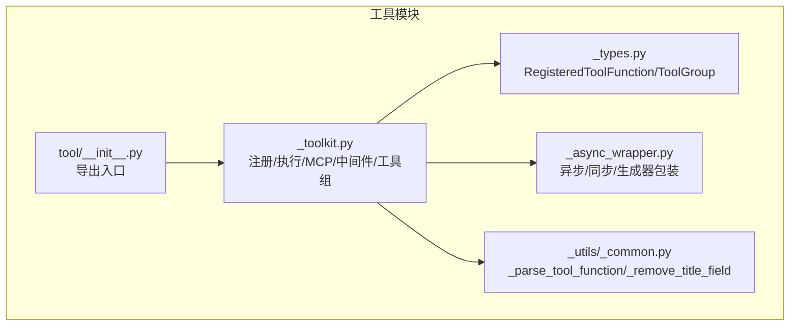
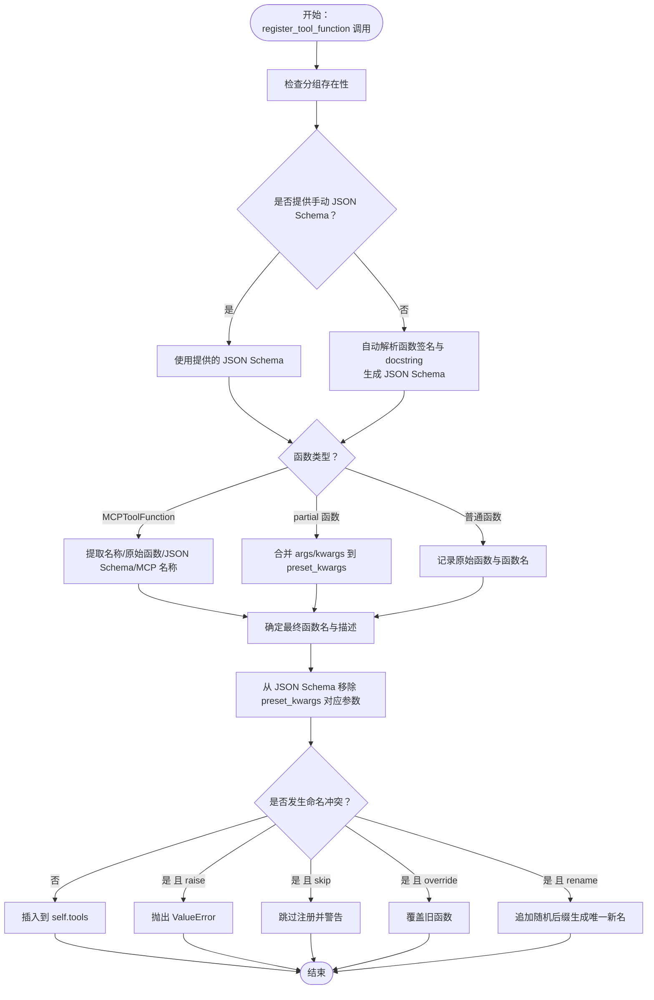
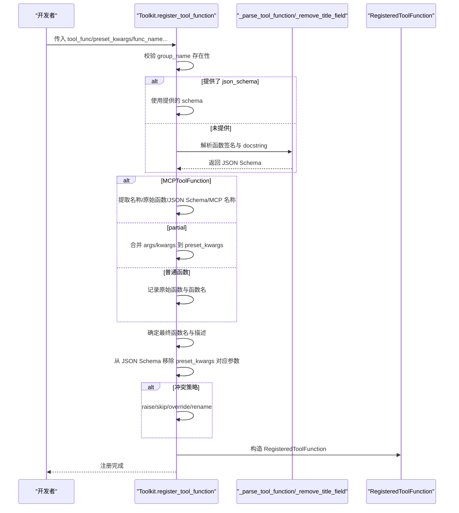
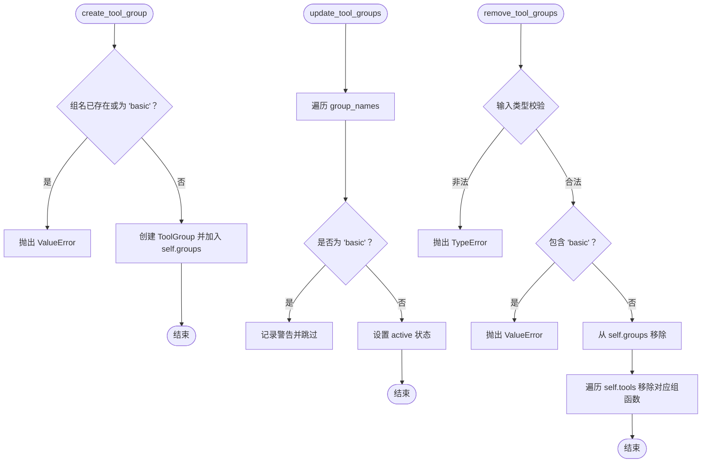
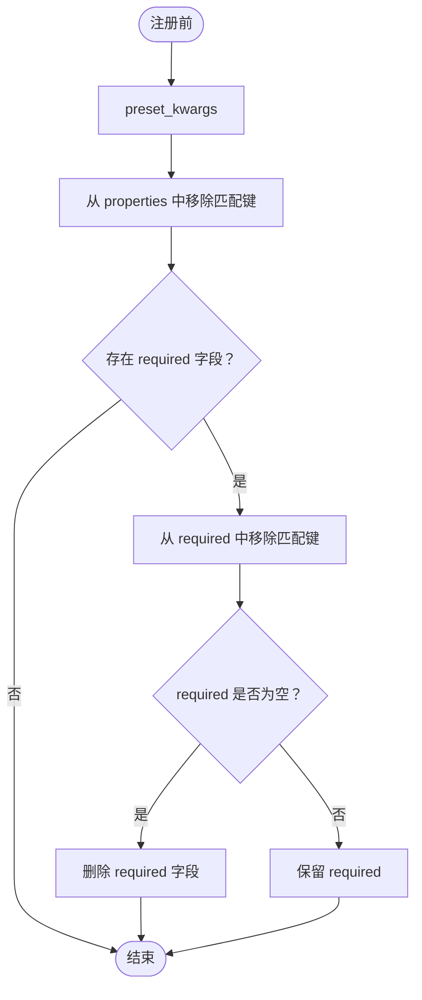
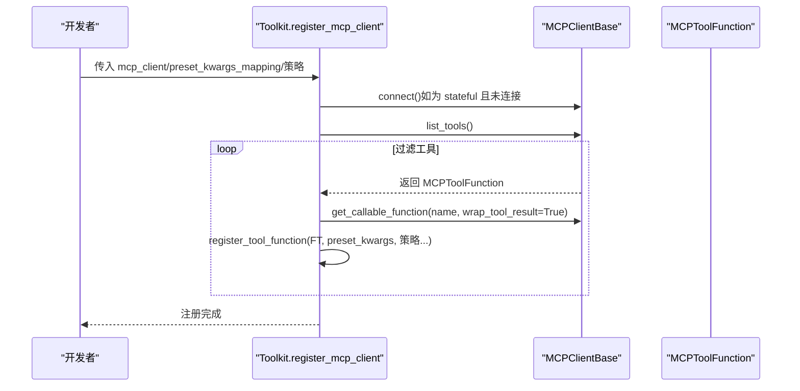
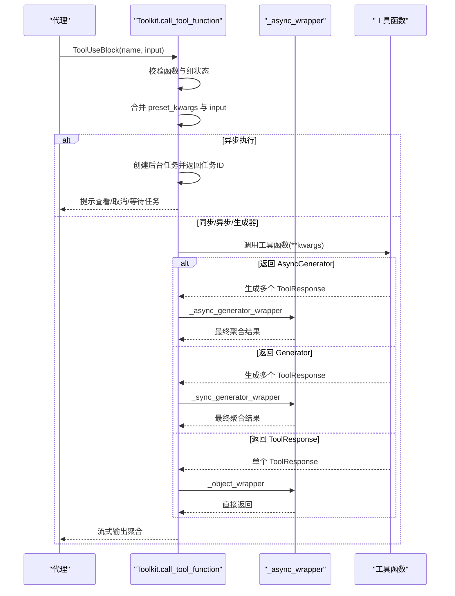
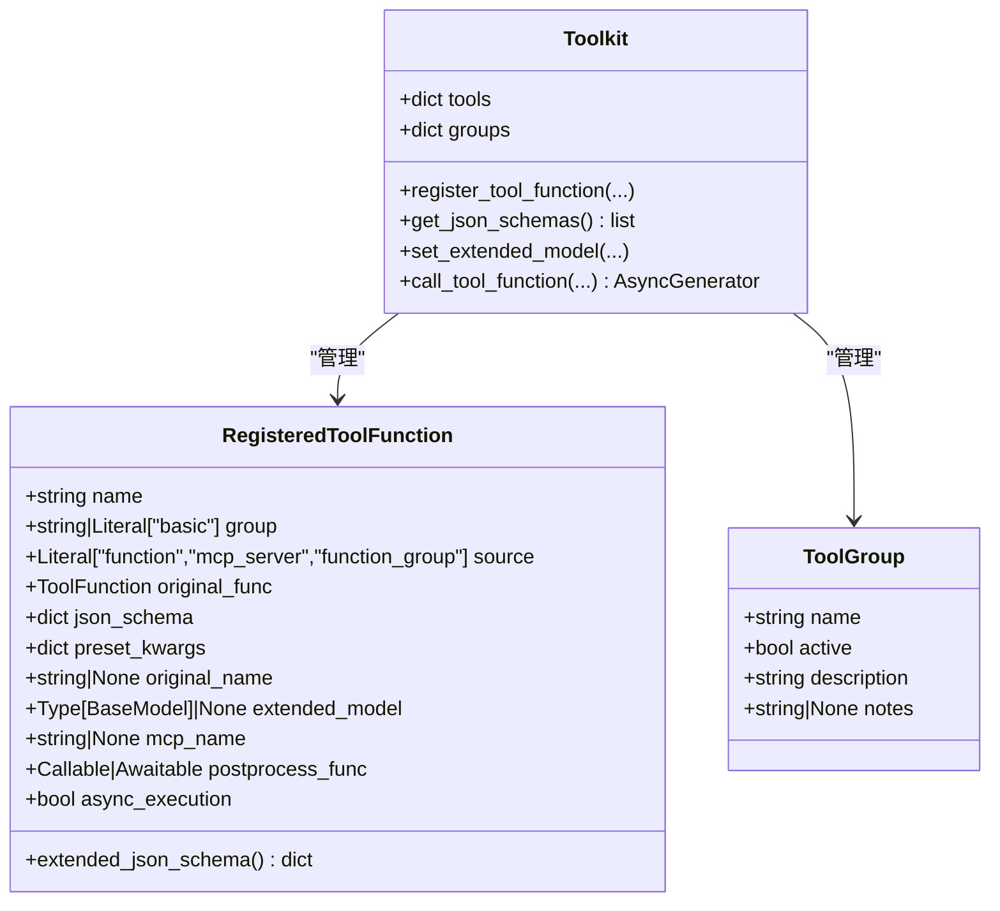
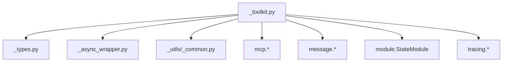

# 工具注册机制

<cite>
**本文引用的文件**
- [src/agentscope/tool/_toolkit.py](file://src/agentscope/tool/_toolkit.py)
- [src/agentscope/tool/_types.py](file://src/agentscope/tool/_types.py)
- [src/agentscope/tool/_async_wrapper.py](file://src/agentscope/tool/_async_wrapper.py)
- [src/agentscope/_utils/_common.py](file://src/agentscope/_utils/_common.py)
- [src/agentscope/tool/__init__.py](file://src/agentscope/tool/__init__.py)
- [examples/functionality/mcp/main.py](file://examples/functionality/mcp/main.py)
- [tests/toolkit_basic_test.py](file://tests/toolkit_basic_test.py)
- [tests/toolkit_meta_tool_test.py](file://tests/toolkit_meta_tool_test.py)
- [tests/mcp_sse_client_test.py](file://tests/mcp_sse_client_test.py)
</cite>

## 目录
1. [简介](#简介)
2. [项目结构](#项目结构)
3. [核心组件](#核心组件)
4. [架构总览](#架构总览)
5. [详细组件分析](#详细组件分析)
6. [依赖分析](#依赖分析)
7. [性能考虑](#性能考虑)
8. [故障排查指南](#故障排查指南)
9. [结论](#结论)
10. [附录：使用示例路径](#附录使用示例路径)

## 简介
本文件系统性阐述 AgentScope 的工具注册机制，重点围绕 register_tool_function 方法的完整实现进行深入解析，涵盖以下关键主题：
- 工具函数的自动 JSON Schema 解析、参数验证与类型推断
- 工具组管理（create_tool_group、update_tool_groups、remove_tool_groups）
- 命名冲突处理策略（namesake_strategy）：'raise'、'override'、'skip'、'rename'
- 预设参数（preset_kwargs）机制及从 JSON Schema 中移除策略
- MCP 工具函数的特殊处理逻辑
- 同步/异步/生成器/局部函数等多类型工具的注册方式与调用流程

## 项目结构
与工具注册机制直接相关的模块位于 src/agentscope/tool 目录，核心文件如下：
- _toolkit.py：工具注册、执行、MCP 客户端集成、工具组管理、中间件等核心逻辑
- _types.py：RegisteredToolFunction、ToolGroup 等数据模型定义
- _async_wrapper.py：统一异步/同步/生成器返回包装，支持流式输出与后处理
- _utils/_common.py：通用工具，包含 _parse_tool_function（自动 JSON Schema 解析）、_remove_title_field、_create_tool_from_base_model 等
- tool/__init__.py：导出 Toolkit、工具函数等

**图表来源**
- [src/agentscope/tool/_toolkit.py:117-186](file://src/agentscope/tool/_toolkit.py#L117-L186)
- [src/agentscope/tool/_types.py:15-61](file://src/agentscope/tool/_types.py#L15-L61)
- [src/agentscope/tool/_async_wrapper.py:16-110](file://src/agentscope/tool/_async_wrapper.py#L16-L110)
- [src/agentscope/_utils/_common.py:339-456](file://src/agentscope/_utils/_common.py#L339-L456)
- [src/agentscope/tool/__init__.py:25-44](file://src/agentscope/tool/__init__.py#L25-L44)

**章节来源**
- [src/agentscope/tool/_toolkit.py:117-186](file://src/agentscope/tool/_toolkit.py#L117-L186)
- [src/agentscope/tool/_types.py:15-61](file://src/agentscope/tool/_types.py#L15-L61)
- [src/agentscope/tool/_async_wrapper.py:16-110](file://src/agentscope/tool/_async_wrapper.py#L16-L110)
- [src/agentscope/_utils/_common.py:339-456](file://src/agentscope/_utils/_common.py#L339-L456)
- [src/agentscope/tool/__init__.py:25-44](file://src/agentscope/tool/__init__.py#L25-L44)

## 核心组件
- Toolkit：工具注册与执行的核心类，负责：
  - 注册工具函数（含 MCP 工具函数）
  - 维护工具组（ToolGroup）与激活状态
  - 统一的工具调用接口（call_tool_function），支持流式输出与后处理
  - 异步任务管理（视图/取消/等待）
  - 中间件洋葱模型（注册与应用）
- RegisteredToolFunction：封装已注册工具函数的元信息（名称、分组、来源、原始函数、JSON Schema、预设参数、扩展模型、MCP 名称、后处理函数、异步执行标记等）
- ToolGroup：工具组定义（名称、描述、是否激活、使用说明）
- 异步包装器：将同步对象、同步/异步生成器统一封装为异步生成器，并支持后处理

**章节来源**
- [src/agentscope/tool/_toolkit.py:117-186](file://src/agentscope/tool/_toolkit.py#L117-L186)
- [src/agentscope/tool/_types.py:15-61](file://src/agentscope/tool/_types.py#L15-L61)
- [src/agentscope/tool/_types.py:62-133](file://src/agentscope/tool/_types.py#L62-L133)
- [src/agentscope/tool/_types.py:135-150](file://src/agentscope/tool/_types.py#L135-L150)
- [src/agentscope/tool/_async_wrapper.py:16-110](file://src/agentscope/tool/_async_wrapper.py#L16-L110)

## 架构总览
下图展示了 register_tool_function 的核心流程与关键依赖：

**图表来源**
- [src/agentscope/tool/_toolkit.py:274-535](file://src/agentscope/tool/_toolkit.py#L274-L535)
- [src/agentscope/_utils/_common.py:339-456](file://src/agentscope/_utils/_common.py#L339-L456)

**章节来源**
- [src/agentscope/tool/_toolkit.py:274-535](file://src/agentscope/tool/_toolkit.py#L274-L535)
- [src/agentscope/_utils/_common.py:339-456](file://src/agentscope/_utils/_common.py#L339-L456)

## 详细组件分析

### register_tool_function：完整实现与要点
- 参数与职责
  - tool_func：待注册的工具函数（支持普通函数、partial、MCPToolFunction）
  - group_name：所属工具组（默认 "basic"，始终包含在 JSON Schema 中）
  - preset_kwargs：预设参数（不会出现在 JSON Schema 中，也不会暴露给代理）
  - func_name / func_description / json_schema：可选覆盖
  - include_long_description / include_var_positional / include_var_keyword：控制自动解析细节
  - postprocess_func：工具执行后的后处理函数（同步或异步）
  - namesake_strategy：命名冲突策略（'raise'/'override'/'skip'/'rename'）
  - async_execution：是否以异步方式执行（实验特性）
- 自动 JSON Schema 解析
  - 使用 _parse_tool_function 从函数签名与 docstring 提取参数与描述
  - 支持 VAR_POSITIONAL（*args）与 VAR_KEYWORD（**kwargs）的选择性包含
  - 移除 schema 中的 title 字段，避免误导 LLM
- 类型与来源区分
  - MCPToolFunction：从 MCP 工具中提取名称、原始调用函数与 JSON Schema，并记录 mcp_name
  - partial：将 args 转换为关键字参数，合并到 preset_kwargs
  - 普通函数：直接使用原函数与函数名
- 命名冲突处理策略
  - raise：直接抛出异常
  - skip：记录警告并跳过注册
  - override：覆盖旧函数
  - rename：最多尝试 100 次，通过短 UUID 生成随机后缀，确保唯一；失败则抛错
- 预设参数（preset_kwargs）处理
  - 从 JSON Schema 的 parameters.properties 与 required 中移除匹配项
  - 若 required 清空，则移除 required 字段
- 返回与扩展
  - 构造 RegisteredToolFunction 并写入 self.tools
  - 扩展模型（set_extended_model）可在后续动态合并到 JSON Schema

**图表来源**
- [src/agentscope/tool/_toolkit.py:274-535](file://src/agentscope/tool/_toolkit.py#L274-L535)
- [src/agentscope/_utils/_common.py:339-456](file://src/agentscope/_utils/_common.py#L339-L456)

**章节来源**
- [src/agentscope/tool/_toolkit.py:274-535](file://src/agentscope/tool/_toolkit.py#L274-L535)
- [src/agentscope/_utils/_common.py:339-456](file://src/agentscope/_utils/_common.py#L339-L456)

### 工具组管理机制
- create_tool_group
  - 创建新的工具组，支持 description 与 notes（用于系统提示）
  - 默认 active=false，除非显式设置
  - 不允许重复创建同名组，也不允许创建名为 "basic" 的组
- update_tool_groups
  - 将指定组的 active 状态批量更新
  - 忽略 "basic" 组（始终激活）
- remove_tool_groups
  - 删除指定组（不允许删除 "basic"）
  - 同时移除该组内的所有工具函数
  - 支持字符串或列表输入

**图表来源**
- [src/agentscope/tool/_toolkit.py:187-272](file://src/agentscope/tool/_toolkit.py#L187-L272)

**章节来源**
- [src/agentscope/tool/_toolkit.py:187-272](file://src/agentscope/tool/_toolkit.py#L187-L272)

### 命名冲突处理策略（namesake_strategy）
- raise：默认策略，直接抛出异常
- skip：记录警告并跳过注册
- override：覆盖旧函数
- rename：最多尝试 100 次，通过短 UUID 生成随机后缀，确保唯一；失败则抛出运行时错误

测试用例验证了各策略的行为一致性。

**章节来源**
- [src/agentscope/tool/_toolkit.py:475-531](file://src/agentscope/tool/_toolkit.py#L475-L531)
- [tests/toolkit_basic_test.py:224-297](file://tests/toolkit_basic_test.py#L224-L297)

### 预设参数（preset_kwargs）机制与 JSON Schema 处理
- 预设参数不会出现在最终 JSON Schema 中，也不会暴露给代理
- 在注册时，会从 parameters.properties 与 required 中移除匹配项
- 若 required 为空，则移除 required 字段，避免不必要的必填约束

**图表来源**
- [src/agentscope/tool/_toolkit.py:440-460](file://src/agentscope/tool/_toolkit.py#L440-L460)

**章节来源**
- [src/agentscope/tool/_toolkit.py:440-460](file://src/agentscope/tool/_toolkit.py#L440-L460)

### MCP 工具函数的特殊处理
- 当 tool_func 为 MCPToolFunction 时：
  - 使用其 name 作为输入函数名，__call__ 作为原始函数
  - 优先使用其 json_schema，否则回退到工具定义
  - 记录 mcp_name，便于后续识别与移除
- register_mcp_client 流程：
  - 连接客户端（若为 stateful 客户端需先 connect）
  - 列举工具，按 enable_funcs/disable_funcs 过滤
  - 逐个获取可调用函数（wrap_tool_result=True），并调用 register_tool_function 完成注册
  - 支持 preset_kwargs_mapping、postprocess_func、namesake_strategy、execution_timeout 等参数

**图表来源**
- [src/agentscope/tool/_toolkit.py:1035-1178](file://src/agentscope/tool/_toolkit.py#L1035-L1178)
- [src/agentscope/_utils/_common.py:216-236](file://src/agentscope/_utils/_common.py#L216-L236)

**章节来源**
- [src/agentscope/tool/_toolkit.py:1035-1178](file://src/agentscope/tool/_toolkit.py#L1035-L1178)
- [src/agentscope/_utils/_common.py:216-236](file://src/agentscope/_utils/_common.py#L216-L236)
- [examples/functionality/mcp/main.py:34-111](file://examples/functionality/mcp/main.py#L34-L111)
- [tests/mcp_sse_client_test.py:203-374](file://tests/mcp_sse_client_test.py#L203-L374)

### 工具调用与流式输出
- call_tool_function
  - 校验函数是否存在与所在组是否激活
  - 合并 preset_kwargs 与 ToolUseBlock.input
  - 根据函数类型（同步/异步/生成器）选择包装器
  - 支持后处理函数（postprocess_func）
  - 异步执行模式下返回任务 ID，支持 view_task/cancel_task/wait_task
- 异步包装器
  - _object_wrapper：将 ToolResponse 包装为异步生成器
  - _sync_generator_wrapper：将同步生成器包装为异步生成器
  - _async_generator_wrapper：处理中断与累积响应，支持最后一条 chunk 的 is_interrupted/is_last 标记

**图表来源**
- [src/agentscope/tool/_toolkit.py:853-1033](file://src/agentscope/tool/_toolkit.py#L853-L1033)
- [src/agentscope/tool/_async_wrapper.py:16-110](file://src/agentscope/tool/_async_wrapper.py#L16-L110)

**章节来源**
- [src/agentscope/tool/_toolkit.py:853-1033](file://src/agentscope/tool/_toolkit.py#L853-L1033)
- [src/agentscope/tool/_async_wrapper.py:16-110](file://src/agentscope/tool/_async_wrapper.py#L16-L110)

### 数据模型与扩展
- RegisteredToolFunction
  - name/group/source/original_func/json_schema/preset_kwargs/original_name/extended_model/mcp_name/postprocess_func/async_execution
  - extended_json_schema：当存在扩展模型时，合并属性与 $defs，并校验冲突
- ToolGroup
  - name/active/description/notes

**图表来源**
- [src/agentscope/tool/_types.py:15-61](file://src/agentscope/tool/_types.py#L15-L61)
- [src/agentscope/tool/_types.py:62-133](file://src/agentscope/tool/_types.py#L62-L133)
- [src/agentscope/tool/_types.py:135-150](file://src/agentscope/tool/_types.py#L135-L150)
- [src/agentscope/tool/_toolkit.py:117-186](file://src/agentscope/tool/_toolkit.py#L117-L186)

**章节来源**
- [src/agentscope/tool/_types.py:15-61](file://src/agentscope/tool/_types.py#L15-L61)
- [src/agentscope/tool/_types.py:62-133](file://src/agentscope/tool/_types.py#L62-L133)
- [src/agentscope/tool/_types.py:135-150](file://src/agentscope/tool/_types.py#L135-L150)
- [src/agentscope/tool/_toolkit.py:117-186](file://src/agentscope/tool/_toolkit.py#L117-L186)

## 依赖分析
- Toolkit 依赖
  - _types：RegisteredToolFunction、ToolGroup
  - _async_wrapper：异步/同步/生成器包装器
  - _utils._common：_parse_tool_function、_remove_title_field、_create_tool_from_base_model
  - mcp：MCPToolFunction、MCPClientBase、StatefulClientBase
  - message：ToolUseBlock、TextBlock
  - module.StateModule：状态持久化能力
  - tracing：trace_toolkit 装饰器
- 关键耦合点
  - register_tool_function 与 _parse_tool_function 的耦合，保证自动 JSON Schema 的一致性
  - MCP 工具注册对 mcp 客户端的强依赖
  - 工具组激活状态影响 get_json_schemas 的输出集合

**图表来源**
- [src/agentscope/tool/_toolkit.py:31-54](file://src/agentscope/tool/_toolkit.py#L31-L54)

**章节来源**
- [src/agentscope/tool/_toolkit.py:31-54](file://src/agentscope/tool/_toolkit.py#L31-L54)

## 性能考虑
- 自动 JSON Schema 解析基于函数签名与 docstring，复杂度与参数数量线性相关
- preset_kwargs 的移除操作在注册阶段完成，避免每次调用重复计算
- 异步执行模式下，后台任务与结果缓存减少主线程阻塞
- 扩展模型合并采用深拷贝与字段级比对，注意避免过大嵌套模型导致的内存与时间开销

## 故障排查指南
- 常见错误与定位
  - FunctionNotFoundError：调用不存在的工具函数
  - FunctionInactiveError：工具函数所在组未激活
  - ValueError（命名冲突）：根据 namesake_strategy 选择合适策略
  - TypeError（返回类型不符）：工具函数必须返回 ToolResponse 或其生成器
  - McpError：MCP 工具调用异常
- 排查建议
  - 检查工具组激活状态：reset_equipped_tools
  - 检查 JSON Schema 输出：get_json_schemas
  - 检查 preset_kwargs 是否正确移除
  - 异步任务：使用 view_task/cancel_task/wait_task 管理

**章节来源**
- [src/agentscope/tool/_toolkit.py:872-1033](file://src/agentscope/tool/_toolkit.py#L872-L1033)
- [src/agentscope/tool/_toolkit.py:1541-1685](file://src/agentscope/tool/_toolkit.py#L1541-L1685)

## 结论
AgentScope 的工具注册机制通过 register_tool_function 实现了对多类型工具函数的统一接入，结合自动 JSON Schema 解析、工具组管理、命名冲突策略与 MCP 工具支持，提供了灵活而强大的工具体系。配合异步执行与中间件机制，能够满足复杂场景下的工具编排需求。

## 附录：使用示例路径
- 同步/异步/生成器/局部函数注册示例（测试用例）
  - [tests/toolkit_basic_test.py:218-297](file://tests/toolkit_basic_test.py#L218-L297)
  - [tests/toolkit_basic_test.py:1003-1045](file://tests/toolkit_basic_test.py#L1003-L1045)
- 工具组与元工具（meta tool）示例（测试用例）
  - [tests/toolkit_meta_tool_test.py:160-203](file://tests/toolkit_meta_tool_test.py#L160-L203)
- MCP 工具注册与调用示例
  - [examples/functionality/mcp/main.py:34-111](file://examples/functionality/mcp/main.py#L34-L111)
  - [tests/mcp_sse_client_test.py:203-374](file://tests/mcp_sse_client_test.py#L203-L374)