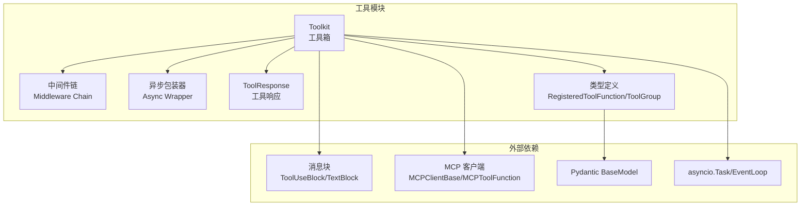
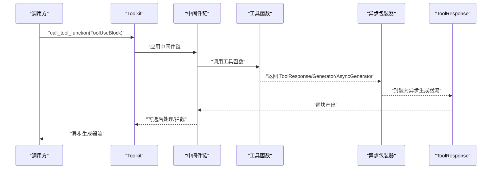
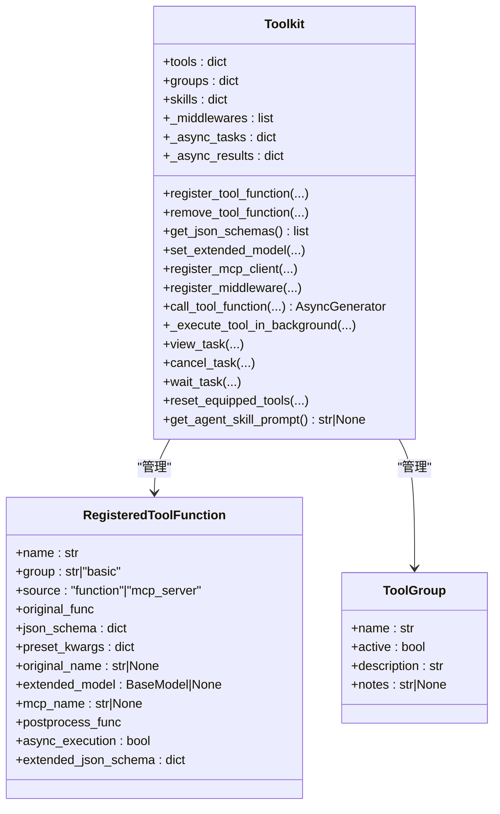
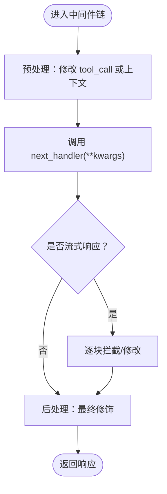
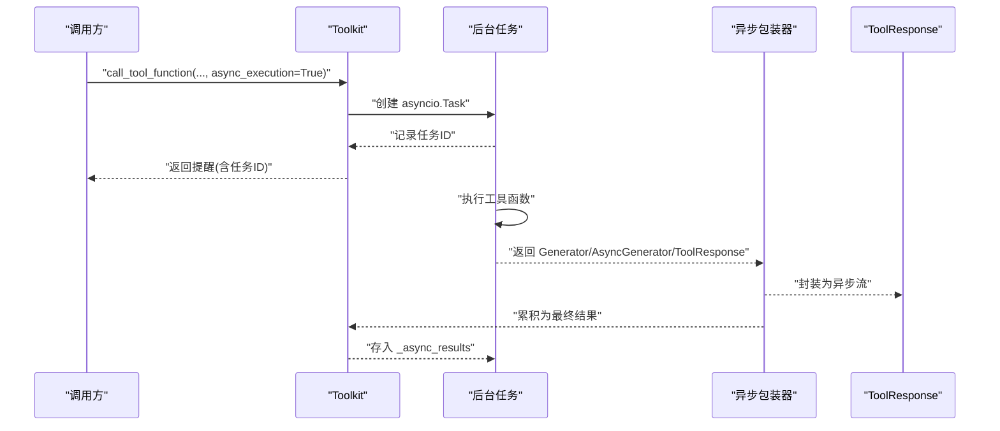
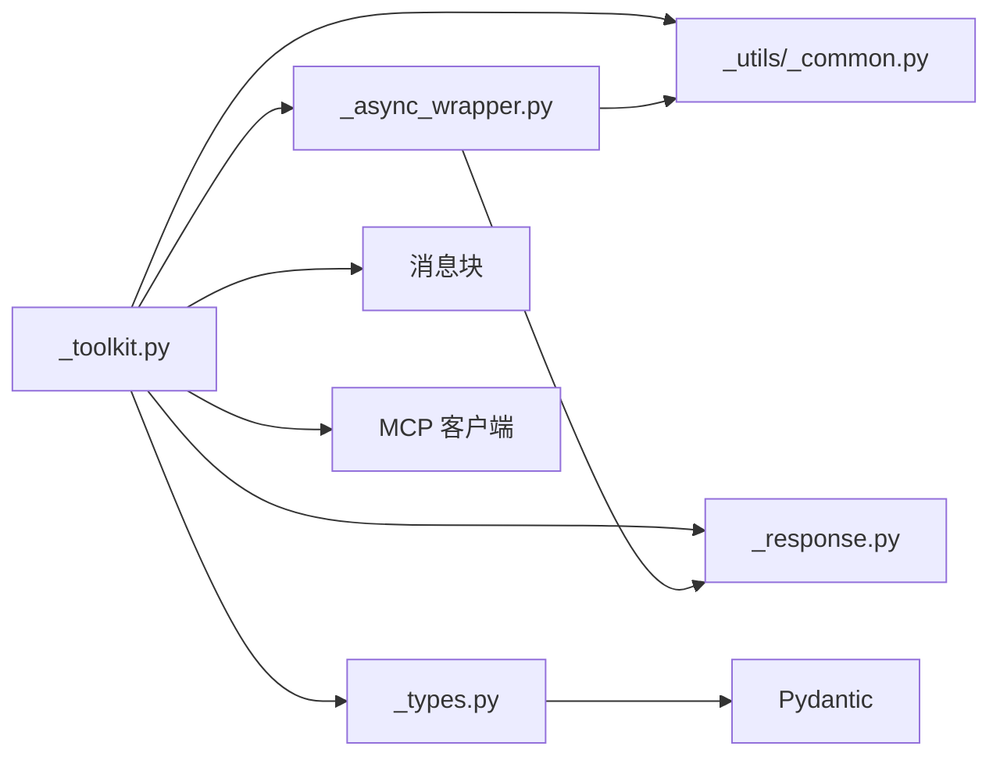

# 工具系统概念

<cite>
**本文引用的文件**
- [tool/_toolkit.py](file://src/agentscope/tool/_toolkit.py)
- [tool/_async_wrapper.py](file://src/agentscope/tool/_async_wrapper.py)
- [tool/_response.py](file://src/agentscope/tool/_response.py)
- [tool/_types.py](file://src/agentscope/tool/_types.py)
- [_utils/_common.py](file://src/agentscope/_utils/_common.py)
- [tool/__init__.py](file://src/agentscope/tool/__init__.py)
- [tests/toolkit_basic_test.py](file://tests/toolkit_basic_test.py)
- [tests/toolkit_middleware_test.py](file://tests/toolkit_middleware_test.py)
- [tests/toolkit_async_execution_test.py](file://tests/toolkit_async_execution_test.py)
</cite>

## 目录
1. [引言](#引言)
2. [项目结构](#项目结构)
3. [核心组件](#核心组件)
4. [架构总览](#架构总览)
5. [详细组件分析](#详细组件分析)
6. [依赖分析](#依赖分析)
7. [性能考虑](#性能考虑)
8. [故障排查指南](#故障排查指南)
9. [结论](#结论)
10. [附录](#附录)

## 引言
本文件面向AgentScope工具系统的核心概念，围绕“工具箱（Toolkit）”、“中间件链（Middleware Chain）”、“异步工具执行（Async Execution）”、“工具响应（ToolResponse）”与“参数验证/类型转换/结果序列化”进行系统化说明。目标是帮助开发者快速理解并正确使用工具注册、工具元数据管理、工具发现、中间件扩展、异步任务管理与统一响应模型。

## 项目结构
工具系统位于src/agentscope/tool目录，主要由以下模块组成：
- 工具箱：负责工具注册、分组、激活控制、MCP客户端集成、中间件注册与执行、异步任务管理与查询。
- 异步包装器：将同步/异步/生成器风格的工具输出统一封装为异步生成器流。
- 响应模型：统一的工具调用返回结构，支持流式与非流式、中断标记与元数据。
- 类型定义：注册工具函数、工具组、代理技能等数据结构。
- 工具导出入口：对外暴露常用工具与工具箱。

图表来源
- [tool/_toolkit.py](file://src/agentscope/tool/_toolkit.py)
- [tool/_async_wrapper.py](file://src/agentscope/tool/_async_wrapper.py)
- [tool/_response.py](file://src/agentscope/tool/_response.py)
- [tool/_types.py](file://src/agentscope/tool/_types.py)

章节来源
- [tool/__init__.py](file://src/agentscope/tool/__init__.py)
- [tool/_toolkit.py](file://src/agentscope/tool/_toolkit.py)

## 核心组件
- 工具箱（Toolkit）
  - 职责：注册/删除工具函数；按组管理与激活控制；从MCP客户端导入工具；注册中间件；统一执行工具并返回流式响应；管理异步任务生命周期。
  - 关键能力：工具函数JSON Schema自动提取与扩展；动态扩展模型合并；工具发现与过滤；异步执行与查询。
- 中间件链（Middleware Chain）
  - 职责：洋葱式包裹工具执行，支持预处理、拦截修改、后处理或跳过执行。
  - 特性：运行时构建链路，支持多层嵌套，保持trace装饰器在外层。
- 异步包装器（Async Wrapper）
  - 职责：将同步/异步/生成器风格的工具输出统一封装为异步生成器；在取消时追加中断信息；对后处理函数进行统一调度。
- 工具响应（ToolResponse）
  - 职责：统一承载工具输出内容（文本/图像/音频/视频块）、元数据、流式标记、是否最后一块、是否被中断、唯一标识。
- 类型定义（RegisteredToolFunction/ToolGroup）
  - 职责：描述已注册工具的元信息、所属组、来源、预设参数、扩展模型、后处理函数、异步执行开关等；工具组包含名称、激活状态、描述与使用提示。

章节来源
- [tool/_toolkit.py](file://src/agentscope/tool/_toolkit.py)
- [tool/_async_wrapper.py](file://src/agentscope/tool/_async_wrapper.py)
- [tool/_response.py](file://src/agentscope/tool/_response.py)
- [tool/_types.py](file://src/agentscope/tool/_types.py)

## 架构总览
下图展示了工具调用从请求到响应的关键路径，包括中间件链、异步包装器与统一响应模型：

图表来源
- [tool/_toolkit.py](file://src/agentscope/tool/_toolkit.py)
- [tool/_async_wrapper.py](file://src/agentscope/tool/_async_wrapper.py)

## 详细组件分析

### 工具箱（Toolkit）设计与实现
- 工具注册机制
  - 支持普通函数、部分应用（partial）与MCP工具函数；自动解析docstring生成JSON Schema；支持手动覆盖名称/描述/Schema。
  - 预设参数（preset_kwargs）从Schema中移除，避免暴露给LLM；支持重名策略（抛错/覆盖/跳过/重命名）。
- 工具元数据管理
  - 注册对象包含：名称、组、来源、原始函数、JSON Schema、预设参数、扩展模型、MCP名称、后处理函数、异步执行开关。
  - 扩展模型通过Pydantic合并参数Schema与$defs，支持嵌套模型复用与冲突检测。
- 工具发现系统
  - 激活组控制：仅激活组内的工具进入Schema；动态更新激活状态；支持“重置工具配备”指令。
  - MCP客户端：批量导入工具函数，支持启用/禁用列表与预设参数映射。
- 中间件注册与执行
  - 运行时构建洋葱链，外层trace装饰器保证可观测性；中间件可预处理输入、拦截/修改响应块、后处理或直接跳过执行。
- 异步工具执行
  - 后台任务池维护进行中与已完成任务；支持查看、等待、取消；流式生成器结果会被累积为单次最终响应。
- 错误处理与异常
  - 工具不存在、组未激活、MCP错误、用户取消、其他异常均转化为标准ToolResponse，确保上层一致性。

图表来源
- [tool/_toolkit.py](file://src/agentscope/tool/_toolkit.py)
- [tool/_types.py](file://src/agentscope/tool/_types.py)

章节来源
- [tool/_toolkit.py](file://src/agentscope/tool/_toolkit.py)
- [tool/_types.py](file://src/agentscope/tool/_types.py)

### 中间件链（Middleware Chain）工作原理
- 设计要点
  - 洋葱模型：内层为原始工具函数，外层为注册的中间件；每个中间件可修改输入、拦截/修改响应块、执行后处理。
  - 动态构建：每次调用时根据实例存储的中间件列表重新组合链路。
  - 取消传播：异步取消会通过包装器在最后一个响应块追加中断信息。
- 典型用途
  - 权限校验（跳过执行）、参数增强（预处理）、响应审计（拦截修改）、日志与追踪（前后处理）。

图表来源
- [tool/_toolkit.py](file://src/agentscope/tool/_toolkit.py)
- [tool/_async_wrapper.py](file://src/agentscope/tool/_async_wrapper.py)

章节来源
- [tool/_toolkit.py](file://src/agentscope/tool/_toolkit.py)
- [tests/toolkit_middleware_test.py](file://tests/toolkit_middleware_test.py)

### 异步工具执行与AsyncWrapper
- 异步包装器
  - 将同步/异步/生成器风格统一为异步生成器；在取消时追加中断信息；对每一块响应执行后处理函数。
- 工具箱异步执行
  - 为开启异步执行的工具创建后台任务；立即返回带任务ID的提醒；支持查看/等待/取消；流式生成器结果会被累积为最终ToolResponse。
- 协程管理
  - 使用asyncio.Task跟踪运行中任务；使用字典保存已完成结果；超时等待使用shield保护；取消通过task.cancel触发。

图表来源
- [tool/_toolkit.py](file://src/agentscope/tool/_toolkit.py)
- [tool/_async_wrapper.py](file://src/agentscope/tool/_async_wrapper.py)

章节来源
- [tool/_toolkit.py](file://src/agentscope/tool/_toolkit.py)
- [tool/_async_wrapper.py](file://src/agentscope/tool/_async_wrapper.py)
- [tests/toolkit_async_execution_test.py](file://tests/toolkit_async_execution_test.py)

### 工具响应（ToolResponse）与错误处理
- 数据结构
  - content：块列表（文本/图像/音频/视频），支持多模态。
  - metadata：供代理内部使用的元数据。
  - stream/is_last/is_interrupted：流式标记与中断标记。
  - id：唯一标识，用于追踪。
- 错误处理
  - 工具不存在、组未激活、MCP错误、用户取消、其他异常均转化为ToolResponse，确保上层一致消费。
  - 取消时在最后块追加系统信息，便于代理感知中断。

章节来源
- [tool/_response.py](file://src/agentscope/tool/_response.py)
- [tool/_async_wrapper.py](file://src/agentscope/tool/_async_wrapper.py)
- [tool/_toolkit.py](file://src/agentscope/tool/_toolkit.py)

### 参数验证、类型转换与结果序列化
- 参数验证与类型转换
  - 通过docstring解析与Pydantic动态模型生成JSON Schema；支持可变参数与关键字参数；自动去除Schema中的title字段以避免误导LLM。
  - 扩展模型合并时检查字段冲突与$defs冲突，支持嵌套模型复用。
- 结果序列化
  - 统一返回ToolResponse；流式生成器会被累积为单次最终响应；后处理函数可同步或异步执行。
- 工具函数签名与返回约束
  - 工具函数必须返回ToolResponse或其异步/同步生成器；否则抛出类型错误。

章节来源
- [_utils/_common.py](file://src/agentscope/_utils/_common.py)
- [tool/_types.py](file://src/agentscope/tool/_types.py)
- [tool/_toolkit.py](file://src/agentscope/tool/_toolkit.py)

## 依赖分析
- 内部依赖
  - Toolkit依赖中间件装饰器、异步包装器、响应模型、类型定义、消息块、MCP客户端、状态模块、追踪装饰器与日志。
  - 异步包装器依赖通用工具（异步/同步函数执行、后处理）、消息块与响应模型。
  - 工具导出入口聚合了常用工具与工具箱。
- 外部依赖
  - Pydantic用于Schema生成与合并。
  - mcp与MCP客户端用于远程工具函数接入。
  - asyncio用于异步任务管理。

图表来源
- [tool/_toolkit.py](file://src/agentscope/tool/_toolkit.py)
- [tool/_async_wrapper.py](file://src/agentscope/tool/_async_wrapper.py)
- [tool/_response.py](file://src/agentscope/tool/_response.py)
- [tool/_types.py](file://src/agentscope/tool/_types.py)
- [_utils/_common.py](file://src/agentscope/_utils/_common.py)

章节来源
- [tool/_toolkit.py](file://src/agentscope/tool/_toolkit.py)
- [tool/_async_wrapper.py](file://src/agentscope/tool/_async_wrapper.py)
- [tool/_types.py](file://src/agentscope/tool/_types.py)
- [_utils/_common.py](file://src/agentscope/_utils/_common.py)

## 性能考虑
- 流式累积
  - 流式生成器在异步执行模式下会被累积为单次最终响应，减少多次往返开销。
- 取消与中断
  - 取消时追加中断信息，避免无效消费；等待超时采用shield保护，防止竞态。
- Schema生成
  - 动态模型生成与Schema合并可能带来额外开销，建议在频繁调用场景缓存或复用已生成Schema。
- 并发与任务池
  - 后台任务池需合理限制并发数量，避免资源耗尽；及时清理已完成任务结果。

## 故障排查指南
- 工具不存在或组未激活
  - 现象：返回错误响应，提示找不到函数或组未激活。
  - 排查：确认工具名拼写、组激活状态、是否被禁用。
- MCP错误
  - 现象：返回包含MCP错误的响应。
  - 排查：检查MCP客户端连接状态与工具可用性。
- 用户取消
  - 现象：在最后一个响应块追加中断信息。
  - 排查：确认取消流程与包装器行为。
- 异步任务问题
  - 现象：查看/等待/取消任务ID无效或超时。
  - 排查：确认任务ID存在、任务状态、等待超时设置。

章节来源
- [tool/_toolkit.py](file://src/agentscope/tool/_toolkit.py)
- [tool/_async_wrapper.py](file://src/agentscope/tool/_async_wrapper.py)
- [tests/toolkit_async_execution_test.py](file://tests/toolkit_async_execution_test.py)

## 结论
AgentScope工具系统通过“工具箱+中间件链+异步包装器+统一响应模型”的设计，实现了工具注册、元数据管理、工具发现、中间件扩展、异步任务管理与统一输出的一体化。该架构既保证了灵活性（可插拔中间件、可扩展Schema、可异步执行），又确保了易用性（统一响应、清晰错误、一致接口）。建议在生产环境中结合实际负载与延迟需求，合理配置异步任务池、等待超时与Schema缓存策略。

## 附录

### 实践示例（代码片段路径）
- 注册自定义工具
  - [tests/toolkit_basic_test.py](file://tests/toolkit_basic_test.py)
- 配置工具中间件
  - [tests/toolkit_middleware_test.py](file://tests/toolkit_middleware_test.py)
- 处理工具调用异常
  - [tests/toolkit_basic_test.py](file://tests/toolkit_basic_test.py)
  - [tests/toolkit_async_execution_test.py](file://tests/toolkit_async_execution_test.py)