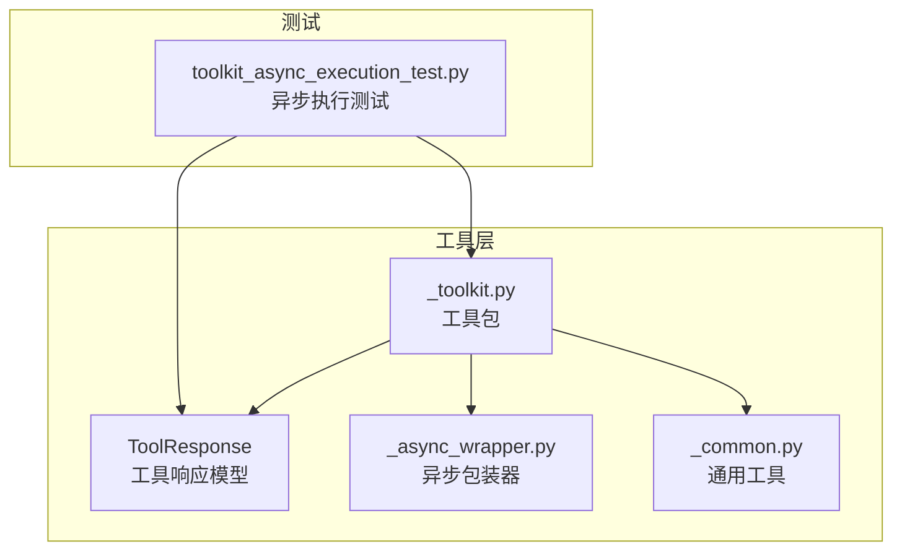
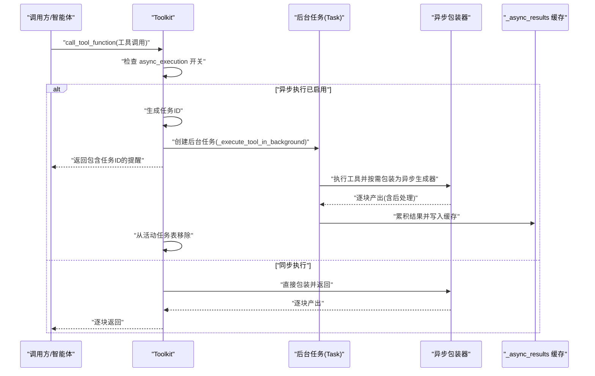
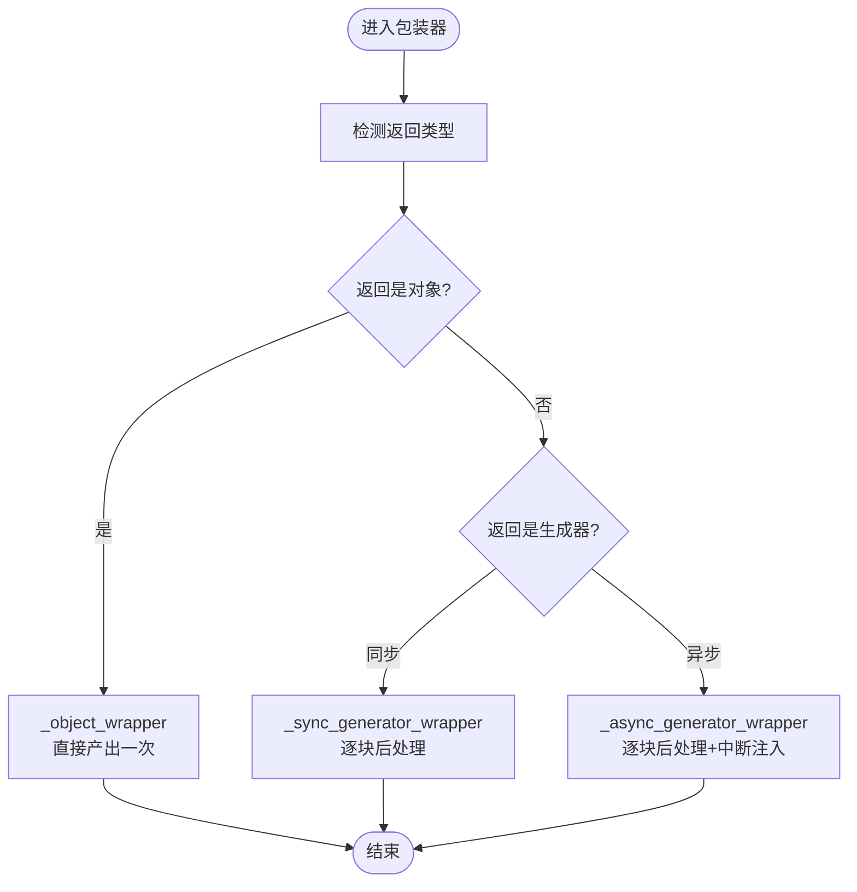
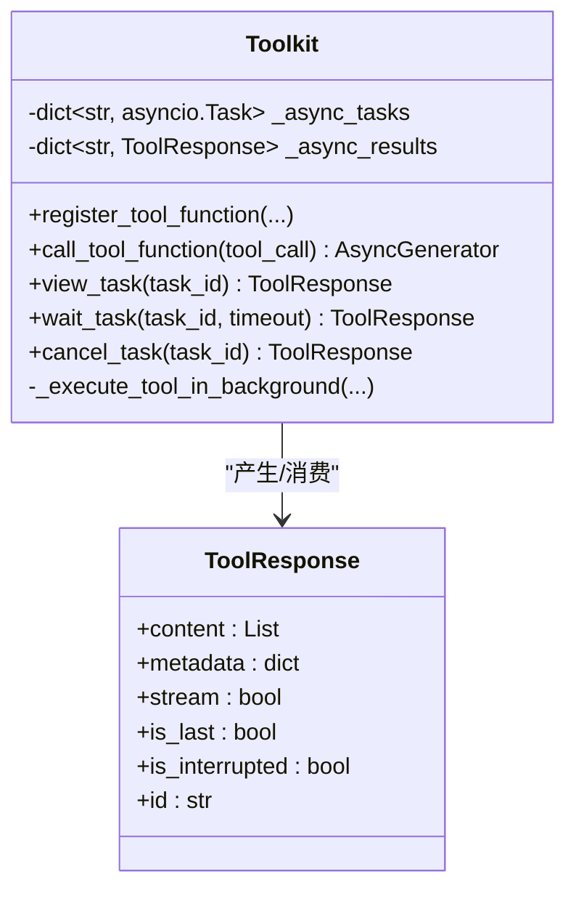
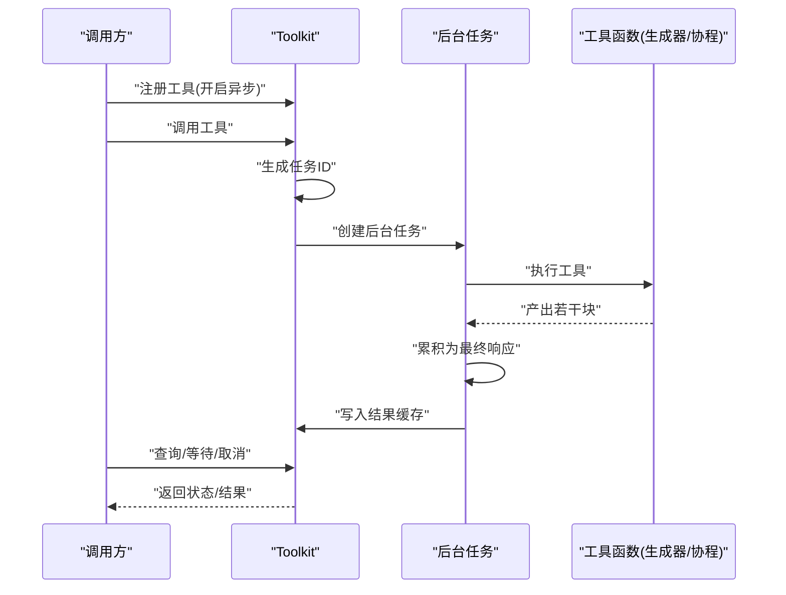
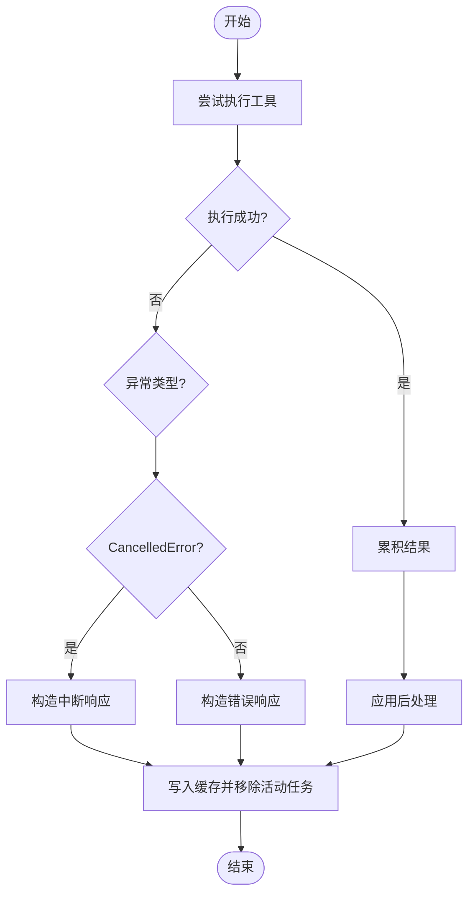
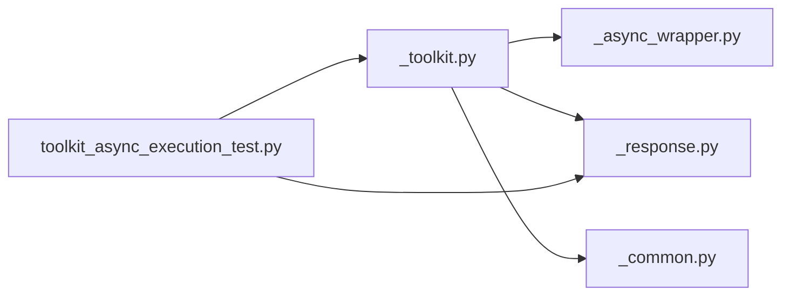

# 异步执行机制

<cite>
**本文引用的文件**
- [src/agentscope/tool/_async_wrapper.py](file://src/agentscope/tool/_async_wrapper.py)
- [src/agentscope/tool/_toolkit.py](file://src/agentscope/tool/_toolkit.py)
- [src/agentscope/tool/_response.py](file://src/agentscope/tool/_response.py)
- [src/agentscope/_utils/_common.py](file://src/agentscope/_utils/_common.py)
- [tests/toolkit_async_execution_test.py](file://tests/toolkit_async_execution_test.py)
</cite>

## 目录
1. [引言](#引言)
2. [项目结构](#项目结构)
3. [核心组件](#核心组件)
4. [架构总览](#架构总览)
5. [详细组件分析](#详细组件分析)
6. [依赖分析](#依赖分析)
7. [性能考量](#性能考量)
8. [故障排查指南](#故障排查指南)
9. [结论](#结论)
10. [附录：使用示例与最佳实践](#附录使用示例与最佳实践)

## 引言
本文件系统性阐述 AgentScope 的异步执行机制，重点围绕以下目标展开：
- 解释 AsyncWrapper 的设计理念与实现原理，覆盖 _object_wrapper、_sync_generator_wrapper、_async_generator_wrapper 三类包装器的适用场景与差异。
- 阐述异步任务的管理机制：任务 ID 生成、任务状态跟踪、结果缓存与消费。
- 描述异步工具执行的生命周期：从任务创建、后台执行、结果累积到最终返回。
- 说明异步任务的取消与中断处理：用户主动取消与异常中断的路径与行为。
- 对比异步与同步执行的差异与性能影响，并给出在多智能体环境中的应用建议与最佳实践。

## 项目结构
与异步执行相关的核心文件与职责如下：
- 工具响应模型：定义统一的 ToolResponse 数据结构，承载内容块、元数据、流式标记、是否中断、是否最后一条、以及唯一标识。
- 异步包装器：将对象、同步生成器、异步生成器统一封装为异步生成器，支持后处理函数。
- 工具包 Toolkit：注册工具、解析调用、调度同步/异步执行、管理异步任务（存储、查询、等待、取消）。
- 通用工具：判断函数类型、同步/异步执行分发等。
- 测试用例：验证异步任务的状态查看、等待完成、超时、取消、结果累积等行为。

图表来源
- [src/agentscope/tool/_response.py:11-33](file://src/agentscope/tool/_response.py#L11-L33)
- [src/agentscope/tool/_async_wrapper.py:16-110](file://src/agentscope/tool/_async_wrapper.py#L16-L110)
- [src/agentscope/tool/_toolkit.py:117-186](file://src/agentscope/tool/_toolkit.py#L117-L186)
- [src/agentscope/_utils/_common.py:106-157](file://src/agentscope/_utils/_common.py#L106-L157)
- [tests/toolkit_async_execution_test.py:19-96](file://tests/toolkit_async_execution_test.py#L19-L96)

章节来源
- [src/agentscope/tool/_response.py:11-33](file://src/agentscope/tool/_response.py#L11-L33)
- [src/agentscope/tool/_async_wrapper.py:16-110](file://src/agentscope/tool/_async_wrapper.py#L16-L110)
- [src/agentscope/tool/_toolkit.py:117-186](file://src/agentscope/tool/_toolkit.py#L117-L186)
- [src/agentscope/_utils/_common.py:106-157](file://src/agentscope/_utils/_common.py#L106-L157)
- [tests/toolkit_async_execution_test.py:19-96](file://tests/toolkit_async_execution_test.py#L19-L96)

## 核心组件
- 工具响应模型 ToolResponse：统一承载文本、图片、音频、视频等多模态内容块；支持流式标记、是否中断、是否最后一条、以及唯一标识。
- 异步包装器：
  - _object_wrapper：将单个 ToolResponse 封装为异步生成器，便于统一处理。
  - _sync_generator_wrapper：将同步生成器逐块产出并应用后处理，再封装为异步生成器。
  - _async_generator_wrapper：对异步生成器进行逐块产出、后处理与中断信息注入，确保在用户取消时能返回“被中断”的提示。
- 工具包 Toolkit：
  - 注册工具函数时可启用 async_execution，使该工具以异步模式运行。
  - 调用工具时若开启异步，会生成任务 ID 并创建后台任务，立即返回包含任务 ID 的提醒；后续可通过 view_task/wait_task/cancel_task 等接口查询、等待或取消。
  - 后台执行完成后，结果被累积并缓存至 _async_results，供一次性消费。
- 通用工具：
  - _is_async_func：判断函数是否为异步（协程函数、异步生成器、协程对象等）。
  - _execute_async_or_sync_func：根据函数类型自动选择同步或异步执行。

章节来源
- [src/agentscope/tool/_response.py:11-33](file://src/agentscope/tool/_response.py#L11-L33)
- [src/agentscope/tool/_async_wrapper.py:16-110](file://src/agentscope/tool/_async_wrapper.py#L16-L110)
- [src/agentscope/tool/_toolkit.py:117-186](file://src/agentscope/tool/_toolkit.py#L117-L186)
- [src/agentscope/_utils/_common.py:106-157](file://src/agentscope/_utils/_common.py#L106-L157)

## 架构总览
下图展示了异步执行从触发到结果返回的端到端流程，包括任务创建、后台执行、结果累积与消费。

图表来源
- [src/agentscope/tool/_toolkit.py:932-968](file://src/agentscope/tool/_toolkit.py#L932-L968)
- [src/agentscope/tool/_toolkit.py:685-849](file://src/agentscope/tool/_toolkit.py#L685-L849)
- [src/agentscope/tool/_async_wrapper.py:38-110](file://src/agentscope/tool/_async_wrapper.py#L38-L110)

## 详细组件分析

### 组件一：异步包装器（AsyncWrapper）
- 设计理念
  - 统一输出接口：将不同类型的工具返回值（对象、同步生成器、异步生成器）转换为一致的异步生成器，便于上层统一消费。
  - 后处理兼容：支持同步或异步的后处理函数，保证在任何情况下都能正确应用。
  - 中断感知：对异步生成器在取消时追加“被中断”提示，避免静默失败。
- 三类包装器的使用场景
  - _object_wrapper：适用于非流式的单次返回，快速封装为异步生成器。
  - _sync_generator_wrapper：适用于需要逐步产出的同步生成器，逐块应用后处理。
  - _async_generator_wrapper：适用于异步生成器，逐块产出并处理取消异常，必要时注入中断提示。
- 关键实现要点
  - _postprocess_tool_response：统一调用后处理函数，兼容同步/异步。
  - _async_generator_wrapper：捕获取消异常，向最后一个块追加中断信息并延迟抛出取消，确保调用方可感知中断。

图表来源
- [src/agentscope/tool/_async_wrapper.py:16-110](file://src/agentscope/tool/_async_wrapper.py#L16-L110)

章节来源
- [src/agentscope/tool/_async_wrapper.py:16-110](file://src/agentscope/tool/_async_wrapper.py#L16-L110)

### 组件二：工具包 Toolkit 的异步任务管理
- 任务 ID 生成
  - 使用短 UUID 生成全局唯一的任务 ID，确保并发安全与可追踪性。
- 任务状态跟踪
  - 活动任务表：_async_tasks 存储任务 ID 到 asyncio.Task 的映射，用于查询、等待与取消。
  - 结果缓存：_async_results 存储任务 ID 到最终 ToolResponse 的映射，供一次性消费。
- 生命周期管理
  - 创建：当工具函数注册时开启 async_execution，调用时生成任务 ID 并创建后台任务。
  - 执行：后台任务统一处理同步/异步、生成器、错误与取消，累积结果。
  - 完成：将最终结果写入缓存并从活动任务表移除。
- 查询与控制接口
  - view_task：若仍在运行返回“仍运行”，否则返回结果并消费缓存。
  - wait_task：在超时前等待任务完成，返回结果或“仍运行”提示。
  - cancel_task：取消活动任务，若已完成则提示“已结束”。

图表来源
- [src/agentscope/tool/_toolkit.py:117-186](file://src/agentscope/tool/_toolkit.py#L117-L186)
- [src/agentscope/tool/_response.py:11-33](file://src/agentscope/tool/_response.py#L11-L33)

章节来源
- [src/agentscope/tool/_toolkit.py:117-186](file://src/agentscope/tool/_toolkit.py#L117-L186)
- [src/agentscope/tool/_toolkit.py:685-849](file://src/agentscope/tool/_toolkit.py#L685-L849)
- [src/agentscope/tool/_toolkit.py:1541-1684](file://src/agentscope/tool/_toolkit.py#L1541-L1684)

### 组件三：异步工具执行的生命周期
- 触发阶段
  - 注册工具时设置 async_execution=True。
  - 调用工具时生成任务 ID，创建后台任务，立即返回包含任务 ID 的提醒。
- 执行阶段
  - 后台任务根据函数类型选择执行路径：协程函数、异步生成器、同步生成器或普通对象。
  - 对于生成器类型，逐块累积内容，最终合并为单个 ToolResponse。
- 完成阶段
  - 将最终结果写入 _async_results，从 _async_tasks 移除。
  - 调用方通过 view_task 或 wait_task 获取结果；wait_task 支持超时控制。

图表来源
- [src/agentscope/tool/_toolkit.py:932-968](file://src/agentscope/tool/_toolkit.py#L932-L968)
- [src/agentscope/tool/_toolkit.py:685-849](file://src/agentscope/tool/_toolkit.py#L685-L849)

章节来源
- [src/agentscope/tool/_toolkit.py:932-968](file://src/agentscope/tool/_toolkit.py#L932-L968)
- [src/agentscope/tool/_toolkit.py:685-849](file://src/agentscope/tool/_toolkit.py#L685-L849)

### 组件四：取消与中断处理
- 用户主动取消
  - 通过 cancel_task 取消活动任务；若任务已完成则提示“已结束”。
  - 取消时后台任务捕获取消异常，构造“被中断”的 ToolResponse 并写入缓存。
- 异常中断
  - 任何未捕获异常都会导致最终结果包含错误信息。
  - 对于异步生成器，若在生成过程中被取消，会在最后一个块追加中断提示并延迟抛出取消，确保调用方可感知。

图表来源
- [src/agentscope/tool/_toolkit.py:819-843](file://src/agentscope/tool/_toolkit.py#L819-L843)
- [src/agentscope/tool/_async_wrapper.py:75-110](file://src/agentscope/tool/_async_wrapper.py#L75-L110)

章节来源
- [src/agentscope/tool/_toolkit.py:819-843](file://src/agentscope/tool/_toolkit.py#L819-L843)
- [src/agentscope/tool/_async_wrapper.py:75-110](file://src/agentscope/tool/_async_wrapper.py#L75-L110)

## 依赖分析
- Toolkit 依赖
  - 异步包装器：用于统一输出格式与后处理。
  - 工具响应模型：作为所有工具输出的统一载体。
  - 通用工具：用于判断函数类型与同步/异步执行分发。
- 测试依赖
  - 通过测试用例验证异步任务的生命周期、状态查询、等待与取消、结果累积等行为。

图表来源
- [src/agentscope/tool/_toolkit.py:117-186](file://src/agentscope/tool/_toolkit.py#L117-L186)
- [src/agentscope/tool/_async_wrapper.py:16-110](file://src/agentscope/tool/_async_wrapper.py#L16-L110)
- [src/agentscope/tool/_response.py:11-33](file://src/agentscope/tool/_response.py#L11-L33)
- [src/agentscope/_utils/_common.py:106-157](file://src/agentscope/_utils/_common.py#L106-L157)
- [tests/toolkit_async_execution_test.py:19-96](file://tests/toolkit_async_execution_test.py#L19-L96)

章节来源
- [src/agentscope/tool/_toolkit.py:117-186](file://src/agentscope/tool/_toolkit.py#L117-L186)
- [src/agentscope/tool/_async_wrapper.py:16-110](file://src/agentscope/tool/_async_wrapper.py#L16-L110)
- [src/agentscope/tool/_response.py:11-33](file://src/agentscope/tool/_response.py#L11-L33)
- [src/agentscope/_utils/_common.py:106-157](file://src/agentscope/_utils/_common.py#L106-L157)
- [tests/toolkit_async_execution_test.py:19-96](file://tests/toolkit_async_execution_test.py#L19-L96)

## 性能考量
- 异步优势
  - 非阻塞：长耗时任务在后台执行，主线程不被阻塞，提升交互体验。
  - 流式聚合：异步生成器可边产出边累积，减少中间状态开销。
- 成本与注意
  - 上下文切换：频繁的事件循环切换可能带来额外开销，应避免过度细粒度的生成器块。
  - 内存占用：累积所有块到最终响应会增加内存压力，需权衡实时性与资源消耗。
  - 取消成本：取消操作需要等待后台任务清理并写入中断响应，合理设置超时与重试策略。
- 最佳实践
  - 大任务优先采用异步执行，配合 view_task/wait_task/cancel_task 进行可观测与可控。
  - 对于短小任务，同步执行更简单直接；仅在确有必要时启用异步。
  - 在多智能体环境中，建议为每个智能体维护独立的 Toolkit 实例，避免共享状态带来的竞态。

## 故障排查指南
- 常见问题与定位
  - 任务 ID 无效：检查是否在 _async_tasks 或 _async_results 中存在；不存在时会返回“无效任务 ID”错误。
  - 任务仍在运行：使用 view_task 查看状态；使用 wait_task 设置合理超时。
  - 取消失败：确认任务是否已完成；已完成的任务无法取消。
  - 结果未出现：确认是否已消费缓存；view_task 会一次性返回并移除结果。
- 关键检查点
  - 异步包装器是否正确应用后处理函数。
  - 后台任务是否在 finally 分支中写入缓存并移除活动任务。
  - 取消异常是否被捕获并构造中断响应。

章节来源
- [src/agentscope/tool/_toolkit.py:1541-1684](file://src/agentscope/tool/_toolkit.py#L1541-L1684)
- [src/agentscope/tool/_async_wrapper.py:75-110](file://src/agentscope/tool/_async_wrapper.py#L75-L110)
- [tests/toolkit_async_execution_test.py:102-175](file://tests/toolkit_async_execution_test.py#L102-L175)

## 结论
AgentScope 的异步执行机制通过统一的异步包装器与 Toolkit 的任务管理，实现了对多种工具返回类型的无缝适配与可观测的生命周期控制。借助任务 ID、状态查询、等待与取消接口，开发者可以在复杂工作流中可靠地管理长耗时任务。结合后处理与中断注入，系统在保证一致性的同时提升了用户体验与鲁棒性。

## 附录：使用示例与最佳实践
- 实现异步工具函数
  - 协程函数：直接返回 ToolResponse，或返回异步生成器。
  - 异步生成器：逐块产出 ToolResponse，最终 is_last=True。
  - 同步生成器：逐块产出 ToolResponse，Toolkit 会累积为单个响应。
- 示例参考
  - 测试用例提供了慢速协程与慢速异步生成器的示例，可参考其注册与调用方式。
- 多智能体环境建议
  - 为每个智能体实例化独立的 Toolkit，避免跨智能体的共享状态干扰。
  - 对外部服务调用采用异步执行并设置合理的超时与重试策略。
  - 使用后处理函数对响应进行标准化，便于上层统一消费。

章节来源
- [tests/toolkit_async_execution_test.py:19-96](file://tests/toolkit_async_execution_test.py#L19-L96)
- [src/agentscope/tool/_toolkit.py:932-968](file://src/agentscope/tool/_toolkit.py#L932-L968)
- [src/agentscope/tool/_toolkit.py:685-849](file://src/agentscope/tool/_toolkit.py#L685-L849)