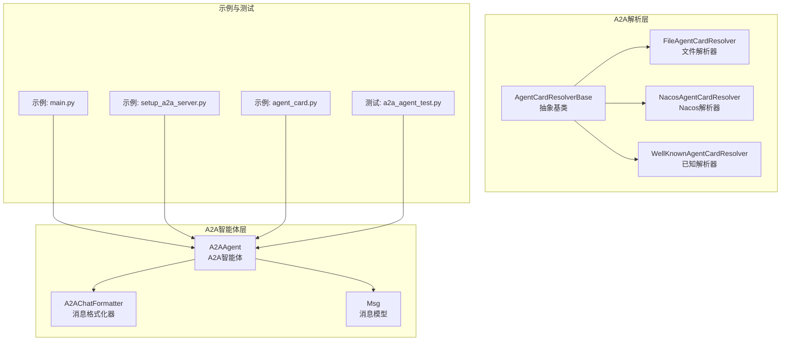
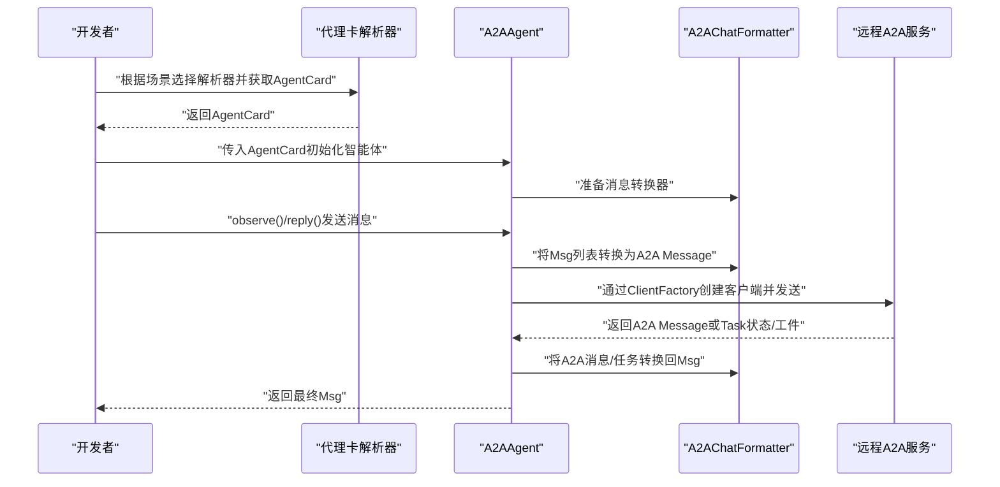
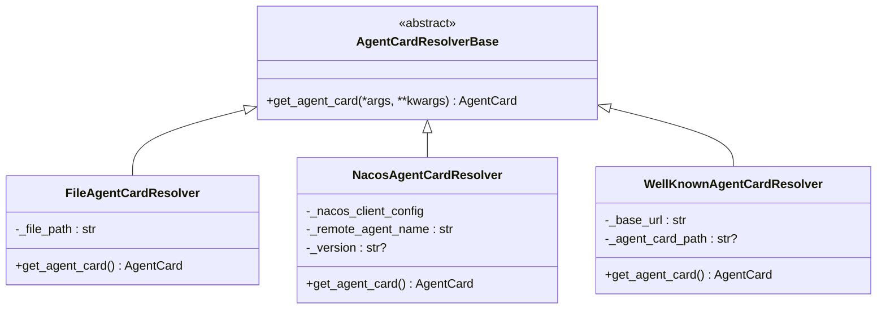
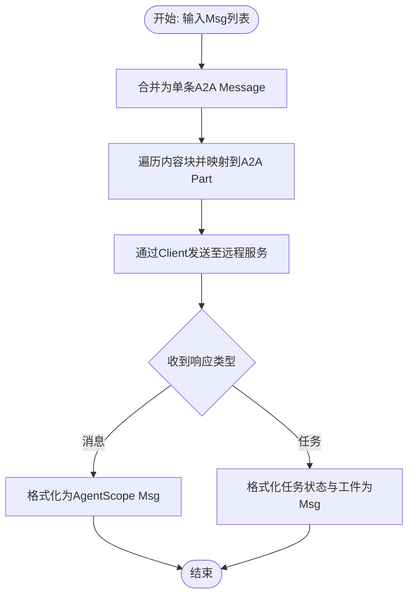
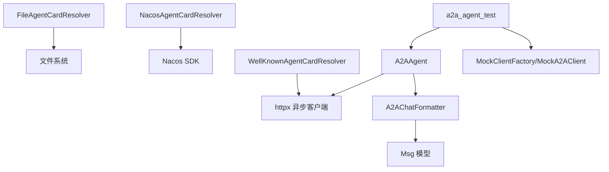

# A2A智能体概念

<cite>
**本文引用的文件**
- [src/agentscope/a2a/__init__.py](file://src/agentscope/a2a/__init__.py)
- [src/agentscope/a2a/_base.py](file://src/agentscope/a2a/_base.py)
- [src/agentscope/a2a/_file_resolver.py](file://src/agentscope/a2a/_file_resolver.py)
- [src/agentscope/a2a/_nacos_resolver.py](file://src/agentscope/a2a/_nacos_resolver.py)
- [src/agentscope/a2a/_well_known_resolver.py](file://src/agentscope/a2a/_well_known_resolver.py)
- [src/agentscope/agent/_a2a_agent.py](file://src/agentscope/agent/_a2a_agent.py)
- [src/agentscope/formatter/_a2a_formatter.py](file://src/agentscope/formatter/_a2a_formatter.py)
- [src/agentscope/message/_message_base.py](file://src/agentscope/message/_message_base.py)
- [src/agentscope/formatter/_formatter_base.py](file://src/agentscope/formatter/_formatter_base.py)
- [examples/agent/a2a_agent/main.py](file://examples/agent/a2a_agent/main.py)
- [examples/agent/a2a_agent/setup_a2a_server.py](file://examples/agent/a2a_agent/setup_a2a_server.py)
- [examples/agent/a2a_agent/agent_card.py](file://examples/agent/a2a_agent/agent_card.py)
- [tests/a2a_agent_test.py](file://tests/a2a_agent_test.py)
</cite>

## 目录
1. [引言](#引言)
2. [项目结构](#项目结构)
3. [核心组件](#核心组件)
4. [架构总览](#架构总览)
5. [详细组件分析](#详细组件分析)
6. [依赖分析](#依赖分析)
7. [性能考虑](#性能考虑)
8. [故障排查指南](#故障排查指南)
9. [结论](#结论)
10. [附录](#附录)

## 引言
本文件面向希望在AgentScope中使用A2A（Agent-to-Agent）协议进行智能体间通信的开发者与使用者，系统性阐述A2A智能体的概念、设计理念、服务发现与解析机制、消息路由与传输、连接管理以及与传统智能体的差异。同时提供可直接定位到源码的路径指引，帮助快速上手A2A智能体的创建、配置与通信流程。

## 项目结构
围绕A2A能力，AgentScope在以下模块组织了核心能力：
- a2a：A2A代理卡解析器体系，支持从文件、Nacos、已知URL解析代理卡
- agent：A2A智能体实现，负责与远程A2A服务交互、消息转换与任务状态处理
- formatter：A2A消息格式化器，负责AgentScope消息与A2A消息双向转换
- message：通用消息模型，作为A2A消息转换的载体
- examples：A2A智能体示例，包含客户端与服务端样例
- tests：A2A智能体单元测试，覆盖消息合并、任务响应、观察消息等行为

图表来源
- [src/agentscope/a2a/_base.py:12-26](file://src/agentscope/a2a/_base.py#L12-L26)
- [src/agentscope/a2a/_file_resolver.py:15-79](file://src/agentscope/a2a/_file_resolver.py#L15-L79)
- [src/agentscope/a2a/_nacos_resolver.py:17-99](file://src/agentscope/a2a/_nacos_resolver.py#L17-L99)
- [src/agentscope/a2a/_well_known_resolver.py:15-91](file://src/agentscope/a2a/_well_known_resolver.py#L15-L91)
- [src/agentscope/agent/_a2a_agent.py:29-289](file://src/agentscope/agent/_a2a_agent.py#L29-L289)
- [src/agentscope/formatter/_a2a_formatter.py:31-365](file://src/agentscope/formatter/_a2a_formatter.py#L31-L365)
- [src/agentscope/message/_message_base.py:21-242](file://src/agentscope/message/_message_base.py#L21-L242)
- [examples/agent/a2a_agent/main.py:10-28](file://examples/agent/a2a_agent/main.py#L10-L28)
- [examples/agent/a2a_agent/setup_a2a_server.py:31-131](file://examples/agent/a2a_agent/setup_a2a_server.py#L31-L131)
- [examples/agent/a2a_agent/agent_card.py:5-38](file://examples/agent/a2a_agent/agent_card.py#L5-L38)
- [tests/a2a_agent_test.py:103-254](file://tests/a2a_agent_test.py#L103-L254)

章节来源
- [src/agentscope/a2a/__init__.py:1-15](file://src/agentscope/a2a/__init__.py#L1-L15)
- [src/agentscope/a2a/_base.py:12-26](file://src/agentscope/a2a/_base.py#L12-L26)
- [src/agentscope/agent/_a2a_agent.py:29-113](file://src/agentscope/agent/_a2a_agent.py#L29-L113)
- [src/agentscope/formatter/_a2a_formatter.py:31-146](file://src/agentscope/formatter/_a2a_formatter.py#L31-L146)
- [src/agentscope/message/_message_base.py:21-100](file://src/agentscope/message/_message_base.py#L21-L100)

## 核心组件
- A2A代理卡解析器体系
  - 抽象基类：定义统一的异步获取代理卡接口
  - 文件解析器：从本地JSON文件加载代理卡
  - Nacos解析器：从Nacos服务动态拉取代理卡并订阅变更
  - 已知解析器：从标准well-known路径或自定义路径解析代理卡
- A2A智能体
  - 负责与远程A2A服务通信，支持双向消息转换、任务状态流式推送、工件处理与观察消息合并
  - 不支持结构化输出（因A2A协议限制）
- A2A消息格式化器
  - 将AgentScope消息转换为A2A消息（单请求合并为一条用户消息）
  - 将A2A消息与任务回推转换为AgentScope消息，支持多块内容合并
- 通用消息模型
  - 统一承载文本、工具调用/结果、多媒体等多模态内容块

章节来源
- [src/agentscope/a2a/_base.py:12-26](file://src/agentscope/a2a/_base.py#L12-L26)
- [src/agentscope/a2a/_file_resolver.py:15-79](file://src/agentscope/a2a/_file_resolver.py#L15-L79)
- [src/agentscope/a2a/_nacos_resolver.py:17-99](file://src/agentscope/a2a/_nacos_resolver.py#L17-L99)
- [src/agentscope/a2a/_well_known_resolver.py:15-91](file://src/agentscope/a2a/_well_known_resolver.py#L15-L91)
- [src/agentscope/agent/_a2a_agent.py:29-289](file://src/agentscope/agent/_a2a_agent.py#L29-L289)
- [src/agentscope/formatter/_a2a_formatter.py:31-365](file://src/agentscope/formatter/_a2a_formatter.py#L31-L365)
- [src/agentscope/message/_message_base.py:21-242](file://src/agentscope/message/_message_base.py#L21-L242)

## 架构总览
下图展示了A2A智能体从“服务发现/解析”到“消息转换与传输”的整体流程。

图表来源
- [src/agentscope/a2a/_file_resolver.py:58-79](file://src/agentscope/a2a/_file_resolver.py#L58-L79)
- [src/agentscope/a2a/_nacos_resolver.py:59-99](file://src/agentscope/a2a/_nacos_resolver.py#L59-L99)
- [src/agentscope/a2a/_well_known_resolver.py:35-91](file://src/agentscope/a2a/_well_known_resolver.py#L35-L91)
- [src/agentscope/agent/_a2a_agent.py:177-261](file://src/agentscope/agent/_a2a_agent.py#L177-L261)
- [src/agentscope/formatter/_a2a_formatter.py:147-272](file://src/agentscope/formatter/_a2a_formatter.py#L147-L272)

## 详细组件分析

### 服务发现与解析机制
- 文件解析器
  - 从本地JSON文件读取AgentCard，校验文件存在性与类型，使用模型校验后返回
  - 典型使用场景：开发调试、离线环境、固定配置
- Nacos解析器
  - 基于Nacos AI服务动态获取AgentCard，支持版本选择与客户端生命周期管理
  - 典型使用场景：生产级动态服务发现、灰度发布、配置热更新
- 已知解析器
  - 从well-known路径或自定义相对路径解析AgentCard，内部使用HTTP客户端与A2A卡解析器
  - 典型使用场景：标准化服务暴露、跨域/跨平台互操作

图表来源
- [src/agentscope/a2a/_base.py:12-26](file://src/agentscope/a2a/_base.py#L12-L26)
- [src/agentscope/a2a/_file_resolver.py:15-79](file://src/agentscope/a2a/_file_resolver.py#L15-L79)
- [src/agentscope/a2a/_nacos_resolver.py:17-99](file://src/agentscope/a2a/_nacos_resolver.py#L17-L99)
- [src/agentscope/a2a/_well_known_resolver.py:15-91](file://src/agentscope/a2a/_well_known_resolver.py#L15-L91)

章节来源
- [src/agentscope/a2a/_file_resolver.py:15-79](file://src/agentscope/a2a/_file_resolver.py#L15-L79)
- [src/agentscope/a2a/_nacos_resolver.py:17-99](file://src/agentscope/a2a/_nacos_resolver.py#L17-L99)
- [src/agentscope/a2a/_well_known_resolver.py:15-91](file://src/agentscope/a2a/_well_known_resolver.py#L15-L91)

### 消息路由与传输机制
- 消息格式与转换
  - A2A协议要求每次请求仅含一条消息；多条AgentScope消息会被合并为一条A2A Message（角色为用户）
  - 支持文本、图片/视频/音频（URL或Base64）、工具调用/结果等多模态内容块
  - 远程返回可能为纯消息或任务（含状态消息与工件），格式化器会将其合并为AgentScope消息
- 序列化与反序列化
  - 使用模型校验与序列化机制保证数据一致性
  - 工具结果与多模态内容块在转换时进行本地保存与路径替换，便于后续展示
- 流式与轮询
  - A2A智能体支持流式事件推送与最终完成事件，格式化器按最后一条完整消息生成响应

图表来源
- [src/agentscope/formatter/_a2a_formatter.py:35-146](file://src/agentscope/formatter/_a2a_formatter.py#L35-L146)
- [src/agentscope/formatter/_a2a_formatter.py:147-272](file://src/agentscope/formatter/_a2a_formatter.py#L147-L272)
- [src/agentscope/formatter/_formatter_base.py:19-130](file://src/agentscope/formatter/_formatter_base.py#L19-L130)

章节来源
- [src/agentscope/formatter/_a2a_formatter.py:31-365](file://src/agentscope/formatter/_a2a_formatter.py#L31-L365)
- [src/agentscope/formatter/_formatter_base.py:11-130](file://src/agentscope/formatter/_formatter_base.py#L11-L130)

### 连接管理
- 客户端工厂与传输生产者
  - A2A智能体通过ClientFactory创建客户端，支持注册额外传输生产者以扩展协议
  - 默认使用异步HTTP客户端，具备超时控制
- 生命周期与资源释放
  - Nacos解析器在使用后尝试关闭客户端，避免资源泄漏
- 观察消息与状态持久化
  - A2A智能体内部维护观察消息队列，在reply后清空，支持状态字典的序列化/反序列化

章节来源
- [src/agentscope/agent/_a2a_agent.py:48-113](file://src/agentscope/agent/_a2a_agent.py#L48-L113)
- [src/agentscope/agent/_a2a_agent.py:114-153](file://src/agentscope/agent/_a2a_agent.py#L114-L153)
- [src/agentscope/a2a/_nacos_resolver.py:89-99](file://src/agentscope/a2a/_nacos_resolver.py#L89-L99)

### 与传统智能体的区别
- 通信方式
  - A2A智能体基于A2A协议与远程服务通信，强调标准互操作与服务发现
  - 传统智能体通常在同一进程内协作，通过内置管道或共享内存交互
- 性能特点
  - A2A智能体受网络延迟与远程服务吞吐影响，适合长链路、跨边界场景
  - 传统智能体在本地执行，延迟更低，适合高并发、低延迟场景
- 适用场景
  - A2A智能体适用于需要标准化协议、动态服务发现、跨语言/跨平台集成的场景
  - 传统智能体适用于紧密耦合、高性能、低延迟的本地工作流

章节来源
- [src/agentscope/agent/_a2a_agent.py:29-46](file://src/agentscope/agent/_a2a_agent.py#L29-L46)

### 代码示例与实践指引
- 创建A2A智能体
  - 使用代理卡初始化A2A智能体，可选传入客户端配置、消费者与额外传输生产者
  - 参考路径：[初始化与配置:48-113](file://src/agentscope/agent/_a2a_agent.py#L48-L113)
- 服务端示例（ReAct Agent提供A2A服务）
  - 启动A2A服务端应用，注册工具，处理流式事件，保存会话状态
  - 参考路径：[服务端示例:31-131](file://examples/agent/a2a_agent/setup_a2a_server.py#L31-L131)
- 客户端示例（用户与A2A智能体对话）
  - 用户Agent与A2A智能体循环对话，支持退出条件
  - 参考路径：[客户端示例:10-28](file://examples/agent/a2a_agent/main.py#L10-L28)
- 代理卡定义
  - 定义名称、URL、能力、默认输入/输出模式与技能清单
  - 参考路径：[代理卡定义:5-38](file://examples/agent/a2a_agent/agent_card.py#L5-L38)
- 单元测试要点
  - 验证任务响应合并、观察消息合并、无消息时的提示消息、错误处理
  - 参考路径：[单元测试:103-254](file://tests/a2a_agent_test.py#L103-L254)

章节来源
- [examples/agent/a2a_agent/main.py:10-28](file://examples/agent/a2a_agent/main.py#L10-L28)
- [examples/agent/a2a_agent/setup_a2a_server.py:31-131](file://examples/agent/a2a_agent/setup_a2a_server.py#L31-L131)
- [examples/agent/a2a_agent/agent_card.py:5-38](file://examples/agent/a2a_agent/agent_card.py#L5-L38)
- [tests/a2a_agent_test.py:103-254](file://tests/a2a_agent_test.py#L103-L254)

## 依赖分析
- 解析器依赖
  - 文件解析器依赖文件系统与JSON解析
  - Nacos解析器依赖Nacos SDK与异步客户端生命周期管理
  - 已知解析器依赖HTTP客户端与A2A卡解析器
- 智能体依赖
  - A2A智能体依赖消息格式化器、HTTP客户端工厂与A2A类型
- 测试依赖
  - 单元测试通过Mock客户端工厂与客户端模拟不同响应类型

图表来源
- [src/agentscope/a2a/_file_resolver.py:67-79](file://src/agentscope/a2a/_file_resolver.py#L67-L79)
- [src/agentscope/a2a/_nacos_resolver.py:66-99](file://src/agentscope/a2a/_nacos_resolver.py#L66-L99)
- [src/agentscope/a2a/_well_known_resolver.py:69-91](file://src/agentscope/a2a/_well_known_resolver.py#L69-L91)
- [src/agentscope/agent/_a2a_agent.py:90-113](file://src/agentscope/agent/_a2a_agent.py#L90-L113)
- [src/agentscope/formatter/_a2a_formatter.py:31-146](file://src/agentscope/formatter/_a2a_formatter.py#L31-L146)
- [src/agentscope/message/_message_base.py:21-100](file://src/agentscope/message/_message_base.py#L21-L100)
- [tests/a2a_agent_test.py:24-101](file://tests/a2a_agent_test.py#L24-L101)

章节来源
- [src/agentscope/a2a/_nacos_resolver.py:66-99](file://src/agentscope/a2a/_nacos_resolver.py#L66-L99)
- [src/agentscope/a2a/_well_known_resolver.py:69-91](file://src/agentscope/a2a/_well_known_resolver.py#L69-L91)
- [src/agentscope/agent/_a2a_agent.py:90-113](file://src/agentscope/agent/_a2a_agent.py#L90-L113)
- [tests/a2a_agent_test.py:24-101](file://tests/a2a_agent_test.py#L24-L101)

## 性能考虑
- 网络开销
  - A2A智能体依赖远程服务，需关注网络延迟与带宽；建议在边缘部署或就近接入
- 流式传输
  - 利用A2A服务端的流式事件推送，减少等待时间，提升用户体验
- 资源管理
  - 合理设置HTTP客户端超时与重试策略，避免长时间阻塞
- 消息合并
  - 将多条消息合并为单条请求，减少往返次数，但需注意上下文完整性

## 故障排查指南
- 代理卡解析失败
  - 文件解析器：检查文件是否存在、是否为文件、JSON结构是否符合模型
  - Nacos解析器：确认Nacos客户端配置、服务连通性与权限
  - 已知解析器：检查URL格式、网络可达性与服务端well-known路径
- 通信异常
  - 查看客户端工厂创建与关闭日志，确保资源释放
  - 在A2A智能体中捕获并记录异常，必要时降级为提示消息
- 消息转换问题
  - 确认内容块类型与来源（URL/URL或Base64），避免不支持的类型
  - 检查工具调用/结果的字段完整性，确保格式化器可识别

章节来源
- [src/agentscope/a2a/_file_resolver.py:67-79](file://src/agentscope/a2a/_file_resolver.py#L67-L79)
- [src/agentscope/a2a/_nacos_resolver.py:89-99](file://src/agentscope/a2a/_nacos_resolver.py#L89-L99)
- [src/agentscope/a2a/_well_known_resolver.py:46-91](file://src/agentscope/a2a/_well_known_resolver.py#L46-L91)
- [src/agentscope/agent/_a2a_agent.py:177-261](file://src/agentscope/agent/_a2a_agent.py#L177-L261)
- [src/agentscope/formatter/_a2a_formatter.py:133-138](file://src/agentscope/formatter/_a2a_formatter.py#L133-L138)

## 结论
A2A智能体通过标准化协议与服务发现机制，实现了跨边界、跨语言的智能体互操作。结合消息格式化器与流式事件推送，A2A智能体在复杂任务编排与工件交付方面具有优势。与传统智能体相比，A2A更强调协议一致性与生态互通，适合构建开放、可演进的智能体网络。

## 附录
- 快速上手步骤
  - 准备代理卡：本地文件、Nacos或已知URL
  - 初始化A2A智能体：传入代理卡与可选配置
  - 发送消息：observe()收集上下文，reply()触发远程处理
  - 查看结果：格式化器将A2A消息/任务转换为AgentScope消息
- 相关参考
  - 示例入口：[客户端示例:10-28](file://examples/agent/a2a_agent/main.py#L10-L28)
  - 服务端示例：[服务端示例:126-131](file://examples/agent/a2a_agent/setup_a2a_server.py#L126-L131)
  - 代理卡定义：[代理卡定义:5-38](file://examples/agent/a2a_agent/agent_card.py#L5-L38)
  - 单元测试：[单元测试:103-254](file://tests/a2a_agent_test.py#L103-L254)