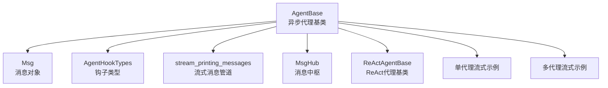
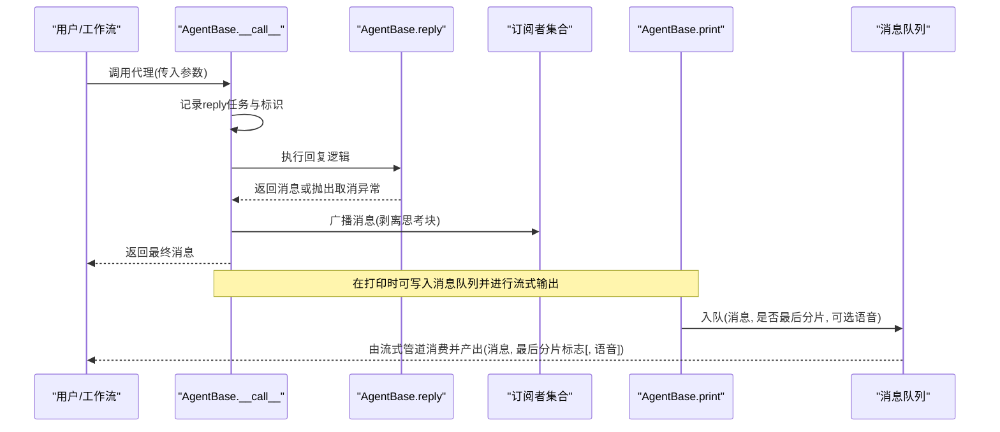
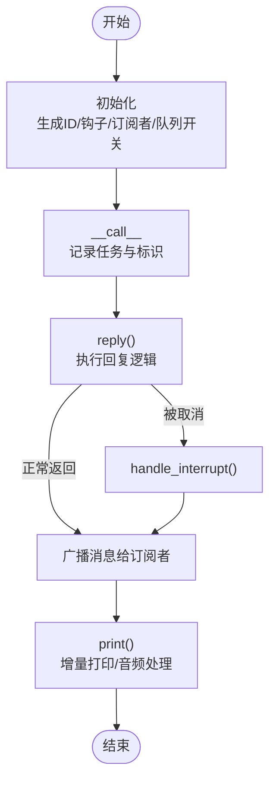
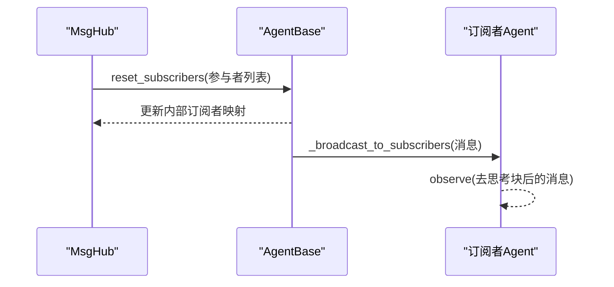
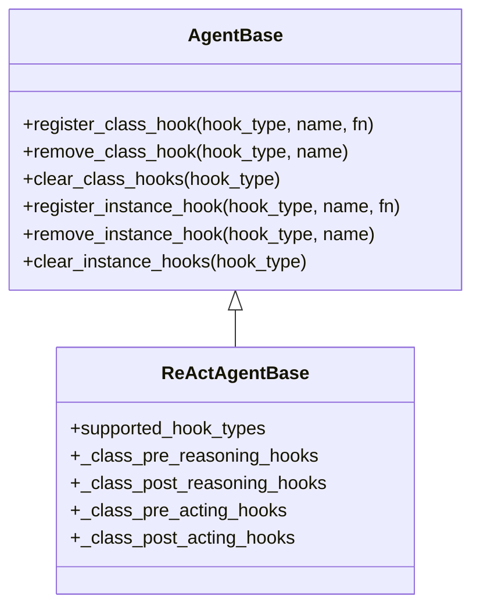
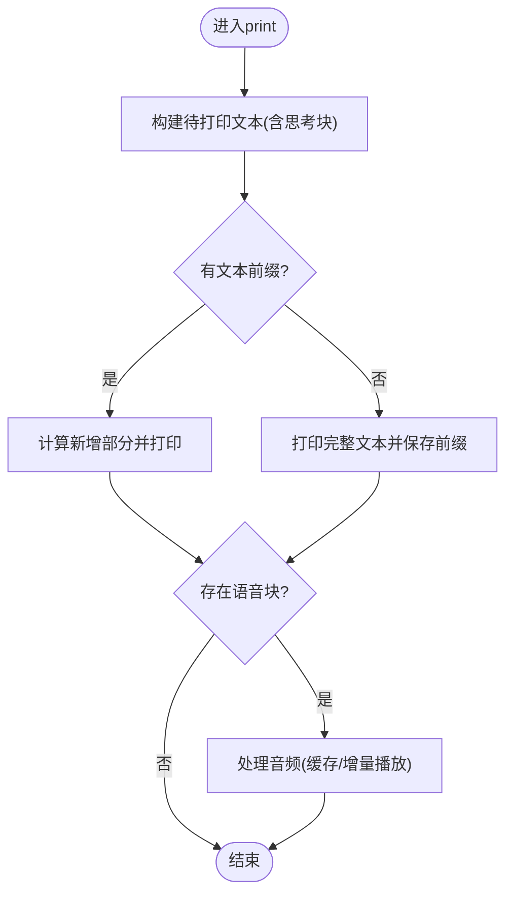
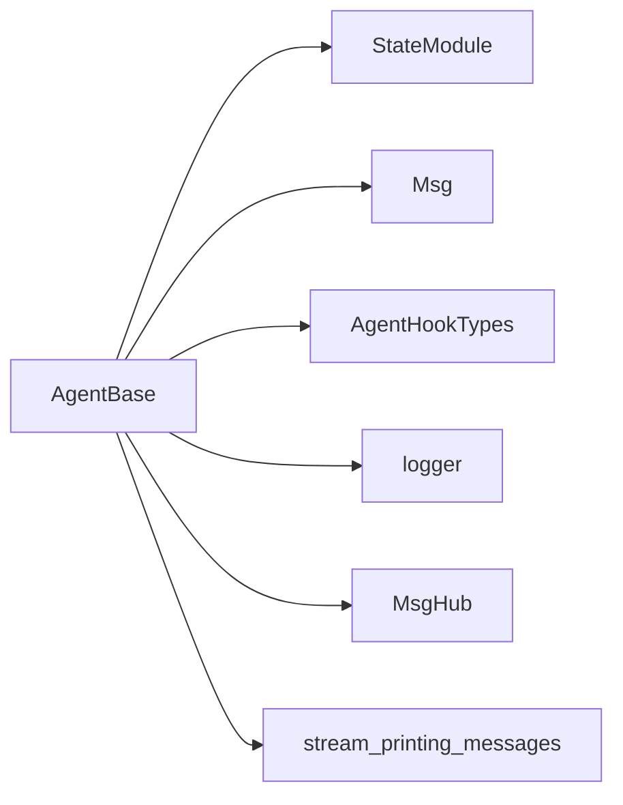

# AgentBase基类概念

<cite>
**本文引用的文件列表**
- [AgentBase基类](file://src/agentscope/agent/_agent_base.py)
- [Agent模块导出](file://src/agentscope/agent/__init__.py)
- [钩子类型定义](file://src/agentscope/types/_hook.py)
- [消息基础类](file://src/agentscope/message/_message_base.py)
- [消息中枢](file://src/agentscope/pipeline/_msghub.py)
- [功能化管道](file://src/agentscope/pipeline/_functional.py)
- [ReAct代理基类](file://src/agentscope/agent/_react_agent_base.py)
- [单代理流式打印示例](file://examples/functionality/stream_printing_messages/single_agent.py)
- [多代理流式打印示例](file://examples/functionality/stream_printing_messages/multi_agent.py)
</cite>

## 目录
1. [简介](#简介)
2. [项目结构](#项目结构)
3. [核心组件](#核心组件)
4. [架构总览](#架构总览)
5. [详细组件分析](#详细组件分析)
6. [依赖分析](#依赖分析)
7. [性能考量](#性能考量)
8. [故障排查指南](#故障排查指南)
9. [结论](#结论)
10. [附录](#附录)

## 简介
本文件面向AgentScope中AgentBase基类的概念性说明，重点阐述以下主题：
- 异步智能体的设计理念与事件循环模型
- 智能体生命周期管理（初始化、任务调度、中断处理）
- 消息观察（observe）与回复（reply）机制（含广播与订阅者管理）
- 钩子（hook）机制（实例级与类级钩子、注册与执行时机）
- 流式输出机制（消息队列、流式前缀缓存、音频播放处理）
- 继承与扩展AgentBase的实践示例路径

## 项目结构
AgentBase位于代理体系的核心层，向上提供统一接口，向下被具体代理实现复用。其周边模块包括消息系统、管道与消息中枢、钩子类型定义等。

图表来源
- [AgentBase基类:30-775](file://src/agentscope/agent/_agent_base.py#L30-L775)
- [消息基础类:21-242](file://src/agentscope/message/_message_base.py#L21-L242)
- [钩子类型定义:1-26](file://src/agentscope/types/_hook.py#L1-L26)
- [功能化管道:107-193](file://src/agentscope/pipeline/_functional.py#L107-L193)
- [消息中枢:14-156](file://src/agentscope/pipeline/_msghub.py#L14-L156)
- [ReAct代理基类:12-117](file://src/agentscope/agent/_react_agent_base.py#L12-L117)
- [单代理流式打印示例:21-62](file://examples/functionality/stream_printing_messages/single_agent.py#L21-L62)
- [多代理流式打印示例:27-62](file://examples/functionality/stream_printing_messages/multi_agent.py#L27-L62)

章节来源
- [AgentBase基类:30-775](file://src/agentscope/agent/_agent_base.py#L30-L775)
- [Agent模块导出:1-29](file://src/agentscope/agent/__init__.py#L1-L29)

## 核心组件
- 异步代理基类：提供统一的异步接口、生命周期控制、钩子系统、消息广播与订阅者管理、流式输出与音频处理。
- 消息系统：以Msg为核心，支持文本、思考、工具调用/结果、图像/视频/音频等多模态内容块。
- 钩子系统：支持类级与实例级钩子，覆盖pre/post observe/reply/print及ReAct特有的reasoning/acting阶段。
- 管道与消息中枢：提供消息汇聚、自动广播、并发/串行执行等能力。
- ReAct代理基类：在AgentBase基础上扩展推理与行动阶段的钩子。

章节来源
- [AgentBase基类:30-775](file://src/agentscope/agent/_agent_base.py#L30-L775)
- [消息基础类:21-242](file://src/agentscope/message/_message_base.py#L21-L242)
- [钩子类型定义:1-26](file://src/agentscope/types/_hook.py#L1-L26)
- [功能化管道:107-193](file://src/agentscope/pipeline/_functional.py#L107-L193)
- [消息中枢:14-156](file://src/agentscope/pipeline/_msghub.py#L14-L156)
- [ReAct代理基类:12-117](file://src/agentscope/agent/_react_agent_base.py#L12-L117)

## 架构总览
AgentBase通过异步事件循环驱动代理生命周期，结合钩子系统实现横切关注点注入，通过消息中枢实现多代理间的广播与订阅。

图表来源
- [AgentBase基类:448-467](file://src/agentscope/agent/_agent_base.py#L448-L467)
- [AgentBase基类:185-203](file://src/agentscope/agent/_agent_base.py#L185-L203)
- [AgentBase基类:469-486](file://src/agentscope/agent/_agent_base.py#L469-L486)
- [功能化管道:107-193](file://src/agentscope/pipeline/_functional.py#L107-L193)

## 详细组件分析

### 异步编程模型与生命周期
- 异步模型：AgentBase基于asyncio，使用Task跟踪当前回复任务，支持取消与中断处理。
- 生命周期阶段：
  - 初始化：生成唯一ID，初始化实例级钩子容器、订阅者映射、流式前缀缓存、消息队列开关。
  - 调用阶段：__call__记录任务与标识，调用reply；捕获CancelledError并进入handle_interrupt；最终广播消息给订阅者。
  - 中断处理：interrupt触发当前任务取消，回调handle_interrupt，确保清理与收尾。
  - 输出阶段：print负责文本与思考块的增量打印、非文本块的JSON输出、音频播放与资源释放。

图表来源
- [AgentBase基类:140-184](file://src/agentscope/agent/_agent_base.py#L140-L184)
- [AgentBase基类:448-467](file://src/agentscope/agent/_agent_base.py#L448-L467)
- [AgentBase基类:516-526](file://src/agentscope/agent/_agent_base.py#L516-L526)
- [AgentBase基类:185-203](file://src/agentscope/agent/_agent_base.py#L185-L203)

章节来源
- [AgentBase基类:140-184](file://src/agentscope/agent/_agent_base.py#L140-L184)
- [AgentBase基类:448-467](file://src/agentscope/agent/_agent_base.py#L448-L467)
- [AgentBase基类:516-526](file://src/agentscope/agent/_agent_base.py#L516-L526)

### 消息观察与回复机制
- observe：接收消息但不生成回复，用于订阅其他代理或环境的消息。
- reply：核心回复逻辑，返回Msg对象。
- 广播与订阅者：
  - reset_subscribers：为指定消息中枢设置订阅者列表（排除自身）。
  - _broadcast_to_subscribers：剥离思考块后向所有订阅者调用observe。
  - remove_subscribers：按消息中枢名称移除订阅者。
- 消息中枢MsgHub：集中管理订阅者，支持自动广播与手动广播。

图表来源
- [AgentBase基类:701-731](file://src/agentscope/agent/_agent_base.py#L701-L731)
- [AgentBase基类:469-486](file://src/agentscope/agent/_agent_base.py#L469-L486)
- [消息中枢:89-94](file://src/agentscope/pipeline/_msghub.py#L89-L94)
- [消息中枢:130-139](file://src/agentscope/pipeline/_msghub.py#L130-L139)

章节来源
- [AgentBase基类:185-203](file://src/agentscope/agent/_agent_base.py#L185-L203)
- [AgentBase基类:469-486](file://src/agentscope/agent/_agent_base.py#L469-L486)
- [AgentBase基类:701-731](file://src/agentscope/agent/_agent_base.py#L701-L731)
- [消息中枢:14-156](file://src/agentscope/pipeline/_msghub.py#L14-L156)

### 钩子机制设计
- 支持钩子类型：pre/post observe/reply/print，以及ReAct特有的reasoning/acting。
- 类级钩子：通过类方法register_class_hook注册，对类的所有实例生效。
- 实例级钩子：通过register_instance_hook注册，仅对当前实例生效。
- 注册与执行：
  - register_class_hook/register_instance_hook：按类型名注册钩子函数。
  - clear_class_hooks/clear_instance_hooks：清空指定类型或全部钩子。
  - remove_class_hook/remove_instance_hook：按名称移除钩子。
- 执行顺序：类级钩子与实例级钩子分别维护有序字典，按注册顺序依次执行。

图表来源
- [AgentBase基类:590-700](file://src/agentscope/agent/_agent_base.py#L590-L700)
- [ReAct代理基类:21-91](file://src/agentscope/agent/_react_agent_base.py#L21-L91)
- [钩子类型定义:1-26](file://src/agentscope/types/_hook.py#L1-L26)

章节来源
- [AgentBase基类:590-700](file://src/agentscope/agent/_agent_base.py#L590-L700)
- [ReAct代理基类:21-91](file://src/agentscope/agent/_react_agent_base.py#L21-L91)
- [钩子类型定义:1-26](file://src/agentscope/types/_hook.py#L1-L26)

### 流式输出机制
- 消息队列：set_msg_queue_enabled开启/关闭队列，支持自定义队列实例。
- 增量打印：print根据消息ID维护“文本前缀”与“音频前缀”，仅输出新增部分。
- 音频处理：
  - URL音频：下载并播放。
  - Base64音频：缓存OutputStream与已播放前缀，增量解码并写入音频流。
  - 结束时清理：若存在未完成的音频播放器则关闭。
- 流式管道：stream_printing_messages聚合多个代理的打印消息，按分片逐个产出，并可选择是否携带语音块。

图表来源
- [AgentBase基类:205-275](file://src/agentscope/agent/_agent_base.py#L205-L275)
- [AgentBase基类:276-367](file://src/agentscope/agent/_agent_base.py#L276-L367)
- [AgentBase基类:369-447](file://src/agentscope/agent/_agent_base.py#L369-L447)
- [功能化管道:107-193](file://src/agentscope/pipeline/_functional.py#L107-L193)

章节来源
- [AgentBase基类:205-275](file://src/agentscope/agent/_agent_base.py#L205-L275)
- [AgentBase基类:276-367](file://src/agentscope/agent/_agent_base.py#L276-L367)
- [AgentBase基类:369-447](file://src/agentscope/agent/_agent_base.py#L369-L447)
- [功能化管道:107-193](file://src/agentscope/pipeline/_functional.py#L107-L193)

### 继承与扩展示例
- 继承AgentBase：实现observe、reply、handle_interrupt等抽象方法，即可获得完整的异步生命周期与钩子系统。
- 继承ReActAgentBase：在AgentBase基础上增加推理与行动阶段的钩子，适合需要ReAct范式的代理。
- 示例路径：
  - 单代理流式打印：[单代理流式示例:21-62](file://examples/functionality/stream_printing_messages/single_agent.py#L21-L62)
  - 多代理流式打印：[多代理流式示例:27-62](file://examples/functionality/stream_printing_messages/multi_agent.py#L27-L62)

章节来源
- [ReAct代理基类:12-117](file://src/agentscope/agent/_react_agent_base.py#L12-L117)
- [单代理流式打印示例:21-62](file://examples/functionality/stream_printing_messages/single_agent.py#L21-L62)
- [多代理流式打印示例:27-62](file://examples/functionality/stream_printing_messages/multi_agent.py#L27-L62)

## 依赖分析
- AgentBase依赖：
  - 模块StateModule（状态模块）、消息Msg与多模态内容块、日志logger、类型AgentHookTypes。
  - 通过MsgHub管理订阅者，通过stream_printing_messages进行流式输出收集。
- 关键耦合点：
  - 钩子系统与元类配合，保证钩子隔离与正确执行顺序。
  - 流式输出与消息队列解耦，便于测试与集成。

图表来源
- [AgentBase基类:16-28](file://src/agentscope/agent/_agent_base.py#L16-L28)
- [AgentBase基类:469-486](file://src/agentscope/agent/_agent_base.py#L469-L486)
- [功能化管道:107-193](file://src/agentscope/pipeline/_functional.py#L107-L193)

章节来源
- [AgentBase基类:16-28](file://src/agentscope/agent/_agent_base.py#L16-L28)
- [AgentBase基类:469-486](file://src/agentscope/agent/_agent_base.py#L469-L486)
- [功能化管道:107-193](file://src/agentscope/pipeline/_functional.py#L107-L193)

## 性能考量
- 事件循环让步：在消息入队后主动yield控制权，避免生产者独占事件循环。
- 增量打印：仅输出新增文本与音频片段，减少重复输出开销。
- 音频流式播放：缓存OutputStream与前缀数据，避免重复初始化与抖动。
- 队列容量：默认最大容量限制，防止内存膨胀；可根据场景调整或禁用队列。

章节来源
- [AgentBase基类:223-228](file://src/agentscope/agent/_agent_base.py#L223-L228)
- [AgentBase基类:326-361](file://src/agentscope/agent/_agent_base.py#L326-L361)
- [AgentBase基类:750-775](file://src/agentscope/agent/_agent_base.py#L750-L775)

## 故障排查指南
- 中断处理：若代理在运行中被中断，确保实现handle_interrupt以返回合理的中间状态或终止消息。
- 音频播放失败：检查音频源类型与网络连通性；确认设备权限与音频解码库可用。
- 钩子异常：钩子函数应保持幂等与无副作用；必要时在钩子内捕获异常并返回默认值。
- 流式输出丢失：确认已启用消息队列并正确传递队列实例；检查管道消费逻辑与异常传播。

章节来源
- [AgentBase基类:516-526](file://src/agentscope/agent/_agent_base.py#L516-L526)
- [AgentBase基类:290-322](file://src/agentscope/agent/_agent_base.py#L290-L322)
- [AgentBase基类:750-775](file://src/agentscope/agent/_agent_base.py#L750-L775)
- [功能化管道:189-193](file://src/agentscope/pipeline/_functional.py#L189-L193)

## 结论
AgentBase为AgentScope提供了统一的异步代理框架，通过钩子系统实现横切关注点的灵活注入，通过消息中枢与广播机制实现多代理协作，通过流式输出与音频处理提升交互体验。开发者可在其上快速扩展具体代理实现，并通过示例路径验证关键特性。

## 附录
- 相关示例路径：
  - [单代理流式示例:21-62](file://examples/functionality/stream_printing_messages/single_agent.py#L21-L62)
  - [多代理流式示例:27-62](file://examples/functionality/stream_printing_messages/multi_agent.py#L27-L62)