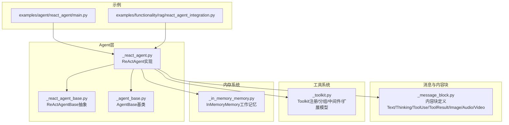
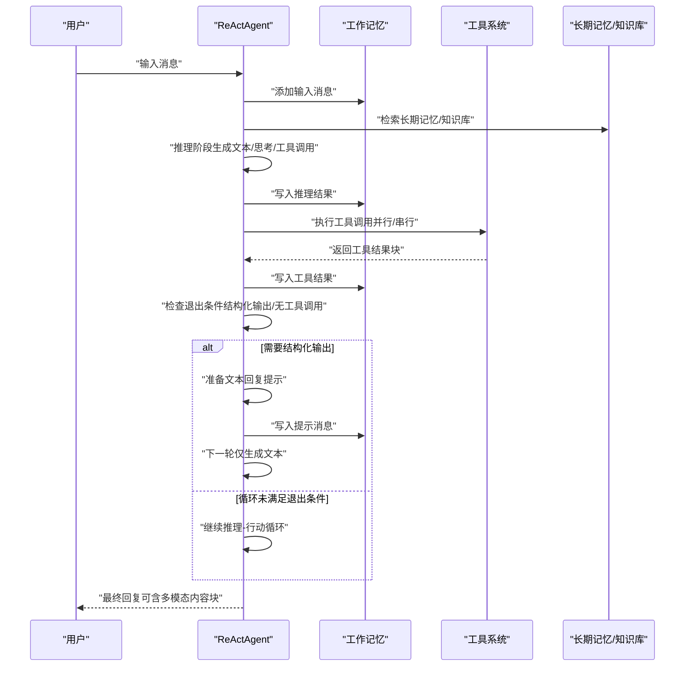
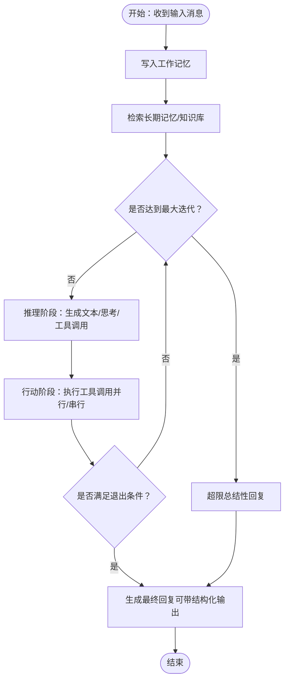
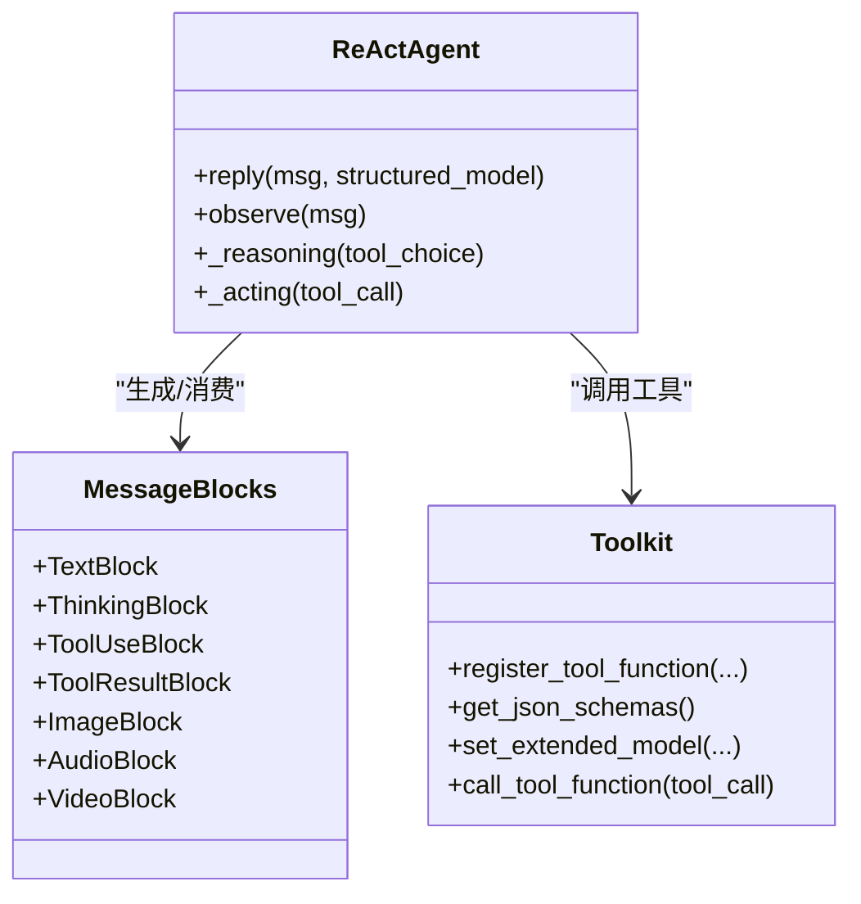
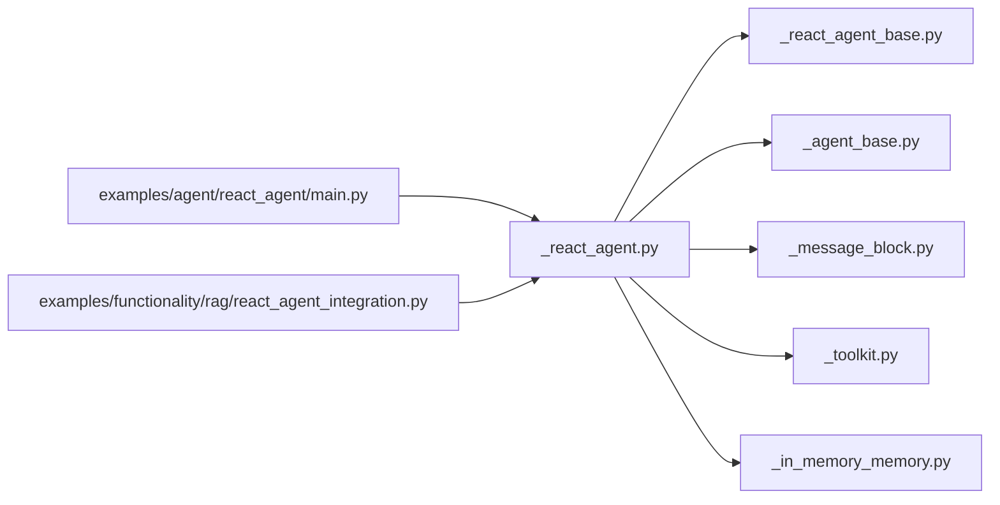

# ReAct智能体概念

<cite>
**本文引用的文件**
- [src/agentscope/agent/_react_agent.py](file://src/agentscope/agent/_react_agent.py)
- [src/agentscope/agent/_react_agent_base.py](file://src/agentscope/agent/_react_agent_base.py)
- [src/agentscope/agent/_agent_base.py](file://src/agentscope/agent/_agent_base.py)
- [src/agentscope/message/_message_block.py](file://src/agentscope/message/_message_block.py)
- [src/agentscope/tool/_toolkit.py](file://src/agentscope/tool/_toolkit.py)
- [src/agentscope/memory/_working_memory/_in_memory_memory.py](file://src/agentscope/memory/_working_memory/_in_memory_memory.py)
- [examples/agent/react_agent/main.py](file://examples/agent/react_agent/main.py)
- [examples/functionality/rag/react_agent_integration.py](file://examples/functionality/rag/react_agent_integration.py)
</cite>

## 目录
1. [引言](#引言)
2. [项目结构](#项目结构)
3. [核心组件](#核心组件)
4. [架构总览](#架构总览)
5. [详细组件分析](#详细组件分析)
6. [依赖关系分析](#依赖关系分析)
7. [性能考量](#性能考量)
8. [故障排查指南](#故障排查指南)
9. [结论](#结论)
10. [附录](#附录)

## 引言
本文件系统性阐述AgentScope中ReAct智能体的概念与实现，重点围绕“推理-行动”循环的设计思想，解释思考块（Thinking Block）与行动块（ToolUseBlock）的处理机制、多模态内容块的组合与渲染、智能体的决策过程、状态管理（工作记忆、工具调用历史与结果处理），并提供可直接参考的代码示例路径，帮助读者快速理解与实践。

## 项目结构
ReAct智能体位于AgentScope的agent模块中，并与消息模型、工具系统、内存系统、格式化器等模块协同工作。下图给出与ReAct相关的关键文件及其关系概览。

图表来源
- [src/agentscope/agent/_react_agent.py:1-1138](file://src/agentscope/agent/_react_agent.py#L1-L1138)
- [src/agentscope/agent/_react_agent_base.py:1-117](file://src/agentscope/agent/_react_agent_base.py#L1-L117)
- [src/agentscope/agent/_agent_base.py:1-775](file://src/agentscope/agent/_agent_base.py#L1-L775)
- [src/agentscope/message/_message_block.py:1-129](file://src/agentscope/message/_message_block.py#L1-L129)
- [src/agentscope/tool/_toolkit.py:1-1685](file://src/agentscope/tool/_toolkit.py#L1-L1685)
- [src/agentscope/memory/_working_memory/_in_memory_memory.py:1-306](file://src/agentscope/memory/_working_memory/_in_memory_memory.py#L1-L306)
- [examples/agent/react_agent/main.py:1-51](file://examples/agent/react_agent/main.py#L1-L51)
- [examples/functionality/rag/react_agent_integration.py:1-79](file://examples/functionality/rag/react_agent_integration.py#L1-L79)

章节来源
- [src/agentscope/agent/_react_agent.py:1-1138](file://src/agentscope/agent/_react_agent.py#L1-L1138)
- [src/agentscope/agent/_react_agent_base.py:1-117](file://src/agentscope/agent/_react_agent_base.py#L1-L117)
- [src/agentscope/agent/_agent_base.py:1-775](file://src/agentscope/agent/_agent_base.py#L1-L775)
- [src/agentscope/message/_message_block.py:1-129](file://src/agentscope/message/_message_block.py#L1-L129)
- [src/agentscope/tool/_toolkit.py:1-1685](file://src/agentscope/tool/_toolkit.py#L1-L1685)
- [src/agentscope/memory/_working_memory/_in_memory_memory.py:1-306](file://src/agentscope/memory/_working_memory/_in_memory_memory.py#L1-L306)
- [examples/agent/react_agent/main.py:1-51](file://examples/agent/react_agent/main.py#L1-L51)
- [examples/functionality/rag/react_agent_integration.py:1-79](file://examples/functionality/rag/react_agent_integration.py#L1-L79)

## 核心组件
- ReActAgent：实现推理-行动循环，支持实时流式输出、并行/串行工具调用、结构化输出、RAG检索、长短期记忆、计划工具组等。
- ReActAgentBase：定义抽象的推理与行动接口，并通过元类支持预/后置钩子（pre/post reasoning/acting/print/observe）。
- AgentBase：通用异步Agent基类，提供打印、中断、订阅广播、钩子注册等能力。
- 内容块（Message Blocks）：统一描述文本、思考、工具调用、工具结果、图像、音频、视频等多模态内容。
- Toolkit：工具注册、分组、中间件链、动态扩展模型（用于结构化输出）、MCP客户端集成。
- 工作记忆（InMemoryMemory）：消息存储、标记过滤、压缩摘要前置、重复去重、按标记增删改查。

章节来源
- [src/agentscope/agent/_react_agent.py:98-374](file://src/agentscope/agent/_react_agent.py#L98-L374)
- [src/agentscope/agent/_react_agent_base.py:12-117](file://src/agentscope/agent/_react_agent_base.py#L12-L117)
- [src/agentscope/agent/_agent_base.py:30-775](file://src/agentscope/agent/_agent_base.py#L30-L775)
- [src/agentscope/message/_message_block.py:9-129](file://src/agentscope/message/_message_block.py#L9-L129)
- [src/agentscope/tool/_toolkit.py:117-800](file://src/agentscope/tool/_toolkit.py#L117-L800)
- [src/agentscope/memory/_working_memory/_in_memory_memory.py:10-306](file://src/agentscope/memory/_working_memory/_in_memory_memory.py#L10-L306)

## 架构总览
ReAct智能体以“推理-行动”循环为核心，结合工具系统与消息内容块，形成如下闭环：
- 输入消息进入工作记忆；
- 可选：从长期记忆与知识库检索上下文；
- 推理阶段生成包含文本与思考块的响应，以及可能的工具调用块；
- 行动阶段根据工具调用块执行工具函数，产出工具结果块；
- 将工具结果与原始消息合并回工作记忆，决定是否继续循环或结束；
- 支持结构化输出模式，必要时强制生成最终文本回复。

图表来源
- [src/agentscope/agent/_react_agent.py:376-537](file://src/agentscope/agent/_react_agent.py#L376-L537)
- [src/agentscope/agent/_react_agent.py:540-655](file://src/agentscope/agent/_react_agent.py#L540-L655)
- [src/agentscope/agent/_react_agent.py:657-714](file://src/agentscope/agent/_react_agent.py#L657-L714)

## 详细组件分析

### ReActAgent类与推理-行动循环
- 初始化参数涵盖名称、系统提示、模型、格式化器、工具包、工作记忆、长期记忆、并行工具调用、知识库、计划笔记本、最大迭代次数、TTS模型、自动压缩配置等。
- reply方法是核心控制流：先检索长期记忆与知识库；根据是否需要结构化输出设置工具选择策略；在max_iters次循环内执行推理与行动；若结构化输出未满足则插入提示消息引导生成文本；达到上限仍未满足则总结性回复；最后根据长期记忆模式决定是否记录本次对话。
- _reasoning负责将消息格式化为模型输入，调用模型生成内容块（文本/思考/工具调用/音频等），支持流式与非流式输出，并与TTS模型联动；同时将生成的消息写入工作记忆。
- _acting根据工具调用块执行工具函数，支持异步生成器流式返回，逐段更新工具结果块；当工具名为内置“generate_response”且返回成功标记时，返回结构化输出数据供上层使用；最终将工具结果写入工作记忆。
- observe用于接收观察消息而不生成回复，便于外部事件驱动。

图表来源
- [src/agentscope/agent/_react_agent.py:376-537](file://src/agentscope/agent/_react_agent.py#L376-L537)
- [src/agentscope/agent/_react_agent.py:540-655](file://src/agentscope/agent/_react_agent.py#L540-L655)
- [src/agentscope/agent/_react_agent.py:657-714](file://src/agentscope/agent/_react_agent.py#L657-L714)

章节来源
- [src/agentscope/agent/_react_agent.py:177-374](file://src/agentscope/agent/_react_agent.py#L177-L374)
- [src/agentscope/agent/_react_agent.py:376-537](file://src/agentscope/agent/_react_agent.py#L376-L537)
- [src/agentscope/agent/_react_agent.py:540-655](file://src/agentscope/agent/_react_agent.py#L540-L655)
- [src/agentscope/agent/_react_agent.py:657-714](file://src/agentscope/agent/_react_agent.py#L657-L714)

### 思考块（Thinking Block）与工具调用块（ToolUseBlock）
- Thinking Block：用于承载模型内部推理过程，AgentBase在对外广播时会移除该类型块，避免泄露内部思考。
- ToolUseBlock：描述一次工具调用，包含id、name、input及原始字符串输入；ReActAgent在行动阶段解析该块并交由Toolkit执行。
- ToolResultBlock：描述工具执行结果，支持字符串或多模态内容块列表；ReActAgent将其写回工作记忆，作为下一轮推理的上下文。

图表来源
- [src/agentscope/message/_message_block.py:18-129](file://src/agentscope/message/_message_block.py#L18-L129)
- [src/agentscope/agent/_react_agent.py:540-714](file://src/agentscope/agent/_react_agent.py#L540-L714)
- [src/agentscope/tool/_toolkit.py:274-620](file://src/agentscope/tool/_toolkit.py#L274-L620)

章节来源
- [src/agentscope/message/_message_block.py:18-129](file://src/agentscope/message/_message_block.py#L18-L129)
- [src/agentscope/agent/_agent_base.py:488-514](file://src/agentscope/agent/_agent_base.py#L488-L514)
- [src/agentscope/agent/_react_agent.py:540-714](file://src/agentscope/agent/_react_agent.py#L540-L714)
- [src/agentscope/tool/_toolkit.py:274-620](file://src/agentscope/tool/_toolkit.py#L274-L620)

### 多模态内容块的组合与渲染
- 文本与思考块：在终端渲染时会拼接显示，思考块带有前缀标识。
- 图像/音频/视频块：默认不直接打印，避免过长的base64数据；ReActAgent在打印逻辑中对这些块进行跳过处理。
- 流式输出：支持文本与音频的增量渲染，ReActAgent与AgentBase共同维护流式前缀缓存，确保连续输出的正确拼接与播放。

章节来源
- [src/agentscope/agent/_agent_base.py:205-447](file://src/agentscope/agent/_agent_base.py#L205-L447)

### 智能体的决策过程
- 观察到的消息进入工作记忆；
- 若开启长期记忆或知识库，先进行检索并将提示注入系统提示或消息；
- 推理阶段生成文本与思考块，以及工具调用块；
- 行动阶段执行工具调用，产出工具结果块；
- 当需要结构化输出时，若本轮未生成工具调用，则插入提示消息引导生成文本；若已生成结构化输出，则直接结束循环；
- 达到最大迭代仍未满足条件时，生成总结性回复。

章节来源
- [src/agentscope/agent/_react_agent.py:395-537](file://src/agentscope/agent/_react_agent.py#L395-L537)

### 状态管理与工作记忆
- 工作记忆（InMemoryMemory）：保存消息与标记，支持按标记过滤、排除标记、重复去重、批量删除、更新标记等操作；可前置压缩摘要消息。
- ReActAgent在推理与行动前后将消息写入工作记忆，并在推理完成后清理提示标记。
- 自动压缩：当启用压缩配置且token阈值触发时，会生成结构化摘要并写入记忆末尾，减少上下文开销。

章节来源
- [src/agentscope/memory/_working_memory/_in_memory_memory.py:22-271](file://src/agentscope/memory/_working_memory/_in_memory_memory.py#L22-L271)
- [src/agentscope/agent/_react_agent.py:433-434](file://src/agentscope/agent/_react_agent.py#L433-L434)
- [src/agentscope/agent/_react_agent.py:557-566](file://src/agentscope/agent/_react_agent.py#L557-L566)

### 工具系统与工具组
- Toolkit支持：
  - 注册/移除工具函数，自动解析JSON Schema；
  - 工具分组与激活/停用；
  - 中间件链动态装配；
  - 动态扩展模型（用于结构化输出）；
  - MCP客户端工具函数注册；
  - 异步任务跟踪与中断处理。
- ReActAgent在需要结构化输出时，注册内置“generate_response”工具函数，并将其扩展模型设为所需结构化模型；在不需要时移除该工具。

章节来源
- [src/agentscope/tool/_toolkit.py:117-800](file://src/agentscope/tool/_toolkit.py#L117-L800)
- [src/agentscope/agent/_react_agent.py:407-427](file://src/agentscope/agent/_react_agent.py#L407-L427)

### 示例与集成
- 基础ReAct示例：展示如何创建工具包、注册常用工具（如Shell命令、Python代码、查看文本文件），并运行交互式对话。
- ReAct与RAG集成示例：展示如何将知识库注入ReActAgent，在推理前进行查询重写与检索，提升问答准确性。

章节来源
- [examples/agent/react_agent/main.py:18-51](file://examples/agent/react_agent/main.py#L18-L51)
- [examples/functionality/rag/react_agent_integration.py:14-79](file://examples/functionality/rag/react_agent_integration.py#L14-L79)

## 依赖关系分析
ReActAgent与各模块之间的依赖关系如下：

图表来源
- [src/agentscope/agent/_react_agent.py:1-1138](file://src/agentscope/agent/_react_agent.py#L1-L1138)
- [src/agentscope/agent/_react_agent_base.py:1-117](file://src/agentscope/agent/_react_agent_base.py#L1-L117)
- [src/agentscope/agent/_agent_base.py:1-775](file://src/agentscope/agent/_agent_base.py#L1-L775)
- [src/agentscope/message/_message_block.py:1-129](file://src/agentscope/message/_message_block.py#L1-L129)
- [src/agentscope/tool/_toolkit.py:1-1685](file://src/agentscope/tool/_toolkit.py#L1-L1685)
- [src/agentscope/memory/_working_memory/_in_memory_memory.py:1-306](file://src/agentscope/memory/_working_memory/_in_memory_memory.py#L1-L306)
- [examples/agent/react_agent/main.py:1-51](file://examples/agent/react_agent/main.py#L1-L51)
- [examples/functionality/rag/react_agent_integration.py:1-79](file://examples/functionality/rag/react_agent_integration.py#L1-L79)

章节来源
- [src/agentscope/agent/_react_agent.py:1-1138](file://src/agentscope/agent/_react_agent.py#L1-L1138)
- [src/agentscope/agent/_react_agent_base.py:1-117](file://src/agentscope/agent/_react_agent_base.py#L1-L117)
- [src/agentscope/agent/_agent_base.py:1-775](file://src/agentscope/agent/_agent_base.py#L1-L775)
- [src/agentscope/message/_message_block.py:1-129](file://src/agentscope/message/_message_block.py#L1-L129)
- [src/agentscope/tool/_toolkit.py:1-1685](file://src/agentscope/tool/_toolkit.py#L1-L1685)
- [src/agentscope/memory/_working_memory/_in_memory_memory.py:1-306](file://src/agentscope/memory/_working_memory/_in_memory_memory.py#L1-L306)
- [examples/agent/react_agent/main.py:1-51](file://examples/agent/react_agent/main.py#L1-L51)
- [examples/functionality/rag/react_agent_integration.py:1-79](file://examples/functionality/rag/react_agent_integration.py#L1-L79)

## 性能考量
- 并行工具调用：ReActAgent支持并行执行多个工具调用，显著降低端到端延迟；可通过配置开关控制。
- 流式输出：模型与TTS均支持流式输出，配合AgentBase的流式渲染，提升用户体验。
- 自动压缩：当工作记忆token数超过阈值时，自动生成结构化摘要并写入记忆末尾，减少上下文长度，提高稳定性。
- 工具函数扩展模型：通过动态扩展模型约束工具输出结构，减少LLM误判，提高工具调用成功率。

章节来源
- [src/agentscope/agent/_react_agent.py:447-451](file://src/agentscope/agent/_react_agent.py#L447-L451)
- [src/agentscope/agent/_react_agent.py:107-172](file://src/agentscope/agent/_react_agent.py#L107-L172)
- [src/agentscope/tool/_toolkit.py:621-647](file://src/agentscope/tool/_toolkit.py#L621-L647)

## 故障排查指南
- 用户中断：当用户中断当前回复时，ReActAgent捕获取消异常，生成“被中断”的工具结果块并写入工作记忆，避免状态不一致。
- 工具执行错误：工具函数返回错误文本或异常包装的ToolResponse，ReActAgent将其写入工作记忆，作为后续推理的上下文。
- 结构化输出未满足：若需要结构化输出但未生成工具调用，ReActAgent会插入提示消息引导继续；若已生成则直接结束循环。
- 长期记忆模式：静态控制模式会在回复结束后记录本次对话；代理控制模式通过工具函数动态读写长期记忆。

章节来源
- [src/agentscope/agent/_react_agent.py:625-654](file://src/agentscope/agent/_react_agent.py#L625-L654)
- [src/agentscope/tool/_toolkit.py:737-755](file://src/agentscope/tool/_toolkit.py#L737-L755)
- [src/agentscope/agent/_react_agent.py:495-511](file://src/agentscope/agent/_react_agent.py#L495-L511)
- [src/agentscope/agent/_react_agent.py:528-535](file://src/agentscope/agent/_react_agent.py#L528-L535)

## 结论
ReAct智能体通过“推理-行动”循环与工具系统的深度整合，实现了从观察到思考再到行动的完整闭环。借助统一的内容块模型、灵活的工具注册与分组、工作记忆与长期记忆的协同、以及结构化输出与流式渲染能力，ReAct智能体能够高效处理复杂任务并提供良好的用户体验。示例文件提供了可直接运行的配置与集成方式，便于快速落地。

## 附录
- 快速开始示例路径：[examples/agent/react_agent/main.py:18-51](file://examples/agent/react_agent/main.py#L18-L51)
- ReAct与RAG集成示例路径：[examples/functionality/rag/react_agent_integration.py:14-79](file://examples/functionality/rag/react_agent_integration.py#L14-L79)
- ReActAgent核心实现路径：[src/agentscope/agent/_react_agent.py:376-796](file://src/agentscope/agent/_react_agent.py#L376-L796)
- 内容块定义路径：[src/agentscope/message/_message_block.py:18-129](file://src/agentscope/message/_message_block.py#L18-L129)
- 工具系统路径：[src/agentscope/tool/_toolkit.py:274-620](file://src/agentscope/tool/_toolkit.py#L274-L620)
- 工作记忆路径：[src/agentscope/memory/_working_memory/_in_memory_memory.py:22-271](file://src/agentscope/memory/_working_memory/_in_memory_memory.py#L22-L271)