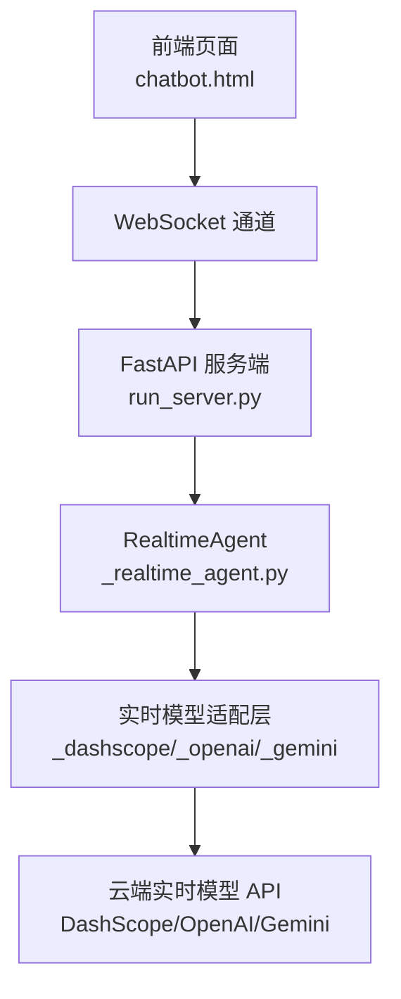
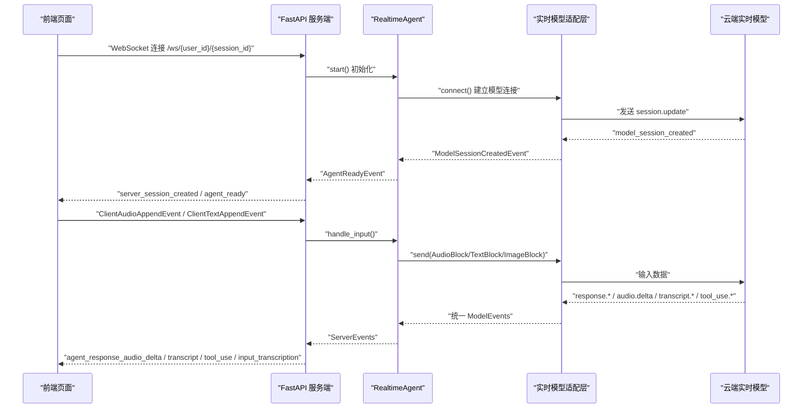
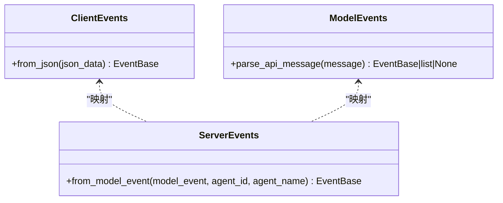
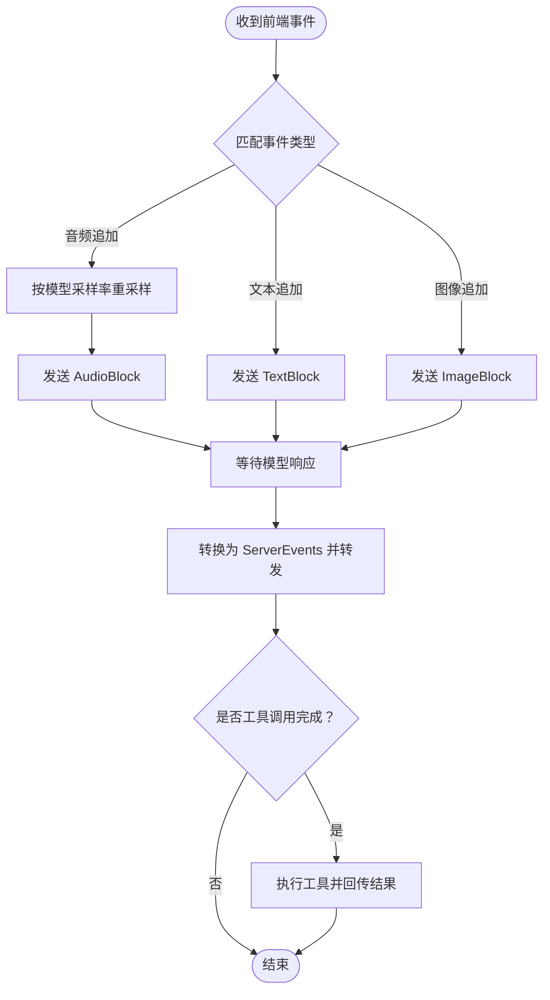
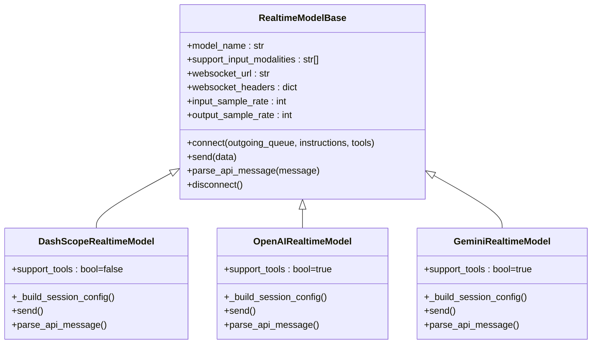
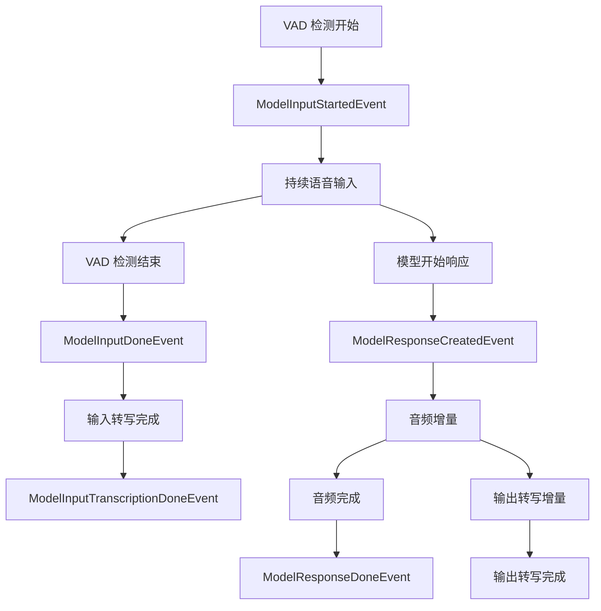
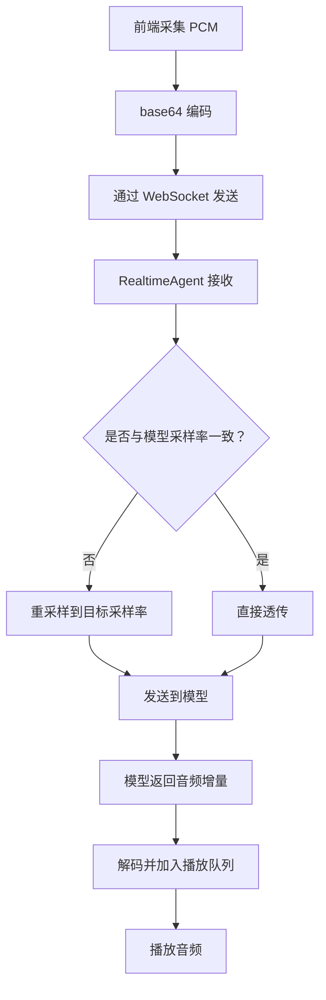
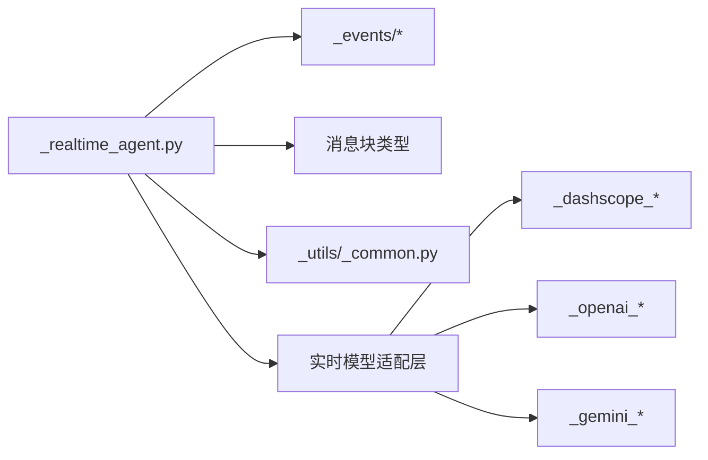

# 实时语音智能体概念

<cite>
**本文引用的文件**
- [README.md](file://examples/agent/realtime_voice_agent/README.md)
- [run_server.py](file://examples/agent/realtime_voice_agent/run_server.py)
- [chatbot.html](file://examples/agent/realtime_voice_agent/chatbot.html)
- [__init__.py](file://src/agentscope/realtime/__init__.py)
- [_base.py](file://src/agentscope/realtime/_base.py)
- [_events/__init__.py](file://src/agentscope/realtime/_events/__init__.py)
- [_events/_client_event.py](file://src/agentscope/realtime/_events/_client_event.py)
- [_events/_server_event.py](file://src/agentscope/realtime/_events/_server_event.py)
- [_events/_model_event.py](file://src/agentscope/realtime/_events/_model_event.py)
- [_realtime_agent.py](file://src/agentscope/agent/_realtime_agent.py)
- [_dashscope_realtime_model.py](file://src/agentscope/realtime/_dashscope_realtime_model.py)
- [_openai_realtime_model.py](file://src/agentscope/realtime/_openai_realtime_model.py)
- [_gemini_realtime_model.py](file://src/agentscope/realtime/_gemini_realtime_model.py)
- [_common.py](file://src/agentscope/_utils/_common.py)
</cite>

## 目录
1. [引言](#引言)
2. [项目结构](#项目结构)
3. [核心组件](#核心组件)
4. [架构总览](#架构总览)
5. [详细组件分析](#详细组件分析)
6. [依赖关系分析](#依赖关系分析)
7. [性能考虑](#性能考虑)
8. [故障排查指南](#故障排查指南)
9. [结论](#结论)
10. [附录](#附录)

## 引言
本文件系统化阐述 AgentScope 的实时语音智能体（Realtime Voice Agent）概念与实现，覆盖以下关键主题：
- 实时语音识别、语音合成与实时对话处理
- 与不同语音平台（DashScope、OpenAI、Gemini）的集成与配置
- 语音事件的生命周期管理（开始、结束与中间状态）
- 音频流的接收、处理与播放
- 与消息系统的集成（语音消息格式转换与多模态消息生成）
- 部署、配置与 Web 界面集成示例

该智能体通过 WebSocket 实时连接云端模型，支持音频输入、文本输入、图像输入与工具调用（部分平台），并以统一事件模型在前后端之间传递状态与内容。

## 项目结构
实时语音智能体由三层组成：
- 前端 Web 页面：负责采集音频/文本/图像，向后端发送事件，渲染服务器事件与消息
- 服务端 FastAPI：维护 WebSocket 连接，调度 RealtimeAgent，转发事件与消息
- RealtimeAgent 与实时模型：封装 DashScope/OpenAI/Gemini 的实时 API，解析统一事件，执行工具调用

图表来源
- [run_server.py:66-177](file://examples/agent/realtime_voice_agent/run_server.py#L66-L177)
- [chatbot.html:559-800](file://examples/agent/realtime_voice_agent/chatbot.html#L559-L800)
- [_realtime_agent.py:28-361](file://src/agentscope/agent/_realtime_agent.py#L28-L361)
- [_dashscope_realtime_model.py:15-405](file://src/agentscope/realtime/_dashscope_realtime_model.py#L15-L405)
- [_openai_realtime_model.py:19-485](file://src/agentscope/realtime/_openai_realtime_model.py#L19-L485)
- [_gemini_realtime_model.py:21-663](file://src/agentscope/realtime/_gemini_realtime_model.py#L21-L663)

章节来源
- [README.md:1-117](file://examples/agent/realtime_voice_agent/README.md#L1-L117)
- [run_server.py:29-188](file://examples/agent/realtime_voice_agent/run_server.py#L29-L188)
- [chatbot.html:455-558](file://examples/agent/realtime_voice_agent/chatbot.html#L455-L558)

## 核心组件
- RealtimeAgent：面向实时交互的智能体，负责将前端事件转换为模型输入，将模型输出转换为统一服务器事件并回传前端；支持工具调用（OpenAI/Gemini）
- 实时模型适配层：分别封装 DashScope、OpenAI、Gemini 的实时 WebSocket 协议，统一事件格式
- 事件系统：ClientEvents（前端到后端）、ServerEvents（后端到前端）、ModelEvents（模型到后端）
- 通用工具：音频重采样、URL 转字节、JSON 修复等

章节来源
- [_realtime_agent.py:28-361](file://src/agentscope/agent/_realtime_agent.py#L28-L361)
- [_base.py:13-174](file://src/agentscope/realtime/_base.py#L13-L174)
- [_events/__init__.py:1-16](file://src/agentscope/realtime/_events/__init__.py#L1-L16)
- [_dashscope_realtime_model.py:15-405](file://src/agentscope/realtime/_dashscope_realtime_model.py#L15-L405)
- [_openai_realtime_model.py:19-485](file://src/agentscope/realtime/_openai_realtime_model.py#L19-L485)
- [_gemini_realtime_model.py:21-663](file://src/agentscope/realtime/_gemini_realtime_model.py#L21-L663)

## 架构总览
实时语音智能体采用“前端-服务端-模型”的分层架构。前端通过 WebSocket 与服务端通信，服务端通过 RealtimeAgent 与实时模型交互，模型以统一事件形式返回状态与内容。

图表来源
- [run_server.py:66-177](file://examples/agent/realtime_voice_agent/run_server.py#L66-L177)
- [_realtime_agent.py:102-361](file://src/agentscope/agent/_realtime_agent.py#L102-L361)
- [_dashscope_realtime_model.py:96-340](file://src/agentscope/realtime/_dashscope_realtime_model.py#L96-L340)
- [_openai_realtime_model.py:86-401](file://src/agentscope/realtime/_openai_realtime_model.py#L86-L401)
- [_gemini_realtime_model.py:93-322](file://src/agentscope/realtime/_gemini_realtime_model.py#L93-L322)

## 详细组件分析

### 事件系统与消息格式
- ClientEvents：前端到后端的事件集合，涵盖会话创建/结束、响应创建/取消、文本/音频/图像追加、音频提交、工具结果等
- ModelEvents：从模型侧抽象出的统一事件，包括会话生命周期、响应生命周期、音频/文本转录、工具调用、输入检测（VAD）与错误事件
- ServerEvents：后端到前端的事件集合，与 ModelEvents 对应映射，附加 agent_id 与 agent_name 字段

图表来源
- [_events/_client_event.py:45-199](file://src/agentscope/realtime/_events/_client_event.py#L45-L199)
- [_events/_server_event.py:91-525](file://src/agentscope/realtime/_events/_server_event.py#L91-L525)
- [_events/_model_event.py:84-344](file://src/agentscope/realtime/_events/_model_event.py#L84-L344)

章节来源
- [_events/_client_event.py:12-199](file://src/agentscope/realtime/_events/_client_event.py#L12-L199)
- [_events/_server_event.py:13-525](file://src/agentscope/realtime/_events/_server_event.py#L13-L525)
- [_events/_model_event.py:13-344](file://src/agentscope/realtime/_events/_model_event.py#L13-L344)

### RealtimeAgent：实时对话编排
- 生命周期：start() 建立模型连接，stop() 断开；内部维护外部事件队列与模型响应队列
- 输入处理：将前端事件转换为模型输入（音频/文本/图像），必要时进行采样率重采样
- 输出处理：将模型事件转换为统一服务器事件，转发给前端；遇到工具调用时触发工具执行流程
- 工具调用：仅 OpenAI/Gemini 支持，DashScope 当前不支持工具

图表来源
- [_realtime_agent.py:134-361](file://src/agentscope/agent/_realtime_agent.py#L134-L361)

章节来源
- [_realtime_agent.py:65-133](file://src/agentscope/agent/_realtime_agent.py#L65-L133)
- [_realtime_agent.py:134-361](file://src/agentscope/agent/_realtime_agent.py#L134-L361)

### 实时模型适配层：DashScope/OpenAI/Gemini
- 统一基类：RealtimeModelBase 定义连接、发送、解析与断开流程，抽象会话配置构建
- 采样率与格式：各平台输入/输出采样率不同，需要在 Agent 层进行重采样或直接透传
- 会话配置：根据平台差异构建 session.update（含输出模态、VAD、语音、工具等）
- 事件解析：将平台特定事件映射为统一 ModelEvents

图表来源
- [_base.py:13-174](file://src/agentscope/realtime/_base.py#L13-L174)
- [_dashscope_realtime_model.py:15-405](file://src/agentscope/realtime/_dashscope_realtime_model.py#L15-L405)
- [_openai_realtime_model.py:19-485](file://src/agentscope/realtime/_openai_realtime_model.py#L19-L485)
- [_gemini_realtime_model.py:21-663](file://src/agentscope/realtime/_gemini_realtime_model.py#L21-L663)

章节来源
- [_base.py:13-174](file://src/agentscope/realtime/_base.py#L13-L174)
- [_dashscope_realtime_model.py:44-132](file://src/agentscope/realtime/_dashscope_realtime_model.py#L44-L132)
- [_openai_realtime_model.py:40-126](file://src/agentscope/realtime/_openai_realtime_model.py#L40-L126)
- [_gemini_realtime_model.py:50-150](file://src/agentscope/realtime/_gemini_realtime_model.py#L50-L150)

### 语音事件处理机制
- 输入检测（VAD）：平台侧检测用户语音开始/结束，事件映射为 ModelInputStartedEvent/ModelInputDoneEvent
- 实时转写：输入/输出转写事件分别映射为 ModelInputTranscriptionDelta/Done 与 ModelResponseAudioTranscriptDelta/Done
- 响应事件：模型开始/完成响应、音频增量/完成、工具调用增量/完成等

图表来源
- [_events/_model_event.py:290-317](file://src/agentscope/realtime/_events/_model_event.py#L290-L317)
- [_events/_server_event.py:400-439](file://src/agentscope/realtime/_events/_server_event.py#L400-L439)
- [_events/_server_event.py:354-398](file://src/agentscope/realtime/_events/_server_event.py#L354-L398)

章节来源
- [_events/_model_event.py:13-344](file://src/agentscope/realtime/_events/_model_event.py#L13-L344)
- [_events/_server_event.py:13-525](file://src/agentscope/realtime/_events/_server_event.py#L13-L525)

### 音频处理能力
- 采样率与编码：不同平台采样率不同，Agent 在转发音频前按模型要求重采样
- 编码格式：前端以 base64 PCM 传输，模型侧可能要求特定采样率或编码
- 播放与队列：前端维护音频播放队列，按增量事件解码并播放

图表来源
- [_realtime_agent.py:150-173](file://src/agentscope/agent/_realtime_agent.py#L150-L173)
- [_common.py:458-502](file://src/agentscope/_utils/_common.py#L458-L502)

章节来源
- [_realtime_agent.py:150-173](file://src/agentscope/agent/_realtime_agent.py#L150-L173)
- [_common.py:458-502](file://src/agentscope/_utils/_common.py#L458-L502)

### 与消息系统的集成
- 多模态消息：将前端输入（文本、音频、图像）封装为 TextBlock、AudioBlock、ImageBlock，发送至模型
- 工具结果：工具执行完成后，将 ToolResultBlock 回传模型，同时向前端发出工具结果事件
- 事件映射：ServerEvents.from_model_event 将模型事件统一为后端事件，附加 agent_id 与 agent_name

章节来源
- [_realtime_agent.py:271-306](file://src/agentscope/agent/_realtime_agent.py#L271-L306)
- [_events/_server_event.py:463-525](file://src/agentscope/realtime/_events/_server_event.py#L463-L525)

## 依赖关系分析
- 组件内聚：RealtimeAgent 聚合事件处理、模型适配与工具执行；模型适配层各自封装平台差异
- 组件耦合：RealtimeAgent 依赖事件系统与消息块类型；模型适配层依赖统一事件接口
- 外部依赖：websockets、requests、numpy/scipy（重采样）、pydantic（事件序列化）

图表来源
- [_realtime_agent.py:19-25](file://src/agentscope/agent/_realtime_agent.py#L19-L25)
- [_dashscope_realtime_model.py:8-12](file://src/agentscope/realtime/_dashscope_realtime_model.py#L8-L12)
- [_openai_realtime_model.py:6-16](file://src/agentscope/realtime/_openai_realtime_model.py#L6-L16)
- [_gemini_realtime_model.py:8-18](file://src/agentscope/realtime/_gemini_realtime_model.py#L8-L18)

章节来源
- [_realtime_agent.py:19-25](file://src/agentscope/agent/_realtime_agent.py#L19-L25)
- [_base.py:9-10](file://src/agentscope/realtime/_base.py#L9-L10)

## 性能考虑
- 低延迟：WebSocket 实时传输，模型侧 VAD 与增量事件减少等待时间
- 采样率适配：避免重复重采样，优先在前端/Agent 层做一次重采样
- 流式转写：增量转写事件减少前端渲染压力
- 工具执行：异步执行工具，避免阻塞模型事件处理

## 故障排查指南
- WebSocket 连接失败：检查服务端日志与网络连通性；确认模型 API Key 与 URL 正确
- 事件类型错误：前端 JSON 必须包含 type 字段，否则抛出异常
- 音频播放卡顿：检查前端播放队列与解码逻辑，确保增量事件顺序正确
- 工具调用失败：确认模型支持工具（OpenAI/Gemini），并正确注册工具函数

章节来源
- [_events/_client_event.py:169-199](file://src/agentscope/realtime/_events/_client_event.py#L169-L199)
- [_openai_realtime_model.py:151-217](file://src/agentscope/realtime/_openai_realtime_model.py#L151-L217)
- [_gemini_realtime_model.py:175-250](file://src/agentscope/realtime/_gemini_realtime_model.py#L175-L250)

## 结论
AgentScope 的实时语音智能体通过统一事件模型与多平台适配层，实现了跨平台的实时语音对话体验。其核心优势在于：
- 事件驱动的解耦设计，便于扩展新平台与新功能
- 完整的语音生命周期管理（VAD、转写、工具调用）
- 前后端一致的消息格式与多模态支持

## 附录

### 部署与配置示例
- 安装依赖与启动服务端
  - 参考路径：[README.md:10-27](file://examples/agent/realtime_voice_agent/README.md#L10-L27)
  - 服务端入口：[run_server.py:180-188](file://examples/agent/realtime_voice_agent/run_server.py#L180-L188)

- 切换实时模型
  - DashScope 默认模型：[run_server.py:123-127](file://examples/agent/realtime_voice_agent/run_server.py#L123-L127)
  - OpenAI 模型切换：[README.md:84-98](file://examples/agent/realtime_voice_agent/README.md#L84-L98)
  - Gemini 模型切换：[README.md:100-114](file://examples/agent/realtime_voice_agent/README.md#L100-L114)

- Web 界面集成
  - 前端页面：[chatbot.html:559-800](file://examples/agent/realtime_voice_agent/chatbot.html#L559-L800)
  - 模型可用性检查：[chatbot.html:632-716](file://examples/agent/realtime_voice_agent/chatbot.html#L632-L716)

### 代码片段路径参考
- 服务端 WebSocket 端点与会话管理：[run_server.py:66-177](file://examples/agent/realtime_voice_agent/run_server.py#L66-L177)
- RealtimeAgent 启动与事件转发：[run_server.py:146-153](file://examples/agent/realtime_voice_agent/run_server.py#L146-L153)
- 事件解析与映射：[run_server.py:95-172](file://examples/agent/realtime_voice_agent/run_server.py#L95-L172)
- 前端 WebSocket 连接与事件处理：[chatbot.html:748-760](file://examples/agent/realtime_voice_agent/chatbot.html#L748-L760)
- 前端音频增量接收与播放：[chatbot.html:780-787](file://examples/agent/realtime_voice_agent/chatbot.html#L780-L787)
- 前端文本消息发送：[chatbot.html:585-609](file://examples/agent/realtime_voice_agent/chatbot.html#L585-L609)
- 重采样工具函数：[_common.py:458-502](file://src/agentscope/_utils/_common.py#L458-L502)