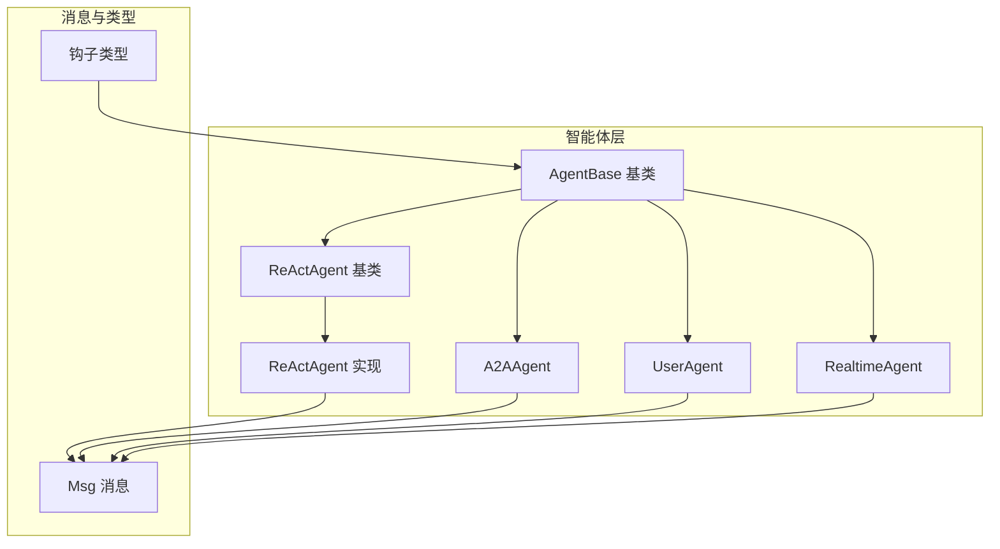
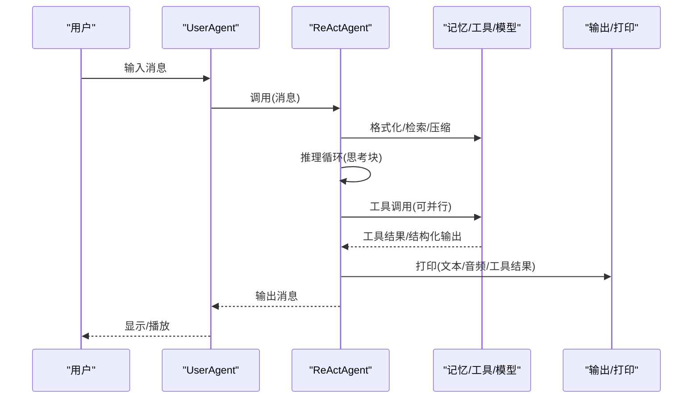
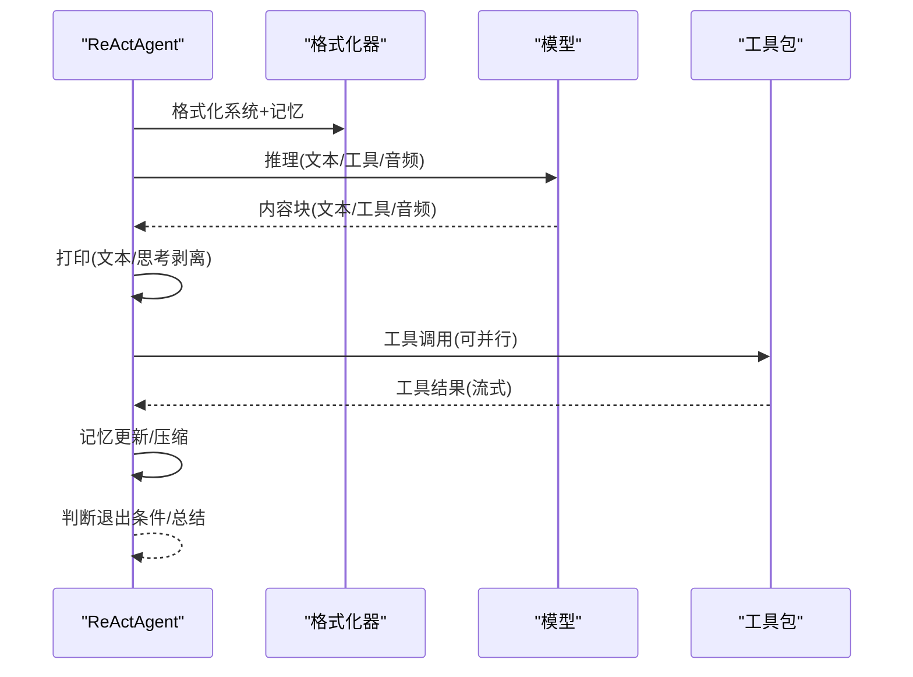
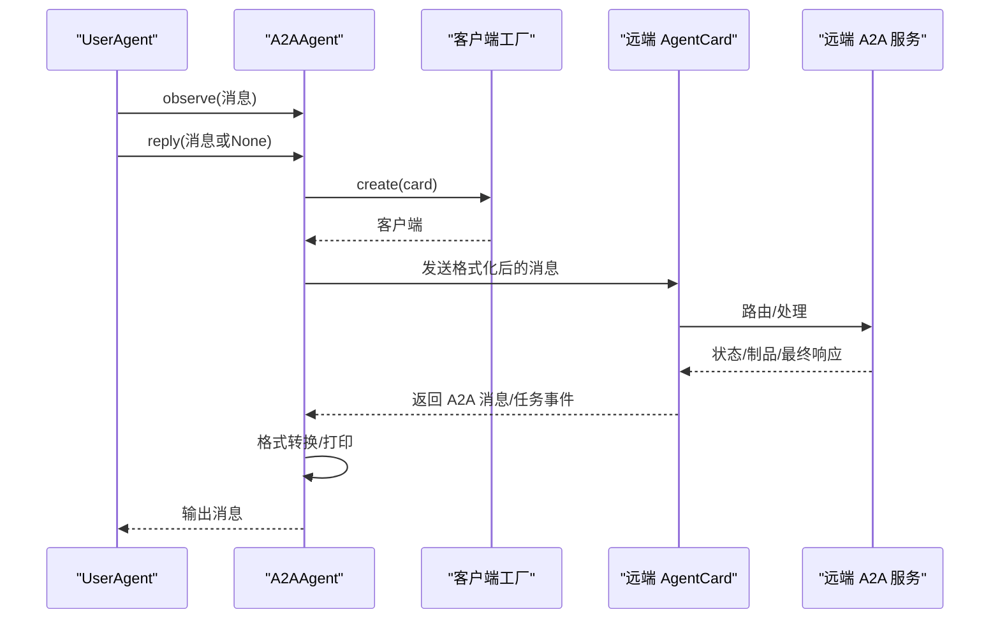
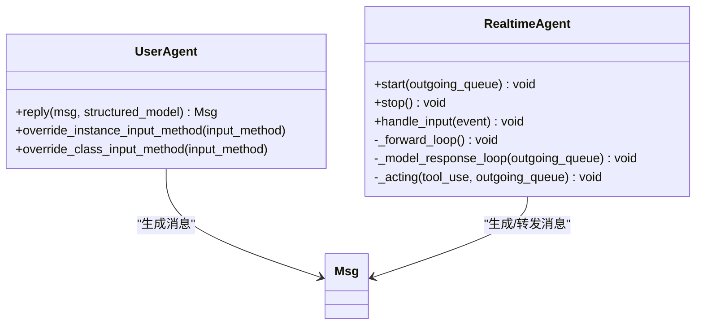
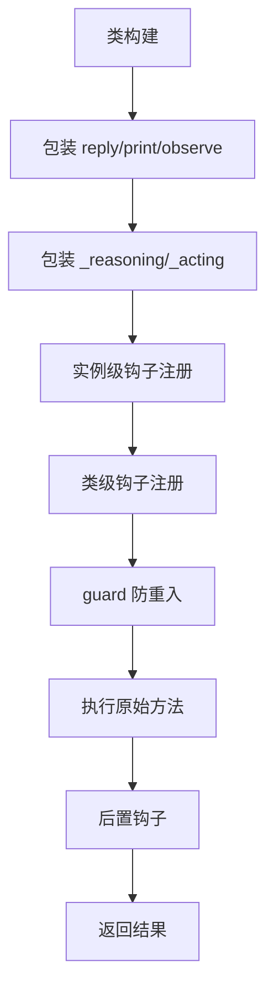
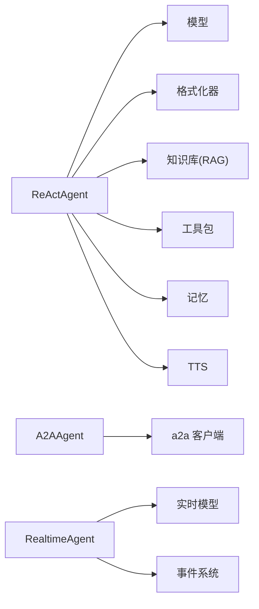

# 智能体系统概念

<cite>
**本文引用的文件**
- [AgentBase 基类](file://src/agentscope/agent/_agent_base.py)
- [ReAct 基类](file://src/agentscope/agent/_react_agent_base.py)
- [ReAct 实现](file://src/agentscope/agent/_react_agent.py)
- [A2A 智能体](file://src/agentscope/agent/_a2a_agent.py)
- [用户智能体](file://src/agentscope/agent/_user_agent.py)
- [实时智能体](file://src/agentscope/agent/_realtime_agent.py)
- [智能体元类（钩子包装）](file://src/agentscope/agent/_agent_meta.py)
- [钩子类型定义](file://src/agentscope/types/_hook.py)
- [消息基础类](file://src/agentscope/message/_message_base.py)
- [ReAct 示例](file://examples/agent/react_agent/main.py)
- [A2A 示例](file://examples/agent/a2a_agent/main.py)
- [实时语音示例服务端](file://examples/agent/realtime_voice_agent/run_server.py)
- [钩子测试](file://tests/hook_test.py)
- [A2A 智能体测试](file://tests/a2a_agent_test.py)
</cite>

## 目录
1. [引言](#引言)
2. [项目结构](#项目结构)
3. [核心组件](#核心组件)
4. [架构总览](#架构总览)
5. [详细组件分析](#详细组件分析)
6. [依赖分析](#依赖分析)
7. [性能考虑](#性能考虑)
8. [故障排查指南](#故障排查指南)
9. [结论](#结论)
10. [附录：代码示例路径](#附录代码示例路径)

## 引言
本文件面向希望理解 AgentScope 智能体系统核心概念与实现的读者，重点围绕以下主题展开：
- AgentBase 基类的设计理念与异步架构、生命周期管理、消息观察与回复机制
- ReAct 智能体的“推理-行动”循环原理，以及思考块与行动块的处理流程
- A2A 智能体的 Agent-to-Agent 通信协议、服务发现、消息路由与状态管理
- 用户智能体的交互模式与实时智能体的语音处理能力
- 钩子机制（hook mechanism）的工作原理与应用场景

## 项目结构
AgentScope 将智能体按职责分层组织，核心位于 src/agentscope 下：
- agent：智能体基类与具体实现（AgentBase、ReAct、A2A、User、Realtime）
- message：消息与内容块抽象（Msg、TextBlock、ToolUseBlock 等）
- types：类型与钩子类型定义
- 其他模块：formatter、model、memory、tool、realtime、tts 等支撑能力



图示来源
- [AgentBase 基类:30-775](file://src/agentscope/agent/_agent_base.py#L30-L775)
- [ReAct 基类:12-117](file://src/agentscope/agent/_react_agent_base.py#L12-L117)
- [ReAct 实现:98-1138](file://src/agentscope/agent/_react_agent.py#L98-L1138)
- [A2A 智能体:29-289](file://src/agentscope/agent/_a2a_agent.py#L29-L289)
- [用户智能体:12-129](file://src/agentscope/agent/_user_agent.py#L12-L129)
- [实时智能体:28-361](file://src/agentscope/agent/_realtime_agent.py#L28-L361)
- [消息基础类:21-242](file://src/agentscope/message/_message_base.py#L21-L242)
- [钩子类型定义:1-26](file://src/agentscope/types/_hook.py#L1-L26)

章节来源
- [AgentBase 基类:30-775](file://src/agentscope/agent/_agent_base.py#L30-L775)
- [消息基础类:21-242](file://src/agentscope/message/_message_base.py#L21-L242)

## 核心组件
- AgentBase：异步智能体基类，统一了 observe/reply/print 生命周期，内置钩子注册与广播机制；支持中断与订阅者广播。
- ReActAgentBase/ReActAgent：在 AgentBase 上扩展“推理-行动”循环，支持 pre/post reasoning/acting 钩子、工具并行执行、结构化输出生成器等。
- A2AAgent：基于 A2A 协议与远程智能体通信，负责双向格式转换、任务生命周期与状态跟踪。
- UserAgent：用户输入适配器，支持不同输入源（终端、Web UI 等），可选结构化输出提示。
- RealtimeAgent：面向实时语音/多模态交互，通过事件队列与实时模型对接，处理音频/文本/图像输入与工具调用。

章节来源
- [AgentBase 基类:30-775](file://src/agentscope/agent/_agent_base.py#L30-L775)
- [ReAct 基类:12-117](file://src/agentscope/agent/_react_agent_base.py#L12-L117)
- [ReAct 实现:98-1138](file://src/agentscope/agent/_react_agent.py#L98-L1138)
- [A2A 智能体:29-289](file://src/agentscope/agent/_a2a_agent.py#L29-L289)
- [用户智能体:12-129](file://src/agentscope/agent/_user_agent.py#L12-L129)
- [实时智能体:28-361](file://src/agentscope/agent/_realtime_agent.py#L28-L361)

## 架构总览
AgentScope 采用“模块化+钩子”的架构设计：
- 模块化：消息、格式化器、模型、记忆、工具、实时模型、TTS 等作为独立模块组合。
- 钩子：通过元类在关键方法前后注入预处理/后处理逻辑，实现横切关注点（如追踪、日志、限流、校验）。
- 异步：所有智能体方法均为异步，配合事件队列与并发执行提升吞吐。



图示来源
- [ReAct 实现:376-537](file://src/agentscope/agent/_react_agent.py#L376-L537)
- [AgentBase 基类:448-467](file://src/agentscope/agent/_agent_base.py#L448-L467)

## 详细组件分析

### AgentBase：异步智能体基类与生命周期
- 设计要点
  - 异步生命周期：__call__ 统一调度 reply，捕获取消异常并触发 handle_interrupt，结束后向订阅者广播（剥离思考块）。
  - 观察与回复：observe 仅接收不生成回复；print 支持文本/思考块/多媒体块的流式打印与音频播放。
  - 订阅者广播：_broadcast_to_subscribers 将消息转发给所有订阅者，屏蔽内部思考块。
  - 钩子体系：支持 pre/post observe/reply/print，并区分实例级与类级注册，避免重入。
- 关键流程
  - __call__ → reply → 广播 → 清理
  - print → 文本/思考块拼接 → 流式输出 → 音频播放
  - interrupt → 取消当前任务 → handle_interrupt → 广播中断消息

```mermaid
flowchart TD
Start(["开始: __call__"]) --> SetTask["设置当前任务/标识"]
SetTask --> TryReply["调用 reply()"]
TryReply --> |正常| Broadcast["广播消息(剥离思考块)"]
TryReply --> |被中断(CancelledError)| HandleInt["handle_interrupt()"]
HandleInt --> Broadcast
Broadcast --> End(["结束"])
```

图示来源
- [AgentBase 基类:448-467](file://src/agentscope/agent/_agent_base.py#L448-L467)
- [AgentBase 基类:469-514](file://src/agentscope/agent/_agent_base.py#L469-L514)

章节来源
- [AgentBase 基类:180-275](file://src/agentscope/agent/_agent_base.py#L180-L275)
- [AgentBase 基类:276-447](file://src/agentscope/agent/_agent_base.py#L276-L447)
- [AgentBase 基类:448-514](file://src/agentscope/agent/_agent_base.py#L448-L514)

### ReAct 智能体：推理-行动循环
- 设计要点
  - 在 AgentBase 基础上扩展 _reasoning 与 _acting 抽象，分别由元类注入 pre/post 钩子。
  - 推理阶段：格式化系统提示+记忆，调用模型生成文本/工具调用/音频等；支持 TTS 推流与合成。
  - 行动阶段：工具调用（可并行），流式打印工具结果；支持结构化输出生成器 finish_function_name。
  - 循环控制：max_iters 控制最大迭代次数；当需要结构化输出时，通过“提示-工具-文本”三段式推进。
  - 记忆与检索：长短期记忆、RAG 知识库检索、查询重写、内存压缩。
- 思考块与行动块
  - 思考块：内部推理片段，打印前自动剥离，不对外广播。
  - 行动块：工具调用与结果，通过工具包执行并记录到记忆。



图示来源
- [ReAct 实现:376-537](file://src/agentscope/agent/_react_agent.py#L376-L537)
- [ReAct 实现:540-655](file://src/agentscope/agent/_react_agent.py#L540-L655)
- [ReAct 实现:657-714](file://src/agentscope/agent/_react_agent.py#L657-L714)

章节来源
- [ReAct 基类:12-117](file://src/agentscope/agent/_react_agent_base.py#L12-L117)
- [ReAct 实现:98-1138](file://src/agentscope/agent/_react_agent.py#L98-L1138)

### A2A 智能体：Agent-to-Agent 通信协议
- 设计要点
  - 使用 A2A 客户端工厂创建客户端，进行消息格式转换（AgentScope ↔ A2A）。
  - observe 收集本地消息，reply 时合并输入消息与观察消息，发送至远端并打印中间状态/任务事件。
  - 不支持结构化输出（协议限制），但支持任务生命周期事件与制品处理。
- 服务发现与路由
  - 通过 AgentCard 提供远端智能体信息（URL、能力等），客户端工厂按标签选择传输生产者。
- 状态管理
  - 通过状态字典保存观察消息，支持加载/保存，确保会话连续性。



图示来源
- [A2A 智能体:177-260](file://src/agentscope/agent/_a2a_agent.py#L177-L260)

章节来源
- [A2A 智能体:29-289](file://src/agentscope/agent/_a2a_agent.py#L29-L289)
- [A2A 智能体测试:198-253](file://tests/a2a_agent_test.py#L198-L253)

### 用户智能体与实时智能体
- UserAgent
  - 从指定输入源读取用户输入，支持结构化输出提示；可覆盖实例/类级输入方法。
- RealtimeAgent
  - 通过实时模型连接，维护“外部事件转发循环”和“模型响应处理循环”，支持音频/文本/图像输入与工具调用。
  - 提供 start/stop 生命周期管理，事件队列驱动前后端与其它智能体。



图示来源
- [用户智能体:12-129](file://src/agentscope/agent/_user_agent.py#L12-L129)
- [实时智能体:28-361](file://src/agentscope/agent/_realtime_agent.py#L28-L361)

章节来源
- [用户智能体:12-129](file://src/agentscope/agent/_user_agent.py#L12-L129)
- [实时智能体:28-361](file://src/agentscope/agent/_realtime_agent.py#L28-L361)

### 钩子机制：工作原理与应用
- 元类包装
  - _AgentMeta/_ReActAgentMeta 在类构建时对 reply/print/observe 以及 _reasoning/_acting 注入钩子包装。
  - 包装器通过参数绑定、深拷贝与 guard 防重入，保证钩子链顺序与一致性。
- 类型与注册
  - AgentHookTypes/ReActAgentHookTypes 定义支持的钩子类型；支持类级与实例级注册/移除/清空。
- 应用场景
  - 日志与追踪、输入校验、限流、指标采集、A/B 策略切换、调试断点等。



图示来源
- [智能体元类（钩子包装）:159-193](file://src/agentscope/agent/_agent_meta.py#L159-L193)
- [钩子类型定义:1-26](file://src/agentscope/types/_hook.py#L1-L26)

章节来源
- [智能体元类（钩子包装）:55-156](file://src/agentscope/agent/_agent_meta.py#L55-L156)
- [钩子类型定义:1-26](file://src/agentscope/types/_hook.py#L1-L26)
- [钩子测试:884-886](file://tests/hook_test.py#L884-L886)

## 依赖分析
- 组件耦合
  - ReActAgent 依赖模型、格式化器、记忆、工具包、TTS、RAG、计划笔记本等模块。
  - A2AAgent 依赖 a2a 客户端生态与 A2A 格式化器。
  - RealtimeAgent 依赖实时模型与事件系统。
- 外部依赖
  - 第三方模型/实时模型 SDK、HTTP 客户端、音频播放库等。



图示来源
- [ReAct 实现:98-1138](file://src/agentscope/agent/_react_agent.py#L98-L1138)
- [A2A 智能体:29-289](file://src/agentscope/agent/_a2a_agent.py#L29-L289)
- [实时智能体:28-361](file://src/agentscope/agent/_realtime_agent.py#L28-L361)

## 性能考虑
- 异步与并发
  - 使用 asyncio.gather 并行执行工具调用，减少端到端延迟。
  - 流式打印与消息队列避免阻塞事件循环。
- 内存与上下文
  - ReActAgent 支持内存压缩阈值与保留近期条目，降低上下文开销。
  - 实时模型事件循环分离输入转发与响应处理，提高吞吐。
- I/O 优化
  - 音频播放使用低延迟输出流，避免阻塞主线程。
  - 通过钩子在必要处插入限流/缓存策略。

## 故障排查指南
- 中断与恢复
  - 调用 interrupt 取消当前 reply，进入 handle_interrupt；ReActAgent 会生成中断提示消息并加入记忆。
- 观察与订阅
  - 若未收到广播，请确认订阅者列表与广播逻辑；思考块会被剥离，避免泄露内部推理。
- A2A 通信
  - 若未收到响应，检查 AgentCard、客户端工厂配置与格式化器；确认已合并观察消息与输入消息。
- 钩子冲突
  - 若出现重复执行或死锁，检查 guard 防重入与钩子链顺序；确保只在最外层包装运行钩子。

章节来源
- [AgentBase 基类:516-527](file://src/agentscope/agent/_agent_base.py#L516-L527)
- [ReAct 实现:800-827](file://src/agentscope/agent/_react_agent.py#L800-L827)
- [A2A 智能体:262-288](file://src/agentscope/agent/_a2a_agent.py#L262-L288)
- [A2A 智能体测试:198-253](file://tests/a2a_agent_test.py#L198-L253)

## 结论
AgentScope 通过 AgentBase 提供统一的异步智能体框架，结合 ReAct 的“推理-行动”循环、A2A 的跨智能体通信、UserAgent 的灵活输入适配与 RealtimeAgent 的实时多模态能力，形成一套可扩展、可观测、可插拔的智能体系统。钩子机制进一步增强了系统的横切能力与可维护性。

## 附录：代码示例路径
- ReAct 智能体创建与使用
  - [示例入口:18-50](file://examples/agent/react_agent/main.py#L18-L50)
- A2A 智能体创建与使用
  - [示例入口:10-27](file://examples/agent/a2a_agent/main.py#L10-L27)
- 实时语音智能体服务端
  - [WebSocket 与会话管理:66-177](file://examples/agent/realtime_voice_agent/run_server.py#L66-L177)

章节来源
- [ReAct 示例:18-50](file://examples/agent/react_agent/main.py#L18-L50)
- [A2A 示例:10-27](file://examples/agent/a2a_agent/main.py#L10-L27)
- [实时语音示例服务端:66-177](file://examples/agent/realtime_voice_agent/run_server.py#L66-L177)