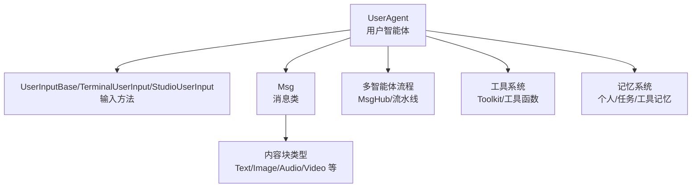
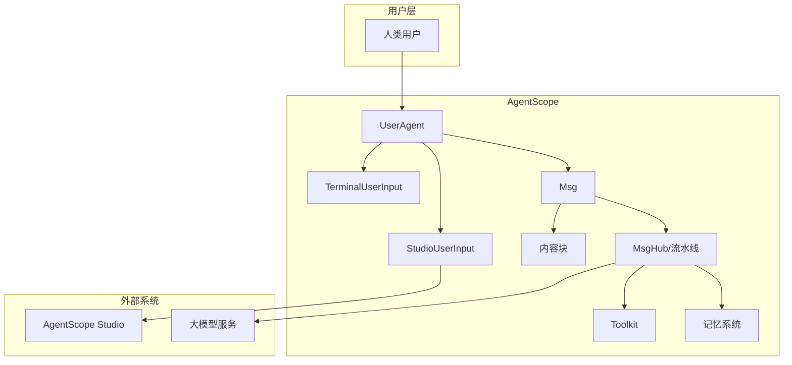
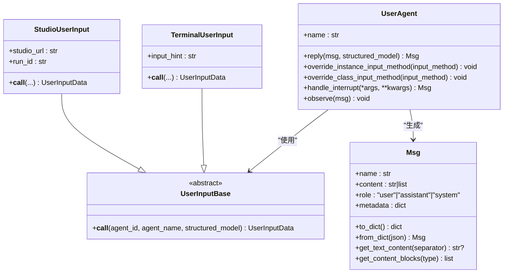
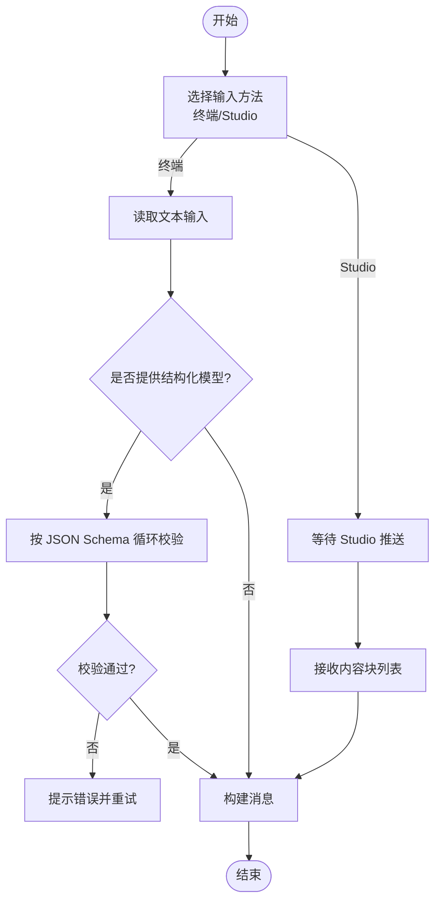
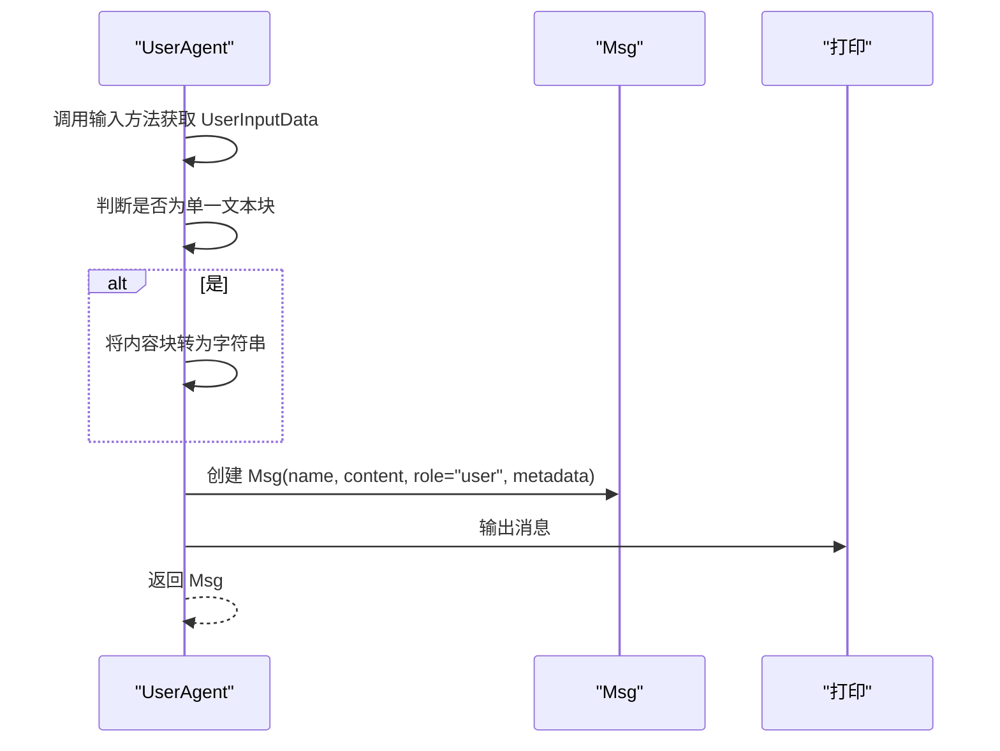
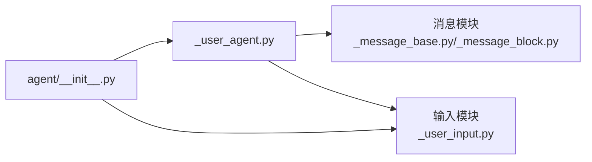

# 用户智能体概念

<cite>
**本文引用的文件**
- [src/agentscope/agent/_user_agent.py](file://src/agentscope/agent/_user_agent.py)
- [src/agentscope/agent/_user_input.py](file://src/agentscope/agent/_user_input.py)
- [src/agentscope/message/_message_base.py](file://src/agentscope/message/_message_base.py)
- [src/agentscope/message/_message_block.py](file://src/agentscope/message/_message_block.py)
- [src/agentscope/agent/__init__.py](file://src/agentscope/agent/__init__.py)
- [examples/workflows/multiagent_debate/main.py](file://examples/workflows/multiagent_debate/main.py)
- [examples/workflows/multiagent_conversation/main.py](file://examples/workflows/multiagent_conversation/main.py)
- [tests/user_input_test.py](file://tests/user_input_test.py)
- [src/agentscope/tool/__init__.py](file://src/agentscope/tool/__init__.py)
- [src/agentscope/memory/_long_term_memory/_reme/_reme_personal_long_term_memory.py](file://src/agentscope/memory/_long_term_memory/_reme/_reme_personal_long_term_memory.py)
</cite>

## 目录
1. [引言](#引言)
2. [项目结构](#项目结构)
3. [核心组件](#核心组件)
4. [架构总览](#架构总览)
5. [详细组件分析](#详细组件分析)
6. [依赖分析](#依赖分析)
7. [性能考虑](#性能考虑)
8. [故障排查指南](#故障排查指南)
9. [结论](#结论)
10. [附录](#附录)

## 引言
本篇文档围绕 AgentScope 的“用户智能体”（UserAgent）展开，系统性阐述其在多智能体系统中的定位与职责：作为人类交互的统一入口，负责接收并标准化来自不同来源的用户输入，将其转换为系统内通用的消息格式，并驱动后续多智能体流程。文档将从设计理念、输入处理机制、消息生成过程、与工具系统和记忆系统的集成、配置选项与错误处理策略等方面进行深入解析，并提供可直接参考的代码路径与示例。

## 项目结构
用户智能体相关的核心代码位于 agentscope 的 agent 子模块，配合 message 模块的消息定义与 block 类型，以及工具与记忆模块的扩展能力，形成完整的用户交互闭环。

图示来源
- [src/agentscope/agent/_user_agent.py:12-29](file://src/agentscope/agent/_user_agent.py#L12-L29)
- [src/agentscope/agent/_user_input.py:39-152](file://src/agentscope/agent/_user_input.py#L39-L152)
- [src/agentscope/message/_message_base.py:21-74](file://src/agentscope/message/_message_base.py#L21-L74)
- [src/agentscope/message/_message_block.py:9-77](file://src/agentscope/message/_message_block.py#L9-L77)

章节来源
- [src/agentscope/agent/_user_agent.py:12-29](file://src/agentscope/agent/_user_agent.py#L12-L29)
- [src/agentscope/agent/_user_input.py:39-152](file://src/agentscope/agent/_user_input.py#L39-L152)
- [src/agentscope/message/_message_base.py:21-74](file://src/agentscope/message/_message_base.py#L21-L74)
- [src/agentscope/message/_message_block.py:9-77](file://src/agentscope/message/_message_block.py#L9-L77)

## 核心组件
- 用户智能体（UserAgent）
  - 职责：等待并收集用户输入，将其封装为标准消息对象，供多智能体流程消费。
  - 关键点：支持通过实例或类级别覆盖输入方法；支持结构化输出提示与校验。
- 输入方法（UserInputBase 及其实现）
  - 终端输入（TerminalUserInput）：面向命令行的文本与结构化输入。
  - Studio 输入（StudioUserInput）：通过 WebSocket 与 AgentScope Studio 交互，支持多模态与结构化输入。
- 消息模型（Msg 与内容块）
  - 支持纯文本与多模态内容块组合；消息元数据用于承载结构化输出。
- 工具系统（Toolkit）
  - 提供文件读写、多模态转换等工具，可与用户智能体协作完成复杂任务。
- 记忆系统（ReMe 等）
  - 通过记录/检索接口与用户智能体结合，实现上下文增强与个性化服务。

章节来源
- [src/agentscope/agent/_user_agent.py:12-29](file://src/agentscope/agent/_user_agent.py#L12-L29)
- [src/agentscope/agent/_user_input.py:39-152](file://src/agentscope/agent/_user_input.py#L39-L152)
- [src/agentscope/message/_message_base.py:21-74](file://src/agentscope/message/_message_base.py#L21-L74)
- [src/agentscope/message/_message_block.py:9-77](file://src/agentscope/message/_message_block.py#L9-L77)
- [src/agentscope/tool/__init__.py:25-44](file://src/agentscope/tool/__init__.py#L25-L44)

## 架构总览
用户智能体在多智能体系统中的位置如下：

图示来源
- [src/agentscope/agent/_user_agent.py:30-76](file://src/agentscope/agent/_user_agent.py#L30-L76)
- [src/agentscope/agent/_user_input.py:154-416](file://src/agentscope/agent/_user_input.py#L154-L416)
- [src/agentscope/message/_message_base.py:21-74](file://src/agentscope/message/_message_base.py#L21-L74)
- [src/agentscope/message/_message_block.py:9-77](file://src/agentscope/message/_message_block.py#L9-L77)

## 详细组件分析

### 用户智能体（UserAgent）
- 设计理念
  - 将人类输入抽象为统一的消息对象，屏蔽底层输入来源差异（终端、Web UI、Studio 等），确保多智能体流程的一致性。
- 输入处理
  - 通过当前绑定的输入方法获取用户输入；若提供结构化模型，则引导用户按 schema 填写字段。
- 消息生成
  - 将单文本块简化为字符串，其余情况保留为内容块列表；消息角色固定为 user；结构化输出放入 metadata。
- 集成能力
  - 可通过实例或类方法覆盖输入方法，适配不同运行环境。
  - 与 MsgHub/流水线无缝衔接，参与广播与轮询对话。

图示来源
- [src/agentscope/agent/_user_agent.py:12-129](file://src/agentscope/agent/_user_agent.py#L12-L129)
- [src/agentscope/agent/_user_input.py:39-152](file://src/agentscope/agent/_user_input.py#L39-L152)
- [src/agentscope/agent/_user_input.py:154-416](file://src/agentscope/agent/_user_input.py#L154-L416)
- [src/agentscope/message/_message_base.py:21-242](file://src/agentscope/message/_message_base.py#L21-L242)

章节来源
- [src/agentscope/agent/_user_agent.py:30-76](file://src/agentscope/agent/_user_agent.py#L30-L76)
- [src/agentscope/agent/_user_agent.py:78-114](file://src/agentscope/agent/_user_agent.py#L78-L114)
- [src/agentscope/agent/_user_agent.py:115-129](file://src/agentscope/agent/_user_agent.py#L115-L129)

### 输入处理机制（文本、多模态、验证）
- 文本输入
  - 终端输入：直接读取用户文本；若提供结构化模型，按 JSON Schema 逐项校验并收集。
- 多模态输入
  - Studio 输入：通过事件推送返回内容块列表（文本、图像、音频、视频等），由用户智能体原样保留。
- 输入验证
  - 使用 JSON Schema 对结构化字段进行类型与约束校验；对整数等类型进行二次解析与错误提示。
- 错误处理
  - 连接 Studio 时具备重连与超时检测；请求失败会抛出明确异常。

图示来源
- [src/agentscope/agent/_user_input.py:75-151](file://src/agentscope/agent/_user_input.py#L75-L151)
- [src/agentscope/agent/_user_input.py:336-405](file://src/agentscope/agent/_user_input.py#L336-L405)

章节来源
- [src/agentscope/agent/_user_input.py:75-151](file://src/agentscope/agent/_user_input.py#L75-L151)
- [src/agentscope/agent/_user_input.py:154-416](file://src/agentscope/agent/_user_input.py#L154-L416)

### 消息生成过程（标准化与打印）
- 单一文本块优化：当仅包含一个文本块时，自动降级为字符串，便于下游显示与处理。
- 角色与元数据：消息角色固定为 user；结构化输出放入 metadata 字段，便于后续解析。
- 打印输出：调用内部打印逻辑输出消息，便于调试与可视化。

图示来源
- [src/agentscope/agent/_user_agent.py:50-76](file://src/agentscope/agent/_user_agent.py#L50-L76)
- [src/agentscope/message/_message_base.py:24-74](file://src/agentscope/message/_message_base.py#L24-L74)

章节来源
- [src/agentscope/agent/_user_agent.py:50-76](file://src/agentscope/agent/_user_agent.py#L50-L76)
- [src/agentscope/message/_message_base.py:24-74](file://src/agentscope/message/_message_base.py#L24-L74)

### 与工具系统的集成
- 工具系统提供文件操作、多模态转换等能力，用户智能体可将用户输入转化为工具调用参数，或在对话中嵌入工具结果。
- 典型场景：用户上传图片后触发图像识别工具，或将文本转为语音输出。

章节来源
- [src/agentscope/tool/__init__.py:25-44](file://src/agentscope/tool/__init__.py#L25-L44)

### 与记忆系统的结合
- 个人记忆（ReMePersonalLongTermMemory）：记录用户偏好、习惯等信息，支持工具函数与直接接口两种使用方式。
- 任务记忆与工具记忆：辅助智能体在多轮对话中保持上下文一致性与执行指导。

章节来源
- [src/agentscope/memory/_long_term_memory/_reme/_reme_personal_long_term_memory.py:39-73](file://src/agentscope/memory/_long_term_memory/_reme/_reme_personal_long_term_memory.py#L39-L73)

### 配置选项与错误处理策略
- 输入模式
  - 实例级覆盖：通过实例方法替换当前实例的输入方法。
  - 类级覆盖：通过类方法替换整个类的默认输入方法。
- 验证规则
  - 结构化模型基于 Pydantic/JSON Schema；必填字段强制校验，类型转换失败会提示并重试。
- 错误处理
  - Studio 连接具备重连与超时控制；网络请求失败抛出明确异常；终端输入异常时提示并继续。

章节来源
- [src/agentscope/agent/_user_agent.py:78-114](file://src/agentscope/agent/_user_agent.py#L78-L114)
- [src/agentscope/agent/_user_input.py:154-416](file://src/agentscope/agent/_user_input.py#L154-L416)

### 代码示例（创建、配置与使用）
- 在多智能体辩论场景中，用户智能体可作为“主持人”或“参与者”的输入入口，结合结构化输出模型进行决策判断。
- 在多智能体对话场景中，用户智能体负责引入初始消息或推动对话进展。

章节来源
- [examples/workflows/multiagent_debate/main.py:85-131](file://examples/workflows/multiagent_debate/main.py#L85-L131)
- [examples/workflows/multiagent_conversation/main.py:38-81](file://examples/workflows/multiagent_conversation/main.py#L38-L81)

## 依赖分析
- UserAgent 依赖
  - 输入方法：TerminalUserInput 或 StudioUserInput
  - 消息模型：Msg 与内容块类型
- 模块导出
  - agent/__init__.py 导出 UserAgent、UserInputBase、TerminalUserInput、StudioUserInput 等，便于上层直接引用。

图示来源
- [src/agentscope/agent/_user_agent.py:12-29](file://src/agentscope/agent/_user_agent.py#L12-L29)
- [src/agentscope/agent/_user_input.py:39-152](file://src/agentscope/agent/_user_input.py#L39-L152)
- [src/agentscope/message/_message_base.py:21-74](file://src/agentscope/message/_message_base.py#L21-L74)
- [src/agentscope/message/_message_block.py:9-77](file://src/agentscope/message/_message_block.py#L9-L77)
- [src/agentscope/agent/__init__.py:6-28](file://src/agentscope/agent/__init__.py#L6-L28)

章节来源
- [src/agentscope/agent/__init__.py:6-28](file://src/agentscope/agent/__init__.py#L6-L28)

## 性能考虑
- 输入方法选择
  - 终端输入适合快速原型与本地开发；Studio 输入适合远程协作与可视化调试。
- 消息构建
  - 单文本块降级可减少序列化与传输开销；多模态内容块保留有利于丰富交互体验。
- 工具与记忆
  - 合理使用工具与记忆可减少重复计算与无效往返，提升整体响应速度。

## 故障排查指南
- 连接 Studio 失败
  - 检查 studio_url 与 run_id 是否正确；确认网络可达与认证信息有效；关注重连日志与超时提示。
- 结构化输入校验失败
  - 查看字段类型与约束；确保整数等类型可被解析；必要时提供默认值或放宽约束。
- 终端输入异常
  - 确认输入编码与回退处理；检查必填字段是否遗漏。

章节来源
- [src/agentscope/agent/_user_input.py:286-335](file://src/agentscope/agent/_user_input.py#L286-L335)
- [src/agentscope/agent/_user_input.py:108-147](file://src/agentscope/agent/_user_input.py#L108-L147)
- [tests/user_input_test.py:15-44](file://tests/user_input_test.py#L15-L44)

## 结论
用户智能体在 AgentScope 中承担“人类交互入口”的关键角色：它以统一的消息格式承接来自不同渠道的用户输入，屏蔽底层差异，使多智能体系统能够稳定地进行对话、推理与执行。通过灵活的输入方法、完善的结构化校验与丰富的工具/记忆集成，用户智能体为构建复杂的人机协同应用提供了坚实基础。

## 附录
- 相关示例与测试
  - 多智能体辩论与对话工作流展示了用户智能体在真实场景中的使用方式。
  - 单元测试验证了终端输入与结构化输出的行为。

章节来源
- [examples/workflows/multiagent_debate/main.py:85-131](file://examples/workflows/multiagent_debate/main.py#L85-L131)
- [examples/workflows/multiagent_conversation/main.py:38-81](file://examples/workflows/multiagent_conversation/main.py#L38-L81)
- [tests/user_input_test.py:15-44](file://tests/user_input_test.py#L15-L44)