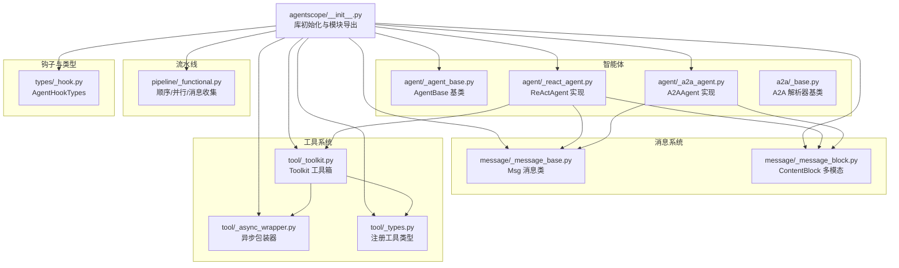
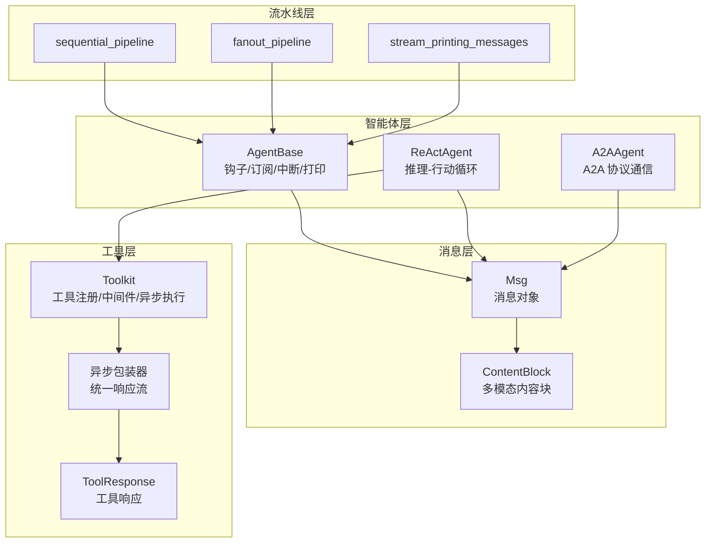
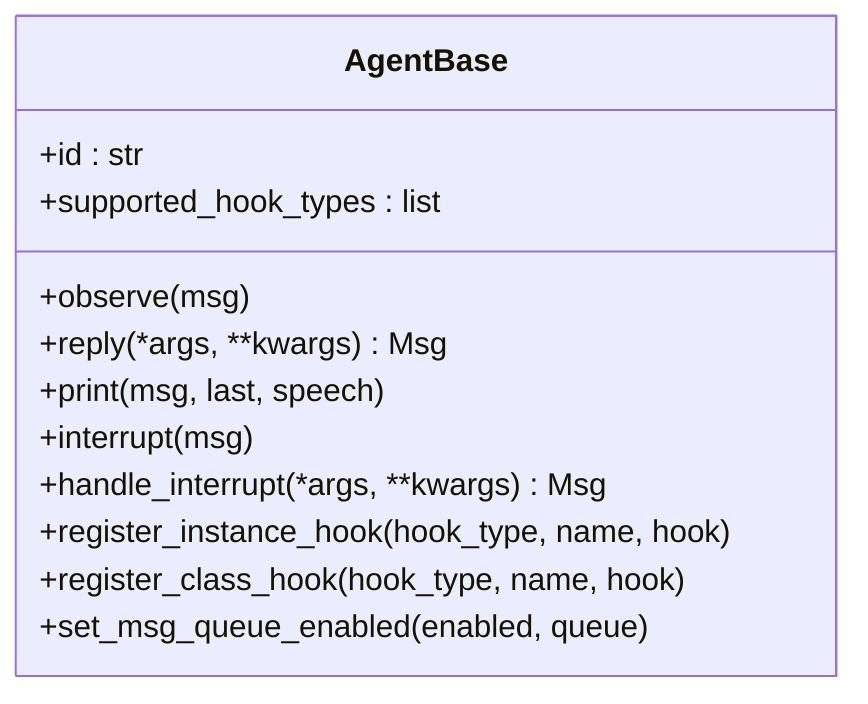
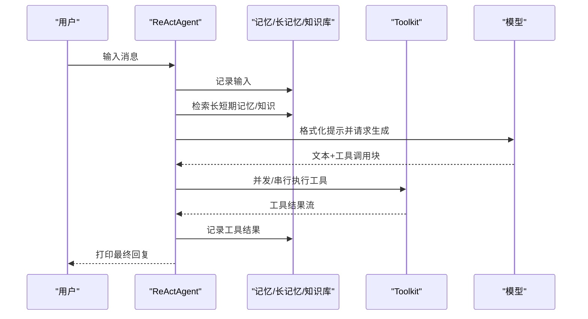
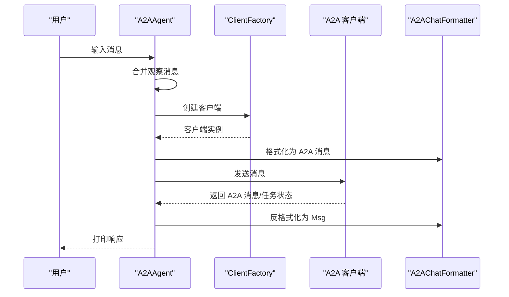
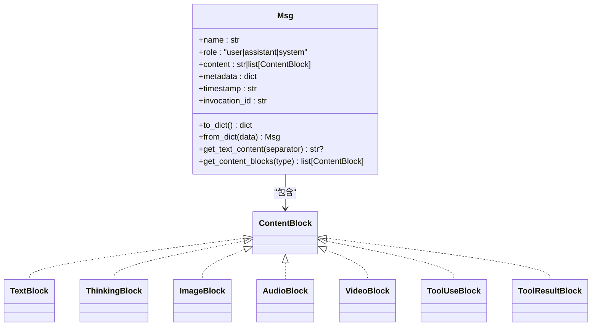
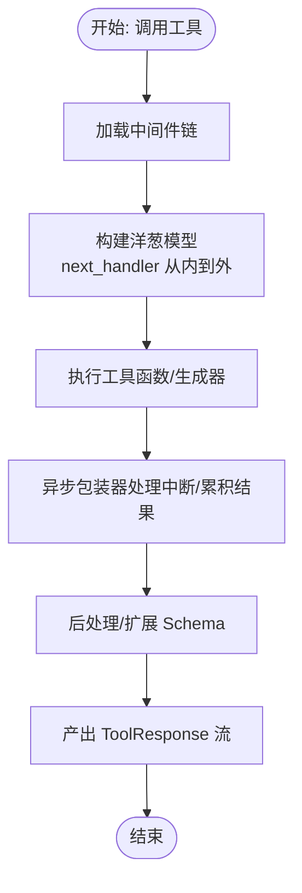
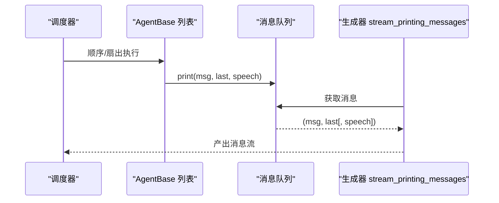
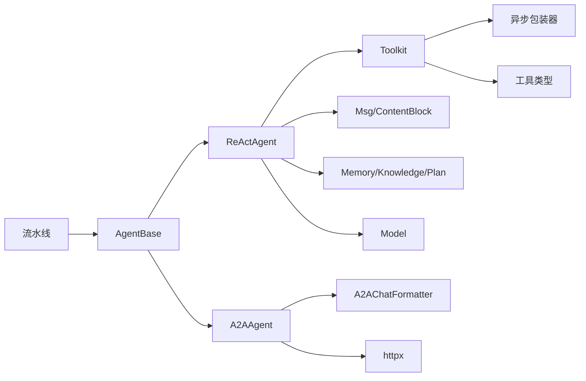

# 核心概念

<cite>
**本文引用的文件**
- [src/agentscope/__init__.py](file://src/agentscope/__init__.py)
- [src/agentscope/agent/_agent_base.py](file://src/agentscope/agent/_agent_base.py)
- [src/agentscope/message/_message_base.py](file://src/agentscope/message/_message_base.py)
- [src/agentscope/message/_message_block.py](file://src/agentscope/message/_message_block.py)
- [src/agentscope/tool/_toolkit.py](file://src/agentscope/tool/_toolkit.py)
- [src/agentscope/tool/_async_wrapper.py](file://src/agentscope/tool/_async_wrapper.py)
- [src/agentscope/tool/_types.py](file://src/agentscope/tool/_types.py)
- [src/agentscope/pipeline/_functional.py](file://src/agentscope/pipeline/_functional.py)
- [src/agentscope/agent/_react_agent.py](file://src/agentscope/agent/_react_agent.py)
- [src/agentscope/agent/_a2a_agent.py](file://src/agentscope/agent/_a2a_agent.py)
- [src/agentscope/a2a/_base.py](file://src/agentscope/a2a/_base.py)
- [src/agentscope/types/_hook.py](file://src/agentscope/types/_hook.py)
- [examples/agent/react_agent/main.py](file://examples/agent/react_agent/main.py)
- [examples/agent/a2a_agent/main.py](file://examples/agent/a2a_agent/main.py)
- [docs/tutorial/en/src/task_agent.py](file://docs/tutorial/en/src/task_agent.py)
- [docs/tutorial/en/src/task_middleware.py](file://docs/tutorial/en/src/task_middleware.py)
- [tests/toolkit_middleware_test.py](file://tests/toolkit_middleware_test.py)
- [tests/pipeline_test.py](file://tests/pipeline_test.py)
</cite>

## 目录
1. [引言](#引言)
2. [项目结构](#项目结构)
3. [核心组件](#核心组件)
4. [架构总览](#架构总览)
5. [详细组件分析](#详细组件分析)
6. [依赖分析](#依赖分析)
7. [性能考虑](#性能考虑)
8. [故障排查指南](#故障排查指南)
9. [结论](#结论)
10. [附录](#附录)

## 引言
本文件面向希望深入理解 AgentScope 智能体系统核心概念的开发者与研究者，围绕以下主题展开：AgentBase 基类的设计理念、ReAct 智能体的推理-行动循环机制、A2A 智能体的 Agent-to-Agent 通信协议；消息系统（Msg 与 ContentBlock 的多模态支持）、消息钩子机制及其生命周期管理；工具系统（Toolkit 工具箱、中间件链、异步执行）；以及流水线系统（顺序/并行执行、消息收集器）。文中通过代码级图表与路径引用，帮助读者建立从概念到实现的完整认知。

## 项目结构
AgentScope 采用模块化分层组织：顶层模块导出统一入口与运行配置，核心能力分布在 agent、message、tool、pipeline、a2a 等子包中。下图展示与本文相关的关键模块与文件：

**图表来源**
- [src/agentscope/__init__.py:1-183](file://src/agentscope/__init__.py#L1-L183)
- [src/agentscope/agent/_agent_base.py:1-775](file://src/agentscope/agent/_agent_base.py#L1-L775)
- [src/agentscope/agent/_react_agent.py:1-800](file://src/agentscope/agent/_react_agent.py#L1-L800)
- [src/agentscope/agent/_a2a_agent.py:1-289](file://src/agentscope/agent/_a2a_agent.py#L1-L289)
- [src/agentscope/a2a/_base.py:1-26](file://src/agentscope/a2a/_base.py#L1-L26)
- [src/agentscope/message/_message_base.py:1-242](file://src/agentscope/message/_message_base.py#L1-L242)
- [src/agentscope/message/_message_block.py:1-129](file://src/agentscope/message/_message_block.py#L1-L129)
- [src/agentscope/tool/_toolkit.py:1-800](file://src/agentscope/tool/_toolkit.py#L1-L800)
- [src/agentscope/tool/_async_wrapper.py:1-110](file://src/agentscope/tool/_async_wrapper.py#L1-L110)
- [src/agentscope/tool/_types.py:1-161](file://src/agentscope/tool/_types.py#L1-L161)
- [src/agentscope/pipeline/_functional.py:1-193](file://src/agentscope/pipeline/_functional.py#L1-L193)
- [src/agentscope/types/_hook.py:1-26](file://src/agentscope/types/_hook.py#L1-L26)

**章节来源**
- [src/agentscope/__init__.py:1-183](file://src/agentscope/__init__.py#L1-L183)

## 核心组件
- AgentBase 基类：定义智能体通用接口（observe/reply/print/handle_interrupt），内置钩子系统（pre/post observe/reply/print）、订阅广播、中断处理、消息队列与流式输出控制等。
- ReActAgent：在 AgentBase 上实现“推理-行动”循环，支持实时中断、内存压缩、并行工具调用、结构化输出、长短期记忆、RAG 知识检索、计划工具组等。
- A2AAgent：基于 A2A 协议与远程智能体通信，负责双向格式转换、任务生命周期管理、制品处理与状态跟踪。
- 消息系统：Msg 表达消息，ContentBlock 支持文本、思考、图像、音频、视频、工具调用与结果等多模态内容块。
- 工具系统：Toolkit 负责工具注册、分组、中间件链、扩展 JSON Schema、异步执行与后台任务管理；异步包装器统一处理同步/异步/生成器返回。
- 流水线系统：提供顺序执行、扇出并行、消息收集器（流式打印）等能力，便于多智能体协作与可观测性。

**章节来源**
- [src/agentscope/agent/_agent_base.py:1-775](file://src/agentscope/agent/_agent_base.py#L1-L775)
- [src/agentscope/agent/_react_agent.py:1-800](file://src/agentscope/agent/_react_agent.py#L1-L800)
- [src/agentscope/agent/_a2a_agent.py:1-289](file://src/agentscope/agent/_a2a_agent.py#L1-L289)
- [src/agentscope/message/_message_base.py:1-242](file://src/agentscope/message/_message_base.py#L1-L242)
- [src/agentscope/message/_message_block.py:1-129](file://src/agentscope/message/_message_block.py#L1-L129)
- [src/agentscope/tool/_toolkit.py:1-800](file://src/agentscope/tool/_toolkit.py#L1-L800)
- [src/agentscope/tool/_async_wrapper.py:1-110](file://src/agentscope/tool/_async_wrapper.py#L1-L110)
- [src/agentscope/pipeline/_functional.py:1-193](file://src/agentscope/pipeline/_functional.py#L1-L193)

## 架构总览
下图展示智能体系统各模块间的关系与交互路径，突出消息传递、工具调用与流水线编排：

**图表来源**
- [src/agentscope/agent/_agent_base.py:1-775](file://src/agentscope/agent/_agent_base.py#L1-L775)
- [src/agentscope/agent/_react_agent.py:1-800](file://src/agentscope/agent/_react_agent.py#L1-L800)
- [src/agentscope/agent/_a2a_agent.py:1-289](file://src/agentscope/agent/_a2a_agent.py#L1-L289)
- [src/agentscope/message/_message_base.py:1-242](file://src/agentscope/message/_message_base.py#L1-L242)
- [src/agentscope/message/_message_block.py:1-129](file://src/agentscope/message/_message_block.py#L1-L129)
- [src/agentscope/tool/_toolkit.py:1-800](file://src/agentscope/tool/_toolkit.py#L1-L800)
- [src/agentscope/tool/_async_wrapper.py:1-110](file://src/agentscope/tool/_async_wrapper.py#L1-L110)
- [src/agentscope/pipeline/_functional.py:1-193](file://src/agentscope/pipeline/_functional.py#L1-L193)

## 详细组件分析

### AgentBase 基类：设计理念与钩子机制
- 设计目标
  - 统一异步智能体接口：observe/reply/print/handle_interrupt，支持中断取消与后处理。
  - 钩子系统：支持 pre/post observe/reply/print，以及类级/实例级钩子注册与清理。
  - 订阅广播：将回复消息广播给订阅者，并剥离内部思考块以保护隐私。
  - 流式输出：通过消息队列与打印方法实现增量输出，支持音频播放与终端渲染。
- 生命周期管理
  - __call__ 包装 reply，捕获取消异常并调用 handle_interrupt，最后广播消息。
  - set_msg_queue_enabled 控制消息队列开关，配合 stream_printing_messages 使用。
- 关键路径
  - [AgentBase.__call__:448-467](file://src/agentscope/agent/_agent_base.py#L448-L467)
  - [AgentBase._broadcast_to_subscribers:469-486](file://src/agentscope/agent/_agent_base.py#L469-L486)
  - [AgentBase.print:205-275](file://src/agentscope/agent/_agent_base.py#L205-L275)
  - [AgentBase.register_instance_hook/register_class_hook:533-645](file://src/agentscope/agent/_agent_base.py#L533-L645)

**图表来源**
- [src/agentscope/agent/_agent_base.py:1-775](file://src/agentscope/agent/_agent_base.py#L1-L775)

**章节来源**
- [src/agentscope/agent/_agent_base.py:1-775](file://src/agentscope/agent/_agent_base.py#L1-L775)
- [src/agentscope/types/_hook.py:1-26](file://src/agentscope/types/_hook.py#L1-L26)

### ReAct 智能体：推理-行动循环机制
- 循环流程
  - 记忆记录与检索（长短期记忆、知识库、查询重写）
  - 推理阶段：格式化提示，调用模型生成文本与工具调用
  - 行动阶段：并发/串行执行工具调用，流式打印工具结果
  - 结构化输出：当需要时，调用完成函数生成结构化元数据
  - 内存压缩：超过阈值自动压缩旧上下文，保留最近若干条
- 关键路径
  - [ReActAgent.reply:376-537](file://src/agentscope/agent/_react_agent.py#L376-L537)
  - [ReActAgent._reasoning:540-655](file://src/agentscope/agent/_react_agent.py#L540-L655)
  - [ReActAgent._acting:657-714](file://src/agentscope/agent/_react_agent.py#L657-L714)
  - [ReActAgent._summarizing:725-796](file://src/agentscope/agent/_react_agent.py#L725-L796)

**图表来源**
- [src/agentscope/agent/_react_agent.py:1-800](file://src/agentscope/agent/_react_agent.py#L1-L800)
- [src/agentscope/tool/_toolkit.py:1-800](file://src/agentscope/tool/_toolkit.py#L1-L800)

**章节来源**
- [src/agentscope/agent/_react_agent.py:1-800](file://src/agentscope/agent/_react_agent.py#L1-L800)
- [docs/tutorial/en/src/task_agent.py:1-427](file://docs/tutorial/en/src/task_agent.py#L1-L427)

### A2A 智能体：Agent-to-Agent 通信协议
- 协议特性
  - 仅支持聊天场景（单用户-单助手）的消息往返
  - 不支持结构化输出
  - 本地存储观察消息并在 reply 合并发送
  - 使用 A2AChatFormatter 在 AgentScope 与 A2A 格式之间转换
- 关键路径
  - [A2AAgent.observe:154-176](file://src/agentscope/agent/_a2a_agent.py#L154-L176)
  - [A2AAgent.reply:177-260](file://src/agentscope/agent/_a2a_agent.py#L177-L260)
  - [AgentCardResolverBase:12-25](file://src/agentscope/a2a/_base.py#L12-L25)

**图表来源**
- [src/agentscope/agent/_a2a_agent.py:1-289](file://src/agentscope/agent/_a2a_agent.py#L1-L289)
- [src/agentscope/a2a/_base.py:1-26](file://src/agentscope/a2a/_base.py#L1-L26)

**章节来源**
- [src/agentscope/agent/_a2a_agent.py:1-289](file://src/agentscope/agent/_a2a_agent.py#L1-L289)
- [src/agentscope/a2a/_base.py:1-26](file://src/agentscope/a2a/_base.py#L1-L26)

### 消息系统：Msg 与 ContentBlock 的多模态支持
- Msg 设计
  - 统一消息结构：name/role/content/metadata/timestamp/invocation_id
  - 支持字符串或内容块列表；提供文本提取、内容块筛选等便捷方法
- ContentBlock 类型
  - 文本、思考、图像、音频、视频、工具调用、工具结果等
  - 支持 base64/url 两种媒体源
- 关键路径
  - [Msg.__init__/to_dict/from_dict/get_content_blocks:21-242](file://src/agentscope/message/_message_base.py#L21-L242)
  - [ContentBlock 类型定义:9-129](file://src/agentscope/message/_message_block.py#L9-L129)

**图表来源**
- [src/agentscope/message/_message_base.py:1-242](file://src/agentscope/message/_message_base.py#L1-L242)
- [src/agentscope/message/_message_block.py:1-129](file://src/agentscope/message/_message_block.py#L1-L129)

**章节来源**
- [src/agentscope/message/_message_base.py:1-242](file://src/agentscope/message/_message_base.py#L1-L242)
- [src/agentscope/message/_message_block.py:1-129](file://src/agentscope/message/_message_block.py#L1-L129)

### 工具系统：Toolkit、中间件链与异步执行
- Toolkit 设计
  - 工具注册与分组、动态扩展 JSON Schema、代理技能提示注入
  - 中间件链：运行时构建洋葱模型，支持预处理/后处理
  - 异步执行：后台任务管理、结果聚合、中断处理
- 中间件链工作原理
  - 运行时读取中间件列表，从内到外包裹，形成 next_handler 链
  - 支持同步/异步/生成器统一包装，保证 ToolResponse 流一致性
- 关键路径
  - [Toolkit.register_tool_function:274-534](file://src/agentscope/tool/_toolkit.py#L274-L534)
  - [Toolkit.get_json_schemas:558-619](file://src/agentscope/tool/_toolkit.py#L558-L619)
  - [中间件装饰器 _apply_middlewares:57-114](file://src/agentscope/tool/_toolkit.py#L57-L114)
  - [异步包装器 _async_generator_wrapper:63-110](file://src/agentscope/tool/_async_wrapper.py#L63-L110)
  - [RegisteredToolFunction.extended_json_schema:62-132](file://src/agentscope/tool/_types.py#L62-L132)

**图表来源**
- [src/agentscope/tool/_toolkit.py:1-800](file://src/agentscope/tool/_toolkit.py#L1-L800)
- [src/agentscope/tool/_async_wrapper.py:1-110](file://src/agentscope/tool/_async_wrapper.py#L1-L110)
- [src/agentscope/tool/_types.py:1-161](file://src/agentscope/tool/_types.py#L1-L161)

**章节来源**
- [src/agentscope/tool/_toolkit.py:1-800](file://src/agentscope/tool/_toolkit.py#L1-L800)
- [src/agentscope/tool/_async_wrapper.py:1-110](file://src/agentscope/tool/_async_wrapper.py#L1-L110)
- [src/agentscope/tool/_types.py:1-161](file://src/agentscope/tool/_types.py#L1-L161)
- [docs/tutorial/en/src/task_middleware.py:35-403](file://docs/tutorial/en/src/task_middleware.py#L35-L403)
- [tests/toolkit_middleware_test.py:41-86](file://tests/toolkit_middleware_test.py#L41-L86)

### 流水线系统：顺序/并行执行与消息收集器
- 顺序流水线：按序调用多个智能体，前一个输出作为下一个输入
- 扇出流水线：向多个智能体分发相同输入，可并发或串行执行
- 消息收集器：启用消息队列，收集智能体 print 的消息流，逐个产出（含是否为流式最后一块标记）
- 关键路径
  - [sequential_pipeline:10-44](file://src/agentscope/pipeline/_functional.py#L10-L44)
  - [fanout_pipeline:47-104](file://src/agentscope/pipeline/_functional.py#L47-L104)
  - [stream_printing_messages:107-193](file://src/agentscope/pipeline/_functional.py#L107-L193)

**图表来源**
- [src/agentscope/pipeline/_functional.py:1-193](file://src/agentscope/pipeline/_functional.py#L1-L193)
- [src/agentscope/agent/_agent_base.py:1-775](file://src/agentscope/agent/_agent_base.py#L1-L775)

**章节来源**
- [src/agentscope/pipeline/_functional.py:1-193](file://src/agentscope/pipeline/_functional.py#L1-L193)
- [tests/pipeline_test.py:353-438](file://tests/pipeline_test.py#L353-L438)

## 依赖分析
- 模块耦合
  - ReActAgent 依赖 Toolkit、消息、模型、记忆、RAG、计划、TTS 等模块
  - A2AAgent 依赖 A2A 客户端工厂与格式化器
  - AgentBase 为所有智能体提供统一基座，被 ReActAgent/A2AAgent 继承
  - Toolkit 依赖异步包装器与工具类型定义
  - 流水线依赖 AgentBase 与 asyncio 队列
- 外部依赖
  - httpx（A2A 客户端）
  - pydantic（结构化输出与 Schema 扩展）
  - shortuuid（唯一标识）

**图表来源**
- [src/agentscope/agent/_react_agent.py:1-800](file://src/agentscope/agent/_react_agent.py#L1-L800)
- [src/agentscope/agent/_a2a_agent.py:1-289](file://src/agentscope/agent/_a2a_agent.py#L1-L289)
- [src/agentscope/tool/_toolkit.py:1-800](file://src/agentscope/tool/_toolkit.py#L1-L800)
- [src/agentscope/pipeline/_functional.py:1-193](file://src/agentscope/pipeline/_functional.py#L1-L193)

**章节来源**
- [src/agentscope/agent/_react_agent.py:1-800](file://src/agentscope/agent/_react_agent.py#L1-L800)
- [src/agentscope/agent/_a2a_agent.py:1-289](file://src/agentscope/agent/_a2a_agent.py#L1-L289)
- [src/agentscope/tool/_toolkit.py:1-800](file://src/agentscope/tool/_toolkit.py#L1-L800)
- [src/agentscope/pipeline/_functional.py:1-193](file://src/agentscope/pipeline/_functional.py#L1-L193)

## 性能考虑
- 并行工具调用：ReActAgent 在模型支持的前提下使用 asyncio.gather 并行执行工具，需确保工具本身为异步以获得收益。
- 内存压缩：当上下文长度接近阈值时进行压缩，减少 token 使用并提升推理速度。
- 流式输出：通过消息队列与 print 的增量输出避免阻塞事件循环，提高交互体验。
- 中间件链：中间件按注册顺序执行，建议将轻量逻辑前置，耗时逻辑置于后置，避免阻塞。

[本节为通用指导，无需特定文件引用]

## 故障排查指南
- 中断处理
  - AgentBase 捕获取消异常并调用 handle_interrupt，A2AAgent 返回中断提示并加入观察消息以便后续上下文延续。
  - 参考：[AgentBase.__call__:448-467](file://src/agentscope/agent/_agent_base.py#L448-L467)、[A2AAgent.handle_interrupt:263-288](file://src/agentscope/agent/_a2a_agent.py#L263-L288)
- 工具执行异常
  - 异步包装器在中断时追加中断信息并标记 is_interrupted/is_last，便于前端感知。
  - 参考：[_async_generator_wrapper:63-110](file://src/agentscope/tool/_async_wrapper.py#L63-L110)
- 流式消息收集
  - stream_printing_messages 通过队列与特殊信号结束，异常会在消费完成后抛出，注意检查任务异常。
  - 参考：[stream_printing_messages:107-193](file://src/agentscope/pipeline/_functional.py#L107-L193)、[tests/pipeline_test.py:353-438](file://tests/pipeline_test.py#L353-L438)

**章节来源**
- [src/agentscope/agent/_agent_base.py:1-775](file://src/agentscope/agent/_agent_base.py#L1-L775)
- [src/agentscope/agent/_a2a_agent.py:1-289](file://src/agentscope/agent/_a2a_agent.py#L1-L289)
- [src/agentscope/tool/_async_wrapper.py:1-110](file://src/agentscope/tool/_async_wrapper.py#L1-L110)
- [src/agentscope/pipeline/_functional.py:1-193](file://src/agentscope/pipeline/_functional.py#L1-L193)
- [tests/pipeline_test.py:353-438](file://tests/pipeline_test.py#L353-L438)

## 结论
AgentScope 通过 AgentBase 提供一致的智能体抽象，ReActAgent 将“推理-行动”循环工程化，A2AAgent 实现跨协议通信，消息系统与工具系统分别提供多模态表达与可插拔能力，流水线系统则支撑多智能体协作与可观测性。理解这些核心概念有助于在复杂场景中高效组合与扩展智能体能力。

[本节为总结，无需特定文件引用]

## 附录
- 快速上手示例
  - ReActAgent 示例入口：[examples/agent/react_agent/main.py:1-51](file://examples/agent/react_agent/main.py#L1-L51)
  - A2AAgent 示例入口：[examples/agent/a2a_agent/main.py:1-28](file://examples/agent/a2a_agent/main.py#L1-L28)
- 教程与测试参考
  - ReActAgent 教程（实时中断、内存压缩、并行工具调用、结构化输出）：[docs/tutorial/en/src/task_agent.py:1-427](file://docs/tutorial/en/src/task_agent.py#L1-L427)
  - 中间件示例与测试：[docs/tutorial/en/src/task_middleware.py:35-403](file://docs/tutorial/en/src/task_middleware.py#L35-L403)、[tests/toolkit_middleware_test.py:41-86](file://tests/toolkit_middleware_test.py#L41-L86)

**章节来源**
- [examples/agent/react_agent/main.py:1-51](file://examples/agent/react_agent/main.py#L1-L51)
- [examples/agent/a2a_agent/main.py:1-28](file://examples/agent/a2a_agent/main.py#L1-L28)
- [docs/tutorial/en/src/task_agent.py:1-427](file://docs/tutorial/en/src/task_agent.py#L1-L427)
- [docs/tutorial/en/src/task_middleware.py:35-403](file://docs/tutorial/en/src/task_middleware.py#L35-L403)
- [tests/toolkit_middleware_test.py:41-86](file://tests/toolkit_middleware_test.py#L41-L86)