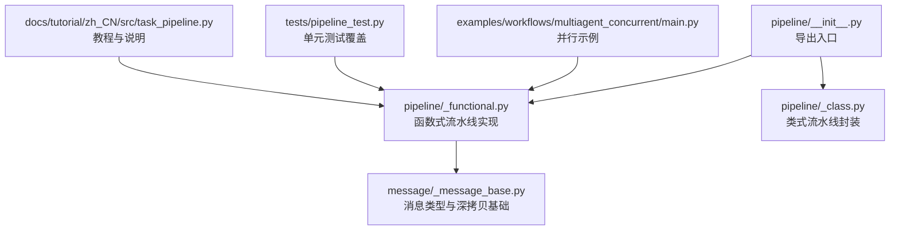
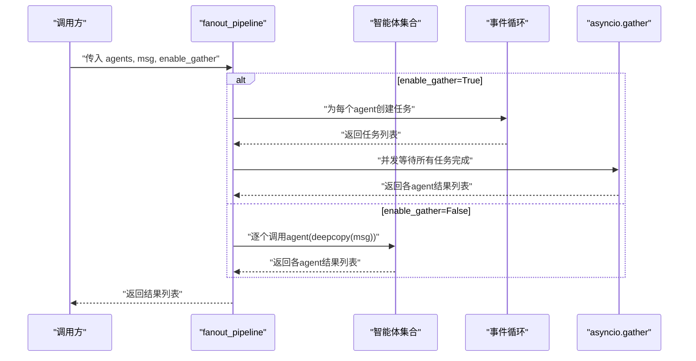
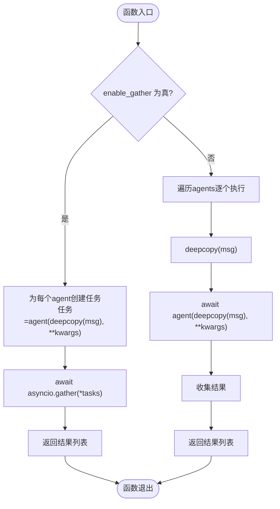
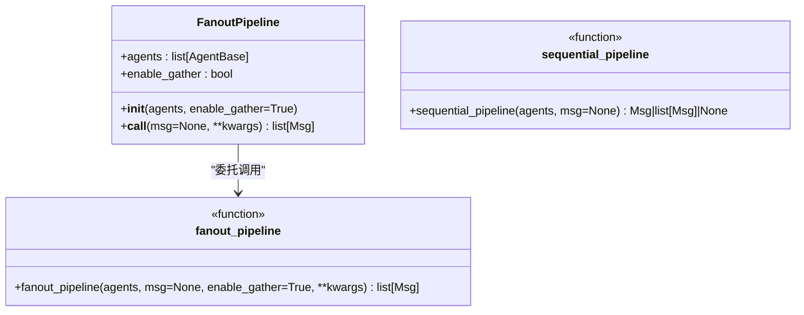
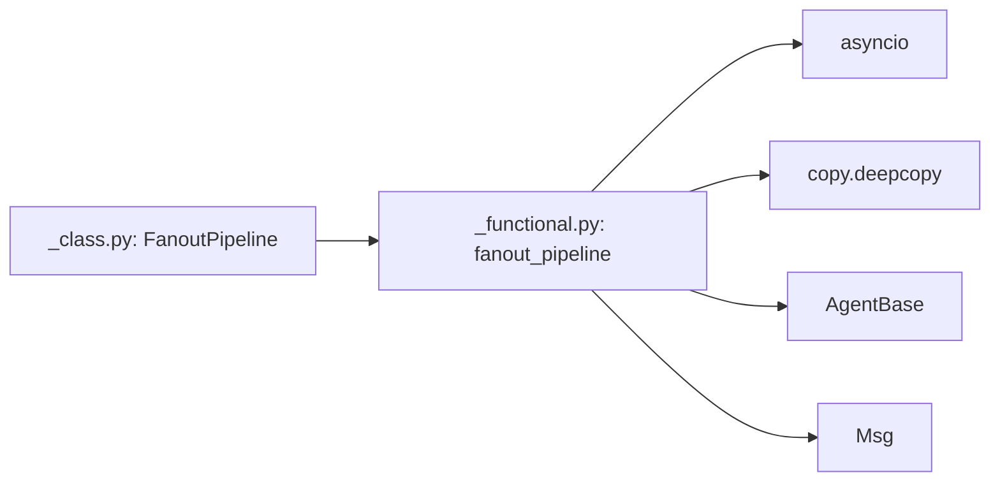

# 并行执行流水线

<cite>
**本文引用的文件**
- [src/agentscope/pipeline/_functional.py](file://src/agentscope/pipeline/_functional.py)
- [src/agentscope/pipeline/_class.py](file://src/agentscope/pipeline/_class.py)
- [src/agentscope/pipeline/__init__.py](file://src/agentscope/pipeline/__init__.py)
- [examples/workflows/multiagent_concurrent/main.py](file://examples/workflows/multiagent_concurrent/main.py)
- [tests/pipeline_test.py](file://tests/pipeline_test.py)
- [docs/tutorial/zh_CN/src/task_pipeline.py](file://docs/tutorial/zh_CN/src/task_pipeline.py)
- [src/agentscope/message/_message_base.py](file://src/agentscope/message/_message_base.py)
</cite>

## 目录
1. [简介](#简介)
2. [项目结构](#项目结构)
3. [核心组件](#核心组件)
4. [架构总览](#架构总览)
5. [详细组件分析](#详细组件分析)
6. [依赖分析](#依赖分析)
7. [性能考量](#性能考量)
8. [故障排查指南](#故障排查指南)
9. [结论](#结论)
10. [附录](#附录)

## 简介
本篇文档聚焦于 AgentScope 的并行执行流水线，系统性解析 fanout_pipeline 函数的实现原理与工作机制，涵盖：
- 消息分发机制与并发执行策略
- 并行流水线工作流程（消息深拷贝、任务创建、结果收集）
- enable_gather 参数的作用与行为差异
- 并发与顺序执行的性能差异与适用场景
- 实际配置示例（智能体池、执行参数）
- 同步机制（asyncio.gather 协调策略）
- 资源管理与性能优化（内存、并发控制）
- 故障处理与错误恢复最佳实践

## 项目结构
并行执行流水线相关的核心代码位于 pipeline 模块，主要由函数式实现与类式封装组成，并通过统一导出接口暴露给用户。

图表来源
- [src/agentscope/pipeline/__init__.py:1-23](file://src/agentscope/pipeline/__init__.py#L1-L23)
- [src/agentscope/pipeline/_functional.py:1-193](file://src/agentscope/pipeline/_functional.py#L1-L193)
- [src/agentscope/pipeline/_class.py:1-91](file://src/agentscope/pipeline/_class.py#L1-L91)
- [src/agentscope/message/_message_base.py:1-200](file://src/agentscope/message/_message_base.py#L1-L200)
- [examples/workflows/multiagent_concurrent/main.py:1-94](file://examples/workflows/multiagent_concurrent/main.py#L1-L94)
- [tests/pipeline_test.py:1-439](file://tests/pipeline_test.py#L1-L439)
- [docs/tutorial/zh_CN/src/task_pipeline.py:1-284](file://docs/tutorial/zh_CN/src/task_pipeline.py#L1-L284)

章节来源
- [src/agentscope/pipeline/__init__.py:1-23](file://src/agentscope/pipeline/__init__.py#L1-L23)
- [src/agentscope/pipeline/_functional.py:1-193](file://src/agentscope/pipeline/_functional.py#L1-L193)
- [src/agentscope/pipeline/_class.py:1-91](file://src/agentscope/pipeline/_class.py#L1-L91)

## 核心组件
- 函数式并行流水线：fanout_pipeline
- 类式并行流水线：FanoutPipeline
- 辅助工具：sequential_pipeline（顺序流水线）、stream_printing_messages（流式消息聚合）

章节来源
- [src/agentscope/pipeline/_functional.py:47-104](file://src/agentscope/pipeline/_functional.py#L47-L104)
- [src/agentscope/pipeline/_class.py:43-90](file://src/agentscope/pipeline/_class.py#L43-L90)
- [src/agentscope/pipeline/__init__.py:7-12](file://src/agentscope/pipeline/__init__.py#L7-L12)

## 架构总览
并行流水线在 fanout_pipeline 内部根据 enable_gather 参数选择两种执行路径：
- 并发模式：为每个智能体创建独立任务，使用 asyncio.gather 统一调度与收集结果
- 顺序模式：逐个调用智能体，保证确定性但牺牲吞吐

图表来源
- [src/agentscope/pipeline/_functional.py:96-104](file://src/agentscope/pipeline/_functional.py#L96-L104)

## 详细组件分析

### fanout_pipeline 函数实现
- 输入参数
  - agents：智能体列表
  - msg：消息输入（支持 Msg、list[Msg]、None）
  - enable_gather：是否启用并发执行
  - kwargs：透传给每个智能体的额外参数
- 关键逻辑
  - 并发分支：为每个智能体创建任务，使用 asyncio.gather 收集结果
  - 顺序分支：逐个调用智能体，返回结果列表
- 深拷贝策略
  - 使用 deepcopy(msg) 为每个智能体提供独立输入副本，确保各智能体处理互不影响

图表来源
- [src/agentscope/pipeline/_functional.py:96-104](file://src/agentscope/pipeline/_functional.py#L96-L104)

章节来源
- [src/agentscope/pipeline/_functional.py:47-104](file://src/agentscope/pipeline/_functional.py#L47-L104)

### FanoutPipeline 类
- 设计目的：提供可复用、可配置的并行流水线实例
- 关键点
  - 构造函数保存 agents 与 enable_gather
  - __call__ 方法内部委托 fanout_pipeline，保持一致行为
- 适用场景：多次复用同一组智能体的流水线配置

图表来源
- [src/agentscope/pipeline/_class.py:43-90](file://src/agentscope/pipeline/_class.py#L43-L90)
- [src/agentscope/pipeline/_functional.py:10-44](file://src/agentscope/pipeline/_functional.py#L10-L44)
- [src/agentscope/pipeline/_functional.py:47-104](file://src/agentscope/pipeline/_functional.py#L47-L104)

章节来源
- [src/agentscope/pipeline/_class.py:43-90](file://src/agentscope/pipeline/_class.py#L43-L90)

### 消息与深拷贝
- 消息类型：Msg 提供结构化消息与元数据字段
- 深拷贝语义：为每个智能体提供独立输入副本，避免共享状态导致的副作用
- 兼容性：支持 None 输入，空智能体列表直接返回空结果

章节来源
- [src/agentscope/message/_message_base.py:21-100](file://src/agentscope/message/_message_base.py#L21-L100)
- [src/agentscope/pipeline/_functional.py:96-104](file://src/agentscope/pipeline/_functional.py#L96-L104)

### 并发与顺序执行对比
- 并发执行（enable_gather=True，默认）
  - 优势：I/O 密集型场景吞吐高，整体耗时接近最长单智能体耗时
  - 风险：并发请求可能对下游服务造成压力
- 顺序执行（enable_gather=False）
  - 优势：确定性更强，资源占用可控，便于调试
  - 风险：总耗时为各智能体耗时之和

章节来源
- [docs/tutorial/zh_CN/src/task_pipeline.py:205-212](file://docs/tutorial/zh_CN/src/task_pipeline.py#L205-L212)
- [tests/pipeline_test.py:267-311](file://tests/pipeline_test.py#L267-L311)

### 实际配置与示例
- 示例一：使用 asyncio.gather 并行执行
  - 场景：三个智能体并发运行，记录各自耗时
  - 关键点：直接创建协程列表并传入 asyncio.gather
- 示例二：使用 fanout_pipeline 并行执行
  - 场景：通过函数式流水线一次性分发消息并收集结果
  - 关键点：enable_gather=True（默认），自动深拷贝与并发收集

章节来源
- [examples/workflows/multiagent_concurrent/main.py:67-93](file://examples/workflows/multiagent_concurrent/main.py#L67-L93)
- [tests/pipeline_test.py:267-311](file://tests/pipeline_test.py#L267-L311)

## 依赖分析
- fanout_pipeline 依赖
  - asyncio：任务创建与并发调度
  - copy.deepcopy：消息深拷贝
  - AgentBase、Msg：智能体与消息类型
- FanoutPipeline 依赖
  - 委托 fanout_pipeline，无额外外部依赖

图表来源
- [src/agentscope/pipeline/_functional.py:3-8](file://src/agentscope/pipeline/_functional.py#L3-L8)
- [src/agentscope/pipeline/_class.py:5-7](file://src/agentscope/pipeline/_class.py#L5-L7)

章节来源
- [src/agentscope/pipeline/_functional.py:3-8](file://src/agentscope/pipeline/_functional.py#L3-L8)
- [src/agentscope/pipeline/_class.py:5-7](file://src/agentscope/pipeline/_class.py#L5-L7)

## 性能考量
- 并发度与资源
  - 并发执行会创建多个任务，注意外部服务限流与网络带宽
  - 对于 CPU 密集型任务，建议评估事件循环与线程池配合
- 深拷贝成本
  - deepcopy 在大消息或复杂结构上存在开销，可根据业务权衡
- 结果收集
  - asyncio.gather 返回按创建顺序的结果列表，便于映射原始智能体顺序

章节来源
- [src/agentscope/pipeline/_functional.py:96-104](file://src/agentscope/pipeline/_functional.py#L96-L104)

## 故障排查指南
- 错误传播
  - 并发模式下，任一智能体抛出异常将被 asyncio.gather 捕获并传播
  - 建议在调用侧捕获异常并进行日志记录与重试策略
- 超时与取消
  - 可通过 asyncio.wait_for 包裹 fanout_pipeline，设定超时时间
- 调试技巧
  - 顺序执行（enable_gather=False）有助于定位问题智能体
  - 使用 stream_printing_messages 获取中间打印消息，辅助诊断

章节来源
- [src/agentscope/pipeline/_functional.py:107-193](file://src/agentscope/pipeline/_functional.py#L107-L193)
- [tests/pipeline_test.py:89-118](file://tests/pipeline_test.py#L89-L118)

## 结论
- fanout_pipeline 通过深拷贝与任务调度实现了“同一输入、多智能体并行”的通用模式
- enable_gather 控制并发与顺序，兼顾性能与稳定性
- 结合 FanoutPipeline 可实现可复用的流水线配置
- 在生产环境中应关注并发度、资源限制与错误处理策略

## 附录
- 相关接口导出
  - 通过 pipeline/__init__.py 统一导出 FanoutPipeline、fanout_pipeline 等

章节来源
- [src/agentscope/pipeline/__init__.py:14-22](file://src/agentscope/pipeline/__init__.py#L14-L22)