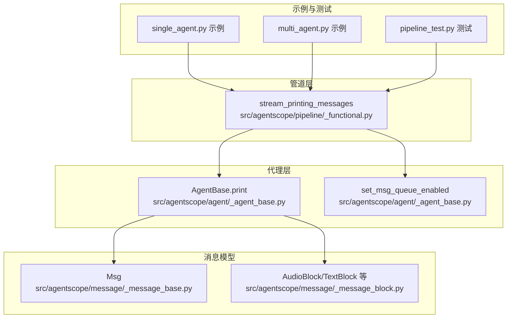
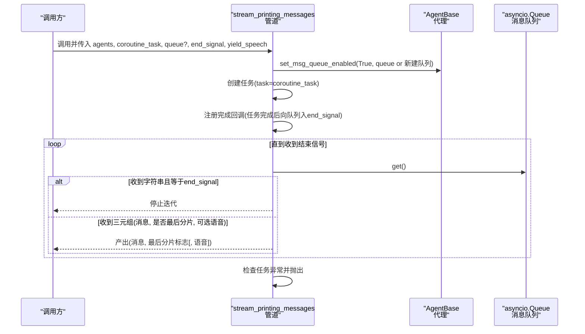
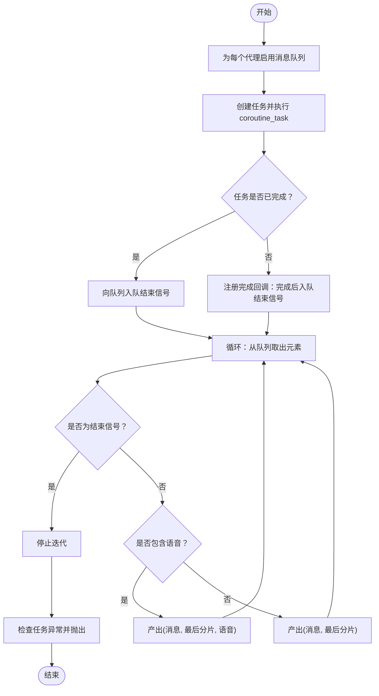
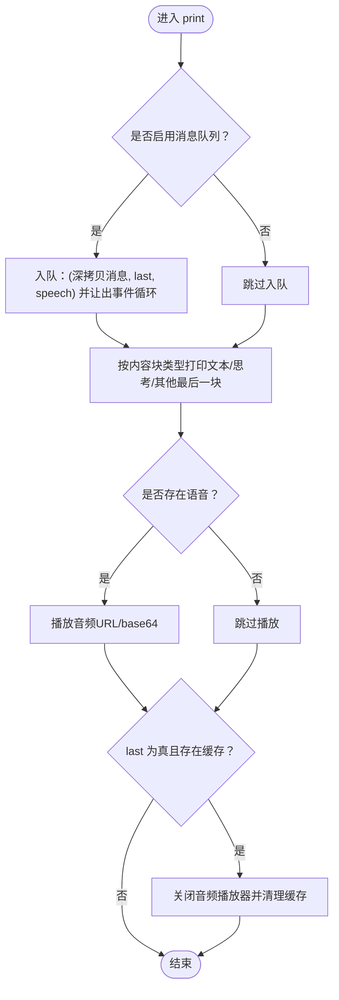
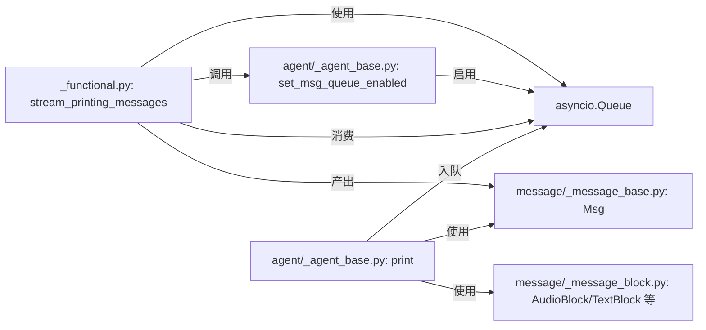

# 流式消息处理

<cite>
**本文引用的文件**
- [src/agentscope/pipeline/_functional.py](file://src/agentscope/pipeline/_functional.py)
- [src/agentscope/agent/_agent_base.py](file://src/agentscope/agent/_agent_base.py)
- [src/agentscope/message/_message_base.py](file://src/agentscope/message/_message_base.py)
- [src/agentscope/message/_message_block.py](file://src/agentscope/message/_message_block.py)
- [examples/functionality/stream_printing_messages/single_agent.py](file://examples/functionality/stream_printing_messages/single_agent.py)
- [examples/functionality/stream_printing_messages/multi_agent.py](file://examples/functionality/stream_printing_messages/multi_agent.py)
- [tests/pipeline_test.py](file://tests/pipeline_test.py)
</cite>

## 目录
1. [简介](#简介)
2. [项目结构](#项目结构)
3. [核心组件](#核心组件)
4. [架构总览](#架构总览)
5. [详细组件分析](#详细组件分析)
6. [依赖关系分析](#依赖关系分析)
7. [性能考虑](#性能考虑)
8. [故障排查指南](#故障排查指南)
9. [结论](#结论)
10. [附录](#附录)

## 简介
本文件围绕 AgentScope 的流式消息处理能力进行系统化说明，重点解释 stream_printing_messages 函数的实现原理与使用方法，涵盖以下主题：
- 消息队列机制与异步消息捕获
- 流式消息从“打印”到“入队/出队”再到“迭代输出”的完整流程
- 队列的创建、入队与出队操作
- end_signal 的作用与消息结束检测机制
- yield_speech 参数的功能与语音内容附加处理
- 实际代码示例：如何设置 coroutine_task 与 queue 参数
- 性能优化与内存管理策略
- 异常处理与错误恢复机制

## 项目结构
与流式消息处理直接相关的模块与文件如下：
- 流式消息管道：src/agentscope/pipeline/_functional.py
- 代理基类与消息打印/队列控制：src/agentscope/agent/_agent_base.py
- 消息与内容块类型定义：src/agentscope/message/_message_base.py、src/agentscope/message/_message_block.py
- 使用示例：examples/functionality/stream_printing_messages/single_agent.py、multi_agent.py
- 单元测试（含异常与结束信号）：tests/pipeline_test.py

图表来源
- [src/agentscope/pipeline/_functional.py:107-193](file://src/agentscope/pipeline/_functional.py#L107-L193)
- [src/agentscope/agent/_agent_base.py:205-275](file://src/agentscope/agent/_agent_base.py#L205-L275)
- [src/agentscope/agent/_agent_base.py:750-775](file://src/agentscope/agent/_agent_base.py#L750-L775)
- [src/agentscope/message/_message_base.py:21-242](file://src/agentscope/message/_message_base.py#L21-L242)
- [src/agentscope/message/_message_block.py:9-129](file://src/agentscope/message/_message_block.py#L9-L129)

章节来源
- [src/agentscope/pipeline/_functional.py:107-193](file://src/agentscope/pipeline/_functional.py#L107-L193)
- [src/agentscope/agent/_agent_base.py:205-275](file://src/agentscope/agent/_agent_base.py#L205-L275)
- [src/agentscope/agent/_agent_base.py:750-775](file://src/agentscope/agent/_agent_base.py#L750-L775)
- [src/agentscope/message/_message_base.py:21-242](file://src/agentscope/message/_message_base.py#L21-L242)
- [src/agentscope/message/_message_block.py:9-129](file://src/agentscope/message/_message_block.py#L9-L129)

## 核心组件
- stream_printing_messages：异步生成器，负责启用代理消息队列、执行协程任务、监听队列并逐条产出消息与“是否为该消息最后一个分片”的标记；支持可选地包含语音内容。
- AgentBase.print：在非禁用消息队列时，将消息、是否为最后分片、以及语音内容打包入队；同时负责终端打印与音频播放。
- set_msg_queue_enabled：启用或禁用消息队列，并可复用外部传入的队列实例。
- Msg 与内容块：统一承载文本、思考、工具调用、图像、音频、视频等多模态内容块。

章节来源
- [src/agentscope/pipeline/_functional.py:107-193](file://src/agentscope/pipeline/_functional.py#L107-L193)
- [src/agentscope/agent/_agent_base.py:205-275](file://src/agentscope/agent/_agent_base.py#L205-L275)
- [src/agentscope/agent/_agent_base.py:750-775](file://src/agentscope/agent/_agent_base.py#L750-L775)
- [src/agentscope/message/_message_base.py:21-242](file://src/agentscope/message/_message_base.py#L21-L242)
- [src/agentscope/message/_message_block.py:9-129](file://src/agentscope/message/_message_block.py#L9-L129)

## 架构总览
下图展示了从协程任务执行到消息产出的端到端流程，包括队列的创建、入队、出队与异常传播。

图表来源
- [src/agentscope/pipeline/_functional.py:107-193](file://src/agentscope/pipeline/_functional.py#L107-L193)
- [src/agentscope/agent/_agent_base.py:750-775](file://src/agentscope/agent/_agent_base.py#L750-L775)

## 详细组件分析

### 组件一：stream_printing_messages（流式消息管道）
- 功能要点
  - 启用代理的消息队列：对每个代理调用 set_msg_queue_enabled(true, queue 或新建队列)
  - 执行协程任务：以 asyncio.create_task 包装传入的 coroutine_task
  - 结束信号：若任务已结束则立即入队结束信号；否则在任务完成回调中入队结束信号
  - 迭代产出：从队列取出对象，遇到结束信号即停止；否则根据 yield_speech 决定是否包含语音
  - 异常处理：在消费完所有消息后检查任务异常并抛出
- 关键参数
  - agents：参与打印消息的代理列表
  - coroutine_task：需要执行的协程任务，通常为代理调用或工作流
  - queue：可选外部队列实例，默认内部创建
  - end_signal：默认 “[END]”，用于指示流结束
  - yield_speech：默认 False，是否在产出中包含语音内容
- 返回值
  - AsyncGenerator：产出二元组 (消息, 是否最后分片)，或三元组 (消息, 是否最后分片, 语音)

图表来源
- [src/agentscope/pipeline/_functional.py:107-193](file://src/agentscope/pipeline/_functional.py#L107-L193)

章节来源
- [src/agentscope/pipeline/_functional.py:107-193](file://src/agentscope/pipeline/_functional.py#L107-L193)

### 组件二：AgentBase.print（消息打印与队列入队）
- 功能要点
  - 若未禁用消息队列，则将 (深拷贝消息, 是否最后分片, 语音) 入队，并让出事件循环
  - 控制台输出：按内容块类型分别处理文本/思考/其他最后一块，并在必要时播放音频
  - 清理资源：当某消息的最后分片到达时，清理缓存的音频播放器与前缀
- 重要参数
  - msg：待打印的消息对象
  - last：是否为该消息的最后分片
  - speech：可选的音频块或音频块列表
- 音频处理
  - 支持 URL 与 base64 两种来源
  - 对 base64 数据采用流式拼接与播放，避免一次性加载大块数据

图表来源
- [src/agentscope/agent/_agent_base.py:205-275](file://src/agentscope/agent/_agent_base.py#L205-L275)

章节来源
- [src/agentscope/agent/_agent_base.py:205-275](file://src/agentscope/agent/_agent_base.py#L205-L275)

### 组件三：set_msg_queue_enabled（队列启用/禁用）
- 功能要点
  - 启用时：若未提供外部队列且实例无队列，则创建 asyncio.Queue(maxsize=100)
  - 禁用时：将队列置空
  - 影响：影响 AgentBase.print 是否入队与终端输出行为

章节来源
- [src/agentscope/agent/_agent_base.py:750-775](file://src/agentscope/agent/_agent_base.py#L750-L775)

### 组件四：消息与内容块（Msg 与 AudioBlock/TextBlock 等）
- Msg
  - 字段：name、content（字符串或内容块序列）、role、metadata、id、timestamp、invocation_id
  - 方法：to_dict、from_dict、has_content_blocks、get_text_content、get_content_blocks
- 内容块
  - TextBlock、ThinkingBlock、ImageBlock、AudioBlock、VideoBlock、ToolUseBlock、ToolResultBlock
  - AudioBlock 支持 Base64Source 与 URLSource

章节来源
- [src/agentscope/message/_message_base.py:21-242](file://src/agentscope/message/_message_base.py#L21-L242)
- [src/agentscope/message/_message_block.py:9-129](file://src/agentscope/message/_message_block.py#L9-L129)

### 组件五：使用示例（单代理与多代理）
- 单代理示例
  - 禁用终端输出，通过 stream_printing_messages 逐条获取消息与“是否最后分片”标记
- 多代理示例
  - 在 MsgHub 中顺序调用多个代理，同样通过 stream_printing_messages 获取流式输出

章节来源
- [examples/functionality/stream_printing_messages/single_agent.py:21-63](file://examples/functionality/stream_printing_messages/single_agent.py#L21-L63)
- [examples/functionality/stream_printing_messages/multi_agent.py:27-63](file://examples/functionality/stream_printing_messages/multi_agent.py#L27-L63)

## 依赖关系分析
- stream_printing_messages 依赖
  - asyncio.Queue：作为消息通道
  - AgentBase.set_msg_queue_enabled：启用代理消息队列
  - AgentBase.print：触发入队与终端输出
- AgentBase.print 依赖
  - 消息模型 Msg 与内容块类型（TextBlock、AudioBlock 等）
  - 音频播放逻辑（URL/base64）

图表来源
- [src/agentscope/pipeline/_functional.py:107-193](file://src/agentscope/pipeline/_functional.py#L107-L193)
- [src/agentscope/agent/_agent_base.py:205-275](file://src/agentscope/agent/_agent_base.py#L205-L275)
- [src/agentscope/agent/_agent_base.py:750-775](file://src/agentscope/agent/_agent_base.py#L750-L775)
- [src/agentscope/message/_message_base.py:21-242](file://src/agentscope/message/_message_base.py#L21-L242)
- [src/agentscope/message/_message_block.py:9-129](file://src/agentscope/message/_message_block.py#L9-L129)

章节来源
- [src/agentscope/pipeline/_functional.py:107-193](file://src/agentscope/pipeline/_functional.py#L107-L193)
- [src/agentscope/agent/_agent_base.py:205-275](file://src/agentscope/agent/_agent_base.py#L205-L275)
- [src/agentscope/agent/_agent_base.py:750-775](file://src/agentscope/agent/_agent_base.py#L750-L775)
- [src/agentscope/message/_message_base.py:21-242](file://src/agentscope/message/_message_base.py#L21-L242)
- [src/agentscope/message/_message_block.py:9-129](file://src/agentscope/message/_message_block.py#L9-L129)

## 性能考虑
- 队列容量与背压
  - 默认队列最大长度为 100，可在 set_msg_queue_enabled 中传入自定义队列以精细控制容量
- 事件循环让渡
  - print 中在入队后调用让出事件循环，避免生产者独占 CPU，提升并发友好性
- 深拷贝与内存
  - 入队前对消息进行深拷贝，避免共享状态导致的数据竞争；注意消息体量较大时的内存占用
- 语音流式播放
  - base64 音频采用增量解码与写入，降低峰值内存；及时关闭播放器并清理缓存
- 异常与资源回收
  - 任务完成后统一检查异常并抛出；消息最后分片到达时清理音频播放器，避免资源泄漏

章节来源
- [src/agentscope/agent/_agent_base.py:223-228](file://src/agentscope/agent/_agent_base.py#L223-L228)
- [src/agentscope/agent/_agent_base.py:768](file://src/agentscope/agent/_agent_base.py#L768)
- [src/agentscope/agent/_agent_base.py:265-275](file://src/agentscope/agent/_agent_base.py#L265-L275)

## 故障排查指南
- 无法收到消息
  - 确认代理已启用消息队列：调用 set_msg_queue_enabled(True, queue?)
  - 确认 coroutine_task 正确传递给 stream_printing_messages
- 一直不结束
  - 检查 end_signal 是否被正确入队；若任务未完成，确保完成回调已注册
- 语音未播放
  - 确认 speech 参数正确传入 print；检查音频源类型（URL/base64）与格式
- 异常被吞掉
  - stream_printing_messages 在消费完所有消息后会检查并抛出任务异常，请在上层捕获
- 测试参考
  - 流式消息顺序与 last 标记：见 tests/pipeline_test.py 中的测试用例
  - 错误发生在打印之后：见 tests/pipeline_test.py 中的异常测试用例

章节来源
- [src/agentscope/pipeline/_functional.py:189-193](file://src/agentscope/pipeline/_functional.py#L189-L193)
- [tests/pipeline_test.py:379-439](file://tests/pipeline_test.py#L379-L439)

## 结论
- stream_printing_messages 提供了统一的流式消息捕获与产出机制，结合代理的 print 入队与终端输出，实现了“边生成边消费”的交互体验
- 通过 end_signal 与任务完成回调确保流的正确结束；通过 yield_speech 可选地携带语音内容
- 在性能方面，队列容量、事件循环让渡、深拷贝与音频流式播放共同构成高效稳定的运行基础
- 在可靠性方面，异常检查与资源清理保障了长期运行的稳定性

## 附录

### API 定义与参数说明
- stream_printing_messages
  - 参数
    - agents: 代理列表
    - coroutine_task: 协程任务
    - queue: 可选队列实例
    - end_signal: 结束信号字符串，默认 “[END]”
    - yield_speech: 是否包含语音，默认 False
  - 返回
    - AsyncGenerator：(消息, 是否最后分片) 或 (消息, 是否最后分片, 语音)
- AgentBase.print
  - 参数
    - msg: 消息对象
    - last: 是否最后分片
    - speech: 可选音频块或列表
- AgentBase.set_msg_queue_enabled
  - 参数
    - enabled: 是否启用
    - queue: 可选队列实例

章节来源
- [src/agentscope/pipeline/_functional.py:107-193](file://src/agentscope/pipeline/_functional.py#L107-L193)
- [src/agentscope/agent/_agent_base.py:205-275](file://src/agentscope/agent/_agent_base.py#L205-L275)
- [src/agentscope/agent/_agent_base.py:750-775](file://src/agentscope/agent/_agent_base.py#L750-L775)