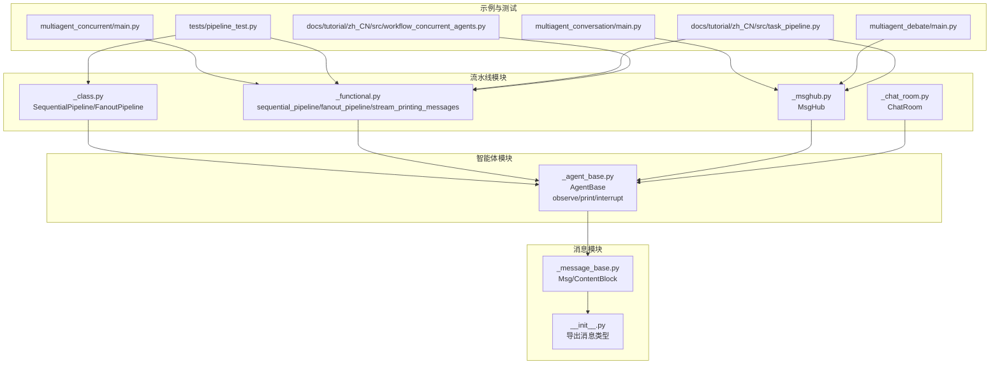
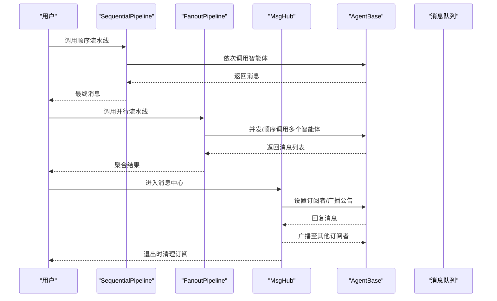
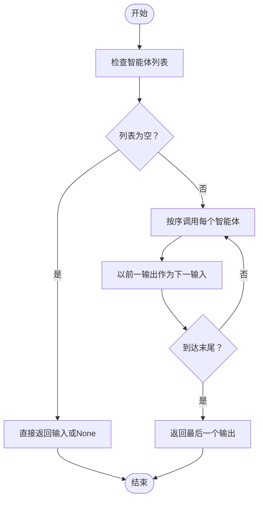
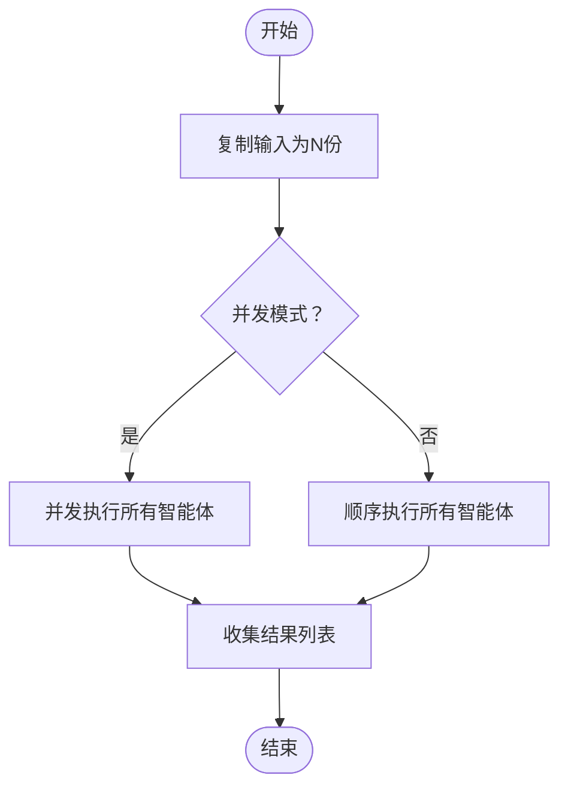
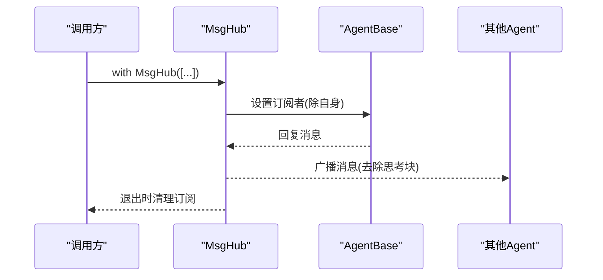
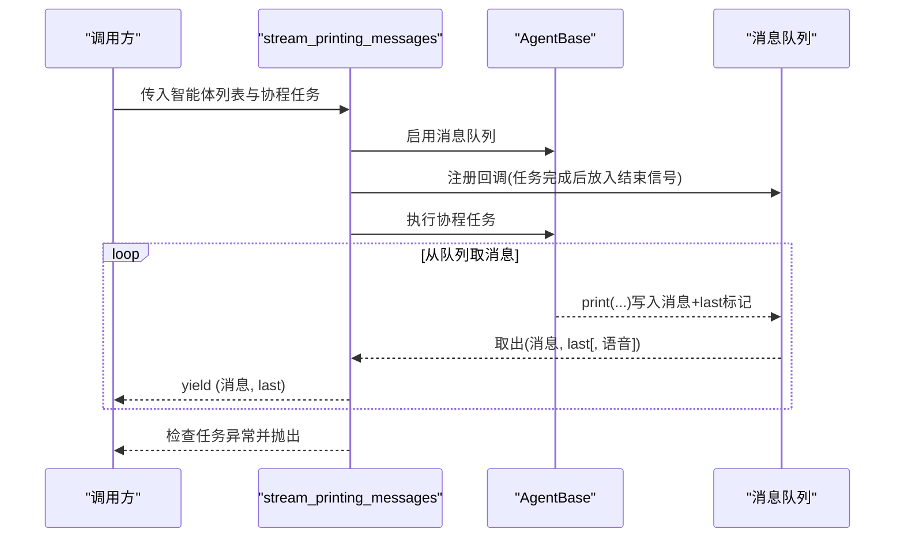
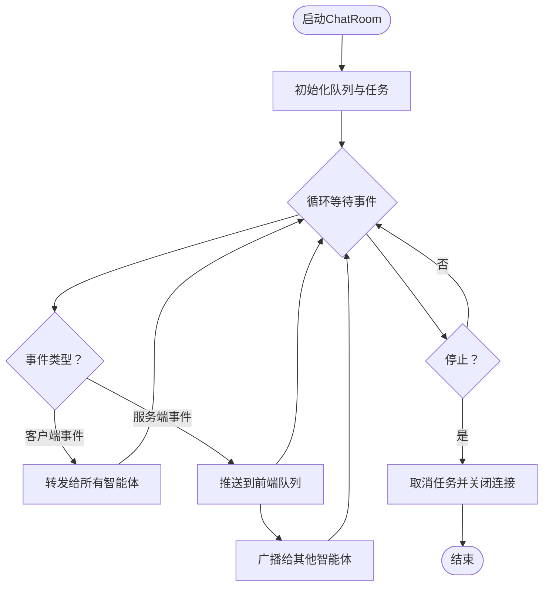
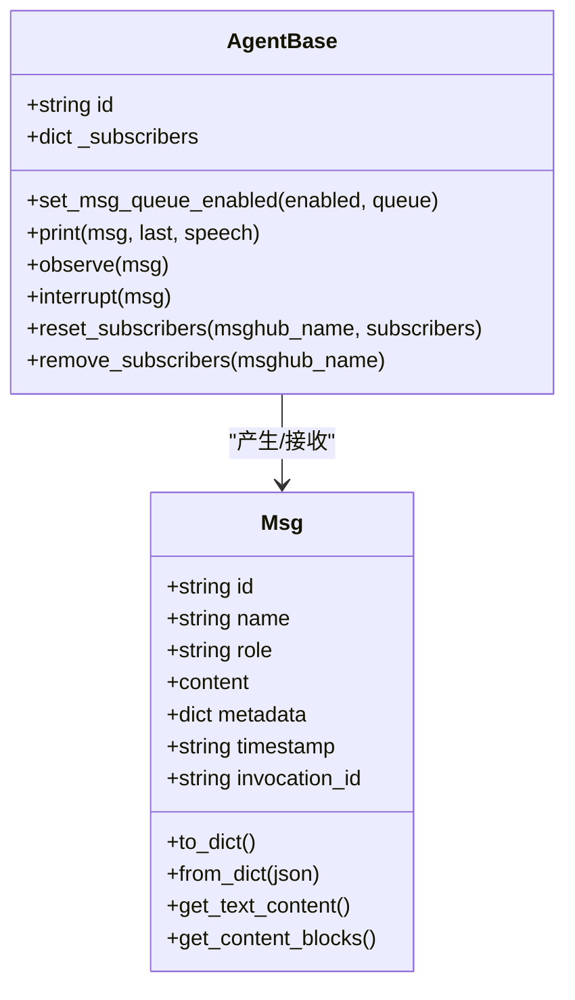
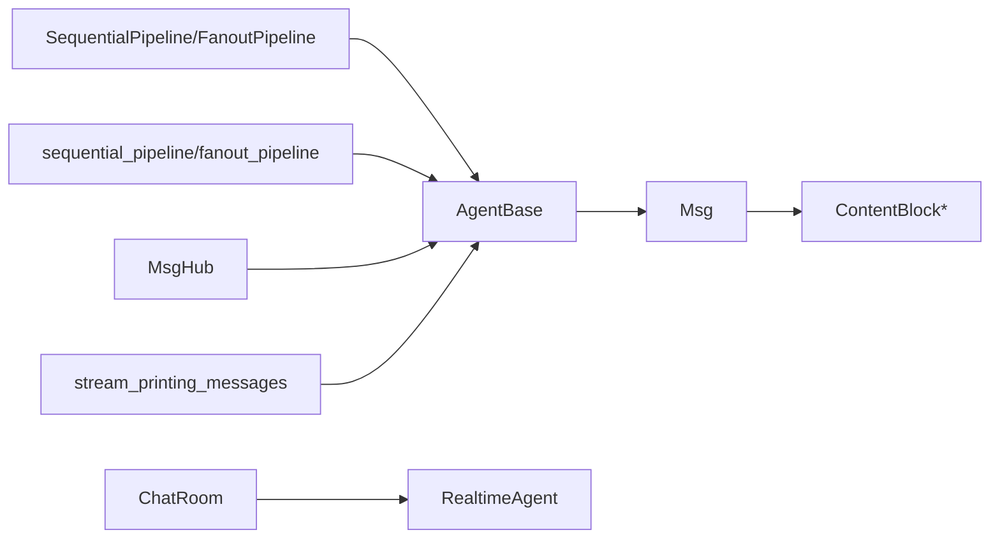

# 流水线系统概念

<cite>
**本文引用的文件**
- [src/agentscope/pipeline/__init__.py](file://src/agentscope/pipeline/__init__.py)
- [src/agentscope/pipeline/_class.py](file://src/agentscope/pipeline/_class.py)
- [src/agentscope/pipeline/_functional.py](file://src/agentscope/pipeline/_functional.py)
- [src/agentscope/pipeline/_msghub.py](file://src/agentscope/pipeline/_msghub.py)
- [src/agentscope/message/__init__.py](file://src/agentscope/message/__init__.py)
- [src/agentscope/message/_message_base.py](file://src/agentscope/message/_message_base.py)
- [src/agentscope/agent/_agent_base.py](file://src/agentscope/agent/_agent_base.py)
- [src/agentscope/pipeline/_chat_room.py](file://src/agentscope/pipeline/_chat_room.py)
- [examples/workflows/multiagent_concurrent/main.py](file://examples/workflows/multiagent_concurrent/main.py)
- [examples/workflows/multiagent_conversation/main.py](file://examples/workflows/multiagent_conversation/main.py)
- [examples/workflows/multiagent_debate/main.py](file://examples/workflows/multiagent_debate/main.py)
- [tests/pipeline_test.py](file://tests/pipeline_test.py)
- [docs/tutorial/zh_CN/src/task_pipeline.py](file://docs/tutorial/zh_CN/src/task_pipeline.py)
- [docs/tutorial/zh_CN/src/workflow_concurrent_agents.py](file://docs/tutorial/zh_CN/src/workflow_concurrent_agents.py)
</cite>

## 目录
1. [引言](#引言)
2. [项目结构](#项目结构)
3. [核心组件](#核心组件)
4. [架构总览](#架构总览)
5. [详细组件分析](#详细组件分析)
6. [依赖分析](#依赖分析)
7. [性能考虑](#性能考虑)
8. [故障排查指南](#故障排查指南)
9. [结论](#结论)
10. [附录](#附录)

## 引言
本文件面向AgentScope流水线系统的核心概念，系统化阐述顺序执行流水线与并行执行流水线的差异与适用场景；深入解析MsgHub消息中心的设计理念（消息路由、订阅机制、广播功能）；解释消息收集器（通过stream_printing_messages实现）的工作原理（消息聚合、过滤与分发策略）；说明流水线的状态管理与错误处理机制（任务中断、异常传播与恢复建议）；并给出流水线与智能体系统的集成方式（智能体注册、消息传递与结果汇总）。最后提供可直接参考的示例路径，帮助读者快速上手创建与配置不同类型的流水线，并实现复杂的多智能体协作模式。

## 项目结构
AgentScope的流水线能力主要集中在pipeline模块，配合message与agent模块完成消息建模与智能体行为编排。核心文件与职责如下：
- pipeline模块：提供顺序与并行流水线、消息中心、实时聊天室等能力
- message模块：提供消息类型与内容块抽象
- agent模块：提供智能体基类及其打印、观察、订阅等机制
- 示例与测试：覆盖并发、会话、辩论等典型工作流

图表来源
- [src/agentscope/pipeline/_class.py:10-91](file://src/agentscope/pipeline/_class.py#L10-L91)
- [src/agentscope/pipeline/_functional.py:10-193](file://src/agentscope/pipeline/_functional.py#L10-L193)
- [src/agentscope/pipeline/_msghub.py:14-157](file://src/agentscope/pipeline/_msghub.py#L14-L157)
- [src/agentscope/pipeline/_chat_room.py:10-98](file://src/agentscope/pipeline/_chat_room.py#L10-L98)
- [src/agentscope/message/_message_base.py:21-242](file://src/agentscope/message/_message_base.py#L21-L242)
- [src/agentscope/agent/_agent_base.py:30-775](file://src/agentscope/agent/_agent_base.py#L30-L775)
- [examples/workflows/multiagent_concurrent/main.py:67-94](file://examples/workflows/multiagent_concurrent/main.py#L67-L94)
- [examples/workflows/multiagent_conversation/main.py:38-81](file://examples/workflows/multiagent_conversation/main.py#L38-L81)
- [examples/workflows/multiagent_debate/main.py:85-131](file://examples/workflows/multiagent_debate/main.py#L85-L131)
- [tests/pipeline_test.py:1-438](file://tests/pipeline_test.py#L1-L438)
- [docs/tutorial/zh_CN/src/task_pipeline.py:1-284](file://docs/tutorial/zh_CN/src/task_pipeline.py#L1-L284)
- [docs/tutorial/zh_CN/src/workflow_concurrent_agents.py:1-43](file://docs/tutorial/zh_CN/src/workflow_concurrent_agents.py#L1-L43)

章节来源
- [src/agentscope/pipeline/__init__.py:1-23](file://src/agentscope/pipeline/__init__.py#L1-L23)

## 核心组件
- 顺序执行流水线（SequentialPipeline/sequential_pipeline）
  - 特点：按序串行执行，前一智能体输出作为下一智能体输入，适合强依赖链路与状态累积场景
  - 适用：对话轮次、推理链、逐步加工
- 并行执行流水线（FanoutPipeline/fanout_pipeline）
  - 特点：将相同输入分发给多个智能体，支持并发gather或顺序执行，适合多视角评估、并行查询
  - 适用：投票/评分、多模型对比、并行搜索
- 消息中心（MsgHub）
  - 特点：自动广播智能体回复，简化多智能体消息共享；支持动态增删参与者、手动广播
  - 适用：多智能体讨论、会议、广播通知
- 消息收集器（stream_printing_messages）
  - 特点：捕获智能体打印消息，转为异步生成器，便于前端流式渲染与中间态观测
  - 适用：实时对话、流式输出、调试观测
- 实时聊天室（ChatRoom）
  - 特点：连接多个实时智能体，转发客户端/服务端事件，实现多方语音/文本交互
  - 适用：语音对话、多方联麦

章节来源
- [src/agentscope/pipeline/_class.py:10-91](file://src/agentscope/pipeline/_class.py#L10-L91)
- [src/agentscope/pipeline/_functional.py:10-193](file://src/agentscope/pipeline/_functional.py#L10-L193)
- [src/agentscope/pipeline/_msghub.py:14-157](file://src/agentscope/pipeline/_msghub.py#L14-L157)
- [src/agentscope/pipeline/_chat_room.py:10-98](file://src/agentscope/pipeline/_chat_room.py#L10-L98)
- [src/agentscope/agent/_agent_base.py:448-527](file://src/agentscope/agent/_agent_base.py#L448-L527)

## 架构总览
AgentScope流水线围绕“消息”与“智能体”两条主线构建：
- 消息（Msg）承载内容与元数据，支持文本、工具调用、结果、音视频等多内容块
- 智能体（AgentBase）负责回复、打印、观察与订阅，内部维护订阅者集合并在回复后广播
- 流水线（Sequential/Fanout）编排智能体执行顺序与并发策略
- MsgHub集中管理订阅与广播，简化多智能体协作
- stream_printing_messages桥接异步执行与流式输出

图表来源
- [src/agentscope/pipeline/_class.py:10-91](file://src/agentscope/pipeline/_class.py#L10-L91)
- [src/agentscope/pipeline/_functional.py:10-193](file://src/agentscope/pipeline/_functional.py#L10-L193)
- [src/agentscope/pipeline/_msghub.py:73-157](file://src/agentscope/pipeline/_msghub.py#L73-L157)
- [src/agentscope/agent/_agent_base.py:448-527](file://src/agentscope/agent/_agent_base.py#L448-L527)

## 详细组件分析

### 顺序执行流水线（SequentialPipeline/sequential_pipeline）
- 设计要点
  - 串行调用智能体，前一输出作为下一输入，最终返回最后一个智能体输出
  - 支持空智能体列表与None输入的边界处理
- 典型场景
  - 多轮对话、逐步推理、状态累积
- 错误处理
  - 任一智能体抛出异常将中断后续执行；可结合中断机制进行恢复

图表来源
- [src/agentscope/pipeline/_functional.py:10-44](file://src/agentscope/pipeline/_functional.py#L10-L44)
- [tests/pipeline_test.py:150-263](file://tests/pipeline_test.py#L150-L263)

章节来源
- [src/agentscope/pipeline/_class.py:10-41](file://src/agentscope/pipeline/_class.py#L10-L41)
- [src/agentscope/pipeline/_functional.py:10-44](file://src/agentscope/pipeline/_functional.py#L10-L44)
- [tests/pipeline_test.py:150-263](file://tests/pipeline_test.py#L150-L263)

### 并行执行流水线（FanoutPipeline/fanout_pipeline）
- 设计要点
  - 将相同输入分发给多个智能体；默认并发（asyncio.gather），也可顺序执行
  - 每个智能体接收深拷贝输入，确保独立状态
- 典型场景
  - 多模型对比、多视角评估、并行检索
- 性能与并发
  - 并发模式适合I/O密集型；顺序模式适合资源受限或需要确定性

图表来源
- [src/agentscope/pipeline/_functional.py:47-104](file://src/agentscope/pipeline/_functional.py#L47-L104)
- [tests/pipeline_test.py:267-341](file://tests/pipeline_test.py#L267-L341)

章节来源
- [src/agentscope/pipeline/_class.py:43-91](file://src/agentscope/pipeline/_class.py#L43-L91)
- [src/agentscope/pipeline/_functional.py:47-104](file://src/agentscope/pipeline/_functional.py#L47-L104)
- [tests/pipeline_test.py:267-341](file://tests/pipeline_test.py#L267-L341)

### MsgHub消息中心
- 设计理念
  - 订阅-广播：进入上下文时为参与者设置订阅者列表；智能体回复后自动广播（可配置）
  - 动态管理：支持添加/删除参与者；支持手动广播
  - 安全性：广播前剥离“思考”块，避免内部推理泄露
- 适用场景
  - 多智能体讨论、会议、广播通知、动态群组

图表来源
- [src/agentscope/pipeline/_msghub.py:73-157](file://src/agentscope/pipeline/_msghub.py#L73-L157)
- [src/agentscope/agent/_agent_base.py:469-514](file://src/agentscope/agent/_agent_base.py#L469-L514)

章节来源
- [src/agentscope/pipeline/_msghub.py:14-157](file://src/agentscope/pipeline/_msghub.py#L14-L157)
- [src/agentscope/agent/_agent_base.py:469-514](file://src/agentscope/agent/_agent_base.py#L469-L514)

### 消息收集器（stream_printing_messages）
- 工作原理
  - 为指定智能体启用消息队列，执行协程任务；从队列中逐条取出打印消息，按流式块返回
  - 支持结束信号与异常传播：任务完成后若仍有消息未取完，先消费再检查异常
- 应用价值
  - 将智能体打印的中间态转化为异步生成器，便于前端实时渲染与调试

图表来源
- [src/agentscope/pipeline/_functional.py:107-193](file://src/agentscope/pipeline/_functional.py#L107-L193)
- [src/agentscope/agent/_agent_base.py:205-275](file://src/agentscope/agent/_agent_base.py#L205-L275)

章节来源
- [src/agentscope/pipeline/_functional.py:107-193](file://src/agentscope/pipeline/_functional.py#L107-L193)
- [tests/pipeline_test.py:379-438](file://tests/pipeline_test.py#L379-L438)

### ChatRoom实时聊天室
- 设计要点
  - 统一队列收集各实时智能体事件，区分客户端事件与服务端事件
  - 仅向前端推送服务端事件，避免回声；同时广播给其他智能体
- 适用场景
  - 多人语音/文本联席、多方实时交互

图表来源
- [src/agentscope/pipeline/_chat_room.py:30-98](file://src/agentscope/pipeline/_chat_room.py#L30-L98)

章节来源
- [src/agentscope/pipeline/_chat_room.py:10-98](file://src/agentscope/pipeline/_chat_room.py#L10-L98)

### 智能体与消息模型
- 消息（Msg）
  - 字段：id、name、role、content、metadata、timestamp、invocation_id
  - 能力：序列化/反序列化、内容块提取、纯文本抽取
- 智能体（AgentBase）
  - 能力：回复（reply）、观察（observe）、打印（print）、中断（interrupt）
  - 订阅机制：维护订阅者字典，回复后广播（剥离思考块）

图表来源
- [src/agentscope/message/_message_base.py:21-242](file://src/agentscope/message/_message_base.py#L21-L242)
- [src/agentscope/agent/_agent_base.py:185-527](file://src/agentscope/agent/_agent_base.py#L185-L527)

章节来源
- [src/agentscope/message/__init__.py:1-32](file://src/agentscope/message/__init__.py#L1-L32)
- [src/agentscope/message/_message_base.py:21-242](file://src/agentscope/message/_message_base.py#L21-L242)
- [src/agentscope/agent/_agent_base.py:185-527](file://src/agentscope/agent/_agent_base.py#L185-L527)

## 依赖分析
- 模块内聚与耦合
  - pipeline模块内部高内聚：顺序/并行/消息中心/聊天室功能相对独立
  - 与agent/message解耦：通过接口（__call__/reply/observe/print）交互，降低耦合
- 关键依赖链
  - 流水线 → 智能体（调用/并发）
  - MsgHub → 智能体（订阅/广播）
  - stream_printing_messages → 智能体（打印队列）
  - ChatRoom → 实时智能体（事件队列）

图表来源
- [src/agentscope/pipeline/_class.py:5-6](file://src/agentscope/pipeline/_class.py#L5-L6)
- [src/agentscope/pipeline/_functional.py:6-7](file://src/agentscope/pipeline/_functional.py#L6-L7)
- [src/agentscope/pipeline/_msghub.py:10-11](file://src/agentscope/pipeline/_msghub.py#L10-L11)
- [src/agentscope/pipeline/_chat_room.py:6-7](file://src/agentscope/pipeline/_chat_room.py#L6-L7)
- [src/agentscope/agent/_agent_base.py:19-26](file://src/agentscope/agent/_agent_base.py#L19-L26)
- [src/agentscope/message/_message_base.py:8-17](file://src/agentscope/message/_message_base.py#L8-L17)

章节来源
- [src/agentscope/pipeline/__init__.py:5-12](file://src/agentscope/pipeline/__init__.py#L5-L12)

## 性能考虑
- 并发策略
  - 并发（enable_gather=True）适合I/O密集型（网络请求、模型调用），提升吞吐
  - 顺序（enable_gather=False）适合CPU密集或资源受限场景，避免过载
- 消息队列与流式输出
  - stream_printing_messages通过队列与异步生成器减少阻塞，但需合理设置队列容量与消费节奏
- 订阅广播
  - 广播前剥离“思考”块，避免冗余传输；订阅者数量增加会放大广播成本

章节来源
- [src/agentscope/pipeline/_functional.py:96-104](file://src/agentscope/pipeline/_functional.py#L96-L104)
- [src/agentscope/agent/_agent_base.py:469-514](file://src/agentscope/agent/_agent_base.py#L469-L514)

## 故障排查指南
- 任务中断与恢复
  - 智能体在执行中可通过interrupt触发取消，随后调用handle_interrupt进行收尾
  - 建议在handle_interrupt中保存中间态或回滚
- 异常传播
  - stream_printing_messages会在消费完队列后检查任务异常并抛出
  - 并行流水线中单个智能体异常可能影响整体gather结果
- 订阅问题
  - 若广播未生效，检查MsgHub是否处于上下文内、订阅者是否被清理
- 输出控制
  - 生产环境可禁用控制台输出，避免日志污染

章节来源
- [src/agentscope/agent/_agent_base.py:528-527](file://src/agentscope/agent/_agent_base.py#L528-L527)
- [src/agentscope/pipeline/_functional.py:189-193](file://src/agentscope/pipeline/_functional.py#L189-L193)
- [src/agentscope/pipeline/_msghub.py:83-88](file://src/agentscope/pipeline/_msghub.py#L83-L88)

## 结论
AgentScope流水线系统通过顺序/并行流水线、消息中心与消息收集器，为多智能体协作提供了简洁而强大的编排能力。MsgHub以订阅-广播为核心简化了消息共享；stream_printing_messages打通了异步执行与流式输出；结合智能体的打印、观察与中断机制，形成完整的状态管理与错误处理闭环。在实际应用中，应根据任务特征选择并发/顺序模式，合理配置广播范围与消息队列，以获得最佳性能与可维护性。

## 附录
- 快速上手示例（示例路径）
  - 并行多视角讨论：[examples/workflows/multiagent_concurrent/main.py:67-94](file://examples/workflows/multiagent_concurrent/main.py#L67-L94)
  - 多智能体对话（MsgHub）：[examples/workflows/multiagent_conversation/main.py:38-81](file://examples/workflows/multiagent_conversation/main.py#L38-L81)
  - 多智能体辩论（MsgHub嵌套）：[examples/workflows/multiagent_debate/main.py:85-131](file://examples/workflows/multiagent_debate/main.py#L85-L131)
  - 流式消息收集（教程）：[docs/tutorial/zh_CN/src/task_pipeline.py:228-246](file://docs/tutorial/zh_CN/src/task_pipeline.py#L228-L246)
  - 并发智能体（基础）：[docs/tutorial/zh_CN/src/workflow_concurrent_agents.py:34-42](file://docs/tutorial/zh_CN/src/workflow_concurrent_agents.py#L34-L42)
- 单元测试参考
  - 顺序/并行流水线与流式消息测试：[tests/pipeline_test.py:150-438](file://tests/pipeline_test.py#L150-L438)