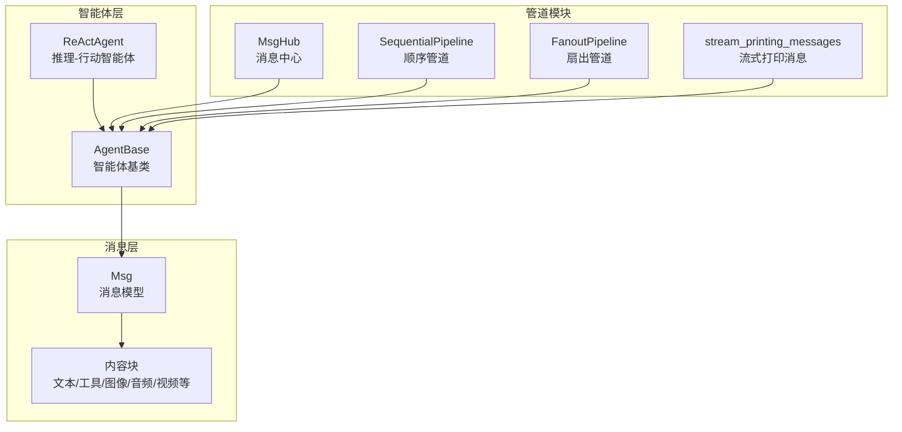
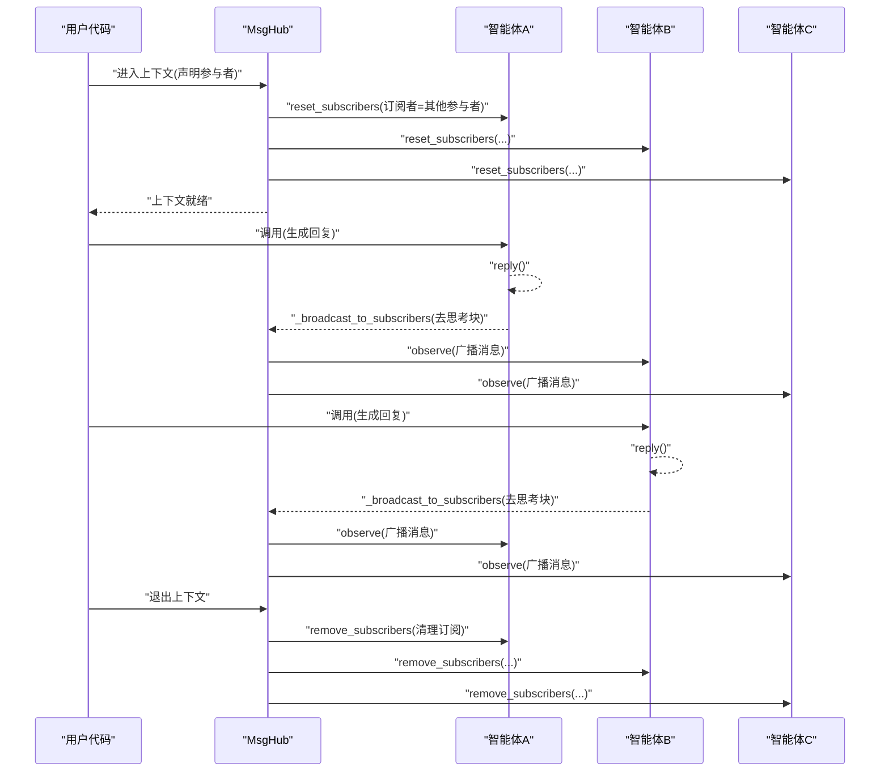
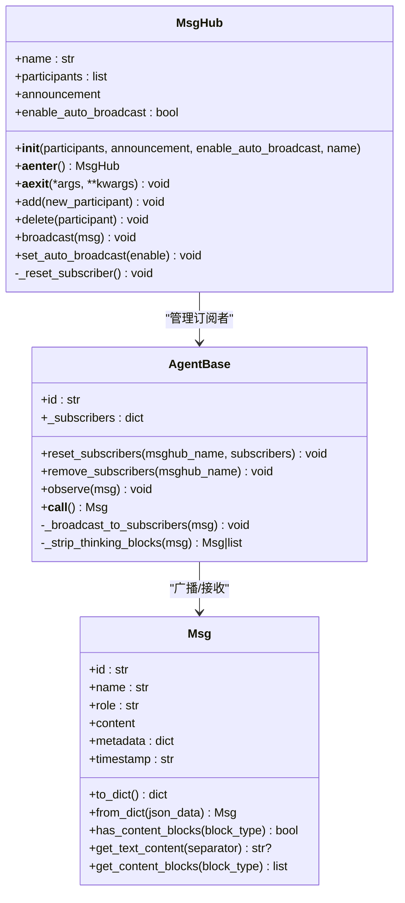
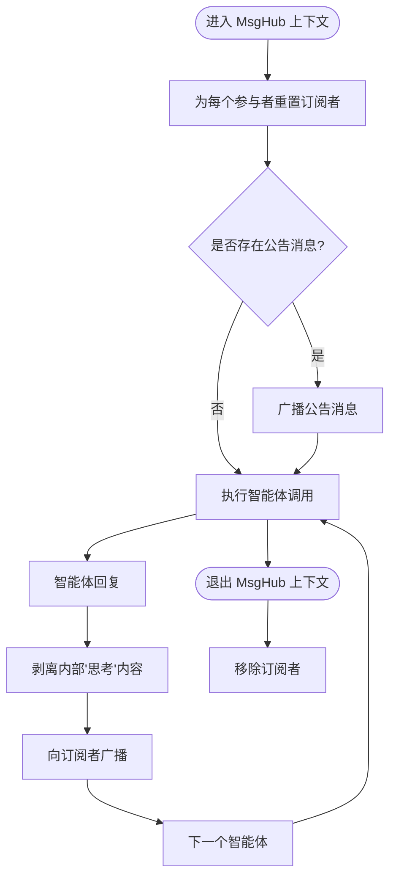
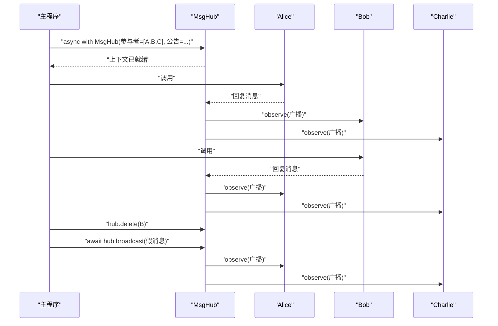
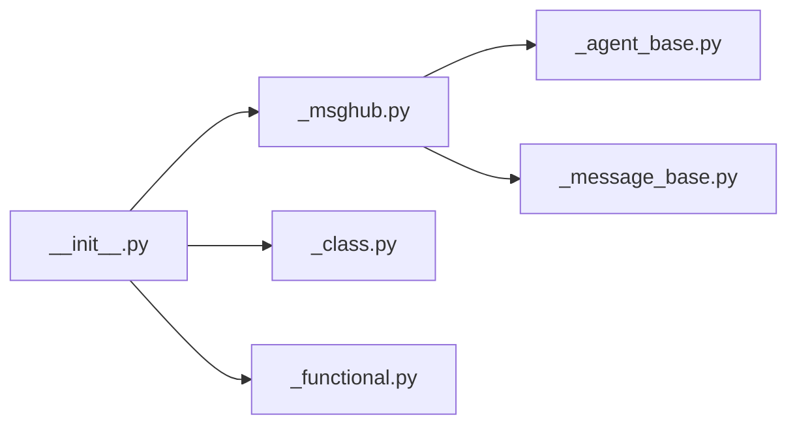

# 消息中心概念

<cite>
**本文引用的文件**
- [src/agentscope/pipeline/_msghub.py](file://src/agentscope/pipeline/_msghub.py)
- [src/agentscope/agent/_agent_base.py](file://src/agentscope/agent/_agent_base.py)
- [src/agentscope/message/_message_base.py](file://src/agentscope/message/_message_base.py)
- [src/agentscope/pipeline/__init__.py](file://src/agentscope/pipeline/__init__.py)
- [examples/workflows/multiagent_conversation/main.py](file://examples/workflows/multiagent_conversation/main.py)
- [docs/tutorial/zh_CN/src/task_pipeline.py](file://docs/tutorial/zh_CN/src/task_pipeline.py)
- [tests/pipeline_test.py](file://tests/pipeline_test.py)
</cite>

## 目录
1. [引言](#引言)
2. [项目结构](#项目结构)
3. [核心组件](#核心组件)
4. [架构总览](#架构总览)
5. [详细组件分析](#详细组件分析)
6. [依赖分析](#依赖分析)
7. [性能考量](#性能考量)
8. [故障排查指南](#故障排查指南)
9. [结论](#结论)
10. [附录](#附录)

## 引言
本文件围绕 AgentScope 的消息中心（MsgHub）进行系统化说明，目标是帮助读者理解 MsgHub 的设计理念、架构原理与使用方式，涵盖消息路由、订阅机制、广播功能、主题管理与消息过滤等核心概念，并阐述 MsgHub 如何与智能体系统集成、如何实现智能体间通信、状态同步与动态参与者管理。文档同时提供可操作的使用路径与最佳实践，帮助在复杂多智能体场景中高效落地。

## 项目结构
MsgHub 位于 pipeline 子模块中，与 AgentBase 智能体基类、Msg 消息模型共同构成消息编排与传播的基础设施。典型使用方式是在异步上下文管理器中声明一组参与者，自动完成消息广播与订阅管理；也可通过动态增删参与者、手动广播等方式灵活控制。

图示来源
- [src/agentscope/pipeline/_msghub.py:14-156](file://src/agentscope/pipeline/_msghub.py#L14-L156)
- [src/agentscope/agent/_agent_base.py:30-774](file://src/agentscope/agent/_agent_base.py#L30-L774)
- [src/agentscope/message/_message_base.py:21-241](file://src/agentscope/message/_message_base.py#L21-L241)
- [src/agentscope/pipeline/__init__.py:1-23](file://src/agentscope/pipeline/__init__.py#L1-L23)

章节来源
- [src/agentscope/pipeline/__init__.py:1-23](file://src/agentscope/pipeline/__init__.py#L1-L23)

## 核心组件
- MsgHub：异步上下文管理器，负责维护参与者列表、自动订阅/退订、广播消息、动态增删参与者、启用/禁用自动广播。
- AgentBase：智能体基类，提供 observe/reply/print 等核心接口，维护订阅者映射并在回复完成后向订阅者广播（去除内部“思考”内容）。
- Msg：消息模型，支持字符串或内容块（文本、工具调用、工具结果、图像、音频、视频等），具备序列化/反序列化能力与内容块提取接口。
- 管道：Sequential/Fanout 管道与流式打印辅助函数，与 MsgHub 协同构建复杂工作流。

章节来源
- [src/agentscope/pipeline/_msghub.py:14-156](file://src/agentscope/pipeline/_msghub.py#L14-L156)
- [src/agentscope/agent/_agent_base.py:30-774](file://src/agentscope/agent/_agent_base.py#L30-L774)
- [src/agentscope/message/_message_base.py:21-241](file://src/agentscope/message/_message_base.py#L21-L241)

## 架构总览
MsgHub 通过在进入上下文时为每个参与者设置订阅者列表，在退出时清理订阅者，从而实现“自动广播”。当任意参与者回复消息时，会触发对订阅者的广播（自动剥离内部“思考”内容），确保信息透明共享且保护隐私。

图示来源
- [src/agentscope/pipeline/_msghub.py:73-87](file://src/agentscope/pipeline/_msghub.py#L73-L87)
- [src/agentscope/agent/_agent_base.py:469-485](file://src/agentscope/agent/_agent_base.py#L469-L485)

## 详细组件分析

### MsgHub 设计与实现
- 初始化参数
  - participants：参与者集合（智能体列表）
  - announcement：进入上下文时广播的消息
  - enable_auto_broadcast：是否启用自动广播
  - name：消息中心名称（未提供则随机生成）
- 生命周期
  - __aenter__：重置订阅者，按需广播公告消息
  - __aexit__：若启用自动广播，则移除各参与者的订阅者
- 关键方法
  - add/delete：动态增删参与者并重置订阅者
  - broadcast：向当前所有参与者广播消息
  - set_auto_broadcast：切换自动广播开关并相应调整订阅者

图示来源
- [src/agentscope/pipeline/_msghub.py:42-156](file://src/agentscope/pipeline/_msghub.py#L42-L156)
- [src/agentscope/agent/_agent_base.py:165-168](file://src/agentscope/agent/_agent_base.py#L165-L168)
- [src/agentscope/message/_message_base.py:24-241](file://src/agentscope/message/_message_base.py#L24-L241)

章节来源
- [src/agentscope/pipeline/_msghub.py:42-156](file://src/agentscope/pipeline/_msghub.py#L42-L156)

### 订阅机制与消息过滤
- 订阅建立：进入 MsgHub 上下文时，每个智能体会被设置为其他参与者的订阅者，形成“互观”关系。
- 自动广播：智能体回复后，内部“思考”内容会被剥离，仅广播对外可见的内容块，保证隐私与一致性。
- 退订清理：退出上下文时，自动移除订阅者，避免残留回调影响后续执行。

图示来源
- [src/agentscope/agent/_agent_base.py:469-485](file://src/agentscope/agent/_agent_base.py#L469-L485)
- [src/agentscope/pipeline/_msghub.py:73-87](file://src/agentscope/pipeline/_msghub.py#L73-L87)

章节来源
- [src/agentscope/agent/_agent_base.py:469-514](file://src/agentscope/agent/_agent_base.py#L469-L514)

### 主题管理与消息过滤
- 主题维度：MsgHub 以“上下文”为单位管理订阅关系，不同上下文拥有独立的订阅者映射，避免跨会话污染。
- 过滤策略：广播前自动过滤“思考”块，确保仅对外可见内容参与传播；消息内容块类型丰富，便于在多模态场景中精确控制可见范围。

章节来源
- [src/agentscope/agent/_agent_base.py:488-514](file://src/agentscope/agent/_agent_base.py#L488-L514)
- [src/agentscope/message/_message_base.py:198-229](file://src/agentscope/message/_message_base.py#L198-L229)

### 与智能体系统的集成
- 智能体注册：通过在 MsgHub 上下文中传入智能体列表完成注册；也可在运行时使用 add/delete 动态变更。
- 消息转发：MsgHub 不直接转发消息，而是通过智能体的 observe 接口实现“广播”；智能体内部负责解析与处理。
- 状态同步：由于每次回复都会广播，智能体在 observe 中更新自身状态，从而实现跨智能体的状态同步。

章节来源
- [src/agentscope/pipeline/_msghub.py:95-128](file://src/agentscope/pipeline/_msghub.py#L95-L128)
- [src/agentscope/agent/_agent_base.py:185-195](file://src/agentscope/agent/_agent_base.py#L185-L195)

### 实际使用示例与流程
- 基础广播：在 MsgHub 上下文中，Alice、Bob、Charlie 依次调用，消息自动在参与者间传播。
- 动态管理：中途删除某参与者，后续广播仅作用于剩余参与者。
- 手动广播：在上下文内使用 broadcast 发送任意消息，覆盖公告之外的沟通需求。

图示来源
- [examples/workflows/multiagent_conversation/main.py:48-75](file://examples/workflows/multiagent_conversation/main.py#L48-L75)
- [docs/tutorial/zh_CN/src/task_pipeline.py:69-80](file://docs/tutorial/zh_CN/src/task_pipeline.py#L69-L80)

章节来源
- [examples/workflows/multiagent_conversation/main.py:38-80](file://examples/workflows/multiagent_conversation/main.py#L38-L80)
- [docs/tutorial/zh_CN/src/task_pipeline.py:65-115](file://docs/tutorial/zh_CN/src/task_pipeline.py#L65-L115)

### 配置选项与扩展机制
- 配置项
  - enable_auto_broadcast：控制是否启用自动广播
  - announcement：进入上下文时的初始广播消息
  - name：消息中心标识（未提供时自动生成）
- 扩展点
  - 通过继承 AgentBase 并实现 observe/reply，可定制消息处理逻辑
  - 通过 Msg 的内容块类型扩展消息形态（文本、工具、图像、音频、视频等）

章节来源
- [src/agentscope/pipeline/_msghub.py:42-71](file://src/agentscope/pipeline/_msghub.py#L42-L71)
- [src/agentscope/message/_message_base.py:198-229](file://src/agentscope/message/_message_base.py#L198-L229)

## 依赖分析
- MsgHub 依赖 AgentBase 的订阅管理与广播能力
- AgentBase 依赖 Msg 的消息模型与内容块抽象
- 管道模块导出 MsgHub 与其他编排工具，形成统一入口

图示来源
- [src/agentscope/pipeline/_msghub.py:1-12](file://src/agentscope/pipeline/_msghub.py#L1-L12)
- [src/agentscope/agent/_agent_base.py:1-12](file://src/agentscope/agent/_agent_base.py#L1-L12)
- [src/agentscope/message/_message_base.py:1-12](file://src/agentscope/message/_message_base.py#L1-L12)
- [src/agentscope/pipeline/__init__.py:1-12](file://src/agentscope/pipeline/__init__.py#L1-L12)

章节来源
- [src/agentscope/pipeline/__init__.py:1-23](file://src/agentscope/pipeline/__init__.py#L1-L23)

## 性能考量
- 广播开销：每次回复均会遍历订阅者列表进行广播，参与者数量增加将线性增加广播成本。建议在大型会话中谨慎使用自动广播或采用分组 MsgHub。
- 内容过滤：广播前剥离“思考”块，减少传输体积，提升网络效率。
- 并发执行：配合 Fanout/Sequential 管道可实现并发或顺序执行，优化端到端吞吐。
- I/O 密集：智能体通常涉及外部 API 调用，合理利用并发与队列有助于提升整体性能。

## 故障排查指南
- 无法找到订阅者：退出上下文时会清理订阅者，若出现“找不到 MsgHub”的警告，请确认上下文生命周期与订阅者管理是否一致。
- 消息未到达：检查是否在正确的 MsgHub 上下文中调用 observe；确认 enable_auto_broadcast 开关状态。
- 动态变更无效：使用 add/delete 后需确保订阅者已重置；注意新增参与者不会收到历史消息。

章节来源
- [src/agentscope/agent/_agent_base.py:717-730](file://src/agentscope/agent/_agent_base.py#L717-L730)
- [src/agentscope/pipeline/_msghub.py:109-128](file://src/agentscope/pipeline/_msghub.py#L109-L128)

## 结论
MsgHub 以简洁的上下文管理与订阅机制，实现了多智能体间的透明消息传播与状态同步。通过自动广播、动态参与者管理与内容过滤，既满足简单协作场景，又为复杂工作流提供扩展空间。结合管道与消息模型，可在多模态、多角色的智能体系统中构建高可扩展的编排能力。

## 附录
- 最佳实践
  - 将具有明确边界与职责的智能体放入同一 MsgHub，避免无关信息干扰
  - 在大型会话中开启/关闭自动广播，平衡信息同步与性能
  - 使用 add/delete 精准控制参与者变更，确保会话一致性
  - 利用内容块类型表达复杂语义，减少歧义与重复广播
- 参考示例
  - 多智能体对话：[examples/workflows/multiagent_conversation/main.py:38-80](file://examples/workflows/multiagent_conversation/main.py#L38-L80)
  - 管道与广播教程：[docs/tutorial/zh_CN/src/task_pipeline.py:65-115](file://docs/tutorial/zh_CN/src/task_pipeline.py#L65-L115)
  - 测试用例参考：[tests/pipeline_test.py:1-439](file://tests/pipeline_test.py#L1-L439)