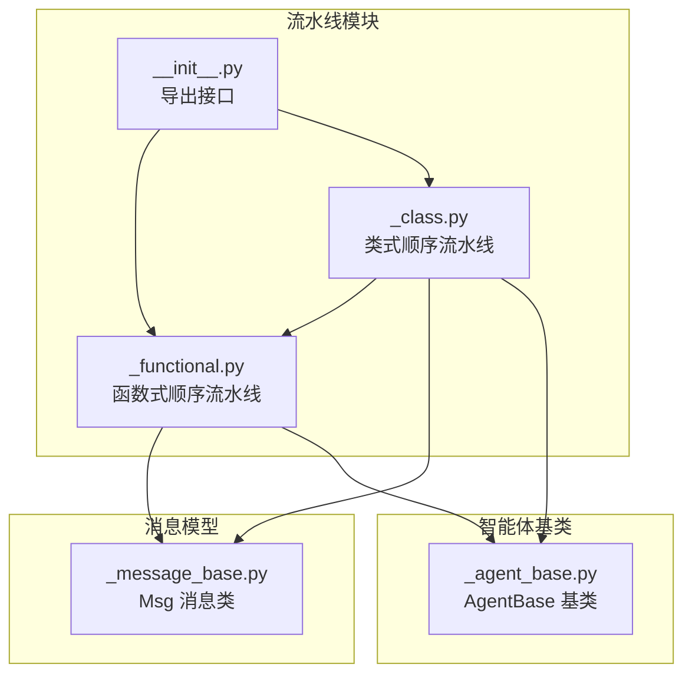
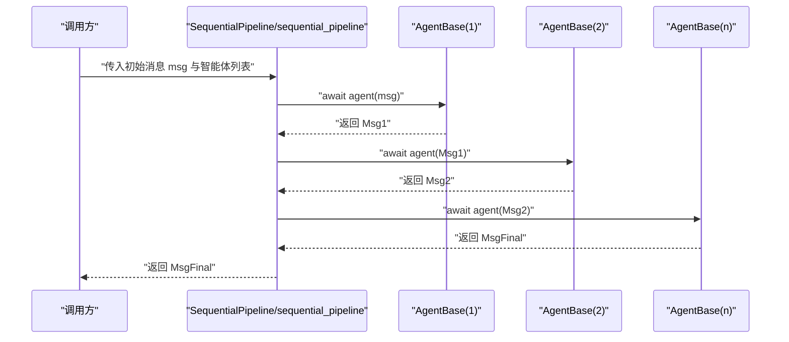
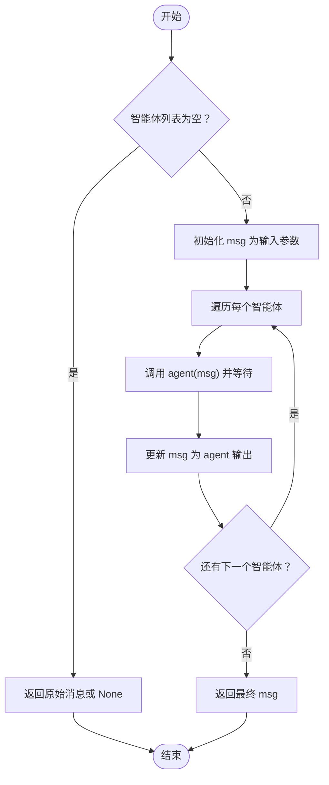
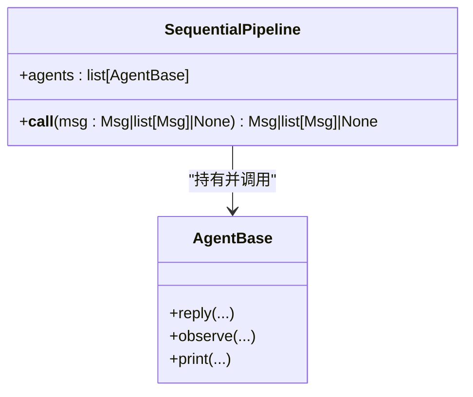
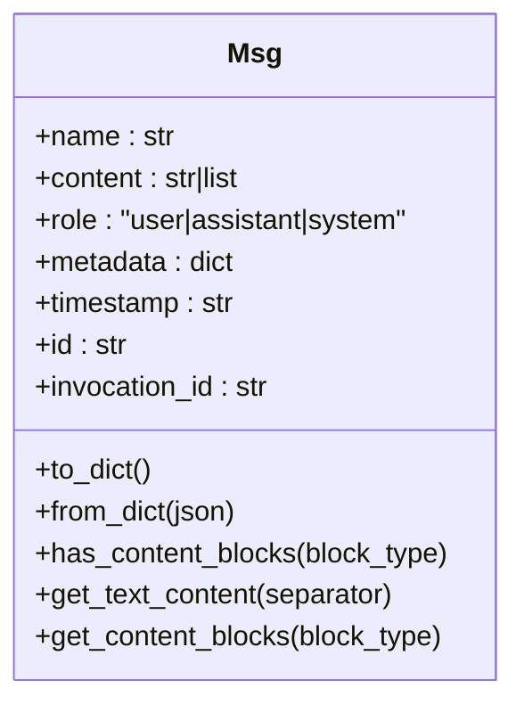
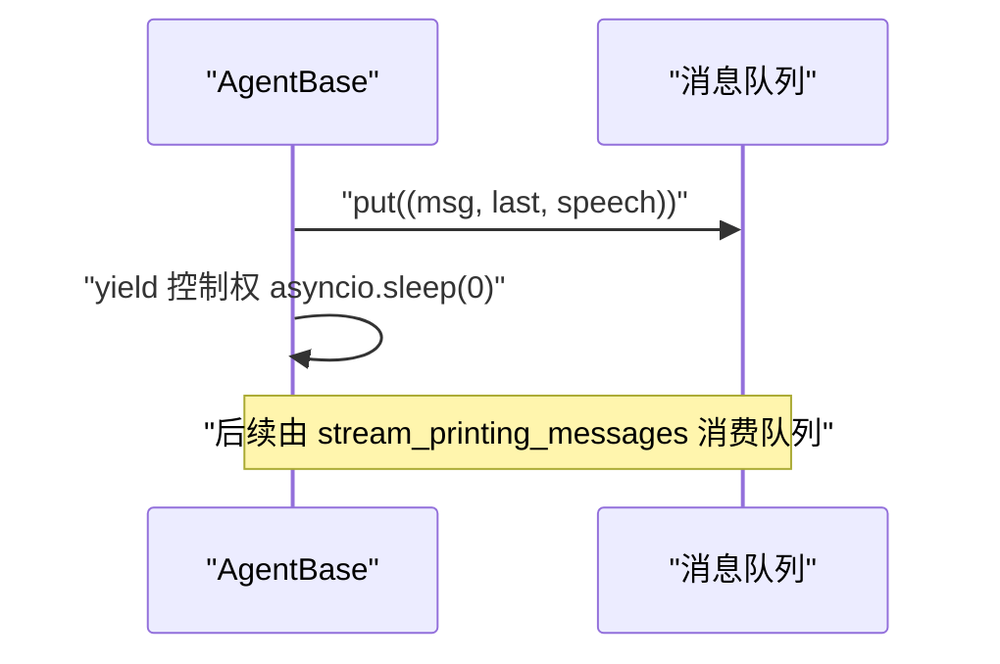
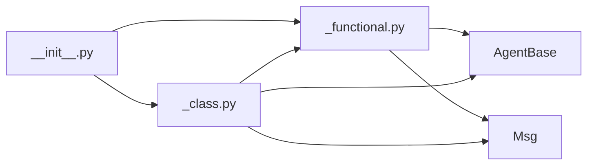

# 顺序执行流水线

<cite>
**本文引用的文件**
- [src/agentscope/pipeline/_functional.py](file://src/agentscope/pipeline/_functional.py)
- [src/agentscope/pipeline/_class.py](file://src/agentscope/pipeline/_class.py)
- [src/agentscope/message/_message_base.py](file://src/agentscope/message/_message_base.py)
- [src/agentscope/agent/_agent_base.py](file://src/agentscope/agent/_agent_base.py)
- [src/agentscope/pipeline/__init__.py](file://src/agentscope/pipeline/__init__.py)
- [docs/tutorial/zh_CN/src/task_pipeline.py](file://docs/tutorial/zh_CN/src/task_pipeline.py)
- [docs/tutorial/en/src/task_pipeline.py](file://docs/tutorial/en/src/task_pipeline.py)
- [tests/pipeline_test.py](file://tests/pipeline_test.py)
</cite>

## 目录
1. [引言](#引言)
2. [项目结构](#项目结构)
3. [核心组件](#核心组件)
4. [架构总览](#架构总览)
5. [详细组件分析](#详细组件分析)
6. [依赖关系分析](#依赖关系分析)
7. [性能考量](#性能考量)
8. [故障排查指南](#故障排查指南)
9. [结论](#结论)
10. [附录](#附录)

## 引言
本文件围绕 AgentScope 的顺序执行流水线进行系统化说明，重点解释 sequential_pipeline 函数的实现原理与工作机制，涵盖消息在智能体之间的传递、状态流转、消息对象的标准化与累积、错误处理与异常传播、以及典型应用场景与最佳实践。读者将能够理解顺序流水线如何将多个智能体串联为线性处理链路，并掌握如何创建、配置与调试顺序流水线。

## 项目结构
顺序流水线相关的核心代码位于 pipeline 模块，配合消息模型与智能体基类共同完成端到端的消息传递与处理。

图示来源
- [src/agentscope/pipeline/_functional.py:1-193](file://src/agentscope/pipeline/_functional.py#L1-L193)
- [src/agentscope/pipeline/_class.py:1-91](file://src/agentscope/pipeline/_class.py#L1-L91)
- [src/agentscope/pipeline/__init__.py:1-23](file://src/agentscope/pipeline/__init__.py#L1-L23)
- [src/agentscope/message/_message_base.py:21-242](file://src/agentscope/message/_message_base.py#L21-L242)
- [src/agentscope/agent/_agent_base.py:30-203](file://src/agentscope/agent/_agent_base.py#L30-L203)

章节来源
- [src/agentscope/pipeline/__init__.py:1-23](file://src/agentscope/pipeline/__init__.py#L1-L23)

## 核心组件
- 函数式顺序流水线：sequential_pipeline，按序调用每个智能体，前一智能体的输出作为下一智能体的输入，最终返回最后一个智能体的输出。
- 类式顺序流水线：SequentialPipeline，封装函数式实现，支持复用与多次调用。
- 消息模型：Msg，承载名称、角色、内容、元数据、时间戳等字段，贯穿整个流水线。
- 智能体基类：AgentBase，定义智能体的统一接口（如 reply、observe、print），并提供消息队列能力用于流式输出。

章节来源
- [src/agentscope/pipeline/_functional.py:10-44](file://src/agentscope/pipeline/_functional.py#L10-L44)
- [src/agentscope/pipeline/_class.py:10-41](file://src/agentscope/pipeline/_class.py#L10-L41)
- [src/agentscope/message/_message_base.py:21-100](file://src/agentscope/message/_message_base.py#L21-L100)
- [src/agentscope/agent/_agent_base.py:197-203](file://src/agentscope/agent/_agent_base.py#L197-L203)

## 架构总览
顺序流水线的执行路径如下：调用方传入初始消息与智能体列表，流水线依次将消息传递给每个智能体；每个智能体处理后返回新的消息对象，作为下一个智能体的输入；最终返回链路末尾智能体的输出。

图示来源
- [src/agentscope/pipeline/_functional.py:10-44](file://src/agentscope/pipeline/_functional.py#L10-L44)
- [src/agentscope/pipeline/_class.py:27-40](file://src/agentscope/pipeline/_class.py#L27-L40)
- [src/agentscope/agent/_agent_base.py:197-203](file://src/agentscope/agent/_agent_base.py#L197-L203)

## 详细组件分析

### 函数式顺序流水线：sequential_pipeline
- 实现要点
  - 遍历智能体列表，依次调用 agent(msg)，并将上一步结果作为下一步输入。
  - 若输入为 None，则直接返回 None；若智能体列表为空，则返回原始消息对象。
  - 返回最后一个智能体的输出。
- 复杂度
  - 时间复杂度：O(N)，N 为智能体数量。
  - 空间复杂度：O(1)，不考虑消息对象本身。
- 错误处理
  - 若任一智能体抛出异常，异常会沿调用栈向上传递，调用方需捕获处理。
- 典型用法
  - 适用于线性处理流程、数据预处理管道、逐步增强的提示工程等。

图示来源
- [src/agentscope/pipeline/_functional.py:10-44](file://src/agentscope/pipeline/_functional.py#L10-L44)

章节来源
- [src/agentscope/pipeline/_functional.py:10-44](file://src/agentscope/pipeline/_functional.py#L10-L44)
- [tests/pipeline_test.py:150-190](file://tests/pipeline_test.py#L150-L190)

### 类式顺序流水线：SequentialPipeline
- 实现要点
  - 通过构造函数保存智能体列表。
  - 通过 __call__ 方法委托给函数式实现，便于复用与多次调用。
- 适用场景
  - 需要在不同输入之间重复使用同一顺序流水线的场景。

图示来源
- [src/agentscope/pipeline/_class.py:10-41](file://src/agentscope/pipeline/_class.py#L10-L41)
- [src/agentscope/agent/_agent_base.py:197-203](file://src/agentscope/agent/_agent_base.py#L197-L203)

章节来源
- [src/agentscope/pipeline/_class.py:10-41](file://src/agentscope/pipeline/_class.py#L10-L41)

### 消息对象：Msg 的标准化与累积
- 字段与职责
  - name：发送者名称
  - content：文本或内容块序列
  - role：消息角色（user/assistant/system）
  - metadata：结构化元数据（常用于累积中间结果）
  - timestamp/id/invocation_id：时间戳、消息唯一标识、相关调用 ID
- 内容块与文本提取
  - 支持将字符串内容转换为文本块，或提取指定类型的内容块。
  - 提供纯文本提取能力，便于下游处理。
- 在流水线中的作用
  - 作为智能体间传递的载体，metadata 常被用于累积计算结果或状态。
  - content 可随处理逐步丰富（如工具调用结果、音频/图像等）。

图示来源
- [src/agentscope/message/_message_base.py:21-242](file://src/agentscope/message/_message_base.py#L21-L242)

章节来源
- [src/agentscope/message/_message_base.py:21-100](file://src/agentscope/message/_message_base.py#L21-L100)
- [src/agentscope/message/_message_base.py:149-229](file://src/agentscope/message/_message_base.py#L149-L229)

### 智能体接口与消息队列
- 接口约定
  - reply：生成回复消息（异步）
  - observe：仅观察消息，不生成回复（异步）
  - print：打印消息并可选伴随语音，支持流式输出
- 流式输出机制
  - set_msg_queue_enabled：启用/禁用消息队列，支持共享队列以聚合多智能体的打印消息。
  - print：在未禁用消息队列时，将 (消息, 是否最后一块, 语音) 元组放入队列，并让出事件循环以避免阻塞。
- 与顺序流水线的关系
  - 顺序流水线不直接消费 print 的消息；但若流水线中智能体使用 print，可通过 stream_printing_messages 聚合流式输出。

图示来源
- [src/agentscope/agent/_agent_base.py:205-228](file://src/agentscope/agent/_agent_base.py#L205-L228)
- [src/agentscope/agent/_agent_base.py:750-775](file://src/agentscope/agent/_agent_base.py#L750-L775)

章节来源
- [src/agentscope/agent/_agent_base.py:185-203](file://src/agentscope/agent/_agent_base.py#L185-L203)
- [src/agentscope/agent/_agent_base.py:205-228](file://src/agentscope/agent/_agent_base.py#L205-L228)
- [src/agentscope/agent/_agent_base.py:750-775](file://src/agentscope/agent/_agent_base.py#L750-L775)

### 示例与配置
- 教程示例展示了顺序流水线的两种写法：手动逐个调用与使用函数式/类式流水线等价。
- 教程还演示了如何结合消息队列与流式生成器获取中间打印消息。

章节来源
- [docs/tutorial/zh_CN/src/task_pipeline.py:145-172](file://docs/tutorial/zh_CN/src/task_pipeline.py#L145-L172)
- [docs/tutorial/en/src/task_pipeline.py:147-174](file://docs/tutorial/en/src/task_pipeline.py#L147-L174)
- [docs/tutorial/zh_CN/src/task_pipeline.py:228-246](file://docs/tutorial/zh_CN/src/task_pipeline.py#L228-L246)
- [docs/tutorial/en/src/task_pipeline.py:233-251](file://docs/tutorial/en/src/task_pipeline.py#L233-L251)

## 依赖关系分析
- 模块导出
  - pipeline/__init__.py 统一导出 MsgHub、SequentialPipeline、sequential_pipeline、FanoutPipeline、fanout_pipeline、stream_printing_messages、ChatRoom。
- 顺序流水线依赖
  - 依赖 AgentBase（调用 agent(msg)）
  - 依赖 Msg（消息对象的输入/输出）

图示来源
- [src/agentscope/pipeline/__init__.py:5-12](file://src/agentscope/pipeline/__init__.py#L5-L12)
- [src/agentscope/pipeline/_functional.py:6-7](file://src/agentscope/pipeline/_functional.py#L6-L7)
- [src/agentscope/pipeline/_class.py:5-7](file://src/agentscope/pipeline/_class.py#L5-L7)

章节来源
- [src/agentscope/pipeline/__init__.py:1-23](file://src/agentscope/pipeline/__init__.py#L1-L23)

## 性能考量
- 时间复杂度
  - 顺序流水线为 O(N)，N 为智能体数量；整体耗时主要取决于最慢智能体的处理时间。
- 并发与串行
  - 顺序流水线天然串行，适合需要确定性与资源可控的场景；若需提升吞吐，可考虑扇出流水线（fanout_pipeline）并发执行。
- 消息复制
  - 顺序流水线不进行消息深拷贝，避免额外开销；若智能体内部修改消息对象，建议在智能体内谨慎处理共享引用。
- I/O 与事件循环
  - 智能体 print 使用 asyncio 队列与 yield 控制权，有助于避免阻塞事件循环，保证高并发下的稳定性。

## 故障排查指南
- 常见问题
  - 智能体未实现 reply/observe：导致调用时报错，需确保自定义智能体实现相应接口。
  - 输入为 None：顺序流水线会直接返回 None；若期望非空输出，请提供有效消息对象。
  - 空智能体列表：返回原始消息对象，注意断言与分支逻辑。
  - 异常传播：任一智能体抛出异常会向上冒泡，需在外层捕获并记录日志。
- 定位手段
  - 使用 stream_printing_messages 聚合中间打印消息，辅助定位异常发生点。
  - 结合智能体的 observe/print 行为，确认消息是否按预期传递与修改。
- 恢复策略
  - 在调用方增加 try-except 捕获异常，记录 msg.id 与异常堆栈，必要时回滚或降级处理。
  - 对关键智能体增加超时与重试机制（在业务层实现），避免单点阻塞。

章节来源
- [src/agentscope/agent/_agent_base.py:197-203](file://src/agentscope/agent/_agent_base.py#L197-L203)
- [src/agentscope/pipeline/_functional.py:10-44](file://src/agentscope/pipeline/_functional.py#L10-L44)
- [tests/pipeline_test.py:191-238](file://tests/pipeline_test.py#L191-L238)

## 结论
顺序执行流水线通过简洁的遍历调用实现了多智能体的线性编排，具备明确的消息传递语义与良好的可维护性。结合消息模型的标准化与智能体的统一接口，开发者可以构建从数据预处理到推理增强的完整线性处理链路。在生产环境中，建议关注异常处理、消息一致性与性能瓶颈，以实现稳定高效的顺序流水线。

## 附录

### 适用场景速览
- 线性处理流程：如“清洗 → 分析 → 生成 → 校验”的数据处理管道。
- 多阶段提示工程：逐步增强提示词，前一阶段输出作为后一阶段输入。
- 渐进式决策：先粗粒度过滤，再细粒度决策，降低计算成本。

### 关键流程参考路径
- 函数式顺序流水线实现：[sequential_pipeline:10-44](file://src/agentscope/pipeline/_functional.py#L10-L44)
- 类式顺序流水线封装：[SequentialPipeline:10-41](file://src/agentscope/pipeline/_class.py#L10-L41)
- 消息对象定义：[Msg:21-100](file://src/agentscope/message/_message_base.py#L21-L100)
- 智能体接口与打印：[AgentBase.print:205-228](file://src/agentscope/agent/_agent_base.py#L205-L228)
- 教程示例（顺序流水线）：[task_pipeline.py（中文）:145-172](file://docs/tutorial/zh_CN/src/task_pipeline.py#L145-L172)、[task_pipeline.py（英文）:147-174](file://docs/tutorial/en/src/task_pipeline.py#L147-L174)
- 单元测试验证：[pipeline_test.py:150-190](file://tests/pipeline_test.py#L150-L190)