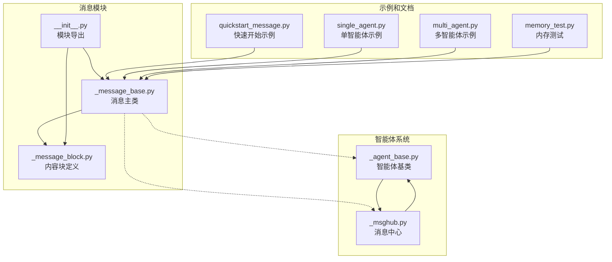
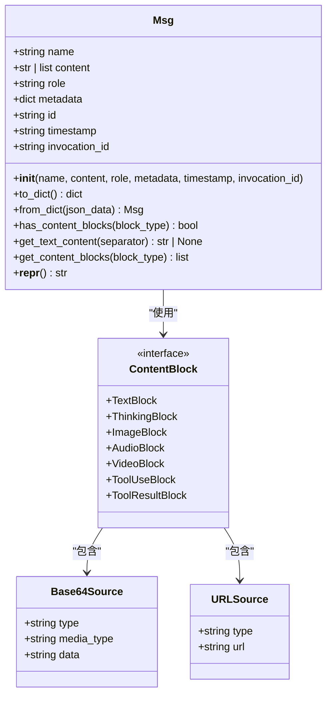
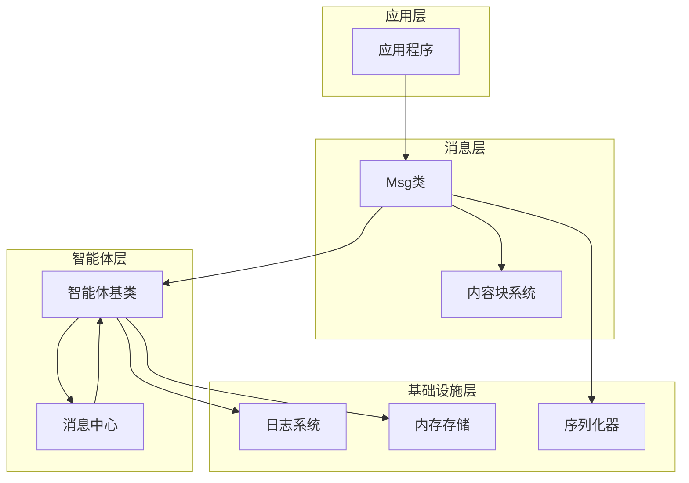
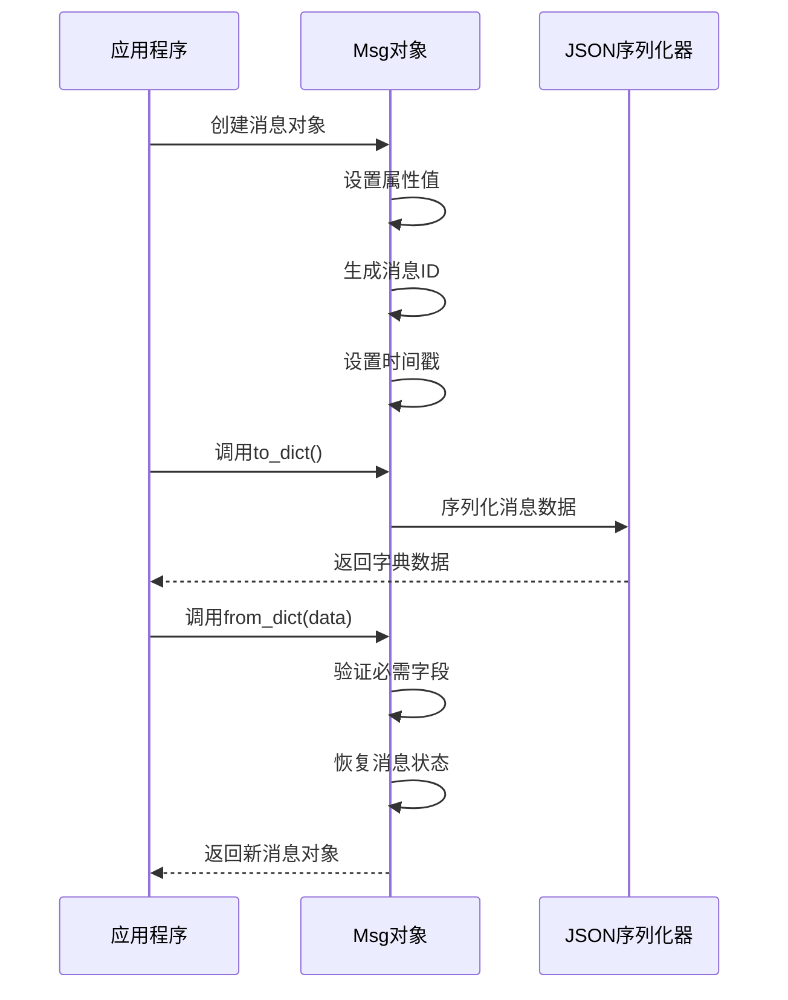
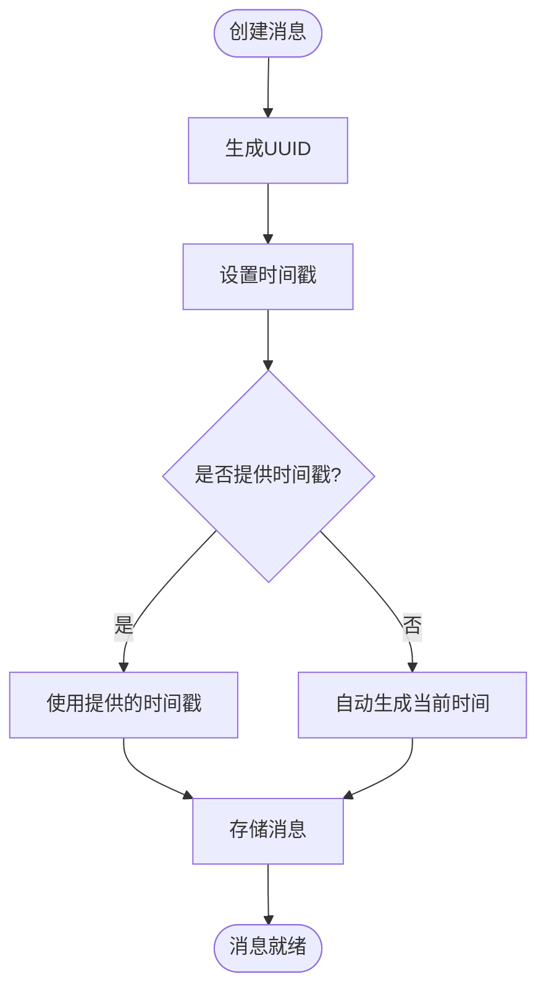
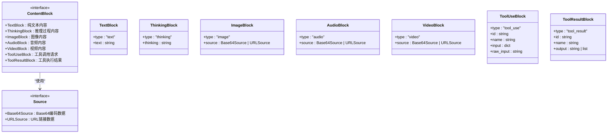
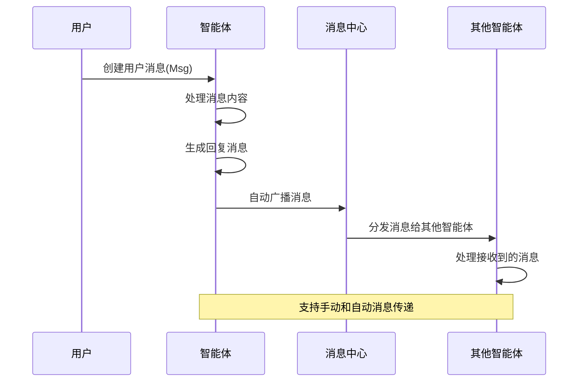
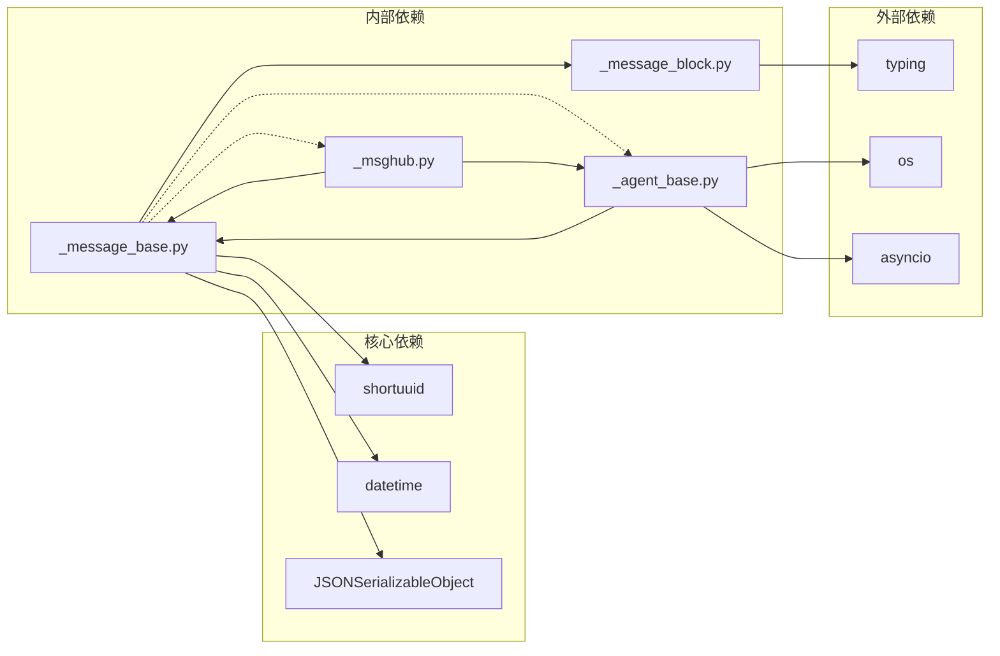

# Msg消息类设计

<cite>
**本文档引用的文件**
- [message/_message_base.py](file://src/agentscope/message/_message_base.py)
- [message/_message_block.py](file://src/agentscope/message/_message_block.py)
- [message/__init__.py](file://src/agentscope/message/__init__.py)
- [pipeline/_msghub.py](file://src/agentscope/pipeline/_msghub.py)
- [agent/_agent_base.py](file://src/agentscope/agent/_agent_base.py)
- [docs/tutorial/zh_CN/src/quickstart_message.py](file://docs/tutorial/zh_CN/src/quickstart_message.py)
- [examples/functionality/stream_printing_messages/single_agent.py](file://examples/functionality/stream_printing_messages/single_agent.py)
- [examples/functionality/stream_printing_messages/multi_agent.py](file://examples/functionality/stream_printing_messages/multi_agent.py)
- [tests/memory_test.py](file://tests/memory_test.py)
</cite>

## 目录
1. [简介](#简介)
2. [项目结构](#项目结构)
3. [核心组件](#核心组件)
4. [架构概览](#架构概览)
5. [详细组件分析](#详细组件分析)
6. [依赖关系分析](#依赖关系分析)
7. [性能考虑](#性能考虑)
8. [故障排除指南](#故障排除指南)
9. [结论](#结论)
10. [附录](#附录)

## 简介

AgentScope的Msg消息类是整个智能体系统的核心数据结构，负责承载和传输各种类型的信息。该消息类支持多种内容格式，包括纯文本、多模态内容块、推理过程、工具调用等，为AgentScope提供了强大的消息处理能力。

Msg类的设计遵循了以下核心原则：
- **灵活性**：支持字符串和内容块列表两种内容格式
- **可扩展性**：通过内容块机制支持多模态数据
- **标准化**：提供统一的消息序列化和反序列化接口
- **追踪性**：内置消息ID和时间戳管理

## 项目结构

AgentScope的消息系统主要由以下文件组成：



**图表来源**
- [message/_message_base.py:1-242](file://src/agentscope/message/_message_base.py#L1-L242)
- [message/_message_block.py:1-129](file://src/agentscope/message/_message_block.py#L1-L129)
- [message/__init__.py:1-32](file://src/agentscope/message/__init__.py#L1-L32)

**章节来源**
- [message/_message_base.py:1-242](file://src/agentscope/message/_message_base.py#L1-L242)
- [message/_message_block.py:1-129](file://src/agentscope/message/_message_block.py#L1-L129)
- [message/__init__.py:1-32](file://src/agentscope/message/__init__.py#L1-L32)

## 核心组件

### Msg类设计架构

Msg类采用简洁而强大的设计模式，主要包含以下核心特性：



**图表来源**
- [message/_message_base.py:21-242](file://src/agentscope/message/_message_base.py#L21-L242)
- [message/_message_block.py:9-129](file://src/agentscope/message/_message_block.py#L9-L129)

### 初始化参数详解

Msg类的初始化参数提供了灵活的消息创建方式：

| 参数名 | 类型 | 必需 | 默认值 | 描述 |
|--------|------|------|--------|------|
| name | str | 是 | - | 消息发送者的名称/身份标识 |
| content | str \| Sequence[ContentBlock] | 是 | - | 消息内容，支持纯文本或内容块列表 |
| role | Literal["user", "assistant", "system"] | 是 | - | 发送者角色，必须为三者之一 |
| metadata | dict[str, JSONSerializableObject] \| None | 否 | {} | 额外元数据，通常用于结构化输出 |
| timestamp | str \| None | 否 | 自动生成 | 消息创建时间戳 |
| invocation_id | str \| None | 否 | None | 相关的API调用ID，用于追踪 |

**章节来源**
- [message/_message_base.py:24-74](file://src/agentscope/message/_message_base.py#L24-L74)

## 架构概览

AgentScope的消息系统采用分层架构设计，确保了系统的可扩展性和可维护性：



**图表来源**
- [message/_message_base.py:1-242](file://src/agentscope/message/_message_base.py#L1-L242)
- [agent/_agent_base.py:185-203](file://src/agentscope/agent/_agent_base.py#L185-L203)
- [pipeline/_msghub.py:14-157](file://src/agentscope/pipeline/_msghub.py#L14-L157)

## 详细组件分析

### 序列化和反序列化机制

Msg类提供了完整的JSON序列化和反序列化支持：



**图表来源**
- [message/_message_base.py:75-99](file://src/agentscope/message/_message_base.py#L75-L99)

序列化后的消息字典包含以下键值对：
- `id`: 消息唯一标识符
- `name`: 发送者名称
- `role`: 发送者角色
- `content`: 消息内容（字符串或内容块列表）
- `metadata`: 元数据字典
- `timestamp`: 创建时间戳

**章节来源**
- [message/_message_base.py:75-99](file://src/agentscope/message/_message_base.py#L75-L99)

### 消息ID生成和时间戳管理

Msg类使用shortuuid库生成全局唯一的消息ID，并自动管理时间戳：



**图表来源**
- [message/_message_base.py:66-73](file://src/agentscope/message/_message_base.py#L66-L73)

### 内容块系统设计

AgentScope的消息系统支持多种内容块类型，每种类型都有特定的用途：



**图表来源**
- [message/_message_block.py:9-129](file://src/agentscope/message/_message_block.py#L9-L129)

**章节来源**
- [message/_message_block.py:1-129](file://src/agentscope/message/_message_block.py#L1-L129)

### 智能体间消息传递机制

Msg类与智能体系统的集成通过以下机制实现：



**图表来源**
- [agent/_agent_base.py:185-203](file://src/agentscope/agent/_agent_base.py#L185-L203)
- [pipeline/_msghub.py:130-139](file://src/agentscope/pipeline/_msghub.py#L130-L139)

**章节来源**
- [agent/_agent_base.py:185-203](file://src/agentscope/agent/_agent_base.py#L185-L203)
- [pipeline/_msghub.py:14-157](file://src/agentscope/pipeline/_msghub.py#L14-L157)

## 依赖关系分析

Msg类与其他组件的依赖关系如下：



**图表来源**
- [message/_message_base.py:3-18](file://src/agentscope/message/_message_base.py#L3-L18)
- [agent/_agent_base.py:1-28](file://src/agentscope/agent/_agent_base.py#L1-L28)
- [pipeline/_msghub.py:1-12](file://src/agentscope/pipeline/_msghub.py#L1-L12)

**章节来源**
- [message/_message_base.py:1-242](file://src/agentscope/message/_message_base.py#L1-L242)
- [agent/_agent_base.py:1-775](file://src/agentscope/agent/_agent_base.py#L1-L775)
- [pipeline/_msghub.py:1-157](file://src/agentscope/pipeline/_msghub.py#L1-L157)

## 性能考虑

### 内存使用优化

Msg类在设计时考虑了内存使用效率：
- 使用类型注解确保运行时类型安全
- 内容块采用轻量级字典结构
- 序列化操作避免不必要的数据复制

### 并发处理

智能体系统支持异步消息处理：
- 消息队列支持非阻塞操作
- 流式消息处理减少内存占用
- 异步观察者模式提高响应性

## 故障排除指南

### 常见问题及解决方案

1. **消息内容格式错误**
   - 症状：创建消息时报错
   - 解决方案：确保content参数为字符串或内容块列表

2. **角色验证失败**
   - 症状：AssertionError关于角色验证
   - 解决方案：使用"user"、"assistant"或"system"之一

3. **序列化兼容性问题**
   - 症状：from_dict方法无法恢复消息状态
   - 解决方案：确保JSON数据包含必需字段

**章节来源**
- [message/_message_base.py:54-62](file://src/agentscope/message/_message_base.py#L54-L62)
- [message/_message_base.py:86-99](file://src/agentscope/message/_message_base.py#L86-L99)

## 结论

AgentScope的Msg消息类通过精心设计的架构和丰富的功能，为智能体系统提供了强大而灵活的消息处理能力。其核心优势包括：

- **设计简洁**：清晰的API和直观的使用方式
- **功能完整**：支持多种内容格式和高级特性
- **性能优秀**：高效的内存使用和并发处理能力
- **易于扩展**：模块化的架构便于功能扩展

Msg类不仅满足了当前的使用需求，还为未来的功能扩展奠定了坚实的基础。

## 附录

### 实际使用示例

以下是一些典型的Msg类使用场景：

1. **简单文本消息**
   ```python
   msg = Msg(
       name="Assistant",
       role="assistant", 
       content="Hello, how can I help you today?"
   )
   ```

2. **多模态消息**
   ```python
   msg = Msg(
       name="Assistant",
       role="assistant",
       content=[
           TextBlock(type="text", text="描述图像内容"),
           ImageBlock(
               type="image",
               source=Base64Source(
                   type="base64",
                   media_type="image/jpeg",
                   data="base64编码的图像数据"
               )
           )
       ]
   )
   ```

3. **工具调用消息**
   ```python
   msg = Msg(
       name="Assistant",
       role="assistant",
       content=[
           ToolUseBlock(
               type="tool_use",
               id="call_123",
               name="weather_api",
               input={"location": "Beijing"}
           )
       ]
   )
   ```

4. **序列化和反序列化**
   ```python
   # 序列化
   serialized = msg.to_dict()
   
   # 反序列化
   new_msg = Msg.from_dict(serialized)
   ```

**章节来源**
- [docs/tutorial/zh_CN/src/quickstart_message.py:67-247](file://docs/tutorial/zh_CN/src/quickstart_message.py#L67-L247)
- [examples/functionality/stream_printing_messages/single_agent.py:45-49](file://examples/functionality/stream_printing_messages/single_agent.py#L45-L49)
- [examples/functionality/stream_printing_messages/multi_agent.py:35-40](file://examples/functionality/stream_printing_messages/multi_agent.py#L35-L40)