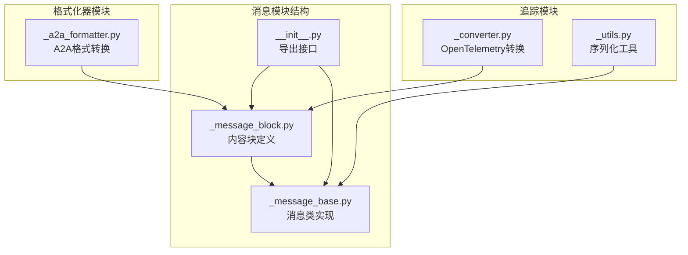
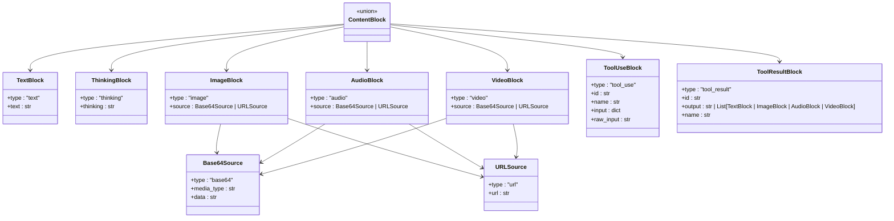
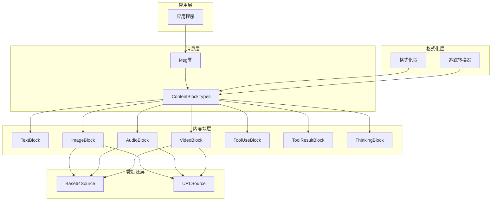
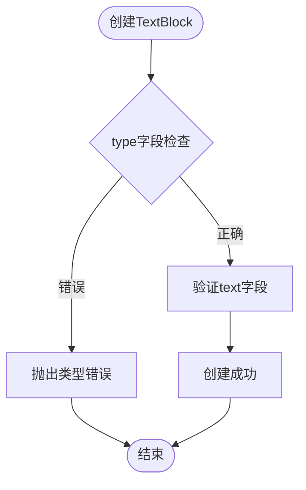
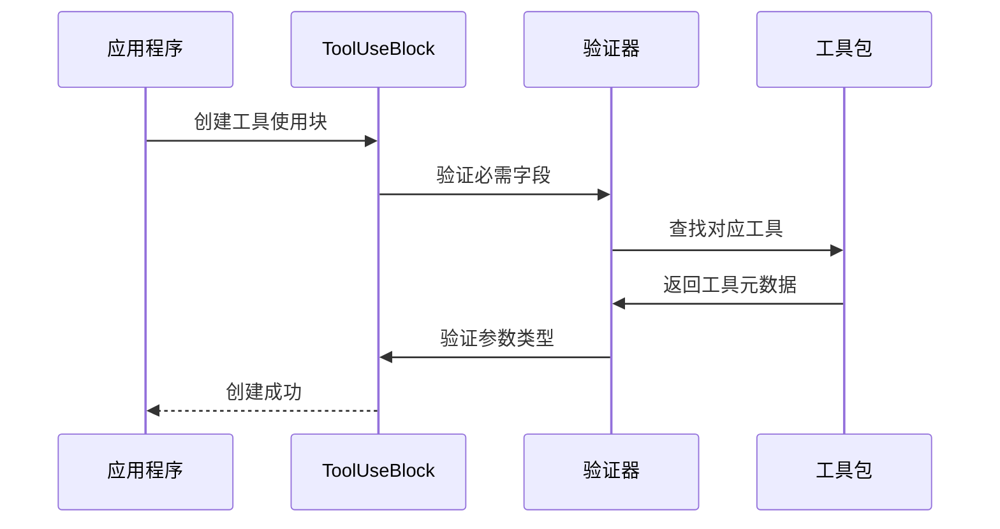
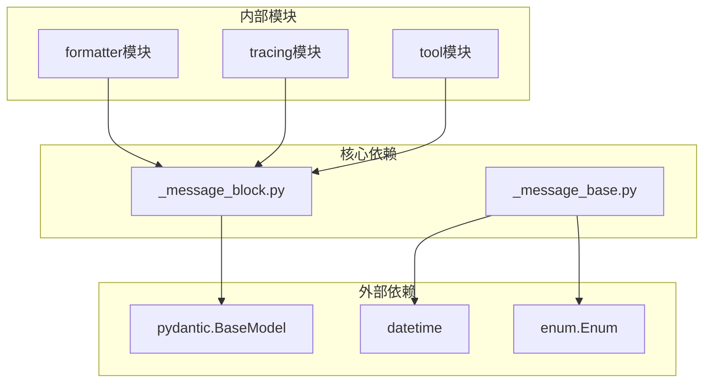

# 内容块类型系统

<cite>
**本文档引用的文件**
- [message/_message_block.py](file://src/agentscope/message/_message_block.py)
- [message/_message_base.py](file://src/agentscope/message/_message_base.py)
- [message/__init__.py](file://src/agentscope/message/__init__.py)
- [formatter/_a2a_formatter.py](file://src/agentscope/formatter/_a2a_formatter.py)
- [tracing/_converter.py](file://src/agentscope/tracing/_converter.py)
- [tracing/_utils.py](file://src/agentscope/tracing/_utils.py)
- [tutorial/zh_CN/src/quickstart_message.py](file://docs/tutorial/zh_CN/src/quickstart_message.py)
- [tests/formatter_a2a_test.py](file://tests/formatter_a2a_test.py)
- [tests/toolkit_basic_test.py](file://tests/toolkit_basic_test.py)
</cite>

## 目录
1. [简介](#简介)
2. [项目结构](#项目结构)
3. [核心组件](#核心组件)
4. [架构概览](#架构概览)
5. [详细组件分析](#详细组件分析)
6. [依赖分析](#依赖分析)
7. [性能考虑](#性能考虑)
8. [故障排除指南](#故障排除指南)
9. [结论](#结论)
10. [附录](#附录)

## 简介
AgentScope 的内容块类型系统是一个强大的多模态数据结构设计，用于支持文本、图像、音频、视频等多种媒体类型的统一表示和处理。该系统通过精心设计的类型定义和继承体系，为智能体的消息传递提供了灵活而类型安全的解决方案。

内容块类型系统的核心价值在于：
- 统一多模态数据的表示方式
- 提供强类型的安全保障
- 支持复杂的工具调用和结果处理
- 实现高效的序列化和反序列化机制
- 便于扩展新的内容类型

## 项目结构
内容块类型系统主要位于 agentscope.message 模块中，包含以下关键文件：

**图表来源**
- [message/_message_block.py:1-129](file://src/agentscope/message/_message_block.py#L1-L129)
- [message/_message_base.py:1-242](file://src/agentscope/message/_message_base.py#L1-L242)

**章节来源**
- [message/__init__.py:1-32](file://src/agentscope/message/__init__.py#L1-L32)
- [message/_message_block.py:1-129](file://src/agentscope/message/_message_block.py#L1-L129)

## 核心组件
内容块类型系统由以下核心组件构成：

### 基础类型定义
系统采用 TypedDict 定义所有内容块类型，确保类型安全性和IDE支持。每个内容块都包含：
- `type` 字段：标识内容块类型
- 具体业务字段：根据内容类型定义

### 继承体系设计

**图表来源**
- [message/_message_block.py:9-128](file://src/agentscope/message/_message_block.py#L9-L128)

**章节来源**
- [message/_message_block.py:9-128](file://src/agentscope/message/_message_block.py#L9-L128)

## 架构概览
内容块类型系统采用分层架构设计，确保各组件职责清晰且相互独立：

**图表来源**
- [message/_message_base.py:21-242](file://src/agentscope/message/_message_base.py#L21-L242)
- [message/_message_block.py:109-128](file://src/agentscope/message/_message_block.py#L109-L128)

## 详细组件分析

### TextBlock（文本块）
TextBlock 是最基础的内容块类型，用于表示纯文本内容。

**数据结构特征**：
- 类型标识：固定为 "text"
- 文本内容：可选的字符串字段
- 使用场景：普通文本消息、对话内容、提示词等

**类型检查机制**：

**图表来源**
- [message/_message_block.py:9-16](file://src/agentscope/message/_message_block.py#L9-L16)

**章节来源**
- [message/_message_block.py:9-16](file://src/agentscope/message/_message_block.py#L9-L16)

### ThinkingBlock（思考块）
ThinkingBlock 专门用于支持推理模型的思考过程展示。

**数据结构特征**：
- 类型标识：固定为 "thinking"
- 思考内容：可选的字符串字段
- 使用场景：大型语言模型的推理过程可视化

**章节来源**
- [message/_message_block.py:18-24](file://src/agentscope/message/_message_block.py#L18-L24)

### ImageBlock（图像块）
ImageBlock 支持图像数据的多种来源格式。

**数据结构特征**：
- 类型标识：固定为 "image"
- 数据源：Base64Source 或 URLSource
- 复杂度分析：O(1) 访问时间，内存占用取决于图像大小

**数据源类型**：
1. Base64Source：适用于小图像或需要内联传输的场景
2. URLSource：适用于大图像或网络资源

**章节来源**
- [message/_message_block.py:49-76](file://src/agentscope/message/_message_block.py#L49-L76)

### AudioBlock（音频块）
AudioBlock 提供音频数据的统一表示。

**数据结构特征**：
- 类型标识：固定为 "audio"
- 数据源：Base64Source 或 URLSource
- 媒体类型：必需的 MIME 类型标识

**使用场景**：
- 语音助手交互
- 音频内容生成
- 语音识别结果

**章节来源**
- [message/_message_block.py:59-66](file://src/agentscope/message/_message_block.py#L59-L66)

### VideoBlock（视频块）
VideoBlock 支持视频内容的完整生命周期管理。

**数据结构特征**：
- 类型标识：固定为 "video"
- 数据源：Base64Source 或 URLSource
- 媒体类型：必需的 MIME 类型标识

**复杂度分析**：
- 创建：O(1)
- 访问：O(1)
- 序列化：O(n)，n为视频数据长度

**章节来源**
- [message/_message_block.py:69-76](file://src/agentscope/message/_message_block.py#L69-L76)

### ToolUseBlock（工具使用块）
ToolUseBlock 专门用于描述工具调用请求。

**数据结构特征**：
- 类型标识：固定为 "tool_use"
- 工具标识：唯一ID
- 工具名称：工具函数名
- 调用参数：任意JSON可序列化对象
- 原始输入：模型API返回的原始字符串

**类型检查机制**：

**图表来源**
- [message/_message_block.py:79-91](file://src/agentscope/message/_message_block.py#L79-L91)

**章节来源**
- [message/_message_block.py:79-91](file://src/agentscope/message/_message_block.py#L79-L91)

### ToolResultBlock（工具结果块）
ToolResultBlock 用于封装工具调用的结果。

**数据结构特征**：
- 类型标识：固定为 "tool_result"
- 工具标识：与对应ToolUseBlock匹配
- 工具名称：工具函数名
- 执行结果：字符串或内容块列表

**复杂度分析**：
- 支持嵌套内容块，允许递归结构
- 结果大小取决于工具输出

**章节来源**
- [message/_message_block.py:94-106](file://src/agentscope/message/_message_block.py#L94-L106)

### Base64Source 和 URLSource（数据源）
这两个辅助类型为多媒体内容提供灵活的数据源支持。

**Base64Source 特征**：
- 类型标识：固定为 "base64"
- 媒体类型：MIME类型标识
- 数据内容：RFC 2397 格式的base64编码

**URLSource 特征**：
- 类型标识：固定为 "url"
- URL地址：有效的HTTP/HTTPS链接

**章节来源**
- [message/_message_block.py:26-36](file://src/agentscope/message/_message_block.py#L26-L36)
- [message/_message_block.py:39-46](file://src/agentscope/message/_message_block.py#L39-L46)

## 依赖分析
内容块类型系统与其他模块的依赖关系如下：

**图表来源**
- [tracing/_utils.py:10-12](file://src/agentscope/tracing/_utils.py#L10-L12)
- [message/_message_base.py:18](file://src/agentscope/message/_message_base.py#L18)

**章节来源**
- [tracing/_utils.py:15-54](file://src/agentscope/tracing/_utils.py#L15-L54)
- [formatter/_a2a_formatter.py:288-365](file://src/agentscope/formatter/_a2a_formatter.py#L288-L365)

## 性能考虑
内容块类型系统在设计时充分考虑了性能优化：

### 时间复杂度优化
- **查找操作**：O(n)，其中n为内容块数量
- **过滤操作**：O(n)，支持按类型快速筛选
- **序列化操作**：O(Σi=1 to n) O(len(content[i]))

### 空间复杂度优化
- **内存占用**：与内容大小成正比
- **类型安全**：编译时检查，运行时零开销
- **缓存策略**：支持重复使用的base64数据

### 性能最佳实践
1. 优先使用URLSource处理大文件
2. 合理使用ToolResultBlock的嵌套结构
3. 避免不必要的内容块转换

## 故障排除指南

### 常见问题及解决方案

**问题1：类型不匹配错误**
- 症状：创建内容块时抛出类型错误
- 解决方案：确保type字段与内容块类型完全匹配

**问题2：序列化失败**
- 症状：to_dict()方法抛出异常
- 解决方案：检查内容块中的非序列化对象

**问题3：工具调用失败**
- 症状：ToolUseBlock无法被工具包识别
- 解决方案：验证工具名称和参数类型

**章节来源**
- [message/_message_base.py:75-99](file://src/agentscope/message/_message_base.py#L75-L99)

### 调试技巧
1. 使用has_content_blocks()方法检查内容块存在性
2. 利用get_content_blocks()按类型筛选内容
3. 通过get_text_content()提取纯文本内容

## 结论
AgentScope的内容块类型系统通过精心设计的类型定义和继承体系，为多模态AI应用提供了强大而灵活的数据结构支持。该系统不仅保证了类型安全性，还提供了高效的性能表现和良好的扩展性。

核心优势包括：
- 强类型安全保障
- 多模态内容统一表示
- 灵活的工具调用机制
- 高效的序列化支持
- 良好的向后兼容性

随着AI应用对多模态能力需求的增长，该内容块类型系统将继续发挥重要作用，为构建下一代智能体应用奠定坚实基础。

## 附录

### 使用示例路径
以下是一些重要的使用示例位置：
- [教程示例:67-246](file://docs/tutorial/zh_CN/src/quickstart_message.py#L67-L246)
- [格式化器测试:55-89](file://tests/formatter_a2a_test.py#L55-L89)
- [工具包测试:1112-1123](file://tests/toolkit_basic_test.py#L1112-L1123)

### API参考
- **创建消息**：`Msg(name, content, role)`
- **获取文本内容**：`get_text_content(separator="\n")`
- **获取内容块**：`get_content_blocks(block_type=None)`
- **检查内容块**：`has_content_blocks(block_type=None)`
- **序列化**：`to_dict()`
- **反序列化**：`from_dict(json_data)`

### 类型系统扩展
如需添加新的内容块类型，建议遵循以下步骤：
1. 定义新的TypedDict类型
2. 更新ContentBlock联合类型
3. 添加对应的类型检查逻辑
4. 实现序列化支持
5. 编写相应的测试用例