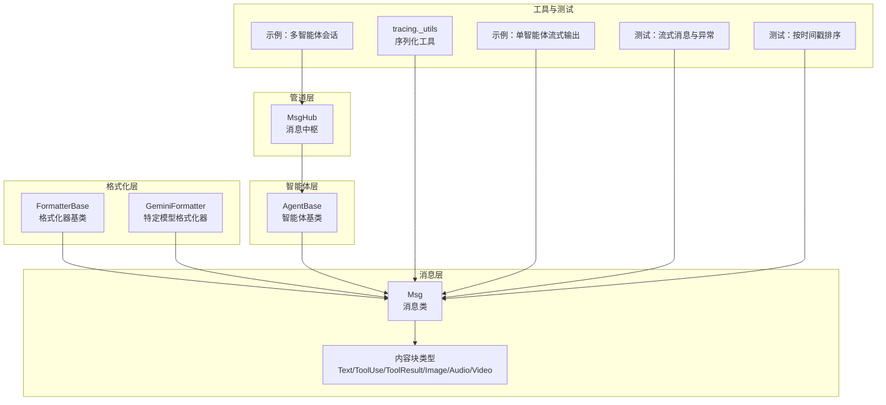
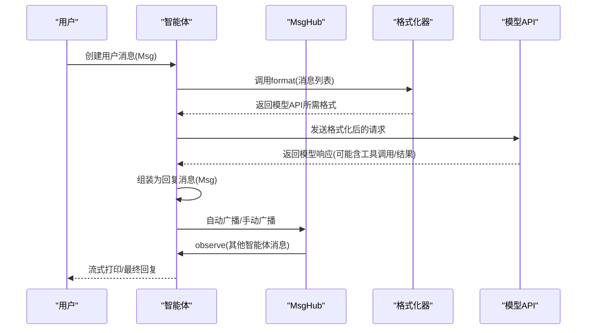
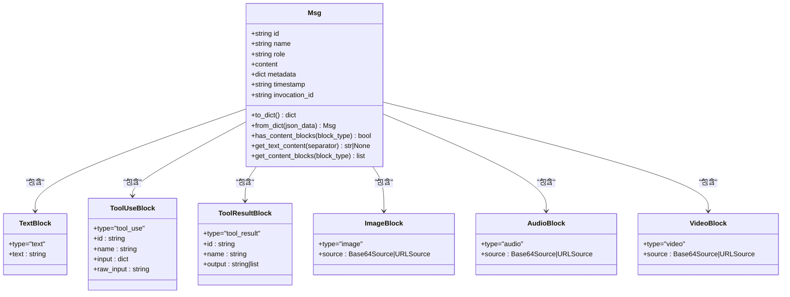
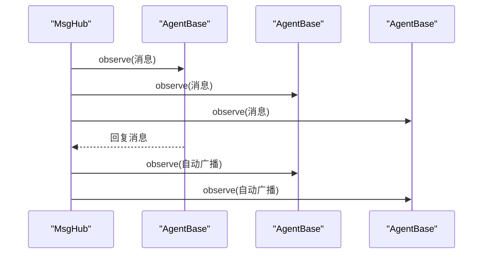
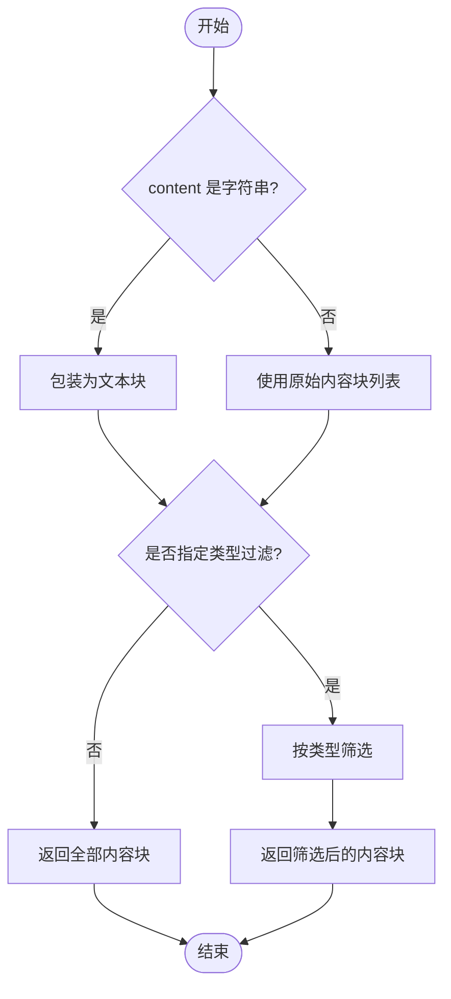
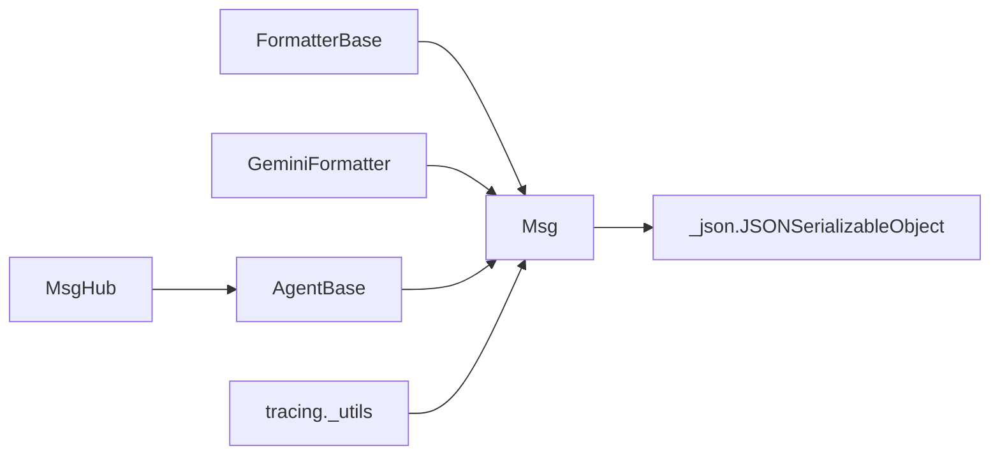

# 消息处理流程

<cite>
**本文引用的文件**
- [message/__init__.py](file://src/agentscope/message/__init__.py)
- [message/_message_base.py](file://src/agentscope/message/_message_base.py)
- [message/_message_block.py](file://src/agentscope/message/_message_block.py)
- [types/_json.py](file://src/agentscope/types/_json.py)
- [formatter/_formatter_base.py](file://src/agentscope/formatter/_formatter_base.py)
- [formatter/_gemini_formatter.py](file://src/agentscope/formatter/_gemini_formatter.py)
- [pipeline/_msghub.py](file://src/agentscope/pipeline/_msghub.py)
- [agent/_agent_base.py](file://src/agentscope/agent/_agent_base.py)
- [tracing/_utils.py](file://src/agentscope/tracing/_utils.py)
- [examples/functionality/stream_printing_messages/single_agent.py](file://examples/functionality/stream_printing_messages/single_agent.py)
- [examples/functionality/stream_printing_messages/multi_agent.py](file://examples/functionality/stream_printing_messages/multi_agent.py)
- [examples/workflows/multiagent_conversation/main.py](file://examples/workflows/multiagent_conversation/main.py)
- [tests/pipeline_test.py](file://tests/pipeline_test.py)
- [tests/tablestore_memory_ft_test.py](file://tests/tablestore_memory_ft_test.py)
</cite>

## 目录
1. [简介](#简介)
2. [项目结构](#项目结构)
3. [核心组件](#核心组件)
4. [架构总览](#架构总览)
5. [详细组件分析](#详细组件分析)
6. [依赖分析](#依赖分析)
7. [性能考虑](#性能考虑)
8. [故障排查指南](#故障排查指南)
9. [结论](#结论)
10. [附录](#附录)

## 简介
本文件系统性梳理 AgentScope 的消息处理流程，覆盖消息从创建、内容块解析、类型转换、序列化与反序列化，到在多智能体间传递（路由、格式转换与兼容性处理），以及查询与过滤（如文本内容提取与内容块筛选）、元数据与时间戳管理，并提供端到端示例与错误处理策略。目标是帮助读者快速掌握消息在 AgentScope 中的全生命周期与最佳实践。

## 项目结构
消息处理相关代码主要分布在以下模块：
- message：消息与内容块定义、序列化与反序列化、内容块查询与过滤
- formatter：消息格式化器基类与各模型格式化实现，负责将消息转换为不同模型 API 所需格式
- pipeline：消息中枢 MsgHub，负责多智能体间的消息广播与订阅
- agent：智能体基类，定义 observe/reply 接口与消息订阅机制
- tracing：对象序列化工具，支持将消息等对象安全地转为可记录的字符串
- examples/tests：演示消息在单智能体与多智能体场景下的使用方式及边界行为

图表来源
- [message/_message_base.py:21-242](file://src/agentscope/message/_message_base.py#L21-L242)
- [message/_message_block.py:9-129](file://src/agentscope/message/_message_block.py#L9-L129)
- [formatter/_formatter_base.py:11-130](file://src/agentscope/formatter/_formatter_base.py#L11-L130)
- [formatter/_gemini_formatter.py:260-295](file://src/agentscope/formatter/_gemini_formatter.py#L260-L295)
- [pipeline/_msghub.py:14-157](file://src/agentscope/pipeline/_msghub.py#L14-L157)
- [agent/_agent_base.py:185-200](file://src/agentscope/agent/_agent_base.py#L185-L200)
- [tracing/_utils.py:15-54](file://src/agentscope/tracing/_utils.py#L15-L54)
- [examples/functionality/stream_printing_messages/single_agent.py:21-63](file://examples/functionality/stream_printing_messages/single_agent.py#L21-L63)
- [examples/functionality/stream_printing_messages/multi_agent.py:27-63](file://examples/functionality/stream_printing_messages/multi_agent.py#L27-L63)
- [tests/pipeline_test.py:411-438](file://tests/pipeline_test.py#L411-L438)
- [tests/tablestore_memory_ft_test.py:604-646](file://tests/tablestore_memory_ft_test.py#L604-L646)

章节来源
- [message/__init__.py:4-31](file://src/agentscope/message/__init__.py#L4-L31)
- [message/_message_base.py:21-242](file://src/agentscope/message/_message_base.py#L21-L242)
- [message/_message_block.py:9-129](file://src/agentscope/message/_message_block.py#L9-L129)
- [formatter/_formatter_base.py:11-130](file://src/agentscope/formatter/_formatter_base.py#L11-L130)
- [pipeline/_msghub.py:14-157](file://src/agentscope/pipeline/_msghub.py#L14-L157)
- [agent/_agent_base.py:185-200](file://src/agentscope/agent/_agent_base.py#L185-L200)
- [tracing/_utils.py:15-54](file://src/agentscope/tracing/_utils.py#L15-L54)
- [examples/functionality/stream_printing_messages/single_agent.py:21-63](file://examples/functionality/stream_printing_messages/single_agent.py#L21-L63)
- [examples/functionality/stream_printing_messages/multi_agent.py:27-63](file://examples/functionality/stream_printing_messages/multi_agent.py#L27-L63)
- [tests/pipeline_test.py:411-438](file://tests/pipeline_test.py#L411-L438)
- [tests/tablestore_memory_ft_test.py:604-646](file://tests/tablestore_memory_ft_test.py#L604-L646)

## 核心组件
- 消息类 Msg：统一承载消息的标识、发送者名称、角色、内容（字符串或内容块列表）、元数据、时间戳与调用 ID；提供 to_dict/from_dict 序列化与反序列化能力；提供内容块查询与文本内容提取能力。
- 内容块 ContentBlock：涵盖文本、思考、工具调用、工具结果、图像、音频、视频等多模态块，每种块包含必要的字段与来源（URL 或 Base64）。
- 格式化器 FormatterBase：定义统一的格式化接口与工具结果兼容性处理逻辑；具体模型格式化器（如 GeminiFormatter）将消息转换为对应 API 所需的数据结构。
- MsgHub：多智能体消息中枢，负责订阅管理、自动广播与手动广播，支撑多智能体协作。
- AgentBase：智能体基类，定义 observe/reply 接口，内部维护订阅者集合，用于接收来自 MsgHub 的消息。
- tracing._utils：通用序列化工具，将消息等对象安全地转为可记录字符串，便于追踪与日志。

章节来源
- [message/_message_base.py:21-242](file://src/agentscope/message/_message_base.py#L21-L242)
- [message/_message_block.py:9-129](file://src/agentscope/message/_message_block.py#L9-L129)
- [formatter/_formatter_base.py:11-130](file://src/agentscope/formatter/_formatter_base.py#L11-L130)
- [pipeline/_msghub.py:14-157](file://src/agentscope/pipeline/_msghub.py#L14-L157)
- [agent/_agent_base.py:185-200](file://src/agentscope/agent/_agent_base.py#L185-L200)
- [tracing/_utils.py:15-54](file://src/agentscope/tracing/_utils.py#L15-L54)

## 架构总览
下图展示了消息在 AgentScope 中的端到端流转：从用户输入创建消息，经格式化器转换为模型 API 所需格式，再由智能体生成回复消息，最终通过 MsgHub 在多智能体间广播与观察。

图表来源
- [examples/functionality/stream_printing_messages/single_agent.py:21-63](file://examples/functionality/stream_printing_messages/single_agent.py#L21-L63)
- [examples/functionality/stream_printing_messages/multi_agent.py:27-63](file://examples/functionality/stream_printing_messages/multi_agent.py#L27-L63)
- [examples/workflows/multiagent_conversation/main.py:41-80](file://examples/workflows/multiagent_conversation/main.py#L41-L80)
- [formatter/_formatter_base.py:14-17](file://src/agentscope/formatter/_formatter_base.py#L14-L17)
- [pipeline/_msghub.py:130-139](file://src/agentscope/pipeline/_msghub.py#L130-L139)

## 详细组件分析

### 消息类 Msg：创建、序列化与查询
- 创建与初始化：支持字符串或内容块列表作为 content；自动设置唯一 id 与时间戳；可选元数据与调用 ID。
- 序列化/反序列化：to_dict 输出包含 id、name、role、content、metadata、timestamp；from_dict 支持从字典重建消息对象。
- 查询与过滤：
  - has_content_blocks：检查是否存在指定类型的内容块。
  - get_text_content：将文本块拼接为纯文本，默认以换行符分隔。
  - get_content_blocks：将字符串内容转换为文本块，支持按类型筛选或返回全部块。

图表来源
- [message/_message_base.py:21-242](file://src/agentscope/message/_message_base.py#L21-L242)
- [message/_message_block.py:9-129](file://src/agentscope/message/_message_block.py#L9-L129)

章节来源
- [message/_message_base.py:24-100](file://src/agentscope/message/_message_base.py#L24-L100)
- [message/_message_base.py:101-242](file://src/agentscope/message/_message_base.py#L101-L242)
- [message/_message_block.py:9-129](file://src/agentscope/message/_message_block.py#L9-L129)

### 内容块解析与类型转换
- 文本块：type="text"，包含文本内容。
- 工具调用块：type="tool_use"，包含工具名、输入参数与调用 ID。
- 工具结果块：type="tool_result"，包含输出（字符串或多模态块列表）与工具名。
- 多媒体块：图像/音频/视频，均包含 source 字段，支持 URL 或 Base64 两种来源。
- 类型转换：当 content 为字符串时，get_content_blocks 会自动包装为文本块；格式化器在对接不同模型时，会将内容块转换为该模型 API 所需的数据结构。

章节来源
- [message/_message_block.py:9-129](file://src/agentscope/message/_message_block.py#L9-L129)
- [message/_message_base.py:198-229](file://src/agentscope/message/_message_base.py#L198-L229)

### 序列化与反序列化
- Msg.to_dict：输出标准字典，便于持久化、传输或日志记录。
- Msg.from_dict：从字典重建消息对象，恢复 id 等字段。
- tracing._utils：提供通用序列化工具，将消息对象安全地转为字符串，避免不可序列化对象导致的异常。

章节来源
- [message/_message_base.py:75-99](file://src/agentscope/message/_message_base.py#L75-L99)
- [tracing/_utils.py:15-54](file://src/agentscope/tracing/_utils.py#L15-L54)

### 格式化与兼容性处理
- FormatterBase.convert_tool_result_to_string：将工具结果（文本+多模态）转换为文本描述，并返回多模态数据的本地路径或 URL 列表，以适配不支持多模态结果的模型 API。
- 具体格式化器（如 GeminiFormatter）根据模型要求对消息进行格式化，必要时插入系统提示或媒体块。

章节来源
- [formatter/_formatter_base.py:37-129](file://src/agentscope/formatter/_formatter_base.py#L37-L129)
- [formatter/_gemini_formatter.py:260-295](file://src/agentscope/formatter/_gemini_formatter.py#L260-L295)

### 智能体间传递与路由
- AgentBase.observe：接收消息而不生成回复，是 MsgHub 广播消息的入口。
- MsgHub.broadcast：将消息广播给所有参与者；支持动态添加/删除参与者与关闭自动广播。
- 订阅管理：AgentBase 内部维护订阅者集合，MsgHub 在进入上下文时重置订阅，退出时清理。

图表来源
- [pipeline/_msghub.py:130-139](file://src/agentscope/pipeline/_msghub.py#L130-L139)
- [agent/_agent_base.py:185-195](file://src/agentscope/agent/_agent_base.py#L185-L195)

章节来源
- [pipeline/_msghub.py:42-157](file://src/agentscope/pipeline/_msghub.py#L42-L157)
- [agent/_agent_base.py:185-200](file://src/agentscope/agent/_agent_base.py#L185-L200)

### 查询与过滤：get_text_content 与 get_content_blocks
- get_text_content：适用于需要纯文本摘要或提示词构建的场景，支持自定义分隔符。
- get_content_blocks：支持按类型筛选（单个或多个类型），或返回全部内容块；当 content 为字符串时自动包装为文本块。

图表来源
- [message/_message_base.py:198-229](file://src/agentscope/message/_message_base.py#L198-L229)

章节来源
- [message/_message_base.py:123-147](file://src/agentscope/message/_message_base.py#L123-L147)
- [message/_message_base.py:198-229](file://src/agentscope/message/_message_base.py#L198-L229)

### 元数据与时间戳管理
- 元数据：Msg.metadata 支持结构化数据存储，适合携带结构化输出、追踪信息等。
- 时间戳：默认自动生成，也可显式传入；测试中可见按时间戳排序的行为，确保消息顺序一致性。

章节来源
- [message/_message_base.py:24-74](file://src/agentscope/message/_message_base.py#L24-L74)
- [tests/tablestore_memory_ft_test.py:604-646](file://tests/tablestore_memory_ft_test.py#L604-L646)

### 端到端示例：从用户输入到智能体响应
- 单智能体流式输出：示例展示了如何创建用户消息、禁用控制台输出并以流式方式收集智能体输出。
- 多智能体会话：示例展示了通过 MsgHub 将问候消息广播给所有参与者，并依次执行智能体回复。

章节来源
- [examples/functionality/stream_printing_messages/single_agent.py:21-63](file://examples/functionality/stream_printing_messages/single_agent.py#L21-L63)
- [examples/functionality/stream_printing_messages/multi_agent.py:27-63](file://examples/functionality/stream_printing_messages/multi_agent.py#L27-L63)
- [examples/workflows/multiagent_conversation/main.py:41-80](file://examples/workflows/multiagent_conversation/main.py#L41-L80)

## 依赖分析
- 模块内聚与耦合：
  - message 与 formatter 通过 Msg 与内容块类型解耦，formatter 仅依赖消息接口与内容块类型定义。
  - pipeline.MsgHub 与 agent.AgentBase 通过 observe 接口耦合，实现广播与订阅。
  - tracing._utils 与 message 低耦合，提供通用序列化能力。
- 外部依赖：
  - JSON 可序列化类型通过 types._json 定义，确保消息与元数据可被安全序列化。
  - 示例与测试验证了消息在流式输出、异常传播与时间戳排序方面的行为。

图表来源
- [types/_json.py:14-21](file://src/agentscope/types/_json.py#L14-L21)
- [formatter/_formatter_base.py:14-17](file://src/agentscope/formatter/_formatter_base.py#L14-L17)
- [formatter/_gemini_formatter.py:260-295](file://src/agentscope/formatter/_gemini_formatter.py#L260-L295)
- [pipeline/_msghub.py:130-139](file://src/agentscope/pipeline/_msghub.py#L130-L139)
- [agent/_agent_base.py:185-195](file://src/agentscope/agent/_agent_base.py#L185-L195)
- [tracing/_utils.py:15-54](file://src/agentscope/tracing/_utils.py#L15-L54)

章节来源
- [types/_json.py:14-21](file://src/agentscope/types/_json.py#L14-L21)
- [formatter/_formatter_base.py:14-17](file://src/agentscope/formatter/_formatter_base.py#L14-L17)
- [pipeline/_msghub.py:130-139](file://src/agentscope/pipeline/_msghub.py#L130-L139)
- [agent/_agent_base.py:185-195](file://src/agentscope/agent/_agent_base.py#L185-L195)
- [tracing/_utils.py:15-54](file://src/agentscope/tracing/_utils.py#L15-L54)

## 性能考虑
- 内容块查询：get_content_blocks 对字符串内容自动包装为文本块，避免重复转换；按类型过滤采用列表推导，复杂度 O(n)。
- 工具结果兼容：convert_tool_result_to_string 将多模态数据保存为本地文件或保留 URL，减少大体积数据在内存中的驻留。
- 流式输出：通过 stream_printing_messages 异步生成消息，降低等待延迟，提升交互体验。
- 广播效率：MsgHub 在进入上下文时重置订阅，避免重复广播；关闭自动广播可减少不必要的 observe 调用。

## 故障排查指南
- 流式消息异常：即使在打印部分消息后抛出异常，仍能捕获已打印的消息并正确传播异常，便于定位问题位置。
- 时间戳排序：若发现消息顺序异常，检查时间戳字段是否正确传入或自动生成，确保按时间戳排序的逻辑生效。
- 多模态兼容：当模型 API 不支持多模态结果时，使用 convert_tool_result_to_string 将其转换为文本描述，并记录多模态数据的本地路径或 URL。
- 序列化问题：对于不可直接序列化的对象，使用 tracing._utils 提供的序列化工具将其转为字符串，避免日志或追踪失败。

章节来源
- [tests/pipeline_test.py:411-438](file://tests/pipeline_test.py#L411-L438)
- [tests/tablestore_memory_ft_test.py:604-646](file://tests/tablestore_memory_ft_test.py#L604-L646)
- [formatter/_formatter_base.py:37-129](file://src/agentscope/formatter/_formatter_base.py#L37-L129)
- [tracing/_utils.py:15-54](file://src/agentscope/tracing/_utils.py#L15-L54)

## 结论
AgentScope 的消息处理以 Msg 为核心，结合内容块类型与格式化器，实现了从创建、解析、转换到广播与查询的完整闭环。通过 MsgHub 与 AgentBase 的协作，消息可在多智能体间高效传递；通过 get_text_content 与 get_content_blocks，开发者可以灵活提取与过滤内容；借助序列化与兼容性处理工具，系统在复杂场景下仍保持稳定与可维护性。

## 附录
- 常用方法速查
  - 创建消息：构造 Msg，传入 name、content、role、metadata、timestamp、invocation_id。
  - 序列化/反序列化：to_dict/from_dict。
  - 查询文本内容：get_text_content。
  - 过滤内容块：get_content_blocks，支持单类型或多种类型过滤。
  - 广播消息：MsgHub.broadcast。
  - 接收消息：AgentBase.observe。