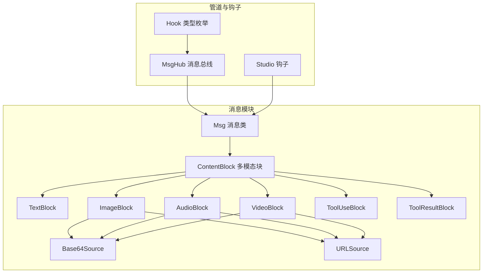
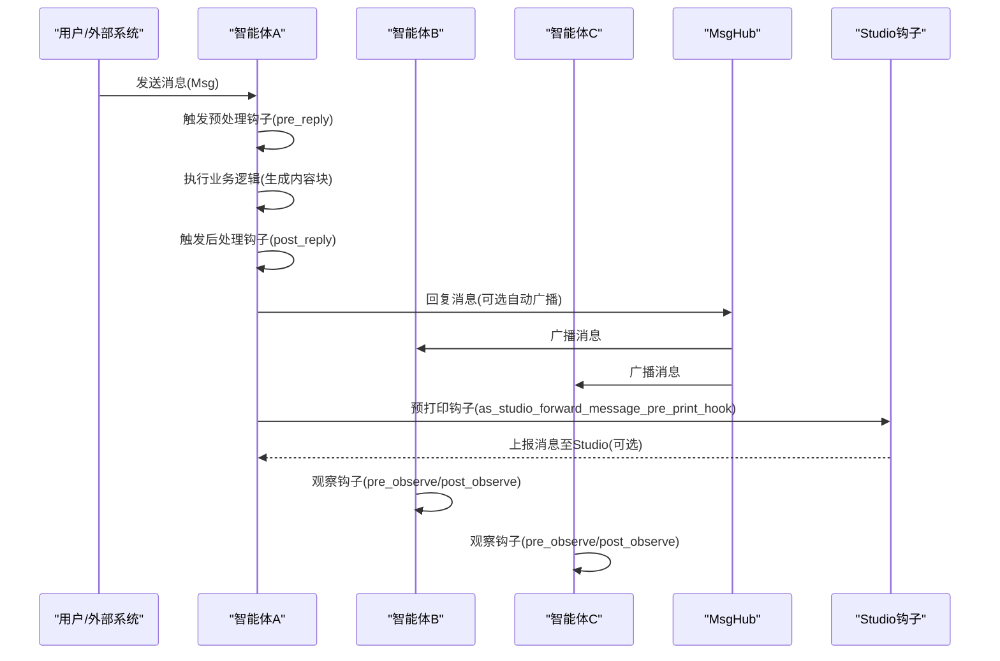
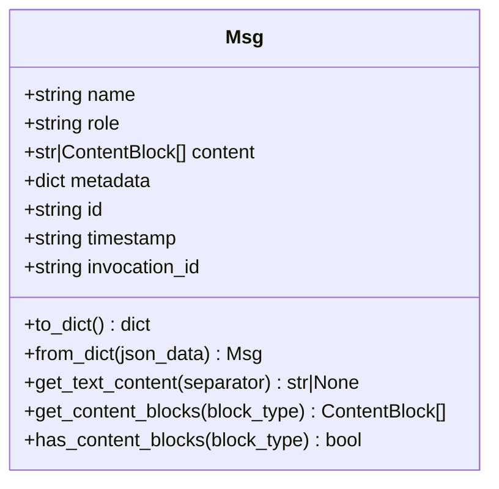
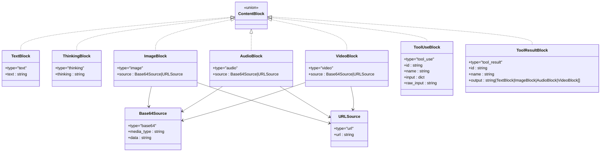
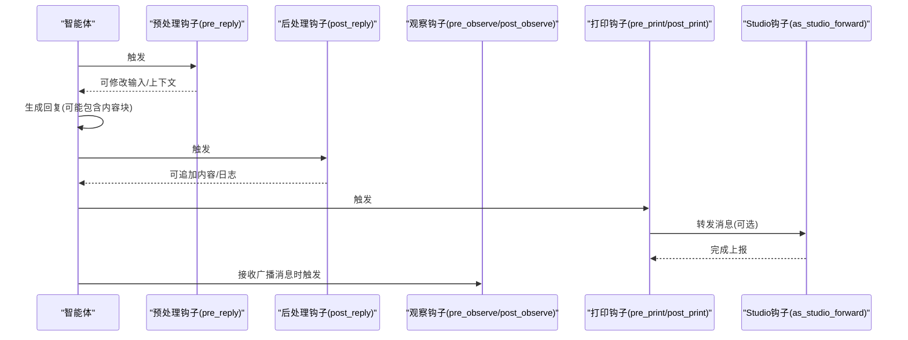
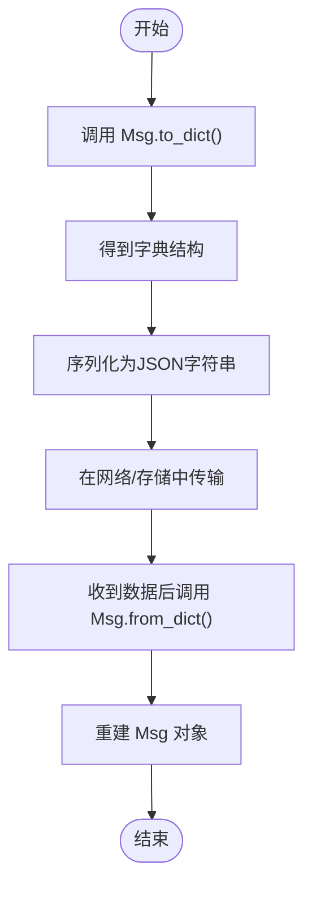
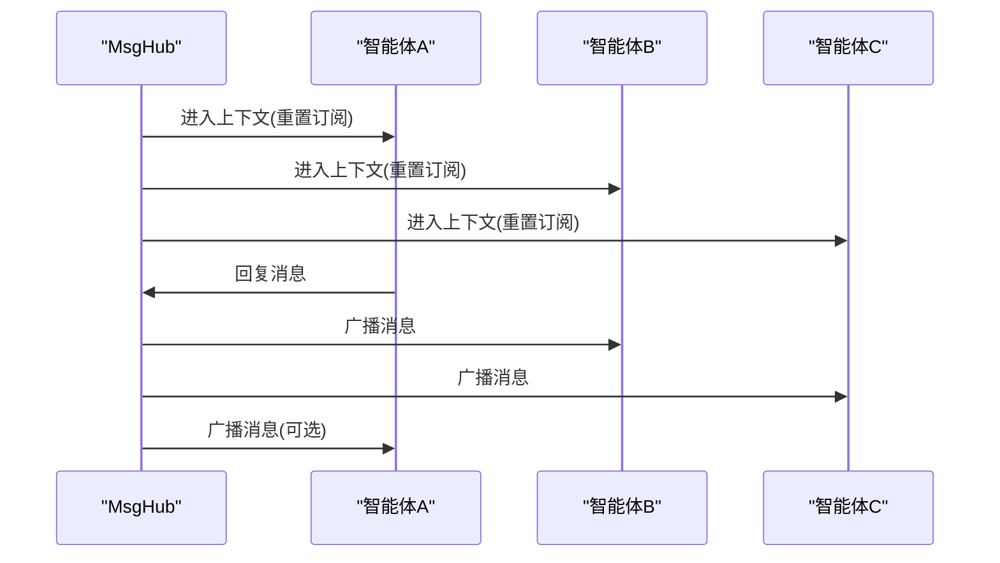
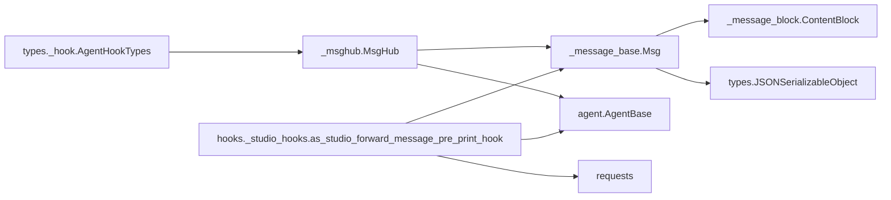

# 消息系统概念

<cite>
**本文引用的文件**
- [消息模块入口](file://src/agentscope/message/__init__.py)
- [消息类定义](file://src/agentscope/message/_message_base.py)
- [内容块类型定义](file://src/agentscope/message/_message_block.py)
- [消息钩子类型定义](file://src/agentscope/types/_hook.py)
- [Studio钩子实现](file://src/agentscope/hooks/_studio_hooks.py)
- [消息总线类](file://src/agentscope/pipeline/_msghub.py)
- [教程：快速开始-消息](file://docs/tutorial/zh_CN/src/quickstart_message.py)
- [测试：钩子机制](file://tests/hook_test.py)
- [测试：格式化器-通义千问](file://tests/formatter_dashscope_test.py)
- [测试：格式化器-Gemini](file://tests/formatter_gemini_test.py)
- [测试：格式化器-Ollama](file://tests/formatter_ollama_test.py)
- [测试：格式化器-OpenAI](file://tests/formatter_openai_test.py)
- [Tracing工具：序列化](file://src/agentscope/tracing/_utils.py)
</cite>

## 目录
1. [引言](#引言)
2. [项目结构](#项目结构)
3. [核心组件](#核心组件)
4. [架构总览](#架构总览)
5. [详细组件分析](#详细组件分析)
6. [依赖分析](#依赖分析)
7. [性能考虑](#性能考虑)
8. [故障排查指南](#故障排查指南)
9. [结论](#结论)
10. [附录](#附录)

## 引言
本文件面向AgentScope消息系统的核心概念，系统性阐述Msg消息类的设计与生命周期、ContentBlock内容块的多模态支持机制（文本、图像、音频、视频、工具调用与结果）、消息钩子机制（预处理、后处理、观察钩子）以及消息的序列化/反序列化与在智能体之间的传递机制。文档同时提供可直接定位到源码路径的示例，帮助读者快速上手与深入理解。

## 项目结构
消息系统主要位于src/agentscope/message目录，配合管道与钩子模块共同构成消息的创建、传播与扩展能力：
- 消息类与内容块：消息类Msg与各类ContentBlock类型
- 钩子类型：统一的钩子类型枚举
- 消息总线：MsgHub用于在一组智能体间广播消息
- 教程与测试：演示消息的创建、多模态内容、工具块、序列化与钩子行为

图表来源
- [消息模块入口:4-16](file://src/agentscope/message/__init__.py#L4-L16)
- [消息类定义:21-242](file://src/agentscope/message/_message_base.py#L21-L242)
- [内容块类型定义:9-129](file://src/agentscope/message/_message_block.py#L9-L129)
- [消息钩子类型定义:5-25](file://src/agentscope/types/_hook.py#L5-L25)
- [消息总线类:14-157](file://src/agentscope/pipeline/_msghub.py#L14-L157)
- [Studio钩子实现:12-59](file://src/agentscope/hooks/_studio_hooks.py#L12-L59)

章节来源
- [消息模块入口:1-32](file://src/agentscope/message/__init__.py#L1-L32)
- [消息类定义:1-242](file://src/agentscope/message/_message_base.py#L1-L242)
- [内容块类型定义:1-129](file://src/agentscope/message/_message_block.py#L1-L129)
- [消息钩子类型定义:1-26](file://src/agentscope/types/_hook.py#L1-L26)
- [消息总线类:1-157](file://src/agentscope/pipeline/_msghub.py#L1-L157)
- [Studio钩子实现:1-59](file://src/agentscope/hooks/_studio_hooks.py#L1-L59)

## 核心组件
- Msg消息类：封装消息的标识、发送者、角色、内容、元数据与时间戳；提供序列化/反序列化与内容块访问接口。
- ContentBlock内容块：多模态数据载体，支持文本、思考、图像、音频、视频、工具调用与结果等类型。
- 消息钩子：在智能体回复前后与观察阶段插入扩展逻辑，支持异步/同步钩子，保证覆盖链路正确执行一次。
- 消息总线MsgHub：在一组智能体之间自动或手动广播消息，简化多智能体协作。

章节来源
- [消息类定义:21-242](file://src/agentscope/message/_message_base.py#L21-L242)
- [内容块类型定义:9-129](file://src/agentscope/message/_message_block.py#L9-L129)
- [消息钩子类型定义:5-25](file://src/agentscope/types/_hook.py#L5-L25)
- [消息总线类:14-157](file://src/agentscope/pipeline/_msghub.py#L14-L157)

## 架构总览
消息系统围绕Msg与ContentBlock展开，通过MsgHub在智能体网络中传播消息；钩子机制贯穿消息的产生、传播与呈现阶段。

图表来源
- [消息总线类:73-139](file://src/agentscope/pipeline/_msghub.py#L73-L139)
- [Studio钩子实现:12-59](file://src/agentscope/hooks/_studio_hooks.py#L12-L59)
- [消息钩子类型定义:5-25](file://src/agentscope/types/_hook.py#L5-L25)

## 详细组件分析

### Msg消息类设计与生命周期
- 设计要点
  - 字段：name、role、content、metadata、id、timestamp、invocation_id
  - 内容支持：字符串或内容块列表；字符串内容在读取时自动转换为TextBlock
  - 生命周期：创建→序列化→传播→反序列化→消费
- 关键方法
  - to_dict/from_dict：JSON序列化/反序列化
  - get_text_content：提取纯文本
  - get_content_blocks：按类型筛选内容块
  - has_content_blocks：检查是否存在某类型内容块
- 典型用法
  - 文本消息：直接传入字符串
  - 多模态消息：传入内容块列表
  - 工具消息：使用ToolUseBlock/ToolResultBlock
  - 推理消息：使用ThinkingBlock

图表来源
- [消息类定义:21-242](file://src/agentscope/message/_message_base.py#L21-L242)

章节来源
- [消息类定义:21-242](file://src/agentscope/message/_message_base.py#L21-L242)

### ContentBlock内容块的多模态支持机制
- 支持类型
  - 文本块：TextBlock
  - 思考块：ThinkingBlock
  - 图像块：ImageBlock（支持Base64Source或URLSource）
  - 音频块：AudioBlock（支持Base64Source或URLSource）
  - 视频块：VideoBlock（支持Base64Source或URLSource）
  - 工具调用块：ToolUseBlock（包含id、name、input、raw_input）
  - 工具结果块：ToolResultBlock（包含id、name、output）
- 数据源
  - Base64Source：媒体类型与编码数据
  - URLSource：远程资源地址
- 使用建议
  - 图像/音频/视频优先使用URLSource以降低消息体积
  - 工具调用与结果需成对出现，id保持一致

图表来源
- [内容块类型定义:9-129](file://src/agentscope/message/_message_block.py#L9-L129)

章节来源
- [内容块类型定义:9-129](file://src/agentscope/message/_message_block.py#L9-L129)

### 消息钩子机制：触发时机与实现
- 钩子类型
  - 预处理钩子：pre_reply（回复前）
  - 后处理钩子：post_reply（回复后）
  - 观察钩子：pre_observe/post_observe（接收消息前/后）
  - 打印钩子：pre_print/post_print（打印前/后）
  - ReAct扩展：pre_reasoning/post_reasoning、pre_acting/post_acting
- 触发时机
  - 预处理钩子在智能体回复前执行，可修改输入或上下文
  - 后处理钩子在智能体回复后执行，可追加内容或日志
  - 观察钩子在智能体接收广播消息时执行
  - 打印钩子在消息打印阶段执行
- 实现与约束
  - 支持异步/同步钩子注册
  - 覆盖reply()/observe()时，确保每个层级仅执行一次
  - 钩子执行顺序遵循注册顺序
- Studio集成
  - as_studio_forward_message_pre_print_hook可在打印前将消息转发至Studio

图表来源
- [消息钩子类型定义:5-25](file://src/agentscope/types/_hook.py#L5-L25)
- [Studio钩子实现:12-59](file://src/agentscope/hooks/_studio_hooks.py#L12-L59)
- [测试：钩子机制:301-544](file://tests/hook_test.py#L301-L544)

章节来源
- [消息钩子类型定义:1-26](file://src/agentscope/types/_hook.py#L1-L26)
- [Studio钩子实现:1-59](file://src/agentscope/hooks/_studio_hooks.py#L1-L59)
- [测试：钩子机制:299-1002](file://tests/hook_test.py#L299-L1002)

### 消息的序列化与反序列化
- 序列化
  - Msg.to_dict：将消息转为字典，包含id、name、role、content、metadata、timestamp
  - Tracing工具：_to_serializable用于将复杂对象（如Msg）转换为可序列化形式
- 反序列化
  - Msg.from_dict：从字典重建消息对象，恢复各字段
- 注意事项
  - content字段可能为字符串或内容块列表
  - Base64Source/URLSource在序列化后仍保持原结构

图表来源
- [消息类定义:75-99](file://src/agentscope/message/_message_base.py#L75-L99)
- [Tracing工具：序列化:15-54](file://src/agentscope/tracing/_utils.py#L15-L54)

章节来源
- [消息类定义:75-99](file://src/agentscope/message/_message_base.py#L75-L99)
- [Tracing工具：序列化:1-54](file://src/agentscope/tracing/_utils.py#L1-L54)

### 消息在智能体间的传递机制
- 自动广播
  - MsgHub在进入上下文时重置订阅者，并可选择自动广播回复消息
- 手动广播
  - broadcast方法向所有参与者发送消息
- 动态管理
  - add/delete动态增删参与者，不影响历史消息
- 与管道结合
  - 通过SequentialPipeline/FanoutPipeline编排多智能体对话流程

图表来源
- [消息总线类:73-139](file://src/agentscope/pipeline/_msghub.py#L73-L139)

章节来源
- [消息总线类:1-157](file://src/agentscope/pipeline/_msghub.py#L1-L157)

## 依赖分析
- 组件耦合
  - Msg依赖ContentBlock及其具体类型
  - MsgHub依赖AgentBase与Msg
  - 钩子类型统一由types模块定义
  - Studio钩子依赖requests与AgentBase/UserAgent
- 外部依赖
  - requests用于Studio钩子上报
  - shortuuid用于生成唯一ID
  - datetime用于时间戳
- 循环依赖
  - 模块间采用单向依赖，避免循环导入

图表来源
- [消息类定义:8-18](file://src/agentscope/message/_message_base.py#L8-L18)
- [消息总线类:9-11](file://src/agentscope/pipeline/_msghub.py#L9-L11)
- [消息钩子类型定义:5-25](file://src/agentscope/types/_hook.py#L5-L25)
- [Studio钩子实现:5-9](file://src/agentscope/hooks/_studio_hooks.py#L5-L9)

章节来源
- [消息类定义:1-242](file://src/agentscope/message/_message_base.py#L1-L242)
- [消息总线类:1-157](file://src/agentscope/pipeline/_msghub.py#L1-L157)
- [消息钩子类型定义:1-26](file://src/agentscope/types/_hook.py#L1-L26)
- [Studio钩子实现:1-59](file://src/agentscope/hooks/_studio_hooks.py#L1-L59)

## 性能考虑
- 多模态大对象
  - 优先使用URLSource而非Base64Source，减少消息体积
  - 对于长文本，建议拆分为多个TextBlock以提升解析效率
- 钩子链路
  - 控制钩子数量与复杂度，避免在钩子中执行阻塞操作
  - 异步钩子应合理并发，避免过度竞争
- 序列化
  - 大消息建议延迟序列化或分片传输
  - 使用from_dict时注意字段完整性校验

## 故障排查指南
- 钩子执行异常
  - 测试覆盖：钩子在覆盖reply()/observe()时仅执行一次，异常后清理保护标志
  - 建议：在钩子中捕获异常并记录日志，避免影响主流程
- Studio上报失败
  - 请求失败会重试最多3次，随后优雅降级并记录警告
  - 建议：检查网络连通性与Studio服务状态
- 消息内容块缺失
  - 使用has_content_blocks与get_content_blocks进行类型检查与过滤
  - 若content为字符串，读取时会自动包装为TextBlock

章节来源
- [测试：钩子机制:919-1002](file://tests/hook_test.py#L919-L1002)
- [Studio钩子实现:29-58](file://src/agentscope/hooks/_studio_hooks.py#L29-L58)
- [消息类定义:101-229](file://src/agentscope/message/_message_base.py#L101-L229)

## 结论
AgentScope的消息系统以Msg为核心，通过ContentBlock实现多模态内容表达；借助MsgHub实现智能体间高效传播；通过钩子机制在关键节点注入扩展能力。该体系兼顾易用性与可扩展性，适合构建复杂的多智能体协作场景。

## 附录

### 实际用例与示例路径
- 创建文本消息
  - [教程：快速开始-消息:67-71](file://docs/tutorial/zh_CN/src/quickstart_message.py#L67-L71)
- 创建多模态消息（文本+图像+音频+视频）
  - [教程：快速开始-消息:133-166](file://docs/tutorial/zh_CN/src/quickstart_message.py#L133-L166)
- 创建推理消息（ThinkingBlock）
  - [教程：快速开始-消息:174-187](file://docs/tutorial/zh_CN/src/quickstart_message.py#L174-L187)
- 创建工具使用/结果消息（ToolUseBlock/ToolResultBlock）
  - [教程：快速开始-消息:197-223](file://docs/tutorial/zh_CN/src/quickstart_message.py#L197-L223)
- 序列化与反序列化
  - [教程：快速开始-消息:233-246](file://docs/tutorial/zh_CN/src/quickstart_message.py#L233-L246)
- 在格式化器中使用多模态消息
  - [测试：格式化器-通义千问:54-130](file://tests/formatter_dashscope_test.py#L54-L130)
  - [测试：格式化器-Gemini:45-146](file://tests/formatter_gemini_test.py#L45-L146)
  - [测试：格式化器-Ollama:45-89](file://tests/formatter_ollama_test.py#L45-L89)
  - [测试：格式化器-OpenAI:43-87](file://tests/formatter_openai_test.py#L43-L87)