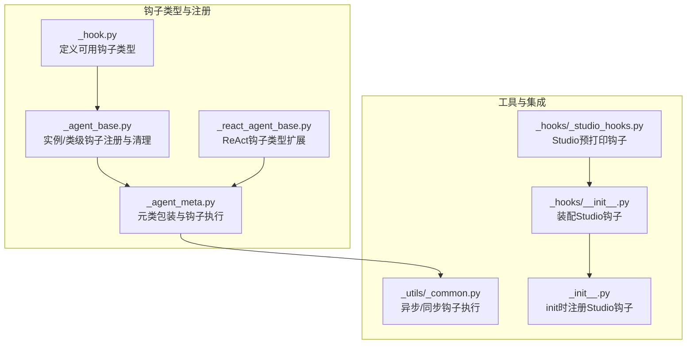
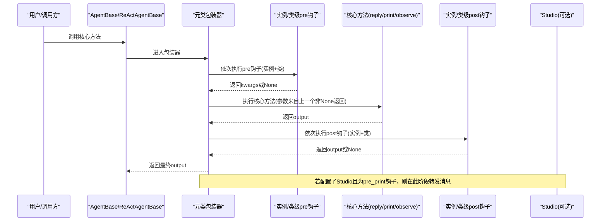
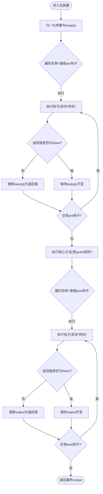
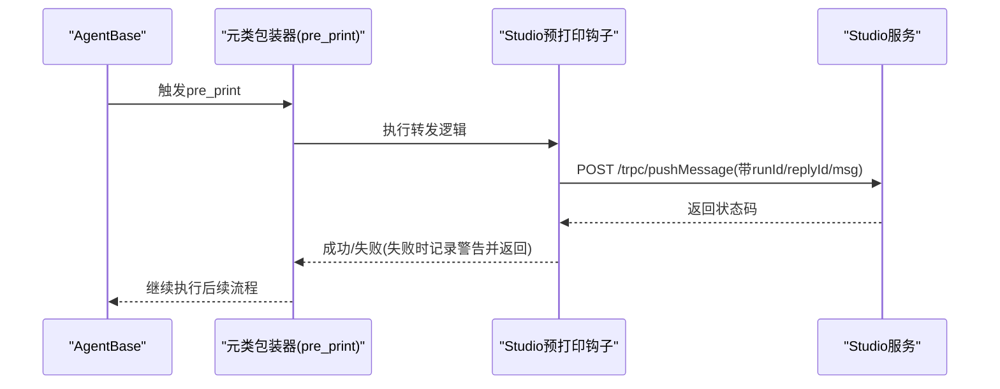
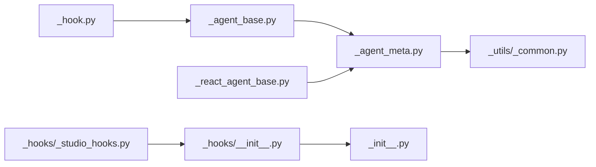

# 消息钩子机制

<cite>
**本文引用的文件**
- [src/agentscope/hooks/_studio_hooks.py](file://src/agentscope/hooks/_studio_hooks.py)
- [src/agentscope/hooks/__init__.py](file://src/agentscope/hooks/__init__.py)
- [src/agentscope/types/_hook.py](file://src/agentscope/types/_hook.py)
- [src/agentscope/agent/_agent_base.py](file://src/agentscope/agent/_agent_base.py)
- [src/agentscope/agent/_agent_meta.py](file://src/agentscope/agent/_agent_meta.py)
- [src/agentscope/agent/_react_agent_base.py](file://src/agentscope/agent/_react_agent_base.py)
- [src/agentscope/_utils/_common.py](file://src/agentscope/_utils/_common.py)
- [src/agentscope/__init__.py](file://src/agentscope/__init__.py)
- [docs/tutorial/zh_CN/src/task_hook.py](file://docs/tutorial/zh_CN/src/task_hook.py)
- [tests/hook_test.py](file://tests/hook_test.py)
</cite>

## 目录
1. [引言](#引言)
2. [项目结构](#项目结构)
3. [核心组件](#核心组件)
4. [架构总览](#架构总览)
5. [详细组件分析](#详细组件分析)
6. [依赖关系分析](#依赖关系分析)
7. [性能考量](#性能考量)
8. [故障排查指南](#故障排查指南)
9. [结论](#结论)
10. [附录](#附录)

## 引言
本文件系统性阐述 AgentScope 的消息钩子机制，重点解释钩子在消息处理流程中的作用、类型与触发时机、注册与管理、执行顺序与参数签名，并结合 Studio 集成场景说明钩子在消息拦截、日志记录与性能监控等方面的应用。同时提供可操作的最佳实践与调试技巧，帮助读者在不侵入核心逻辑的前提下，灵活扩展智能体的消息处理能力。

## 项目结构
与钩子机制直接相关的关键文件与职责如下：
- 钩子类型定义：定义可用的钩子类型集合，区分基础智能体与 ReAct 智能体的钩子范围。
- 钩子注册与管理：在智能体基类中提供实例级与类级钩子的注册、移除与清理接口。
- 元类包装器：通过元类在核心方法前后注入钩子，统一实现预处理与后处理。
- 工具函数：异步/同步钩子执行工具，确保兼容不同类型的钩子函数。
- Studio 集成钩子：内置 Studio 预打印钩子，将消息转发到 Studio 进行可视化与追踪。
- 教程与测试：官方教程给出钩子签名与管理方法；测试覆盖钩子执行顺序、返回值处理与重入保护等关键行为。

**图表来源**
- [src/agentscope/types/_hook.py:1-26](file://src/agentscope/types/_hook.py#L1-L26)
- [src/agentscope/agent/_agent_base.py:36-138](file://src/agentscope/agent/_agent_base.py#L36-L138)
- [src/agentscope/agent/_agent_meta.py:55-156](file://src/agentscope/agent/_agent_meta.py#L55-L156)
- [src/agentscope/agent/_react_agent_base.py:21-90](file://src/agentscope/agent/_react_agent_base.py#L21-L90)
- [src/agentscope/_utils/_common.py:133-156](file://src/agentscope/_utils/_common.py#L133-L156)
- [src/agentscope/hooks/_studio_hooks.py:12-58](file://src/agentscope/hooks/_studio_hooks.py#L12-L58)
- [src/agentscope/hooks/__init__.py:17-29](file://src/agentscope/hooks/__init__.py#L17-L29)
- [src/agentscope/__init__.py:117-145](file://src/agentscope/__init__.py#L117-L145)

**章节来源**
- [src/agentscope/types/_hook.py:1-26](file://src/agentscope/types/_hook.py#L1-L26)
- [src/agentscope/agent/_agent_base.py:36-138](file://src/agentscope/agent/_agent_base.py#L36-L138)
- [src/agentscope/agent/_agent_meta.py:55-156](file://src/agentscope/agent/_agent_meta.py#L55-L156)
- [src/agentscope/agent/_react_agent_base.py:21-90](file://src/agentscope/agent/_react_agent_base.py#L21-L90)
- [src/agentscope/_utils/_common.py:133-156](file://src/agentscope/_utils/_common.py#L133-L156)
- [src/agentscope/hooks/_studio_hooks.py:12-58](file://src/agentscope/hooks/_studio_hooks.py#L12-L58)
- [src/agentscope/hooks/__init__.py:17-29](file://src/agentscope/hooks/__init__.py#L17-L29)
- [src/agentscope/__init__.py:117-145](file://src/agentscope/__init__.py#L117-L145)

## 核心组件
- 钩子类型集合
  - 基础智能体支持：pre_reply、post_reply、pre_print、post_print、pre_observe、post_observe。
  - ReAct 智能体额外支持：pre_reasoning、post_reasoning、pre_acting、post_acting。
- 钩子注册与管理
  - 实例级：register_instance_hook、remove_instance_hook、clear_instance_hooks。
  - 类级：register_class_hook、remove_class_hook、clear_class_hooks。
- 元类包装与执行
  - 元类在 reply、print、observe（以及 ReAct 的 _reasoning、_acting）前后注入钩子，统一参数归一化、异步/同步钩子执行与输出回传。
- 工具函数
  - _execute_async_or_sync_func：根据钩子类型自动选择异步或同步执行。
- Studio 集成
  - as_studio_forward_message_pre_print_hook：在消息打印前转发至 Studio，具备重试与降级保护。

**章节来源**
- [src/agentscope/types/_hook.py:5-25](file://src/agentscope/types/_hook.py#L5-L25)
- [src/agentscope/agent/_agent_base.py:36-138](file://src/agentscope/agent/_agent_base.py#L36-L138)
- [src/agentscope/agent/_agent_meta.py:55-156](file://src/agentscope/agent/_agent_meta.py#L55-L156)
- [src/agentscope/_utils/_common.py:133-156](file://src/agentscope/_utils/_common.py#L133-L156)
- [src/agentscope/hooks/_studio_hooks.py:12-58](file://src/agentscope/hooks/_studio_hooks.py#L12-L58)

## 架构总览
下图展示了钩子在消息处理生命周期中的触发位置与执行顺序，以及与 Studio 集成的外部交互。

**图表来源**
- [src/agentscope/agent/_agent_meta.py:55-156](file://src/agentscope/agent/_agent_meta.py#L55-L156)
- [src/agentscope/agent/_agent_base.py:591-700](file://src/agentscope/agent/_agent_base.py#L591-L700)
- [src/agentscope/hooks/_studio_hooks.py:12-58](file://src/agentscope/hooks/_studio_hooks.py#L12-L58)
- [src/agentscope/hooks/__init__.py:17-29](file://src/agentscope/hooks/__init__.py#L17-L29)

## 详细组件分析

### 钩子类型与触发时机
- 基础智能体
  - pre_reply/post_reply：在 reply 前后触发，适合拦截与修改回复消息、统计耗时、埋点等。
  - pre_print/post_print：在 print 前后触发，适合日志记录、Studio 推送、流式输出控制。
  - pre_observe/post_observe：在 observe 前后触发，适合观察消息的预处理与后处理。
- ReAct 智能体
  - pre_reasoning/post_reasoning：在推理阶段前后触发。
  - pre_acting/post_acting：在行动阶段前后触发。
- 触发顺序
  - 实例级 pre → 类级 pre → 核心方法 → 实例级 post → 类级 post。
  - 同一层级按注册顺序执行；返回值链式传递：非 None 覆盖参数/输出，None 表示沿用上一个非 None 或原始输入。

**章节来源**
- [src/agentscope/types/_hook.py:5-25](file://src/agentscope/types/_hook.py#L5-L25)
- [src/agentscope/agent/_agent_base.py:36-43](file://src/agentscope/agent/_agent_base.py#L36-L43)
- [src/agentscope/agent/_react_agent_base.py:21-33](file://src/agentscope/agent/_react_agent_base.py#L21-L33)
- [src/agentscope/agent/_agent_meta.py:99-154](file://src/agentscope/agent/_agent_meta.py#L99-L154)

### 钩子注册与管理
- 实例级
  - register_instance_hook(hook_type, hook_name, hook)：为当前实例注册钩子。
  - remove_instance_hook(hook_type, hook_name)：移除指定实例钩子。
  - clear_instance_hooks(hook_type=None)：清空指定类型或全部实例钩子。
- 类级
  - register_class_hook(hook_type, hook_name, hook)：为该类所有实例注册钩子。
  - remove_class_hook(hook_type, hook_name)：移除类级钩子。
  - clear_class_hooks(hook_type=None)：清空指定类型或全部类级钩子。
- 注意事项
  - 必须在构造函数中调用父类初始化以完成实例级钩子容器的准备。
  - 不要在钩子中直接调用核心方法，避免递归与死循环。

**章节来源**
- [src/agentscope/agent/_agent_base.py:570-700](file://src/agentscope/agent/_agent_base.py#L570-L700)
- [docs/tutorial/zh_CN/src/task_hook.py:161-195](file://docs/tutorial/zh_CN/src/task_hook.py#L161-L195)

### 元类包装与执行流程
- 参数归一化：将位置参数与关键字参数统一为 kwargs 字典，便于钩子读取与修改。
- 钩子执行：
  - 预处理钩子：逐个执行，若返回非 None，则作为下一个钩子或核心方法的输入。
  - 核心方法：在 guard 属性保护下执行，防止多层继承导致的重复包装引发的重入。
  - 后处理钩子：逐个执行，若返回非 None，则覆盖最终输出。
- 异步/同步兼容：通过工具函数判断并执行钩子，保证混合场景稳定运行。

**图表来源**
- [src/agentscope/agent/_agent_meta.py:21-53](file://src/agentscope/agent/_agent_meta.py#L21-L53)
- [src/agentscope/agent/_agent_meta.py:55-156](file://src/agentscope/agent/_agent_meta.py#L55-L156)
- [src/agentscope/_utils/_common.py:133-156](file://src/agentscope/_utils/_common.py#L133-L156)

**章节来源**
- [src/agentscope/agent/_agent_meta.py:55-156](file://src/agentscope/agent/_agent_meta.py#L55-L156)
- [src/agentscope/_utils/_common.py:133-156](file://src/agentscope/_utils/_common.py#L133-L156)

### Studio 集成钩子
- 钩子功能
  - 在消息打印前将消息体转发到 Studio，携带 runId、replyId、角色与消息内容等信息。
  - 具备最多三次重试与优雅降级：失败时记录警告并继续执行，避免影响主流程。
- 装配方式
  - init(studio_url=...) 时自动注册该钩子到类级 pre_print 钩子队列。
- 使用场景
  - 实时可视化：在 Web 界面中展示消息流转。
  - 追踪与审计：通过 runId 关联一次运行的完整轨迹。
  - 性能监控：结合 Studio 的指标面板进行观测。

**图表来源**
- [src/agentscope/hooks/_studio_hooks.py:12-58](file://src/agentscope/hooks/_studio_hooks.py#L12-L58)
- [src/agentscope/hooks/__init__.py:17-29](file://src/agentscope/hooks/__init__.py#L17-L29)
- [src/agentscope/__init__.py:117-145](file://src/agentscope/__init__.py#L117-L145)

**章节来源**
- [src/agentscope/hooks/_studio_hooks.py:12-58](file://src/agentscope/hooks/_studio_hooks.py#L12-L58)
- [src/agentscope/hooks/__init__.py:17-29](file://src/agentscope/hooks/__init__.py#L17-L29)
- [src/agentscope/__init__.py:117-145](file://src/agentscope/__init__.py#L117-L145)

### 钩子函数签名与参数要求
- 统一签名
  - 前置钩子：(self, kwargs) -> dict[str, Any] | None
  - 后置钩子：(self, kwargs, output) -> Any | None
- 参数说明
  - self：当前智能体实例。
  - kwargs：核心方法的参数字典（已归一化），可读取与修改。
  - output：核心方法的返回值（后置钩子可用）。
- 返回值约定
  - 非 None 将作为下一个钩子或核心方法的输入/输出；None 表示不改变。

**章节来源**
- [docs/tutorial/zh_CN/src/task_hook.py:70-144](file://docs/tutorial/zh_CN/src/task_hook.py#L70-L144)
- [src/agentscope/agent/_agent_meta.py:105-153](file://src/agentscope/agent/_agent_meta.py#L105-L153)

### 实际使用示例与最佳实践
- 定义与注册
  - 在类中注册类级钩子，或在实例上调用 register_instance_hook。
  - 示例参考：[示例路径:211-282](file://docs/tutorial/zh_CN/src/task_hook.py#L211-L282)
- 执行顺序与链式修改
  - 测试覆盖了多钩子注册、返回值链式传递与最终输出一致性，参考：[测试路径:301-620](file://tests/hook_test.py#L301-L620)
- 重入保护
  - 元类通过 guard 属性避免多继承导致的重复包装引发的重入，参考：[实现路径:77-82](file://src/agentscope/agent/_agent_meta.py#L77-L82)
- 最佳实践
  - 避免在钩子中调用核心方法，防止递归。
  - 优先使用 kwargs 的浅拷贝进行修改，必要时深拷贝。
  - 将副作用（如网络请求、IO）放在后置钩子中，减少对核心逻辑的干扰。
  - 在 Studio 集成场景中，确保 studio_url 与 run_id 正确配置。

**章节来源**
- [docs/tutorial/zh_CN/src/task_hook.py:211-282](file://docs/tutorial/zh_CN/src/task_hook.py#L211-L282)
- [tests/hook_test.py:301-620](file://tests/hook_test.py#L301-L620)
- [src/agentscope/agent/_agent_meta.py:77-82](file://src/agentscope/agent/_agent_meta.py#L77-L82)

## 依赖关系分析
- 组件耦合
  - 钩子类型与智能体基类强耦合：supported_hook_types 决定可用钩子集合。
  - 元类与工具函数弱耦合：通过统一的包装器与执行工具实现解耦。
  - Studio 集成通过 hooks 模块装配，与核心逻辑松耦合。
- 外部依赖
  - Studio 集成依赖 HTTP 请求库与短 UUID 库。
  - 日志记录依赖内部 logger。

**图表来源**
- [src/agentscope/types/_hook.py:1-26](file://src/agentscope/types/_hook.py#L1-L26)
- [src/agentscope/agent/_agent_base.py:36-138](file://src/agentscope/agent/_agent_base.py#L36-L138)
- [src/agentscope/agent/_agent_meta.py:159-174](file://src/agentscope/agent/_agent_meta.py#L159-L174)
- [src/agentscope/_utils/_common.py:133-156](file://src/agentscope/_utils/_common.py#L133-L156)
- [src/agentscope/hooks/_studio_hooks.py:12-58](file://src/agentscope/hooks/_studio_hooks.py#L12-L58)
- [src/agentscope/hooks/__init__.py:17-29](file://src/agentscope/hooks/__init__.py#L17-L29)
- [src/agentscope/agent/_react_agent_base.py:21-90](file://src/agentscope/agent/_react_agent_base.py#L21-L90)

**章节来源**
- [src/agentscope/types/_hook.py:1-26](file://src/agentscope/types/_hook.py#L1-L26)
- [src/agentscope/agent/_agent_base.py:36-138](file://src/agentscope/agent/_agent_base.py#L36-L138)
- [src/agentscope/agent/_agent_meta.py:159-174](file://src/agentscope/agent/_agent_meta.py#L159-L174)
- [src/agentscope/_utils/_common.py:133-156](file://src/agentscope/_utils/_common.py#L133-L156)
- [src/agentscope/hooks/_studio_hooks.py:12-58](file://src/agentscope/hooks/_studio_hooks.py#L12-L58)
- [src/agentscope/hooks/__init__.py:17-29](file://src/agentscope/hooks/__init__.py#L17-L29)
- [src/agentscope/agent/_react_agent_base.py:21-90](file://src/agentscope/agent/_react_agent_base.py#L21-L90)

## 性能考量
- 异步钩子开销
  - 元类包装与异步/同步钩子执行存在少量调度成本，建议在高频路径中避免过多复杂 IO。
- 参数拷贝与链式传递
  - kwargs 与 output 的深拷贝仅在必要时进行，减少不必要的内存占用。
- Studio 转发
  - 默认具备重试与降级，避免阻塞主流程；在高并发场景建议评估网络带宽与 Studio 服务承载能力。

## 故障排查指南
- 常见问题
  - 钩子未生效：确认是否在构造函数中调用了父类初始化以准备实例级钩子容器。
  - 执行顺序异常：检查注册顺序与返回值链式传递规则。
  - 递归调用：避免在钩子中再次调用核心方法。
  - Studio 无法推送：检查 studio_url 与 run_id 是否正确配置，关注重试与降级日志。
- 定位手段
  - 使用测试用例验证多钩子链式行为与边界条件。
  - 在钩子中记录关键上下文（如 msg.id、reply_id、时间戳）以便定位问题。

**章节来源**
- [tests/hook_test.py:301-620](file://tests/hook_test.py#L301-L620)
- [src/agentscope/hooks/_studio_hooks.py:51-58](file://src/agentscope/hooks/_studio_hooks.py#L51-L58)

## 结论
AgentScope 的钩子机制通过元类包装与统一签名设计，实现了对智能体消息处理生命周期的细粒度扩展。实例级与类级钩子的组合、严格的执行顺序与返回值处理规则，使得开发者可以在不侵入核心逻辑的前提下，完成消息拦截、日志记录、性能监控与 Studio 集成等多样化需求。配合完善的测试与工具函数，该机制既安全又高效，适用于从研究原型到生产部署的多种场景。

## 附录
- 相关实现路径
  - 钩子类型定义：[类型定义:5-25](file://src/agentscope/types/_hook.py#L5-L25)
  - 钩子注册与清理：[注册与清理:591-700](file://src/agentscope/agent/_agent_base.py#L591-L700)
  - 元类包装与执行：[包装器:55-156](file://src/agentscope/agent/_agent_meta.py#L55-L156)
  - 异步/同步钩子执行：[执行工具:133-156](file://src/agentscope/_utils/_common.py#L133-L156)
  - Studio 预打印钩子：[Studio钩子:12-58](file://src/agentscope/hooks/_studio_hooks.py#L12-L58)
  - 初始化装配：[装配入口:17-29](file://src/agentscope/hooks/__init__.py#L17-L29)、[init集成:117-145](file://src/agentscope/__init__.py#L117-L145)
  - 教程示例：[钩子教程:211-282](file://docs/tutorial/zh_CN/src/task_hook.py#L211-L282)
  - 测试用例：[钩子测试:301-620](file://tests/hook_test.py#L301-L620)