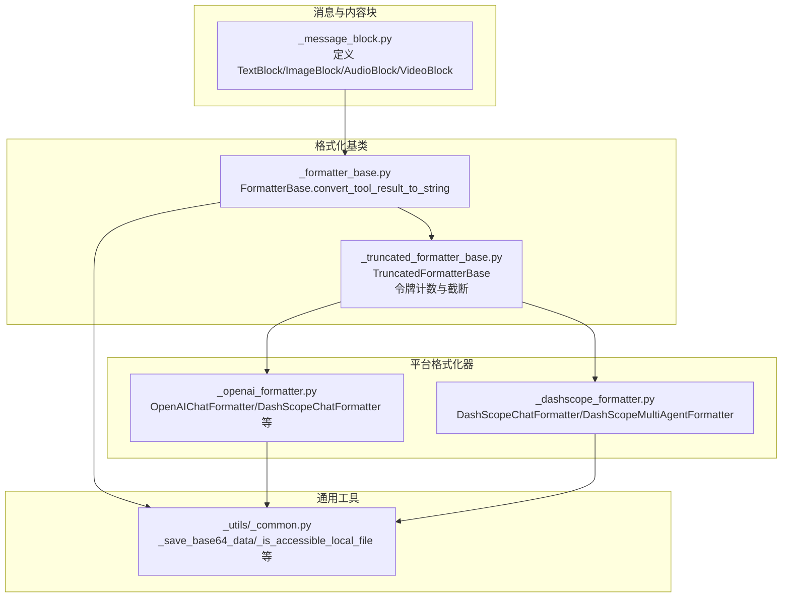
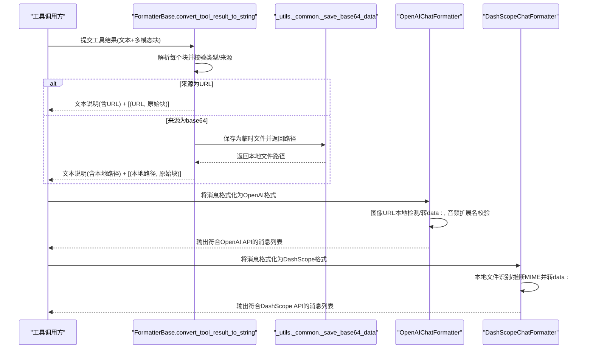
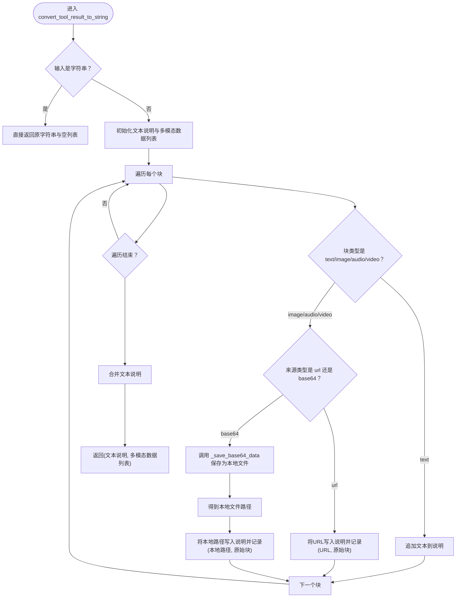
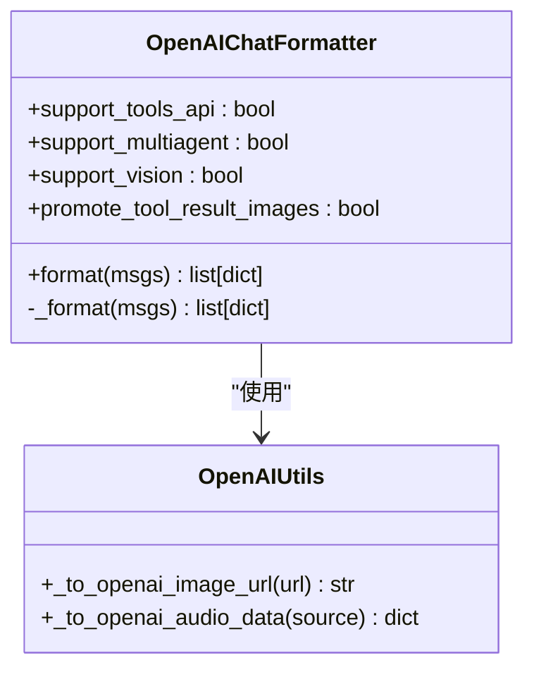
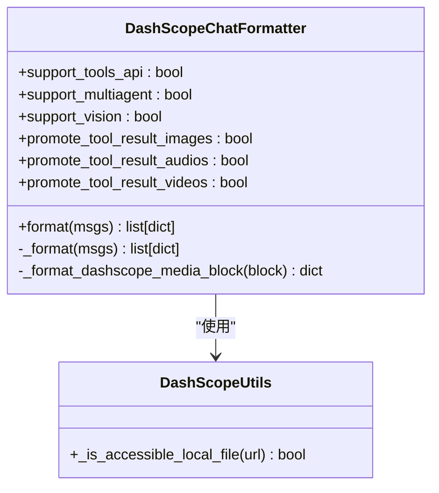
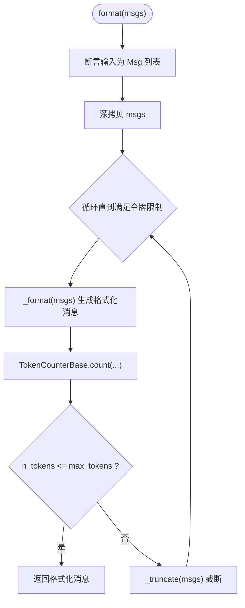
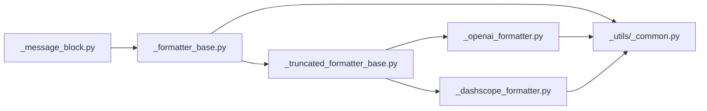

# 多模态格式化

<cite>
**本文档引用的文件**
- [formatter/_formatter_base.py](file://src/agentscope/formatter/_formatter_base.py)
- [formatter/_truncated_formatter_base.py](file://src/agentscope/formatter/_truncated_formatter_base.py)
- [formatter/_openai_formatter.py](file://src/agentscope/formatter/_openai_formatter.py)
- [formatter/_dashscope_formatter.py](file://src/agentscope/formatter/_dashscope_formatter.py)
- [message/_message_block.py](file://src/agentscope/message/_message_block.py)
- [_utils/_common.py](file://src/agentscope/_utils/_common.py)
- [tests/formatter_openai_test.py](file://tests/formatter_openai_test.py)
</cite>

## 目录
1. [简介](#简介)
2. [项目结构](#项目结构)
3. [核心组件](#核心组件)
4. [架构总览](#架构总览)
5. [详细组件分析](#详细组件分析)
6. [依赖关系分析](#依赖关系分析)
7. [性能考量](#性能考量)
8. [故障排查指南](#故障排查指南)
9. [结论](#结论)
10. [附录：API 参考与最佳实践](#附录api-参考与最佳实践)

## 简介
本文件系统性地介绍 AgentScope 的多模态格式化能力，重点覆盖以下方面：
- 多模态内容块（文本、图像、音频、视频）的统一建模与转换机制
- convert_tool_result_to_string 方法的实现细节与行为规范
- base64 数据处理、URL 链接生成、文件保存策略
- 多模态数据的存储与引用机制（本地路径、远程 URL、数据完整性）
- 各大模型平台格式化器的配置选项与适配策略
- 使用示例、格式转换规则、错误处理与最佳实践

## 项目结构
围绕多模态格式化的核心代码主要分布在如下模块：
- 消息与内容块定义：message/_message_block.py
- 格式化基类与可截断格式化器：formatter/_formatter_base.py、formatter/_truncated_formatter_base.py
- 平台特定格式化器：formatter/_openai_formatter.py、formatter/_dashscope_formatter.py
- 通用工具：_utils/_common.py（含 base64 文件保存等）

**图表来源**
- [message/_message_block.py:1-129](file://src/agentscope/message/_message_block.py#L1-L129)
- [formatter/_formatter_base.py:37-129](file://src/agentscope/formatter/_formatter_base.py#L37-L129)
- [formatter/_truncated_formatter_base.py:19-298](file://src/agentscope/formatter/_truncated_formatter_base.py#L19-L298)
- [formatter/_openai_formatter.py:168-371](file://src/agentscope/formatter/_openai_formatter.py#L168-L371)
- [formatter/_dashscope_formatter.py:159-425](file://src/agentscope/formatter/_dashscope_formatter.py#L159-L425)
- [_utils/_common.py:97-214](file://src/agentscope/_utils/_common.py#L97-L214)

**章节来源**
- [formatter/_formatter_base.py:11-129](file://src/agentscope/formatter/_formatter_base.py#L11-L129)
- [formatter/_truncated_formatter_base.py:19-298](file://src/agentscope/formatter/_truncated_formatter_base.py#L19-L298)
- [formatter/_openai_formatter.py:168-371](file://src/agentscope/formatter/_openai_formatter.py#L168-L371)
- [formatter/_dashscope_formatter.py:159-425](file://src/agentscope/formatter/_dashscope_formatter.py#L159-L425)
- [message/_message_block.py:9-129](file://src/agentscope/message/_message_block.py#L9-L129)
- [_utils/_common.py:97-214](file://src/agentscope/_utils/_common.py#L97-L214)

## 核心组件
- 内容块模型：统一描述文本、图像、音频、视频等多模态内容块及其来源（URL 或 base64），用于跨平台传输与格式化。
- 转换器基类：提供 convert_tool_result_to_string，将工具结果中的多模态块转换为文本说明，并返回“本地文件路径或 URL”与原始块的映射，便于后续处理。
- 可截断格式化器：在格式化过程中进行令牌计数与截断，确保输出满足平台限制。
- 平台格式化器：针对不同模型平台（如 OpenAI、DashScope）对多模态内容进行适配，包括 URL/本地文件转 base64、媒体类型校验、扩展名支持等。

**章节来源**
- [message/_message_block.py:9-129](file://src/agentscope/message/_message_block.py#L9-L129)
- [formatter/_formatter_base.py:37-129](file://src/agentscope/formatter/_formatter_base.py#L37-L129)
- [formatter/_truncated_formatter_base.py:47-228](file://src/agentscope/formatter/_truncated_formatter_base.py#L47-L228)

## 架构总览
下图展示从工具结果到最终 API 请求体的关键流程，以及多模态数据在各阶段的处理方式。

**图表来源**
- [formatter/_formatter_base.py:37-129](file://src/agentscope/formatter/_formatter_base.py#L37-L129)
- [_utils/_common.py:192-214](file://src/agentscope/_utils/_common.py#L192-L214)
- [formatter/_openai_formatter.py:27-166](file://src/agentscope/formatter/_openai_formatter.py#L27-L166)
- [formatter/_dashscope_formatter.py:27-77](file://src/agentscope/formatter/_dashscope_formatter.py#L27-L77)

## 详细组件分析

### 组件一：内容块模型与来源
- 文本块：type="text"，包含文本内容
- 图像/音频/视频块：type="image/audio/video"，source 支持 URLSource 或 Base64Source
- URLSource：type="url" + url 字段
- Base64Source：type="base64" + media_type + data（RFC 2397 格式）

这些定义确保了多模态数据在不同平台之间的统一表达。

**章节来源**
- [message/_message_block.py:9-129](file://src/agentscope/message/_message_block.py#L9-L129)

### 组件二：convert_tool_result_to_string 实现详解
该方法负责：
- 输入为字符串时直接返回
- 输入为多模态块列表时：
  - 文本块：拼接到文本说明
  - 图像/音频/视频块：
    - 若来源为 URL：将 URL 写入文本说明，并记录 (URL, 原始块)
    - 若来源为 base64：调用 _save_base64_data 保存为临时文件，将本地路径写入文本说明，并记录 (本地路径, 原始块)
- 返回值：(文本说明, [(路径或URL, 块)]...)，便于后续插入用户消息或进行进一步处理

**图表来源**
- [formatter/_formatter_base.py:37-129](file://src/agentscope/formatter/_formatter_base.py#L37-L129)
- [_utils/_common.py:192-214](file://src/agentscope/_utils/_common.py#L192-L214)

**章节来源**
- [formatter/_formatter_base.py:37-129](file://src/agentscope/formatter/_formatter_base.py#L37-L129)
- [_utils/_common.py:192-214](file://src/agentscope/_utils/_common.py#L192-L214)

### 组件三：OpenAI 格式化器的多模态处理
- 图像块：
  - URL：若为本地文件且扩展名为受支持类型，则读取并转为 data:URL；否则直接透传 URL
  - Base64：直接拼接 data:media_type;base64,...
- 音频块：
  - URL：仅允许 wav、mp3；本地文件或公网 URL 均可，自动 base64 编码
  - Base64：要求 media_type 为 audio/wav 或 audio/mp3
- 工具结果处理：通过 convert_tool_result_to_string 生成文本说明，并根据配置决定是否将图片提升为用户消息以兼容不支持工具结果中图像的平台

**图表来源**
- [formatter/_openai_formatter.py:168-371](file://src/agentscope/formatter/_openai_formatter.py#L168-L371)
- [formatter/_openai_formatter.py:27-166](file://src/agentscope/formatter/_openai_formatter.py#L27-L166)

**章节来源**
- [formatter/_openai_formatter.py:168-371](file://src/agentscope/formatter/_openai_formatter.py#L168-L371)
- [formatter/_openai_formatter.py:27-166](file://src/agentscope/formatter/_openai_formatter.py#L27-L166)

### 组件四：DashScope 格式化器的多模态处理
- 本地文件识别：通过 _is_accessible_local_file 判断是否为本地文件，若是则推断 MIME 类型并读取后 base64 编码为 data:URL
- 远程 URL：直接透传
- Base64：直接拼接 data:media_type;base64,...
- 工具结果处理：与 OpenAI 类似，但支持对图像、音频、视频三种类型分别提升为用户消息

**图表来源**
- [formatter/_dashscope_formatter.py:159-425](file://src/agentscope/formatter/_dashscope_formatter.py#L159-L425)
- [_utils/_common.py:97-103](file://src/agentscope/_utils/_common.py#L97-L103)

**章节来源**
- [formatter/_dashscope_formatter.py:159-425](file://src/agentscope/formatter/_dashscope_formatter.py#L159-L425)
- [_utils/_common.py:97-103](file://src/agentscope/_utils/_common.py#L97-L103)

### 组件五：可截断格式化器与令牌计数
- 在格式化前深拷贝消息，避免修改原始输入
- 通过 TokenCounterBase 计算格式化后的令牌数
- 当超出 max_tokens 时，按工具调用与结果成组的策略进行截断，确保工具调用与其结果保持配对

**图表来源**
- [formatter/_truncated_formatter_base.py:47-228](file://src/agentscope/formatter/_truncated_formatter_base.py#L47-L228)

**章节来源**
- [formatter/_truncated_formatter_base.py:47-228](file://src/agentscope/formatter/_truncated_formatter_base.py#L47-L228)

## 依赖关系分析
- convert_tool_result_to_string 依赖于消息块模型与通用工具库中的 _save_base64_data
- OpenAI/DashScope 格式化器在处理本地文件时依赖 _is_accessible_local_file 与文件类型推断
- 可截断格式化器依赖 TokenCounterBase 进行令牌计数与截断

**图表来源**
- [message/_message_block.py:9-129](file://src/agentscope/message/_message_block.py#L9-L129)
- [formatter/_formatter_base.py:37-129](file://src/agentscope/formatter/_formatter_base.py#L37-L129)
- [_utils/_common.py:97-214](file://src/agentscope/_utils/_common.py#L97-L214)
- [formatter/_truncated_formatter_base.py:19-298](file://src/agentscope/formatter/_truncated_formatter_base.py#L19-L298)
- [formatter/_openai_formatter.py:168-371](file://src/agentscope/formatter/_openai_formatter.py#L168-L371)
- [formatter/_dashscope_formatter.py:159-425](file://src/agentscope/formatter/_dashscope_formatter.py#L159-L425)

**章节来源**
- [formatter/_formatter_base.py:37-129](file://src/agentscope/formatter/_formatter_base.py#L37-L129)
- [_utils/_common.py:97-214](file://src/agentscope/_utils/_common.py#L97-L214)
- [formatter/_openai_formatter.py:168-371](file://src/agentscope/formatter/_openai_formatter.py#L168-L371)
- [formatter/_dashscope_formatter.py:159-425](file://src/agentscope/formatter/_dashscope_formatter.py#L159-L425)

## 性能考量
- base64 保存策略：convert_tool_result_to_string 对 base64 数据会落盘为临时文件，建议在工具链末端清理临时文件，避免磁盘占用
- 本地文件检测：OpenAI/DashScope 在处理本地文件时会读取整个文件并进行 base64 编码，对于大文件可能带来内存与 I/O 压力
- 令牌截断：可截断格式化器采用“工具调用与结果成组截断”的策略，减少对对话连贯性的破坏
- 平台差异：不同平台对媒体类型与扩展名支持不同，应尽量在上游统一媒体类型，减少二次转换

[本节为通用指导，无需具体文件分析]

## 故障排查指南
- “无效块类型”或“缺少 source 键”
  - 现象：抛出异常，提示块类型不受支持或缺少 source
  - 排查：确认块的 type 与 source 字段齐全，遵循消息块模型定义
- “不支持的来源类型”
  - 现象：OpenAI/DashScope 格式化器对非 url/base64 的来源抛错
  - 排查：确保 source.type 为 "url" 或 "base64"
- “不支持的音频扩展名/媒体类型”
  - 现象：OpenAI 格式化器对非 wav/mp3 的音频扩展名或 media_type 抛错
  - 排查：转换为受支持格式后再提交
- “无法确定本地文件媒体类型”
  - 现象：DashScope 格式化器在本地文件无扩展名时无法推断 MIME
  - 排查：为文件添加标准扩展名或显式提供 media_type
- “工具调用缺失对应结果”
  - 现象：可截断格式化器在截断阶段报错，提示存在未配对的工具调用
  - 排查：确保工具调用序列与结果一一对应

**章节来源**
- [formatter/_formatter_base.py:77-123](file://src/agentscope/formatter/_formatter_base.py#L77-L123)
- [formatter/_openai_formatter.py:116-166](file://src/agentscope/formatter/_openai_formatter.py#L116-L166)
- [formatter/_dashscope_formatter.py:27-77](file://src/agentscope/formatter/_dashscope_formatter.py#L27-L77)
- [formatter/_truncated_formatter_base.py:179-215](file://src/agentscope/formatter/_truncated_formatter_base.py#L179-L215)

## 结论
AgentScope 的多模态格式化体系以统一的内容块模型为基础，通过可截断格式化器与平台适配器，实现了对文本、图像、音频、视频等多模态数据的标准化处理。convert_tool_result_to_string 提供了稳定的工具结果文本化与多模态数据索引能力，配合 OpenAI/DashScope 等格式化器，能够高效兼容主流模型平台的 API 要求。建议在实际工程中结合令牌限制、媒体类型支持与文件大小，制定合适的预处理与清理策略，确保稳定性与性能。

[本节为总结，无需具体文件分析]

## 附录：API 参考与最佳实践

### API 参考
- convert_tool_result_to_string
  - 输入：字符串或内容块列表（文本/图像/音频/视频）
  - 输出：(文本说明, [(路径或URL, 原始块)]...)
  - 典型用途：将工具结果转换为纯文本说明，并保留多模态数据的可追溯索引
- OpenAIChatFormatter
  - 关键参数：promote_tool_result_images（是否将工具结果中的图片提升为用户消息）、token_counter、max_tokens
  - 支持：文本、图像、音频、工具调用/结果
- DashScopeChatFormatter
  - 关键参数：promote_tool_result_images/audios/videos（分别控制提升）、token_counter、max_tokens
  - 支持：文本、图像、音频、视频、工具调用/结果

**章节来源**
- [formatter/_formatter_base.py:37-129](file://src/agentscope/formatter/_formatter_base.py#L37-L129)
- [formatter/_openai_formatter.py:192-217](file://src/agentscope/formatter/_openai_formatter.py#L192-L217)
- [formatter/_dashscope_formatter.py:201-242](file://src/agentscope/formatter/_dashscope_formatter.py#L201-L242)

### 最佳实践
- 统一媒体类型：优先使用标准 MIME 类型，避免运行时推断失败
- 控制文件大小：对大体积媒体进行预处理（压缩、降采样），减少 I/O 与内存压力
- 明确来源类型：根据场景选择 URL 或 base64，URL 更适合远程资源，base64 适合离线或需要稳定访问的场景
- 合理使用提升策略：当目标平台不支持工具结果中的多模态时，启用 promote_tool_result_* 选项，将多模态数据作为用户消息插入
- 清理临时文件：使用 convert_tool_result_to_string 保存的临时文件应在合适时机删除，避免磁盘污染
- 令牌控制：为长对话设置合理的 max_tokens，并使用可截断格式化器进行自动截断

[本节为通用指导，无需具体文件分析]

### 使用示例（基于测试用例思路）
- OpenAI：在消息中包含文本与图像/音频块，格式化器会将本地图像转为 data:URL，音频按扩展名与媒体类型校验后编码
- DashScope：在工具结果中返回图像/音频/视频块，格式化器会将本地文件转为 data:URL 并生成文本说明，必要时将多模态提升为用户消息

**章节来源**
- [tests/formatter_openai_test.py:1-200](file://tests/formatter_openai_test.py#L1-L200)
- [formatter/_openai_formatter.py:168-371](file://src/agentscope/formatter/_openai_formatter.py#L168-L371)
- [formatter/_dashscope_formatter.py:159-425](file://src/agentscope/formatter/_dashscope_formatter.py#L159-L425)