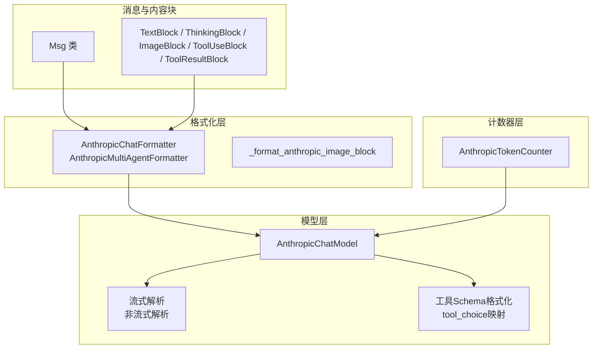
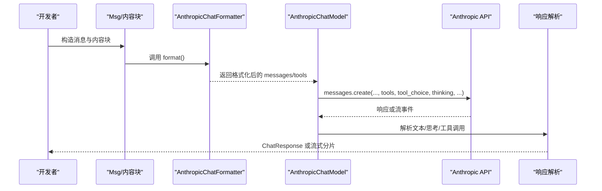
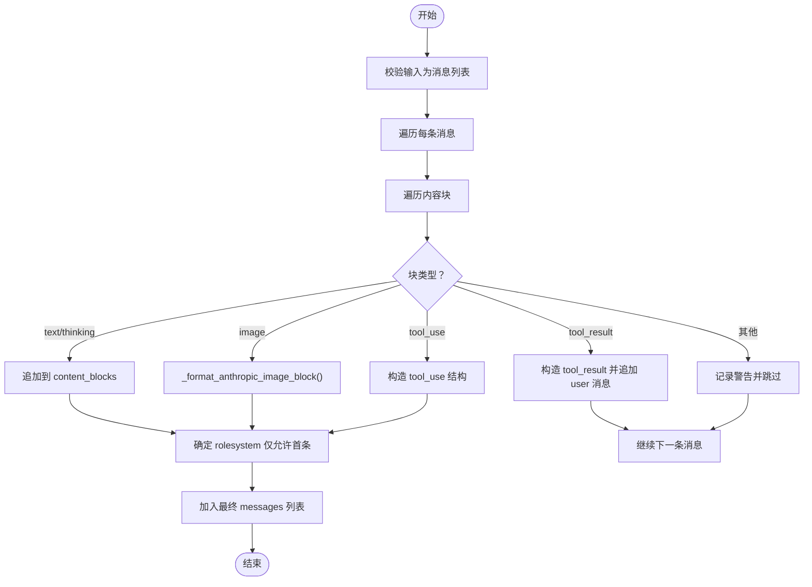
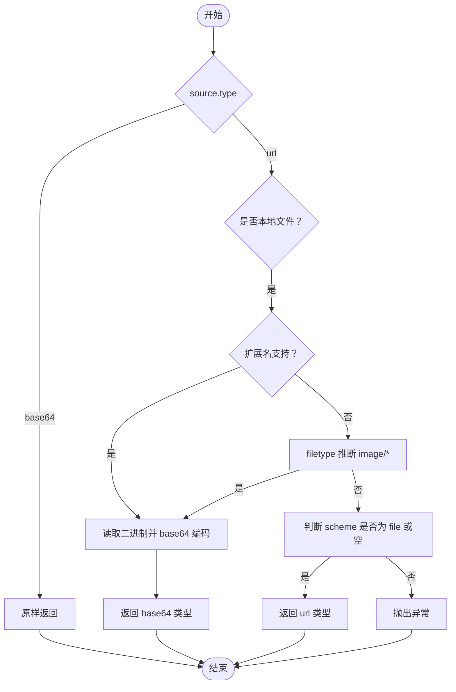
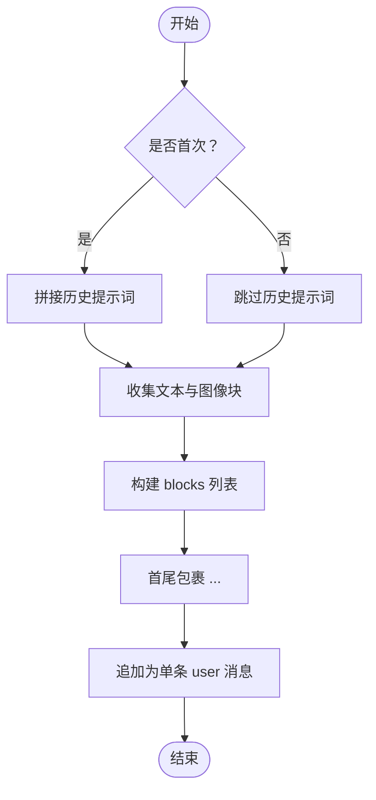
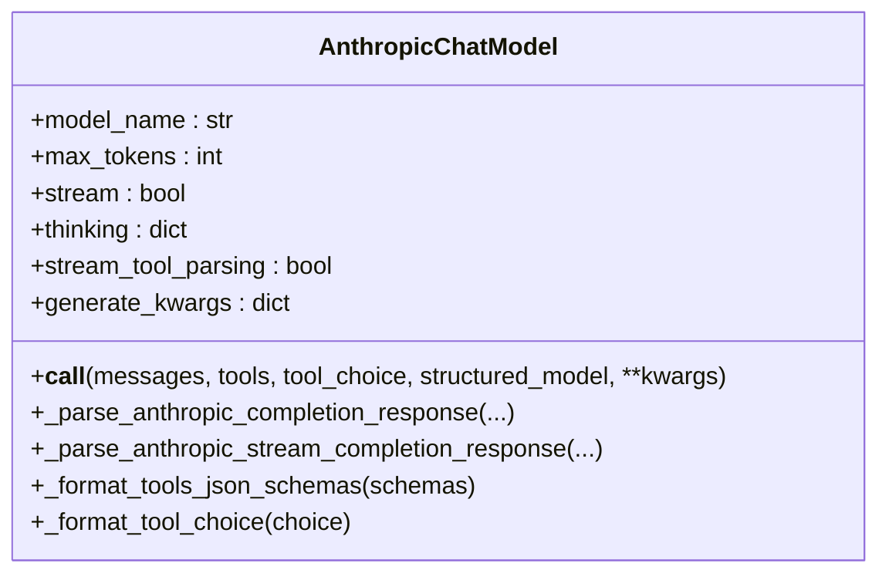
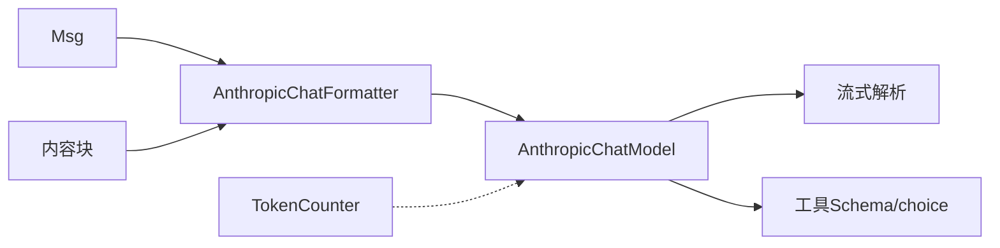

# Anthropic格式化器

<cite>
**本文引用的文件列表**
- [src/agentscope/formatter/_anthropic_formatter.py](file://src/agentscope/formatter/_anthropic_formatter.py)
- [src/agentscope/model/_anthropic_model.py](file://src/agentscope/model/_anthropic_model.py)
- [src/agentscope/token/_anthropic_token_counter.py](file://src/agentscope/token/_anthropic_token_counter.py)
- [src/agentscope/message/_message_base.py](file://src/agentscope/message/_message_base.py)
- [src/agentscope/message/_message_block.py](file://src/agentscope/message/_message_block.py)
- [tests/formatter_anthropic_test.py](file://tests/formatter_anthropic_test.py)
- [tests/model_anthropic_test.py](file://tests/model_anthropic_test.py)
- [tests/token_anthropic_test.py](file://tests/token_anthropic_test.py)
</cite>

## 目录
1. [简介](#简介)
2. [项目结构](#项目结构)
3. [核心组件](#核心组件)
4. [架构概览](#架构概览)
5. [详细组件分析](#详细组件分析)
6. [依赖关系分析](#依赖关系分析)
7. [性能考量](#性能考量)
8. [故障排查指南](#故障排查指南)
9. [结论](#结论)
10. [附录](#附录)

## 简介
本技术文档面向使用 AgentScope 的开发者，系统性阐述 Anthropic 格式化器的实现与用法，覆盖提示词工程、消息格式转换、特殊标记处理、API 规范适配（system prompt、assistant 回答、用户输入）、工具调用与结果回传、多模态图像处理、多代理对话场景下的历史拼接策略，以及配置参数（如 temperature、max_tokens、thinking 等）在模型层的集成方式。同时提供调试技巧与性能优化建议，并通过测试用例路径帮助读者快速定位实现细节。

## 项目结构
与 Anthropic 相关的核心模块分布如下：
- 格式化层：负责将内部消息对象转换为 Anthropic API 所需的消息数组
- 模型层：封装 Anthropic 客户端调用，支持流式与非流式响应解析、工具调用、结构化输出
- 计数器层：提供基于 Anthropic API 的 token 预估能力
- 消息与内容块：定义 Msg 与各类内容块（文本、思考、图像、工具调用、工具结果）的数据结构

图表来源
- [src/agentscope/formatter/_anthropic_formatter.py:98-217](file://src/agentscope/formatter/_anthropic_formatter.py#L98-L217)
- [src/agentscope/model/_anthropic_model.py:40-273](file://src/agentscope/model/_anthropic_model.py#L40-L273)
- [src/agentscope/token/_anthropic_token_counter.py:7-62](file://src/agentscope/token/_anthropic_token_counter.py#L7-L62)
- [src/agentscope/message/_message_base.py:21-242](file://src/agentscope/message/_message_base.py#L21-L242)
- [src/agentscope/message/_message_block.py:9-129](file://src/agentscope/message/_message_block.py#L9-L129)

章节来源
- [src/agentscope/formatter/_anthropic_formatter.py:1-355](file://src/agentscope/formatter/_anthropic_formatter.py#L1-L355)
- [src/agentscope/model/_anthropic_model.py:1-608](file://src/agentscope/model/_anthropic_model.py#L1-L608)
- [src/agentscope/token/_anthropic_token_counter.py:1-63](file://src/agentscope/token/_anthropic_token_counter.py#L1-L63)
- [src/agentscope/message/_message_base.py:1-242](file://src/agentscope/message/_message_base.py#L1-L242)
- [src/agentscope/message/_message_block.py:1-129](file://src/agentscope/message/_message_block.py#L1-L129)

## 核心组件
- AnthropicChatFormatter：单代理聊天场景的消息格式化器，支持文本、图像、工具调用与工具结果；对 system 消息仅允许首条出现。
- AnthropicMultiAgentFormatter：多代理对话场景的消息格式化器，将对话历史按“<history>...</history>”标签拼接为单条 user 消息，支持多模态图片。
- AnthropicChatModel：Anthropic 客户端封装，支持流式/非流式响应、工具调用、结构化输出、thinking 控制、generate_kwargs 透传。
- AnthropicTokenCounter：基于 Anthropic API 的 token 预估，注意多模态数据需为 base64 格式。

章节来源
- [src/agentscope/formatter/_anthropic_formatter.py:98-217](file://src/agentscope/formatter/_anthropic_formatter.py#L98-L217)
- [src/agentscope/formatter/_anthropic_formatter.py:220-355](file://src/agentscope/formatter/_anthropic_formatter.py#L220-L355)
- [src/agentscope/model/_anthropic_model.py:40-273](file://src/agentscope/model/_anthropic_model.py#L40-L273)
- [src/agentscope/token/_anthropic_token_counter.py:7-62](file://src/agentscope/token/_anthropic_token_counter.py#L7-L62)

## 架构概览
下图展示了从消息对象到 Anthropic API 请求与响应的关键流程，包括格式化、工具调用、流式解析与结构化输出。

图表来源
- [src/agentscope/formatter/_anthropic_formatter.py:123-217](file://src/agentscope/formatter/_anthropic_formatter.py#L123-L217)
- [src/agentscope/model/_anthropic_model.py:137-273](file://src/agentscope/model/_anthropic_model.py#L137-L273)

## 详细组件分析

### 组件一：AnthropicChatFormatter（单代理）
- 支持内容块类型：文本、思考、图像、工具调用、工具结果
- system 消息限制：仅第一条消息可为 system，后续 system 将被降级为 user
- 图像处理：本地文件与 URL 的 base64 编码；未知扩展名时尝试 filetype 推断；Web URL 直接透传
- 工具结果：将 tool_result 转换为独立的 user 消息，content 为 tool_result 结构

图表来源
- [src/agentscope/formatter/_anthropic_formatter.py:123-217](file://src/agentscope/formatter/_anthropic_formatter.py#L123-L217)

章节来源
- [src/agentscope/formatter/_anthropic_formatter.py:98-217](file://src/agentscope/formatter/_anthropic_formatter.py#L98-L217)

### 组件二：_format_anthropic_image_block（图像块格式化）
- 支持扩展名：png、jpg、jpeg、gif、webp
- 本地文件：读取二进制并 base64 编码，自动推断媒体类型
- Web URL：直接透传为 url 类型
- 其他情况：抛出异常

图表来源
- [src/agentscope/formatter/_anthropic_formatter.py:16-95](file://src/agentscope/formatter/_anthropic_formatter.py#L16-L95)

章节来源
- [src/agentscope/formatter/_anthropic_formatter.py:16-95](file://src/agentscope/formatter/_anthropic_formatter.py#L16-L95)

### 组件三：AnthropicMultiAgentFormatter（多代理）
- 将多轮对话历史拼接为单条 user 消息，使用“<history>...</history>”包裹
- 支持文本与图像混合，自动在文本段之间插入换行与名称前缀
- 首次调用可注入“会话历史”提示词，后续调用可选择不重复

图表来源
- [src/agentscope/formatter/_anthropic_formatter.py:245-355](file://src/agentscope/formatter/_anthropic_formatter.py#L245-L355)

章节来源
- [src/agentscope/formatter/_anthropic_formatter.py:220-355](file://src/agentscope/formatter/_anthropic_formatter.py#L220-L355)

### 组件四：AnthropicChatModel（模型封装）
- 初始化参数：model_name、api_key、max_tokens、stream、thinking、stream_tool_parsing、client_kwargs、generate_kwargs
- 请求组装：提取首条 system 内容作为 system 参数，其余消息进入 messages；根据 tools 与 tool_choice 格式化为 API 所需结构
- 流式解析：实时拼接文本、思考、工具调用输入；支持流式 JSON 修复；可选在流式模式下延迟解析工具输入
- 非流式解析：一次性解析文本、思考、工具调用；结构化输出时将期望结构写入 metadata
- thinking：若未显式传入，可使用初始化时的 thinking 配置

图表来源
- [src/agentscope/model/_anthropic_model.py:40-608](file://src/agentscope/model/_anthropic_model.py#L40-L608)

章节来源
- [src/agentscope/model/_anthropic_model.py:40-273](file://src/agentscope/model/_anthropic_model.py#L40-L273)
- [src/agentscope/model/_anthropic_model.py:275-576](file://src/agentscope/model/_anthropic_model.py#L275-L576)
- [src/agentscope/model/_anthropic_model.py:578-608](file://src/agentscope/model/_anthropic_model.py#L578-L608)

### 组件五：AnthropicTokenCounter（token 计数）
- 作用：调用 Anthropic 的 token 计数接口，预估输入消息的 token 数
- 注意：多模态数据必须为 base64 格式；支持传入 tools 与 system

章节来源
- [src/agentscope/token/_anthropic_token_counter.py:7-62](file://src/agentscope/token/_anthropic_token_counter.py#L7-L62)

## 依赖关系分析
- 格式化器依赖消息与内容块类型，确保输入合法性与类型一致性
- 模型层依赖格式化器输出，同时负责工具 Schema 格式化与 tool_choice 映射
- 计数器层与模型层并行存在，用于运行前的 token 预估

图表来源
- [src/agentscope/message/_message_base.py:21-242](file://src/agentscope/message/_message_base.py#L21-L242)
- [src/agentscope/message/_message_block.py:9-129](file://src/agentscope/message/_message_block.py#L9-L129)
- [src/agentscope/formatter/_anthropic_formatter.py:98-217](file://src/agentscope/formatter/_anthropic_formatter.py#L98-L217)
- [src/agentscope/model/_anthropic_model.py:40-273](file://src/agentscope/model/_anthropic_model.py#L40-L273)
- [src/agentscope/token/_anthropic_token_counter.py:7-62](file://src/agentscope/token/_anthropic_token_counter.py#L7-L62)

章节来源
- [src/agentscope/message/_message_base.py:1-242](file://src/agentscope/message/_message_base.py#L1-L242)
- [src/agentscope/message/_message_block.py:1-129](file://src/agentscope/message/_message_block.py#L1-L129)
- [src/agentscope/formatter/_anthropic_formatter.py:1-355](file://src/agentscope/formatter/_anthropic_formatter.py#L1-L355)
- [src/agentscope/model/_anthropic_model.py:1-608](file://src/agentscope/model/_anthropic_model.py#L1-L608)
- [src/agentscope/token/_anthropic_token_counter.py:1-63](file://src/agentscope/token/_anthropic_token_counter.py#L1-L63)

## 性能考量
- 流式解析：开启流式可降低首字节延迟，但需注意工具输入的 JSON 修复成本；可通过 stream_tool_parsing 控制
- 多模态图像：本地文件转 base64 会产生额外 CPU 与内存开销；尽量复用已编码资源或减少图像尺寸
- thinking：启用内部推理会增加 token 使用；在需要稳定输出时谨慎开启
- token 预估：使用 TokenCounter 在请求前估算 token，避免超限错误与不必要的重试

[本节为通用指导，无需列出具体文件来源]

## 故障排查指南
- 图像无法识别
  - 现象：抛出“无效图像 URL”异常
  - 排查：确认 URL 为本地文件路径或 Web URL；扩展名在支持列表内；或使用支持的媒体类型
  - 参考路径：[图像格式化函数:16-95](file://src/agentscope/formatter/_anthropic_formatter.py#L16-L95)
- system 消息位置错误
  - 现象：后续 system 消息被降级为 user
  - 排查：确保仅第一条消息为 system；否则会被转换为 user
  - 参考路径：[角色映射逻辑:202-206](file://src/agentscope/formatter/_anthropic_formatter.py#L202-L206)
- 工具调用未生效
  - 现象：模型未触发工具调用
  - 排查：检查 tools 与 tool_choice 格式；确认 tool_choice 不为 "none"；必要时使用 structured_model 强制结构化输出
  - 参考路径：[工具 Schema 格式化:551-576](file://src/agentscope/model/_anthropic_model.py#L551-L576)，[tool_choice 映射:578-608](file://src/agentscope/model/_anthropic_model.py#L578-L608)
- 流式工具输入为空
  - 现象：流式解析中工具输入为空
  - 排查：关闭 stream_tool_parsing 可在最后统一解析；或检查模型返回的 input_json_delta
  - 参考路径：[流式解析:362-549](file://src/agentscope/model/_anthropic_model.py#L362-L549)
- token 预估不准确
  - 现象：预估值与实际消耗不符
  - 排查：确认多模态数据已转为 base64；tools 与 system 已正确传入
  - 参考路径：[token 计数器:24-62](file://src/agentscope/token/_anthropic_token_counter.py#L24-L62)

章节来源
- [src/agentscope/formatter/_anthropic_formatter.py:16-95](file://src/agentscope/formatter/_anthropic_formatter.py#L16-L95)
- [src/agentscope/formatter/_anthropic_formatter.py:202-206](file://src/agentscope/formatter/_anthropic_formatter.py#L202-L206)
- [src/agentscope/model/_anthropic_model.py:551-608](file://src/agentscope/model/_anthropic_model.py#L551-L608)
- [src/agentscope/model/_anthropic_model.py:362-549](file://src/agentscope/model/_anthropic_model.py#L362-L549)
- [src/agentscope/token/_anthropic_token_counter.py:24-62](file://src/agentscope/token/_anthropic_token_counter.py#L24-L62)

## 结论
Anthropic 格式化器与模型封装共同实现了从内部消息到 Anthropic API 的完整链路，覆盖多模态、工具调用、结构化输出与流式解析等关键能力。通过合理的提示词工程与配置参数（如 thinking、max_tokens、generate_kwargs），可在保证安全性与可控性的前提下提升生成质量与稳定性。建议在生产环境中结合 TokenCounter 进行预估，并针对图像与工具调用进行性能优化。

[本节为总结性内容，无需列出具体文件来源]

## 附录

### 配置选项说明（模型层）
- model_name：模型名称
- api_key：Anthropic API 密钥
- max_tokens：最大生成 token 数
- stream：是否启用流式输出
- thinking：内部推理配置（type、budget_tokens 等）
- stream_tool_parsing：流式模式下是否实时修复工具输入 JSON
- client_kwargs：传递给 Anthropic 客户端的额外参数
- generate_kwargs：传递给 API 的生成参数（如 temperature、top_p 等）

章节来源
- [src/agentscope/model/_anthropic_model.py:48-92](file://src/agentscope/model/_anthropic_model.py#L48-L92)

### 实际使用案例（测试用例路径）
- 单代理聊天格式化：验证 system、文本、图像、工具调用与工具结果的组合
  - [测试入口:463-511](file://tests/formatter_anthropic_test.py#L463-L511)
- 多代理历史拼接：验证历史段落拼接与标签包裹
  - [测试入口:512-597](file://tests/formatter_anthropic_test.py#L512-L597)
- 本地图像转 base64：验证用户消息与工具结果中的本地图像编码
  - [测试入口:606-677](file://tests/formatter_anthropic_test.py#L606-L677)
- 模型初始化与参数透传：验证默认与自定义参数
  - [测试入口:54-89](file://tests/model_anthropic_test.py#L54-L89)
- 流式工具输入解析：验证流式 JSON 修复与最终聚合
  - [测试入口:384-400](file://tests/model_anthropic_test.py#L384-L400)
- token 计数：验证多模态 base64 数据与 tools/system 的传入
  - [测试入口:98-108](file://tests/token_anthropic_test.py#L98-L108)