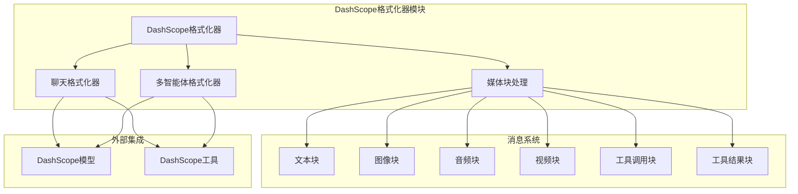
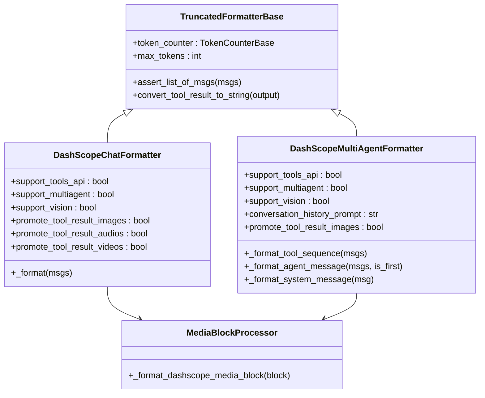
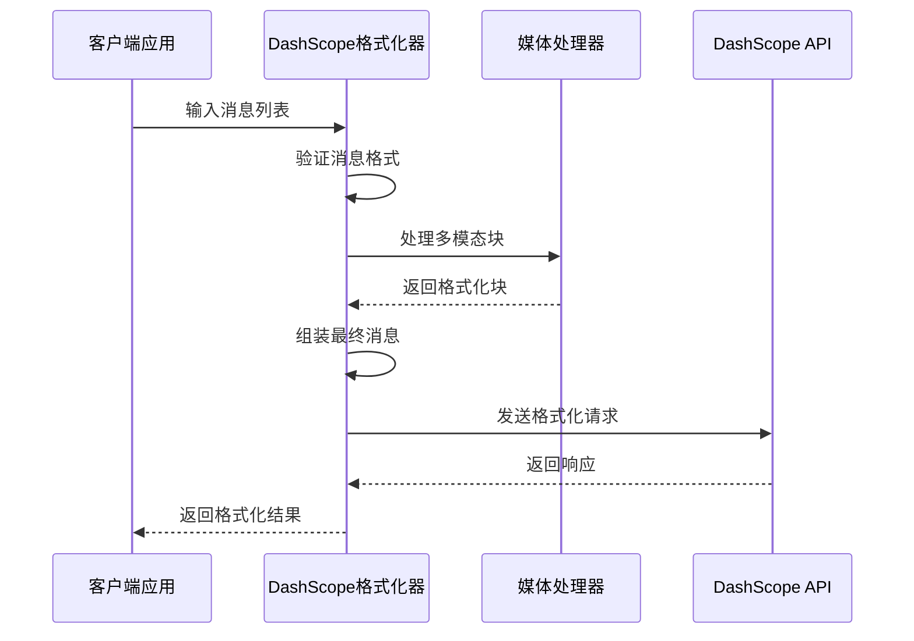
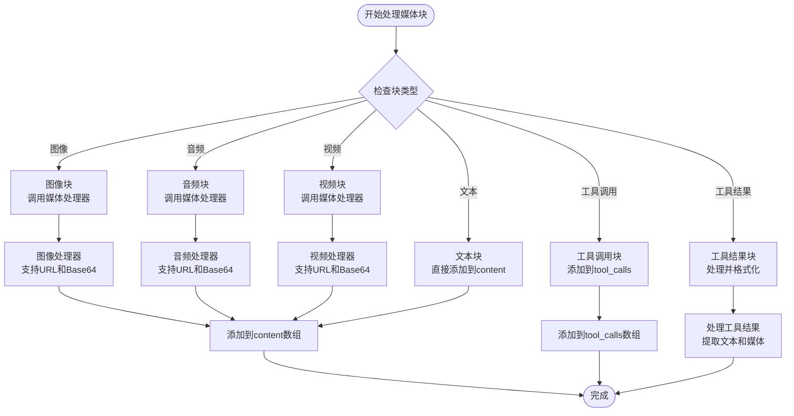
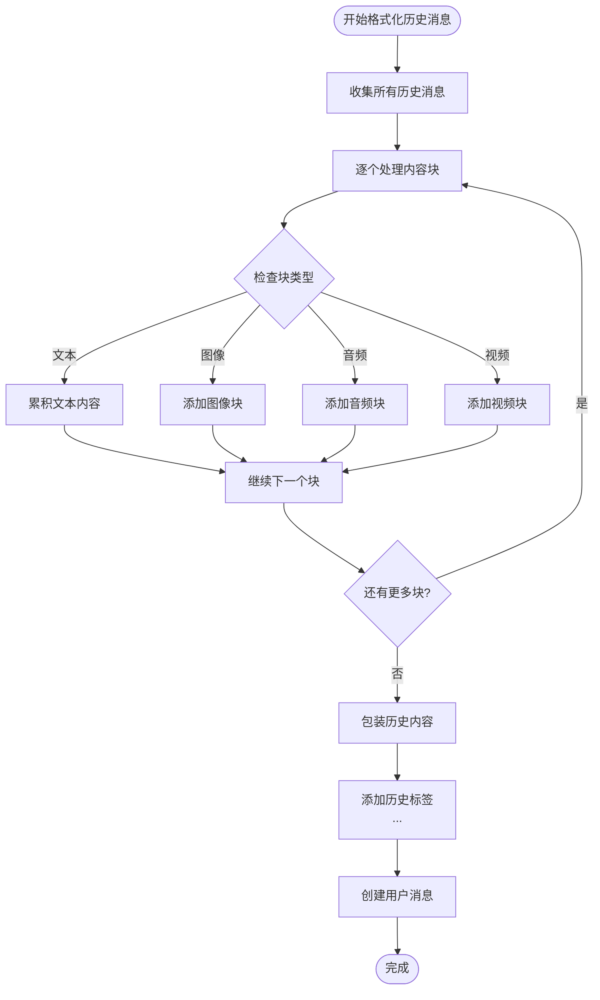
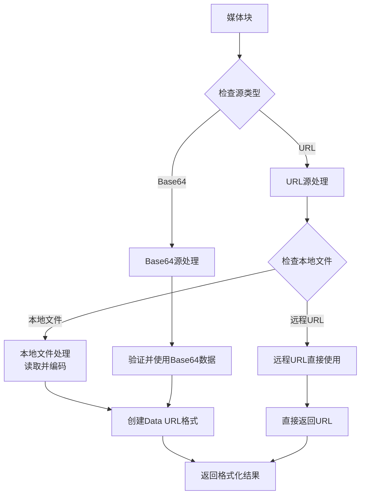
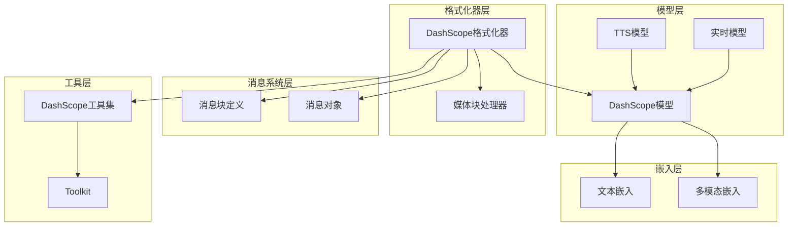

# DashScope格式化器

<cite>
**本文档引用的文件**
- [src/agentscope/formatter/_dashscope_formatter.py](file://src/agentscope/formatter/_dashscope_formatter.py)
- [src/agentscope/message/_message_block.py](file://src/agentscope/message/_message_block.py)
- [src/agentscope/model/_dashscope_model.py](file://src/agentscope/model/_dashscope_model.py)
- [src/agentscope/tool/_multi_modality/_dashscope_tools.py](file://src/agentscope/tool/_multi_modality/_dashscope_tools.py)
- [src/agentscope/tts/_dashscope_tts_model.py](file://src/agentscope/tts/_dashscope_tts_model.py)
- [src/agentscope/realtime/_dashscope_realtime_model.py](file://src/agentscope/realtime/_dashscope_realtime_model.py)
- [src/agentscope/embedding/_dashscope_embedding.py](file://src/agentscope/embedding/_dashscope_embedding.py)
- [src/agentscope/embedding/_dashscope_multimodal_embedding.py](file://src/agentscope/embedding/_dashscope_multimodal_embedding.py)
- [tests/formatter_dashscope_test.py](file://tests/formatter_dashscope_test.py)
- [examples/functionality/structured_output/main.py](file://examples/functionality/structured_output/main.py)
- [examples/functionality/rag/multimodal_rag.py](file://examples/functionality/rag/multimodal_rag.py)
</cite>

## 目录
1. [简介](#简介)
2. [项目结构](#项目结构)
3. [核心组件](#核心组件)
4. [架构概览](#架构概览)
5. [详细组件分析](#详细组件分析)
6. [依赖关系分析](#依赖关系分析)
7. [性能考虑](#性能考虑)
8. [故障排除指南](#故障排除指南)
9. [结论](#结论)
10. [附录](#附录)

## 简介

DashScope格式化器是AgentScope框架中专门用于处理阿里云DashScope平台API格式转换的核心组件。该格式化器提供了完整的多模态消息支持，包括文本、图像、音频、视频等多种媒体类型的统一处理机制。

该组件的主要功能包括：
- 将内部消息对象转换为DashScope API所需的格式
- 支持多模态数据的本地文件上传和远程URL访问
- 处理工具调用和工具结果的格式化
- 提供聊天场景和多智能体场景的不同格式化策略
- 实现智能的内容截断和令牌计数功能

## 项目结构

DashScope格式化器位于AgentScope项目的formatter模块中，与消息系统、模型接口、工具集等组件紧密集成：



**图表来源**
- [src/agentscope/formatter/_dashscope_formatter.py:159-426](file://src/agentscope/formatter/_dashscope_formatter.py#L159-L426)
- [src/agentscope/message/_message_block.py:9-129](file://src/agentscope/message/_message_block.py#L9-L129)

**章节来源**
- [src/agentscope/formatter/_dashscope_formatter.py:1-634](file://src/agentscope/formatter/_dashscope_formatter.py#L1-L634)
- [src/agentscope/message/_message_block.py:1-129](file://src/agentscope/message/_message_block.py#L1-L129)

## 核心组件

DashScope格式化器包含两个主要类：聊天格式化器和多智能体格式化器，以及一个媒体块处理函数。

### 主要类概述

1. **DashScopeChatFormatter**: 专为单智能体聊天场景设计
2. **DashScopeMultiAgentFormatter**: 支持多智能体协作场景
3. **_format_dashscope_media_block**: 处理多模态媒体块的通用函数

### 关键特性

- **多模态支持**: 完整支持文本、图像、音频、视频四种媒体类型
- **工具集成**: 原生支持工具调用和工具结果处理
- **灵活配置**: 支持多种配置选项和参数定制
- **智能截断**: 集成令牌计数和内容截断功能

**章节来源**
- [src/agentscope/formatter/_dashscope_formatter.py:159-426](file://src/agentscope/formatter/_dashscope_formatter.py#L159-L426)
- [src/agentscope/formatter/_dashscope_formatter.py:428-634](file://src/agentscope/formatter/_dashscope_formatter.py#L428-L634)

## 架构概览

DashScope格式化器采用分层架构设计，确保了良好的可扩展性和维护性：



**图表来源**
- [src/agentscope/formatter/_dashscope_formatter.py:159-634](file://src/agentscope/formatter/_dashscope_formatter.py#L159-L634)

### 数据流架构



**图表来源**
- [src/agentscope/formatter/_dashscope_formatter.py:244-425](file://src/agentscope/formatter/_dashscope_formatter.py#L244-L425)

## 详细组件分析

### 聊天格式化器 (DashScopeChatFormatter)

DashScopeChatFormatter是专门为单智能体聊天场景设计的格式化器，支持完整的多模态交互。

#### 核心功能

1. **消息格式化**: 将内部消息转换为DashScope API所需的格式
2. **多模态处理**: 支持文本、图像、音频、视频的统一处理
3. **工具调用支持**: 原生支持工具调用和工具结果处理
4. **媒体提升**: 可选地将工具结果中的媒体内容提升为用户消息

#### 媒体块处理机制



**图表来源**
- [src/agentscope/formatter/_dashscope_formatter.py:27-77](file://src/agentscope/formatter/_dashscope_formatter.py#L27-L77)
- [src/agentscope/formatter/_dashscope_formatter.py:244-425](file://src/agentscope/formatter/_dashscope_formatter.py#L244-L425)

#### 工具结果处理流程

当遇到工具结果时，格式化器会执行以下步骤：

1. **文本内容提取**: 从工具结果中提取纯文本输出
2. **媒体内容分离**: 识别并分离图像、音频、视频等媒体内容
3. **工具结果消息生成**: 创建标准的工具结果消息格式
4. **媒体提升决策**: 根据配置决定是否将媒体内容提升为用户消息

**章节来源**
- [src/agentscope/formatter/_dashscope_formatter.py:244-425](file://src/agentscope/formatter/_dashscope_formatter.py#L244-L425)

### 多智能体格式化器 (DashScopeMultiAgentFormatter)

DashScopeMultiAgentFormatter专为多智能体协作场景设计，提供了更复杂的消息组织和历史管理功能。

#### 核心特性

1. **对话历史管理**: 自动收集和格式化对话历史
2. **智能历史包装**: 将历史内容包装在特殊的标签中
3. **工具序列处理**: 专门处理工具调用和结果序列
4. **系统消息支持**: 支持复杂的系统指令和上下文设置

#### 历史消息格式化



**图表来源**
- [src/agentscope/formatter/_dashscope_formatter.py:516-623](file://src/agentscope/formatter/_dashscope_formatter.py#L516-L623)

**章节来源**
- [src/agentscope/formatter/_dashscope_formatter.py:428-634](file://src/agentscope/formatter/_dashscope_formatter.py#L428-L634)

### 媒体块处理函数

_format_dashscope_media_block函数是处理所有多模态媒体的基础组件，支持多种输入源和编码格式。

#### 支持的媒体类型

1. **图像 (ImageBlock)**: 支持JPEG、PNG、GIF等常见格式
2. **音频 (AudioBlock)**: 支持MP3、WAV、AAC等音频格式  
3. **视频 (VideoBlock)**: 支持MP4、AVI、MOV等视频格式

#### 输入源处理



**图表来源**
- [src/agentscope/formatter/_dashscope_formatter.py:27-77](file://src/agentscope/formatter/_dashscope_formatter.py#L27-L77)

**章节来源**
- [src/agentscope/formatter/_dashscope_formatter.py:27-77](file://src/agentscope/formatter/_dashscope_formatter.py#L27-L77)

## 依赖关系分析

DashScope格式化器与多个系统组件存在紧密的依赖关系：



**图表来源**
- [src/agentscope/formatter/_dashscope_formatter.py:14-25](file://src/agentscope/formatter/_dashscope_formatter.py#L14-L25)
- [src/agentscope/tool/_multi_modality/_dashscope_tools.py:13-15](file://src/agentscope/tool/_multi_modality/_dashscope_tools.py#L13-L15)

### 外部依赖

DashScope格式化器主要依赖以下外部组件：

1. **DashScope SDK**: 提供API调用和响应解析
2. **消息系统**: 提供统一的消息块定义和处理
3. **工具系统**: 支持多模态工具的集成
4. **令牌计数器**: 用于内容截断和优化

**章节来源**
- [src/agentscope/formatter/_dashscope_formatter.py:11-25](file://src/agentscope/formatter/_dashscope_formatter.py#L11-L25)

## 性能考虑

DashScope格式化器在设计时充分考虑了性能优化：

### 内存管理

1. **流式处理**: 支持大文件的流式读取和处理
2. **缓存机制**: 集成嵌入缓存减少重复API调用
3. **批量处理**: 支持批量媒体文件处理优化网络传输

### 处理优化

1. **异步操作**: 全面采用异步编程模型提高并发性能
2. **智能截断**: 基于令牌计数的智能内容截断
3. **延迟加载**: 媒体文件的按需加载和处理

### 最佳实践建议

1. **合理配置**: 根据应用场景选择合适的格式化器类型
2. **资源管理**: 注意大文件处理时的内存使用
3. **错误处理**: 实现完善的异常处理和重试机制

## 故障排除指南

### 常见问题及解决方案

#### 媒体文件处理问题

**问题**: 媒体文件无法正确处理
**原因**: 文件路径不正确或格式不受支持
**解决方案**: 
- 确保文件路径有效且可访问
- 检查文件扩展名是否受支持
- 验证文件完整性

#### 工具调用失败

**问题**: 工具调用返回错误
**原因**: 工具定义不正确或参数格式错误
**解决方案**:
- 检查工具JSON模式定义
- 验证工具参数格式
- 确认工具权限配置

#### 多模态处理异常

**问题**: 图像或音频处理失败
**原因**: 编码格式不兼容或网络问题
**解决方案**:
- 确认媒体格式受支持
- 检查网络连接状态
- 验证API密钥有效性

**章节来源**
- [tests/formatter_dashscope_test.py:1-915](file://tests/formatter_dashscope_test.py#L1-L915)

### 调试技巧

1. **启用详细日志**: 启用调试模式获取详细的处理信息
2. **单元测试**: 使用提供的测试用例验证功能正确性
3. **逐步排查**: 从简单的文本消息开始，逐步增加复杂度

## 结论

DashScope格式化器为AgentScope框架提供了完整的多模态消息处理能力，通过精心设计的架构和丰富的功能特性，能够满足各种复杂的AI应用场景需求。

### 主要优势

1. **功能完整**: 支持所有DashScope平台的核心功能
2. **易于使用**: 简洁的API设计和丰富的配置选项
3. **性能优秀**: 优化的处理流程和资源管理
4. **扩展性强**: 良好的架构设计便于功能扩展

### 应用场景

DashScope格式化器适用于以下场景：
- 多模态聊天机器人
- 智能客服系统
- 内容创作助手
- 数据分析工具
- 教育辅导系统

## 附录

### 使用示例

#### 基础聊天格式化

```python
from agentscope.formatter import DashScopeChatFormatter
from agentscope.message import Msg, TextBlock, ImageBlock, URLSource

# 创建格式化器实例
formatter = DashScopeChatFormatter()

# 准备消息
msg = Msg(
    name="user",
    role="user", 
    content=[
        TextBlock(type="text", text="描述这张图片"),
        ImageBlock(
            type="image",
            source=URLSource(
                type="url",
                url="https://example.com/image.jpg"
            )
        )
    ]
)

# 格式化消息
formatted_messages = await formatter.format([msg])
```

#### 多智能体场景

```python
from agentscope.formatter import DashScopeMultiAgentFormatter

# 创建多智能体格式化器
multi_formatter = DashScopeMultiAgentFormatter(
    conversation_history_prompt="# 对话历史\n这是之前的对话内容\n"
)

# 处理多轮对话
formatted_messages = await multi_formatter.format(all_messages)
```

#### 结构化输出

```python
from pydantic import BaseModel
from agentscope.model import DashScopeChatModel

class PersonModel(BaseModel):
    name: str
    age: int
    city: str

# 使用结构化输出
model = DashScopeChatModel(
    api_key="your_api_key",
    model_name="qwen-max"
)

response = await model(
    messages=formatted_messages,
    structured_model=PersonModel
)
```

**章节来源**
- [examples/functionality/structured_output/main.py:37-81](file://examples/functionality/structured_output/main.py#L37-L81)
- [examples/functionality/rag/multimodal_rag.py:25-73](file://examples/functionality/rag/multimodal_rag.py#L25-L73)

### 配置选项参考

| 参数名称 | 类型 | 默认值 | 描述 |
|---------|------|--------|------|
| promote_tool_result_images | bool | False | 是否提升工具结果中的图片 |
| promote_tool_result_audios | bool | False | 是否提升工具结果中的音频 |
| promote_tool_result_videos | bool | False | 是否提升工具结果中的视频 |
| token_counter | TokenCounterBase | None | 令牌计数器实例 |
| max_tokens | int | None | 最大令牌数限制 |
| conversation_history_prompt | str | 特定提示词 | 多智能体场景的历史提示 |

### 迁移注意事项

1. **版本兼容性**: 确保DashScope SDK版本兼容
2. **API密钥管理**: 正确配置和管理API密钥
3. **配额监控**: 监控API使用量避免超额
4. **错误处理**: 实现完善的异常处理机制