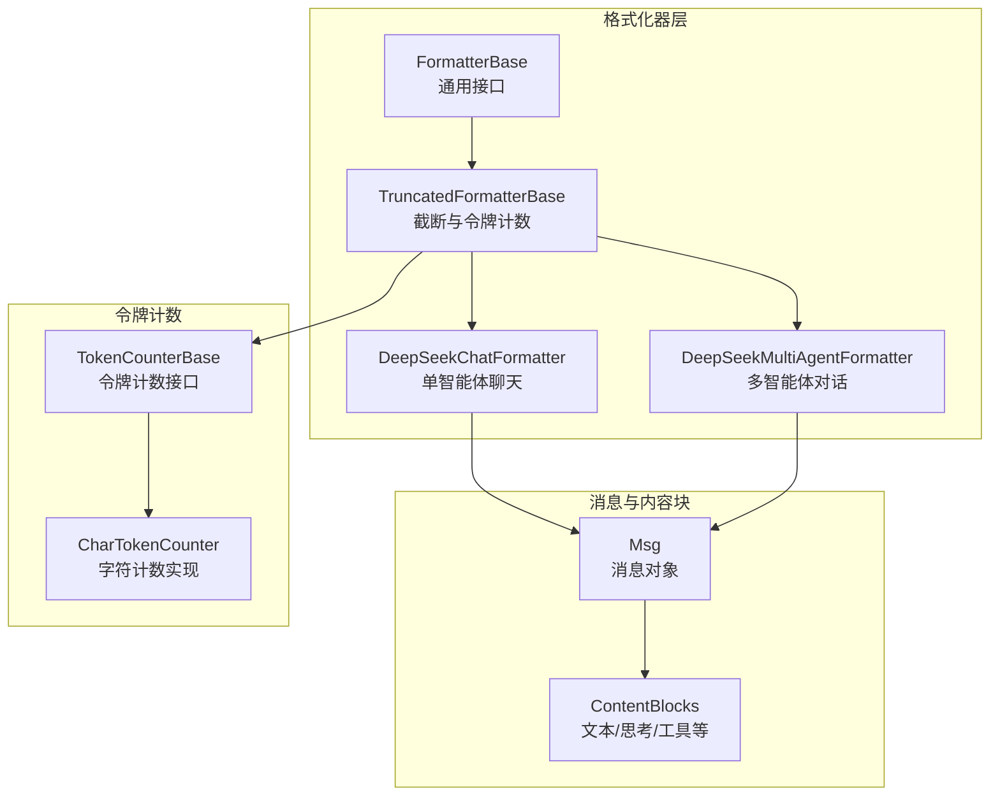
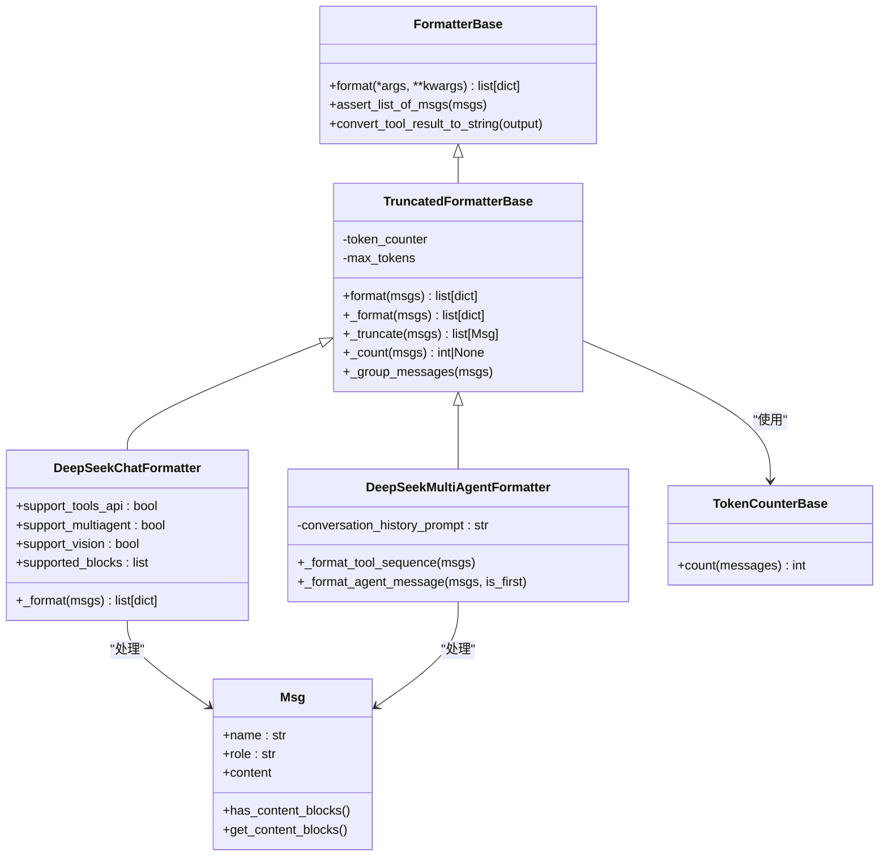
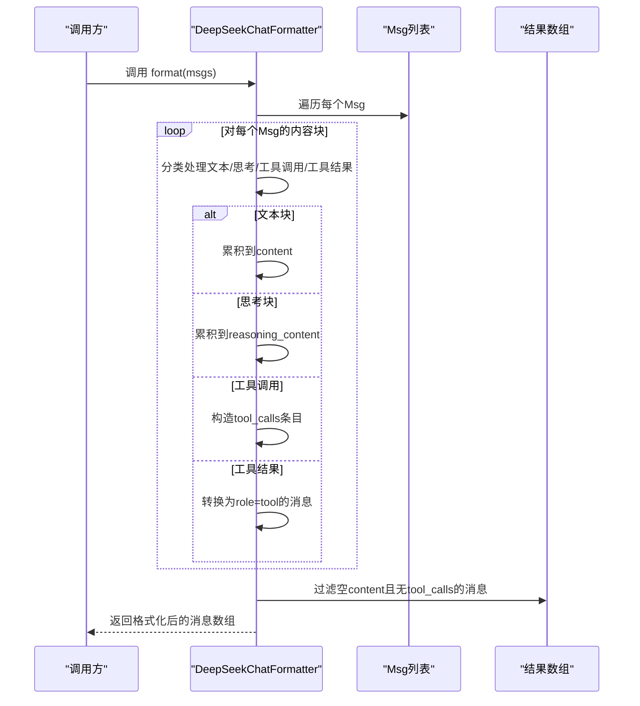
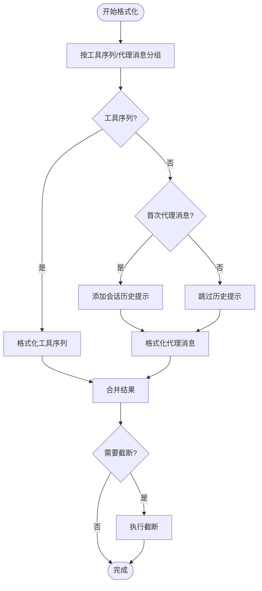
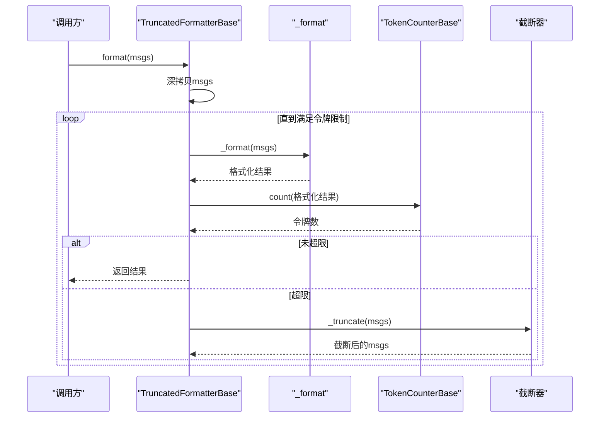
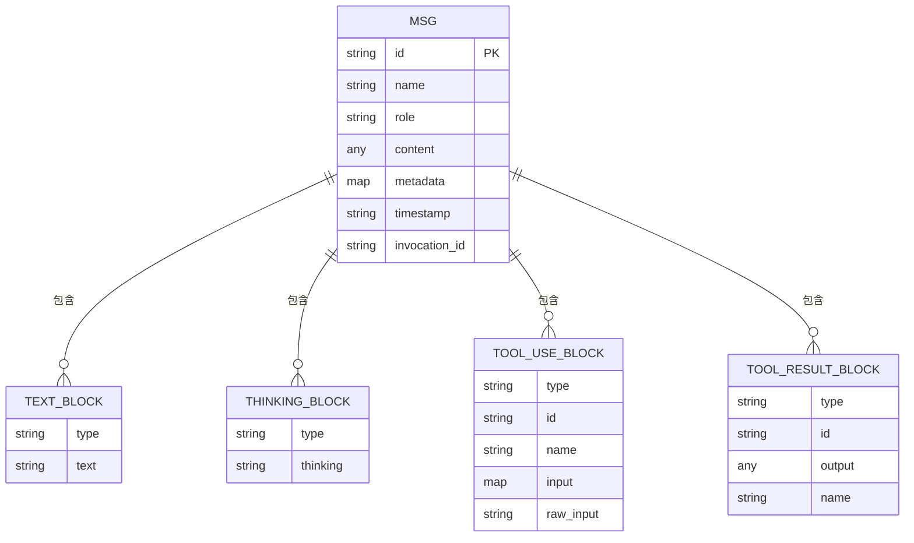
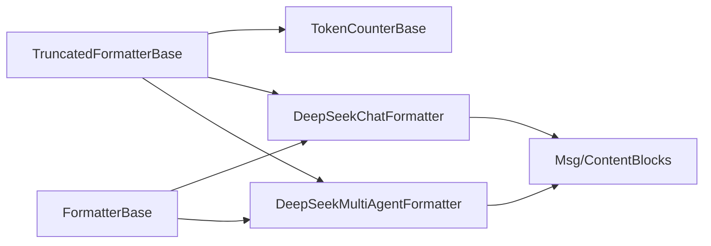

# DeepSeek格式化器

<cite>
**本文档引用的文件**
- [src/agentscope/formatter/_deepseek_formatter.py](file://src/agentscope/formatter/_deepseek_formatter.py)
- [src/agentscope/formatter/_truncated_formatter_base.py](file://src/agentscope/formatter/_truncated_formatter_base.py)
- [src/agentscope/formatter/_formatter_base.py](file://src/agentscope/formatter/_formatter_base.py)
- [src/agentscope/message/_message_base.py](file://src/agentscope/message/_message_base.py)
- [src/agentscope/message/_message_block.py](file://src/agentscope/message/_message_block.py)
- [src/agentscope/token/_token_base.py](file://src/agentscope/token/_token_base.py)
- [src/agentscope/token/_char_token_counter.py](file://src/agentscope/token/_char_token_counter.py)
- [src/agentscope/formatter/__init__.py](file://src/agentscope/formatter/__init__.py)
- [tests/formatter_deepseek_test.py](file://tests/formatter_deepseek_test.py)
- [README.md](file://README.md)
</cite>

## 目录
1. [简介](#简介)
2. [项目结构](#项目结构)
3. [核心组件](#核心组件)
4. [架构概览](#架构概览)
5. [详细组件分析](#详细组件分析)
6. [依赖关系分析](#依赖关系分析)
7. [性能考虑](#性能考虑)
8. [故障排除指南](#故障排除指南)
9. [结论](#结论)
10. [附录](#附录)

## 简介
本文件为DeepSeek格式化器的专业技术文档，面向需要在AgentScope框架中集成DeepSeek模型推理能力的开发者与架构师。文档全面阐述DeepSeek格式化器的设计理念、实现细节与最佳实践，涵盖以下关键主题：
- DeepSeek平台的消息格式规范与角色映射
- 内容块处理策略（文本、思考、工具调用与结果）
- 推理优化与多模态支持现状
- 工具API兼容性与多智能体对话支持
- 性能调优与资源管理（基于令牌计数与截断机制）
- 实际应用场景与优化建议
- 问题排查与常见陷阱

## 项目结构
DeepSeek格式化器位于AgentScope的formatter子模块中，采用分层设计：基础格式化器定义通用接口，截断式格式化器提供令牌限制与自动截断能力，具体平台格式化器负责将内部消息对象转换为平台API所需的字典结构。

**图表来源**
- [src/agentscope/formatter/_formatter_base.py:11-130](file://src/agentscope/formatter/_formatter_base.py#L11-L130)
- [src/agentscope/formatter/_truncated_formatter_base.py:19-298](file://src/agentscope/formatter/_truncated_formatter_base.py#L19-L298)
- [src/agentscope/formatter/_deepseek_formatter.py:13-266](file://src/agentscope/formatter/_deepseek_formatter.py#L13-L266)
- [src/agentscope/message/_message_base.py:21-242](file://src/agentscope/message/_message_base.py#L21-L242)
- [src/agentscope/message/_message_block.py:9-129](file://src/agentscope/message/_message_block.py#L9-L129)
- [src/agentscope/token/_token_base.py:7-16](file://src/agentscope/token/_token_base.py#L7-L16)
- [src/agentscope/token/_char_token_counter.py:8-43](file://src/agentscope/token/_char_token_counter.py#L8-L43)

**章节来源**
- [src/agentscope/formatter/__init__.py:26-29](file://src/agentscope/formatter/__init__.py#L26-L29)
- [README.md:58-77](file://README.md#L58-L77)

## 核心组件
- DeepSeekChatFormatter：专为单智能体聊天场景设计，支持文本、思考、工具调用与工具结果的转换，生成符合DeepSeek API的消息列表。
- DeepSeekMultiAgentFormatter：支持多智能体对话，具备会话历史拼接、工具序列与代理消息的分组处理，以及可选的令牌截断。
- TruncatedFormatterBase：提供统一的格式化流程、令牌计数与自动截断逻辑，确保输出长度不超过指定阈值。
- FormatterBase：定义格式化接口与通用工具方法（如工具结果字符串化）。
- Msg与ContentBlocks：内部消息表示与内容块类型，支撑多模态与工具调用的数据结构。
- TokenCounterBase与CharTokenCounter：令牌计数接口与简单实现，用于估算消息长度。

**章节来源**
- [src/agentscope/formatter/_deepseek_formatter.py:13-121](file://src/agentscope/formatter/_deepseek_formatter.py#L13-L121)
- [src/agentscope/formatter/_deepseek_formatter.py:123-266](file://src/agentscope/formatter/_deepseek_formatter.py#L123-L266)
- [src/agentscope/formatter/_truncated_formatter_base.py:19-298](file://src/agentscope/formatter/_truncated_formatter_base.py#L19-L298)
- [src/agentscope/formatter/_formatter_base.py:11-130](file://src/agentscope/formatter/_formatter_base.py#L11-L130)
- [src/agentscope/message/_message_base.py:21-242](file://src/agentscope/message/_message_base.py#L21-L242)
- [src/agentscope/message/_message_block.py:9-129](file://src/agentscope/message/_message_block.py#L9-L129)
- [src/agentscope/token/_token_base.py:7-16](file://src/agentscope/token/_token_base.py#L7-L16)
- [src/agentscope/token/_char_token_counter.py:8-43](file://src/agentscope/token/_char_token_counter.py#L8-L43)

## 架构概览
DeepSeek格式化器遵循“分层+可插拔”的架构设计：
- 上层：具体平台格式化器（DeepSeekChatFormatter、DeepSeekMultiAgentFormatter）
- 中层：截断式格式化器（TruncatedFormatterBase），负责令牌计数与消息截断
- 下层：基础格式化器（FormatterBase）与消息/内容块模型
- 外部：令牌计数器（TokenCounterBase及其实现）

**图表来源**
- [src/agentscope/formatter/_formatter_base.py:11-130](file://src/agentscope/formatter/_formatter_base.py#L11-L130)
- [src/agentscope/formatter/_truncated_formatter_base.py:19-298](file://src/agentscope/formatter/_truncated_formatter_base.py#L19-L298)
- [src/agentscope/formatter/_deepseek_formatter.py:13-266](file://src/agentscope/formatter/_deepseek_formatter.py#L13-L266)
- [src/agentscope/message/_message_base.py:21-242](file://src/agentscope/message/_message_base.py#L21-L242)
- [src/agentscope/token/_token_base.py:7-16](file://src/agentscope/token/_token_base.py#L7-L16)

## 详细组件分析

### DeepSeekChatFormatter（单智能体聊天）
该类负责将内部消息对象转换为DeepSeek API所需的消息数组，支持以下特性：
- 角色映射：保留Msg的role字段作为DeepSeek的role
- 内容块处理：文本块直接拼接为content；思考块单独处理为reasoning_content
- 工具调用：将tool_use块转换为tool_calls数组，函数名与参数以JSON字符串形式传递
- 工具结果：将tool_result块转换为role为tool的消息，包含tool_call_id与name
- 输出过滤：仅当存在content或tool_calls时才输出该消息

**图表来源**
- [src/agentscope/formatter/_deepseek_formatter.py:36-120](file://src/agentscope/formatter/_deepseek_formatter.py#L36-L120)

**章节来源**
- [src/agentscope/formatter/_deepseek_formatter.py:13-121](file://src/agentscope/formatter/_deepseek_formatter.py#L13-L121)

### DeepSeekMultiAgentFormatter（多智能体对话）
该类在单智能体基础上扩展了多智能体场景的支持：
- 会话历史拼接：将连续的文本消息按“用户/助手”格式拼接到<history>标签内
- 工具序列与代理消息分组：根据是否包含工具调用/结果对消息进行分组，分别格式化
- 可选令牌截断：通过TruncatedFormatterBase的令牌计数与截断逻辑控制消息长度
- 首次代理消息：可选择性地在首次代理消息前插入会话历史提示

**图表来源**
- [src/agentscope/formatter/_deepseek_formatter.py:123-266](file://src/agentscope/formatter/_deepseek_formatter.py#L123-L266)
- [src/agentscope/formatter/_truncated_formatter_base.py:48-113](file://src/agentscope/formatter/_truncated_formatter_base.py#L48-L113)

**章节来源**
- [src/agentscope/formatter/_deepseek_formatter.py:123-266](file://src/agentscope/formatter/_deepseek_formatter.py#L123-L266)
- [src/agentscope/formatter/_truncated_formatter_base.py:19-298](file://src/agentscope/formatter/_truncated_formatter_base.py#L19-L298)

### 令牌计数与截断机制
TruncatedFormatterBase提供了统一的令牌计数与截断流程：
- format主流程：深拷贝输入消息，格式化后统计令牌数，若超过阈值则截断并重试
- 截断策略：优先删除最旧的消息，同时保证工具调用与其结果成对保留
- 令牌计数：通过TokenCounterBase接口实现，CharTokenCounter提供简单字符计数

**图表来源**
- [src/agentscope/formatter/_truncated_formatter_base.py:48-84](file://src/agentscope/formatter/_truncated_formatter_base.py#L48-L84)
- [src/agentscope/token/_token_base.py:10-16](file://src/agentscope/token/_token_base.py#L10-L16)
- [src/agentscope/token/_char_token_counter.py:17-43](file://src/agentscope/token/_char_token_counter.py#L17-L43)

**章节来源**
- [src/agentscope/formatter/_truncated_formatter_base.py:48-216](file://src/agentscope/formatter/_truncated_formatter_base.py#L48-L216)
- [src/agentscope/token/_token_base.py:7-16](file://src/agentscope/token/_token_base.py#L7-L16)
- [src/agentscope/token/_char_token_counter.py:8-43](file://src/agentscope/token/_char_token_counter.py#L8-L43)

### 消息与内容块模型
- Msg：封装消息名称、角色、内容与元数据，支持文本内容与内容块两种表达方式
- ContentBlocks：定义文本、思考、图像、音频、视频、工具调用与工具结果等块类型
- 工具结果字符串化：将多模态输出转换为纯文本描述，便于不支持多模态的平台兼容

**图表来源**
- [src/agentscope/message/_message_base.py:21-242](file://src/agentscope/message/_message_base.py#L21-L242)
- [src/agentscope/message/_message_block.py:9-129](file://src/agentscope/message/_message_block.py#L9-L129)

**章节来源**
- [src/agentscope/message/_message_base.py:21-242](file://src/agentscope/message/_message_base.py#L21-L242)
- [src/agentscope/message/_message_block.py:9-129](file://src/agentscope/message/_message_block.py#L9-L129)
- [src/agentscope/formatter/_formatter_base.py:37-130](file://src/agentscope/formatter/_formatter_base.py#L37-L130)

## 依赖关系分析
DeepSeek格式化器的依赖关系清晰且低耦合：
- 与消息模型解耦：通过Msg与ContentBlocks接口访问内容，不依赖具体实现
- 与令牌计数器解耦：通过TokenCounterBase接口计数，可替换不同计数策略
- 与平台API解耦：仅在格式化阶段转换为字典结构，不直接发起网络请求

**图表来源**
- [src/agentscope/formatter/_deepseek_formatter.py:13-266](file://src/agentscope/formatter/_deepseek_formatter.py#L13-L266)
- [src/agentscope/formatter/_truncated_formatter_base.py:19-46](file://src/agentscope/formatter/_truncated_formatter_base.py#L19-L46)
- [src/agentscope/formatter/_formatter_base.py:11-18](file://src/agentscope/formatter/_formatter_base.py#L11-L18)

**章节来源**
- [src/agentscope/formatter/_deepseek_formatter.py:13-266](file://src/agentscope/formatter/_deepseek_formatter.py#L13-L266)
- [src/agentscope/formatter/_truncated_formatter_base.py:19-46](file://src/agentscope/formatter/_truncated_formatter_base.py#L19-L46)
- [src/agentscope/formatter/_formatter_base.py:11-18](file://src/agentscope/formatter/_formatter_base.py#L11-L18)

## 性能考虑
- 令牌计数策略
  - CharTokenCounter适合快速估算，但对多模态数据（尤其是base64编码）可能高估令牌数
  - 建议在生产环境使用更精确的模型特定计数器（如OpenAI/Gemini等）
- 截断策略
  - TruncatedFormatterBase默认策略优先删除最旧消息，保持工具调用与结果成对
  - 对于长对话，建议结合会话历史提示与分段策略，减少重复信息
- 工具调用优化
  - 合理组织工具调用与结果，避免频繁往返导致的令牌浪费
  - 将工具结果字符串化时，尽量保留关键信息而非冗余描述
- 多智能体场景
  - 利用会话历史拼接减少重复上下文
  - 通过分组处理工具序列与代理消息，降低格式化复杂度

[本节为通用性能指导，无需列出章节来源]

## 故障排除指南
- 输入验证错误
  - 确保传入格式化器的消息列表均为Msg对象，且每个元素为Msg实例
  - 参考：[src/agentscope/formatter/_formatter_base.py:19-35](file://src/agentscope/formatter/_formatter_base.py#L19-L35)
- 工具调用与结果不匹配
  - 截断逻辑要求工具调用必须有对应的结果消息，否则抛出异常
  - 参考：[src/agentscope/formatter/_truncated_formatter_base.py:191-214](file://src/agentscope/formatter/_truncated_formatter_base.py#L191-L214)
- 不支持的内容块类型
  - 当消息包含未知类型的内容块时，会被警告并跳过
  - 参考：[src/agentscope/formatter/_deepseek_formatter.py:93-98](file://src/agentscope/formatter/_deepseek_formatter.py#L93-L98)
- 令牌超限
  - 若系统提示消息已超出令牌限制，需调整max_tokens或精简系统消息
  - 参考：[src/agentscope/formatter/_truncated_formatter_base.py:182-188](file://src/agentscope/formatter/_truncated_formatter_base.py#L182-L188)
- 多模态工具结果
  - 工具结果中包含图片/音频/视频时，会生成本地路径或URL描述
  - 参考：[src/agentscope/formatter/_formatter_base.py:91-117](file://src/agentscope/formatter/_formatter_base.py#L91-L117)

**章节来源**
- [src/agentscope/formatter/_formatter_base.py:19-35](file://src/agentscope/formatter/_formatter_base.py#L19-L35)
- [src/agentscope/formatter/_truncated_formatter_base.py:182-214](file://src/agentscope/formatter/_truncated_formatter_base.py#L182-L214)
- [src/agentscope/formatter/_deepseek_formatter.py:93-98](file://src/agentscope/formatter/_deepseek_formatter.py#L93-L98)
- [src/agentscope/formatter/_formatter_base.py:91-117](file://src/agentscope/formatter/_formatter_base.py#L91-L117)

## 结论
DeepSeek格式化器在AgentScope中提供了标准化、可扩展的消息格式化能力，既满足单智能体聊天场景，又支持多智能体对话与工具API集成。通过令牌计数与截断机制，能够在不同长度的消息中保持稳定性能。建议在生产环境中结合模型特定的令牌计数器与合理的会话管理策略，进一步提升推理效率与成本控制。

[本节为总结性内容，无需列出章节来源]

## 附录

### API与配置参考
- DeepSeekChatFormatter
  - 支持工具API：是
  - 支持多智能体：否
  - 支持视觉数据：否
  - 支持的内容块：文本、工具调用、工具结果
  - 关键方法：_format(msgs)
- DeepSeekMultiAgentFormatter
  - 支持工具API：是
  - 支持多智能体：是
  - 支持视觉数据：否
  - 支持的内容块：文本、工具调用、工具结果
  - 关键方法：_format_tool_sequence(msgs)、_format_agent_message(msgs, is_first)
  - 参数：conversation_history_prompt、token_counter、max_tokens

**章节来源**
- [src/agentscope/formatter/_deepseek_formatter.py:13-121](file://src/agentscope/formatter/_deepseek_formatter.py#L13-L121)
- [src/agentscope/formatter/_deepseek_formatter.py:123-266](file://src/agentscope/formatter/_deepseek_formatter.py#L123-L266)

### 测试用例要点
- 单智能体聊天格式化：覆盖系统消息、对话消息与工具调用/结果的组合
- 多智能体对话格式化：覆盖首次代理消息、会话历史拼接与工具序列处理
- 边界情况：仅系统消息、仅对话消息、仅工具消息等

**章节来源**
- [tests/formatter_deepseek_test.py:18-468](file://tests/formatter_deepseek_test.py#L18-L468)