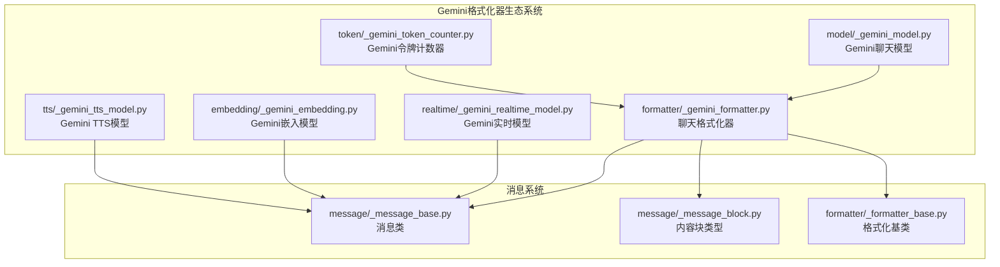
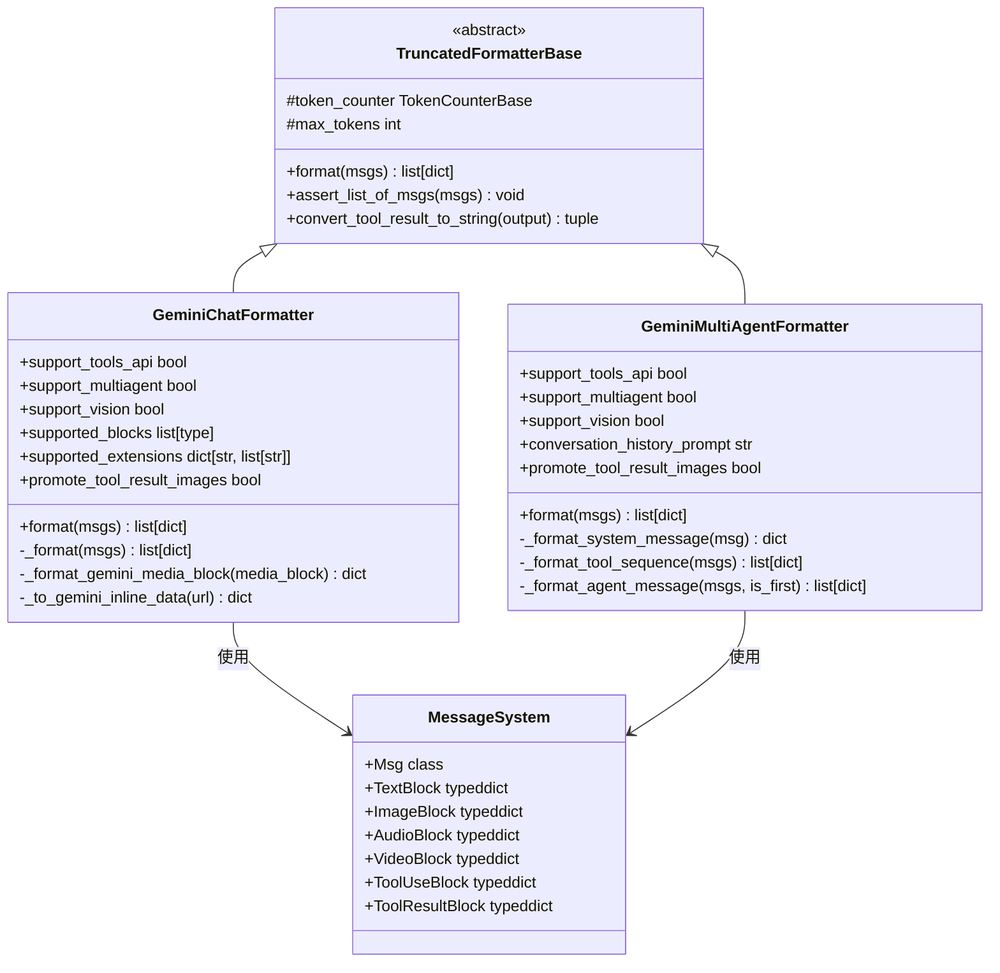
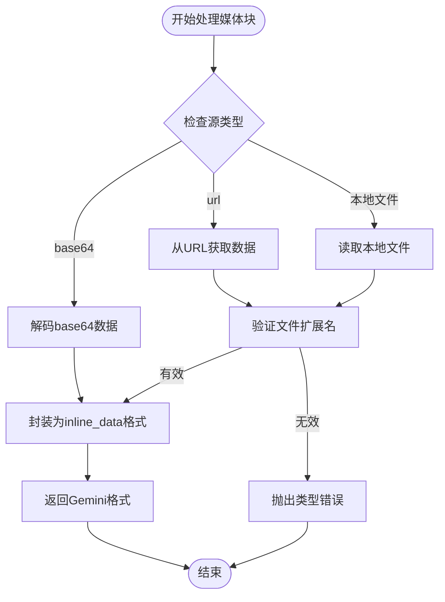
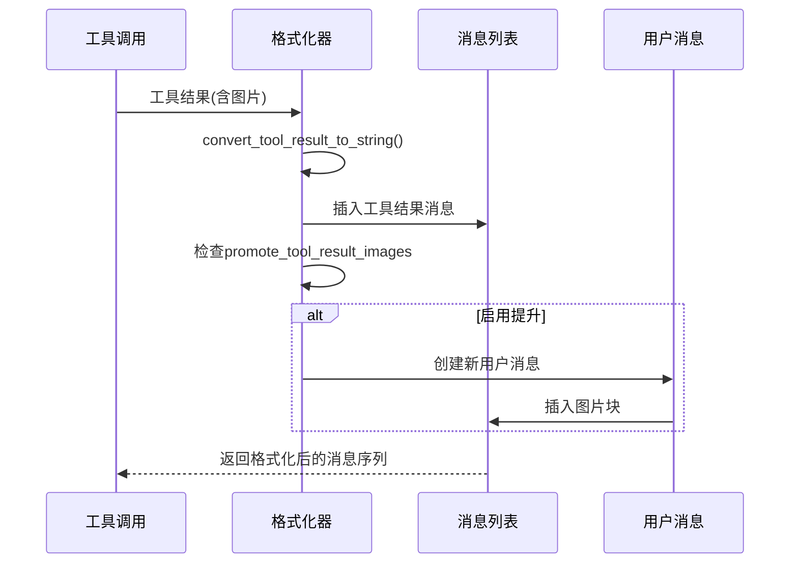
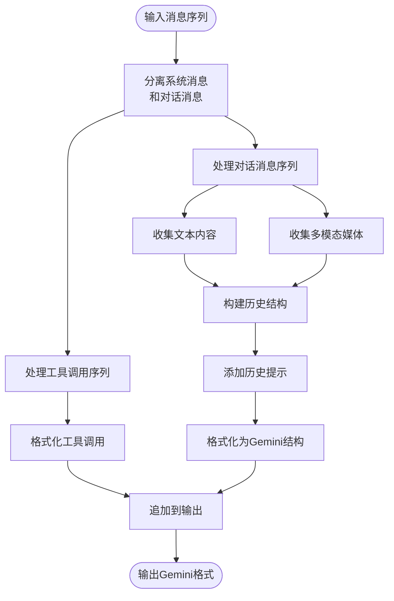
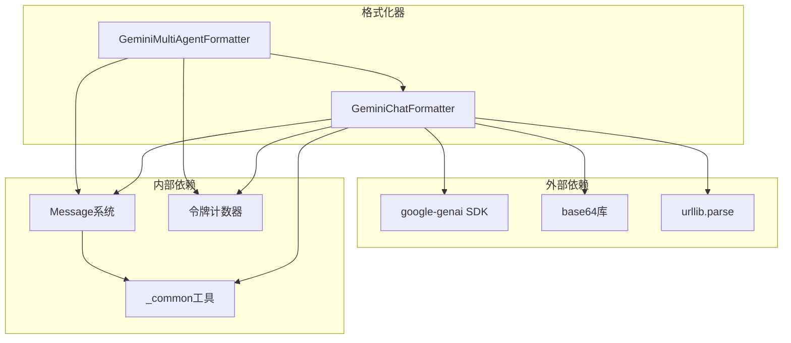

# Gemini格式化器

<cite>
**本文档引用的文件**
- [src/agentscope/formatter/_gemini_formatter.py](file://src/agentscope/formatter/_gemini_formatter.py)
- [src/agentscope/model/_gemini_model.py](file://src/agentscope/model/_gemini_model.py)
- [src/agentscope/token/_gemini_token_counter.py](file://src/agentscope/token/_gemini_token_counter.py)
- [src/agentscope/realtime/_gemini_realtime_model.py](file://src/agentscope/realtime/_gemini_realtime_model.py)
- [src/agentscope/embedding/_gemini_embedding.py](file://src/agentscope/embedding/_gemini_embedding.py)
- [src/agentscope/tts/_gemini_tts_model.py](file://src/agentscope/tts/_gemini_tts_model.py)
- [src/agentscope/message/_message_block.py](file://src/agentscope/message/_message_block.py)
- [src/agentscope/message/_message_base.py](file://src/agentscope/message/_message_base.py)
- [src/agentscope/formatter/_formatter_base.py](file://src/agentscope/formatter/_formatter_base.py)
- [tests/formatter_gemini_test.py](file://tests/formatter_gemini_test.py)
</cite>

## 目录
1. [简介](#简介)
2. [项目结构](#项目结构)
3. [核心组件](#核心组件)
4. [架构概览](#架构概览)
5. [详细组件分析](#详细组件分析)
6. [依赖分析](#依赖分析)
7. [性能考虑](#性能考虑)
8. [故障排除指南](#故障排除指南)
9. [结论](#结论)
10. [附录](#附录)

## 简介
本文件为Gemini格式化器的专业技术文档，深入介绍Google Gemini平台的格式化实现。该格式化器负责将Agentscope内部的消息对象转换为Gemini API所需的格式，支持结构化输出格式、多模态内容处理、对话历史管理等功能。文档涵盖消息格式规范（角色定义、内容块类型、参数配置）、Gemini平台特有能力（安全过滤、生成限制、上下文窗口管理）、配置指南（API密钥设置、模型选择、参数调优）、实际应用示例以及性能优化技巧和常见问题解决方案。

## 项目结构
Gemini格式化器位于Agentscope项目的formatter模块中，与模型、令牌计数器、实时模型、嵌入模型和文本转语音模型共同构成完整的Gemini生态支持体系。

**图表来源**
- [src/agentscope/formatter/_gemini_formatter.py:108-310](file://src/agentscope/formatter/_gemini_formatter.py#L108-L310)
- [src/agentscope/model/_gemini_model.py:115-200](file://src/agentscope/model/_gemini_model.py#L115-L200)
- [src/agentscope/realtime/_gemini_realtime_model.py:21-50](file://src/agentscope/realtime/_gemini_realtime_model.py#L21-L50)

**章节来源**
- [src/agentscope/formatter/_gemini_formatter.py:1-509](file://src/agentscope/formatter/_gemini_formatter.py#L1-L509)
- [src/agentscope/model/_gemini_model.py:1-674](file://src/agentscope/model/_gemini_model.py#L1-L674)

## 核心组件
Gemini格式化器包含两个主要格式化器：单智能体聊天格式化器和多智能体对话格式化器，以及配套的工具函数和辅助类。

### 主要特性
- **多模态支持**：支持文本、图像、音频、视频等多种媒体类型
- **工具调用集成**：无缝对接工具调用和结果处理
- **对话历史管理**：智能处理多轮对话的历史记录
- **令牌计数集成**：支持基于令牌的截断和优化
- **扩展性设计**：基于抽象基类，便于功能扩展

**章节来源**
- [src/agentscope/formatter/_gemini_formatter.py:108-177](file://src/agentscope/formatter/_gemini_formatter.py#L108-L177)
- [src/agentscope/formatter/_gemini_formatter.py:313-383](file://src/agentscope/formatter/_gemini_formatter.py#L313-L383)

## 架构概览
Gemini格式化器采用分层架构设计，通过抽象基类统一接口，具体实现针对Gemini API的特点进行优化。

**图表来源**
- [src/agentscope/formatter/_formatter_base.py:11-130](file://src/agentscope/formatter/_formatter_base.py#L11-L130)
- [src/agentscope/formatter/_gemini_formatter.py:108-310](file://src/agentscope/formatter/_gemini_formatter.py#L108-L310)
- [src/agentscope/formatter/_gemini_formatter.py:313-509](file://src/agentscope/formatter/_gemini_formatter.py#L313-L509)

## 详细组件分析

### GeminiChatFormatter（聊天格式化器）
单智能体场景下的格式化器，专门处理用户和助手之间的对话。

#### 核心功能
- **消息映射**：将Msg对象映射为Gemini API的role和parts结构
- **多模态处理**：支持图片、音频、视频的base64编码和URL处理
- **工具调用处理**：将工具调用转换为Gemini API的function_call格式
- **工具结果处理**：将工具结果转换为可读的文本格式

#### 媒体数据处理流程

**图表来源**
- [src/agentscope/formatter/_gemini_formatter.py:25-105](file://src/agentscope/formatter/_gemini_formatter.py#L25-L105)

#### 工具结果提升机制
当启用`promote_tool_result_images`时，工具结果中的图片会被提取并作为独立的用户消息插入到对话中：

**图表来源**
- [src/agentscope/formatter/_gemini_formatter.py:212-282](file://src/agentscope/formatter/_gemini_formatter.py#L212-L282)

**章节来源**
- [src/agentscope/formatter/_gemini_formatter.py:108-310](file://src/agentscope/formatter/_gemini_formatter.py#L108-L310)

### GeminiMultiAgentFormatter（多智能体格式化器）
多智能体场景下的格式化器，专门处理复杂的多轮对话和工具调用。

#### 核心特性
- **对话历史整合**：将历史对话整合到第一个系统消息中
- **工具调用序列化**：正确处理工具调用和结果的序列
- **智能历史标记**：使用`<history></history>`标签标记对话历史
- **首条消息特殊处理**：根据是否为第一条消息决定是否包含历史提示

#### 多智能体对话流程

**图表来源**
- [src/agentscope/formatter/_gemini_formatter.py:385-508](file://src/agentscope/formatter/_gemini_formatter.py#L385-L508)

**章节来源**
- [src/agentscope/formatter/_gemini_formatter.py:313-509](file://src/agentscope/formatter/_gemini_formatter.py#L313-L509)

### 消息格式规范
Gemini格式化器严格遵循Gemini API的消息格式规范：

#### 角色定义
- `user`：用户发送的消息
- `model`：助手（模型）回复的消息
- `system`：系统指令消息（在Gemini中转换为用户消息）

#### 内容块类型
- **文本块**：标准文本内容
- **思考块**：模型的内部思考过程
- **工具调用块**：function_call格式
- **工具结果块**：function_response格式
- **媒体块**：inline_data格式（图片、音频、视频）

#### 参数配置
- `thinking_config`：思考模式配置
- `tool_config`：工具调用配置
- `response_mime_type`：响应MIME类型
- `response_schema`：结构化输出模式

**章节来源**
- [src/agentscope/formatter/_gemini_formatter.py:182-310](file://src/agentscope/formatter/_gemini_formatter.py#L182-L310)
- [src/agentscope/model/_gemini_model.py:202-304](file://src/agentscope/model/_gemini_model.py#L202-L304)

## 依赖分析
Gemini格式化器与其他组件的依赖关系如下：

**图表来源**
- [src/agentscope/formatter/_gemini_formatter.py:1-22](file://src/agentscope/formatter/_gemini_formatter.py#L1-L22)
- [src/agentscope/formatter/_formatter_base.py:7-8](file://src/agentscope/formatter/_formatter_base.py#L7-L8)

**章节来源**
- [src/agentscope/formatter/_gemini_formatter.py:1-22](file://src/agentscope/formatter/_gemini_formatter.py#L1-L22)
- [src/agentscope/formatter/_formatter_base.py:1-130](file://src/agentscope/formatter/_formatter_base.py#L1-L130)

## 性能考虑
基于代码分析，Gemini格式化器在性能方面有以下特点和优化建议：

### 性能优化策略
1. **令牌计数集成**：通过TokenCounterBase实现智能截断，避免超出上下文限制
2. **媒体数据缓存**：支持base64数据保存，减少重复处理开销
3. **异步处理**：所有格式化操作都支持异步执行
4. **内存优化**：使用生成器模式处理流式数据

### 性能瓶颈识别
- 媒体文件下载和编码可能成为性能瓶颈
- 工具调用结果的文本化处理需要优化
- 多模态数据的批量处理效率有待提升

**章节来源**
- [src/agentscope/formatter/_gemini_formatter.py:151-177](file://src/agentscope/formatter/_gemini_formatter.py#L151-L177)
- [src/agentscope/formatter/_formatter_base.py:37-130](file://src/agentscope/formatter/_formatter_base.py#L37-L130)

## 故障排除指南
基于测试用例和代码实现，以下是常见问题及解决方案：

### 媒体文件处理问题
**问题**：不支持的文件扩展名或URL格式
**解决方案**：
- 检查文件扩展名是否在`supported_extensions`字典中
- 验证URL格式是否正确（支持file://和HTTP协议）
- 确认文件路径存在且可访问

**章节来源**
- [src/agentscope/formatter/_gemini_formatter.py:60-105](file://src/agentscope/formatter/_gemini_formatter.py#L60-L105)

### 工具调用处理问题
**问题**：工具调用ID不匹配或为空
**解决方案**：
- Gemini API的function_call.id始终为None，使用thought_signature作为唯一标识符
- 确保工具调用名称与工具定义一致

**章节来源**
- [src/agentscope/formatter/_gemini_formatter.py:384-412](file://src/agentscope/formatter/_gemini_formatter.py#L384-L412)

### 多模态数据处理问题
**问题**：base64数据无法正确解码
**解决方案**：
- 确保base64数据格式正确
- 检查媒体类型是否与数据匹配
- 验证文件大小是否超过限制

**章节来源**
- [src/agentscope/formatter/_formatter_base.py:99-117](file://src/agentscope/formatter/_formatter_base.py#L99-L117)

## 结论
Gemini格式化器提供了完整的Gemini API消息格式化能力，支持多模态内容处理、工具调用集成和对话历史管理。其设计具有良好的扩展性和性能优化，能够满足各种业务场景的需求。通过合理的配置和使用，可以充分发挥Gemini平台的功能优势。

## 附录

### 配置指南
1. **API密钥设置**：在初始化时传入有效的Gemini API密钥
2. **模型选择**：根据需求选择合适的Gemini模型名称
3. **参数调优**：
   - `thinking_config`：启用思考模式和预算设置
   - `promote_tool_result_images`：控制工具结果图片的提升行为
   - `max_tokens`：设置最大令牌数限制

### 实际应用示例
- **客服对话系统**：使用GeminiChatFormatter处理用户咨询
- **多智能体协作**：使用GeminiMultiAgentFormatter管理复杂对话
- **多媒体内容分析**：结合工具调用处理图片、音频、视频内容

### 最佳实践
1. 合理设置`max_tokens`防止超出上下文限制
2. 在多模态场景中优先使用URL而非base64数据
3. 启用工具调用时确保工具定义完整准确
4. 定期清理临时文件避免磁盘空间不足