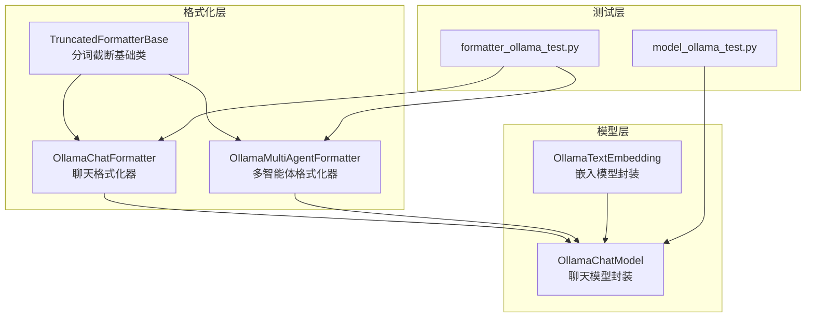
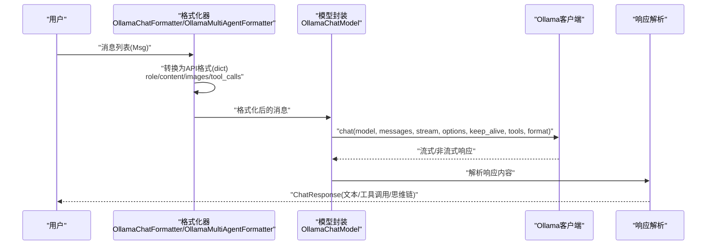
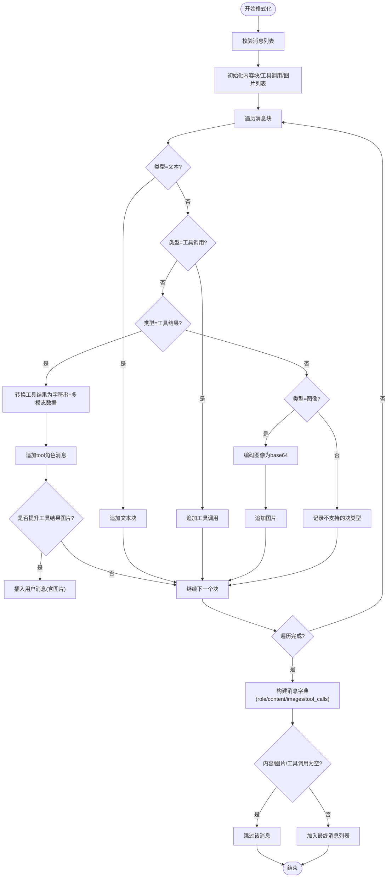
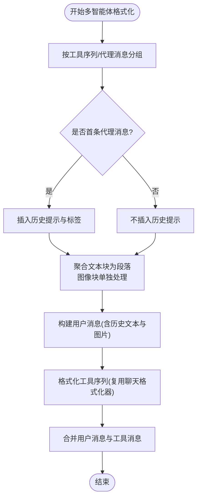
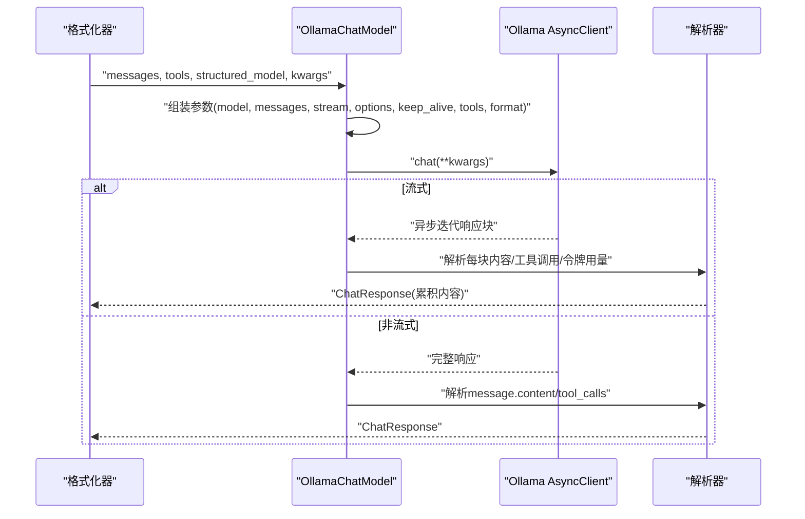
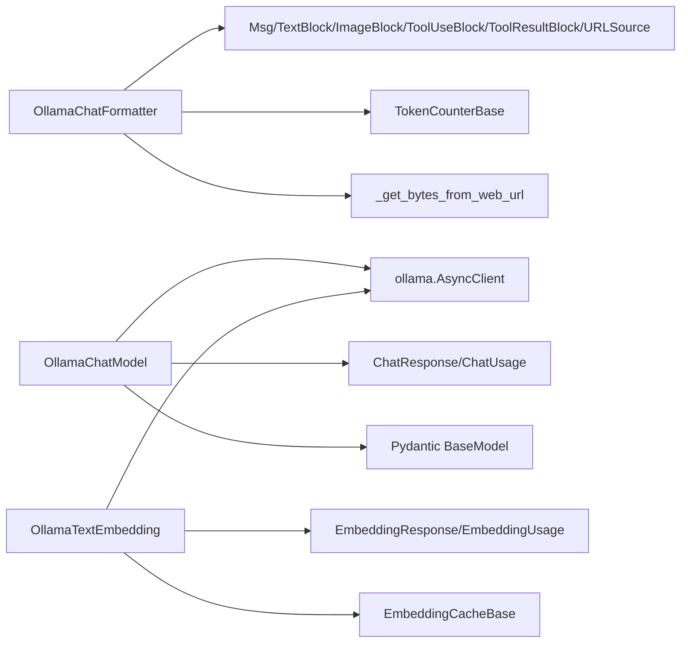

# Ollama格式化器

<cite>
**本文档引用的文件**
- [src/agentscope/formatter/_ollama_formatter.py](file://src/agentscope/formatter/_ollama_formatter.py)
- [src/agentscope/formatter/_truncated_formatter_base.py](file://src/agentscope/formatter/_truncated_formatter_base.py)
- [src/agentscope/model/_ollama_model.py](file://src/agentscope/model/_ollama_model.py)
- [src/agentscope/embedding/_ollama_embedding.py](file://src/agentscope/embedding/_ollama_embedding.py)
- [tests/formatter_ollama_test.py](file://tests/formatter_ollama_test.py)
- [tests/model_ollama_test.py](file://tests/model_ollama_test.py)
- [README.md](file://README.md)
- [README_zh.md](file://README_zh.md)
</cite>

## 目录
1. [简介](#简介)
2. [项目结构](#项目结构)
3. [核心组件](#核心组件)
4. [架构概览](#架构概览)
5. [详细组件分析](#详细组件分析)
6. [依赖分析](#依赖分析)
7. [性能考虑](#性能考虑)
8. [故障排除指南](#故障排除指南)
9. [结论](#结论)
10. [附录](#附录)

## 简介
本文件为 AgentScope 中 Ollama 格式化器的全面技术文档，覆盖本地模型适配、消息格式转换规则、流式响应处理、性能优化策略以及部署指南。Ollama 作为开源本地部署平台，允许用户在本地运行多种大语言模型，AgentScope 提供了针对 Ollama 的格式化器与模型封装，确保消息在不同角色（用户、助手、工具）之间正确转换，并支持多模态输入（文本、图像）、工具调用与结构化输出。

## 项目结构
AgentScope 的 Ollama 相关实现主要分布在以下模块：
- 格式化器：负责将内部消息对象转换为 Ollama API 所需的格式，支持聊天与多智能体场景，具备分词截断能力
- 模型封装：封装 Ollama 的异步客户端，支持流式与非流式响应解析、工具调用、思维链输出与结构化输出
- 嵌入模型：提供文本嵌入能力，支持缓存与维度控制
- 测试：覆盖格式化器与模型封装的功能与边界条件

**图表来源**
- [src/agentscope/formatter/_truncated_formatter_base.py:19-298](file://src/agentscope/formatter/_truncated_formatter_base.py#L19-L298)
- [src/agentscope/formatter/_ollama_formatter.py:73-444](file://src/agentscope/formatter/_ollama_formatter.py#L73-L444)
- [src/agentscope/model/_ollama_model.py:33-366](file://src/agentscope/model/_ollama_model.py#L33-L366)
- [src/agentscope/embedding/_ollama_embedding.py:13-107](file://src/agentscope/embedding/_ollama_embedding.py#L13-L107)

**章节来源**
- [src/agentscope/formatter/_ollama_formatter.py:1-444](file://src/agentscope/formatter/_ollama_formatter.py#L1-L444)
- [src/agentscope/model/_ollama_model.py:1-366](file://src/agentscope/model/_ollama_model.py#L1-L366)
- [src/agentscope/embedding/_ollama_embedding.py:1-107](file://src/agentscope/embedding/_ollama_embedding.py#L1-L107)

## 核心组件
- OllamaChatFormatter：面向单智能体聊天场景，支持文本、图像、工具调用与工具结果的转换，具备将工具结果中的图片提升为用户消息的能力
- OllamaMultiAgentFormatter：面向多智能体对话，支持历史上下文拼接、工具序列与代理消息的混合格式化
- OllamaChatModel：封装 Ollama 异步客户端，支持流式与非流式响应、工具调用、思维链输出、结构化输出与 keep-alive 参数
- OllamaTextEmbedding：封装 Ollama 嵌入接口，支持缓存与维度控制
- TruncatedFormatterBase：提供分词计数与截断策略，确保消息长度不超过最大令牌数

**章节来源**
- [src/agentscope/formatter/_ollama_formatter.py:73-444](file://src/agentscope/formatter/_ollama_formatter.py#L73-L444)
- [src/agentscope/model/_ollama_model.py:33-366](file://src/agentscope/model/_ollama_model.py#L33-L366)
- [src/agentscope/embedding/_ollama_embedding.py:13-107](file://src/agentscope/embedding/_ollama_embedding.py#L13-L107)
- [src/agentscope/formatter/_truncated_formatter_base.py:19-298](file://src/agentscope/formatter/_truncated_formatter_base.py#L19-L298)

## 架构概览
下图展示了从消息输入到 Ollama API 请求与响应解析的整体流程：

**图表来源**
- [src/agentscope/formatter/_ollama_formatter.py:125-265](file://src/agentscope/formatter/_ollama_formatter.py#L125-L265)
- [src/agentscope/model/_ollama_model.py:100-172](file://src/agentscope/model/_ollama_model.py#L100-L172)

## 详细组件分析

### 组件A：OllamaChatFormatter（聊天格式化器）
- 支持能力
  - 文本块、图像块、工具调用块、工具结果块
  - 图像来源支持 URL 与 base64，自动识别本地文件与网络 URL 并转换为 base64
  - 工具结果中包含图片时，可选择将其提升为后续用户消息，便于不支持工具结果图片的模型
- 关键流程
  - 遍历消息块，分别处理文本、工具调用、工具结果与图像
  - 工具结果转换为“tool”角色消息，并提取文本与多模态数据
  - 图像统一编码为 base64 字符串
  - 仅当存在内容、图片或工具调用时才添加该消息项

**图表来源**
- [src/agentscope/formatter/_ollama_formatter.py:125-265](file://src/agentscope/formatter/_ollama_formatter.py#L125-L265)

**章节来源**
- [src/agentscope/formatter/_ollama_formatter.py:23-71](file://src/agentscope/formatter/_ollama_formatter.py#L23-L71)
- [src/agentscope/formatter/_ollama_formatter.py:73-265](file://src/agentscope/formatter/_ollama_formatter.py#L73-L265)

### 组件B：OllamaMultiAgentFormatter（多智能体格式化器）
- 支持能力
  - 历史上下文拼接，形成带标签的历史段落
  - 工具序列与代理消息的分组格式化
  - 可配置历史提示模板
- 关键流程
  - 将连续的文本块按说话人聚合为文本段，图像块单独处理
  - 在首条代理消息前插入历史提示与起止标签
  - 将工具序列交由聊天格式化器处理，再合并到最终消息列表

**图表来源**
- [src/agentscope/formatter/_ollama_formatter.py:268-444](file://src/agentscope/formatter/_ollama_formatter.py#L268-L444)

**章节来源**
- [src/agentscope/formatter/_ollama_formatter.py:268-444](file://src/agentscope/formatter/_ollama_formatter.py#L268-L444)

### 组件C：OllamaChatModel（模型封装）
- 初始化参数
  - model_name：模型名称
  - stream：是否启用流式响应
  - options：模型参数（如温度等）
  - keep_alive：模型常驻时间
  - enable_thinking：是否启用思维链输出（特定模型）
  - host/client_kwargs/generate_kwargs：客户端与生成参数
- 关键流程
  - 组装请求参数（model/messages/stream/options/keep_alive/tools/format）
  - 当启用思维链且未显式传参时自动注入 think
  - 工具调用 schema 直接透传
  - 结构化输出通过 format 字段传递 Pydantic Schema
  - 流式响应逐块解析，累积文本与工具调用，计算令牌用量
  - 非流式响应一次性解析 message.content/message.tool_calls

**图表来源**
- [src/agentscope/model/_ollama_model.py:100-358](file://src/agentscope/model/_ollama_model.py#L100-L358)

**章节来源**
- [src/agentscope/model/_ollama_model.py:36-98](file://src/agentscope/model/_ollama_model.py#L36-L98)
- [src/agentscope/model/_ollama_model.py:100-172](file://src/agentscope/model/_ollama_model.py#L100-L172)
- [src/agentscope/model/_ollama_model.py:174-280](file://src/agentscope/model/_ollama_model.py#L174-L280)
- [src/agentscope/model/_ollama_model.py:281-358](file://src/agentscope/model/_ollama_model.py#L281-L358)

### 组件D：OllamaTextEmbedding（嵌入模型）
- 支持文本输入，自动提取文本内容
- 支持嵌入缓存，避免重复调用
- 返回嵌入向量与使用统计

**章节来源**
- [src/agentscope/embedding/_ollama_embedding.py:19-107](file://src/agentscope/embedding/_ollama_embedding.py#L19-L107)

### 组件E：TruncatedFormatterBase（分词截断基础）
- 提供统一的格式化入口，支持分词计数与截断
- 自动保留系统消息，按工具序列与代理消息分组
- 截断策略保证工具调用与其结果成对删除

**章节来源**
- [src/agentscope/formatter/_truncated_formatter_base.py:19-298](file://src/agentscope/formatter/_truncated_formatter_base.py#L19-L298)

## 依赖分析
- 格式化器依赖
  - 内部消息类型：Msg、TextBlock、ImageBlock、ToolUseBlock、ToolResultBlock、URLSource
  - 分词计数器：TokenCounterBase（用于截断）
  - 工具函数：_get_bytes_from_web_url（网络图片下载）
- 模型封装依赖
  - ollama.AsyncClient（外部库）
  - ChatResponse/ChatUsage（内部响应与用量对象）
  - Pydantic BaseModel（结构化输出）
- 嵌入模型依赖
  - ollama.AsyncClient
  - EmbeddingResponse/EmbeddingUsage/EmbeddingCacheBase

**图表来源**
- [src/agentscope/formatter/_ollama_formatter.py:12-20](file://src/agentscope/formatter/_ollama_formatter.py#L12-L20)
- [src/agentscope/model/_ollama_model.py:18-25](file://src/agentscope/model/_ollama_model.py#L18-L25)
- [src/agentscope/embedding/_ollama_embedding.py:6-10](file://src/agentscope/embedding/_ollama_embedding.py#L6-L10)

**章节来源**
- [src/agentscope/formatter/_ollama_formatter.py:12-20](file://src/agentscope/formatter/_ollama_formatter.py#L12-L20)
- [src/agentscope/model/_ollama_model.py:18-25](file://src/agentscope/model/_ollama_model.py#L18-L25)
- [src/agentscope/embedding/_ollama_embedding.py:6-10](file://src/agentscope/embedding/_ollama_embedding.py#L6-L10)

## 性能考虑
- 流式响应
  - 启用 stream 可降低首字延迟，适合实时交互
  - 解析器按块累积内容与工具调用，减少内存峰值
- 分词截断
  - TruncatedFormatterBase 自动保留系统消息与工具调用对，避免破坏语义完整性
  - 通过 max_tokens 限制输入长度，防止超长上下文导致的性能退化
- 图像处理
  - 本地文件与网络 URL 均转换为 base64，建议控制图片尺寸与数量
  - 对于工具结果中的图片，可选择提升为用户消息以兼容不支持工具结果图片的模型
- 嵌入缓存
  - OllamaTextEmbedding 支持缓存，显著降低重复文本的嵌入成本
- keep_alive
  - 通过 keep_alive 参数控制模型常驻时间，平衡内存占用与冷启动延迟

[本节为通用性能指导，无需具体文件引用]

## 故障排除指南
- 缺少 ollama 包
  - 现象：导入时报错，提示未找到 ollama 包
  - 处理：按照提示安装 ollama>=0.1.7
- 不支持的图像来源类型
  - 现象：抛出异常，提示不支持的图像来源类型
  - 处理：确保图像来源为 URL 或 base64，或使用本地文件路径（file://）
- 工具调用未匹配工具结果
  - 现象：截断时抛出异常，提示存在无对应工具结果的工具调用
  - 处理：确保工具调用与工具结果成对出现，或调整消息顺序
- tool_choice 参数被忽略
  - 现象：传入 tool_choice 但被警告忽略
  - 处理：当前版本 Ollama 不支持该参数，移除或等待后续支持
- 结构化输出解析失败
  - 现象：结构化输出无法解析为 JSON
  - 处理：检查模型输出是否符合 Pydantic Schema，必要时放宽约束或修正模型提示

**章节来源**
- [src/agentscope/model/_ollama_model.py:80-86](file://src/agentscope/model/_ollama_model.py#L80-L86)
- [src/agentscope/formatter/_ollama_formatter.py:46-48](file://src/agentscope/formatter/_ollama_formatter.py#L46-L48)
- [src/agentscope/formatter/_truncated_formatter_base.py:209-213](file://src/agentscope/formatter/_truncated_formatter_base.py#L209-L213)
- [src/agentscope/model/_ollama_model.py:150-151](file://src/agentscope/model/_ollama_model.py#L150-L151)

## 结论
AgentScope 的 Ollama 格式化器与模型封装提供了完整的本地部署能力，覆盖聊天、多智能体、多模态、工具调用与结构化输出等关键场景。通过分词截断、流式响应与嵌入缓存等优化策略，可在保证功能完整性的同时提升性能与用户体验。建议在实际部署中结合硬件资源合理设置 keep_alive、max_tokens 与图像大小，以获得最佳效果。

[本节为总结性内容，无需具体文件引用]

## 附录

### Ollama API 格式要求与参数配置
- 消息字段
  - role：系统(system)/用户(user)/助手(assistant)/工具(tool)
  - content：文本内容
  - images：图像 base64 列表（多模态）
  - tool_calls：工具调用数组（函数名与参数）
  - tool_call_id：工具调用 ID（工具结果消息）
  - name：工具名称（工具结果消息）
- 参数配置
  - model：模型名称
  - messages：消息列表
  - stream：是否流式
  - options：模型参数（如 temperature/top_p）
  - keep_alive：模型常驻时间
  - tools：工具 JSON Schema
  - format：结构化输出的 Pydantic Schema
  - think：思维链输出开关（特定模型）

**章节来源**
- [src/agentscope/formatter/_ollama_formatter.py:125-265](file://src/agentscope/formatter/_ollama_formatter.py#L125-L265)
- [src/agentscope/model/_ollama_model.py:100-172](file://src/agentscope/model/_ollama_model.py#L100-L172)

### 本地部署指南（步骤概述）
- 安装 AgentScope
  - 从 PyPI 或源码安装，确保 Python 版本满足要求
- 安装并启动 Ollama 服务
  - 按官方指南安装 Ollama，并启动本地服务
- 下载模型
  - 使用 Ollama 命令行或 API 拉取所需模型
- 配置 AgentScope
  - 初始化 OllamaChatModel，设置 model_name、stream、options、keep_alive 等
  - 准备格式化器（OllamaChatFormatter 或 OllamaMultiAgentFormatter）
- 运行示例
  - 参考测试用例与示例代码，验证格式化与模型调用

**章节来源**
- [README.md:137-165](file://README.md#L137-L165)
- [README_zh.md:135-164](file://README_zh.md#L135-L164)

### 使用示例与最佳实践
- 示例参考
  - 格式化器测试：验证聊天与多智能体格式化逻辑
  - 模型封装测试：验证流式/非流式、工具调用、思维链与结构化输出
- 最佳实践
  - 启用流式响应以改善交互体验
  - 使用 TruncatedFormatterBase 控制上下文长度
  - 对工具结果中的图片启用提升策略以兼容更多模型
  - 合理设置 keep_alive 与 options，平衡性能与资源占用

**章节来源**
- [tests/formatter_ollama_test.py:18-661](file://tests/formatter_ollama_test.py#L18-L661)
- [tests/model_ollama_test.py:78-370](file://tests/model_ollama_test.py#L78-L370)