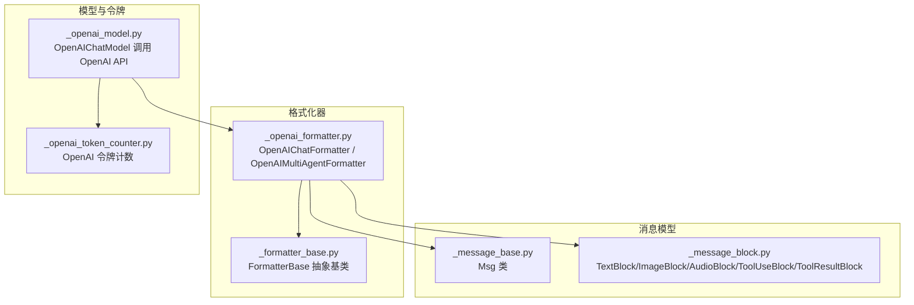
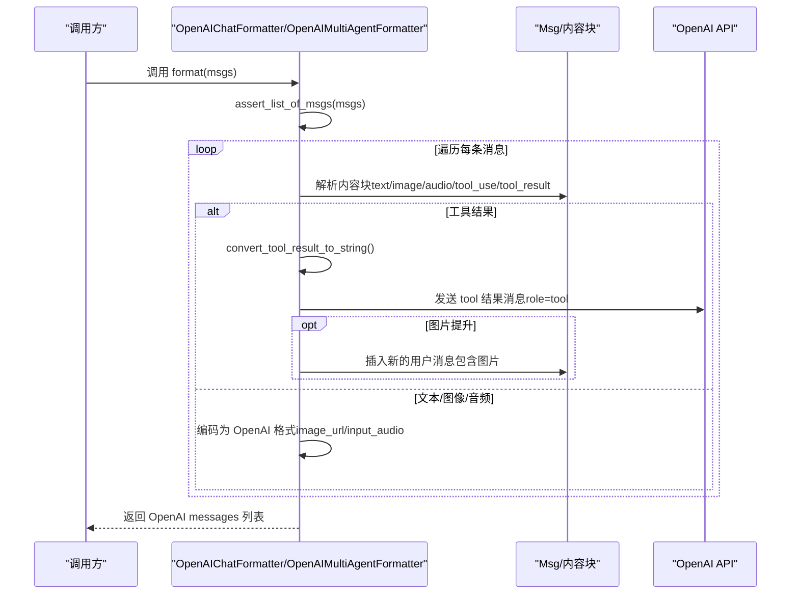
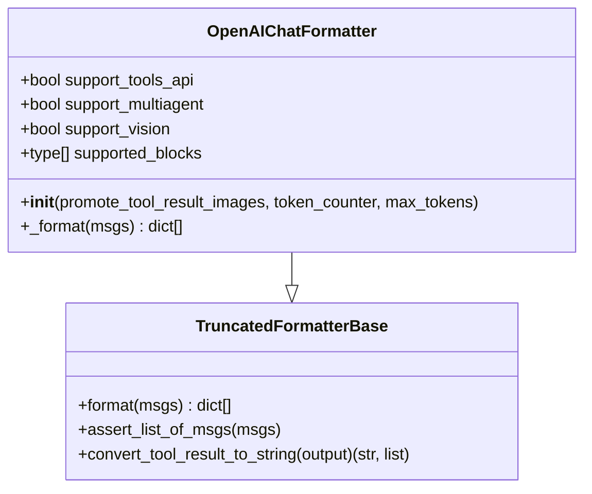
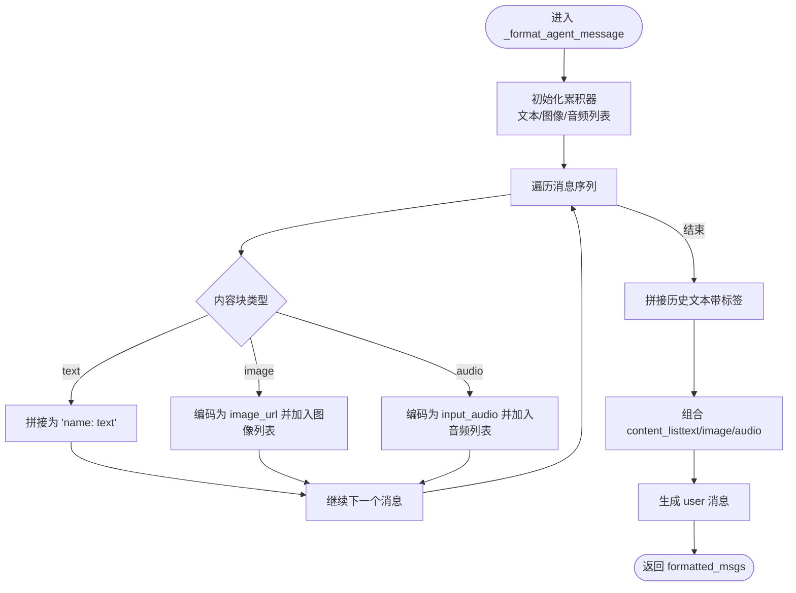
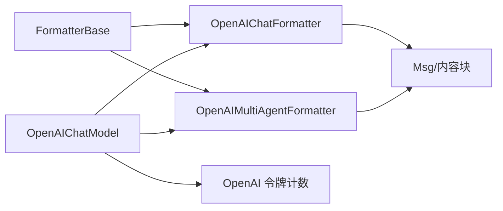

# OpenAI格式化器

<cite>
**本文引用的文件列表**
- [src/agentscope/formatter/_openai_formatter.py](file://src/agentscope/formatter/_openai_formatter.py)
- [src/agentscope/formatter/_formatter_base.py](file://src/agentscope/formatter/_formatter_base.py)
- [src/agentscope/message/_message_base.py](file://src/agentscope/message/_message_base.py)
- [src/agentscope/message/_message_block.py](file://src/agentscope/message/_message_block.py)
- [src/agentscope/model/_openai_model.py](file://src/agentscope/model/_openai_model.py)
- [tests/formatter_openai_test.py](file://tests/formatter_openai_test.py)
- [src/agentscope/token/_openai_token_counter.py](file://src/agentscope/token/_openai_token_counter.py)
</cite>

## 目录
1. [简介](#简介)
2. [项目结构](#项目结构)
3. [核心组件](#核心组件)
4. [架构总览](#架构总览)
5. [详细组件分析](#详细组件分析)
6. [依赖关系分析](#依赖关系分析)
7. [性能考量](#性能考量)
8. [故障排查指南](#故障排查指南)
9. [结论](#结论)
10. [附录](#附录)

## 简介
本文件面向开发者与使用者，系统性阐述 AgentScope 中的 OpenAI 格式化器实现与使用方法。重点覆盖：
- 聊天模板系统与消息格式转换规则
- 角色映射机制（system、user、assistant）
- 多模态内容处理策略（文本、图像、音频）
- OpenAI API 的消息格式要求与兼容性
- 配置项说明（temperature、max_tokens、top_p 等）
- 实际使用示例与最佳实践
- 性能优化建议与常见问题解决方案

## 项目结构
OpenAI 格式化器位于 formatter 子模块，配合消息模型（Msg 与内容块）、令牌计数器与 OpenAI 模型调用端共同工作。

图表来源
- [src/agentscope/formatter/_openai_formatter.py:168-541](file://src/agentscope/formatter/_openai_formatter.py#L168-L541)
- [src/agentscope/formatter/_formatter_base.py:11-130](file://src/agentscope/formatter/_formatter_base.py#L11-L130)
- [src/agentscope/message/_message_base.py:21-242](file://src/agentscope/message/_message_base.py#L21-L242)
- [src/agentscope/message/_message_block.py:9-129](file://src/agentscope/message/_message_block.py#L9-L129)
- [src/agentscope/model/_openai_model.py:170-369](file://src/agentscope/model/_openai_model.py#L170-L369)
- [src/agentscope/token/_openai_token_counter.py:84-144](file://src/agentscope/token/_openai_token_counter.py#L84-L144)

章节来源
- [src/agentscope/formatter/_openai_formatter.py:168-541](file://src/agentscope/formatter/_openai_formatter.py#L168-L541)
- [src/agentscope/formatter/_formatter_base.py:11-130](file://src/agentscope/formatter/_formatter_base.py#L11-L130)
- [src/agentscope/message/_message_base.py:21-242](file://src/agentscope/message/_message_base.py#L21-L242)
- [src/agentscope/message/_message_block.py:9-129](file://src/agentscope/message/_message_block.py#L9-L129)
- [src/agentscope/model/_openai_model.py:170-369](file://src/agentscope/model/_openai_model.py#L170-L369)
- [src/agentscope/token/_openai_token_counter.py:84-144](file://src/agentscope/token/_openai_token_counter.py#L84-L144)

## 核心组件
- OpenAIChatFormatter：面向“单轮对话”场景（用户与智能体），支持工具调用、多模态内容（文本、图像、音频）与可选的工具结果图片提升（promote_tool_result_images）。
- OpenAIMultiAgentFormatter：面向“多智能体对话”场景，自动聚合历史对话为 user 内容块，并兼容工具序列格式化。
- FormatterBase：定义统一的格式化接口与通用工具结果转文本逻辑。
- Msg 与内容块：消息对象与文本、图像、音频、工具调用/结果等内容块的数据结构。
- OpenAIChatModel：调用 OpenAI API 的客户端，支持 temperature、max_tokens、top_p 等参数透传。

章节来源
- [src/agentscope/formatter/_openai_formatter.py:168-541](file://src/agentscope/formatter/_openai_formatter.py#L168-L541)
- [src/agentscope/formatter/_formatter_base.py:11-130](file://src/agentscope/formatter/_formatter_base.py#L11-L130)
- [src/agentscope/message/_message_base.py:21-242](file://src/agentscope/message/_message_base.py#L21-L242)
- [src/agentscope/message/_message_block.py:9-129](file://src/agentscope/message/_message_block.py#L9-L129)
- [src/agentscope/model/_openai_model.py:170-369](file://src/agentscope/model/_openai_model.py#L170-L369)

## 架构总览
OpenAI 格式化器负责将内部消息对象（Msg）及其内容块转换为 OpenAI API 所需的 messages 列表格式。该流程贯穿以下关键步骤：
- 输入校验：确保输入为 Msg 列表
- 内容块解析：逐条消息解析文本、图像、音频、工具调用与工具结果
- 工具结果处理：将非文本多模态数据转为可读文本描述，并可选地将图片提升为用户消息
- 多模态编码：图像与音频按 OpenAI 要求进行 URL 或 base64 编码
- 输出组装：生成包含 role、name、content（或 tool_calls）的字典列表

图表来源
- [src/agentscope/formatter/_openai_formatter.py:192-371](file://src/agentscope/formatter/_openai_formatter.py#L192-L371)
- [src/agentscope/formatter/_formatter_base.py:37-129](file://src/agentscope/formatter/_formatter_base.py#L37-L129)

## 详细组件分析

### OpenAIChatFormatter（单轮对话）
- 支持能力
  - 工具 API：支持 tool_calls 字段
  - 多智能体：支持多实体名称（name）区分
  - 视觉模型：支持 image_url
  - 多模态：支持 text、image、audio、tool_use、tool_result
- 关键行为
  - 将工具调用序列转换为 tool_calls
  - 将工具结果转换为字符串并发送 role=tool 的消息；若启用图片提升，则将图片作为后续用户消息插入
  - 图像：支持 URL 与 base64，本地文件自动检测扩展名并转为 data URL
  - 音频：仅在非 assistant 角色时保留 input_audio，wav/mp3 支持
  - 当 content 为空且无 tool_calls 时跳过该消息
- 初始化参数
  - promote_tool_result_images：是否将工具结果中的图片提升为用户消息
  - token_counter：令牌计数器（用于截断控制）
  - max_tokens：最大令牌数限制

图表来源
- [src/agentscope/formatter/_openai_formatter.py:168-371](file://src/agentscope/formatter/_openai_formatter.py#L168-L371)
- [src/agentscope/formatter/_formatter_base.py:11-130](file://src/agentscope/formatter/_formatter_base.py#L11-L130)

章节来源
- [src/agentscope/formatter/_openai_formatter.py:168-371](file://src/agentscope/formatter/_openai_formatter.py#L168-L371)
- [src/agentscope/formatter/_formatter_base.py:37-129](file://src/agentscope/formatter/_formatter_base.py#L37-L129)

### OpenAIMultiAgentFormatter（多智能体）
- 支持能力
  - 工具 API：委托给 OpenAIChatFormatter 处理工具序列
  - 多智能体：自动聚合历史对话为 user 内容块，首条消息可注入历史提示
  - 视觉模型：支持 image_url
  - 多模态：支持 text、image、audio、tool_use、tool_result
- 关键行为
  - 将连续的历史对话合并为一个 user 消息，文本内容包裹在 <history>...</history> 标签内
  - 图像与音频按 OpenAI 要求编码
  - 可配置 conversation_history_prompt
- 初始化参数
  - conversation_history_prompt：历史对话提示模板
  - promote_tool_result_images：是否将工具结果中的图片提升为用户消息
  - token_counter：令牌计数器（用于截断控制）
  - max_tokens：最大令牌数限制

图表来源
- [src/agentscope/formatter/_openai_formatter.py:445-540](file://src/agentscope/formatter/_openai_formatter.py#L445-L540)

章节来源
- [src/agentscope/formatter/_openai_formatter.py:374-540](file://src/agentscope/formatter/_openai_formatter.py#L374-L540)

### 角色映射与消息格式
- 角色映射
  - Msg.role 映射到 messages[].role：user、assistant、system
  - Msg.name 映射到 messages[].name：用于 OpenAI API 的 entity 标识
- OpenAI API 消息字段
  - role：必需
  - name：可选（用于区分多实体）
  - content：必需（文本、图像、音频、工具调用/结果）
  - tool_calls：当存在工具调用时出现

章节来源
- [src/agentscope/message/_message_base.py:21-242](file://src/agentscope/message/_message_base.py#L21-L242)
- [src/agentscope/formatter/_openai_formatter.py:219-371](file://src/agentscope/formatter/_openai_formatter.py#L219-L371)

### 多模态内容处理策略
- 文本：直接作为 text 块
- 图像
  - URL：支持本地 file:// 与公网 URL；本地文件若为受支持扩展名则转为 data URL
  - Base64：直接拼接 data URL
- 音频
  - 仅在非 assistant 角色时保留；支持 wav、mp3
  - URL：本地文件读取或远程下载后 base64 编码
  - Base64：校验媒体类型为 audio/wav 或 audio/mp3
- 工具结果
  - 非文本多模态数据转为可读文本描述
  - 可选将图片提升为用户消息，便于视觉模型理解

章节来源
- [src/agentscope/formatter/_openai_formatter.py:27-166](file://src/agentscope/formatter/_openai_formatter.py#L27-L166)
- [src/agentscope/formatter/_formatter_base.py:37-129](file://src/agentscope/formatter/_formatter_base.py#L37-L129)

### 配置选项说明（OpenAI API）
- temperature：采样温度，数值越高越随机
- max_tokens：最大生成长度
- top_p：核采样概率质量
- 其他：reasoning_effort（推理强度）、stream（流式输出）、tools/tool_choice（工具调用）、response_format（结构化输出）等

章节来源
- [src/agentscope/model/_openai_model.py:84-172](file://src/agentscope/model/_openai_model.py#L84-L172)
- [src/agentscope/model/_openai_model.py:176-369](file://src/agentscope/model/_openai_model.py#L176-L369)

### 实际使用示例
- 单轮对话（ChatFormatter）
  - 场景：用户与智能体交互，包含文本、图像、音频
  - 关键点：图像自动编码为 data URL；音频仅在 user 角色保留
- 多智能体（MultiAgentFormatter）
  - 场景：多轮对话历史聚合为 user 内容块，首条消息可注入历史提示
  - 关键点：工具序列由 ChatFormatter 处理；可选图片提升
- 工具调用与结果
  - 场景：智能体发起工具调用，系统返回工具结果（可能包含图片/音频）
  - 关键点：工具结果转文本描述；图片可提升为用户消息

章节来源
- [tests/formatter_openai_test.py:1-200](file://tests/formatter_openai_test.py#L1-L200)
- [tests/formatter_openai_test.py:594-646](file://tests/formatter_openai_test.py#L594-L646)

## 依赖关系分析
- OpenAIChatFormatter 与 OpenAIMultiAgentFormatter 继承自 TruncatedFormatterBase，复用统一的格式化接口与工具结果转文本逻辑
- Msg 与内容块定义了统一的数据结构，保证格式化器与模型层的一致性
- OpenAIChatModel 通过 generate_kwargs 透传 temperature、max_tokens、top_p 等参数至 OpenAI API

图表来源
- [src/agentscope/formatter/_formatter_base.py:11-130](file://src/agentscope/formatter/_formatter_base.py#L11-L130)
- [src/agentscope/formatter/_openai_formatter.py:168-541](file://src/agentscope/formatter/_openai_formatter.py#L168-L541)
- [src/agentscope/model/_openai_model.py:170-369](file://src/agentscope/model/_openai_model.py#L170-L369)
- [src/agentscope/token/_openai_token_counter.py:84-144](file://src/agentscope/token/_openai_token_counter.py#L84-L144)

章节来源
- [src/agentscope/formatter/_formatter_base.py:11-130](file://src/agentscope/formatter/_formatter_base.py#L11-L130)
- [src/agentscope/formatter/_openai_formatter.py:168-541](file://src/agentscope/formatter/_openai_formatter.py#L168-L541)
- [src/agentscope/model/_openai_model.py:170-369](file://src/agentscope/model/_openai_model.py#L170-L369)
- [src/agentscope/token/_openai_token_counter.py:84-144](file://src/agentscope/token/_openai_token_counter.py#L84-L144)

## 性能考量
- 令牌计数与截断
  - 使用 TokenCounterBase 控制 max_tokens，避免超限
  - OpenAI 令牌计数器对不同模型有差异，需按模型选择计数策略
- 多模态数据处理
  - 图像与音频的本地文件读取与 base64 编码会产生额外开销，建议在批量处理时缓存或复用
- 流式输出
  - 合理设置 stream 与 stream_tool_parsing，减少等待时间并提升交互体验
- 工具结果图片提升
  - 仅在必要时开启 promote_tool_result_images，避免插入过多用户消息导致上下文膨胀

章节来源
- [src/agentscope/token/_openai_token_counter.py:84-144](file://src/agentscope/token/_openai_token_counter.py#L84-L144)
- [src/agentscope/model/_openai_model.py:84-172](file://src/agentscope/model/_openai_model.py#L84-L172)

## 故障排查指南
- 输入类型错误
  - 确保传入为 Msg 列表，否则抛出类型异常
- 图像 URL/本地文件不合法
  - 仅支持特定扩展名或 MIME 类型；本地文件需存在且可读
- 音频格式不支持
  - 仅支持 wav、mp3；媒体类型需为 audio/wav 或 audio/mp3
- 工具结果多模态数据缺失 source
  - 确保 image/audio/video 块包含 source 字段
- 工具结果转文本失败
  - 检查输出类型与 source 类型是否匹配

章节来源
- [src/agentscope/formatter/_formatter_base.py:37-129](file://src/agentscope/formatter/_formatter_base.py#L37-L129)
- [src/agentscope/formatter/_openai_formatter.py:27-166](file://src/agentscope/formatter/_openai_formatter.py#L27-L166)

## 结论
OpenAI 格式化器提供了与 OpenAI API 完全兼容的消息格式转换能力，支持多模态与工具调用，并针对多智能体场景提供历史对话聚合与图片提升策略。通过合理的配置与性能优化，可在多种应用场景中稳定高效地使用。

## 附录

### OpenAI API 行为参数（generate_kwargs）
- temperature：采样温度
- max_tokens：最大生成长度
- top_p：核采样概率质量
- 其他：reasoning_effort、stream、tools、tool_choice、response_format 等

章节来源
- [src/agentscope/model/_openai_model.py:84-172](file://src/agentscope/model/_openai_model.py#L84-L172)
- [src/agentscope/model/_openai_model.py:176-369](file://src/agentscope/model/_openai_model.py#L176-L369)