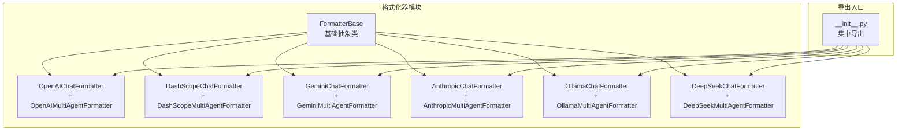
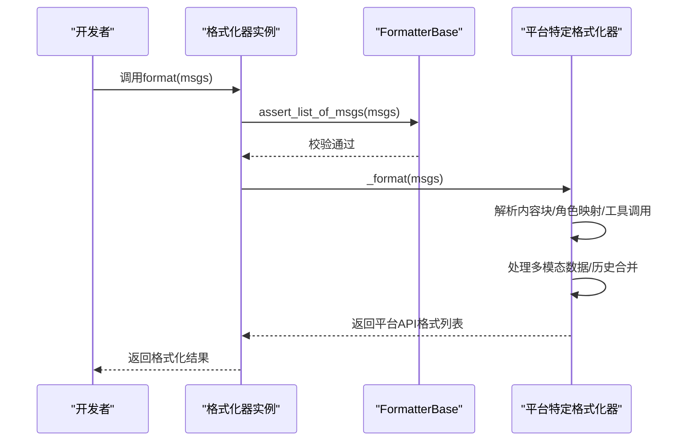
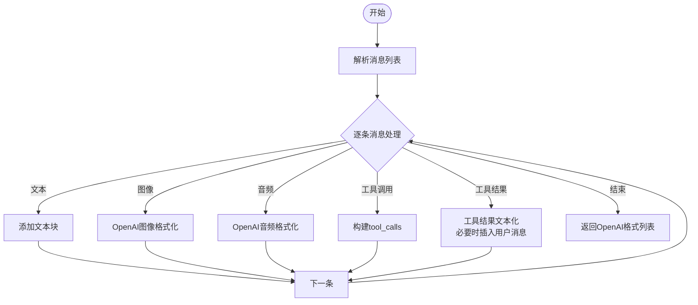
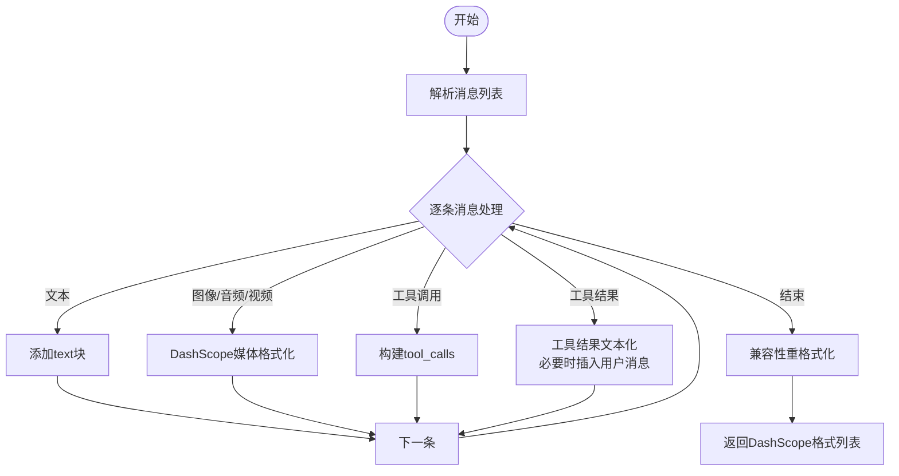
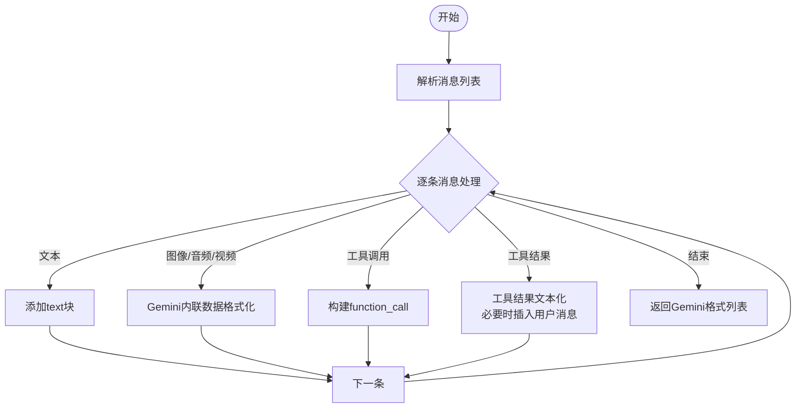
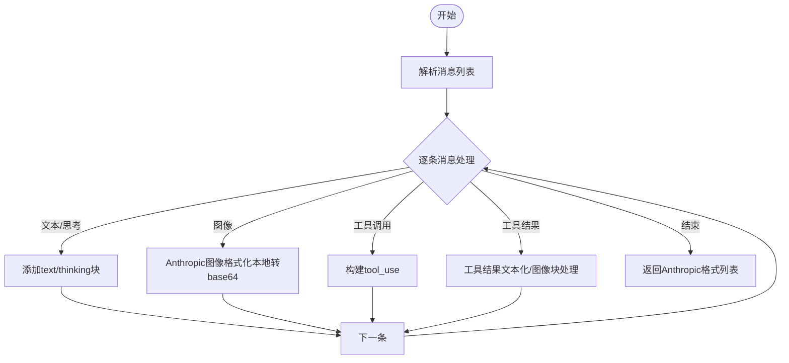
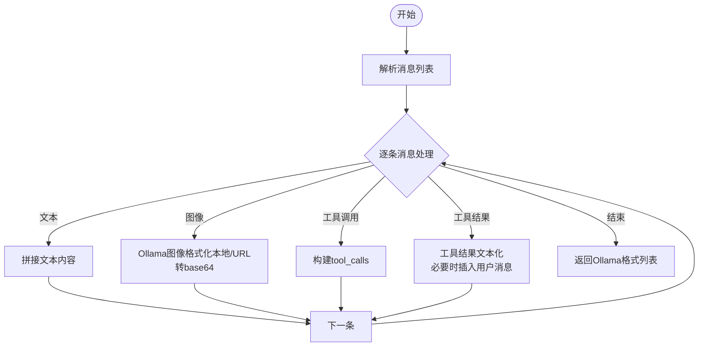
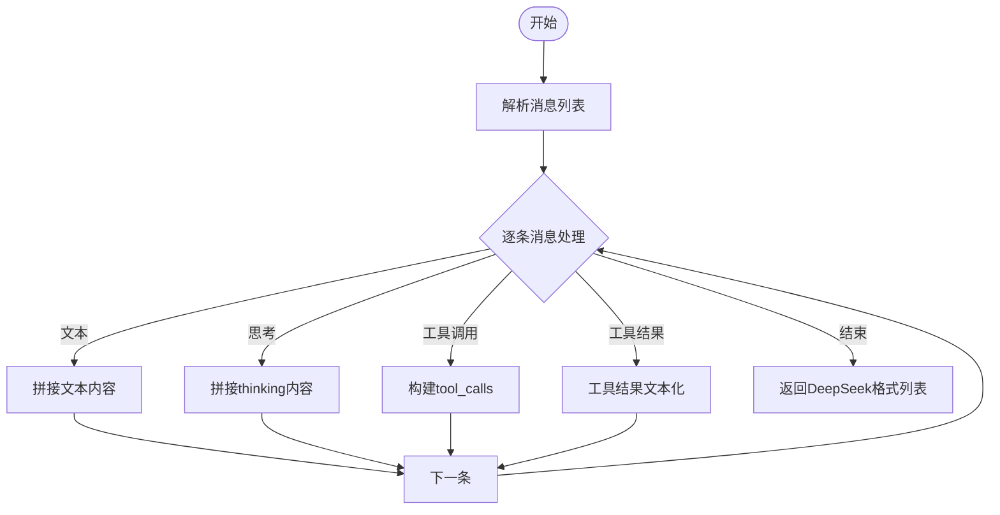
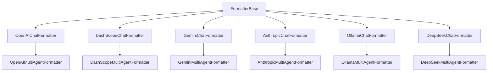

# 平台格式化器

<cite>
**本文引用的文件**
- [formatter\_\_init__.py](file://src/agentscope/formatter/__init__.py)
- [formatter\_base.py](file://src/agentscope/formatter/_formatter_base.py)
- [formatter\_openai.py](file://src/agentscope/formatter/_openai_formatter.py)
- [formatter\_dashscope.py](file://src/agentscope/formatter/_dashscope_formatter.py)
- [formatter\_gemini.py](file://src/agentscope/formatter/_gemini_formatter.py)
- [formatter\_anthropic.py](file://src/agentscope/formatter/_anthropic_formatter.py)
- [formatter\_ollama.py](file://src/agentscope/formatter/_ollama_formatter.py)
- [formatter\_deepseek.py](file://src/agentscope/formatter/_deepseek_formatter.py)
- [formatter\_openai_test.py](file://tests/formatter_openai_test.py)
- [formatter\_dashscope_test.py](file://tests/formatter_dashscope_test.py)
- [formatter\_gemini_test.py](file://tests/formatter_gemini_test.py)
- [formatter\_anthropic_test.py](file://tests/formatter_anthropic_test.py)
- [formatter\_ollama_test.py](file://tests/formatter_ollama_test.py)
- [formatter\_deepseek_test.py](file://tests/formatter_deepseek_test.py)
</cite>

## 目录
1. [简介](#简介)
2. [项目结构](#项目结构)
3. [核心组件](#核心组件)
4. [架构概览](#架构概览)
5. [详细组件分析](#详细组件分析)
6. [依赖分析](#依赖分析)
7. [性能考虑](#性能考虑)
8. [故障排除指南](#故障排除指南)
9. [结论](#结论)
10. [附录](#附录)

## 简介
本技术文档面向AgentScope平台的多平台格式化器，系统梳理并对比OpenAI、DashScope、Gemini、Anthropic、Ollama与DeepSeek六大平台的格式化实现差异，涵盖消息格式转换规则（角色映射、内容块处理、工具调用序列）、平台特性（多模态支持、结构化输出、提示词工程、开源模型适配、推理优化）、配置选项（API版本兼容性、特殊参数设置、性能调优）以及迁移与排障策略。文档同时提供平台对比表、迁移指南与最佳实践，帮助开发者在不同平台间无缝切换并获得稳定高效的对话与工具调用体验。

## 项目结构
AgentScope的格式化模块位于src/agentscope/formatter目录，采用“按平台拆分”的设计：每个平台一个独立文件，统一继承自FormatterBase，并通过__all__在__init__.py中集中导出。测试用例位于tests目录下，覆盖各平台聊天与多智能体场景的典型用法与边界条件。

**图表来源**
- [formatter\_\_init__.py:1-49](file://src/agentscope/formatter/__init__.py#L1-L49)
- [formatter\_base.py:11-130](file://src/agentscope/formatter/_formatter_base.py#L11-L130)
- [formatter\_openai.py:168-541](file://src/agentscope/formatter/_openai_formatter.py#L168-L541)
- [formatter\_dashscope.py:159-634](file://src/agentscope/formatter/_dashscope_formatter.py#L159-L634)
- [formatter\_gemini.py:108-509](file://src/agentscope/formatter/_gemini_formatter.py#L108-L509)
- [formatter\_anthropic.py:98-355](file://src/agentscope/formatter/_anthropic_formatter.py#L98-L355)
- [formatter\_ollama.py:73-444](file://src/agentscope/formatter/_ollama_formatter.py#L73-L444)
- [formatter\_deepseek.py:13-266](file://src/agentscope/formatter/_deepseek_formatter.py#L13-L266)

**章节来源**
- [formatter\_\_init__.py:1-49](file://src/agentscope/formatter/__init__.py#L1-L49)

## 核心组件
- FormatterBase：定义统一的异步format接口与通用校验、工具结果文本化等辅助方法，确保各平台格式化器的一致性与可扩展性。
- 各平台格式化器：分别实现平台特定的消息结构、角色映射、内容块处理与工具调用序列格式化逻辑；部分平台支持多模态输入（图像/音频/视频），部分支持多智能体历史合并与对话历史标签。

关键能力要点
- 角色映射：多数平台直接使用Msg的role字段；Anthropic对system消息有首条限制，Gemini将assistant映射为model用户映射为user。
- 内容块处理：支持text、image、audio、video、tool_use、tool_result等；部分平台会将tool_result中的多模态数据提取为后续用户消息以兼容API限制。
- 工具调用序列：OpenAI/DashScope/Gemini/Ollama/DeepSeek均支持tool_calls与tool消息；Anthropic使用tool_use与tool_result块。
- 多模态支持：OpenAI/DashScope/Gemini/Ollama支持图像；DashScope/Gemini支持音频/视频；Anthropic支持图像；Ollama支持图像；DeepSeek不支持视觉。

**章节来源**
- [formatter\_base.py:11-130](file://src/agentscope/formatter/_formatter_base.py#L11-L130)
- [formatter\_openai.py:168-541](file://src/agentscope/formatter/_openai_formatter.py#L168-L541)
- [formatter\_dashscope.py:159-634](file://src/agentscope/formatter/_dashscope_formatter.py#L159-L634)
- [formatter\_gemini.py:108-509](file://src/agentscope/formatter/_gemini_formatter.py#L108-L509)
- [formatter\_anthropic.py:98-355](file://src/agentscope/formatter/_anthropic_formatter.py#L98-L355)
- [formatter\_ollama.py:73-444](file://src/agentscope/formatter/_ollama_formatter.py#L73-L444)
- [formatter\_deepseek.py:13-266](file://src/agentscope/formatter/_deepseek_formatter.py#L13-L266)

## 架构概览
各平台格式化器遵循统一的职责划分：FormatterBase负责通用校验与工具结果文本化；具体平台格式化器负责将Msg列表转换为对应平台的API请求结构。多智能体场景通过“历史合并”策略将对话历史打包到首个system或user消息中，配合<history>标签实现上下文管理。

**图表来源**
- [formatter\_base.py:19-35](file://src/agentscope/formatter/_formatter_base.py#L19-L35)
- [formatter\_openai.py:219-371](file://src/agentscope/formatter/_openai_formatter.py#L219-L371)
- [formatter\_dashscope.py:244-425](file://src/agentscope/formatter/_dashscope_formatter.py#L244-L425)
- [formatter\_gemini.py:178-310](file://src/agentscope/formatter/_gemini_formatter.py#L178-L310)
- [formatter\_anthropic.py:123-217](file://src/agentscope/formatter/_anthropic_formatter.py#L123-L217)
- [formatter\_ollama.py:125-265](file://src/agentscope/formatter/_ollama_formatter.py#L125-L265)
- [formatter\_deepseek.py:36-120](file://src/agentscope/formatter/_deepseek_formatter.py#L36-L120)

## 详细组件分析

### OpenAI格式化器
- 支持能力：工具API、多智能体、视觉（图像）、音频输入（assistant以外角色）。
- 角色映射：保留Msg的name字段用于区分实体；assistant映射为assistant，system映射为system。
- 内容块：text、image（支持URL与本地文件转data:base64）、audio（wav/mp3）、tool_use、tool_result。
- 工具调用序列：tool_use生成tool_calls；tool_result生成tool角色消息。
- 多模态处理：支持将tool_result中的图片/音频提取为后续用户消息，提升兼容性。
- 多智能体：将历史对话合并为user消息，使用<history>标签包裹；支持conversation_history_prompt定制。

**图表来源**
- [formatter\_openai.py:219-371](file://src/agentscope/formatter/_openai_formatter.py#L219-L371)
- [formatter\_openai.py:391-541](file://src/agentscope/formatter/_openai_formatter.py#L391-L541)

**章节来源**
- [formatter\_openai.py:168-541](file://src/agentscope/formatter/_openai_formatter.py#L168-L541)
- [formatter\_openai_test.py:21-779](file://tests/formatter_openai_test.py#L21-L779)

### DashScope格式化器
- 支持能力：工具API、多智能体、视觉（图像）、音频、视频。
- 角色映射：assistant映射为assistant，system映射为system；其余角色映射为user。
- 内容块：text、image、audio、video、tool_use、tool_result。
- 工具调用序列：tool_use生成tool_calls；tool_result生成tool角色消息。
- 多模态处理：支持将tool_result中的图像/音频/视频提取为后续用户消息；本地文件自动转dataURI。
- 多智能体：将历史对话合并为user消息，使用<history>标签包裹；支持conversation_history_prompt定制。
- 兼容性：针对qwen-vl-max/qwen3-max的已知问题进行规避（空content、None content等）。

**图表来源**
- [formatter\_dashscope.py:244-425](file://src/agentscope/formatter/_dashscope_formatter.py#L244-L425)
- [formatter\_dashscope.py:79-157](file://src/agentscope/formatter/_dashscope_formatter.py#L79-L157)

**章节来源**
- [formatter\_dashscope.py:159-634](file://src/agentscope/formatter/_dashscope_formatter.py#L159-L634)
- [formatter\_dashscope_test.py:24-800](file://tests/formatter_dashscope_test.py#L24-L800)

### Gemini格式化器
- 支持能力：工具API、多智能体、视觉（图像）、音频、视频。
- 角色映射：assistant映射为model，system映射为user；其余角色映射为user。
- 内容块：text、image、video、audio、tool_use、tool_result。
- 工具调用序列：tool_use生成function_call；tool_result生成function_response。
- 多模态处理：支持将tool_result中的图像提取为后续用户消息；本地文件与网络URL均支持base64编码。
- 多智能体：将历史对话合并为user消息，使用<history>标签包裹；支持conversation_history_prompt定制。

**图表来源**
- [formatter\_gemini.py:178-310](file://src/agentscope/formatter/_gemini_formatter.py#L178-L310)
- [formatter\_gemini.py:25-106](file://src/agentscope/formatter/_gemini_formatter.py#L25-L106)

**章节来源**
- [formatter\_gemini.py:108-509](file://src/agentscope/formatter/_gemini_formatter.py#L108-L509)
- [formatter\_gemini_test.py:20-800](file://tests/formatter_gemini_test.py#L20-L800)

### Anthropic格式化器
- 支持能力：工具API、多智能体、视觉（图像）。
- 角色映射：assistant映射为assistant；system仅允许第一条消息，否则降级为user。
- 内容块：text、image、tool_use、tool_result。
- 工具调用序列：tool_use生成tool_use块；tool_result生成tool_result块。
- 多模态处理：本地图像自动转base64；网络URL保持原样。
- 多智能体：将历史对话合并为user消息，使用<history>标签包裹；支持conversation_history_prompt定制。

**图表来源**
- [formatter\_anthropic.py:123-217](file://src/agentscope/formatter/_anthropic_formatter.py#L123-L217)
- [formatter\_anthropic.py:16-96](file://src/agentscope/formatter/_anthropic_formatter.py#L16-L96)

**章节来源**
- [formatter\_anthropic.py:98-355](file://src/agentscope/formatter/_anthropic_formatter.py#L98-L355)
- [formatter\_anthropic_test.py:19-678](file://tests/formatter_anthropic_test.py#L19-L678)

### Ollama格式化器
- 支持能力：工具API、多智能体、视觉（图像）。
- 角色映射：assistant映射为assistant；system映射为system；其余角色映射为user。
- 内容块：text、image、tool_use、tool_result。
- 工具调用序列：tool_use生成tool_calls；tool_result生成tool角色消息。
- 多模态处理：本地图像转base64字符串；网络URL远程下载后转base64。
- 多智能体：将历史对话合并为user消息，使用<history>标签包裹；支持conversation_history_prompt定制。

**图表来源**
- [formatter\_ollama.py:125-265](file://src/agentscope/formatter/_ollama_formatter.py#L125-L265)
- [formatter\_ollama.py:23-71](file://src/agentscope/formatter/_ollama_formatter.py#L23-L71)

**章节来源**
- [formatter\_ollama.py:73-444](file://src/agentscope/formatter/_ollama_formatter.py#L73-L444)
- [formatter\_ollama_test.py:18-661](file://tests/formatter_ollama_test.py#L18-L661)

### DeepSeek格式化器
- 支持能力：工具API、多智能体、推理内容（thinking）。
- 角色映射：assistant映射为assistant；system映射为system；其余角色映射为user。
- 内容块：text、thinking、tool_use、tool_result。
- 工具调用序列：tool_use生成tool_calls；tool_result生成tool角色消息。
- 多模态处理：不支持视觉；支持文本与工具调用。
- 多智能体：将历史对话合并为user消息，使用<history>标签包裹；支持conversation_history_prompt定制。

**图表来源**
- [formatter\_deepseek.py:36-120](file://src/agentscope/formatter/_deepseek_formatter.py#L36-L120)

**章节来源**
- [formatter\_deepseek.py:13-266](file://src/agentscope/formatter/_deepseek_formatter.py#L13-L266)
- [formatter\_deepseek_test.py:18-468](file://tests/formatter_deepseek_test.py#L18-L468)

## 依赖分析
- 继承关系：所有平台格式化器均继承自FormatterBase，复用统一的输入校验与工具结果文本化逻辑。
- 消息类型：统一依赖Msg及其内容块（TextBlock、ImageBlock、AudioBlock、VideoBlock、ToolUseBlock、ToolResultBlock）。
- 工具计数器：TruncatedFormatterBase子类可选注入TokenCounterBase以支持长度截断。
- 平台特有依赖：各平台内部实现依赖平台特定的数据格式与URL处理逻辑（如OpenAI图像URL转换、DashScope媒体dataURI、Gemini内联数据、Anthropic图像base64、Ollama图像base64、DeepSeek推理内容）。

**图表来源**
- [formatter\_base.py:11-130](file://src/agentscope/formatter/_formatter_base.py#L11-L130)
- [formatter\_openai.py:374-541](file://src/agentscope/formatter/_openai_formatter.py#L374-L541)
- [formatter\_dashscope.py:428-634](file://src/agentscope/formatter/_dashscope_formatter.py#L428-L634)
- [formatter\_gemini.py:313-509](file://src/agentscope/formatter/_gemini_formatter.py#L313-L509)
- [formatter\_anthropic.py:220-355](file://src/agentscope/formatter/_anthropic_formatter.py#L220-L355)
- [formatter\_ollama.py:268-444](file://src/agentscope/formatter/_ollama_formatter.py#L268-L444)
- [formatter\_deepseek.py:123-266](file://src/agentscope/formatter/_deepseek_formatter.py#L123-L266)

**章节来源**
- [formatter\_\_init__.py:1-49](file://src/agentscope/formatter/__init__.py#L1-L49)

## 性能考虑
- 截断与计数：TruncatedFormatterBase支持传入TokenCounterBase与max_tokens参数，按平台token估算进行消息截断，避免超限。
- 多模态数据处理：本地文件读取与base64编码可能带来I/O与CPU开销；建议缓存常用资源或预处理大文件。
- 工具结果文本化：将tool_result中的多模态数据转为文本描述并插入用户消息，有助于减少后续API错误，但会增加消息数量与token消耗。
- 历史合并：多智能体场景下，将历史对话合并为单个user消息可减少消息条数，但需注意content长度限制与标签开销。

[本节为通用指导，无需代码来源]

## 故障排除指南
- OpenAI
  - 现象：tool_result中图像/音频未被识别。
  - 处理：启用promote_tool_result_images=True，将图像从tool_result中提取并作为后续用户消息插入。
  - 参考：[formatter\_openai_test.py:436-593](file://tests/formatter_openai_test.py#L436-L593)
- DashScope
  - 现象：qwen-vl-max报错缺少content字段或content为None。
  - 处理：格式化器会为无有效内容块的消息设置空列表content，避免上述问题。
  - 参考：[formatter\_dashscope.py:159-181](file://src/agentscope/formatter/_dashscope_formatter.py#L159-L181)
- Gemini
  - 现象：不支持的文件扩展名或URL无效。
  - 处理：检查supported_extensions与URL有效性；本地文件需具备可识别扩展名。
  - 参考：[formatter\_gemini.py:135-149](file://src/agentscope/formatter/_gemini_formatter.py#L135-L149)
- Anthropic
  - 现象：非首条system消息被映射为user。
  - 处理：AnthropicChatFormatter会自动将非首条system降级为user。
  - 参考：[formatter\_anthropic.py:202-216](file://src/agentscope/formatter/_anthropic_formatter.py#L202-L216)
- Ollama
  - 现象：图像URL无法访问或本地文件不存在。
  - 处理：确保URL可达或本地路径存在；本地文件会被读取并base64编码。
  - 参考：[formatter\_ollama.py:51-70](file://src/agentscope/formatter/_ollama_formatter.py#L51-L70)
- DeepSeek
  - 现象：视觉输入不被支持。
  - 处理：DeepSeek不支持图像/视频/音频，仅支持文本与工具调用。
  - 参考：[formatter\_deepseek.py:25-26](file://src/agentscope/formatter/_deepseek_formatter.py#L25-L26)

**章节来源**
- [formatter\_openai_test.py:436-593](file://tests/formatter_openai_test.py#L436-L593)
- [formatter\_dashscope.py:159-181](file://src/agentscope/formatter/_dashscope_formatter.py#L159-L181)
- [formatter\_gemini.py:135-149](file://src/agentscope/formatter/_gemini_formatter.py#L135-L149)
- [formatter\_anthropic.py:202-216](file://src/agentscope/formatter/_anthropic_formatter.py#L202-L216)
- [formatter\_ollama.py:51-70](file://src/agentscope/formatter/_ollama_formatter.py#L51-L70)
- [formatter\_deepseek.py:25-26](file://src/agentscope/formatter/_deepseek_formatter.py#L25-L26)

## 结论
AgentScope的多平台格式化器通过统一的FormatterBase抽象与各平台特定实现，实现了跨平台的消息格式化与工具调用序列处理。OpenAI强调工具API与多模态（图像/音频）；DashScope支持更丰富的媒体类型（图像/音频/视频）；Gemini采用parts与function_call/function_response的结构化输出；Anthropic重视提示词工程与思维块保留；Ollama专注于开源模型的图像输入与历史合并；DeepSeek聚焦推理内容与工具调用。选择合适格式化器并结合配置选项（如promote_tool_result_*、conversation_history_prompt、token计数与截断），可在不同平台间实现一致且高效的对话体验。

[本节为总结性内容，无需代码来源]

## 附录

### 平台对比表
- 支持能力
  - OpenAI：工具API、多智能体、视觉、音频
  - DashScope：工具API、多智能体、视觉、音频、视频
  - Gemini：工具API、多智能体、视觉、音频、视频
  - Anthropic：工具API、多智能体、视觉
  - Ollama：工具API、多智能体、视觉
  - DeepSeek：工具API、多智能体、推理内容
- 角色映射
  - OpenAI：保留name字段；assistant/system映射
  - DashScope：assistant/system映射；其余user
  - Gemini：assistant->model；system->user；其余user
  - Anthropic：assistant映射；system仅首条有效
  - Ollama：assistant/system映射；其余user
  - DeepSeek：assistant映射；system映射；其余user
- 多模态支持
  - OpenAI：图像（URL/本地）、音频（wav/mp3）
  - DashScope：图像、音频、视频
  - Gemini：图像、音频、视频
  - Anthropic：图像（本地转base64）
  - Ollama：图像（本地/URL转base64）
  - DeepSeek：无视觉
- 工具调用序列
  - OpenAI：tool_use->tool_calls；tool_result->tool消息
  - DashScope：同上
  - Gemini：tool_use->function_call；tool_result->function_response
  - Anthropic：tool_use->tool_use；tool_result->tool_result
  - Ollama：tool_use->tool_calls；tool_result->tool消息
  - DeepSeek：tool_use->tool_calls；tool_result->tool消息

**章节来源**
- [formatter\_openai.py:168-541](file://src/agentscope/formatter/_openai_formatter.py#L168-L541)
- [formatter\_dashscope.py:159-634](file://src/agentscope/formatter/_dashscope_formatter.py#L159-L634)
- [formatter\_gemini.py:108-509](file://src/agentscope/formatter/_gemini_formatter.py#L108-L509)
- [formatter\_anthropic.py:98-355](file://src/agentscope/formatter/_anthropic_formatter.py#L98-L355)
- [formatter\_ollama.py:73-444](file://src/agentscope/formatter/_ollama_formatter.py#L73-L444)
- [formatter\_deepseek.py:13-266](file://src/agentscope/formatter/_deepseek_formatter.py#L13-L266)

### 迁移指南
- 从OpenAI迁移到DashScope/Gemini
  - 将role映射调整为user/assistant；DashScope/Gemini不支持None content，需确保content为字符串或列表。
  - 图像/音频/视频格式改为对应平台的dataURI或内联数据结构。
  - 工具调用序列由tool_calls与tool消息改为function_call/function_response或tool_use/tool_result。
- 从DashScope/Gemini迁移到OpenAI
  - 将content从列表结构合并为字符串（若全部为纯文本），以兼容某些计数器。
  - 图像/音频格式改为OpenAI的image_url或input_audio结构。
- 从Anthropic迁移到其他平台
  - 首条system消息之外的system需降级为user。
  - 将thinking块与image块按目标平台要求转换。
- 从Ollama迁移到其他平台
  - 图像base64数据需按目标平台要求封装；音频/视频需转换为目标平台支持的格式。
- 从DeepSeek迁移到其他平台
  - 移除thinking内容；确保仅传递文本与工具调用。

[本节为通用指导，无需代码来源]

### 使用示例与最佳实践
- 基础用法
  - 创建对应平台格式化器实例，传入token计数器与max_tokens进行截断控制。
  - 调用format(msgs)获取平台API格式列表。
- 多智能体场景
  - 使用MultiAgentFormatter，合理设置conversation_history_prompt与promote_tool_result_*参数。
  - 将历史对话与当前轮次合并，确保<history>标签正确闭合。
- 多模态与工具调用
  - 对于不支持多模态的平台（如DeepSeek），将tool_result中的图像/音频转为文本描述并插入用户消息。
  - 对于需要保留思维过程的平台（如Anthropic），确保thinking块参与格式化流程。
- 性能优化
  - 预先处理本地大文件，减少运行时I/O与base64编码开销。
  - 合理设置max_tokens，避免频繁截断导致的重复计算。

**章节来源**
- [formatter\_openai_test.py:21-779](file://tests/formatter_openai_test.py#L21-L779)
- [formatter\_dashscope_test.py:24-800](file://tests/formatter_dashscope_test.py#L24-L800)
- [formatter\_gemini_test.py:20-800](file://tests/formatter_gemini_test.py#L20-L800)
- [formatter\_anthropic_test.py:19-678](file://tests/formatter_anthropic_test.py#L19-L678)
- [formatter\_ollama_test.py:18-661](file://tests/formatter_ollama_test.py#L18-L661)
- [formatter\_deepseek_test.py:18-468](file://tests/formatter_deepseek_test.py#L18-L468)