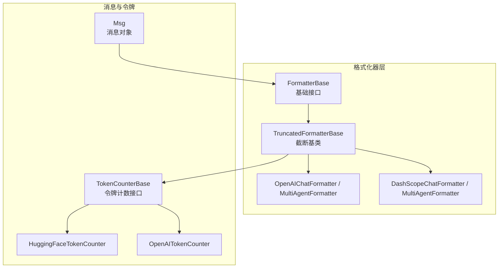
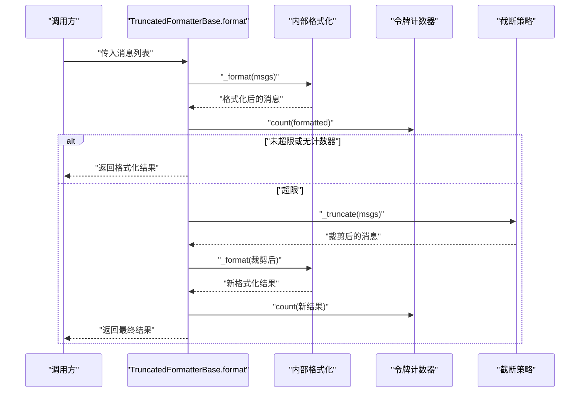
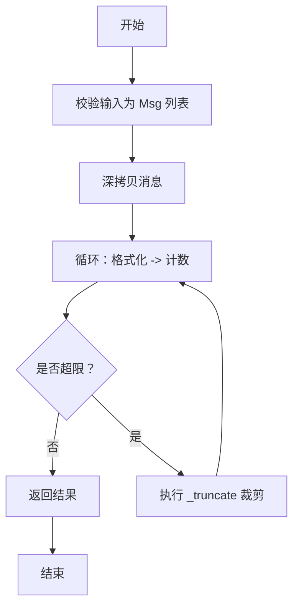
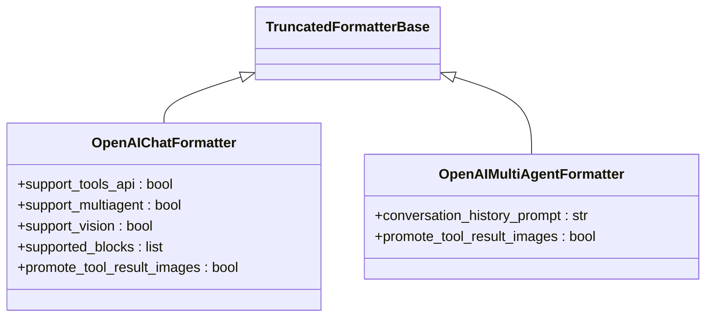
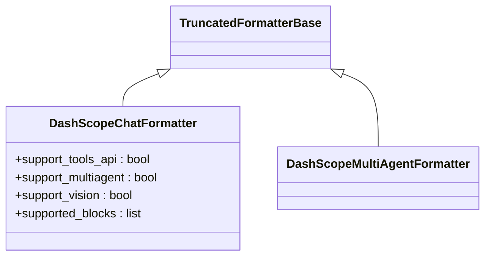
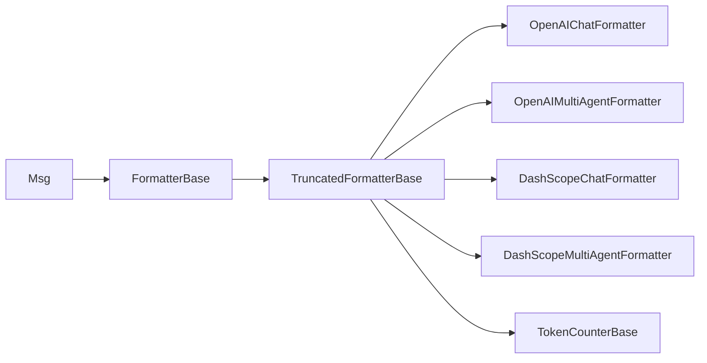

# 截断格式化器

<cite>
**本文引用的文件**
- [src/agentscope/formatter/_truncated_formatter_base.py](file://src/agentscope/formatter/_truncated_formatter_base.py)
- [src/agentscope/formatter/_formatter_base.py](file://src/agentscope/formatter/_formatter_base.py)
- [src/agentscope/formatter/_openai_formatter.py](file://src/agentscope/formatter/_openai_formatter.py)
- [src/agentscope/formatter/_dashscope_formatter.py](file://src/agentscope/formatter/_dashscope_formatter.py)
- [src/agentscope/token/_token_base.py](file://src/agentscope/token/_token_base.py)
- [src/agentscope/token/_huggingface_token_counter.py](file://src/agentscope/token/_huggingface_token_counter.py)
- [src/agentscope/token/_openai_token_counter.py](file://src/agentscope/token/_openai_token_counter.py)
- [src/agentscope/message/_message_base.py](file://src/agentscope/message/_message_base.py)
- [tests/formatter_openai_test.py](file://tests/formatter_openai_test.py)
- [docs/tutorial/zh_CN/src/task_prompt.py](file://docs/tutorial/zh_CN/src/task_prompt.py)
</cite>

## 目录
1. [简介](#简介)
2. [项目结构](#项目结构)
3. [核心组件](#核心组件)
4. [架构概览](#架构概览)
5. [详细组件分析](#详细组件分析)
6. [依赖分析](#依赖分析)
7. [性能考虑](#性能考虑)
8. [故障排查指南](#故障排查指南)
9. [结论](#结论)
10. [附录](#附录)

## 简介
本技术文档围绕 AgentScope 的“截断格式化器”展开，系统性阐述 TruncatedFormatterBase 的设计理念、提示词截断机制、长度计算算法与智能截断策略；详解截断过程的实现原理（上下文保留、重要信息保护、边界处理）；给出截断配置参数（最大长度限制、截断位置选择、回退策略）；并提供截断效果评估方法（信息损失度量、性能影响分析）、使用示例、配置指南、调试技巧、完整 API 参考与性能优化建议。

## 项目结构
与截断格式化器直接相关的核心模块如下：
- 格式化器基类与截断基类：formatter/_formatter_base.py、formatter/_truncated_formatter_base.py
- 具体格式化器实现：formatter/_openai_formatter.py、formatter/_dashscope_formatter.py
- 消息模型：message/_message_base.py
- 令牌计数器接口与实现：token/_token_base.py、token/_huggingface_token_counter.py、token/_openai_token_counter.py
- 测试与教程：tests/formatter_openai_test.py、docs/tutorial/zh_CN/src/task_prompt.py

图表来源
- [src/agentscope/formatter/_formatter_base.py:11-18](file://src/agentscope/formatter/_formatter_base.py#L11-L18)
- [src/agentscope/formatter/_truncated_formatter_base.py:19-46](file://src/agentscope/formatter/_truncated_formatter_base.py#L19-L46)
- [src/agentscope/formatter/_openai_formatter.py:168-218](file://src/agentscope/formatter/_openai_formatter.py#L168-L218)
- [src/agentscope/formatter/_dashscope_formatter.py:159-200](file://src/agentscope/formatter/_dashscope_formatter.py#L159-L200)
- [src/agentscope/token/_token_base.py:7-16](file://src/agentscope/token/_token_base.py#L7-L16)
- [src/agentscope/token/_huggingface_token_counter.py:9-95](file://src/agentscope/token/_huggingface_token_counter.py#L9-L95)
- [src/agentscope/token/_openai_token_counter.py:1-200](file://src/agentscope/token/_openai_token_counter.py#L1-L200)
- [src/agentscope/message/_message_base.py:21-100](file://src/agentscope/message/_message_base.py#L21-L100)

章节来源
- [src/agentscope/formatter/_formatter_base.py:11-18](file://src/agentscope/formatter/_formatter_base.py#L11-L18)
- [src/agentscope/formatter/_truncated_formatter_base.py:19-46](file://src/agentscope/formatter/_truncated_formatter_base.py#L19-L46)
- [src/agentscope/formatter/_openai_formatter.py:168-218](file://src/agentscope/formatter/_openai_formatter.py#L168-L218)
- [src/agentscope/formatter/_dashscope_formatter.py:159-200](file://src/agentscope/formatter/_dashscope_formatter.py#L159-L200)
- [src/agentscope/token/_token_base.py:7-16](file://src/agentscope/token/_token_base.py#L7-L16)
- [src/agentscope/token/_huggingface_token_counter.py:9-95](file://src/agentscope/token/_huggingface_token_counter.py#L9-L95)
- [src/agentscope/token/_openai_token_counter.py:1-200](file://src/agentscope/token/_openai_token_counter.py#L1-L200)
- [src/agentscope/message/_message_base.py:21-100](file://src/agentscope/message/_message_base.py#L21-L100)

## 核心组件
- TruncatedFormatterBase：提供统一的“格式化-计数-截断-再格式化”的迭代流程，支持按令牌上限自动收缩输入消息，保证最终输出不超过 max_tokens。
- FormatterBase：定义格式化接口与通用校验逻辑（如输入必须为 Msg 列表）。
- 具体格式化器（如 OpenAIChatFormatter、DashScopeChatFormatter）：在 TruncatedFormatterBase 基础上实现具体 API 的消息格式化与工具调用序列处理。
- TokenCounterBase 及其实现：提供异步令牌计数能力，用于动态评估格式化后的消息长度。
- Msg：消息载体，支持文本、工具调用/结果、图像/音频/视频等多模态内容块。

章节来源
- [src/agentscope/formatter/_truncated_formatter_base.py:19-46](file://src/agentscope/formatter/_truncated_formatter_base.py#L19-L46)
- [src/agentscope/formatter/_formatter_base.py:11-18](file://src/agentscope/formatter/_formatter_base.py#L11-L18)
- [src/agentscope/formatter/_openai_formatter.py:168-218](file://src/agentscope/formatter/_openai_formatter.py#L168-L218)
- [src/agentscope/formatter/_dashscope_formatter.py:159-200](file://src/agentscope/formatter/_dashscope_formatter.py#L159-L200)
- [src/agentscope/token/_token_base.py:7-16](file://src/agentscope/token/_token_base.py#L7-L16)
- [src/agentscope/message/_message_base.py:21-100](file://src/agentscope/message/_message_base.py#L21-L100)

## 架构概览
下图展示截断格式化器的控制流：输入消息经格式化生成中间表示，计算令牌数，若超过阈值则触发截断，再次格式化，直至满足上限。

图表来源
- [src/agentscope/formatter/_truncated_formatter_base.py:48-84](file://src/agentscope/formatter/_truncated_formatter_base.py#L48-L84)
- [src/agentscope/formatter/_truncated_formatter_base.py:217-228](file://src/agentscope/formatter/_truncated_formatter_base.py#L217-L228)
- [src/agentscope/formatter/_truncated_formatter_base.py:151-216](file://src/agentscope/formatter/_truncated_formatter_base.py#L151-L216)

## 详细组件分析

### TruncatedFormatterBase 设计与实现
- 统一入口：format 接受消息列表，进行深拷贝，循环执行“格式化→计数→截断”，直到满足上限或无法继续。
- 分组策略：_group_messages 将消息分为“工具序列（tool_sequence）”和“非工具序列（agent_message）”，便于不同格式化策略处理。
- 工具调用完整性：_truncate 在存在工具调用时，维护工具调用 ID 队列，确保“调用-结果”成对不被拆分，否则抛出错误。
- 上下文保留：系统消息优先保留；当仅剩系统消息且超限时，直接报错，避免无意义截断。
- 可扩展点：子类可覆盖 _format_agent_message、_format_tool_sequence、_truncate 等方法以适配不同 API 的格式与策略。

图表来源
- [src/agentscope/formatter/_truncated_formatter_base.py:48-84](file://src/agentscope/formatter/_truncated_formatter_base.py#L48-L84)
- [src/agentscope/formatter/_truncated_formatter_base.py:151-216](file://src/agentscope/formatter/_truncated_formatter_base.py#L151-L216)

章节来源
- [src/agentscope/formatter/_truncated_formatter_base.py:48-84](file://src/agentscope/formatter/_truncated_formatter_base.py#L48-L84)
- [src/agentscope/formatter/_truncated_formatter_base.py:151-216](file://src/agentscope/formatter/_truncated_formatter_base.py#L151-L216)
- [src/agentscope/formatter/_truncated_formatter_base.py:230-298](file://src/agentscope/formatter/_truncated_formatter_base.py#L230-L298)

### OpenAI 格式化器（继承 TruncatedFormatterBase）
- 支持多模态：文本、图像（含本地/URL/base64）、音频（wav/mp3），工具调用与结果。
- 多代理兼容：OpenAIMultiAgentFormatter 将连续的非工具消息合并为用户消息，插入“对话历史”标签，便于长上下文管理。
- 工具结果图片提升：可选将工具结果中的图片提取并作为独立用户消息插入，改善视觉模型理解。
- 截断策略：复用 TruncatedFormatterBase 的 FIFO 截断，优先移除最早的历史消息，保留系统消息与工具调用对。

图表来源
- [src/agentscope/formatter/_openai_formatter.py:168-218](file://src/agentscope/formatter/_openai_formatter.py#L168-L218)
- [src/agentscope/formatter/_openai_formatter.py:374-434](file://src/agentscope/formatter/_openai_formatter.py#L374-L434)
- [src/agentscope/formatter/_truncated_formatter_base.py:19-46](file://src/agentscope/formatter/_truncated_formatter_base.py#L19-L46)

章节来源
- [src/agentscope/formatter/_openai_formatter.py:168-218](file://src/agentscope/formatter/_openai_formatter.py#L168-L218)
- [src/agentscope/formatter/_openai_formatter.py:374-434](file://src/agentscope/formatter/_openai_formatter.py#L374-L434)
- [src/agentscope/formatter/_openai_formatter.py:435-541](file://src/agentscope/formatter/_openai_formatter.py#L435-L541)

### DashScope 格式化器（继承 TruncatedFormatterBase）
- 支持多模态：文本、图像、音频、视频；本地文件与 URL 均可，必要时转为 data URI。
- 内容兼容性：提供 _reformat_messages 将纯文本多段内容合并为字符串，以适配某些令牌计数器的输入要求。
- 截断策略：复用 TruncatedFormatterBase 的 FIFO 截断，优先保留系统消息与工具调用对。

图表来源
- [src/agentscope/formatter/_dashscope_formatter.py:159-200](file://src/agentscope/formatter/_dashscope_formatter.py#L159-L200)
- [src/agentscope/formatter/_dashscope_formatter.py:427-470](file://src/agentscope/formatter/_dashscope_formatter.py#L427-L470)
- [src/agentscope/formatter/_truncated_formatter_base.py:19-46](file://src/agentscope/formatter/_truncated_formatter_base.py#L19-L46)

章节来源
- [src/agentscope/formatter/_dashscope_formatter.py:159-200](file://src/agentscope/formatter/_dashscope_formatter.py#L159-L200)
- [src/agentscope/formatter/_dashscope_formatter.py:427-470](file://src/agentscope/formatter/_dashscope_formatter.py#L427-L470)
- [src/agentscope/formatter/_dashscope_formatter.py:79-157](file://src/agentscope/formatter/_dashscope_formatter.py#L79-L157)

### 令牌计数器与长度计算
- TokenCounterBase：定义异步 count 接口，接收格式化后的消息列表，返回整数型令牌数。
- HuggingFaceTokenCounter：基于 transformers 的 chat_template 进行令牌化统计，适合多模型与工具描述的综合计数。
- OpenAITokenCounter：针对视觉模型的图像分块计费规则、工具 JSON Schema 计数等进行精确估算。

章节来源
- [src/agentscope/token/_token_base.py:7-16](file://src/agentscope/token/_token_base.py#L7-L16)
- [src/agentscope/token/_huggingface_token_counter.py:9-95](file://src/agentscope/token/_huggingface_token_counter.py#L9-L95)
- [src/agentscope/token/_openai_token_counter.py:1-200](file://src/agentscope/token/_openai_token_counter.py#L1-L200)

### 消息模型与内容块
- Msg：支持多模态内容块（文本、工具调用/结果、图像/音频/视频），提供 has_content_blocks、get_content_blocks 等查询与拼接方法，为格式化器提供统一的数据结构。

章节来源
- [src/agentscope/message/_message_base.py:21-100](file://src/agentscope/message/_message_base.py#L21-L100)
- [src/agentscope/message/_message_base.py:101-200](file://src/agentscope/message/_message_base.py#L101-L200)

## 依赖分析
- 继承关系：各具体格式化器均继承 TruncatedFormatterBase，从而共享统一的截断流程与分组策略。
- 依赖注入：通过构造函数注入 TokenCounterBase 实例，实现“格式化-计数-截断”的闭环。
- 模块内聚：格式化器专注于消息到 API 所需结构的映射；令牌计数器负责长度评估；消息模型提供统一数据载体。

图表来源
- [src/agentscope/formatter/_truncated_formatter_base.py:19-46](file://src/agentscope/formatter/_truncated_formatter_base.py#L19-L46)
- [src/agentscope/formatter/_openai_formatter.py:168-218](file://src/agentscope/formatter/_openai_formatter.py#L168-L218)
- [src/agentscope/formatter/_openai_formatter.py:374-434](file://src/agentscope/formatter/_openai_formatter.py#L374-L434)
- [src/agentscope/formatter/_dashscope_formatter.py:159-200](file://src/agentscope/formatter/_dashscope_formatter.py#L159-L200)
- [src/agentscope/formatter/_dashscope_formatter.py:427-470](file://src/agentscope/formatter/_dashscope_formatter.py#L427-L470)
- [src/agentscope/formatter/_formatter_base.py:11-18](file://src/agentscope/formatter/_formatter_base.py#L11-L18)
- [src/agentscope/message/_message_base.py:21-100](file://src/agentscope/message/_message_base.py#L21-L100)

章节来源
- [src/agentscope/formatter/_truncated_formatter_base.py:19-46](file://src/agentscope/formatter/_truncated_formatter_base.py#L19-L46)
- [src/agentscope/formatter/_formatter_base.py:11-18](file://src/agentscope/formatter/_formatter_base.py#L11-L18)
- [src/agentscope/message/_message_base.py:21-100](file://src/agentscope/message/_message_base.py#L21-L100)

## 性能考虑
- 计数开销：每次迭代均调用令牌计数器，复杂度与消息数量及内容块类型相关。建议：
  - 使用高效的 tokenizer（如 HuggingFace fast tokenizer）。
  - 合理设置 max_tokens，避免过多轮次迭代。
- 截断策略：默认 FIFO 简单高效，但可能牺牲较早的历史细节。对于关键上下文，可在子类中实现更精细的“重要性评分+窗口选择”策略。
- 多模态成本：图像/音频/视频会显著增加令牌数，建议在格式化阶段进行必要的降采样或压缩，或在计数前进行内容精简。
- 并发与缓存：令牌计数器可结合外部缓存（如按消息哈希缓存计数结果）减少重复计算。

## 故障排查指南
- 系统消息超限：当系统消息单独即超过 max_tokens，将直接报错。解决：缩短系统提示或增大上限。
- 工具调用缺失对应结果：检测到工具调用而无对应工具结果 ID，将报错。解决：确保工具调用与结果成对出现。
- 工具结果包含多模态但 API 不支持：OpenAIChatFormatter 提供“提升图片至用户消息”的选项，可启用以规避工具结果中的图像不被识别问题。
- 令牌计数异常：确认 TokenCounterBase 实现与模型/格式匹配；对于纯文本多段内容，DashScope 提供 _reformat_messages 以适配计数器输入。

章节来源
- [src/agentscope/formatter/_truncated_formatter_base.py:179-215](file://src/agentscope/formatter/_truncated_formatter_base.py#L179-L215)
- [src/agentscope/formatter/_openai_formatter.py:280-327](file://src/agentscope/formatter/_openai_formatter.py#L280-L327)
- [src/agentscope/formatter/_dashscope_formatter.py:79-157](file://src/agentscope/formatter/_dashscope_formatter.py#L79-L157)

## 结论
TruncatedFormatterBase 通过“格式化-计数-截断-再格式化”的迭代流程，为多模型与多模态场景提供了稳定、可扩展的提示词截断方案。默认的 FIFO 截断策略简单可靠，配合具体格式化器（如 OpenAI、DashScope）的 API 兼容实现，能够有效平衡上下文保留与长度约束。通过合理配置 max_tokens、选择合适的 TokenCounterBase 与优化多模态内容，可进一步提升截断效果与整体性能。

## 附录

### 截断配置参数
- token_counter：令牌计数器实例，用于动态评估格式化后消息的长度。
- max_tokens：最大令牌数限制，超过时触发截断；为 None 则不进行长度约束。
- promote_tool_result_images（OpenAI）：是否将工具结果中的图片提取并作为独立用户消息插入，以适配部分 API 对工具结果中多模态的支持差异。
- conversation_history_prompt（OpenAIMultiAgentFormatter）：多代理场景下的对话历史标签模板，用于结构化组织上下文。

章节来源
- [src/agentscope/formatter/_truncated_formatter_base.py:23-46](file://src/agentscope/formatter/_truncated_formatter_base.py#L23-L46)
- [src/agentscope/formatter/_openai_formatter.py:192-218](file://src/agentscope/formatter/_openai_formatter.py#L192-L218)
- [src/agentscope/formatter/_openai_formatter.py:400-434](file://src/agentscope/formatter/_openai_formatter.py#L400-L434)

### 截断效果评估方法
- 信息损失度量：对比截断前后关键实体（如工具调用 ID、系统提示、对话历史片段）的保留率；可通过人工抽样与自动化规则（如是否存在未闭合的工具调用）评估。
- 性能影响分析：记录每轮格式化与计数耗时，统计迭代次数分布；评估 max_tokens 设置对吞吐的影响。
- 一致性验证：使用测试用例（如 formatter_openai_test.py）验证格式化输出与预期一致，确保截断未引入结构性错误。

章节来源
- [tests/formatter_openai_test.py:21-779](file://tests/formatter_openai_test.py#L21-L779)
- [docs/tutorial/zh_CN/src/task_prompt.py:273-330](file://docs/tutorial/zh_CN/src/task_prompt.py#L273-L330)

### 使用示例与配置指南
- 基本用法：初始化具体格式化器（如 DashScopeMultiAgentFormatter），传入 token_counter 与 max_tokens，调用 format 即可获得满足长度限制的输出。
- 多代理与工具：OpenAIMultiAgentFormatter 会将连续的非工具消息合并为用户消息并插入历史标签；OpenAIChatFormatter 支持将工具结果中的图片提升为用户消息以增强理解。
- 调试技巧：开启日志、打印格式化中间结果、逐步缩小 max_tokens 观察截断位置；对多模态内容进行预处理（如尺寸调整、格式转换）以降低计数波动。

章节来源
- [docs/tutorial/zh_CN/src/task_prompt.py:273-330](file://docs/tutorial/zh_CN/src/task_prompt.py#L273-L330)
- [src/agentscope/formatter/_openai_formatter.py:374-541](file://src/agentscope/formatter/_openai_formatter.py#L374-L541)
- [src/agentscope/formatter/_dashscope_formatter.py:159-200](file://src/agentscope/formatter/_dashscope_formatter.py#L159-L200)

### 完整 API 参考
- TruncatedFormatterBase
  - format(msgs, **kwargs) -> list[dict]: 主流程入口，返回符合 API 要求的消息字典列表。
  - _format(msgs) -> list[dict]: 子类需实现的格式化逻辑。
  - _format_system_message(msg) -> dict: 默认系统消息格式化。
  - _format_tool_sequence(msgs) -> list[dict]: 工具调用序列格式化（子类实现）。
  - _format_agent_message(msgs, is_first) -> list[dict]: 非工具消息格式化（子类实现）。
  - _truncate(msgs) -> list[dict]: 截断策略（默认 FIFO，子类可覆盖）。
  - _count(msgs) -> int | None: 令牌计数。
  - _group_messages(msgs) -> AsyncGenerator[Tuple[group_type, list[Msg]], None]: 消息分组。
- OpenAIChatFormatter / OpenAIMultiAgentFormatter
  - 支持工具 API、多代理、视觉模型；提供 promote_tool_result_images 选项。
- DashScopeChatFormatter / DashScopeMultiAgentFormatter
  - 支持多模态；提供 _reformat_messages 以适配计数器输入。
- TokenCounterBase / HuggingFaceTokenCounter / OpenAITokenCounter
  - 异步 count 接口；HuggingFaceTokenCounter 基于 chat_template；OpenAITokenCounter 考虑视觉与工具计费规则。

章节来源
- [src/agentscope/formatter/_truncated_formatter_base.py:48-298](file://src/agentscope/formatter/_truncated_formatter_base.py#L48-L298)
- [src/agentscope/formatter/_openai_formatter.py:168-541](file://src/agentscope/formatter/_openai_formatter.py#L168-L541)
- [src/agentscope/formatter/_dashscope_formatter.py:159-470](file://src/agentscope/formatter/_dashscope_formatter.py#L159-L470)
- [src/agentscope/token/_token_base.py:7-16](file://src/agentscope/token/_token_base.py#L7-L16)
- [src/agentscope/token/_huggingface_token_counter.py:9-95](file://src/agentscope/token/_huggingface_token_counter.py#L9-L95)
- [src/agentscope/token/_openai_token_counter.py:1-200](file://src/agentscope/token/_openai_token_counter.py#L1-L200)