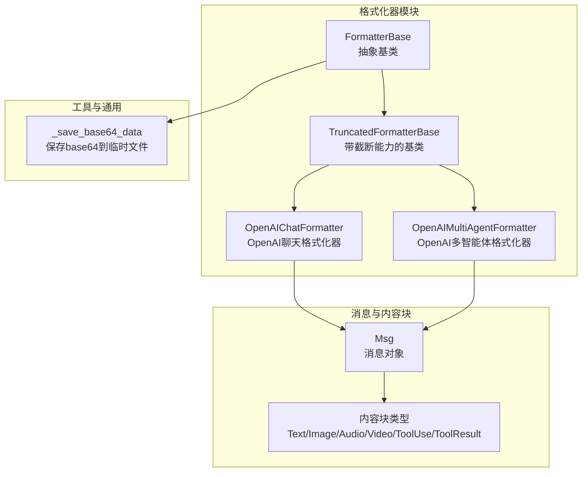
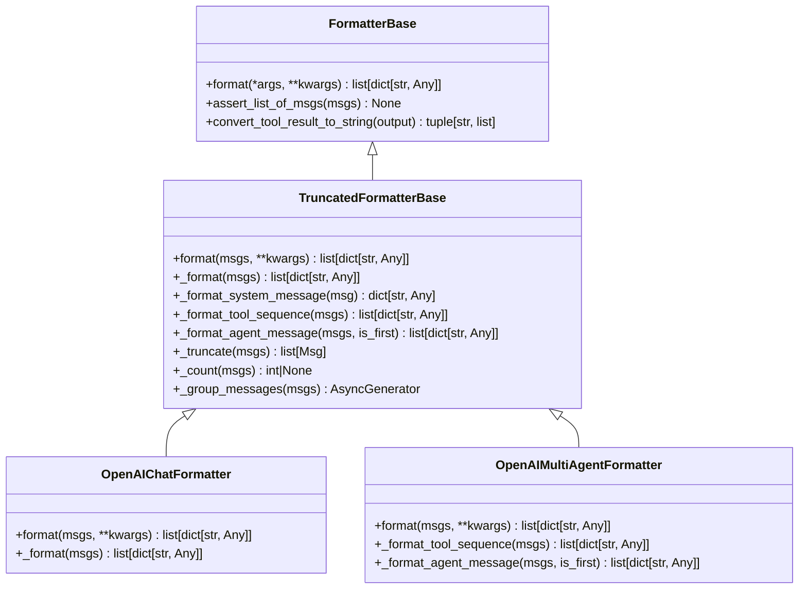
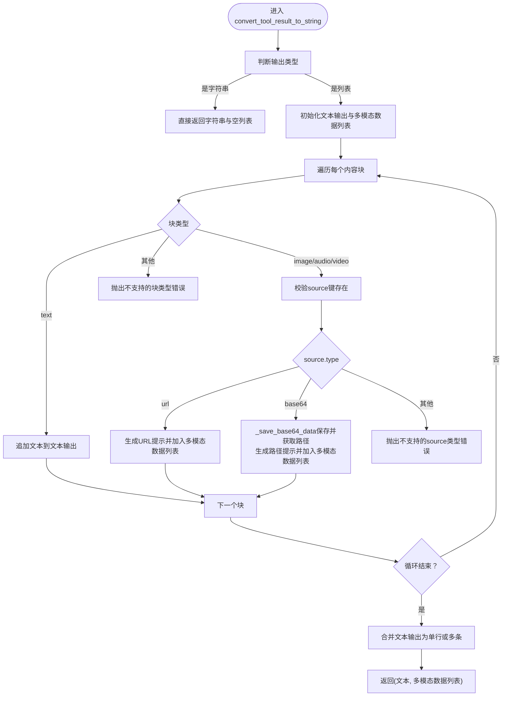
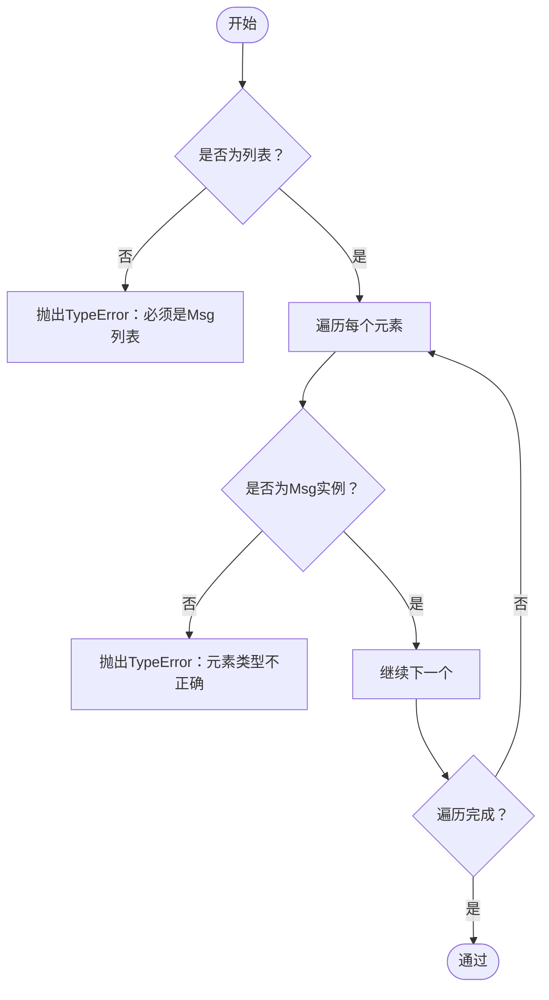
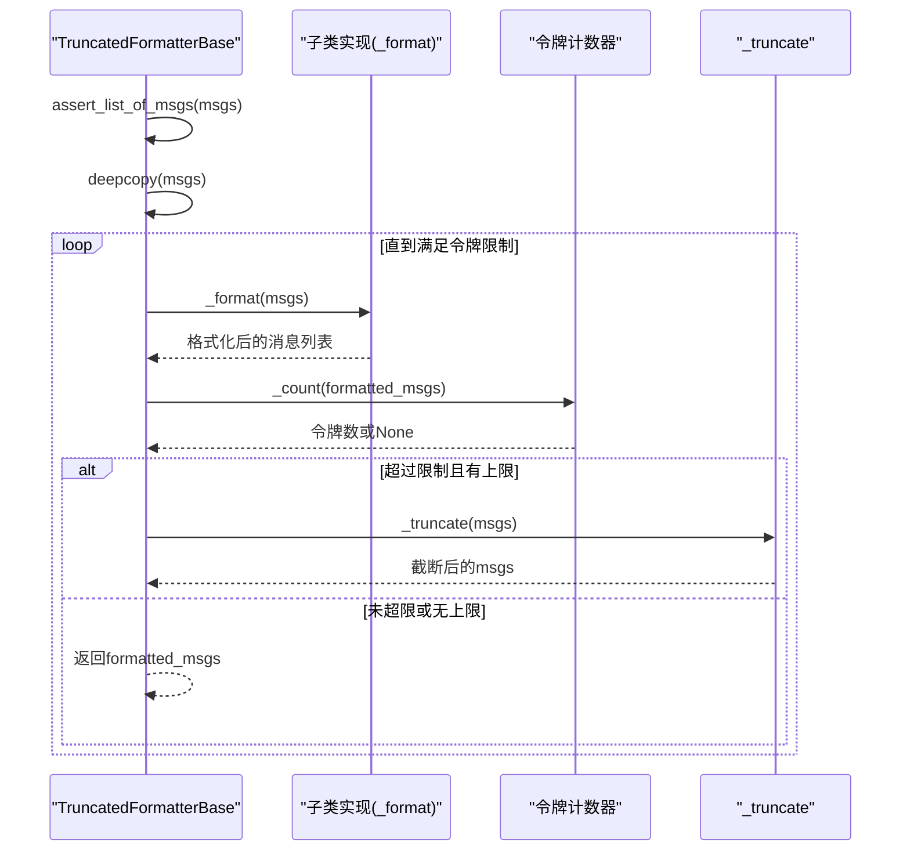
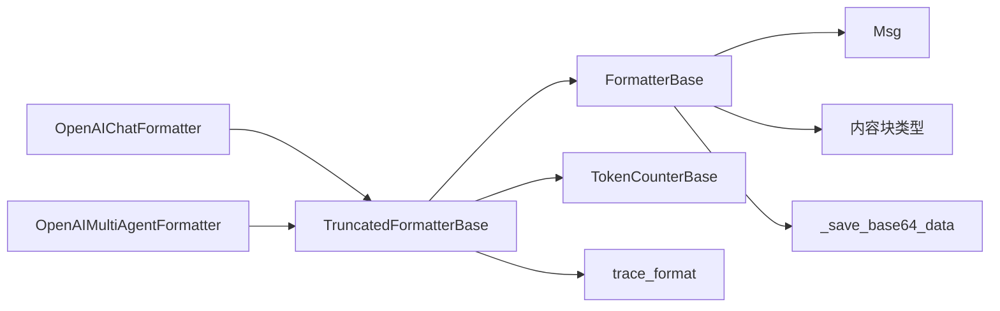

# 格式化器基类

<cite>
**本文引用的文件列表**
- [formatter/_formatter_base.py](file://src/agentscope/formatter/_formatter_base.py)
- [formatter/_truncated_formatter_base.py](file://src/agentscope/formatter/_truncated_formatter_base.py)
- [formatter/_openai_formatter.py](file://src/agentscope/formatter/_openai_formatter.py)
- [formatter/__init__.py](file://src/agentscope/formatter/__init__.py)
- [message/_message_base.py](file://src/agentscope/message/_message_base.py)
- [message/_message_block.py](file://src/agentscope/message/_message_block.py)
- [_utils/_common.py](file://src/agentscope/_utils/_common.py)
- [tests/formatter_openai_test.py](file://tests/formatter_openai_test.py)
</cite>

## 目录
1. [简介](#简介)
2. [项目结构](#项目结构)
3. [核心组件](#核心组件)
4. [架构总览](#架构总览)
5. [详细组件分析](#详细组件分析)
6. [依赖关系分析](#依赖关系分析)
7. [性能考量](#性能考量)
8. [故障排查指南](#故障排查指南)
9. [结论](#结论)
10. [附录：API 参考与扩展指南](#附录api-参考与扩展指南)

## 简介
本文件面向 AgentScope 的格式化器基类，系统性梳理 FormatterBase 抽象基类的设计与实现，重点覆盖：
- format 方法的抽象定义与调用流程
- 消息验证机制 assert_list_of_msgs 的实现与错误处理
- 工具结果转换 convert_tool_result_to_string 的多模态处理、文本转换与文件保存机制
- 继承指南（抽象方法实现、参数规范、返回值格式）
- 使用示例、错误处理策略与性能优化建议
- 完整 API 参考与扩展开发指南

## 项目结构
围绕格式化器模块的关键文件组织如下：
- 基类与扩展基类：formatter/_formatter_base.py、formatter/_truncated_formatter_base.py
- 具体格式化器：formatter/_openai_formatter.py 等
- 消息模型与内容块：message/_message_base.py、message/_message_block.py
- 工具函数：_utils/_common.py（含 _save_base64_data）
- 导出入口：formatter/__init__.py
- 测试样例：tests/formatter_openai_test.py

图表来源
- [formatter/_formatter_base.py:11-130](file://src/agentscope/formatter/_formatter_base.py#L11-L130)
- [formatter/_truncated_formatter_base.py:19-298](file://src/agentscope/formatter/_truncated_formatter_base.py#L19-L298)
- [formatter/_openai_formatter.py:168-541](file://src/agentscope/formatter/_openai_formatter.py#L168-L541)
- [message/_message_base.py:21-242](file://src/agentscope/message/_message_base.py#L21-L242)
- [message/_message_block.py:9-129](file://src/agentscope/message/_message_block.py#L9-L129)
- [_utils/_common.py:192-214](file://src/agentscope/_utils/_common.py#L192-L214)

章节来源
- [formatter/__init__.py:1-49](file://src/agentscope/formatter/__init__.py#L1-L49)

## 核心组件
- FormatterBase：定义统一的格式化接口与通用工具方法（消息验证、工具结果转字符串）。
- TruncatedFormatterBase：在 FormatterBase 基础上增加令牌计数与消息截断能力，支持多轮对话与工具调用序列的分组格式化。
- OpenAIChatFormatter/OpenAIMultiAgentFormatter：基于 TruncatedFormatterBase 实现 OpenAI API 所需的消息格式，兼容多模态与工具调用。

章节来源
- [formatter/_formatter_base.py:11-130](file://src/agentscope/formatter/_formatter_base.py#L11-L130)
- [formatter/_truncated_formatter_base.py:19-298](file://src/agentscope/formatter/_truncated_formatter_base.py#L19-L298)
- [formatter/_openai_formatter.py:168-541](file://src/agentscope/formatter/_openai_formatter.py#L168-L541)

## 架构总览
FormatterBase 作为抽象基类，约束子类必须实现异步 format 方法；同时提供 assert_list_of_msgs 与 convert_tool_result_to_string 两个通用工具方法，供具体格式化器复用。

图表来源
- [formatter/_formatter_base.py:11-130](file://src/agentscope/formatter/_formatter_base.py#L11-L130)
- [formatter/_truncated_formatter_base.py:19-298](file://src/agentscope/formatter/_truncated_formatter_base.py#L19-L298)
- [formatter/_openai_formatter.py:168-541](file://src/agentscope/formatter/_openai_formatter.py#L168-L541)

## 详细组件分析

### FormatterBase 抽象基类
- 抽象方法 format：要求子类实现异步格式化，输入为可变参数，输出为满足目标模型 API 的字典列表。
- assert_list_of_msgs：对输入进行严格校验，确保是 Msg 对象列表，提升健壮性。
- convert_tool_result_to_string：将工具结果（文本或多模态块）转换为纯文本描述，并记录多模态数据的本地路径或 URL，便于后续处理。

图表来源
- [formatter/_formatter_base.py:37-130](file://src/agentscope/formatter/_formatter_base.py#L37-L130)
- [_utils/_common.py:192-214](file://src/agentscope/_utils/_common.py#L192-L214)

章节来源
- [formatter/_formatter_base.py:11-130](file://src/agentscope/formatter/_formatter_base.py#L11-L130)

### 消息验证机制 assert_list_of_msgs
- 输入必须为 list 类型
- 列表中每个元素必须为 Msg 实例
- 否则抛出 TypeError 或 ValueError，明确指出期望类型与实际类型

图表来源
- [formatter/_formatter_base.py:19-35](file://src/agentscope/formatter/_formatter_base.py#L19-L35)

章节来源
- [formatter/_formatter_base.py:19-35](file://src/agentscope/formatter/_formatter_base.py#L19-L35)

### 工具结果转换 convert_tool_result_to_string
- 支持的输出类型：字符串或内容块列表（TextBlock、ImageBlock、AudioBlock、VideoBlock）
- 文本块：直接拼接为最终文本
- 多模态块：
  - URL：生成“可在某处找到”的提示，并将 URL 记录到多模态数据列表
  - Base64：调用 _save_base64_data 写入临时文件，返回文件路径，生成“可在某路径找到”的提示
- 返回值：(文本字符串, 多模态数据列表)，其中列表元素为 (路径或URL, 原始块)

章节来源
- [formatter/_formatter_base.py:37-130](file://src/agentscope/formatter/_formatter_base.py#L37-L130)
- [_utils/_common.py:192-214](file://src/agentscope/_utils/_common.py#L192-L214)

### TruncatedFormatterBase 截断与分组
- 在 format 中先执行 assert_list_of_msgs，再深拷贝消息，循环格式化并统计令牌数，若超过阈值则调用 _truncate 截断
- 提供 _group_messages 异步分组器，将连续的工具调用/结果与普通消息序列区分开，分别格式化
- 支持系统消息、工具序列、代理消息三类格式化策略

图表来源
- [formatter/_truncated_formatter_base.py:47-84](file://src/agentscope/formatter/_truncated_formatter_base.py#L47-L84)
- [formatter/_truncated_formatter_base.py:85-113](file://src/agentscope/formatter/_truncated_formatter_base.py#L85-L113)
- [formatter/_truncated_formatter_base.py:151-215](file://src/agentscope/formatter/_truncated_formatter_base.py#L151-L215)

章节来源
- [formatter/_truncated_formatter_base.py:19-298](file://src/agentscope/formatter/_truncated_formatter_base.py#L19-L298)

### OpenAIChatFormatter 与 OpenAIMultiAgentFormatter
- OpenAIChatFormatter：将 Msg 列表转换为 OpenAI API 所需的格式，支持文本、图像、音频、工具调用与工具结果；当工具结果包含多模态时，调用 convert_tool_result_to_string 进行文本化，并可选择将图片提升为用户消息插入
- OpenAIMultiAgentFormatter：在多智能体场景下，将连续的非工具消息聚合为用户消息，保留对话历史结构；同样支持工具序列格式化

章节来源
- [formatter/_openai_formatter.py:168-541](file://src/agentscope/formatter/_openai_formatter.py#L168-L541)

## 依赖关系分析
- FormatterBase 依赖消息模型 Msg 与内容块类型（TextBlock、ImageBlock、AudioBlock、VideoBlock、ToolUseBlock、ToolResultBlock）
- convert_tool_result_to_string 依赖 _save_base64_data 将 base64 数据写入临时文件
- TruncatedFormatterBase 依赖 TokenCounterBase 进行令牌计数，并通过装饰器 trace_format 进行追踪埋点

图表来源
- [formatter/_formatter_base.py:7-8](file://src/agentscope/formatter/_formatter_base.py#L7-L8)
- [_utils/_common.py:192-214](file://src/agentscope/_utils/_common.py#L192-L214)
- [formatter/_truncated_formatter_base.py:13-16](file://src/agentscope/formatter/_truncated_formatter_base.py#L13-L16)
- [formatter/_openai_formatter.py:12-24](file://src/agentscope/formatter/_openai_formatter.py#L12-L24)

章节来源
- [formatter/_formatter_base.py:7-8](file://src/agentscope/formatter/_formatter_base.py#L7-L8)
- [_utils/_common.py:192-214](file://src/agentscope/_utils/_common.py#L192-L214)
- [formatter/_truncated_formatter_base.py:13-16](file://src/agentscope/formatter/_truncated_formatter_base.py#L13-L16)
- [formatter/_openai_formatter.py:12-24](file://src/agentscope/formatter/_openai_formatter.py#L12-L24)

## 性能考量
- 令牌计数与截断：TruncatedFormatterBase 在每次格式化后进行令牌计数，若超出阈值则截断。建议合理设置 max_tokens 并选择高效的 TokenCounterBase 实现。
- 多模态数据处理：convert_tool_result_to_string 对 base64 数据会写入临时文件，频繁调用可能产生大量临时文件。建议在批量处理时复用资源或清理临时文件。
- 分组格式化：_group_messages 使用异步生成器，避免一次性构建大列表，有助于降低内存峰值。
- OpenAI 图像/音频转换：本地文件读取与 base64 编码会带来 I/O 与 CPU 开销，建议在工具链上游尽量减少不必要的多模态数据传递。

[本节为通用指导，无需特定文件来源]

## 故障排查指南
- 输入类型错误
  - 现象：assert_list_of_msgs 抛出 TypeError
  - 排查：确认传入的是 Msg 列表，且每个元素均为 Msg 实例
- 不支持的块类型
  - 现象：convert_tool_result_to_string 抛出 ValueError
  - 排查：检查内容块的 type 字段是否为 text、image、audio、video 之一
- 不支持的 source 类型
  - 现象：convert_tool_result_to_string 抛出 ValueError
  - 排查：确认 source.type 为 url 或 base64
- 令牌超限
  - 现象：TruncatedFormatterBase 在 _truncate 中抛出 ValueError
  - 排查：检查是否存在仅有工具调用而无对应工具结果的情况，或系统提示过长
- OpenAI 图像/音频转换失败
  - 现象：OpenAIChatFormatter 抛出异常
  - 排查：确认图像 URL 为本地文件或公网 URL，音频扩展名符合 wav/mp3 要求

章节来源
- [formatter/_formatter_base.py:19-35](file://src/agentscope/formatter/_formatter_base.py#L19-L35)
- [formatter/_formatter_base.py:77-123](file://src/agentscope/formatter/_formatter_base.py#L77-L123)
- [formatter/_truncated_formatter_base.py:180-215](file://src/agentscope/formatter/_truncated_formatter_base.py#L180-L215)
- [formatter/_openai_formatter.py:44-113](file://src/agentscope/formatter/_openai_formatter.py#L44-L113)
- [formatter/_openai_formatter.py:116-165](file://src/agentscope/formatter/_openai_formatter.py#L116-L165)

## 结论
FormatterBase 通过抽象与通用工具方法，为多模型、多场景的格式化提供了清晰的扩展点。结合 TruncatedFormatterBase 的令牌控制与分组策略，以及具体格式化器对多模态与工具调用的适配，形成了从消息到 API 请求体的完整转换链路。遵循本文档的继承指南与最佳实践，可快速实现新的格式化器并保持一致的健壮性与性能表现。

[本节为总结性内容，无需特定文件来源]

## 附录：API 参考与扩展指南

### API 参考
- FormatterBase
  - format(*args, **kwargs) -> list[dict[str, Any]]
    - 抽象方法，子类必须实现
  - assert_list_of_msgs(msgs: list[Msg]) -> None
    - 校验输入为 Msg 列表，否则抛错
  - convert_tool_result_to_string(output: str | List[TextBlock | ImageBlock | AudioBlock | VideoBlock]) -> tuple[str, Sequence[Tuple[str, Block]]]
    - 将工具结果转为文本与多模态数据列表

- TruncatedFormatterBase
  - format(msgs: list[Msg], **kwargs) -> list[dict[str, Any]]
    - 主流程：校验 -> 深拷贝 -> 循环格式化+计数 -> 截断 -> 返回
  - _format(msgs: list[Msg]) -> list[dict[str, Any]]
    - 子类需实现的核心格式化逻辑
  - _truncate(msgs: list[Msg]) -> list[Msg]
    - 截断策略，默认保证工具调用与结果成对
  - _count(msgs: list[dict[str, Any]]) -> int | None
    - 令牌计数，无计数器时返回 None
  - _group_messages(msgs: list[Msg]) -> AsyncGenerator[Tuple[str, list[Msg]], None]
    - 异步分组：tool_sequence 与 agent_message

- OpenAIChatFormatter
  - 支持工具 API、多智能体、视觉模型
  - 支持将工具结果中的图片提升为用户消息（可配置）

- OpenAIMultiAgentFormatter
  - 多智能体对话历史聚合为用户消息，保留历史标签

章节来源
- [formatter/_formatter_base.py:14-130](file://src/agentscope/formatter/_formatter_base.py#L14-L130)
- [formatter/_truncated_formatter_base.py:47-298](file://src/agentscope/formatter/_truncated_formatter_base.py#L47-L298)
- [formatter/_openai_formatter.py:168-541](file://src/agentscope/formatter/_openai_formatter.py#L168-L541)

### 继承指南
- 必须实现的抽象方法
  - TruncatedFormatterBase：_format(msgs)
  - 若需要工具序列/代理消息差异化格式化，可重写 _format_tool_sequence 与 _format_agent_message
- 参数规范
  - format 接收 msgs（Msg 列表），其余关键字参数按需传递
  - 子类内部应先调用父类 assert_list_of_msgs 进行输入校验
- 返回值格式
  - format 返回 list[dict[str, Any]]，字段与目标模型 API 对齐
  - convert_tool_result_to_string 返回 (文本, 多模态数据列表)
- 多模态处理
  - 遵循 convert_tool_result_to_string 的规则：URL 保留 URL，base64 保存到临时文件并返回路径
- 错误处理
  - 明确区分输入类型错误与内容块类型错误，提供清晰的异常信息
  - 截断阶段注意工具调用与结果的成对完整性

章节来源
- [formatter/_truncated_formatter_base.py:85-113](file://src/agentscope/formatter/_truncated_formatter_base.py#L85-L113)
- [formatter/_formatter_base.py:37-130](file://src/agentscope/formatter/_formatter_base.py#L37-L130)

### 使用示例（路径指引）
- OpenAI 聊天格式化器
  - 示例构造与调用：参见测试文件中的构造与 format 调用
  - 工具结果图片提升：参见测试文件中 promote_tool_result_images=True 的用法
- OpenAI 多智能体格式化器
  - 示例构造与调用：参见测试文件中的构造与 format 调用
  - 对话历史聚合：参见测试文件中 conversation_history_prompt 的使用

章节来源
- [tests/formatter_openai_test.py:391-779](file://tests/formatter_openai_test.py#L391-L779)

### 扩展开发指南
- 新建格式化器步骤
  - 继承 TruncatedFormatterBase 或 FormatterBase
  - 实现 _format(msgs) 或 format(msgs)
  - 如需工具序列/代理消息差异化，实现 _format_tool_sequence 与 _format_agent_message
  - 在 __init__ 中根据需要注入 TokenCounterBase 与 max_tokens
- 多模态与工具调用
  - 使用 convert_tool_result_to_string 统一处理工具结果
  - 对于不支持多模态的模型，优先将多模态数据转换为文本描述
- 性能优化
  - 合理设置 max_tokens，避免频繁截断
  - 复用临时文件句柄，减少磁盘 I/O
  - 使用异步生成器分组消息，降低内存占用
- 测试建议
  - 覆盖输入类型错误、块类型错误、source 类型错误等边界条件
  - 验证工具结果文本化与多模态数据路径记录
  - 验证多智能体场景下的历史聚合与工具序列格式化

[本节为通用指导，无需特定文件来源]