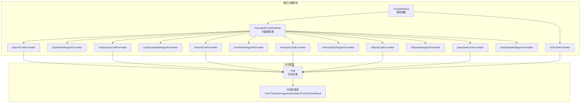
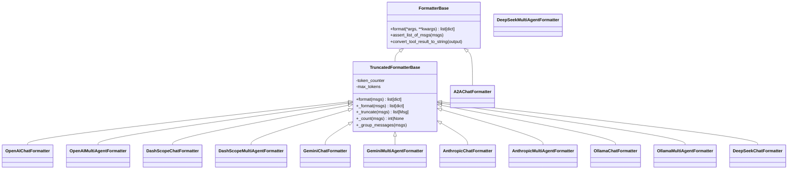
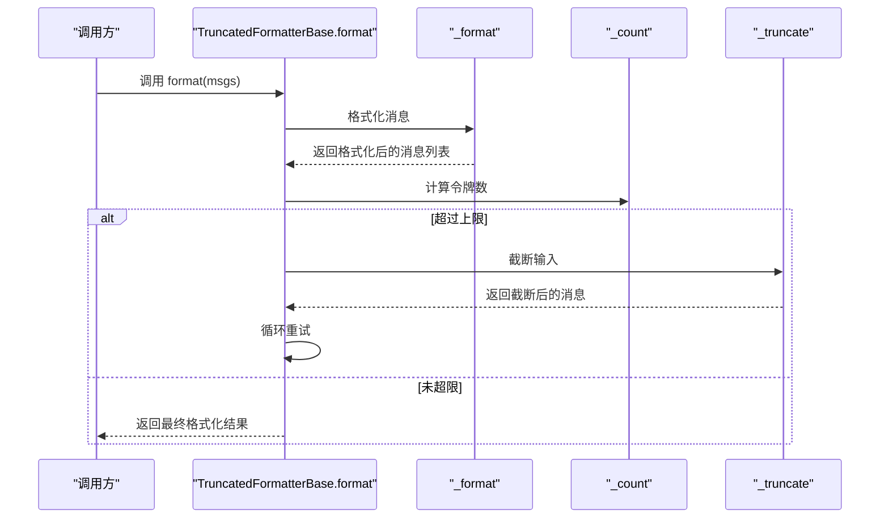
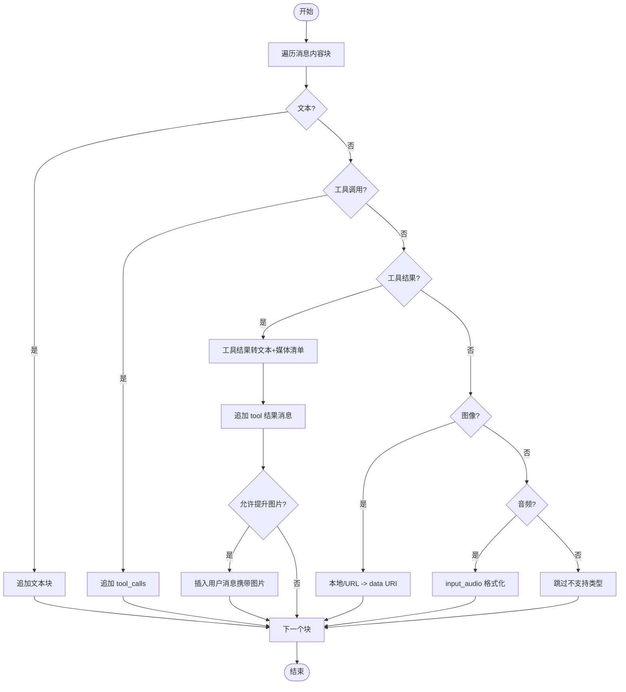
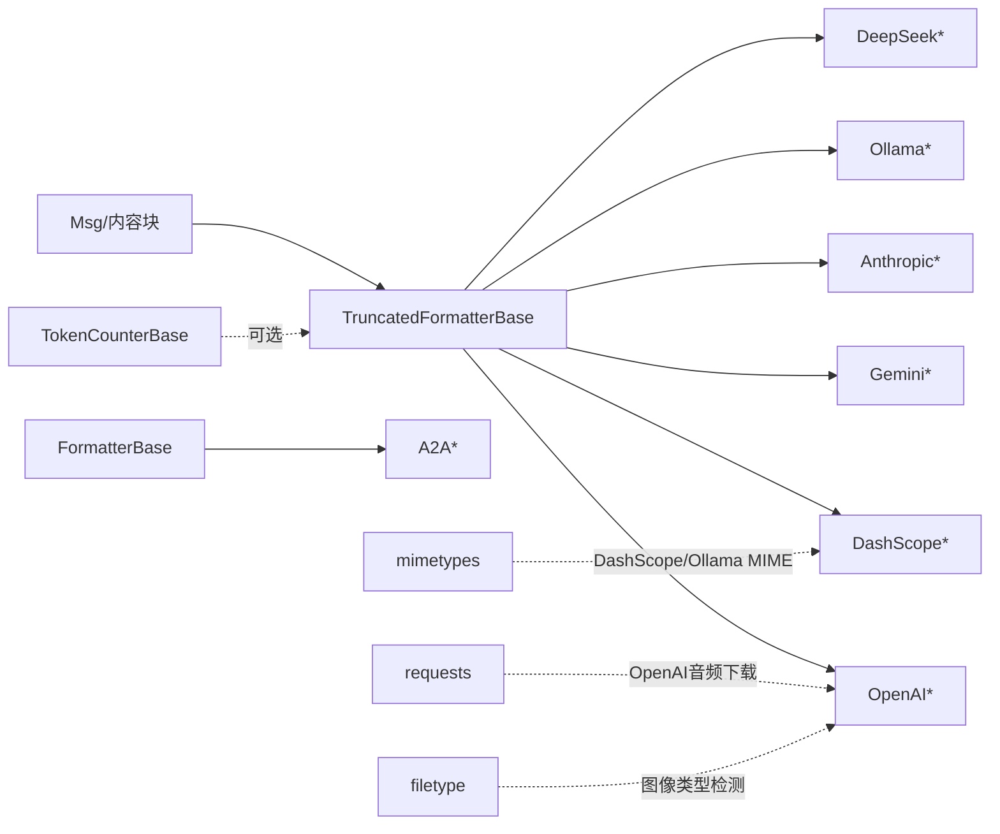

# 格式化器系统

<cite>
**本文引用的文件**
- [formatter/__init__.py](file://src/agentscope/formatter/__init__.py)
- [formatter/_formatter_base.py](file://src/agentscope/formatter/_formatter_base.py)
- [formatter/_truncated_formatter_base.py](file://src/agentscope/formatter/_truncated_formatter_base.py)
- [formatter/_openai_formatter.py](file://src/agentscope/formatter/_openai_formatter.py)
- [formatter/_dashscope_formatter.py](file://src/agentscope/formatter/_dashscope_formatter.py)
- [formatter/_gemini_formatter.py](file://src/agentscope/formatter/_gemini_formatter.py)
- [formatter/_anthropic_formatter.py](file://src/agentscope/formatter/_anthropic_formatter.py)
- [formatter/_ollama_formatter.py](file://src/agentscope/formatter/_ollama_formatter.py)
- [formatter/_deepseek_formatter.py](file://src/agentscope/formatter/_deepseek_formatter.py)
- [formatter/_a2a_formatter.py](file://src/agentscope/formatter/_a2a_formatter.py)
- [message/_message_base.py](file://src/agentscope/message/_message_base.py)
- [message/_message_block.py](file://src/agentscope/message/_message_block.py)
- [formatter_openai_test.py](file://tests/formatter_openai_test.py)
- [formatter_dashscope_test.py](file://tests/formatter_dashscope_test.py)
</cite>

## 目录
1. [简介](#简介)
2. [项目结构](#项目结构)
3. [核心组件](#核心组件)
4. [架构总览](#架构总览)
5. [详细组件分析](#详细组件分析)
6. [依赖关系分析](#依赖关系分析)
7. [性能考虑](#性能考虑)
8. [故障排查指南](#故障排查指南)
9. [结论](#结论)
10. [附录：API 参考与最佳实践](#附录api-参考与最佳实践)

## 简介
本技术文档面向 AgentScope 的“格式化器系统”，系统性阐述格式化器基类设计、消息格式转换、模板处理与参数绑定；深入解析各平台格式化器（OpenAI、DashScope、Gemini、Anthropic、Ollama、DeepSeek、A2A）的实现差异与特性；详解提示词截断机制（长度计算、智能截断、上下文保留策略）；说明多模态格式化的工作原理（内容块转换、媒体格式处理、布局优化）；并提供配置选项、使用示例、格式化规则与最佳实践，以及调试工具与常见问题排查。

## 项目结构
格式化器模块位于 src/agentscope/formatter，采用“按平台分文件”的组织方式，统一通过 __init__.py 暴露公共接口。消息模型位于 src/agentscope/message，定义了通用的消息与内容块类型，格式化器围绕这些类型进行转换。

图表来源
- [formatter/__init__.py:1-49](file://src/agentscope/formatter/__init__.py#L1-L49)
- [formatter/_formatter_base.py:11-130](file://src/agentscope/formatter/_formatter_base.py#L11-L130)
- [formatter/_truncated_formatter_base.py:19-298](file://src/agentscope/formatter/_truncated_formatter_base.py#L19-L298)
- [formatter/_openai_formatter.py:168-541](file://src/agentscope/formatter/_openai_formatter.py#L168-L541)
- [formatter/_dashscope_formatter.py:159-634](file://src/agentscope/formatter/_dashscope_formatter.py#L159-L634)
- [formatter/_gemini_formatter.py:108-509](file://src/agentscope/formatter/_gemini_formatter.py#L108-L509)
- [formatter/_anthropic_formatter.py:98-355](file://src/agentscope/formatter/_anthropic_formatter.py#L98-L355)
- [formatter/_ollama_formatter.py:73-444](file://src/agentscope/formatter/_ollama_formatter.py#L73-L444)
- [formatter/_deepseek_formatter.py:13-266](file://src/agentscope/formatter/_deepseek_formatter.py#L13-L266)
- [formatter/_a2a_formatter.py:31-365](file://src/agentscope/formatter/_a2a_formatter.py#L31-L365)
- [message/_message_base.py:21-242](file://src/agentscope/message/_message_base.py#L21-L242)
- [message/_message_block.py:9-129](file://src/agentscope/message/_message_block.py#L9-L129)

章节来源
- [formatter/__init__.py:1-49](file://src/agentscope/formatter/__init__.py#L1-L49)

## 核心组件
- 基类与职责
  - FormatterBase：定义统一的异步 format 接口，提供 Msg 列表校验与工具结果到文本的转换辅助方法。
  - TruncatedFormatterBase：在 FormatterBase 基础上增加令牌计数与截断逻辑，支持按最大令牌数自动收缩输入，同时维护工具调用/结果的成对完整性。
- 消息与内容块
  - Msg：统一承载 name、role、content（字符串或内容块列表）、metadata、时间戳等信息。
  - 内容块：TextBlock、ThinkingBlock、ImageBlock、AudioBlock、VideoBlock、ToolUseBlock、ToolResultBlock，覆盖多模态与工具交互场景。

章节来源
- [formatter/_formatter_base.py:11-130](file://src/agentscope/formatter/_formatter_base.py#L11-L130)
- [formatter/_truncated_formatter_base.py:19-298](file://src/agentscope/formatter/_truncated_formatter_base.py#L19-L298)
- [message/_message_base.py:21-242](file://src/agentscope/message/_message_base.py#L21-L242)
- [message/_message_block.py:9-129](file://src/agentscope/message/_message_block.py#L9-L129)

## 架构总览
格式化器遵循“基类 + 平台适配”的分层设计：
- 基类层：FormatterBase 提供统一接口与工具函数；TruncatedFormatterBase 扩展截断能力。
- 平台层：各平台格式化器继承对应基类，实现特定 API 的消息结构映射与多模态/工具调用转换。
- 消息层：Msg 与内容块作为输入，格式化器将其转换为平台期望的字典/对象结构。

图表来源
- [formatter/_formatter_base.py:11-130](file://src/agentscope/formatter/_formatter_base.py#L11-L130)
- [formatter/_truncated_formatter_base.py:19-298](file://src/agentscope/formatter/_truncated_formatter_base.py#L19-L298)
- [formatter/_openai_formatter.py:168-541](file://src/agentscope/formatter/_openai_formatter.py#L168-L541)
- [formatter/_dashscope_formatter.py:159-634](file://src/agentscope/formatter/_dashscope_formatter.py#L159-L634)
- [formatter/_gemini_formatter.py:108-509](file://src/agentscope/formatter/_gemini_formatter.py#L108-L509)
- [formatter/_anthropic_formatter.py:98-355](file://src/agentscope/formatter/_anthropic_formatter.py#L98-L355)
- [formatter/_ollama_formatter.py:73-444](file://src/agentscope/formatter/_ollama_formatter.py#L73-L444)
- [formatter/_deepseek_formatter.py:13-266](file://src/agentscope/formatter/_deepseek_formatter.py#L13-L266)
- [formatter/_a2a_formatter.py:31-365](file://src/agentscope/formatter/_a2a_formatter.py#L31-L365)

## 详细组件分析

### 基类与截断机制
- FormatterBase
  - format：抽象方法，子类需实现具体格式化逻辑。
  - assert_list_of_msgs：确保输入为 Msg 对象列表。
  - convert_tool_result_to_string：将工具结果（文本/多模态）转为纯文本描述，并返回本地路径或URL清单，便于后续媒体提升。
- TruncatedFormatterBase
  - format：主流程，先格式化，再计数，若超过阈值则截断，循环直到满足条件。
  - _format：按“系统消息优先 + 工具序列/代理消息分组”顺序格式化。
  - _truncate：基于工具调用ID队列，保证工具调用与结果成对删除，避免不完整片段。
  - _count：委托 TokenCounterBase 计算令牌数。
  - _group_messages：将连续的工具调用/结果与普通消息分组，用于多代理场景。

图表来源
- [formatter/_truncated_formatter_base.py:47-217](file://src/agentscope/formatter/_truncated_formatter_base.py#L47-L217)

章节来源
- [formatter/_formatter_base.py:11-130](file://src/agentscope/formatter/_formatter_base.py#L11-L130)
- [formatter/_truncated_formatter_base.py:19-298](file://src/agentscope/formatter/_truncated_formatter_base.py#L19-L298)

### OpenAI 格式化器
- 支持能力
  - 工具API：支持 tool_use/tool_result。
  - 多模态：文本、图像（含本地/URL转data:URI）、音频（input_audio）。
  - 多代理：通过分组与历史拼接实现。
- 关键点
  - 图像：本地文件自动检测扩展或 MIME，转为 data URI；URL 直传。
  - 音频：仅在非助手角色时保留 input_audio，避免后续调用报错。
  - 工具结果图片提升：可通过 promote_tool_result_images 将图片提取为用户消息，增强视觉反馈。
  - 多代理：将对话历史拼入 user 内容，首条消息可注入系统提示。

图表来源
- [formatter/_openai_formatter.py:219-371](file://src/agentscope/formatter/_openai_formatter.py#L219-L371)

章节来源
- [formatter/_openai_formatter.py:168-541](file://src/agentscope/formatter/_openai_formatter.py#L168-L541)
- [formatter_openai_test.py:1-779](file://tests/formatter_openai_test.py#L1-L779)

### DashScope 格式化器
- 支持能力
  - 工具API：支持 function 类型工具调用/结果。
  - 多模态：图像、音频、视频，均以 data URI 或 URL 表示。
  - 多代理：将历史拼入 user 的 content 列表，首条消息可带系统提示。
- 关键点
  - 工具结果媒体提升：支持图片、音频、视频三类提升，分别由三个开关控制。
  - 兼容性处理：当 content 为空时，DashScope 需要空数组而非 None，格式化器会统一修正。
  - 多代理历史：使用 <history>...</history> 包裹历史文本，保持结构清晰。

章节来源
- [formatter/_dashscope_formatter.py:159-634](file://src/agentscope/formatter/_dashscope_formatter.py#L159-L634)
- [formatter_dashscope_test.py:1-915](file://tests/formatter_dashscope_test.py#L1-L915)

### Gemini 格式化器
- 支持能力
  - 工具API：function_call/function_response 形式。
  - 多模态：图像、音频、视频 inline_data。
  - 多代理：历史拼接至 parts 中，首条消息可带系统提示。
- 关键点
  - 媒体格式：支持多种扩展名与 MIME 类型，本地文件与远程 URL 均可处理。
  - 工具结果图片提升：可选将图片提升为用户消息，便于视觉反馈。
  - 角色映射：assistant 映射为 model，user 保持 user。

章节来源
- [formatter/_gemini_formatter.py:108-509](file://src/agentscope/formatter/_gemini_formatter.py#L108-L509)

### Anthropic 格式化器
- 支持能力
  - 多模态：图像（base64/url）。
  - 工具API：tool_use/tool_result。
  - 多代理：历史拼接为文本块与图像块交替出现。
- 关键点
  - 思维块：支持 thinking 类型，建议在后续调用中带回以保持推理连贯。
  - 系统消息限制：除第一条外，其余系统消息会被降级为 user。

章节来源
- [formatter/_anthropic_formatter.py:98-355](file://src/agentscope/formatter/_anthropic_formatter.py#L98-L355)

### Ollama 格式化器
- 支持能力
  - 多模态：图像（base64 字符串）。
  - 工具API：function 类型工具调用/结果。
  - 多代理：历史拼接为文本与图像列表。
- 关键点
  - 图像格式：仅支持 base64 字符串，本地文件或 URL 将被转换为 base64。
  - 工具结果图片提升：可选将图片提升为用户消息。

章节来源
- [formatter/_ollama_formatter.py:73-444](file://src/agentscope/formatter/_ollama_formatter.py#L73-L444)

### DeepSeek 格式化器
- 支持能力
  - 工具API：function 类型工具调用/结果。
  - 多模态：不支持。
  - 多代理：历史拼接为文本。
- 关键点
  - 思维内容：支持 thinking 字段，独立拼接到 reasoning_content。

章节来源
- [formatter/_deepseek_formatter.py:13-266](file://src/agentscope/formatter/_deepseek_formatter.py#L13-L266)

### A2A 格式化器
- 支持能力
  - 将 AgentScope 消息转换为 A2A 协议消息对象，合并多消息为单请求消息。
  - 支持文本、思考、图像/视频/音频（URL/base64）、工具调用/结果的数据块。
- 关键点
  - 类型推断：根据 URI/MIME 自动判断媒体类型。
  - 双向转换：提供从 A2A 消息/任务回转为 AgentScope Msg 的能力。

章节来源
- [formatter/_a2a_formatter.py:31-365](file://src/agentscope/formatter/_a2a_formatter.py#L31-L365)

## 依赖关系分析
- 组件耦合
  - 各平台格式化器均依赖 TruncatedFormatterBase（或 FormatterBase）以复用格式化与截断逻辑。
  - 依赖消息模型（Msg 与内容块），确保输入结构一致。
  - 依赖 TokenCounterBase 进行令牌计数（可选）。
- 外部依赖
  - OpenAI/DashScope/Gemini/Ollama 等平台 API 的字段约定与媒体格式要求。
  - 文件类型识别（filetype）、HTTP 请求（requests）、MIME 推断（mimetypes）等工具库。

图表来源
- [formatter/_truncated_formatter_base.py:13-16](file://src/agentscope/formatter/_truncated_formatter_base.py#L13-L16)
- [formatter/_openai_formatter.py:10-24](file://src/agentscope/formatter/_openai_formatter.py#L10-L24)
- [formatter/_dashscope_formatter.py:7-24](file://src/agentscope/formatter/_dashscope_formatter.py#L7-L24)
- [formatter/_gemini_formatter.py:10-22](file://src/agentscope/formatter/_gemini_formatter.py#L10-L22)
- [formatter/_ollama_formatter.py:4-20](file://src/agentscope/formatter/_ollama_formatter.py#L4-L20)
- [formatter/_a2a_formatter.py:3-28](file://src/agentscope/formatter/_a2a_formatter.py#L3-L28)

## 性能考虑
- 令牌计数
  - 使用 TokenCounterBase 进行精确计数，避免超出平台限制导致的错误。
  - 在高并发场景下，建议缓存计数结果或使用高效的计数器实现。
- 截断策略
  - 默认策略按“工具调用/结果成对删除”进行，保证语义完整性。
  - 对于长历史，优先丢弃最旧的历史片段，保留最近的交互上下文。
- 多模态处理
  - 尽量使用 URL 或 data URI，减少本地文件 IO。
  - 对于大体积媒体，优先使用远程 URL，避免 base64 编码带来的体积膨胀。
- 异步与流式
  - 格式化器均为异步实现，适合在异步框架中并行处理多个请求。

## 故障排查指南
- 输入验证错误
  - 现象：抛出类型错误，提示输入必须为 Msg 列表。
  - 处理：检查输入是否为 list[Msg]，且每个元素为 Msg 实例。
- 工具调用/结果不匹配
  - 现象：抛出“存在工具调用但缺少对应工具结果”的错误。
  - 处理：确保工具调用与工具结果成对出现，且 ID 一致。
- 媒体格式不支持
  - 现象：OpenAI/DashScope/Gemini/Ollama 抛出不支持的源类型或扩展名。
  - 处理：确认图像/音频/视频的 source 类型与扩展名符合平台要求；必要时转换为 data URI 或远程 URL。
- 系统提示过长
  - 现象：系统提示超过令牌上限，直接报错。
  - 处理：缩短系统提示，或拆分为工具结果后的内容。
- 多代理历史拼接异常
  - 现象：DashScope/Gemini/Ollama 历史拼接后结构不符合预期。
  - 处理：检查历史标签 <history>...</history> 是否正确包裹，以及文本与媒体块的顺序。

章节来源
- [formatter/_truncated_formatter_base.py:151-216](file://src/agentscope/formatter/_truncated_formatter_base.py#L151-L216)
- [formatter/_openai_formatter.py:44-113](file://src/agentscope/formatter/_openai_formatter.py#L44-L113)
- [formatter/_dashscope_formatter.py:27-76](file://src/agentscope/formatter/_dashscope_formatter.py#L27-L76)
- [formatter/_gemini_formatter.py:25-105](file://src/agentscope/formatter/_gemini_formatter.py#L25-L105)
- [formatter/_ollama_formatter.py:23-70](file://src/agentscope/formatter/_ollama_formatter.py#L23-L70)

## 结论
AgentScope 格式化器系统以统一的基类与消息模型为基础，针对不同平台的 API 约定提供了高度一致的转换能力。通过可插拔的截断机制与多模态/工具 API 支持，系统既能满足复杂对话与工具编排需求，又能在长上下文场景下保持稳定与高效。建议在实际应用中结合令牌计数与截断策略，合理配置媒体与工具提升选项，以获得最佳的稳定性与用户体验。

## 附录：API 参考与最佳实践

### API 参考
- 基类
  - FormatterBase
    - format：异步格式化接口，返回平台期望的消息结构列表。
    - assert_list_of_msgs：校验输入为 Msg 列表。
    - convert_tool_result_to_string：工具结果转文本与媒体清单。
  - TruncatedFormatterBase
    - format：带截断的格式化主流程。
    - _format：平台无关的格式化实现入口。
    - _truncate：工具调用/结果成对截断。
    - _count：令牌计数。
    - _group_messages：多代理消息分组。
- OpenAI
  - OpenAIChatFormatter：单代理聊天格式化。
  - OpenAIMultiAgentFormatter：多代理聊天格式化。
- DashScope
  - DashScopeChatFormatter：单代理聊天格式化。
  - DashScopeMultiAgentFormatter：多代理聊天格式化。
- Gemini
  - GeminiChatFormatter：单代理聊天格式化。
  - GeminiMultiAgentFormatter：多代理聊天格式化。
- Anthropic
  - AnthropicChatFormatter：单代理聊天格式化。
  - AnthropicMultiAgentFormatter：多代理聊天格式化。
- Ollama
  - OllamaChatFormatter：单代理聊天格式化。
  - OllamaMultiAgentFormatter：多代理聊天格式化。
- DeepSeek
  - DeepSeekChatFormatter：单代理聊天格式化。
  - DeepSeekMultiAgentFormatter：多代理聊天格式化。
- A2A
  - A2AChatFormatter：AgentScope 消息转 A2A 消息。

章节来源
- [formatter/_formatter_base.py:11-130](file://src/agentscope/formatter/_formatter_base.py#L11-L130)
- [formatter/_truncated_formatter_base.py:19-298](file://src/agentscope/formatter/_truncated_formatter_base.py#L19-L298)
- [formatter/_openai_formatter.py:168-541](file://src/agentscope/formatter/_openai_formatter.py#L168-L541)
- [formatter/_dashscope_formatter.py:159-634](file://src/agentscope/formatter/_dashscope_formatter.py#L159-L634)
- [formatter/_gemini_formatter.py:108-509](file://src/agentscope/formatter/_gemini_formatter.py#L108-L509)
- [formatter/_anthropic_formatter.py:98-355](file://src/agentscope/formatter/_anthropic_formatter.py#L98-L355)
- [formatter/_ollama_formatter.py:73-444](file://src/agentscope/formatter/_ollama_formatter.py#L73-L444)
- [formatter/_deepseek_formatter.py:13-266](file://src/agentscope/formatter/_deepseek_formatter.py#L13-L266)
- [formatter/_a2a_formatter.py:31-365](file://src/agentscope/formatter/_a2a_formatter.py#L31-L365)

### 使用示例与最佳实践
- 示例来源
  - OpenAI 单代理与多代理格式化示例参见测试文件。
  - DashScope 单代理与多代理格式化示例参见测试文件。
- 最佳实践
  - 合理设置 max_tokens 与 token_counter，避免频繁截断。
  - 对工具结果中的图片/音频/视频，根据平台能力选择是否提升为用户消息。
  - 多代理场景下，确保工具调用与结果成对出现，避免截断失败。
  - 多模态媒体尽量使用远程 URL，减少本地文件 IO 与 base64 编码开销。
  - 对于需要保持推理连贯的场景（如 Anthropic），保留 thinking 块并在后续调用中带回。

章节来源
- [formatter_openai_test.py:1-779](file://tests/formatter_openai_test.py#L1-L779)
- [formatter_dashscope_test.py:1-915](file://tests/formatter_dashscope_test.py#L1-L915)