# Anthropic模型适配器

<cite>
**本文档引用的文件**
- [src/agentscope/model/_anthropic_model.py](file://src/agentscope/model/_anthropic_model.py)
- [src/agentscope/formatter/_anthropic_formatter.py](file://src/agentscope/formatter/_anthropic_formatter.py)
- [src/agentscope/token/_anthropic_token_counter.py](file://src/agentscope/token/_anthropic_token_counter.py)
- [src/agentscope/model/_model_base.py](file://src/agentscope/model/_model_base.py)
- [src/agentscope/message/__init__.py](file://src/agentscope/message/__init__.py)
- [src/agentscope/_utils/_common.py](file://src/agentscope/_utils/_common.py)
- [tests/model_anthropic_test.py](file://tests/model_anthropic_test.py)
- [src/agentscope/model/__init__.py](file://src/agentscope/model/__init__.py)
</cite>

## 目录
1. [简介](#简介)
2. [项目结构](#项目结构)
3. [核心组件](#核心组件)
4. [架构概览](#架构概览)
5. [详细组件分析](#详细组件分析)
6. [依赖关系分析](#依赖关系分析)
7. [性能考虑](#性能考虑)
8. [故障排除指南](#故障排除指南)
9. [结论](#结论)
10. [附录](#附录)

## 简介

AgentScope的Anthropic模型适配器为Claude系列AI模型提供了完整的集成支持，包括Claude-3、Claude-3.5等最新版本。该适配器充分利用了Anthropic模型的独特优势，包括更长的上下文窗口、更强的推理能力和更好的代码生成能力。

本适配器实现了以下关键特性：
- **多模态支持**：支持文本、图像等多种消息类型
- **工具调用**：原生支持函数调用和工具集成
- **思维过程**：支持Claude的内部思考机制
- **流式处理**：完整的异步流式响应支持
- **结构化输出**：通过Pydantic模型实现结构化数据生成
- **成本控制**：内置令牌计数功能

## 项目结构

AgentScope采用模块化的架构设计，Anthropic适配器位于模型层的核心位置：

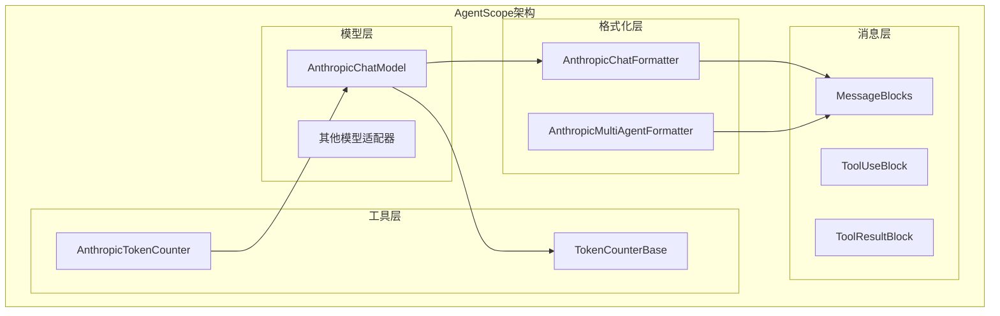

**图表来源**
- [src/agentscope/model/_anthropic_model.py:1-608](file://src/agentscope/model/_anthropic_model.py#L1-L608)
- [src/agentscope/formatter/_anthropic_formatter.py:1-355](file://src/agentscope/formatter/_anthropic_formatter.py#L1-L355)
- [src/agentscope/token/_anthropic_token_counter.py:1-63](file://src/agentscope/token/_anthropic_token_counter.py#L1-L63)

**章节来源**
- [src/agentscope/model/__init__.py:1-22](file://src/agentscope/model/__init__.py#L1-L22)

## 核心组件

### AnthropicChatModel 主要特性

AnthropicChatModel是适配器的核心组件，继承自ChatModelBase，提供了完整的Claude模型集成：

- **初始化参数**：
  - `model_name`：Claude模型名称（如claude-3-sonnet-20240229）
  - `api_key`：Anthropic API密钥
  - `max_tokens`：最大生成令牌数
  - `stream`：是否启用流式输出
  - `thinking`：思维配置字典
  - `stream_tool_parsing`：流式工具解析开关

- **高级功能**：
  - 支持系统消息提取
  - 工具Schema格式化
  - 结构化输出生成
  - 流式JSON自动修复

**章节来源**
- [src/agentscope/model/_anthropic_model.py:40-135](file://src/agentscope/model/_anthropic_model.py#L40-L135)

### AnthropicChatFormatter 多模态支持

格式化器负责将AgentScope的消息对象转换为Anthropic API期望的格式：

- **支持的消息块**：
  - TextBlock：纯文本内容
  - ImageBlock：图像内容（支持本地文件和URL）
  - ToolUseBlock：工具调用
  - ToolResultBlock：工具结果

- **多模态处理**：
  - 自动检测和转换图像格式
  - 支持base64编码和URL引用
  - 统一的消息格式化

**章节来源**
- [src/agentscope/formatter/_anthropic_formatter.py:98-217](file://src/agentscope/formatter/_anthropic_formatter.py#L98-L217)

### AnthropicTokenCounter 成本控制

专门的令牌计数器用于精确的成本估算：

- **功能特性**：
  - 异步令牌计数API
  - 多模态数据支持
  - 工具Schema集成
  - 系统消息处理

**章节来源**
- [src/agentscope/token/_anthropic_token_counter.py:7-63](file://src/agentscope/token/_anthropic_token_counter.py#L7-L63)

## 架构概览

### 整体架构流程

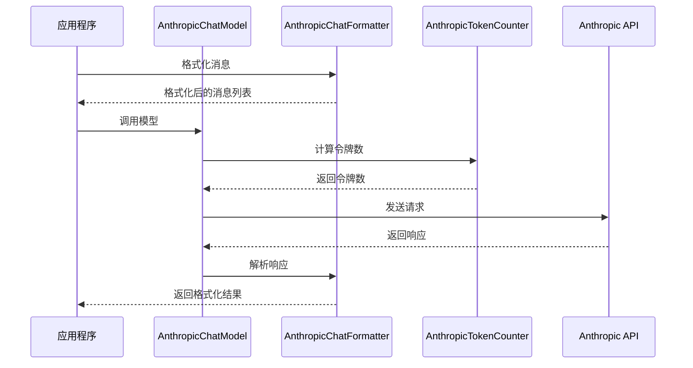

**图表来源**
- [src/agentscope/model/_anthropic_model.py:136-273](file://src/agentscope/model/_anthropic_model.py#L136-L273)
- [src/agentscope/formatter/_anthropic_formatter.py:123-217](file://src/agentscope/formatter/_anthropic_formatter.py#L123-L217)
- [src/agentscope/token/_anthropic_token_counter.py:24-62](file://src/agentscope/token/_anthropic_token_counter.py#L24-L62)

### 消息处理流程

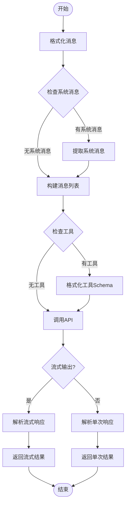

**图表来源**
- [src/agentscope/model/_anthropic_model.py:248-273](file://src/agentscope/model/_anthropic_model.py#L248-L273)
- [src/agentscope/model/_anthropic_model.py:362-550](file://src/agentscope/model/_anthropic_model.py#L362-L550)

## 详细组件分析

### AnthropicChatModel 类结构

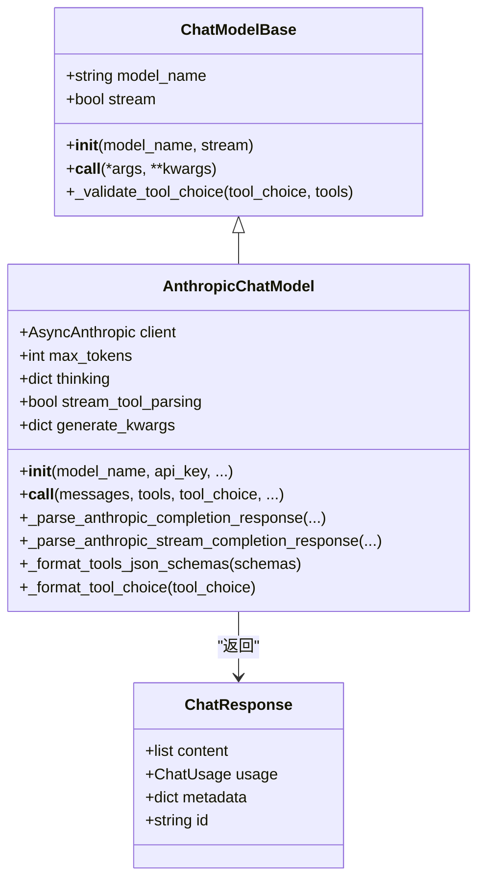

**图表来源**
- [src/agentscope/model/_model_base.py:13-78](file://src/agentscope/model/_model_base.py#L13-L78)
- [src/agentscope/model/_anthropic_model.py:40-608](file://src/agentscope/model/_anthropic_model.py#L40-L608)

#### 初始化流程分析

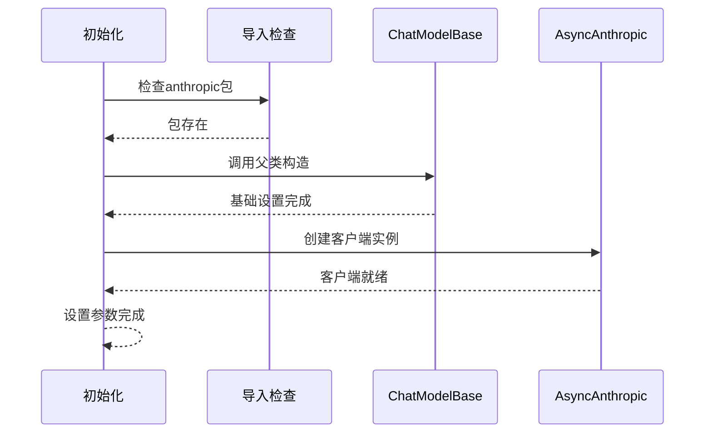

**图表来源**
- [src/agentscope/model/_anthropic_model.py:117-135](file://src/agentscope/model/_anthropic_model.py#L117-L135)

**章节来源**
- [src/agentscope/model/_anthropic_model.py:40-135](file://src/agentscope/model/_anthropic_model.py#L40-L135)

### 流式处理机制

Anthropic适配器实现了完整的流式处理机制，支持实时响应：

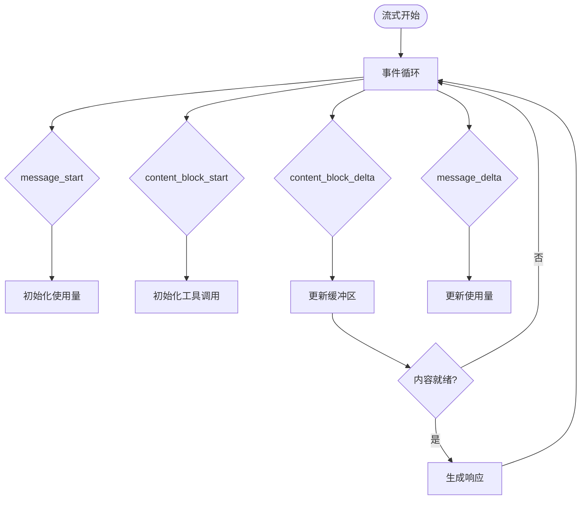

**图表来源**
- [src/agentscope/model/_anthropic_model.py:405-550](file://src/agentscope/model/_anthropic_model.py#L405-L550)

#### JSON流式解析算法

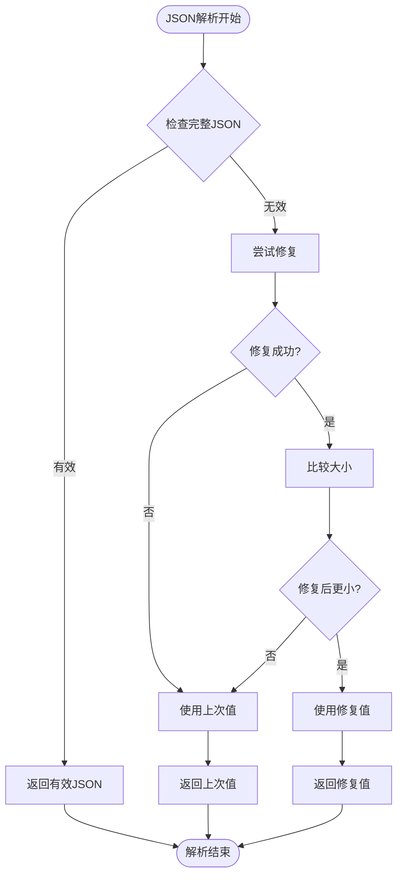

**图表来源**
- [src/agentscope/_utils/_common.py:72-93](file://src/agentscope/_utils/_common.py#L72-L93)

**章节来源**
- [src/agentscope/model/_anthropic_model.py:362-550](file://src/agentscope/model/_anthropic_model.py#L362-L550)
- [src/agentscope/_utils/_common.py:72-93](file://src/agentscope/_utils/_common.py#L72-L93)

### 工具调用集成

Anthropic适配器提供了强大的工具调用功能：

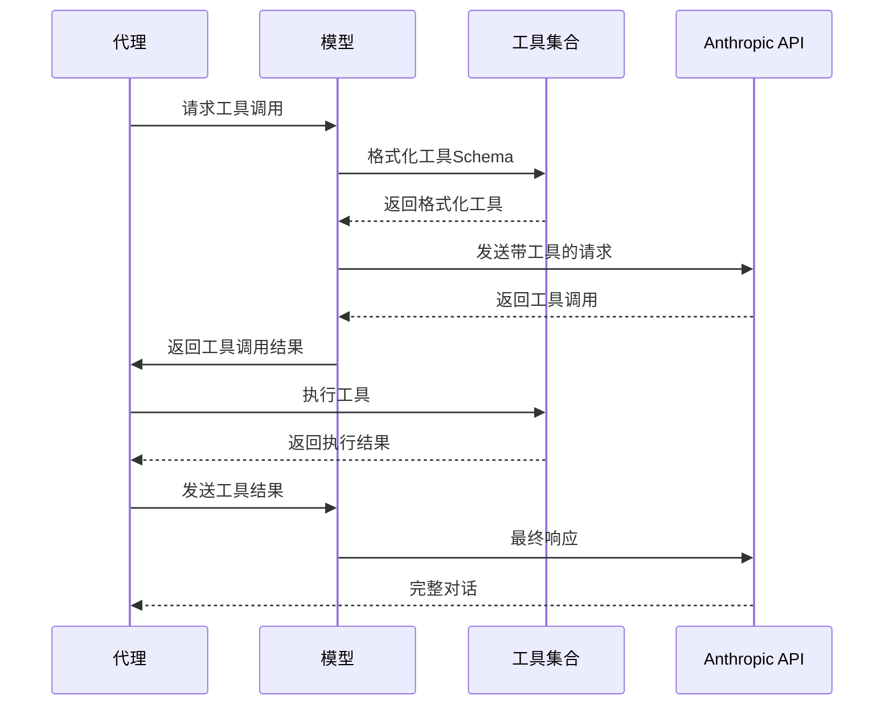

**图表来源**
- [src/agentscope/model/_anthropic_model.py:217-246](file://src/agentscope/model/_anthropic_model.py#L217-L246)
- [src/agentscope/model/_anthropic_model.py:551-576](file://src/agentscope/model/_anthropic_model.py#L551-L576)

**章节来源**
- [src/agentscope/model/_anthropic_model.py:217-246](file://src/agentscope/model/_anthropic_model.py#L217-L246)

### 多模态消息处理

格式化器支持多种消息类型的统一处理：

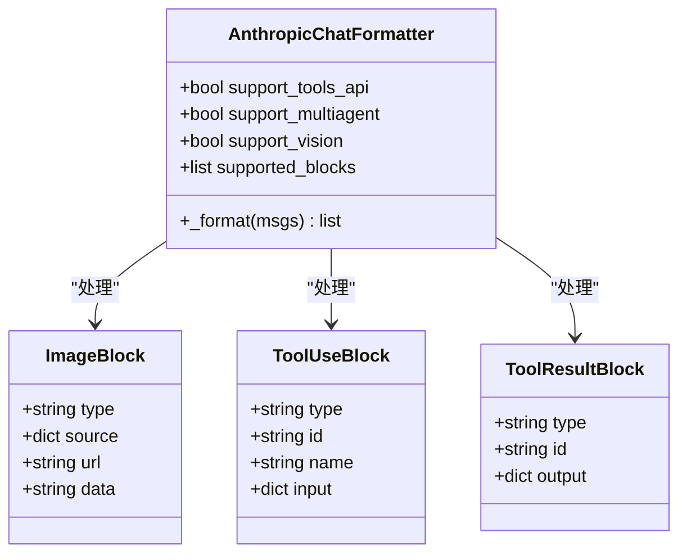

**图表来源**
- [src/agentscope/formatter/_anthropic_formatter.py:98-217](file://src/agentscope/formatter/_anthropic_formatter.py#L98-L217)

**章节来源**
- [src/agentscope/formatter/_anthropic_formatter.py:98-217](file://src/agentscope/formatter/_anthropic_formatter.py#L98-L217)

## 依赖关系分析

### 组件依赖图

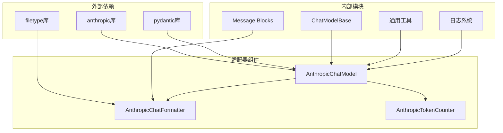

**图表来源**
- [src/agentscope/model/_anthropic_model.py:17-30](file://src/agentscope/model/_anthropic_model.py#L17-L30)
- [src/agentscope/formatter/_anthropic_formatter.py:32-13](file://src/agentscope/formatter/_anthropic_formatter.py#L32-L13)

### 关键依赖关系

| 组件 | 依赖项 | 用途 |
|------|--------|------|
| AnthropicChatModel | anthropic.AsyncAnthropic | API客户端 |
| AnthropicChatModel | pydantic.BaseModel | 结构化输出 |
| AnthropicChatFormatter | filetype | 图像格式检测 |
| AnthropicTokenCounter | anthropic.AsyncAnthropic | 令牌计数 |
| 所有组件 | agentscope.message | 消息块定义 |

**章节来源**
- [src/agentscope/model/_anthropic_model.py:17-30](file://src/agentscope/model/_anthropic_model.py#L17-L30)
- [src/agentscope/formatter/_anthropic_formatter.py:32-13](file://src/agentscope/formatter/_anthropic_formatter.py#L32-L13)

## 性能考虑

### 令牌计数优化

Anthropic适配器提供了精确的成本控制机制：

- **异步计数**：使用AsyncAnthropic客户端进行非阻塞计数
- **多模态支持**：正确处理图像等多模态数据
- **缓存策略**：可结合外部缓存减少重复计算

### 流式处理优化

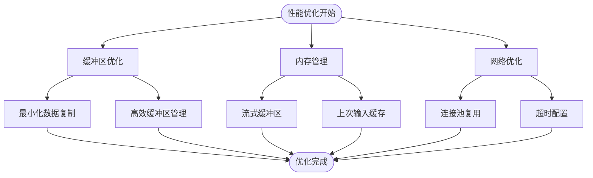

### 成本控制策略

1. **令牌限制**：合理设置max_tokens防止过度消耗
2. **流式解析**：启用stream_tool_parsing减少等待时间
3. **工具选择**：使用tool_choice优化工具调用频率
4. **思维配置**：合理配置thinking预算平衡性能与质量

## 故障排除指南

### 常见问题及解决方案

#### API密钥问题
- **症状**：导入失败或认证错误
- **原因**：anthropic包未安装或API密钥无效
- **解决**：确保已安装anthropic包并正确设置API密钥

#### 工具Schema格式错误
- **症状**：工具调用失败或格式化异常
- **原因**：Schema缺少必需字段或格式不正确
- **解决**：检查function.name和parameters字段

#### 流式解析问题
- **症状**：工具调用JSON解析失败
- **原因**：流式传输中JSON片段不完整
- **解决**：启用stream_tool_parsing或调整解析策略

**章节来源**
- [tests/model_anthropic_test.py:1-200](file://tests/model_anthropic_test.py#L1-L200)

### 调试技巧

1. **启用详细日志**：查看模型调用的详细参数
2. **单元测试**：运行测试套件验证功能正确性
3. **参数验证**：检查所有输入参数的有效性
4. **资源监控**：监控内存和网络使用情况

**章节来源**
- [tests/model_anthropic_test.py:51-200](file://tests/model_anthropic_test.py#L51-L200)

## 结论

AgentScope的Anthropic模型适配器提供了企业级的Claude集成解决方案，具有以下优势：

- **功能完整性**：支持所有Claude核心特性
- **性能优化**：高效的流式处理和内存管理
- **易用性**：简洁的API设计和丰富的配置选项
- **扩展性**：模块化架构便于功能扩展

该适配器特别适合需要复杂推理、工具调用和多模态处理的AI应用场景，能够充分发挥Claude系列模型的强大能力。

## 附录

### 支持的Claude模型

根据测试文件显示，适配器支持以下Claude模型：
- claude-3-sonnet-20240229
- claude-3-opus-20240229

### 配置示例

```python
# 基础配置
model = AnthropicChatModel(
    model_name="claude-3-sonnet-20240229",
    api_key="your-api-key",
    max_tokens=2048,
    stream=True
)

# 启用思维功能
thinking_config = {
    "type": "enabled",
    "budget_tokens": 1024
}

# 结构化输出
from pydantic import BaseModel

class Person(BaseModel):
    name: str
    age: int

model = AnthropicChatModel(
    model_name="claude-3-sonnet-20240229",
    api_key="your-api-key",
    structured_model=Person
)
```

### 最佳实践

1. **合理设置令牌限制**：根据任务复杂度调整max_tokens
2. **启用流式处理**：提升用户体验和响应速度
3. **使用工具调用**：结合具体业务场景设计工具集
4. **监控成本**：定期检查使用量和费用
5. **错误处理**：实现完善的异常处理机制