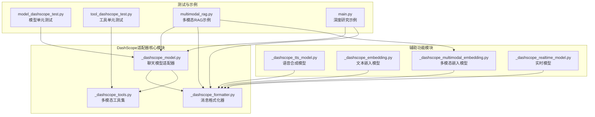
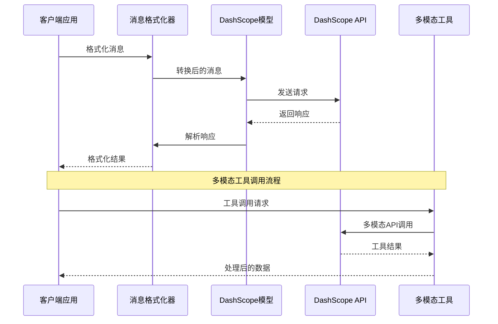
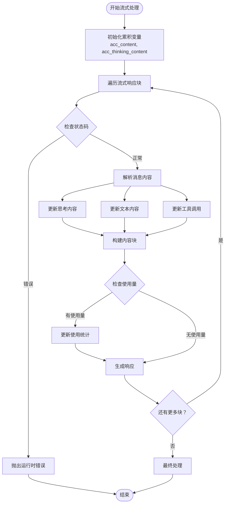
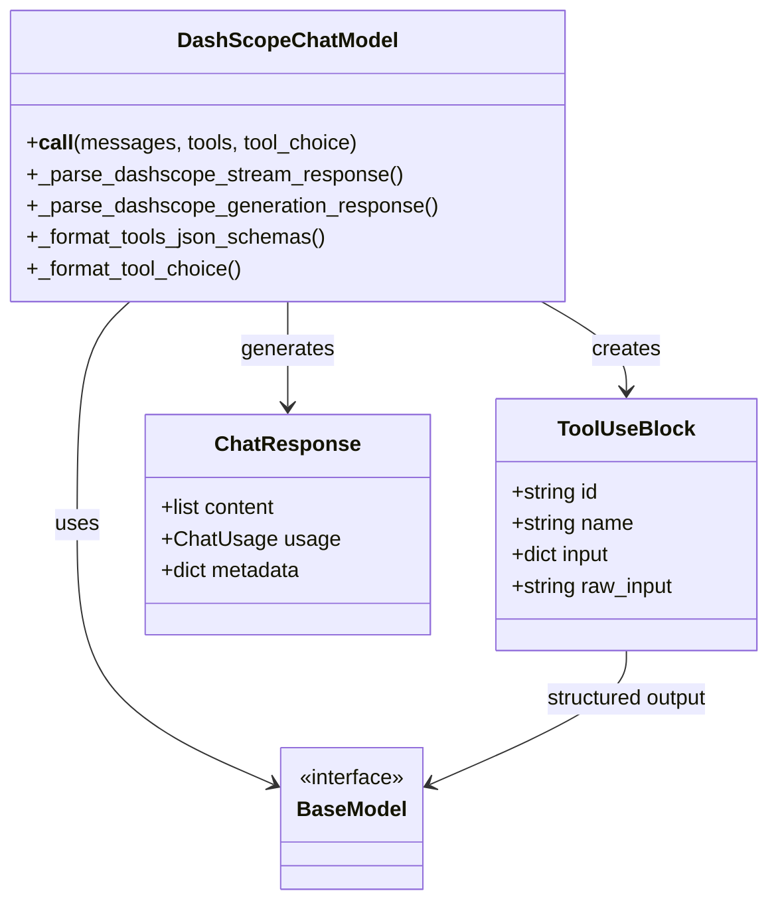
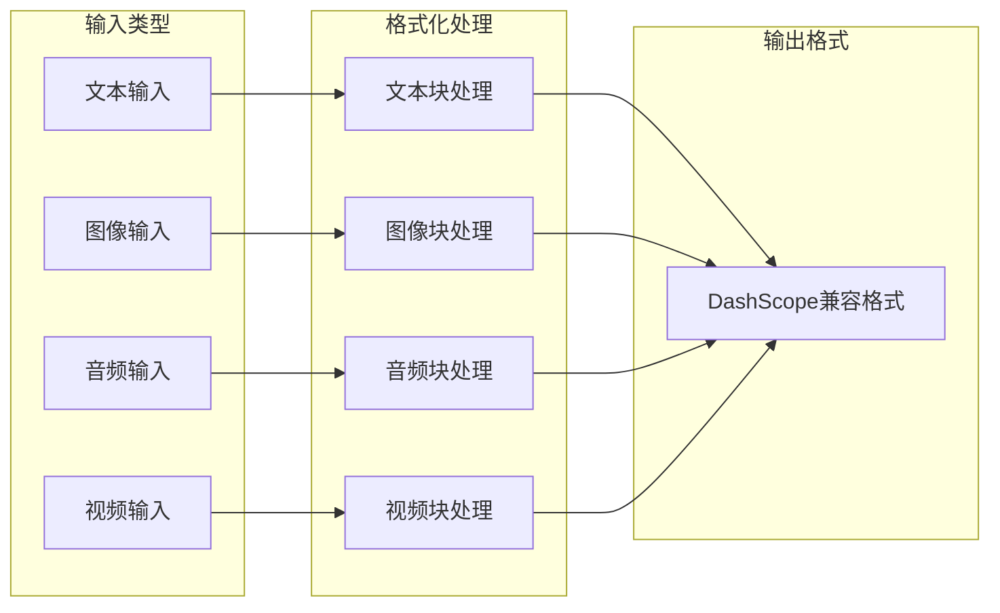
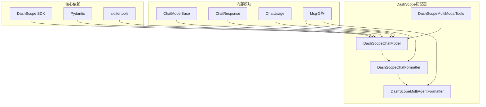

# DashScope模型适配器

<cite>
**本文档引用的文件**
- [src/agentscope/model/_dashscope_model.py](file://src/agentscope/model/_dashscope_model.py)
- [src/agentscope/formatter/_dashscope_formatter.py](file://src/agentscope/formatter/_dashscope_formatter.py)
- [src/agentscope/tool/_multi_modality/_dashscope_tools.py](file://src/agentscope/tool/_multi_modality/_dashscope_tools.py)
- [src/agentscope/tts/_dashscope_tts_model.py](file://src/agentscope/tts/_dashscope_tts_model.py)
- [src/agentscope/embedding/_dashscope_embedding.py](file://src/agentscope/embedding/_dashscope_embedding.py)
- [src/agentscope/embedding/_dashscope_multimodal_embedding.py](file://src/agentscope/embedding/_dashscope_multimodal_embedding.py)
- [src/agentscope/realtime/_dashscope_realtime_model.py](file://src/agentscope/realtime/_dashscope_realtime_model.py)
- [tests/model_dashscope_test.py](file://tests/model_dashscope_test.py)
- [tests/tool_dashscope_test.py](file://tests/tool_dashscope_test.py)
- [examples/functionality/rag/multimodal_rag.py](file://examples/functionality/rag/multimodal_rag.py)
- [examples/integration/qwen_deep_research_model/main.py](file://examples/integration/qwen_deep_research_model/main.py)
</cite>

## 目录
1. [简介](#简介)
2. [项目结构](#项目结构)
3. [核心组件](#核心组件)
4. [架构概览](#架构概览)
5. [详细组件分析](#详细组件分析)
6. [依赖关系分析](#依赖关系分析)
7. [性能考虑](#性能考虑)
8. [故障排除指南](#故障排除指南)
9. [结论](#结论)
10. [附录](#附录)

## 简介

DashScope模型适配器是AgentScope框架中专门为阿里云百炼平台设计的AI模型集成解决方案。该适配器提供了对Qwen系列模型的全面支持，包括文本生成、多模态处理、工具调用、实时语音等功能。

本适配器的核心特性包括：
- **统一API接口**：通过单一接口支持DashScope的Generation和MultiModalConversation API
- **多模态能力**：支持文本、图像、音频、视频等多种媒体类型的处理
- **流式输出**：提供实时的流式响应处理机制
- **工具调用集成**：完整的函数调用和结构化输出支持
- **中文优化**：针对中文场景的专门优化和适配

## 项目结构

DashScope适配器在AgentScope项目中的组织结构如下：



**图表来源**
- [src/agentscope/model/_dashscope_model.py:1-643](file://src/agentscope/model/_dashscope_model.py#L1-L643)
- [src/agentscope/formatter/_dashscope_formatter.py:1-634](file://src/agentscope/formatter/_dashscope_formatter.py#L1-L634)

**章节来源**
- [src/agentscope/model/_dashscope_model.py:1-643](file://src/agentscope/model/_dashscope_model.py#L1-L643)
- [src/agentscope/formatter/_dashscope_formatter.py:1-634](file://src/agentscope/formatter/_dashscope_formatter.py#L1-L634)

## 核心组件

### DashScope聊天模型适配器

DashScopeChatModel是整个适配器的核心组件，负责统一管理DashScope API的各种功能：

**主要特性**：
- **自动API选择**：根据模型名称自动选择合适的API（Generation或MultiModalConversation）
- **多模态支持**：智能识别并处理文本、图像、音频、视频等多模态输入
- **流式处理**：支持实时流式响应处理和工具调用解析
- **结构化输出**：通过Pydantic模型实现结构化输出生成

**关键配置参数**：
- `model_name`：指定使用的DashScope模型名称
- `api_key`：DashScope API密钥
- `stream`：是否启用流式输出
- `enable_thinking`：是否启用思考模式（Qwen3、QwQ、DeepSeek-R1）
- `multimodality`：多模态模式控制
- `generate_kwargs`：额外的生成参数

**章节来源**
- [src/agentscope/model/_dashscope_model.py:51-298](file://src/agentscope/model/_dashscope_model.py#L51-L298)

### DashScope消息格式化器

DashScopeChatFormatter负责将AgentScope的消息对象转换为DashScope API所需的格式：

**支持的功能**：
- **多模态内容处理**：支持文本、图像、音频、视频块的格式化
- **工具调用格式化**：将工具调用转换为DashScope兼容的格式
- **工具结果处理**：处理工具执行结果并支持媒体内容提升
- **令牌计数集成**：与令牌计数器配合进行消息截断

**章节来源**
- [src/agentscope/formatter/_dashscope_formatter.py:159-426](file://src/agentscope/formatter/_dashscope_formatter.py#L159-L426)

### DashScope多模态工具集

提供一组专门的多模态处理工具函数：

**支持的工具**：
- **文本到图像生成**：基于文本描述生成图像
- **图像到文本理解**：分析图像内容并生成描述
- **文本到语音合成**：将文本转换为语音输出

**章节来源**
- [src/agentscope/tool/_multi_modality/_dashscope_tools.py:18-303](file://src/agentscope/tool/_multi_modality/_dashscope_tools.py#L18-L303)

## 架构概览

DashScope适配器采用分层架构设计，确保了良好的模块化和可扩展性：



**图表来源**
- [src/agentscope/model/_dashscope_model.py:162-298](file://src/agentscope/model/_dashscope_model.py#L162-L298)
- [src/agentscope/formatter/_dashscope_formatter.py:244-426](file://src/agentscope/formatter/_dashscope_formatter.py#L244-L426)

## 详细组件分析

### 流式输出处理机制

DashScope适配器实现了高效的流式输出处理，支持实时的增量响应：



**图表来源**
- [src/agentscope/model/_dashscope_model.py:300-486](file://src/agentscope/model/_dashscope_model.py#L300-L486)

**章节来源**
- [src/agentscope/model/_dashscope_model.py:300-486](file://src/agentscope/model/_dashscope_model.py#L300-L486)

### 工具调用集成机制

DashScope适配器提供了完整的工具调用支持，包括函数调用和结构化输出：



**图表来源**
- [src/agentscope/model/_dashscope_model.py:593-642](file://src/agentscope/model/_dashscope_model.py#L593-L642)

**章节来源**
- [src/agentscope/model/_dashscope_model.py:593-642](file://src/agentscope/model/_dashscope_model.py#L593-L642)

### 多模态输入处理

DashScope适配器支持多种媒体类型的输入处理：



**图表来源**
- [src/agentscope/formatter/_dashscope_formatter.py:27-77](file://src/agentscope/formatter/_dashscope_formatter.py#L27-L77)

**章节来源**
- [src/agentscope/formatter/_dashscope_formatter.py:27-77](file://src/agentscope/formatter/_dashscope_formatter.py#L27-L77)

### 认证机制

DashScope适配器提供了灵活的认证机制：

**认证方式**：
- **API密钥认证**：通过构造函数传入API密钥
- **环境变量支持**：支持从环境变量加载额外的HTTP头部
- **自定义基础URL**：允许设置自定义的API基础URL

**章节来源**
- [src/agentscope/model/_dashscope_model.py:138-161](file://src/agentscope/model/_dashscope_model.py#L138-L161)

## 依赖关系分析

DashScope适配器的模块间依赖关系如下：



**图表来源**
- [src/agentscope/model/_dashscope_model.py:23-34](file://src/agentscope/model/_dashscope_model.py#L23-L34)
- [src/agentscope/formatter/_dashscope_formatter.py:11-24](file://src/agentscope/formatter/_dashscope_formatter.py#L11-L24)

**章节来源**
- [src/agentscope/model/_dashscope_model.py:23-34](file://src/agentscope/model/_dashscope_model.py#L23-L34)
- [src/agentscope/formatter/_dashscope_formatter.py:11-24](file://src/agentscope/formatter/_dashscope_formatter.py#L11-L24)

## 性能考虑

### 流式处理优化

DashScope适配器在流式处理方面采用了多项优化策略：

**内存管理**：
- 使用累积变量而非完整缓冲区存储中间结果
- 实现增量解析以减少内存占用
- 支持流式工具输入解析的自动修复机制

**并发处理**：
- 异步生成器模式支持非阻塞的流式处理
- 并行处理多个响应块以提高吞吐量

**缓存策略**：
- 嵌入模型支持缓存机制减少重复API调用
- 智能批处理优化API调用频率

### 多模态处理性能

**媒体文件处理**：
- 支持本地文件直接读取和网络URL访问
- 自动媒体类型检测和验证
- Base64编码优化传输效率

**批量处理优化**：
- 嵌入模型支持批量处理减少API调用次数
- 智能批次大小调整适应不同模型限制

## 故障排除指南

### 常见问题及解决方案

**流式处理问题**：
- **问题**：启用思考模式但禁用流式输出
- **解决方案**：当`enable_thinking=True`时，系统会自动强制启用流式输出

**工具调用兼容性**：
- **问题**：不支持的工具选择模式
- **解决方案**：DashScope API仅支持"auto"和"none"，"required"会被转换为"auto"

**多模态输入验证**：
- **问题**：无效的媒体块类型
- **解决方案**：确保提供正确的媒体块类型和源信息

**章节来源**
- [tests/model_dashscope_test.py:467-485](file://tests/model_dashscope_test.py#L467-L485)
- [tests/tool_dashscope_test.py:129-147](file://tests/tool_dashscope_test.py#L129-L147)

### 错误处理机制

DashScope适配器实现了完善的错误处理机制：

**异常类型**：
- **运行时错误**：API调用失败时抛出RuntimeError
- **JSON解析错误**：流式JSON解析失败时进行自动修复
- **工具调用错误**：工具执行失败时返回详细的错误信息

**调试支持**：
- 详细的日志记录和警告信息
- 完整的单元测试覆盖各种边界情况
- 模型响应的结构化错误报告

**章节来源**
- [src/agentscope/model/_dashscope_model.py:347-350](file://src/agentscope/model/_dashscope_model.py#L347-L350)
- [src/agentscope/tool/_multi_modality/_dashscope_tools.py:106-114](file://src/agentscope/tool/_multi_modality/_dashscope_tools.py#L106-L114)

## 结论

DashScope模型适配器为AgentScope框架提供了强大而灵活的阿里云百炼平台集成能力。通过统一的接口设计和模块化的架构，该适配器成功地将DashScope的丰富功能整合到AgentScope生态系统中。

**主要优势**：
- **全面的模型支持**：覆盖Qwen系列的所有主要模型
- **强大的多模态能力**：支持文本、图像、音频、视频的综合处理
- **灵活的配置选项**：丰富的参数配置满足不同应用场景需求
- **完善的工具集成**：无缝集成DashScope的多模态工具功能
- **优秀的性能表现**：优化的流式处理和缓存机制

**适用场景**：
- 多模态对话系统开发
- 智能内容生成应用
- 跨模态检索和理解任务
- 实时语音交互系统
- 结构化输出生成场景

## 附录

### 使用示例

#### 基础聊天模型使用

```python
# 创建DashScope聊天模型
model = DashScopeChatModel(
    model_name="qwen-turbo",
    api_key=os.environ["DASHSCOPE_API_KEY"],
    stream=True
)

# 发送消息
messages = [
    {"role": "user", "content": "你好，你能帮我写个故事吗？"}
]

response = await model(messages)
print(response.content)
```

#### 多模态RAG示例

```python
# 创建多模态知识库
knowledge = SimpleKnowledge(
    embedding_model=DashScopeMultiModalEmbedding(
        api_key=os.environ["DASHSCOPE_API_KEY"],
        model_name="multimodal-embedding-v1",
        dimensions=1024,
    ),
    embedding_store=QdrantStore(
        location=":memory:",
        collection_name="test_collection",
        dimensions=1024,
    ),
)

# 创建支持多模态的Agent
agent = ReActAgent(
    name="Friday",
    sys_prompt="你是一个名为Friday的助手。",
    model=DashScopeChatModel(
        api_key=os.environ["DASHSCOPE_API_KEY"],
        model_name="qwen3-vl-plus",
    ),
    formatter=DashScopeChatFormatter(),
    knowledge=knowledge,
)
```

#### 深度研究Agent示例

```python
# 创建深度研究Agent
researcher = QwenDeepResearchAgent(
    name="Researcher Qwen",
    verbose=True,
)

# 执行研究流程
user_msg = Msg(
    name="User",
    content="研究人工智能在教育中的应用",
    role="user",
)

clarification = await researcher(user_msg)
print(f"{clarification.name}: {clarification.content}")
```

**章节来源**
- [examples/functionality/rag/multimodal_rag.py:25-73](file://examples/functionality/rag/multimodal_rag.py#L25-L73)
- [examples/integration/qwen_deep_research_model/main.py:10-52](file://examples/integration/qwen_deep_research_model/main.py#L10-L52)

### 配置选项参考

**模型配置参数**：
- `temperature`：采样温度，控制输出随机性
- `max_tokens`：最大生成长度
- `top_p`：核采样参数
- `seed`：随机种子
- `enable_thinking`：启用思考模式

**多模态配置**：
- `multimodality`：强制多模态模式
- `stream_tool_parsing`：流式工具解析开关
- `promote_tool_result_*`：工具结果媒体提升选项

**章节来源**
- [src/agentscope/model/_dashscope_model.py:107-121](file://src/agentscope/model/_dashscope_model.py#L107-L121)
- [src/agentscope/formatter/_dashscope_formatter.py:209-243](file://src/agentscope/formatter/_dashscope_formatter.py#L209-L243)