# Gemini模型适配器

<cite>
**本文档引用的文件**
- [src/agentscope/model/_gemini_model.py](file://src/agentscope/model/_gemini_model.py)
- [src/agentscope/realtime/_gemini_realtime_model.py](file://src/agentscope/realtime/_gemini_realtime_model.py)
- [src/agentscope/formatter/_gemini_formatter.py](file://src/agentscope/formatter/_gemini_formatter.py)
- [src/agentscope/token/_gemini_token_counter.py](file://src/agentscope/token/_gemini_token_counter.py)
- [src/agentscope/embedding/_gemini_embedding.py](file://src/agentscope/embedding/_gemini_embedding.py)
- [tests/model_gemini_test.py](file://tests/model_gemini_test.py)
- [examples/agent/realtime_voice_agent/run_server.py](file://examples/agent/realtime_voice_agent/run_server.py)
- [examples/workflows/multiagent_realtime/run_server.py](file://examples/workflows/multiagent_realtime/run_server.py)
- [examples/workflows/multiagent_realtime/multi_agent.html](file://examples/workflows/multiagent_realtime/multi_agent.html)
- [examples/agent/browser_agent/build_in_helper/_image_understanding.py](file://examples/agent/browser_agent/build_in_helper/_image_understanding.py)
- [examples/agent/browser_agent/build_in_helper/_video_understanding.py](file://examples/agent/browser_agent/build_in_helper/_video_understanding.py)
</cite>

## 目录
1. [简介](#简介)
2. [项目结构](#项目结构)
3. [核心组件](#核心组件)
4. [架构概览](#架构概览)
5. [详细组件分析](#详细组件分析)
6. [依赖关系分析](#依赖关系分析)
7. [性能考虑](#性能考虑)
8. [故障排除指南](#故障排除指南)
9. [结论](#结论)
10. [附录](#附录)

## 简介

Gemini模型适配器是AgentScope框架中专门为Google AI平台设计的集成模块，提供了对Gemini Pro、Gemini Vision等多模态模型的完整支持。该适配器不仅实现了基础的文本对话功能，还深度集成了实时交互特性、多模态处理能力以及完整的工具调用系统。

本适配器的核心优势在于其模块化设计，通过独立的组件实现不同功能：基础聊天模型、实时语音模型、格式化器、令牌计数器和嵌入模型。这种设计使得开发者可以根据具体需求灵活选择和组合不同的功能模块。

## 项目结构

AgentScope项目采用清晰的模块化组织结构，Gemini适配器相关的核心文件分布如下：

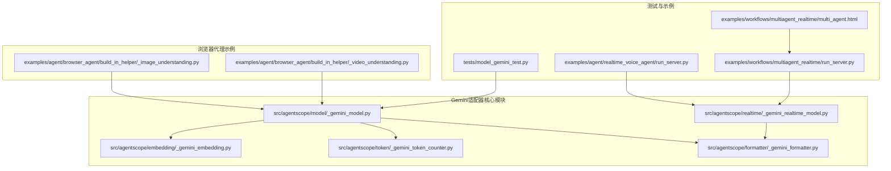

**图表来源**
- [src/agentscope/model/_gemini_model.py:1-674](file://src/agentscope/model/_gemini_model.py#L1-L674)
- [src/agentscope/realtime/_gemini_realtime_model.py:1-663](file://src/agentscope/realtime/_gemini_realtime_model.py#L1-L663)

**章节来源**
- [src/agentscope/model/_gemini_model.py:1-674](file://src/agentscope/model/_gemini_model.py#L1-L674)
- [src/agentscope/realtime/_gemini_realtime_model.py:1-663](file://src/agentscope/realtime/_gemini_realtime_model.py#L1-L663)

## 核心组件

### 基础聊天模型 (GeminiChatModel)

GeminiChatModel是适配器的核心组件，负责处理标准的文本对话请求。它支持以下关键功能：

- **流式响应处理**：支持异步流式响应，实现实时输出效果
- **工具调用集成**：原生支持函数调用，无需额外包装
- **思维链支持**：可配置思考模式，支持推理过程的可视化
- **结构化输出**：支持Pydantic模型的直接输出绑定

### 实时语音模型 (GeminiRealtimeModel)

专为实时语音交互设计的模型，提供完整的音频处理能力：

- **双向音频流**：支持实时音频输入和输出
- **多模态输入**：支持文本、音频、图像的混合输入
- **语音合成**：内置TTS功能，支持多种预设声音
- **会话管理**：完整的会话生命周期管理

### 格式化器 (GeminiChatFormatter)

负责将内部消息格式转换为Gemini API所需的格式：

- **多模态支持**：支持图片、音频、视频等多种媒体类型
- **工具调用格式化**：将工具调用转换为Gemini兼容格式
- **历史记录管理**：在多轮对话中维护上下文信息
- **令牌计数集成**：与令牌计数器协同工作

**章节来源**
- [src/agentscope/model/_gemini_model.py:115-674](file://src/agentscope/model/_gemini_model.py#L115-L674)
- [src/agentscope/realtime/_gemini_realtime_model.py:21-663](file://src/agentscope/realtime/_gemini_realtime_model.py#L21-L663)
- [src/agentscope/formatter/_gemini_formatter.py:108-509](file://src/agentscope/formatter/_gemini_formatter.py#L108-L509)

## 架构概览

Gemini适配器采用分层架构设计，各组件职责明确且高度解耦：

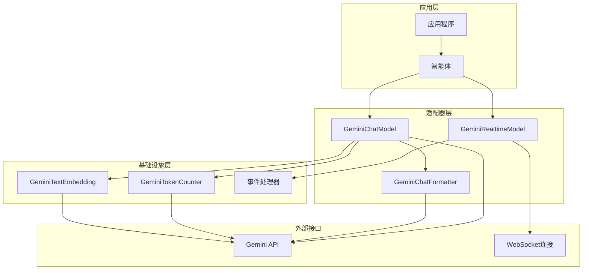

**图表来源**
- [src/agentscope/model/_gemini_model.py:201-304](file://src/agentscope/model/_gemini_model.py#L201-L304)
- [src/agentscope/realtime/_gemini_realtime_model.py:175-250](file://src/agentscope/realtime/_gemini_realtime_model.py#L175-L250)

## 详细组件分析

### 基础聊天模型实现

GeminiChatModel是整个适配器的核心，实现了完整的Gemini API集成：

#### 类设计图

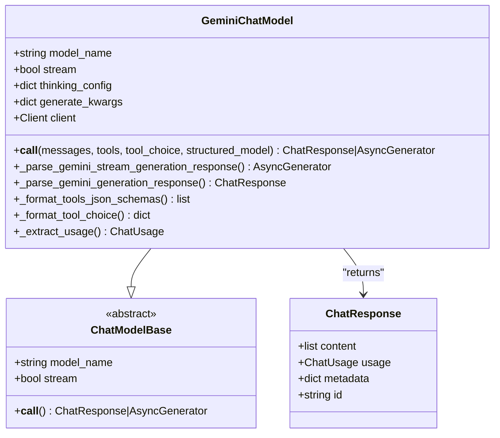

**图表来源**
- [src/agentscope/model/_gemini_model.py:115-674](file://src/agentscope/model/_gemini_model.py#L115-L674)

#### 流式响应处理流程

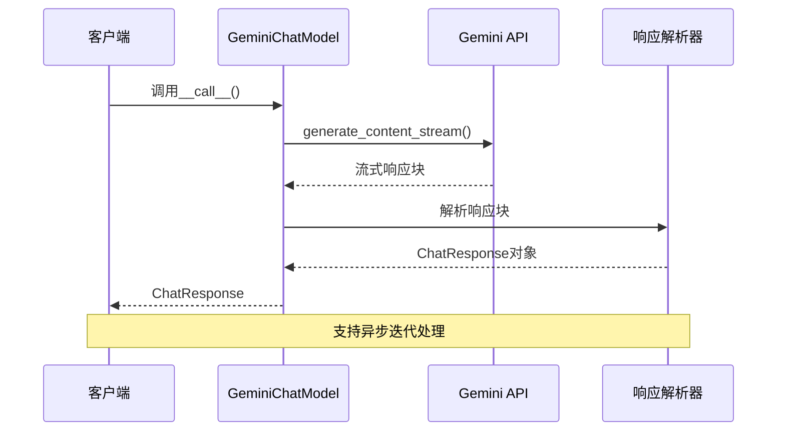

**图表来源**
- [src/agentscope/model/_gemini_model.py:336-450](file://src/agentscope/model/_gemini_model.py#L336-L450)

#### 工具调用集成机制

GeminiChatModel原生支持函数调用，无需额外的包装层：

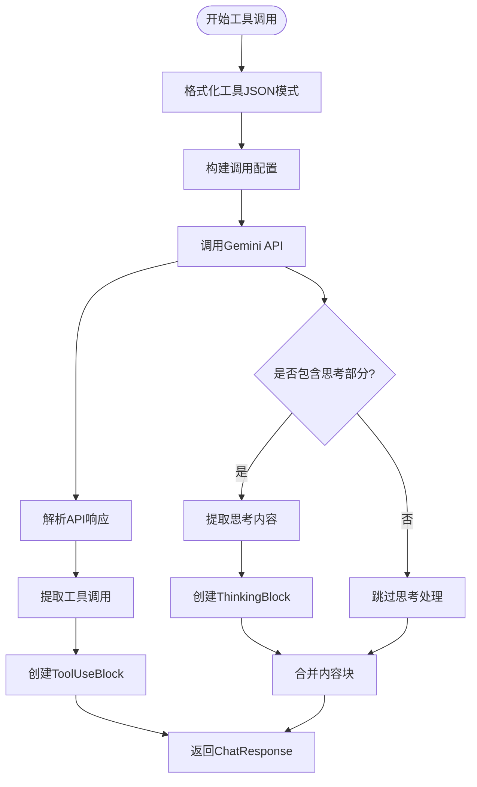

**图表来源**
- [src/agentscope/model/_gemini_model.py:549-674](file://src/agentscope/model/_gemini_model.py#L549-L674)

**章节来源**
- [src/agentscope/model/_gemini_model.py:115-674](file://src/agentscope/model/_gemini_model.py#L115-L674)

### 实时语音模型实现

GeminiRealtimeModel专门处理实时语音交互场景：

#### 实时交互序列图

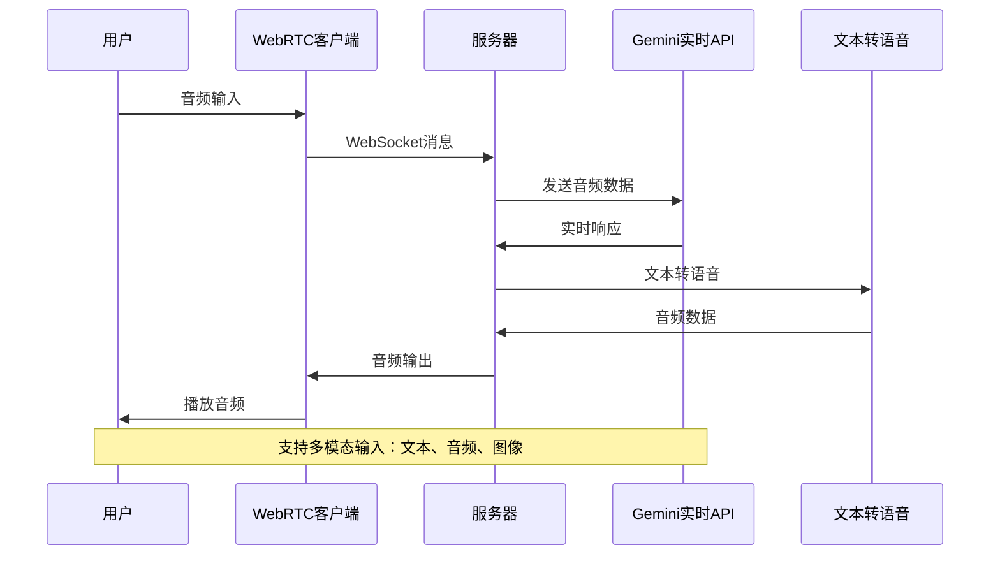

**图表来源**
- [src/agentscope/realtime/_gemini_realtime_model.py:175-250](file://src/agentscope/realtime/_gemini_realtime_model.py#L175-L250)

#### 事件处理机制

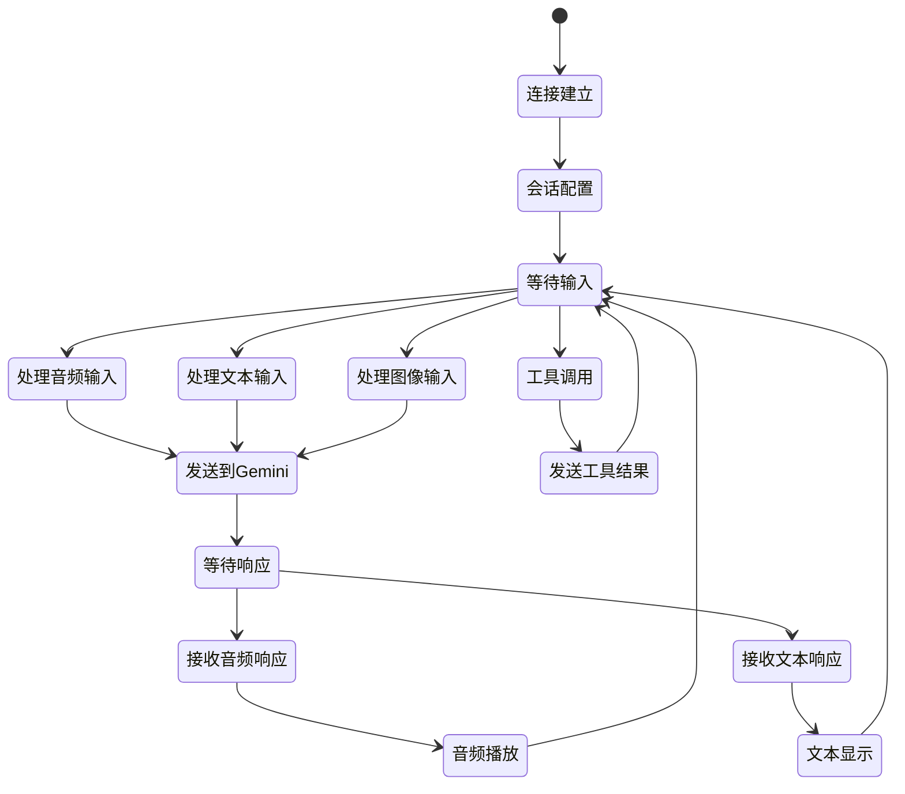

**图表来源**
- [src/agentscope/realtime/_gemini_realtime_model.py:251-516](file://src/agentscope/realtime/_gemini_realtime_model.py#L251-L516)

**章节来源**
- [src/agentscope/realtime/_gemini_realtime_model.py:21-663](file://src/agentscope/realtime/_gemini_realtime_model.py#L21-L663)

### 多模态处理能力

Gemini适配器提供了强大的多模态处理能力，支持文本、图像、音频、视频的综合处理：

#### 多模态数据流图

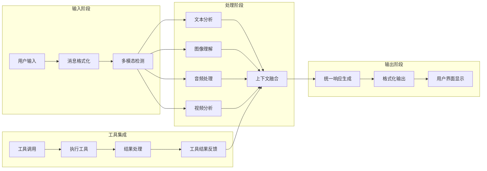

**图表来源**
- [src/agentscope/formatter/_gemini_formatter.py:178-310](file://src/agentscope/formatter/_gemini_formatter.py#L178-L310)

#### 图像理解示例

浏览器代理中的图像理解功能展示了Gemini在视觉理解方面的强大能力：

**章节来源**
- [src/agentscope/formatter/_gemini_formatter.py:108-509](file://src/agentscope/formatter/_gemini_formatter.py#L108-L509)
- [examples/agent/browser_agent/build_in_helper/_image_understanding.py:23-162](file://examples/agent/browser_agent/build_in_helper/_image_understanding.py#L23-L162)

### 结构化输出支持

Gemini适配器支持Pydantic模型的直接结构化输出，简化了复杂数据格式的处理：

#### 结构化输出流程

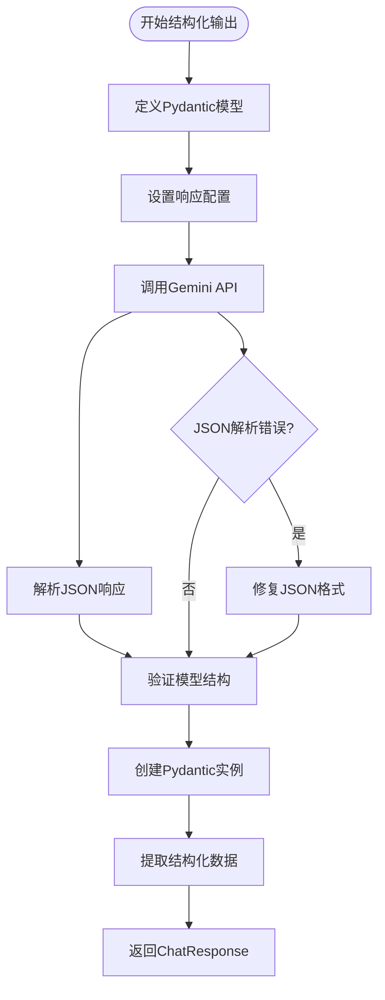

**图表来源**
- [src/agentscope/model/_gemini_model.py:261-272](file://src/agentscope/model/_gemini_model.py#L261-L272)

**章节来源**
- [src/agentscope/model/_gemini_model.py:261-304](file://src/agentscope/model/_gemini_model.py#L261-L304)

## 依赖关系分析

Gemini适配器的依赖关系设计体现了良好的模块化原则：

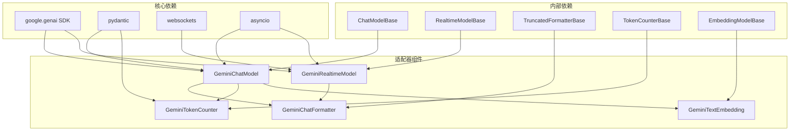

**图表来源**
- [src/agentscope/model/_gemini_model.py:184-197](file://src/agentscope/model/_gemini_model.py#L184-L197)
- [src/agentscope/realtime/_gemini_realtime_model.py:185-191](file://src/agentscope/realtime/_gemini_realtime_model.py#L185-L191)

**章节来源**
- [src/agentscope/model/_gemini_model.py:184-200](file://src/agentscope/model/_gemini_model.py#L184-L200)
- [src/agentscope/realtime/_gemini_realtime_model.py:185-191](file://src/agentscope/realtime/_gemini_realtime_model.py#L185-L191)

## 性能考虑

### 流式处理优化

Gemini适配器采用了多项性能优化策略：

- **异步I/O处理**：所有网络请求都采用异步模式，避免阻塞
- **内存高效处理**：流式响应逐块处理，减少内存占用
- **缓存机制**：嵌入模型支持结果缓存，避免重复API调用
- **连接池管理**：合理管理WebSocket连接，提高资源利用率

### 令牌计数优化

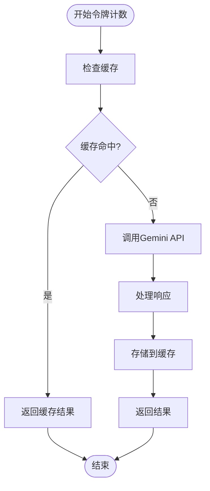

**图表来源**
- [src/agentscope/token/_gemini_token_counter.py:31-51](file://src/agentscope/token/_gemini_token_counter.py#L31-L51)

**章节来源**
- [src/agentscope/token/_gemini_token_counter.py:31-51](file://src/agentscope/token/_gemini_token_counter.py#L31-L51)

## 故障排除指南

### 常见问题及解决方案

#### API密钥认证问题

当遇到API密钥相关错误时，检查以下要点：

1. **密钥有效性**：确保GEMINI_API_KEY环境变量正确设置
2. **权限配置**：确认API密钥具有访问相应模型的权限
3. **配额检查**：验证账户是否有足够的API配额

#### 流式响应处理异常

如果流式响应出现中断或异常：

1. **检查网络连接**：确保WebSocket连接稳定
2. **验证数据格式**：确认发送的数据符合Gemini API要求
3. **监控超时设置**：适当调整超时参数

#### 工具调用失败

工具调用失败的排查步骤：

1. **验证工具模式**：检查工具JSON模式的正确性
2. **检查函数签名**：确认函数名称和参数匹配
3. **查看错误日志**：分析具体的错误信息

**章节来源**
- [tests/model_gemini_test.py:131-390](file://tests/model_gemini_test.py#L131-L390)

## 结论

Gemini模型适配器展现了优秀的工程设计和实现质量。通过模块化的架构设计，该适配器成功地将Google AI平台的强大功能集成到AgentScope框架中，为开发者提供了完整的多模态AI应用开发解决方案。

主要优势包括：

1. **功能完整性**：覆盖从基础聊天到实时语音的全场景需求
2. **扩展性强**：模块化设计便于功能扩展和定制
3. **性能优化**：采用异步处理和缓存机制提升性能
4. **易用性**：提供简洁的API接口和丰富的示例代码

未来的发展方向可以包括：

- 更多模型的支持和优化
- 增强的安全性和合规性功能
- 更完善的监控和调试工具
- 与其他AI平台的互操作性增强

## 附录

### 集成示例

#### 基础聊天模型使用示例

```python
# 创建Gemini聊天模型
model = GeminiChatModel(
    model_name="gemini-2.5-flash",
    api_key="your_api_key",
    stream=True,
    thinking_config={
        "include_thoughts": True,
        "thinking_budget": 1024
    }
)

# 发送消息并获取响应
messages = [
    {"role": "user", "content": "你好，请介绍自己"}
]

response = await model(messages)
print(response.content[0].text)
```

#### 实时语音交互示例

```python
# 创建实时语音模型
realtime_model = GeminiRealtimeModel(
    model_name="gemini-2.5-flash-native-audio-preview-09-2025",
    api_key="your_api_key",
    voice="Puck"
)

# 发送音频数据
audio_block = AudioBlock(
    type="audio",
    source={
        "type": "base64",
        "data": audio_data,
        "sample_rate": 16000
    }
)

await realtime_model.send(audio_block)
```

#### 多模态处理示例

```python
# 创建包含多模态内容的消息
content_blocks = [
    TextBlock(
        type="text",
        text="请分析这张图片"
    ),
    ImageBlock(
        type="image",
        source={
            "type": "base64",
            "media_type": "image/jpeg",
            "data": image_data
        }
    )
]

# 格式化并发送
formatted_messages = await formatter.format(msgs=[
    Msg("user", content_blocks, role="user")
])

response = await model(formatted_messages)
```

**章节来源**
- [examples/agent/realtime_voice_agent/run_server.py:122-151](file://examples/agent/realtime_voice_agent/run_server.py#L122-L151)
- [examples/workflows/multiagent_realtime/run_server.py:131-145](file://examples/workflows/multiagent_realtime/run_server.py#L131-L145)