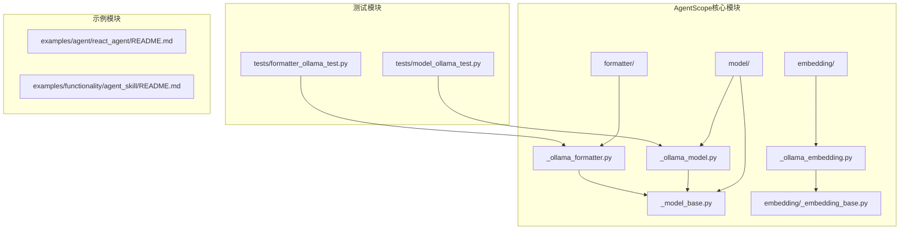
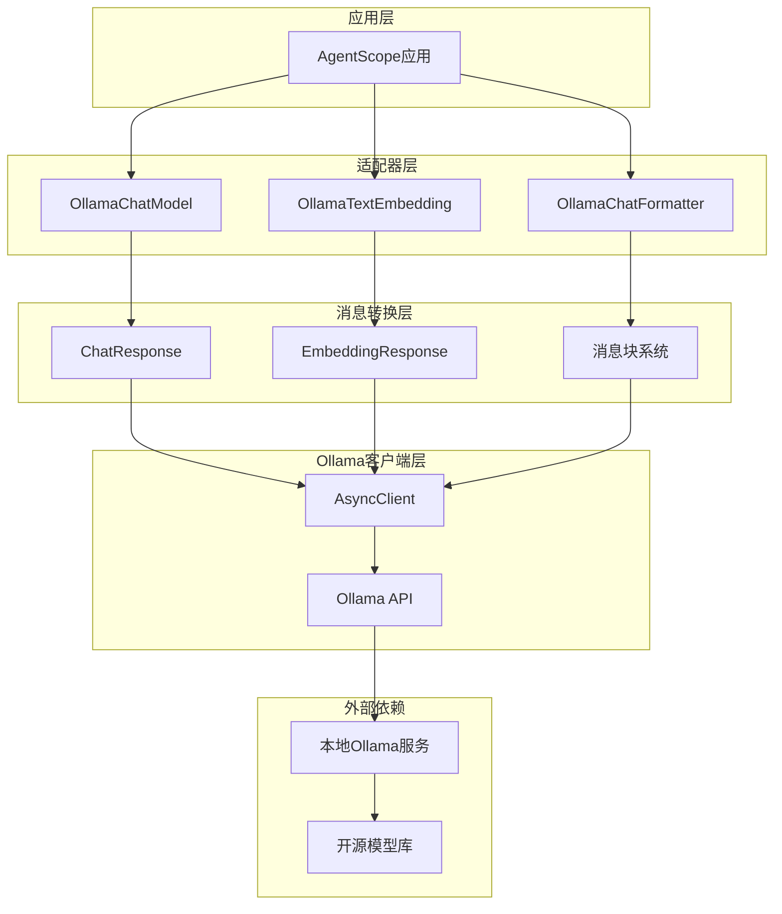
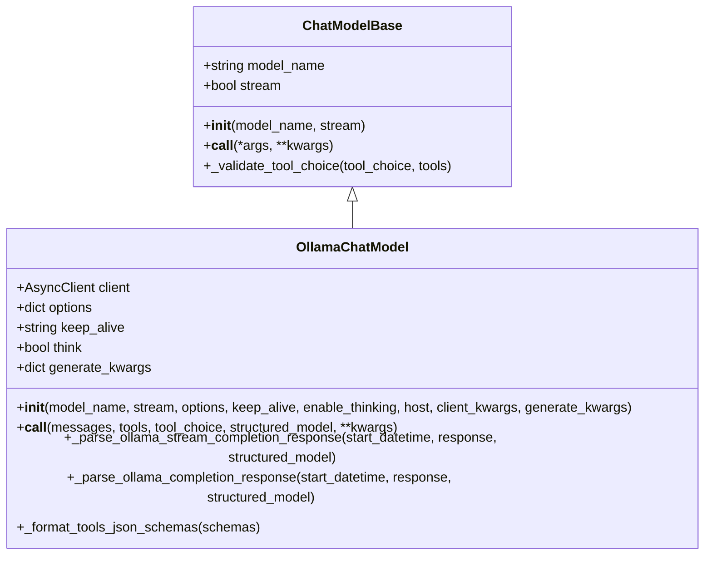
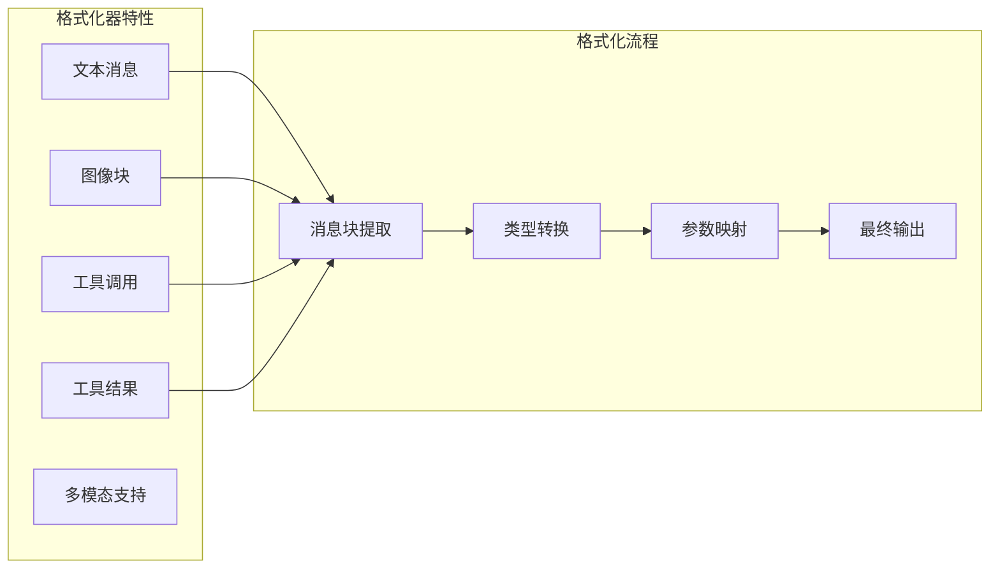
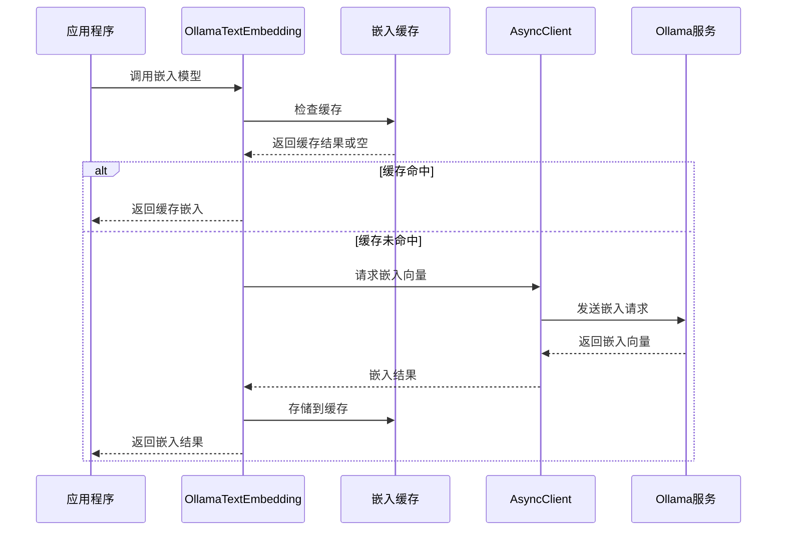
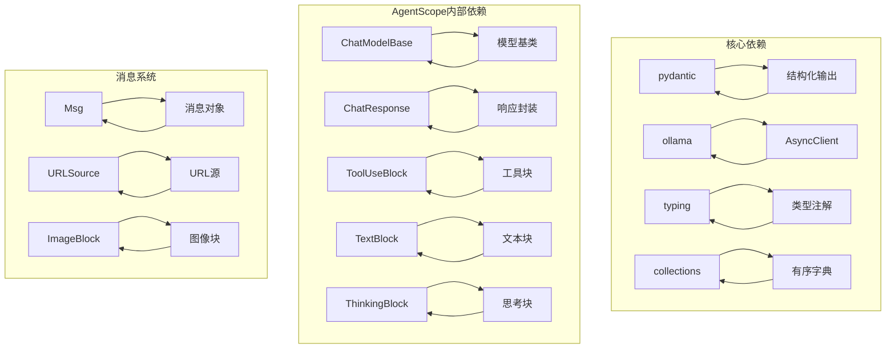

# Ollama本地模型适配器

<cite>
**本文档引用的文件**
- [src/agentscope/model/_ollama_model.py](file://src/agentscope/model/_ollama_model.py)
- [src/agentscope/formatter/_ollama_formatter.py](file://src/agentscope/formatter/_ollama_formatter.py)
- [src/agentscope/embedding/_ollama_embedding.py](file://src/agentscope/embedding/_ollama_embedding.py)
- [src/agentscope/model/_model_base.py](file://src/agentscope/model/_model_base.py)
- [src/agentscope/model/__init__.py](file://src/agentscope/model/__init__.py)
- [src/agentscope/embedding/_embedding_base.py](file://src/agentscope/embedding/_embedding_base.py)
- [tests/model_ollama_test.py](file://tests/model_ollama_test.py)
- [tests/formatter_ollama_test.py](file://tests/formatter_ollama_test.py)
- [examples/agent/react_agent/README.md](file://examples/agent/react_agent/README.md)
- [examples/functionality/agent_skill/README.md](file://examples/functionality/agent_skill/README.md)
- [src/agentscope/__init__.py](file://src/agentscope/__init__.py)
- [README.md](file://README.md)
</cite>

## 目录
1. [简介](#简介)
2. [项目结构](#项目结构)
3. [核心组件](#核心组件)
4. [架构概览](#架构概览)
5. [详细组件分析](#详细组件分析)
6. [依赖关系分析](#依赖关系分析)
7. [性能考虑](#性能考虑)
8. [故障排除指南](#故障排除指南)
9. [结论](#结论)
10. [附录](#附录)

## 简介

AgentScope的Ollama本地模型适配器为本地部署的开源大语言模型提供了完整的集成解决方案。该适配器支持Llama系列、Mistral系列等主流开源模型，通过统一的接口实现与AgentScope框架的无缝集成。

本适配器的核心优势在于：
- **隐私保护**：所有数据处理都在本地完成，无需上传到云端
- **离线使用**：无需网络连接即可运行本地模型
- **成本效益**：避免了云API调用费用
- **模型多样性**：支持多种开源模型格式

## 项目结构

AgentScope采用模块化设计，Ollama适配器位于核心模型模块中：



**图表来源**
- [src/agentscope/model/_ollama_model.py:1-366](file://src/agentscope/model/_ollama_model.py#L1-L366)
- [src/agentscope/formatter/_ollama_formatter.py:1-444](file://src/agentscope/formatter/_ollama_formatter.py#L1-L444)
- [src/agentscope/embedding/_ollama_embedding.py:1-107](file://src/agentscope/embedding/_ollama_embedding.py#L1-L107)

**章节来源**
- [src/agentscope/model/__init__.py:1-22](file://src/agentscope/model/__init__.py#L1-L22)
- [src/agentscope/__init__.py:46-58](file://src/agentscope/__init__.py#L46-L58)

## 核心组件

### 模型适配器组件

AgentScope提供了三个核心组件来支持Ollama本地模型：

1. **OllamaChatModel** - 聊天模型适配器
2. **OllamaChatFormatter** - 消息格式化器
3. **OllamaTextEmbedding** - 文本嵌入模型

每个组件都经过精心设计，确保与AgentScope框架的完全兼容性。

**章节来源**
- [src/agentscope/model/_ollama_model.py:33-366](file://src/agentscope/model/_ollama_model.py#L33-L366)
- [src/agentscope/formatter/_ollama_formatter.py:73-444](file://src/agentscope/formatter/_ollama_formatter.py#L73-L444)
- [src/agentscope/embedding/_ollama_embedding.py:13-107](file://src/agentscope/embedding/_ollama_embedding.py#L13-L107)

## 架构概览

AgentScope的Ollama适配器采用分层架构设计，实现了清晰的关注点分离：



**图表来源**
- [src/agentscope/model/_ollama_model.py:80-98](file://src/agentscope/model/_ollama_model.py#L80-L98)
- [src/agentscope/formatter/_ollama_formatter.py:73-124](file://src/agentscope/formatter/_ollama_formatter.py#L73-L124)
- [src/agentscope/embedding/_ollama_embedding.py:19-46](file://src/agentscope/embedding/_ollama_embedding.py#L19-L46)

## 详细组件分析

### OllamaChatModel组件

OllamaChatModel是整个适配器的核心，负责与本地Ollama服务进行通信。

#### 类结构设计



**图表来源**
- [src/agentscope/model/_model_base.py:13-57](file://src/agentscope/model/_model_base.py#L13-L57)
- [src/agentscope/model/_ollama_model.py:33-366](file://src/agentscope/model/_ollama_model.py#L33-L366)

#### 初始化参数详解

| 参数名称 | 类型 | 默认值 | 描述 |
|---------|------|--------|------|
| model_name | str | 必需 | 模型名称（如llama3.2、mistral等） |
| stream | bool | False | 是否启用流式输出 |
| options | dict | None | Ollama参数选项（temperature等） |
| keep_alive | str | "5m" | 模型保持加载的时间 |
| enable_thinking | bool | None | 启用思考功能（特定模型） |
| host | str | None | Ollama服务器地址 |
| client_kwargs | dict | None | 客户端初始化参数 |
| generate_kwargs | dict | None | 生成参数 |

#### 核心功能实现

1. **异步客户端管理**：使用Ollama AsyncClient确保非阻塞操作
2. **流式响应处理**：支持增量响应输出
3. **工具调用集成**：原生支持函数调用模式
4. **结构化输出**：支持Pydantic模型验证

**章节来源**
- [src/agentscope/model/_ollama_model.py:36-98](file://src/agentscope/model/_ollama_model.py#L36-L98)
- [src/agentscope/model/_ollama_model.py:100-172](file://src/agentscope/model/_ollama_model.py#L100-L172)

### OllamaChatFormatter组件

消息格式化器负责将AgentScope的消息对象转换为Ollama API期望的格式。

#### 支持的功能特性



**图表来源**
- [src/agentscope/formatter/_ollama_formatter.py:73-124](file://src/agentscope/formatter/_ollama_formatter.py#L73-L124)
- [src/agentscope/formatter/_ollama_formatter.py:125-265](file://src/agentscope/formatter/_ollama_formatter.py#L125-L265)

#### 多模态处理能力

| 功能类型 | 支持状态 | 描述 |
|---------|----------|------|
| 文本消息 | ✅ 支持 | 基础对话内容 |
| 图像输入 | ✅ 支持 | URL和Base64格式 |
| 工具调用 | ✅ 支持 | 函数调用模式 |
| 工具结果 | ✅ 支持 | 结果返回处理 |
| 多代理对话 | ❌ 不支持 | 单代理场景优化 |

**章节来源**
- [src/agentscope/formatter/_ollama_formatter.py:73-96](file://src/agentscope/formatter/_ollama_formatter.py#L73-L96)
- [src/agentscope/formatter/_ollama_formatter.py:125-265](file://src/agentscope/formatter/_ollama_formatter.py#L125-L265)

### OllamaTextEmbedding组件

文本嵌入模型为向量检索和相似度计算提供支持。

#### 嵌入处理流程



**图表来源**
- [src/agentscope/embedding/_ollama_embedding.py:48-106](file://src/agentscope/embedding/_ollama_embedding.py#L48-L106)

**章节来源**
- [src/agentscope/embedding/_ollama_embedding.py:19-46](file://src/agentscope/embedding/_ollama_embedding.py#L19-L46)
- [src/agentscope/embedding/_ollama_embedding.py:48-106](file://src/agentscope/embedding/_ollama_embedding.py#L48-L106)

## 依赖关系分析

### 组件间依赖关系



**图表来源**
- [src/agentscope/model/_ollama_model.py:16-25](file://src/agentscope/model/_ollama_model.py#L16-L25)
- [src/agentscope/message/__init__.py](file://src/agentscope/message/__init__.py)

### 外部依赖分析

| 依赖包 | 版本要求 | 用途 | 必需性 |
|-------|---------|------|--------|
| ollama | >=0.1.7 | Ollama客户端 | 必需 |
| pydantic | 最新版本 | 结构化验证 | 可选 |
| typing | 内置 | 类型提示 | 内置 |
| collections | 内置 | 数据结构 | 内置 |

**章节来源**
- [src/agentscope/model/_ollama_model.py:80-86](file://src/agentscope/model/_ollama_model.py#L80-L86)

## 性能考虑

### 内存管理策略

1. **模型保持机制**：通过`keep_alive`参数控制模型驻留时间
2. **流式处理**：减少内存峰值占用
3. **缓存机制**：嵌入结果缓存避免重复计算

### 并发处理能力

- 异步I/O操作确保高并发场景下的响应性
- 流式响应支持实时交互
- 非阻塞的工具调用处理

### 资源优化建议

1. **GPU加速**：确保Ollama服务正确配置GPU
2. **内存分配**：根据模型大小合理配置系统内存
3. **批处理优化**：对多个请求进行批处理

## 故障排除指南

### 常见问题及解决方案

#### 1. Ollama客户端导入错误

**症状**：ImportError关于ollama包缺失

**解决方案**：
```bash
pip install "ollama>=0.1.7"
```

**章节来源**
- [src/agentscope/model/_ollama_model.py:82-86](file://src/agentscope/model/_ollama_model.py#L82-L86)

#### 2. 本地服务连接失败

**症状**：无法连接到本地Ollama服务

**检查步骤**：
1. 确认Ollama服务正在运行
2. 验证端口配置（默认11434）
3. 检查防火墙设置

**章节来源**
- [examples/agent/react_agent/README.md:18-19](file://examples/agent/react_agent/README.md#L18-L19)

#### 3. 模型加载问题

**症状**：模型无法加载或加载缓慢

**解决方法**：
1. 确保有足够的磁盘空间
2. 检查模型文件完整性
3. 考虑使用较小的模型变体

### 调试技巧

1. **启用详细日志**：查看详细的请求和响应信息
2. **监控资源使用**：观察CPU和内存使用情况
3. **测试基本功能**：从简单的对话开始测试

**章节来源**
- [tests/model_ollama_test.py:78-113](file://tests/model_ollama_test.py#L78-L113)

## 结论

AgentScope的Ollama本地模型适配器为开发者提供了强大而灵活的本地AI解决方案。通过统一的接口设计和完善的错误处理机制，该适配器能够满足各种应用场景的需求。

### 主要优势

1. **完整的功能支持**：涵盖聊天、工具调用、嵌入等多种功能
2. **高性能设计**：异步处理和流式响应确保良好的用户体验
3. **易于集成**：与AgentScope框架无缝集成
4. **灵活配置**：丰富的参数选项满足不同需求

### 适用场景

- 需要隐私保护的应用场景
- 离线环境下的AI应用
- 成本敏感的项目
- 需要定制化AI解决方案的企业

## 附录

### 部署最佳实践

#### 硬件要求建议

| 组件 | 最低配置 | 推荐配置 |
|------|----------|----------|
| CPU | 4核 | 8核以上 |
| 内存 | 8GB | 16GB以上 |
| 存储 | 50GB可用空间 | 100GB以上 |
| GPU | 无 | RTX 3060/4GB以上 |

#### 网络配置

1. **本地访问**：默认使用localhost:11434
2. **远程访问**：需要配置适当的防火墙规则
3. **容器部署**：确保端口映射正确

### 使用示例

#### 基本聊天模型使用

```python
# 创建Ollama聊天模型
model = OllamaChatModel(
    model_name="llama3.2",
    stream=True,
    options={"temperature": 0.7}
)

# 发送消息
messages = [{"role": "user", "content": "你好"}]
response = await model(messages)
```

#### 工具调用集成

```python
# 定义工具
tools = [{
    "type": "function",
    "function": {
        "name": "get_weather",
        "description": "获取天气信息",
        "parameters": {"type": "object"}
    }
}]

# 执行带工具的对话
response = await model(messages, tools=tools)
```

**章节来源**
- [tests/model_ollama_test.py:115-194](file://tests/model_ollama_test.py#L115-L194)
- [examples/functionality/agent_skill/README.md:28-33](file://examples/functionality/agent_skill/README.md#L28-L33)

### API参考

#### OllamaChatModel主要方法

| 方法 | 参数 | 返回值 | 描述 |
|------|------|--------|------|
| `__init__` | model_name, stream, options, keep_alive, enable_thinking, host, client_kwargs, generate_kwargs | None | 初始化模型 |
| `__call__` | messages, tools, tool_choice, structured_model, **kwargs | ChatResponse 或异步生成器 | 获取模型响应 |
| `_parse_ollama_stream_completion_response` | start_datetime, response, structured_model | 异步生成器 | 处理流式响应 |
| `_parse_ollama_completion_response` | start_datetime, response, structured_model | ChatResponse | 处理完整响应 |

#### OllamaChatFormatter主要方法

| 方法 | 参数 | 返回值 | 描述 |
|------|------|--------|------|
| `__init__` | promote_tool_result_images, token_counter, max_tokens | None | 初始化格式化器 |
| `_format` | msgs | list[dict] | 格式化消息列表 |
| `support_tools_api` | - | bool | 工具API支持状态 |
| `support_vision` | - | bool | 视觉功能支持状态 |