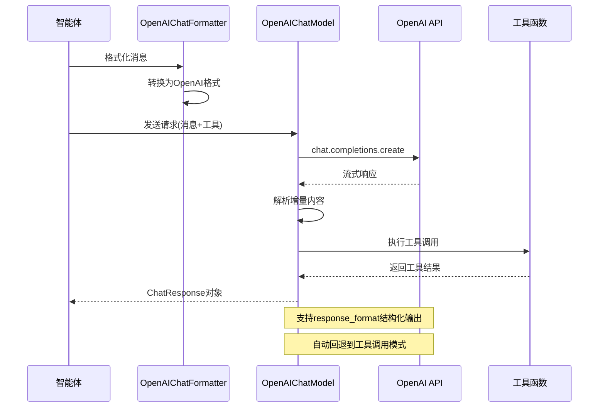
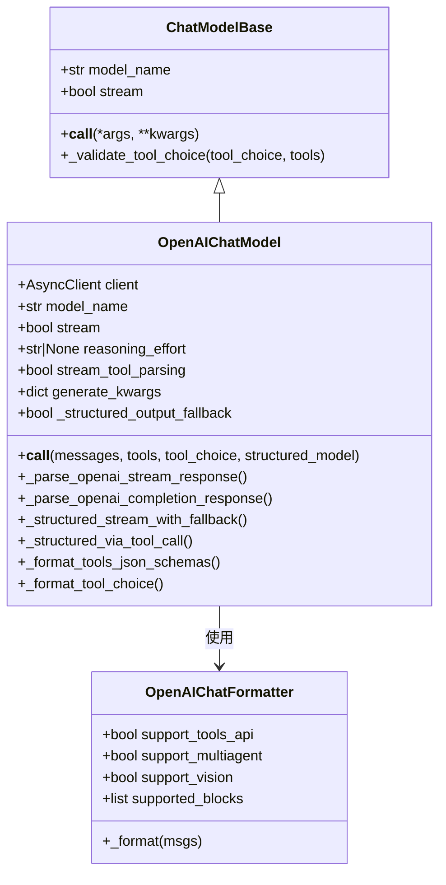
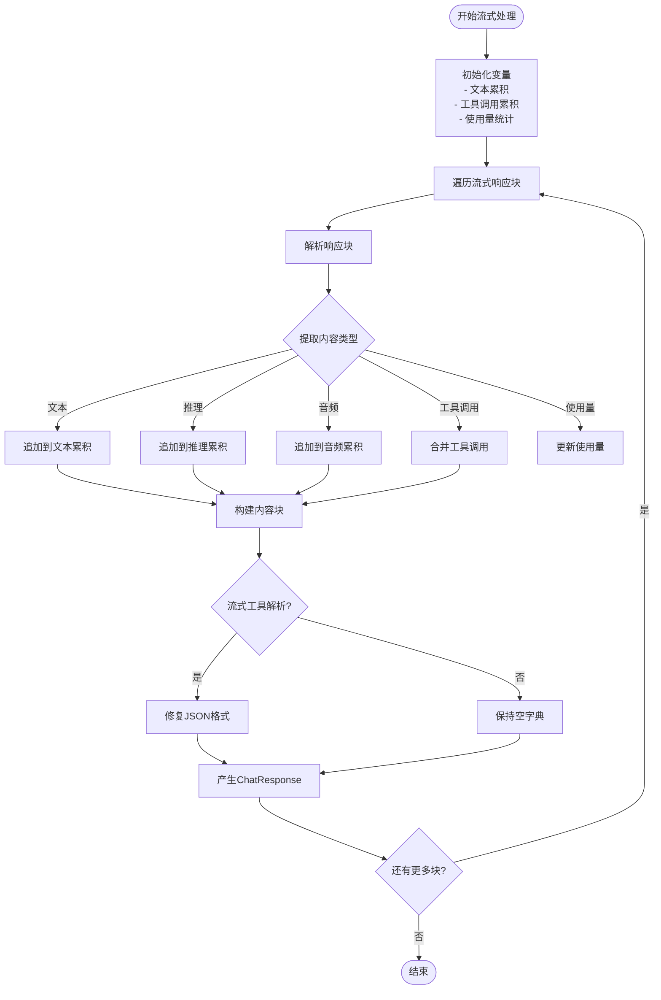
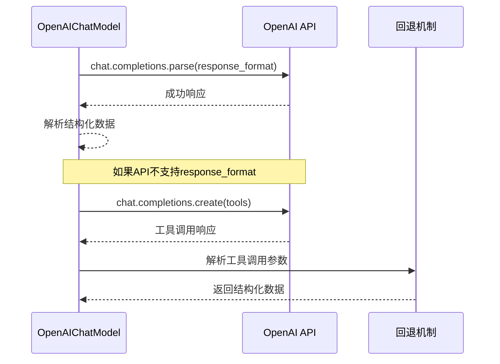
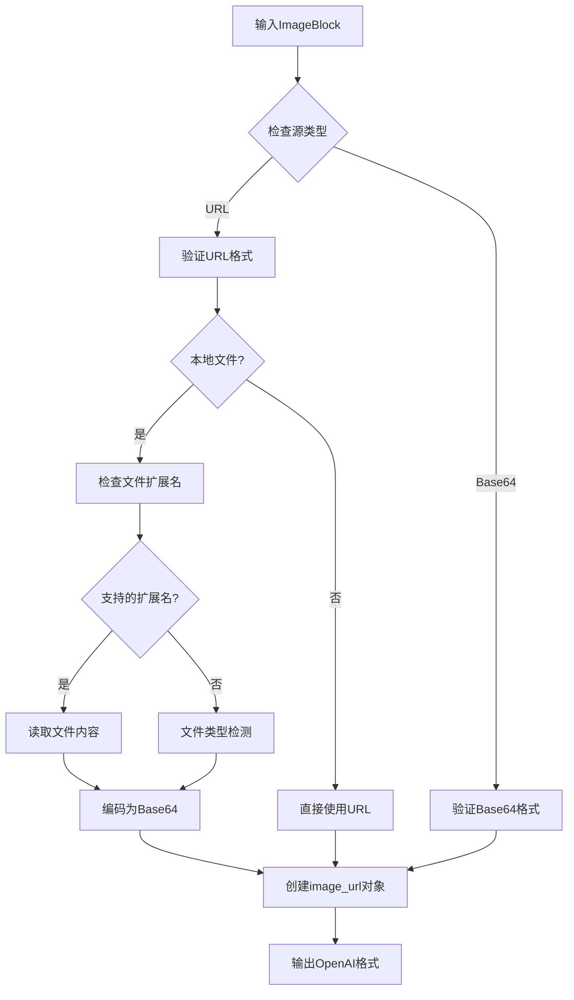
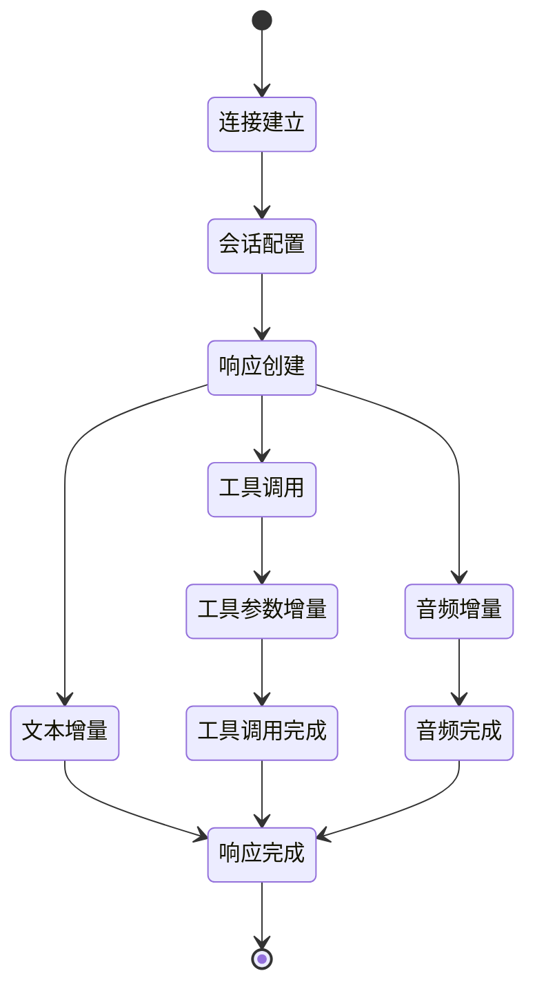
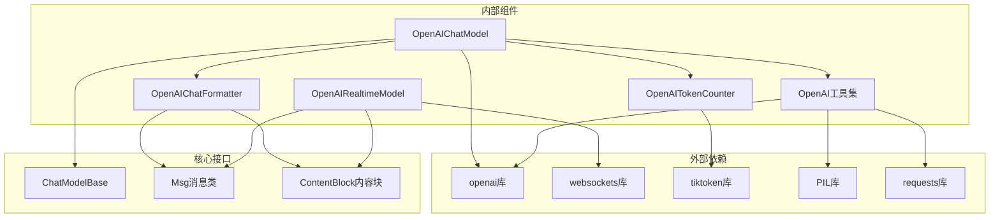

# OpenAI模型适配器

<cite>
**本文档引用的文件**
- [src/agentscope/model/_openai_model.py](file://src/agentscope/model/_openai_model.py)
- [src/agentscope/formatter/_openai_formatter.py](file://src/agentscope/formatter/_openai_formatter.py)
- [src/agentscope/token/_openai_token_counter.py](file://src/agentscope/token/_openai_token_counter.py)
- [src/agentscope/realtime/_openai_realtime_model.py](file://src/agentscope/realtime/_openai_realtime_model.py)
- [src/agentscope/tool/_multi_modality/_openai_tools.py](file://src/agentscope/tool/_multi_modality/_openai_tools.py)
- [src/agentscope/model/_model_base.py](file://src/agentscope/model/_model_base.py)
- [src/agentscope/message/_message_base.py](file://src/agentscope/message/_message_base.py)
- [tests/model_openai_test.py](file://tests/model_openai_test.py)
- [tests/tool_openai_test.py](file://tests/tool_openai_test.py)
- [examples/functionality/structured_output/main.py](file://examples/functionality/structured_output/main.py)
</cite>

## 目录
1. [简介](#简介)
2. [项目结构](#项目结构)
3. [核心组件](#核心组件)
4. [架构概览](#架构概览)
5. [详细组件分析](#详细组件分析)
6. [依赖关系分析](#依赖关系分析)
7. [性能考虑](#性能考虑)
8. [故障排除指南](#故障排除指南)
9. [结论](#结论)
10. [附录](#附录)

## 简介
本文件为AgentScope项目中的OpenAI模型适配器提供全面技术文档。该适配器实现了对OpenAI GPT系列模型的完整支持，包括：
- Chat Completions API集成与认证
- 流式响应处理机制（增量输出解析、事件处理、连接管理）
- 工具调用集成（函数调用模式、参数传递、结果返回）
- 结构化输出生成（基于response_format和工具调用回退）
- 多模态能力支持（图像、音频、文本）
- 实时语音交互支持（WebRTC实时模型）

## 项目结构
AgentScope采用模块化设计，OpenAI适配器相关代码主要分布在以下目录：

```mermaid
graph TB
subgraph "模型层"
A[_openai_model.py<br/>OpenAIChatModel类]
B[_model_base.py<br/>ChatModelBase基类]
end
subgraph "格式化层"
C[_openai_formatter.py<br/>消息格式化器"]
end
subgraph "工具层"
D[_openai_tools.py<br/>多模态工具函数"]
end
subgraph "实时层"
E[_openai_realtime_model.py<br/>实时语音模型"]
end
subgraph "辅助组件"
F[_openai_token_counter.py<br/>令牌计数器"]
G[_message_base.py<br/>消息基础类"]
end
A --> B
A --> C
A --> D
A --> E
A --> F
C --> G
```

**图表来源**
- [src/agentscope/model/_openai_model.py:71-795](file://src/agentscope/model/_openai_model.py#L71-L795)
- [src/agentscope/formatter/_openai_formatter.py:168-541](file://src/agentscope/formatter/_openai_formatter.py#L168-L541)

**章节来源**
- [src/agentscope/model/_openai_model.py:1-795](file://src/agentscope/model/_openai_model.py#L1-L795)
- [src/agentscope/formatter/_openai_formatter.py:1-541](file://src/agentscope/formatter/_openai_formatter.py#L1-L541)

## 核心组件
OpenAI模型适配器由多个核心组件构成，每个组件负责特定的功能领域：

### 主要组件职责
- **OpenAIChatModel**: 主要的聊天模型适配器，处理API调用、响应解析、流式处理
- **OpenAIChatFormatter**: 消息格式化器，将内部消息转换为OpenAI API格式
- **OpenAIRealtimeModel**: 实时语音模型，支持WebRTC实时交互
- **OpenAITokenCounter**: 令牌计数器，计算消息和工具的令牌消耗
- **OpenAI工具集**: 多模态工具函数，封装OpenAI API的各种功能

**章节来源**
- [src/agentscope/model/_openai_model.py:71-174](file://src/agentscope/model/_openai_model.py#L71-L174)
- [src/agentscope/formatter/_openai_formatter.py:168-190](file://src/agentscope/formatter/_openai_formatter.py#L168-L190)
- [src/agentscope/realtime/_openai_realtime_model.py:19-40](file://src/agentscope/realtime/_openai_realtime_model.py#L19-L40)

## 架构概览



**图表来源**
- [src/agentscope/model/_openai_model.py:176-343](file://src/agentscope/model/_openai_model.py#L176-L343)
- [src/agentscope/formatter/_openai_formatter.py:219-371](file://src/agentscope/formatter/_openai_formatter.py#L219-L371)

## 详细组件分析

### OpenAIChatModel类分析

OpenAIChatModel是整个适配器的核心，继承自ChatModelBase，提供了完整的OpenAI API集成。

#### 类结构图



**图表来源**
- [src/agentscope/model/_model_base.py:13-78](file://src/agentscope/model/_model_base.py#L13-L78)
- [src/agentscope/model/_openai_model.py:71-795](file://src/agentscope/model/_openai_model.py#L71-L795)
- [src/agentscope/formatter/_openai_formatter.py:168-190](file://src/agentscope/formatter/_openai_formatter.py#L168-L190)

#### 初始化参数详解

OpenAIChatModel支持丰富的初始化参数配置：

| 参数名称 | 类型 | 默认值 | 描述 |
|---------|------|--------|------|
| model_name | str | 必需 | OpenAI模型名称（如gpt-4o、gpt-3.5-turbo） |
| api_key | str | None | API密钥，可从环境变量读取 |
| stream | bool | True | 是否启用流式响应 |
| reasoning_effort | Literal["low","medium","high"] | None | 推理强度设置 |
| organization | str | None | 组织ID |
| stream_tool_parsing | bool | True | 流式工具解析开关 |
| client_type | Literal["openai","azure"] | "openai" | 客户端类型选择 |
| client_kwargs | dict | None | 客户端初始化参数 |
| generate_kwargs | dict | None | 生成参数 |

#### 流式响应处理机制

流式响应处理是OpenAIChatModel的核心特性之一，实现了增量输出解析和事件管理：



**图表来源**
- [src/agentscope/model/_openai_model.py:346-560](file://src/agentscope/model/_openai_model.py#L346-L560)

#### 结构化输出生成

OpenAIChatModel支持两种结构化输出生成方式：

1. **response_format模式**：直接使用OpenAI的结构化输出功能
2. **工具调用回退模式**：当API不支持时自动回退到工具调用



**图表来源**
- [src/agentscope/model/_openai_model.py:271-327](file://src/agentscope/model/_openai_model.py#L271-L327)
- [src/agentscope/model/_openai_model.py:683-728](file://src/agentscope/model/_openai_model.py#L683-L728)

**章节来源**
- [src/agentscope/model/_openai_model.py:71-795](file://src/agentscope/model/_openai_model.py#L71-L795)

### OpenAIChatFormatter类分析

OpenAIChatFormatter负责将内部消息格式转换为OpenAI API所需的格式，支持多种内容类型：

#### 支持的内容类型

| 内容类型 | 描述 | OpenAI格式映射 |
|---------|------|---------------|
| TextBlock | 文本内容 | 字符串或对象 |
| ImageBlock | 图像内容 | image_url对象 |
| AudioBlock | 音频内容 | input_audio对象 |
| ToolUseBlock | 工具调用 | tool_calls数组 |
| ToolResultBlock | 工具结果 | tool角色消息 |

#### 图像格式转换流程



**图表来源**
- [src/agentscope/formatter/_openai_formatter.py:27-114](file://src/agentscope/formatter/_openai_formatter.py#L27-L114)

**章节来源**
- [src/agentscope/formatter/_openai_formatter.py:168-541](file://src/agentscope/formatter/_openai_formatter.py#L168-L541)

### OpenAIRealtimeModel类分析

OpenAIRealtimeModel实现了WebRTC实时语音交互功能，支持多模态输入和输出：

#### 支持的输入模态

| 模态类型 | 描述 | 格式要求 |
|---------|------|----------|
| audio | 音频输入 | PCM格式，24kHz采样率 |
| text | 文本输入 | UTF-8字符串 |
| tool_result | 工具结果 | JSON格式 |

#### 实时事件处理流程



**图表来源**
- [src/agentscope/realtime/_openai_realtime_model.py:240-401](file://src/agentscope/realtime/_openai_realtime_model.py#L240-L401)

**章节来源**
- [src/agentscope/realtime/_openai_realtime_model.py:19-485](file://src/agentscope/realtime/_openai_realtime_model.py#L19-L485)

### OpenAI工具集分析

OpenAI工具集提供了完整的多模态功能封装：

#### 支持的工具功能

| 工具函数 | 功能描述 | 输入参数 | 输出类型 |
|---------|----------|----------|----------|
| openai_text_to_image | 文本转图像 | prompt, api_key, n, model, size, quality, style, response_format | ImageBlock列表 |
| openai_edit_image | 图像编辑 | image_url, prompt, api_key, model, mask_url, n, size, response_format | ImageBlock列表 |
| openai_create_image_variation | 图像变体生成 | image_url, api_key, n, model, size, response_format | ImageBlock列表 |
| openai_image_to_text | 图像转文本 | image_urls, api_key, prompt, model | TextBlock |
| openai_text_to_audio | 文本转语音 | text, api_key, model, voice, speed, res_format | AudioBlock |
| openai_audio_to_text | 音频转文本 | audio_file_url, api_key, language, temperature | TextBlock |

**章节来源**
- [src/agentscope/tool/_multi_modality/_openai_tools.py:1-673](file://src/agentscope/tool/_multi_modality/_openai_tools.py#L1-L673)

## 依赖关系分析



**图表来源**
- [src/agentscope/model/_openai_model.py:150-168](file://src/agentscope/model/_openai_model.py#L150-L168)
- [src/agentscope/realtime/_openai_realtime_model.py:161-162](file://src/agentscope/realtime/_openai_realtime_model.py#L161-L162)
- [src/agentscope/token/_openai_token_counter.py:327-332](file://src/agentscope/token/_openai_token_counter.py#L327-L332)

**章节来源**
- [src/agentscope/model/_model_base.py:1-78](file://src/agentscope/model/_model_base.py#L1-L78)
- [src/agentscope/message/_message_base.py:21-242](file://src/agentscope/message/_message_base.py#L21-L242)

## 性能考虑

### 连接池管理
- 使用异步客户端避免阻塞
- 合理设置超时时间防止连接挂起
- 实现重试机制处理临时性错误

### 请求优化策略
- 批量处理减少API调用次数
- 智能缓存常用工具定义
- 令牌预估避免超出限制

### 流式处理优化
- 分块传输减少内存占用
- 异步解析提升响应速度
- 错误恢复机制保证稳定性

## 故障排除指南

### 常见问题及解决方案

| 问题类型 | 症状 | 可能原因 | 解决方案 |
|---------|------|----------|----------|
| 认证失败 | 401错误 | API密钥无效或过期 | 检查环境变量OPENAI_API_KEY |
| 超时错误 | TimeoutError | 网络延迟或API拥堵 | 增加超时时间，实现重试 |
| 工具调用失败 | Tool call error | 参数格式错误 | 验证工具schema定义 |
| 流式解析异常 | JSON解析错误 | 部分JSON数据 | 启用流式工具解析修复 |

**章节来源**
- [tests/model_openai_test.py:1-491](file://tests/model_openai_test.py#L1-L491)
- [tests/tool_openai_test.py:1-690](file://tests/tool_openai_test.py#L1-L690)

## 结论

AgentScope的OpenAI模型适配器提供了完整的GPT系列模型集成解决方案，具有以下优势：

1. **功能完整性**：支持聊天、工具调用、结构化输出、多模态、实时语音等所有核心功能
2. **架构灵活性**：模块化设计便于扩展和维护
3. **性能优化**：流式处理、异步操作、智能缓存等优化措施
4. **易用性**：简洁的API接口和完善的错误处理机制

该适配器为智能体应用提供了强大的语言模型能力，支持从简单对话到复杂多模态交互的各种应用场景。

## 附录

### 集成示例

#### 基础对话集成
```python
# 创建OpenAI模型实例
model = OpenAIChatModel(
    model_name="gpt-4o",
    api_key="your-api-key",
    stream=True
)

# 准备消息
messages = [
    {"role": "system", "content": "你是有用的助手"},
    {"role": "user", "content": "你好"}
]

# 获取响应
response = await model(messages)
print(response.content)
```

#### 工具调用集成
```python
# 定义工具
tools = [
    {
        "type": "function",
        "function": {
            "name": "get_weather",
            "description": "获取天气信息",
            "parameters": {
                "type": "object",
                "properties": {
                    "location": {"type": "string"}
                },
                "required": ["location"]
            }
        }
    }
]

# 执行带工具调用的对话
response = await model(messages, tools=tools, tool_choice="auto")
```

#### 结构化输出集成
```python
from pydantic import BaseModel, Field

class PersonSchema(BaseModel):
    name: str = Field(description="姓名")
    age: int = Field(description="年龄")

# 生成结构化数据
response = await model(messages, structured_model=PersonSchema)
structured_data = response.metadata
```

**章节来源**
- [examples/functionality/structured_output/main.py:37-81](file://examples/functionality/structured_output/main.py#L37-L81)